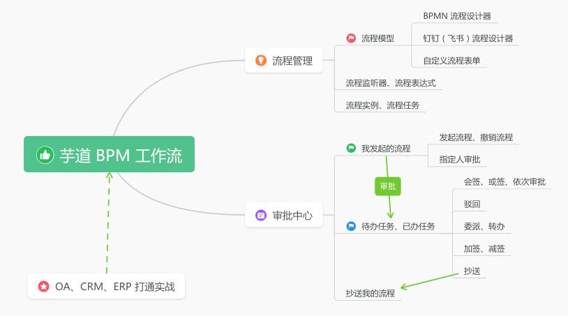
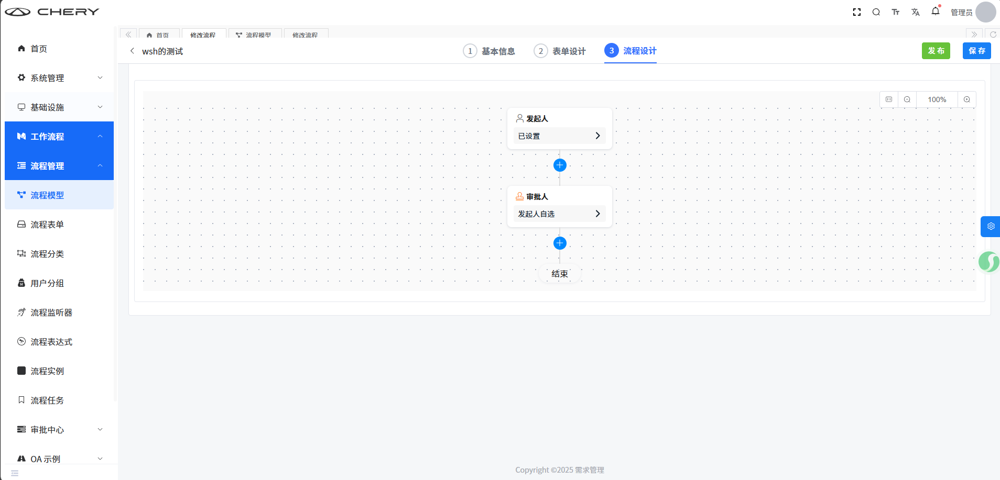
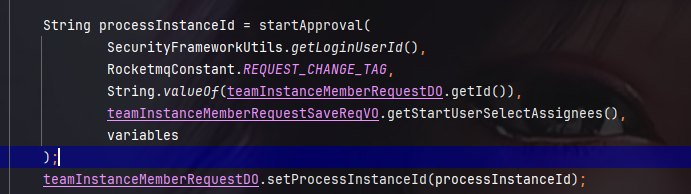
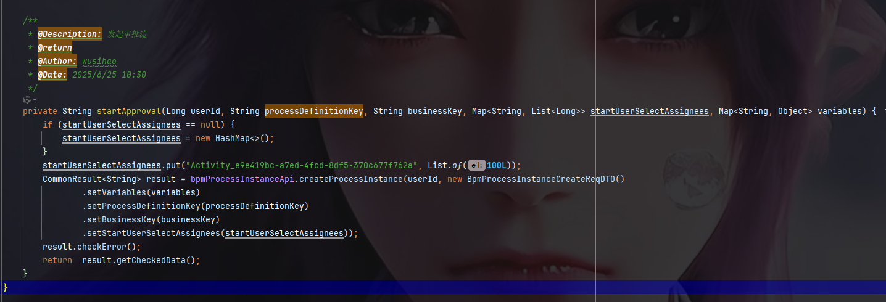

### [入门指南 · Flowable 中文文档](https://flowable.me/bpmn/ch02-GettingStarted/)

### 基本概念

**流程定义**：从*流程定义*中,可以启动许多**流程实例**

**流程实例**：是业务流程的一个具体执行实例，它代表了一次从流程启动到结束的完整业务流程执行过程。

**流程节点**: 代表流程中的一个步骤或状态。

**功能描述**



- ① 【流程表单】：在线配置动态表单，无需建表与开发
- ② 【业务表单】：业务需建立独立的数据库表，并开发对应的表单、详情界面

| 功能列表         | 功能描述                                                     |
| ---------------- | ------------------------------------------------------------ |
| SIMPLE 设   计器 | 仿钉钉/飞书设计器，支持拖拽搭建表单流程，10 分钟快速完成审批流程配置 |
| BPMN 设计器      | 基于 BPMN 标准开发，适配复杂业务场景，满足多层级审批及流程自动化需求 |
| 会签             | 同一个审批节点设置多个人（如 A、B、C 三人，三人会同时收到待办任务），需全部同意之后，审批才可到下一审批节点 |
| 或签             | 同一个审批节点设置多个人，任意一个人处理后，就能进入下一个节点 |
| 依次审批         | （顺序会签）同一个审批节点设置多个人（如 A、B、C 三人），三人按顺序依次收到待办，即 A 先审批，A 提交后 B 才能审批，需全部同意之后，审批才可到下一审批节点 |
| 抄送             | 将审批结果通知给抄送人，同一个审批默认排重，不重复抄送给同一人 |
| 驳回             | （退回）将审批重置发送给某节点，重新审批。可驳回至发起人、上一节点、任意节点 |
| 转办             | A 转给其 B 审批，B 审批后，进入下一节点                      |
| 委派             | A 转给其 B 审批，B 审批后，转给 A，A 继续审批后进入下一节点  |
| 加签             | 允许当前审批人根据需要，自行增加当前节点的审批人，支持向前、向后加签 |
| 减签             | （取消加签）在当前审批人操作之前，减少审批人                 |
| 撤销             | （取消流程）流程发起人，可以对流程进行撤销处理               |
| 终止             | 系统管理员，在任意节点终止流程实例                           |
| 表单权限         | 支持拖拉拽配置表单，每个审批节点可配置只读、编辑、隐藏权限   |
| 超时审批         | 配置超时审批时间，超时后自动触发审批通过、不通过、驳回等操作 |
| 自动提醒         | 配置提醒时间，到达时间后自动触发短信、邮箱、站内信等通知提醒，支持自定义重复提醒频次 |
| 父子流程         | 主流程设置子流程节点，子流程节点会自动触发子流程。子流程结束后，主流程才会执行（继续往下下执行），支持同步子流程、异步子流程 |
| 条件分支         | （排它分支）用于在流程中实现决策，即根据条件选择一个分支执行 |
| 并行分支         | 允许将流程分成多条分支，不进行条件判断，所有分支都会执行     |
| 包容分支         | （条件分支 + 并行分支的结合体）允许基于条件选择多条分支执行，但如果没有任何一个分支满足条件，则可以选择默认分支 |
| 路由分支         | 根据条件选择一个分支执行（重定向到指定配置节点），也可以选择默认分支执行（继续往下执行） |
| 触发节点         | 执行到该节点，触发 HTTP 请求、HTTP 回调、更新数据、删除数据等 |
| 延迟节点         | 执行到该节点，审批等待一段时间再执行，支持固定时长、固定日期等 |
| 拓展设置         | 流程前置/后置通知，节点（任务）前置、后置通知，流程报表，自动审批去重，自定流程编号、标题、摘要，流程报表等 |

### 审批接入（业务表单）

#### 1：配置流程模板




### 常用操作

#### 部署流程定义

要构建的流程是一个非常简单的休假申请流程。Flowable 引擎要求流程以 BPMN 2.0 格式定义,这是一个在行业中被广泛接受的 XML 标准。 在 Flowable 术语中,我们称之为**流程定义**。从*流程定义*中,可以启动许多**流程实例**。将*流程定义*视为许多流程执行的蓝图。在这个特定的例子中,*流程定义*定义了请假所涉及的不同步骤,而一个*流程实例*匹配一个特定员工的休假请求。

BPMN 2.0 以 XML 格式存储,但它也有可视化部分:它以标准方式定义了如何表示每种不同的步骤类型(人工任务、自动服务调用等)以及如何将这些不同的步骤相互连接。通过这种方式,BPMN 2.0 标准允许技术人员和业务人员以双方都能理解的方式交流业务流程。

我们要使用的流程定义如下:


假设流程是通过提供一些信息来启动的,比如员工姓名、请假天数和描述。当然,这可以建模为流程中的第一个独立步骤。 但是,通过将其作为流程的"输入数据",只有在发出实际请求时才会创建流程实例。在替代情况下,用户可能会在提交前改变主意并取消,但现在流程实例将存在。 在某些场景中,这可能是有价值的信息(例如,有多少次请求被启动但未完成),这取决于业务目标。

- 左边的圆圈称为**开始事件**。它是流程实例的起点。
- 第一个矩形是**用户任务**。这是流程中需要人类用户执行的步骤。在这种情况下,经理需要批准或拒绝请求。
- 根据经理的决定,**排他网关**(带有十字的菱形)将根据流程实例路由到批准或拒绝路径。
- 如果批准,我们必须在某个外部系统中注册请求,然后是另一个用户任务,通知原始员工决定。 当然,这可以替换为电子邮件。
- 如果被拒绝,会向员工发送一封电子邮件通知他们这一点。

通常,这样的*流程定义*是使用可视化建模工具建模的,例如 Flowable Designer(Eclipse)或 Flowable Modeler(Web 应用程序)。

* 要将流程定义*部署*到 Flowable 引擎,使用 *RepositoryService*,它可以从 *ProcessEngine* 对象获取。使用 *RepositoryService*,通过传递 XML 文件的位置并调用 *deploy()* 方法来实际执行它,从而创建新的 *Deployment*:

```java
RepositoryService repositoryService = processEngine.getRepositoryService();
Deployment deployment = repositoryService.createDeployment()
  .addClasspathResource("holiday-request.bpmn20.xml")
  .deploy();
```

* 可以通过 API 查询来验证流程定义是否被引擎知晓(并了解一些关于 API 的知识)。这是通过 *RepositoryService* 创建新的 *ProcessDefinitionQuery* 对象来完成的。

```java
ProcessDefinition processDefinition = repositoryService.createProcessDefinitionQuery()
  .deploymentId(deployment.getId())
  .singleResult();
System.out.println("Found process definition : " + processDefinition.getName());
```


#### 启动流程实例

现在已经将流程定义*部署*到流程引擎,因此可以使用这个*流程定义*作为"蓝图"来启动*流程实例*。

要启动流程实例,我们需要提供一些初始的*流程变量*。通常,你会通过呈现给用户的表单或通过 REST API(当流程由某些自动化触发时)获取这些数据。

接下来,可以通过 *RuntimeService* 启动一个*流程实例*。收集的数据作为 *java.util.Map* 实例传递,其中键是稍后用于检索变量的标识符。使用*键*启动流程实例。这个*键*匹配在 BPMN 2.0 XML 文件中设置的 *id* 属性,在本例中是 *holidayRequest*。

```xml
<process id="holidayRequest" name="Holiday Request" isExecutable="true">
```

```xml
RuntimeService runtimeService = processEngine.getRuntimeService();

Map<String, Object> variables = new HashMap<String, Object>();
variables.put("employee", employee);
variables.put("nrOfHolidays", nrOfHolidays);
variables.put("description", description);
ProcessInstance processInstance =
  runtimeService.startProcessInstanceByKey("holidayRequest", variables);
```


#### TaskService

和任务运行相关的服务 

* complete：当前节点任务完成，将任务推送至下一流程

#### processEngine

流程引擎核心类

### 芋道工作流使用方法

#### 发起审批流程





**userId**: 当前发起审批流的审批人用户id（当前登录用户）

**processDefinitionKey**：流程定义的唯一标识。用于区分不同的流程。存储的是rocketmq的接收器的tag

**businessKey**：业务系统中的唯一标识（如订单号、客户 ID）。

**variables**：为新启动的流程实例传递**流程变量**。这些变量在流程执行过程中可以被各个节点（如任务、网关、服务节点等）引用，用于控制流程逻辑、存储业务数据或在不同组件间传递信息。

* 控制流程逻辑：流程变量可用于条件判断（如网关的条件分支），决定流程走向。例如：

```java
// 变量决定流程是否需要审批
variables.put("needApproval", true); 
```

* 存储业务数据: 承载与业务相关的数据，避免流程与业务逻辑强耦合。例如

```java
// 订单流程中传递订单ID
variables.put("orderId", "ORD-20250625"); 
```

* 流程中的任务、服务节点可读取或修改变量，实现数据共享。例如：

```java
// 服务节点处理时获取变量
String orderId = (String) taskService.getVariable(taskId, "orderId");
```

如图：


这里写为*表达式*的条件形式为 *${approved}*,这是 *${approved == true}* 的简写。变量 'approved' 被称为**流程变量**。*流程变量*是与流程实例一起存储的持久数据,可以在流程实例的生命周期内使用。在这种情况下,这确实意味着我们将必须在流程实例中的某个时刻(当经理用户任务被提交时,或者用 Flowable 术语说,*完成*时)设置这个*流程变量*,因为这不是流程实例启动时可用的数据。

**startUserSelectAssignees**: 选择将任务指派的人员集合，key：活动节点id(activity_Id前端传入）, 为每个流程节点的唯一标识, value：指派的具体用户id

#### 得到审批结果

```java
@Component
@Slf4j
@RocketMQMessageListener(topic = REQUEST_CHANGE_TOPIC,
                        consumerGroup = REQUEST_CONSUMER_GROUP,
                        selectorExpression = REQUEST_CHANGE_TAG,
                        selectorType = SelectorType.TAG)
public class RequestApplicationListener implements RocketMQListener<BpmProcessInstanceStatusListenerEvent> {

    @Resource
    private TeamInstanceMemberRequestMapper teamInstanceMemberRequestMapper;
    @Resource
    private TeamInstanceMemberMapper teamInstanceMemberMapper;
    @Resource
    private TeamInstanceMemberChangeMapper teamInstanceMemberChangeMapper;;
    @Resource
    private TeamMemberRateService teamMemberRateService;
    @Override
    @Transactional(rollbackFor = Exception.class)
    public void onMessage(BpmProcessInstanceStatusListenerEvent event) {
        log.info("收到人员变更审批结果:{}", event);
        TenantContextHolder.setTenantId(event.getTenantId());
        Long teamInstanceMemberRequestId = Long.parseLong(event.getBusinessKey());
        TeamInstanceMemberRequestDO teamInstanceMemberRequestDO = teamInstanceMemberRequestMapper.selectById(teamInstanceMemberRequestId);
        if (teamInstanceMemberRequestDO == null) return;
        Long originMemberId = teamInstanceMemberRequestDO.getOriginMemberId();
        TeamInstanceMemberDO originTeamInstanceMemberDO = teamInstanceMemberMapper.selectById(originMemberId);
        Integer status = event.getStatus();
        teamInstanceMemberRequestDO.setProcessStatus(String.valueOf(status));
        LambdaUpdateWrapper<TeamInstanceMemberDO> originMemberUpdateWrapper = Wrappers.lambdaUpdate(TeamInstanceMemberDO.class)
                .eq(TeamInstanceMemberDO::getId, originMemberId);
        if (BpmTaskStatusEnum.APPROVE.getStatus().equals(status)) {
            // 审批通过
            // 修改人员状态
            originMemberUpdateWrapper.set(TeamInstanceMemberDO::getStatus, TeamMemberStatusEnum.CHANGED.getCode());
            teamInstanceMemberMapper.update(originMemberUpdateWrapper);
            // 添加变更记录
            String projectId = teamInstanceMemberRequestDO.getProjectId();
            teamInstanceMemberChangeMapper.insert(TeamInstanceMemberChangeDO.builder()
                    .projectId(projectId)
                    .originMemberId(originMemberId)
                    .currentMemberId(teamInstanceMemberRequestDO.getCurrentMemberId())
                    .status(TeamMemberStatusEnum.CHANGED.getCode())
                    .changeTime(LocalDateTime.now())
                    .build());
            teamInstanceMemberRequestMapper.updateById(teamInstanceMemberRequestDO);
            // 人员变更和释放之后，将数据改为无效状态
            teamMemberRateService.changeStatus(projectId, originTeamInstanceMemberDO.getUserId());
            log.info("人员变更审批成功:{}", teamInstanceMemberRequestDO);
        }
    }
}
```

**REQUEST_CHANGE_TAG**: 发起审批中的**processDefinitionKey**