## 自我介绍

#### 自我介绍

我是来自九江学院软件工程专业的应届本科生。擅长 Java 后端，也会前端的页面编写，自己独立开发过项目，也有项目上线的经验。具有半年实习经验。实习过程中开发过两个项目。

其中一个是物业管理平台，基于SpringCloud微服务的前后端分离项目。我主要负责与客户沟通明确客户需求，负责PC端、小程序的数据库设计以及后端接口的开发。

就比如说：对于要实现不同登录的方式比如微信登录，支付宝登录。若每增加一种登录方式就要在原有的登录接口上发生修改，耦合度太高。所以我使用了策略模式 + 工厂模式 + Spring配置话 来优化登录方式。具体是首先在 yml 配置文件中定义键值对，比如对于微信登录方式，键是 wx 值是微信登录方式的具体实现类，以此类推。然后编写登录接口以及具体的实现类，其次再建造一个工厂，它的作用是在项目初始化时就将配置文件中的用户的登录方式存到 Map 集合中，根据用户登录时传入的具体登录方式，拿到 Map 中的登录具体实现类。

对于用户点赞功能，因为点赞功能比较频繁使用，所以使用 Redis 先暂存点赞，然后使用 XXL-JOB 定时任务定时清理 Redis 的内容，同时因为像园林养护，业主反馈这样的点赞是存入的不同数据库，所以使用线程池来缩短时间。

另一个是三项安全管理系统，基于SpringBoot的前后端分离项目。他就像有一批学员，要经过一系列审核流程。我主要完成与用户沟通明确需求数据库设计以及后端接接口开发。

因为审核流程是严格限制了的，所以使用责任链设计模式来固定审核流程。具体实现方式是定义一个抽象类，里面定义一个 next 方法用来指定审核流程，然后再在此抽象类中定义一个处理抽象方法。其他处理实现类都继承此抽象类，在管理员添加学员提交之后便规定好审核步骤。

我先来简单介绍一下 仿 CSDN 项目，这是一个基于SpringCloud的微服务前后端微服务项目。前后端完全由我一人编写。写它的原因是大二的时候发现学了很多的知识，但都仅限于理论未落实到实践，所以我就想写一个项目把所学的都用上，开始想的是写博客，但发现博客需要使用的技术太少了，不符合我的目标。所以就决定写一个类似 CSDN 的学习交流平台。所以此项目用到的技术栈很多。它主要包括社区、课程、资源、问答、文章、用户模块。其中社区除了用户使用的，还有一个社区管理系统。课程有购买课程，还有课程播放，弹幕功能。资源也有购买功能。课程和资源都是使用支付宝沙箱支付，以及阿里云存取视频和资源。

还有一个代码生成器。他是一个基于 **SpringBoot** + **Picocli** + **FreeMarker** + **对象存储**的代码生成器共享平台 **。** 开发者可以在线制作发布代码生成器，用户可以搜索、下载、在线使用生成器，管理员可以集中管理所有用户和生成器。

在本科阶段也参加过算法竞赛以及数学竞赛均有获奖

## 仿 CSDN 学习交流平台：

* 搭建 Redis 集群，保证 Redis 高可用，并防止缓存雪崩。
* 防止用户查询不存在的资源防止访存穿透
* 用户排行榜：更新时因为数据的还未从数据库中整理出来，所以在存入数据的时候设置了一个逻辑过期字段，当数据未更新完时拿到互斥锁并直接返回之前的数据，同时新开一个新的线程用来更新最新的数据到 Redis 中解决缓存击穿的问题，Redis 得到最新的数据之前其他访问请求都会访问之前的旧数据，直到 Redis 数据更新成功，并撤销互斥锁，以解决缓存击穿的问题
* 基于 **RBAC** 模型使用 **Jwt** + **SpringSecurity** + **Redis** 以及**自定义权限注解**完成登录验证和权限校验, 支持**用户邮箱**与**手机号短信**登录。

​      用户登录时通过实现接口 UserDetailsService 查找用户具有的权限存入 Redis 中，通过自定义权限在Redis中校验用户权限

* 使用 **WebSocket** + **Redis** + **Rabbitmq** 死信队列 完成在线聊天与课程实时弹幕功能

  Redis 缓存2分钟弹幕信息，并使用Rabbitmq死信队列将弹幕存入数据库中，实现弹幕只可以在两分钟内撤回。

* 使用**策略模式** + **工厂模式** + **Spring 配置化**实现多种支付方式：如支付宝沙箱支付等，使用 **Rabbitmq 死信队列**完成当用户在一定时间内未支付更新订单状态，使用 **Redisson 分布式锁**解决订单限购并保证用户下单的幂等性。使用**线程池**优化下单完成界面的查询速度。

  定义支付接口，并使用多种支付方式实现接口。以支付方式为键，具体支付接口实现类名为值定义配置文件，同时定义一个工厂实现 ApplicationContextAware 重写 setApplicationContext 方法，用于在项目启动时以用户传入的支付方式为键，具体支付方式的实现类为值存入Map中，然后通过选择的的支付方式拿到对应的实现类。假如还有最后一份订单，此时有两个人同时下单为了防止两份订单都下单成功，同时防止一个用户在极少的实践内同时重复点击下单。所以使用 Redisson 分布式锁来保证用户下单的幂等性。下单完成界面有订单信息，商品信息，用户信息可以使用线程池分别查询不同的信息。

* 为了加快统计数据同步到 **MySql**，使用 **线程池** + **Future** + **Redis** +  **XXL-JOB** 定时统计用户的发布文章数、点赞数、收藏数、评论数等。

 	用户的内容每次进行点赞，评论操作时使Redis中记录用户在这段时间内获得的点赞，收藏总数。因为在Redis中拿到记录点赞数，收藏数的操作独立，故使用 XXL-JOB +  线程池 使用不同的线程分别统计在此段时间内用户新增的文章数、点赞数、收藏数、评论数等，更新到数据库中。

* 使用 **XXL-JOB + Redis** 实现社区排行榜定时更新，用户 VIP 过期定时更新、以及热门标签定时更新等。

更新用户VIP要用到Redis改变用户身份，以及热门标签存在Redis中。

## 三项安全管理项目

- 对于十几个审核流程且项目按审核流程顺序执行，所以使用**责任链模式**规范审核流程，同时方便扩展新的审核流程。

审核流程：先定义一个 Hander 抽象类，实现 Next（下一个审核流程） 方法，以及一个抽象的 process 审核方法。对于每个审核流程都实现具体的 process  方法，然后在审核开始的地方规定审核步骤。

## 物业管理系统

- 使用 **WebSocket** + **Redis** 完成系统通知的实时推送（如业主反馈、物业缴费、漏气监控等）。

  Redis 中存了用户的登录信息，在 Redis 中查看用户是否登录若已登录则用 WebSocket 发送消息，否则将消息存入数据库中。

* 使用 **线程池** + **Redis** + **XXL-JOB** 完成设备养护、卫生清洁等批量点赞操作。

  首先将用户点赞信息存入 Redis 中，使用XXL-JOB定时任务定期清理Redis中的缓存，对于不同类型的点赞操作使用线程池优化程序性能。

- 为了避免每次增加登录方式都要修改代码。使用**策略模式** +**工厂模式** + **Spring配置化**实现多种登录方式功能，方便日后增加登录方式。

  定义登录接口，并使用多种登录方式实现接口。以登录方式为键，具体登录接口实现类名为值定义配置文件，同时定义一个工厂实现 ApplicationContextAware 重写 setApplicationContext 方法，用于在项目启动时以用户传入的登录方式为键，具体登录方式的实现类为值存入Map中，然后通过用户输入的登录方式拿到对应的实现类。

## 个人技能

#### Java基础

##### OOP面向对象

面向对象是利于语言对现实事物进行抽象。面向对象具有以下特征：

* 继承**：**继承是从已有类得到继承信息创建新类的过程

* 封装：封装是把数据和操作数据的方法绑定起来，对数据的访问只能通过已定义的接口

* 多态性：多态性是指允许不同子类型的对象对同一消息作出不同的响应

##### **重载与重写区别**

* 重载发生在本类，重写发生在父类与子类之间

* 重载的方法名必须相同，重写的方法名相同且返回值类型必须相同

* 重载的参数列表不同，重写的参数列表必须相同

* 重写的访问权限不能比父类中被重写的方法的访问权限更低

* 构造方法不能被重写

##### 接口与抽象类的区别

* 抽象类要被子类继承，接口要被类实现

* 接口可多继承接口，但类只能单继承

* 抽象类可以有构造器、接口不能有构造器

* 抽象类：除了不能实例化抽象类之外，它和普通 Java 类没有任何区别

* 抽象类：抽象方法可以有 public、protected 和 default 这些修饰符、接口：只能是 public

* 抽象类：可以有成员变量；接口：只能声明常量

##### 深拷贝与浅拷贝

**浅拷贝**

被复制对象的所有变量都含有与原来的对象相同的值，而所有的对其他对象的引用仍然指向原来的对象。即对象的浅拷贝会对“主”对象进行拷贝，但不会复制主对象里面的对象。”里面的对象“会在原来的对象和它的副本之间共享。

简而言之，`浅拷贝仅仅复制所考虑的对象，而不复制它所引用的对象。`

****浅拷贝实例****

```java
public class ShallowCopy {
    public static void main(String[] args) throws CloneNotSupportedException {
        Teacher teacher = new Teacher();
        teacher.setName("riemann");
        teacher.setAge(28);

        Student student1 = new Student();
        student1.setName("edgar");
        student1.setAge(18);
        student1.setTeacher(teacher);

        Student student2 = (Student) student1.clone();
        System.out.println("-------------拷贝后-------------");
        System.out.println(student2.getName());
        System.out.println(student2.getAge());
        System.out.println(student2.getTeacher().getName());
        System.out.println(student2.getTeacher().getAge());

        System.out.println("-------------修改老师的信息后-------------");
        // 修改老师的信息
        teacher.setName("jack");
        System.out.println("student1的teacher为： " + student1.getTeacher().getName());
        System.out.println("student2的teacher为： " + student2.getTeacher().getName());

    }
}

class Teacher implements Cloneable {
    private String name;
    private int age;

    public String getName() {
        return name;
    }

    public void setName(String name) {
        this.name = name;
    }

    public int getAge() {
        return age;
    }

    public void setAge(int age) {
        this.age = age;
    }
}

class Student implements Cloneable {
    private String name;
    private int age;
    private Teacher teacher;

    public String getName() {
        return name;
    }

    public void setName(String name) {
        this.name = name;
    }

    public int getAge() {
        return age;
    }

    public void setAge(int age) {
        this.age = age;
    }

    public Teacher getTeacher() {
        return teacher;
    }

    public void setTeacher(Teacher teacher) {
        this.teacher = teacher;
    }

    public Object clone() throws CloneNotSupportedException {
        Object object = super.clone();
        return object;
    }
}

```

**输出结果：**

```java
-------------拷贝后-------------
edgar
18
riemann
28
-------------修改老师的信息后-------------
student1的teacher为： jack
student2的teacher为： jack

```

结果分析： 两个引用`student1`和`student2`指向不同的两个对象，但是两个引用`student1`和`student2`中的两个`teacher`**引用指向的是同一个对象**，所以说明是`浅拷贝`。


**深拷贝**

深拷贝是一个整个独立的对象拷贝，深拷贝会拷贝所有的属性,并拷贝属性指向的动态分配的内存。当对象和它所引用的对象一起拷贝时即发生深拷贝。深拷贝相比于浅拷贝速度较慢并且花销较大。

简而言之，`深拷贝把要复制的对象所引用的对象都复制了一遍。`

******深拷贝实例**

```java
public class DeepCopy {
    public static void main(String[] args) throws CloneNotSupportedException {
        Teacher teacher = new Teacher();
        teacher.setName("riemann");
        teacher.setAge(28);

        Student student1 = new Student();
        student1.setName("edgar");
        student1.setAge(18);
        student1.setTeacher(teacher);

        Student student2 = (Student) student1.clone();
        System.out.println("-------------拷贝后-------------");
        System.out.println(student2.getName());
        System.out.println(student2.getAge());
        System.out.println(student2.getTeacher().getName());
        System.out.println(student2.getTeacher().getAge());

        System.out.println("-------------修改老师的信息后-------------");
        // 修改老师的信息
        teacher.setName("jack");
        System.out.println("student1的teacher为： " + student1.getTeacher().getName());
        System.out.println("student2的teacher为： " + student2.getTeacher().getName());
    }
}

class Teacher implements Cloneable {
    private String name;
    private int age;

    public String getName() {
        return name;
    }

    public void setName(String name) {
        this.name = name;
    }

    public int getAge() {
        return age;
    }

    public void setAge(int age) {
        this.age = age;
    }

    public Object clone() throws CloneNotSupportedException {
        return super.clone();
    }
}

class Student implements Cloneable {
    private String name;
    private int age;
    private Teacher teacher;

    public String getName() {
        return name;
    }

    public void setName(String name) {
        this.name = name;
    }

    public int getAge() {
        return age;
    }

    public void setAge(int age) {
        this.age = age;
    }

    public Teacher getTeacher() {
        return teacher;
    }

    public void setTeacher(Teacher teacher) {
        this.teacher = teacher;
    }

    public Object clone() throws CloneNotSupportedException {
        // 浅复制时：
        // Object object = super.clone();
        // return object;

        // 改为深复制：
        Student student = (Student) super.clone();
        // 本来是浅复制，现在将Teacher对象复制一份并重新set进来
        student.setTeacher((Teacher) student.getTeacher().clone());
        return student;

    }
}

```

**输出结果：**

```java
-------------拷贝后-------------
edgar
18
riemann
28
-------------修改老师的信息后-------------
student1的teacher为： jack
student2的teacher为： riemann
```

**结果分析：**
两个引用`student1`和`student2`指向不同的两个对象，两个引用`student1`和`student2`中的两个`teacher`引用指向的是两个对象，但对`teacher`对象的修改只能影响`student1`对象,所以说是`深拷贝`。


##### 什么是自动拆装箱 int 和 Integer 有什么区别

基本数据类型，如 int,float,double,boolean,char,byte,不具备对象的特征，不能调用方法。

*  装箱：将基本类型转换成包装类对象

*  拆箱：将包装类对象转换成基本类型的值

java 为什么要引入自动装箱和拆箱的功能？主要是用于 java 集合中，List<Inteter> list=new ArrayList<Integer>();

list 集合如果要放整数的话，只能放对象，不能放基本类型，因此需要将整数自动装箱

成对象。

**实现原理：**javac 编译器的语法糖，底层是通过 Integer.valueOf() 和 Integer.intValue() 方法实现。

**区别：**

*  Integer 是 int 的包装类，int 则是 java 的一种基本数据类型

* Integer 变量必须实例化后才能使用，而 int 变量不需要

* Integer 实际是对象的引用，当 new 一个 Integer 时，实际上是生成一个指针指向此对象；而 int 则是直接存储数据值

* Integer 的默认值是 null，int 的默认值是 0

##### ==和 equals 区别

**==**

如果比较的是基本数据类型，那么比较的是变量的值

如果比较的是引用数据类型，那么比较的是地址值（两个对象是否指向同一块内存）

**equals**

如果没重写 equals 方法比较的是两个对象的地址值

如果重写了 equals 方法后我们往往比较的是对象中的属性的内容

equals 方法是从 Object 类中继承的，默认的实现就是使用==

##### String 能被继承吗？为什么用 final 修饰

* 不能被继承，因为 String 类有 final 修饰符，而 final 修饰的类是不能被继承的。

* String 类是最常用的类之一，为了效率，禁止被继承和重写。

* 为了安全。String 类中有 native 关键字修饰的调用系统级别的本地方法，调用了操作系统的 API，如果方法可以重写，可能被植入恶意代码，破坏程序。Java 的安全性也体现在这里。

##### String buffer 和 String builder 区别

* StringBuffer 与 StringBuilder 中的方法和功能完全是等价的，

* 只是 StringBuffer 中的方法大都采用了 synchronized 关键字进行修饰，因此是线程安全的，而 StringBuilder 没有这个修饰，可以被认为是线程不安全的。

* 在单线程程序下，StringBuilder 效率更快，因为它不需要加锁，不具备多线程安全而 StringBuffer 则每次都需要判断锁，效率相对更低

##### final、finally、finalize

* final：修饰符（关键字）有三种用法：修饰类、变量和方法。修饰类时，意味着它不能再派生出新的子类，即不能被继承，因此它和 abstract 是反义词。修饰变
* 量时，该变量使用中不被改变，必须在声明时给定初值，在引用中只能读取不可修改，即为常量。修饰方法时，也同样只能使用，不能在子类中被重写。
* finally：通常放在 try…catch 的后面构造最终执行代码块，这就意味着程序无论正
* 常执行还是发生异常，这里的代码只要 JVM 不关闭都能执行，可以将释放外部资源的代码写在 finally 块中。
* finalize：Object 类中定义的方法，Java 中允许使用 finalize() 方法在垃圾收集器将对象从内存中清除出去之前做必要的清理工作。这个方法是由垃圾收集器在销毁对象时调用的，通过重写 finalize() 方法可以整理系统资源或者执行其他清理工作。

##### Object 中有哪些方法

* protected Object clone()--->创建并返回此对象的一个副本。

* boolean equals(Object obj)--->指示某个其他对象是否与此对象“相等

* protected void finalize()--->当垃圾回收器确定不存在对该对象的更多引用时，由对象的垃圾回收器调用此方法。

* Class<? extendsObject> getClass()--->返回一个对象的运行时类。

* int hashCode()--->返回该对象的哈希码值。

* void notify()--->唤醒在此对象监视器上等待的单个线程。

* void notifyAll()--->唤醒在此对象监视器上等待的所有线程。

* String toString()--->返回该对象的字符串表示。

* void wait()--->导致当前的线程等待，直到其他线程调用此对象的 notify() 方法或 notifyAll() 方法。或者超过指定的时间量。

##### 集合体系

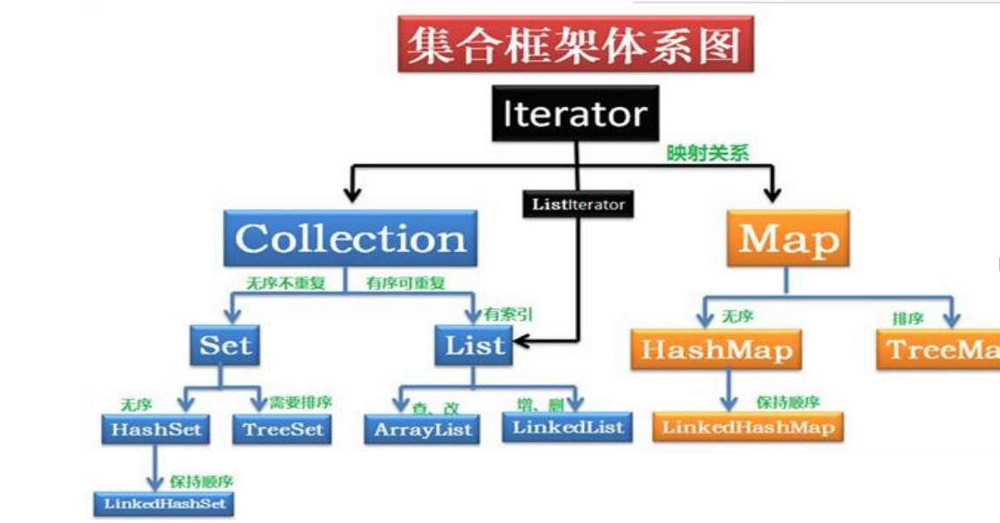

主要涉及到的是List和Map相关的面试题，比较高频就是

- ArrayList
- LinkedList
- HashMap
- ConcurrentHashMap
- ArrayList底层实现是数组

- LinkedList底层实现是双向链表
- HashMap的底层实现使用了众多数据结构，包含了数组、链表、散列表、红黑树等

##### List

###### 成员变量

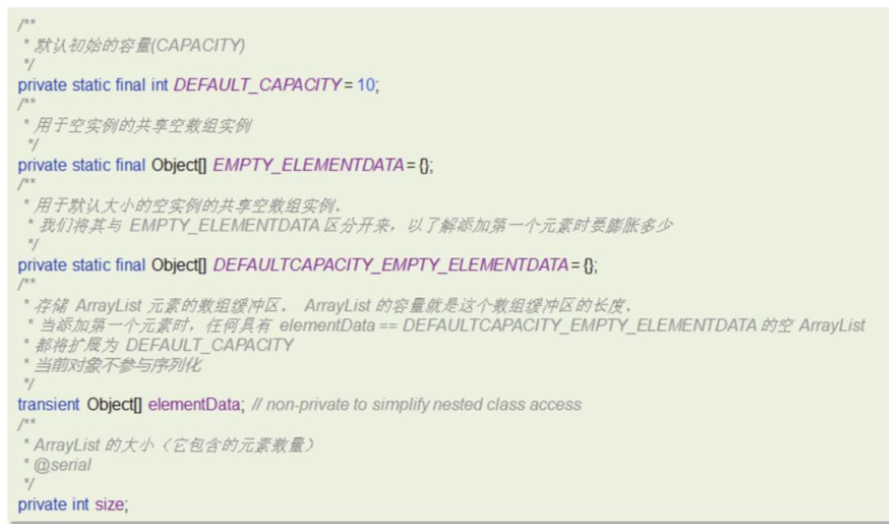

*DEFAULT_CAPACITY* = 10;  默认初始的容量(CAPACITY)

*EMPTY_ELEMENTDATA* = {}; 用于空实例的共享空数组实例

*DEFAULTCAPACITY_EMPTY_ELEMENTDATA* = {};用于默认大小的空实例的共享空数组实例

Object[] elementData;  存储元素的数组缓冲区

int size;     ArrayList的大小（它包含的元素数量）

###### 构造方法


- 第一个构造是带初始化容量的构造函数，可以按照指定的容量初始化数组
- 第二个是无参构造函数，默认创建一个空集合

将collection对象转换成数组，然后将数组的地址的赋给elementData

###### 添加数据的流程


###### 结论

- 底层数据结构

ArrayList底层是用动态的数组实现的

- 初始容量

ArrayList初始容量为0，当第一次添加数据的时候才会初始化容量为10

- 扩容逻辑

ArrayList在进行扩容的时候是原来容量的1.5倍，每次扩容都需要拷贝数组

- 添加逻辑
  - 确保数组已使用长度（size）加1之后足够存下下一个数据 
  - 计算数组的容量，如果当前数组已使用长度+1后的大于当前的数组长度，则调用grow方法扩容（原来的1.5倍）
  - 确保新增的数据有地方存储之后，则将新元素添加到位于size的位置上。
  - 返回添加成功布尔值。

###### ArrayList list=new ArrayList(10)中的list扩容几次

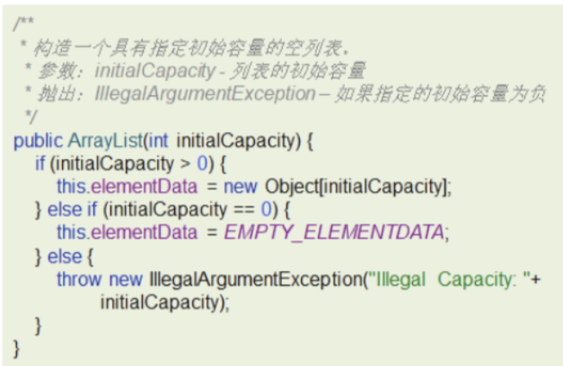


参考回答：

 该语句只是声明和实例了一个 ArrayList，指定了容量为 10，未扩容 

###### 如何实现数组和List之间的转换

如下代码：


参考回答：

- 数组转List ，使用JDK中java.util.Arrays工具类的asList方法
- List转数组，使用List的toArray方法。无参toArray方法返回 Object数组，传入初始化长度的数组对象，返回该对象数组

###### 用Arrays.asList转List后，如果修改了数组内容，list受影响吗？

Arrays.asList 转换list之后，如果修改了数组的内容，list会受影响，因为它的底层使用的Arrays类中的一个内部类ArrayList来构造的集合，在这个集合的构造器中，把我们传入的这个集合进行了包装而已，最终指向的都是同一个内存地址

###### List用toArray转数组后，如果修改了List内容，数组受影响吗？

list用了toArray转数组后，如果修改了list内容，数组不会影响，当调用了toArray以后，在底层是它是进行了数组的拷贝，跟原来的元素就没啥关系了，所以即使list修改了以后，数组也不受影响

###### ArrayList和LinkedList的区别

- 底层数据结构
  - ArrayList 是动态数组的数据结构实现
  - LinkedList 是双向链表的数据结构实现
- 操作数据效率
  - ArrayList按照下标查询的时间复杂度O(1)【内存是连续的，根据寻址公式】， LinkedList不支持下标查询
  - 查找（未知索引）： ArrayList需要遍历，链表也需要遍历，时间复杂度都是O(n)
  - 新增和删除
    - ArrayList尾部插入和删除，时间复杂度是O(1)；其他部分增删需要挪动数组，时间复杂度是O(n)
    - LinkedList头尾节点增删时间复杂度是O(1)，其他都需要遍历链表，时间复杂度是O(n)
- 内存空间占用
  - ArrayList底层是数组，内存连续，节省内存
  - LinkedList 是双向链表需要存储数据，和两个指针，更占用内存
- 线程安全
  - ArrayList和LinkedList都不是线程安全的
  - 如果需要保证线程安全，有两种方案：
    - 在方法内使用，局部变量则是线程安全的
    - 使用线程安全的ArrayList和LinkedList

##### HashMap

###### 将链表法中的链表改造红黑树还有一个非常重要的原因，可以防止DDos攻击

DDos 攻击:

分布式拒绝服务攻击(英文意思是Distributed Denial of Service，简称DDoS）

指处于不同位置的多个攻击者同时向一个或数个目标发动攻击，或者一个攻击者控制了位于不同位置的多台机器并利用这些机器对受害者同时实施攻击。由于攻击的发出点是分布在不同地方的，这类攻击称为分布式拒绝服务攻击，其中的攻击者可以有多个

###### HashMap实现原理

HashMap的数据结构： 底层使用hash表数据结构，即数组和链表或红黑树

1. 当我们往HashMap中put元素时，利用key的hashCode重新hash计算出当前对象的元素在数组中的下标 
2. 存储时，如果出现hash值相同的key，此时有两种情况。

* 如果key相同，则覆盖原始值；

* 如果key不同（出现冲突），则将当前的key-value放入链表或红黑树中 

3. 获取时，直接找到hash值对应的下标，在进一步判断key是否相同，从而找到对应值。


###### HashMap的jdk1.7和jdk1.8有什么区别

- JDK1.8之前采用的是拉链法。拉链法：将链表和数组相结合。也就是说创建一个链表数组，数组中每一格就是一个链表。若遇到哈希冲突，则将冲突的值加到链表中即可。
- jdk1.8在解决哈希冲突时有了较大的变化，当链表长度大于阈值（默认为8） 时并且数组长度达到64时，将链表转化为红黑树，以减少搜索时间。扩容 resize( ) 时，红黑树拆分成的树的结点数小于等于临界值6个，则退化成链表

###### HashMap的put方法的具体流程

**常见属性**


**源码分析**


- HashMap是懒惰加载，在创建对象时并没有初始化数组
- 在无参的构造函数中，设置了默认的加载因子是0.75

**添加数据流程图**

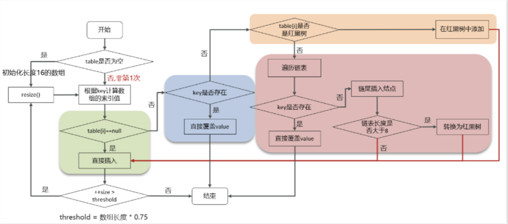

**具体的源码**

```java
public V put(K key, V value) {
    return putVal(hash(key), key, value, false, true);
}

final V putVal(int hash, K key, V value, boolean onlyIfAbsent,
                   boolean evict) {
    Node<K,V>[] tab; Node<K,V> p; int n, i;
    //判断数组是否未初始化
    if ((tab = table) == null || (n = tab.length) == 0)
        //如果未初始化，调用resize方法 进行初始化
        n = (tab = resize()).length;
    //通过 & 运算求出该数据（key）的数组下标并判断该下标位置是否有数据
    if ((p = tab[i = (n - 1) & hash]) == null)
        //如果没有，直接将数据放在该下标位置
        tab[i] = newNode(hash, key, value, null);
    //该数组下标有数据的情况
    else {
        Node<K,V> e; K k;
        //判断该位置数据的key和新来的数据是否一样
        if (p.hash == hash &&
            ((k = p.key) == key || (key != null && key.equals(k))))
            //如果一样，证明为修改操作，该节点的数据赋值给e,后边会用到
            e = p;
        //判断是不是红黑树
        else if (p instanceof TreeNode)
            //如果是红黑树的话，进行红黑树的操作
            e = ((TreeNode<K,V>)p).putTreeVal(this, tab, hash, key, value);
        //新数据和当前数组既不相同，也不是红黑树节点，证明是链表
        else {
            //遍历链表
            for (int binCount = 0; ; ++binCount) {
                //判断next节点，如果为空的话，证明遍历到链表尾部了
                if ((e = p.next) == null) {
                    //把新值放入链表尾部
                    p.next = newNode(hash, key, value, null);
                    //因为新插入了一条数据，所以判断链表长度是不是大于等于8
                    if (binCount >= TREEIFY_THRESHOLD - 1) // -1 for 1st
                        //如果是，进行转换红黑树操作
                        treeifyBin(tab, hash);
                    break;
                }
                //判断链表当中有数据相同的值，如果一样，证明为修改操作
                if (e.hash == hash &&
                    ((k = e.key) == key || (key != null && key.equals(k))))
                    break;
                //把下一个节点赋值为当前节点
                p = e;
            }
        }
        //判断e是否为空（e值为修改操作存放原数据的变量）
        if (e != null) { // existing mapping for key
            //不为空的话证明是修改操作，取出老值
            V oldValue = e.value;
            //一定会执行  onlyIfAbsent传进来的是false
            if (!onlyIfAbsent || oldValue == null)
                //将新值赋值当前节点
                e.value = value;
            afterNodeAccess(e);
            //返回老值
            return oldValue;
        }
    }
    //计数器，计算当前节点的修改次数
    ++modCount;
    //当前数组中的数据数量如果大于扩容阈值
    if (++size > threshold)
        //进行扩容操作
        resize();
    //空方法
    afterNodeInsertion(evict);
    //添加操作时 返回空值
    return null;
}
```

1. 首先判断 table 是否为空，若为空的话则初始化一个大小为 16 的哈希表
2. 计算出当前 key 的哈希值 i。
3. 若 table[i] == null 直接插入元素，判断是否到达扩容阈值，若大于则扩容为原数组大小的2倍。
4. 若 table[i] != null，进一步判断。
5. 若当前存储结构是红黑树，按红黑树的方法插入新数据。
6. 若当前存储结构是链表，则遍历链表判断是否有相同的key。
7. 若有相同的key 则直接覆盖原 value 值
8. 若没有相同的 key 则在链表的尾部插入。
9. 插入后判断链表长度是否大于 8 且数组长度是否大于64
10. 若满足条件则转换成红黑树 

###### HashMap的扩容机制

**扩容的流程 **

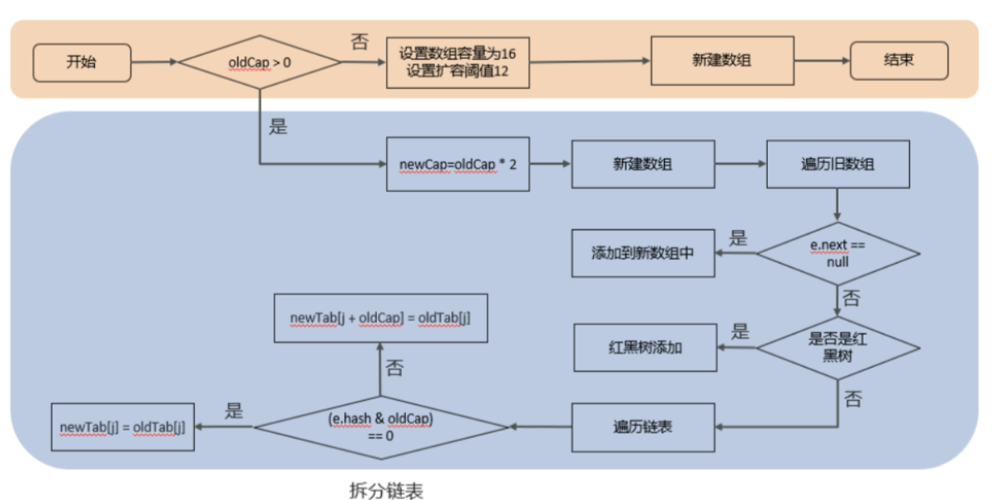

**源码**

```Java
//扩容、初始化数组
final Node<K,V>[] resize() {
        Node<K,V>[] oldTab = table;
        //如果当前数组为null的时候，把oldCap老数组容量设置为0
        int oldCap = (oldTab == null) ? 0 : oldTab.length;
        //老的扩容阈值
        int oldThr = threshold;
        int newCap, newThr = 0;
        //判断数组容量是否大于0，大于0说明数组已经初始化
        if (oldCap > 0) {
            //判断当前数组长度是否大于最大数组长度
            if (oldCap >= MAXIMUM_CAPACITY) {
                //如果是，将扩容阈值直接设置为int类型的最大数值并直接返回
                threshold = Integer.MAX_VALUE;
                return oldTab;
            }
            //如果在最大长度范围内，则需要扩容  OldCap << 1等价于oldCap2
            //运算过后判断是不是最大值并且oldCap需要大于16
            else if ((newCap = oldCap << 1) < MAXIMUM_CAPACITY &&
                     oldCap >= DEFAULT_INITIAL_CAPACITY)
*                newThr = oldThr << 1; // double threshold  等价于oldThr*2
        }
        //如果oldCap<0，但是已经初始化了，像把元素删除完之后的情况，那么它的临界值肯定还存在，                如果是首次初始化，它的临界值则为0
        else if (oldThr > 0) // initial capacity was placed in threshold
            newCap = oldThr;
        //数组未初始化的情况，将阈值和扩容因子都设置为默认值
        else {               // zero initial threshold signifies using defaults
            newCap = DEFAULT_INITIAL_CAPACITY;
            newThr = (int)(DEFAULT_LOAD_FACTOR * DEFAULT_INITIAL_CAPACITY);
        }
        //初始化容量小于16的时候，扩容阈值是没有赋值的
        if (newThr == 0) {
            //创建阈值
            float ft = (float)newCap * loadFactor;
            //判断新容量和新阈值是否大于最大容量
            newThr = (newCap < MAXIMUM_CAPACITY && ft < (float)MAXIMUM_CAPACITY ?
                      (int)ft : Integer.MAX_VALUE);
        }
        //计算出来的阈值赋值
        threshold = newThr;
        @SuppressWarnings({"rawtypes","unchecked"})
        //根据上边计算得出的容量 创建新的数组        Node<K,V>[] newTab = (Node<K,V>[])new Node[newCap];
        //赋值
        table = newTab;
        //扩容操作，判断不为空证明不是初始化数组
        if (oldTab != null) {
            //遍历数组
            for (int j = 0; j < oldCap; ++j) {
                Node<K,V> e;
                //判断当前下标为j的数组如果不为空的话赋值个e，进行下一步操作
                if ((e = oldTab[j]) != null) {
                    //将数组位置置空
                    oldTab[j] = null;
                    //判断是否有下个节点
                    if (e.next == null)
                        //如果没有，就重新计算在新数组中的下标并放进去
                        newTab[e.hash & (newCap - 1)] = e;
                    //有下个节点的情况，并且判断是否已经树化
                    else if (e instanceof TreeNode)
                        //进行红黑树的操作
                        ((TreeNode<K,V>)e).split(this, newTab, j, oldCap);
                    //有下个节点的情况，并且没有树化（链表形式）
                    else {
                        //比如老数组容量是16，那下标就为0-15
                        //扩容操作*2，容量就变为32，下标为0-31
                        //低位：0-15，高位16-31
                        //定义了四个变量
                        //        低位头          低位尾
                        Node<K,V> loHead = null, loTail = null;
                        //        高位头          高位尾
                        Node<K,V> hiHead = null, hiTail = null;
                        //下个节点
                        Node<K,V> next;
                        //循环遍历
                        do {
                            //取出next节点
                            next = e.next;
                            //通过 与操作 计算得出结果为0
                            if ((e.hash & oldCap) == 0) {
                                //如果低位尾为null，证明当前数组位置为空，没有任何数据
                                if (loTail == null)
                                    //将e值放入低位头
                                    loHead = e;
                                //低位尾不为null，证明已经有数据了
                                else
                                    //将数据放入next节点
                                    loTail.next = e;
                                //记录低位尾数据
                                loTail = e;
                            }
                            //通过 与操作 计算得出结果不为0
                            else {
                                 //如果高位尾为null，证明当前数组位置为空，没有任何数据
                                if (hiTail == null)
                                    //将e值放入高位头
                                    hiHead = e;
                                //高位尾不为null，证明已经有数据了
                                else
                                    //将数据放入next节点
                                    hiTail.next = e;
                               //记录高位尾数据
                                hiTail = e;
                            }
                        }
                        //如果e不为空，证明没有到链表尾部，继续执行循环
                        while ((e = next) != null);
                        //低位尾如果记录的有数据，是链表
                        if (loTail != null) {
                            //将下一个元素置空
                            loTail.next = null;
                            //将低位头放入新数组的原下标位置
                            newTab[j] = loHead;
                        }
                        //高位尾如果记录的有数据，是链表
                        if (hiTail != null) {
                            //将下一个元素置空
                            hiTail.next = null;
                            //将高位头放入新数组的(原下标+原数组容量)位置
                            newTab[j + oldCap] = hiHead;
                        }
                    }
                }
            }
        }
        //返回新的数组对象
        return newTab;
    }
```

- 在添加元素或初始化的时候需要调用resize方法进行扩容，第一次添加数据初始化数组长度为16，以后每次每次扩容都是达到了扩容阈值（数组长度 * 0.75）
- 每次扩容的时候，都是扩容之前容量的2倍； 
- 扩容之后，会新创建一个数组，需要把老数组中的数据挪动到新的数组中
  - 没有hash冲突的节点，则直接使用 e.hash & (newCap - 1) 计算新数组的索引位置
  - 如果是红黑树，走红黑树的添加
  - 如果是链表，则需要遍历链表，可能需要拆分链表，判断(e.hash & oldCap)是否为0，该元素的位置要么停留在原始位置，要么移动到原始位置+增加的数组大小这个位置上

###### HashMap 和 HashTable 区别

**线程安全性不同**：HashMap 是线程不安全的，HashTable 是线程安全的，其中的方法是Synchronized，在多线程并发的情况下，可以直接使用 HashTable，但是使用HashMap 时必须自己增加同步处理。

**是否提供 contains 方法**：HashMap 只有 containsValue 和 containsKey 方法；HashTable 有 contains、containsKey 和 containsValue 三个方法，其中 contains 和 containsValue 方法功能相同。

**key** **和** **value** **是否允许** **null** **值**：Hashtable 中，key 和 value 都不允许出现 null 值。HashMap 中，null 可以作为键，这样的键只有一个；可以有一个或多个键所对应的值为 null。

**数组初始化和扩容机制**：HashTable 在不指定容量的情况下的默认容量为 11，而 HashMap 为 16，Hashtable 不要求底层数组的容量一定要为 2 的整数次幂，而 HashMap 则要求一定为 2 的整数次幂。Hashtable 扩容时，将容量变为原来的 2 倍加 1，而 HashMap 扩容时，将容量变为原来的 2 倍。

##### Java 中的IO流


##### 请写出你最常见的 RuntimeException

* java.lang.NullPointerException 空指针异常；出现原因：调用了未经初始化的对象或者是不存在的对象。
* java.lang.ClassNotFoundException 指定的类找不到；出现原因：类的名称和路径加载错误；通常都是程序试图通过字符串来加载某个类时可能引发异常。
* java.lang.NumberFormatException字符串转换为数字异常；出现原因：字符型数据中包含非数字型字符。
* java.lang.IndexOutOfBoundsException数组角标越界异常：常见于操作数组对象时发生。
* java.lang.IllegalArgumentException数据类型转换异常。

##### 反射

**反射机制**

所谓的反射机制就是 java 语言在运行时拥有一项自观的能力。通过这种能力可以彻底了解自身的情况为下一步的动作做准备。Java 的反射机制的实现要借助于 4 个类：class，Constructor，Field，Method;其中 class 代表的是类对象，Constructor－类的构造器对象，Field－类的属性对象，Method－类的方法对象。通过这四个对象我们可以粗略的看到一个类的各个组成部分。

**Java** **反射的作用**

在 Java 运行时环境中，对于任意一个类，可以知道这个类有哪些属性和方法。对于任意一个对象，可以调用它的任意一个方法。这种动态获取类的信息以及动态调用对象的方法的功能来自于 Java 语言的反射（Reflection）机制。

**Java** **反射机制提供功能**

* 在运行时判断任意一个对象所属的类。

* 在运行时构造任意一个类的对象。

* 在运行时判断任意一个类所具有的成员变量和方法。

* 在运行时调用任意一个对象的方法

##### 什么是 java 序列化，如何实现 java 序列化

序列化是一种用来处理对象流的机制，所谓对象流也就是将对象的内容进行流

化。可以对流化后的对象进行读写操作，也可将流化后的对象传输于网络之间。序列

化是为了解决在对对象流进行读写操作时所引发的问题。

**序列化的实现 ：**

 将需要被序列化的类实现 Serializable 接 口 ， 该接口没有 需

要 实 现 的 方 法 ， implements Serializable 只是为了标注该对象是可被序列化的，

然后使用一个输出流(如：FileOutputStream)来构造一个 ObjectOutputStream(对象流)

对象，接着，使用 ObjectOutputStream 对象的 writeObject(Object obj)方法就可以将

参数为 obj 的对象写出(即保存其状态)，要恢复的话则用输入流。

##### **Http** 常见的状态码

1. 200：OK//客户端请求成功

2. 301：Permanently Moved （永久移除)，请求的 URL 已移走。Response 中应该包含一个 Location URL, 说明资源现在所处的位置（永久性的 ）

3. 302：Temporarily Moved 临时重定向（当客户端（如浏览器）向服务器请求一个资源时，服务器返回一个临时重定向响应，告诉客户端该资源临时位于另一个 URL 。这意味着原始请求的资源暂时被移动到了新的位置，但客户端应该继续使用原始的 URL 进行后续请求，因为这种移动可能是临时性的。）

4. 400：Bad Request //客户端请求有语法错误，不能被服务器所理解

5. 401： Unauthorized //请求未经授权，这个状态代码必须和 WWW- Authenticate 报头域一起使用

6. 403：Forbidden //服务器收到请求，但是拒绝提供服务

7. 404：Not Found //请求资源不存在，eg：输入了错误的 URL

8. 500：Internal Server Error //服务器发生不可预期的错误

9. 503：Server Unavailable //服务器当前不能处理客户端的请求，一段时间后可能恢复正常

##### GET 和 POST 的区别

* GET 请求的数据会附在 URL 之后（就是把数据放置在 HTTP 协议头中），以?分割 URL 和传输数据，参数之间以&相连，如：login.action?name=zhagnsan&password=123456。POST 把提交的数据则放置在是HTTP 包的包体中。

* **GET 方式提交的数据最多只能是 1024 字节，理论上 POST 没有限制，可传较大量的数据。其实这样说是错误的，不准确的：**“GET 方式提交的数据最多只能是1024 字节"，因为 GET 是通过 URL 提交数据，那么 GET 可提交的数据量就跟 URL 的长度有直接关系了。而实际上，URL 不存在参数上限的问题，HTTP 协议规范没有对URL 长度进行限制。这个限制是特定的浏览器及服务器对它的限制。IE 对 URL 长度的限制是 2083 字节(2K+35)。对于其他浏览器，如 Netscape、FireFox 等，理论上没有长度限制，其限制取决于操作系统的支持。

* POST 的安全性要比 GET 的安全性高。注意：这里所说的安全性和上面 GET提到的“安全”不是同个概念。上面“安全”的含义仅仅是不作数据修改，而这里安全的含义是真正的 Security 的含义，比如：通过 GET 提交数据，用户名和密码将明文出现在URL 上，因为

  （1）登录页面有可能被浏览器缓存，

  （2）其他人查看浏览器的历史纪录，那么别人就可以拿到你的账号和密码了，除此之外，使用 GET 提交数据还可能会造成Cross-site request forgery（跨站请求伪造） 攻击。

  （3）**跨站请求伪造：**攻击者诱导受害者用户访问一个包含恶意请求的链接或页面。当受害者用户已登录目标网站并且其浏览器保存了有效的登录凭证（如会话 cookie）时，浏览器会自动带上这些凭证向目标网站发送请求。目标网站基于这些凭证，会误认为该请求是合法用户的操作，从而执行攻击者预设的恶意操作。

* Get 是向服务器发索取数据的一种请求，而 Post 是向服务器提交数据的一种请求，在 FORM（表单）中，Method默认为"GET"，实质上，GET 和 POST 只是发送机制不同，并不是一个取一个发！

##### Cookie 和 Session 的区别

* Cookie 是 web 服务器发送给浏览器的一块信息，浏览器会在本地一个文件中给每个 web 服务器存储 cookie。以后浏览器再给特定的 web 服务器发送请求时，同时会发送所有为该服务器存储的 cookie。
* Session 是存储在 web 服务器端的一块信息。session 对象存储特定用户会话所需的属性及配置信息。当用户在应用程序的 Web 页之间跳转时，存储在 Session 对象中的变量将不会丢失，而是在整个用户会话中一直存在下去

**Cookie 和 session 的不同点**

无论客户端做怎样的设置，session 都能够正常工作。当客户端禁用 cookie 时将无法使用 cookie

在存储的数据量方面：session 能够存储任意的 java 对象，cookie 只能存储String 类型的对象

##### 什么情况下会产生 StackOverflowError（栈溢出）和 OutOfMemoryError（堆溢出）怎么排查

（1）引发 StackOverFlowError 的常见原因有以下几种

* 无限递归循环调用（最常见）

* 执行了大量方法，导致线程栈空间耗尽

* 方法内声明了海量的局部变量

* native 代码有栈上分配的逻辑，并且要求的内存还不小，比如 java.net.SocketInputStream.read0 会在栈上要求分配一个 64KB 的缓存（64 位、Linux）。

（2）引发 OutOfMemoryError 的常见原因有以下几种

* 内存中加载的数据量过于庞大，如一次从数据库取出过多数据

* 集合类中有对对象的引用，使用完后未清空，使得 JVM 不能回收

* 代码中存在死循环或循环产生过多重复的对象实体

* 启动参数内存值设定的过小

#### Redis

##### 缓存穿透

缓存穿透是指查询一个一定不存在的数据，由于存储层查不到数据因此不写入缓存，这将导致这个不存在的数据每次请求都要到 DB 去查询，可能导致 DB 挂掉。这种情况大概率是遭到了攻击。解决方案的话，我们通常都会用布隆过滤器来解决它。

用户查询文章时为了防止发生缓存穿透，使用Redisson的布隆过滤器来解决此问题，初始化时将每个文章id都从数据库中加载到布隆过滤器中，发布文章和删除文章时也要修改布隆过滤器对应的映射值，当前端请求文章数据时先使用布隆过滤器判断，以免反复查询数据库造成系统压力过大。

##### 缓存击穿

缓存击穿的意思是，对于设置了过期时间的key，缓存在某个时间点过期的时候，恰好这个时间点对这个Key有大量的并发请求过来。

对于社区首页查询热门标签时，当时使用的是XXL_JOB 定时任务来更新标签内容，但是在更新的过程中 Redis 可能会收到大量的查询请求，而此热门标签的查询是需要到数据库中统计的，所以这时候大量的查询请求会导致数据库压力过大，

因此我选择当存入热门标签时设置一个过期时间，当数据库查询时若缓存中的数据过期，那么就直接返回旧数据，并且开一个异步线程去更新数据，直到新数据更新完毕。当然也有**第二种**实现方法，当缓存失效时，我们可以设置一个互斥锁比如Redis的SERNX，获得锁之后该线程会去加载数据库中的数据更新到缓存中，加载成功将数据存入缓存并返回前端然后释放锁，在线程拿到锁期间，其他请求都会等到该线程释放锁后才会执行剩下操作。当然，**两种方案**各有利弊：如果选择数据的强一致性，建议使用分布式锁的方案，但性能上可能没那么高，且有可能产生死锁的问题。如果选择key的逻辑删除，则优先考虑高可用性，性能比较高，但数据同步这块做不到强一致。

##### 缓存雪崩

对于许多 key 同时过期导致大量数据同时访问数据库导致数据库压力过大而导致雪崩问题，可以在原有的失效时间上随机加上 1 ~ 5分钟，这样每一个缓存过期时间重复率就会降低，就很难引起集体失效事件。

##### 数据同步

嗯！就说我最近做的这个项目仿CSDN的学习交流平台，里面有社区管理员分配给社区成员对应的权限，在给社区成员修改权限的过程中，社区成员不能进行一些有权限的操作，需要让数据库与redis高度保持一致，因为要求时效性比较高。我们当时采用的读写锁保证的强一致性。我们使用的是Redisson实现的读写锁。在读的时候添加共享锁，可以保证读读不互斥、读写互斥。当我们更新数据的时候，添加排他锁。它是读写、读读都互斥，这样就能保证在写数据的同时，是不会让其他线程读数据的，避免了脏数据。这里面需要注意的是，读方法和写方法上需要使用同一把锁才行。

当然还有另一种方法因为他是异步的但这时候允许一定的时延：具体操作是操作数据库后将要更新的数据放入Rabbitmq中，使用RabbitMQ异步更新缓存内容。还有另一种异步方法：采用的阿里的Canal组件实现数据同步：不需要更改业务代码，只需部署一个Canal服务。Canal服务把自己伪装成mysql的一个从节点。当mysql数据更新以后，Canal会读取binlog数据，然后再通过Canal的客户端获取到数据，并更新缓存即可。

排他锁之所以能保持读写、读读互斥是因为：排他锁底层使用的也是 SETNX，他保证了同时只能有一个线程操作锁住的方法。

##### 延时双删

延时双删，如果是写操作，我们先把缓存中的数据删除，然后更新数据库，最后再延时删除缓存中的数据。其中，这个延时多久不太好确定。在延时的过程中，可能会出现脏数据，并不能保证强一致性，所以没有采用它。

##### 持久化

在Redis中提供了两种数据持久化的方式：1) RDB；2) AOF。

**区别：**

RDB是一个快照文件。它是把 redis 内存存储的数据写到磁盘上。当redis实例宕机恢复数据的时候，可以从RDB的快照文件中恢复数据。AOF的含义是追加文件。当redis执行写命令的时候，都会存储到这个文件中。当redis实例宕机恢复数据的时候，会从这个文件中再次执行一遍命令来恢复数据。

**恢复速度：**

RDB因为是二进制文件，保存时体积也比较小，所以它恢复得比较快。但它有可能会丢数据。

我们通常在项目中也会使用AOF来恢复数据。虽然AOF恢复的速度慢一些，但它丢数据的风险要小很多。在AOF文件中可以设置刷盘策略。我当时设置的就是每秒批量写入一次命令。

##### 过期策略

在redis中提供了两种数据过期删除策略。第一种是惰性删除。在设置该 key 过期时间后，我们不去管它。当需要该key时，我们检查其是否过期。如果过期，我们就删掉它；反之，返回该key。第二种是定期删除。就是说，每隔一段时间，我们就对一些key进行检查，并删除里面过期的key。定期清理的两种模式是：1) SLOW模式，是定时任务，执行频率默认为10hz（10次/秒），每次不超过25ms，可以通过修改配置文件redis.conf的hz选项来调整这个次数；2) FAST模式，执行频率不固定，每次事件循环会尝试执行，但两次间隔不低于2ms，每次耗时不超过1ms。Redis的过期删除策略是：惰性删除 + 定期删除两种策略配合使用。

##### 淘汰策略

嗯，这个在redis中提供了很多种，默认是noeviction，不删除任何数据，内部不足时直接报错。这个可以在redis的配置文件中进行设置。里面有两个非常重要的概念：一个是LRU，另外一个是LFU。LRU的意思就是最少最近使用。它会用当前时间减去最后一次访问时间。这个值越大，则淘汰优先级越高。LFU的意思是最少频率使用。它会统计每个key的访问频率。值越小，淘汰优先级越高。我们在项目中设置的是allkeys-lru，它会挑选最近最少使用的数据进行淘汰，把一些经常访问的key留在redis中。

**数据库有1000万数据，Redis只能缓存20w数据。如何保证Redis中的数据都是热点数据？**

可以使用allkeys-lru（挑选最近最少使用的数据淘汰：对全体数据都用LFU）淘汰策略。那留下来的都是经常访问的热点数据。

**Redis的内存用完了会发生什么？**

这个要看redis的数据淘汰策略是什么。如果是默认的配置，redis内存用完以后则直接报错。我们当时设置的是allkeys-lru策略，把最近最常访问的数据留在缓存中。

##### Redis分布式锁如何实现？

在redis中提供了一个命令`SETNX`(SET if not exists)。由于redis是单线程的，用了这个命令之后，只能有一个客户端对某一个key设置值。在没有过期或删除key的时候，其他客户端是不能设置这个key的。

##### 如何控制Redis实现分布式锁的有效时长呢？

redis的`SETNX`指令不好控制这个问题。可以采用的是redis的一个框架 Redisson 实现（取消了自动延期）的。Redisson会引入一个看门狗机制。就是说，每隔一段时间就检查当前业务是否还持有锁。如果持有，就增加加锁的持有时间（默认为30秒续期一次）。当业务执行完成之后，需要使用释放锁就可以了。

##### Redisson实现的分布式锁是可重入的吗？

是可以重入的。这样做是为了避免死锁的产生。这个重入其实在内部就是判断是否是当前线程持有的锁，如果是当前线程持有的锁就会计数，如果释放锁就会在计数上减一。在存储数据的时候采用的hash结构，大key可以按照自己的业务进行定制，其中小key是当前线程的唯一标识，value是当前线程重入的次数。

##### **Redisson实现的分布式锁能解决主从一致性的问题吗？**

这个是不能的。比如，当线程1加锁成功后，master节点数据会异步复制到slave节点，此时如果当前持有Redis锁的master节点宕机，slave节点被提升为新的master节点，假如现在来了一个线程2，再次加锁，会在新的master节点上加锁成功，这个时候就会出现两个节点同时持有一把锁的问题。

我们可以利用Redisson提供的红锁来解决这个问题，它的主要作用是，不能只在一个Redis实例上创建锁，应该是在多个Redis实例上创建锁，并且要求在大多数Redis节点上都成功创建锁，红锁中要求是Redis的节点数量要过半。这样就能避免线程1加锁成功后master节点宕机导致线程2成功加锁到新的master节点上的问题了。

但是，如果使用了红锁，因为需要同时在多个节点上都添加锁，性能就变得非常低，并且运维维护成本也非常高，所以，我们一般在项目中也不会直接使用红锁，并且官方也暂时废弃了这个红锁。

##### 如果业务非要保证数据的强一致性，这个该怎么解决呢？

Redis本身就是支持高可用的，要做到强一致性，就非常影响性能，所以，如果有强一致性要求高的业务，建议使用ZooKeeper实现的分布式锁，它是可以保证强一致性的。

##### Redis集群方案

在Redis中提供的集群方案总共有三种：主从复制、哨兵模式、Redis分片集群。

##### 主从同步。

嗯，是这样的，单节点Redis的并发能力是有上限的，要进一步提高Redis的并发能力，可以搭建主从集群，实现读写分离。一般都是一主多从，主节点负责写数据，从节点负责读数据，主节点写入数据之后，需要把数据同步到从节点中。

##### **主从同步数据的流程**

主从同步分为了两个阶段，一个是全量同步，一个是增量同步。

全量同步是指从节点第一次与主节点建立连接的时候使用全量同步，流程是这样的：

第一：从节点请求主节点同步数据，其中从节点会携带自己的replication id和offset偏移量。

第二：主节点判断是否是第一次请求，主要判断的依据就是，主节点与从节点是否是同一个replication id，如果不是，就说明是第一次同步，那主节点就会把自己的replication id和offset发送给从节点，让从节点与主节点的信息保持一致。

第三：在同时主节点会执行`BGSAVE`，生成RDB文件后，发送给从节点去执行，从节点先把自己的数据清空，然后执行主节点发送过来的RDB文件，这样就保持了一致。

当然，如果在RDB生成执行期间，依然有请求到了主节点，而主节点会以命令的方式记录到缓冲区，缓冲区是一个日志文件，最后把这个日志文件发送给从节点，这样就能保证主节点与从节点完全一致了，后期再同步数据的时候，都是依赖于这个日志文件，这个就是全量同步。

增量同步指的是，当从节点服务重启之后，数据就不一致了，所以这个时候，从节点会请求主节点同步数据，主节点还是判断不是第一次请求，不是第一次就获取从节点的offset值，然后主节点从命令日志中获取offset值之后的数据，发送给从节点进行数据同步。

##### 怎么保证Redis的高并发高可用？

首先可以搭建主从集群，再加上使用 Redis 中的哨兵模式，哨兵模式可以实现主从集群的自动故障恢复，里面就包含了对主从服务的监控、自动故障恢复、通知；如果 master 故障，Sentinel 会将一个 slave 提升为 master。当故障实例恢复后也以新的 master 为主；同时Sentinel 也充当 Redis 客户端的服务发现来源，当集群发生故障转移时，会将最新信息推送给 Redis 的客户端，所以一般项目都会采用哨兵的模式来保证 Redis 的高并发高可用。

##### 你们使用Redis是单点还是集群，哪种集群？

我们当时使用的是主从（1主2从）加哨兵。一般单节点不超过10G内存，如果Redis内存不足则可以给不同服务分配独立的Redis主从节点。尽量不做分片集群。因为集群维护起来比较麻烦，并且集群之间的心跳检测和数据通信会消耗大量的网络带宽，也没有办法使用Lua脚本和事务。

##### Redis集群脑裂，该怎么解决呢？

嗯！这个在项目中很少见，不过脑裂的问题是这样的，我们现在用的是Redis的哨兵模式集群的。

有的时候由于网络等原因可能会出现脑裂的情况，就是说，由于 Redis master 节点和 Redis slave 节点和 Sentinel处于不同的网络分区，使得Sentinel没有能够心跳感知到master，所以通过选举的方式提升了一个slave为master，这样就存在了两个master，就像大脑分裂了一样，这样会导致客户端还在old master那里写入数据，新节点无法同步数据，当网络恢复后，Sentinel会将old master降为slave，这时再从新master同步数据，这会导致old master中的大量数据丢失。

关于解决的话，我记得在Redis的配置中可以设置：第一可以设置最少的slave节点个数，比如设置至少要有一个从节点才能同步数据，第二个可以设置主从数据复制和同步的延迟时间，达不到要求就拒绝客户端请求，就可以避免大量的数据丢失。

##### Redis的分片集群有什么作用？

分片集群主要解决的是海量数据存储的问题，集群中有多个master，每个master保存不同数据，并且还可以给每个master设置多个slave节点，就可以继续增大集群的高并发能力。同时每个 master 之间通过ping监测彼此健康状态，就类似于哨兵模式了。当客户端请求可以访问集群任意节点，最终都会被转发到正确节点。

##### Redis分片集群中数据是怎么存储和读取的？

在Redis集群中是这样的：

Redis 集群引入了哈希槽的概念，有 16384 个哈希槽，集群中每个主节点绑定了一定范围的哈希槽范围，key通过CRC16校验后对16384取模来决定放置哪个槽，通过槽找到对应的节点进行存储。

取值的逻辑是一样的。

##### Redis是单线程的，但是为什么还那么快？

1. 完全基于内存的，C语言编写。
2. 采用单线程，避免不必要的上下文切换和竞争条件。
3. 使用多路I/O复用模型，非阻塞IO。

例如：`BGSAVE`和`BGREWRITEAOF`都是在后台执行操作，不影响主线程的正常使用，不会产生阻塞。

##### 能解释一下I/O多路复用模型？

I/O多路复用是指利用单个线程来同时监听多个Socket，并且在某个Socket可读、可写时得到通知，从而避免无效的等待，充分利用CPU资源。目前的I/O多路复用都是采用的epoll模式实现，它会在通知用户进程Socket就绪的同时，把已就绪的Socket写入用户空间，不需要挨个遍历Socket来判断是否就绪，提升了性能。

其中Redis的网络模型就是使用I/O多路复用结合事件的处理器来应对多个Socket请求，比如，提供了连接应答处理器、命令回复处理器，命令请求处理器；

在Redis6.0之后，为了提升更好的性能，在命令回复处理器使用了多线程来处理回复事件，在命令请求处理器中，将命令的转换使用了多线程，增加命令转换速度，在命令执行的时候，依然是单线程

#### Mysql

##### MySQL中，如何定位慢查询？

嗯，我们当时在做压力测试时发现有些接口响应时间非常慢，超过了2秒。因为我们的系统部署了运维监控系统Skywalking，在它的报表展示中可以看到哪个接口慢，并且能分析出接口中哪部分耗时较多，包括具体的SQL执行时间，这样就能定位到出现问题的SQL。

如果没有这种监控系统，MySQL本身也提供了慢查询日志功能。可以在MySQL的系统配置文件中开启慢查询日志，并设置SQL执行时间超过多少就记录到日志文件，比如我们之前项目设置的是2秒，超过这个时间的SQL就会记录在日志文件中，我们就可以在那里找到执行慢的SQL。

##### 那这个SQL语句执行很慢，如何分析呢？

如果一条 SQL 执行很慢，我们通常会使用 MySQL 的`EXPLAIN`命令来分析这条 SQL 的执行情况。通过`key`和`key_len`可以检查是否命中了索引，如果已经添加了索引，也可以判断索引是否有效。通过`type`字段可以查看 SQL 是否有优化空间，比如是否存在全索引扫描或全表扫描。通过`extra`建议可以判断是否出现回表情况，如果出现，可以尝试添加索引或修改返回字段来优化。

**全表扫描：**数据库系统从表的第一行开始，依次读取每一行数据，直到读完表中的所有行，以找到满足查询条件的数据。这个过程中，数据库不会使用索引，而是直接遍历整个数据表。

**全索引扫描：**数据库系统会遍历整个索引结构，而不是数据表本身。索引是一种数据结构，它提供了一种更快速地访问表中数据的方式。在全索引扫描中，数据库会按顺序读取索引的每一个条目，并根据索引条目找到对应的数据行。

##### 什么是索引

索引在项目中非常常见，它是一种帮助MySQL高效获取数据的数据结构，主要用来提高数据检索效率，降低数据库的I/O成本。同时，索引列可以对数据进行排序，降低数据排序的成本，也能减少CPU的消耗。

##### 索引的底层数据结构

MySQL的默认存储引擎 InnoDB 使用的是 B+ 树作为索引的存储结构。选择 B+ 树的原因包括：节点可以有更多子节点，路径更短；磁盘读写代价更低，非叶子节点只存储键值和指针，叶子节点存储数据；B+ 树适合范围查询和扫描，因为叶子节点形成了一个双向链表。

##### B树和B+树的区别是什么呢？

1. B树的非叶子节点和叶子节点都存放数据，而 B+ 树的所有数据只出现在叶子节点，这使得B+树在查询时效率更稳定。
2. B+ 树在进行范围查询时效率更高，因为所有数据都在叶子节点，并且叶子节点之间形成了双向链表。

##### 聚簇索引、非聚簇索引（二级索引）

聚簇索引是指数据与索引放在一起，B+树的叶子节点保存了整行数据，通常只有一个聚簇索引，一般是由主键构成。

非聚簇索引则是数据与索引分开存储，B+树的叶子节点保存的是主键值，可以有多个非聚簇索引，通常我们自定义的索引都是非聚簇索引。

##### 回表查询

回表查询是指通过二级索引找到对应的主键值，然后再通过主键值查询聚簇索引中对应的整行数据的过程。

##### 覆盖索引

覆盖索引是指在 SELECT 查询中，返回的列全部能在索引中找到，避免了回表查询，提高了性能。使用覆盖索引可以减少对主键索引的查询次数，提高查询效率。

##### MySQL超大分页处理方法

超大分页通常发生在数据量大的情况下，使用`LIMIT`分页查询且需要排序时效率较低。可以通过覆盖索引和子查询来解决。首先查询数据的 ID 字段进行分页，然后根据 ID 列表用子查询来过滤只查询这些 ID 的数据，因为查询 ID 时使用的是覆盖索引，所以效率可以提升。

先找到符合条件的 id 集合，然后通过 id 在原表中找到想要的数据

原理是：

```sql
select * from tb_ sku limit 9000000, 10;
```

此语句会查询所有数据，每个内存块占用的记录少要进行多次IO操作

```sql
select *
from tb_ sku t,
(select id from tb_ sku order by id limit 9000000,10) a  
wheret.id = a.id;
```

而此语句先会查询所有的 id，因为 id 占用的内存空间少，所以每个内存块可以存储多个 id 减少了IO次数，因此速度更快

##### 索引创建原则

- 表中的数据量超过10万以上时考虑创建索引。
- 选择查询频繁的字段作为索引，如查询条件、排序字段或分组字段。
- 尽量使用复合索引，覆盖SQL的返回值。
- 如果字段区分度不高，可以将其放在组合索引的后面。
- 对于内容较长的字段，考虑使用前缀索引。
- 控制索引数量，因为索引虽然可以提高查询速度，但也会影响插入、更新的速度。

##### 索引失效的情况

- 没有遵循最左匹配原则。
- 使用了模糊查询且`%`号在前面。
- 在索引字段上进行了运算或类型转换。
- 使用了复合索引但在中间使用了范围查询，导致右边的条件索引失效。

##### SQL的优化经验有哪些

- 建表时选择合适的字段类型。
- 使用索引，遵循创建索引的原则。
- 编写高效的SQL语句，比如避免使用`SELECT *`，尽量使用`UNION ALL`代替`UNION`，以及在表关联时使用`INNER JOIN`。
- 采用主从复制和读写分离提高性能。
- 在数据量大时考虑分库分表。

**`UNION ALL`**：将多个查询结果集简单地合并在一起，不会对结果进行去重处理。也就是说，它会保留所有查询结果中的每一行，无论这些行是否重复。这个操作符常用于需要快速合并数据，且不关心结果中是否存在重复行的场景。

- **`UNION`**：同样用于合并多个查询结果集，但它会在合并的过程中自动去除重复的行。`UNION` 会对合并后的结果进行排序和比较，确保最终结果集中的每一行都是唯一的。这个操作符适用于需要得到不重复数据的场景。

##### 创建表的时候，如何优化？

创建表时，我们主要参考《嵩山版》开发手册，选择字段类型时结合字段内容，比如数值类型选择`TINYINT`、`INT`、`BIGINT`等，字符串类型选择`CHAR`、`VARCHAR`或`TEXT`。

##### 在使用索引的时候，如何优化

在使用索引时，我们遵循索引创建原则，确保索引字段是查询频繁的，使用复合索引覆盖SQL返回值，避免在索引字段上进行运算或类型转换，以及控制索引数量。

##### 你平时对SQL语句做了哪些优化呢

我对SQL语句的优化包括指明字段名称而不是使用`SELECT *`，避免造成索引失效的写法，聚合查询时使用`UNION ALL`代替`UNION`，表关联时优先使用`INNER JOIN`，以及在必须使用`LEFT JOIN`或`RIGHT JOIN`时，确保小表作为驱动表。

##### 事务的特性

事务的特性是ACID，即原子性（Atomicity）、一致性（Consistency）、隔离性（Isolation）、持久性（Durability）。例如，A向B转账500元，这个操作要么都成功，要么都失败，体现了原子性。转账过程中数据要保持一致，A扣除了500元，B必须增加500元。隔离性体现在A向B转账时，不受其他事务干扰。持久性体现在事务提交后，数据要被持久化存储。

##### 并发事务带来的问题

并发事务可能导致脏读、不可重复读和幻读。

脏读：是指一个事务读到了另一个事务未提交的“脏数据”。

不可重复读：是指在一个事务内多次读取同一数据，由于其他事务的修改导致数据不一致。

幻读：一个事务按照条件查询数据时，没有对应的数据行，但是在插入数据时，又发现这行数据已经存在，好像出现了”幻影”。

##### 怎么解决并发事务带来的问题？MySQL的默认隔离级别是？

* 未提交读（READ UNCOMMITTED）：解决不了所有问题。

* 读已提交（READ COMMITTED）：能解决脏读，但不能解决不可重复读和幻读。

* 可重复读（REPEATABLE READ）：能解决脏读和不可重复读，但不能解决幻读，这也是MySQL的默认隔离级别。

* 串行化（SERIALIZABLE）：可以解决所有问题，但性能较低。

##### undo log 和 redo log 的区别

redo log 记录的是数据页的物理变化，用于服务宕机后的恢复，保证事务的持久性。而`undo log`记录的是逻辑日志，用于事务回滚时恢复原始数据，保证事务的原子性和一致性。

##### 事务中的隔离性是如何保证的呢？（你解释一下MVCC）

事务的隔离性通过锁和多版本并发控制（MVCC）来保证。MVCC通过维护数据的多个版本来避免读写冲突。底层实现包括隐藏字段、undo log 和 read view。

隐藏字段：包括 trx_id 和 roll_pointer。

undo log：记录了不同版本的数据，通过 roll_pointer 形成版本链。

read view：定义了不同隔离级别下的快照读，决定了事务访问哪个版本的数据。

##### 你们项目用过MySQL的分库分表吗？

我们采用微服务架构，每个微服务对应一个数据库，是根据业务进行拆分的，这个其实就是垂直拆分。

**垂直分库**：以表为依据，将不同表拆分到不同库中。

特点：

1. 按业务对数据分级管理、维护、监控、扩展。
2. 在高并发下，提高磁盘 IO 和数据量连接数。

**垂直分表**：以字段为依据，根据字段属性将不同字段拆分到不同表中。

拆分依据：

1. 把不常用字段单独放在一张表
2. 把 text, blob 等大字段拆分出来放在附表中。

特点：

1. 冷热数据分离
2. 减少IO过度争抢，两表互不影响。

**水平分库**：将一个库的数据拆分到多个库中。

**水平分表**：将一个表的数据拆分到多个表中（可以在同一个库中）。

特点：

1. 优化单一表数据量过大而产生的性能问题。
2. 避免 IO 争抢并减少锁表的几率。

##### 那你之前使用过水平分库吗？

使用过。当时业务发展迅速，某个表数据量超过1000万，单库优化后性能仍然很慢，因此采用了水平分库。我们首先部署了3台服务器和3个数据库，使用 mycat 进行数据分片。旧数据也按照ID取模规则迁移到了各个数据库中，这样各个数据库可以分摊存储和读取压力，解决了性能问题。

#### SSM + SpringBoot

##### Spring框架中的单例bean是线程安全的吗？

不是线程安全的。当多用户同时请求一个服务时，容器会给每个请求分配一个线程，这些线程会并发执行业务逻辑。如果处理逻辑中包含对单例状态的修改，比如修改单例的成员属性，就必须考虑线程同步问题。Spring框架本身并不对单例bean进行线程安全封装，线程安全和并发问题需要开发者自行处理。

通常在项目中使用的Spring bean是不可变状态（如Service类和DAO类），因此在某种程度上可以说Spring的单例bean是线程安全的。如果bean有多种状态（如ViewModel对象），就需要自行保证线程安全。最简单的解决办法是将单例bean的作用域由“singleton”变更为“prototype”。

- `singleton` 是 Spring 框架中 Bean 的默认作用域。当一个 Bean 的作用域被定义为 `singleton` 时，Spring 容器在首次创建该 Bean 的实例后，会将这个实例存储在一个单例缓存中。此后，无论在应用程序的任何地方请求这个 Bean，Spring 容器都会返回缓存中的同一个实例。
- 当一个 Bean 的作用域被定义为 `prototype` 时，每次从 Spring 容器中请求该 Bean 的实例时，容器都会创建一个新的实例返回，而不会复用之前创建的实例。

##### 什么是AOP？

AOP，即面向切面编程，在Spring中用于将那些与业务无关但对多个对象产生影响的公共行为和逻辑抽取出来，实现公共模块复用，降低耦合。常见的应用场景包括公共日志保存和事务处理。

##### Spring中的事务是如何实现的

Spring实现事务的本质是利用AOP完成的。它对方法前后进行拦截，在执行方法前开启事务，在执行完目标方法后根据执行情况提交或回滚事务。

##### Spring中事务失效的场景

**如果方法内部捕获并处理了异常，没有将异常抛出，会导致事务失效。因此，处理异常后应该确保异常能够被抛出。**

**如果方法抛出检查型异常（checked exception），并且没有在`@Transactional`注解上配置`rollbackFor`属性为`Exception`，那么异常发生时事务可能不会回滚。**

**如果事务注解的方法不是公开（public）修饰的，也可能导致事务失效。**

**如果将方法使用 final 修饰也会失效。**

**在某个 Service 类的某个方法中，调用另外一个事务方法，比如**：

```java
@Service
public class UserService {
 
    @Autowired
    private UserMapper userMapper;
 
  
    public void add(UserModel userModel) {
        userMapper.insertUser(userModel);
        updateStatus(userModel);
    }
 
    @Transactional
    public void updateStatus(UserModel userModel) {
        doSameThing();
    }
}
```

我们看到在事务方法 add 中，直接调用事务方法 updateStatus。从前面介绍的内容可以知道，updateStatus 方法拥有事务的能力是因为 spring aop 生成代理了对象，但是这种方法直接调用了 this 对象的方法，所以 updateStatus 方法不会生成事务。

由此可见，在同一个类中的方法直接内部调用，会导致事务失效。
解决方法：

新加一个 Service 方法，把 @Transactional 注解加到新 Service 方法上，把需要事务执行的代码移到新方法中。具体代码如下：

```java
@Servcie
public class ServiceA {
   @Autowired
   prvate ServiceB serviceB;
 
   public void save(User user) {
         queryData1();
         queryData2();
         serviceB.doSave(user);
   }
 }
 
 @Servcie
 public class ServiceB {
 
    @Transactional(rollbackFor=Exception.class)
    public void doSave(User user) {
       addData1();
       updateData2();
    }
 
 }
```

如果不想再新加一个 Service 类，在该 Service 类中注入自己也是一种选择。

```java
@Servcie
public class ServiceA {
   @Autowired
   prvate ServiceA serviceA;
 
   public void save(User user) {
         queryData1();
         queryData2();
         serviceA.doSave(user);
   }
 
   @Transactional(rollbackFor=Exception.class)
   public void doSave(User user) {
       addData1();
       updateData2();
    }
 }
```

在该 Service 类中使用 AopContext.currentProxy() 获取代理对象。

上面的方法 2 确实可以解决问题，但是代码看起来并不直观，还可以通过在该 Service 类中使用 AOPProxy 获取代理对象，实现相同的功能。具体代码如下：

```java
@Servcie
public class ServiceA {
 
   public void save(User user) {
         queryData1();
         queryData2();
         ((ServiceA)AopContext.currentProxy()).doSave(user);
   }
 
   @Transactional(rollbackFor=Exception.class)
   public void doSave(User user) {
       addData1();
       updateData2();
    }
 }
```

**未被 Spring 管理**

使用 spring 事务的前提是：对象要被 spring 管理，需要创建 bean 实例。

通常情况下，我们通过 @Controller、@Service、@Component、@Repository 等注解，可以自动实现 bean 实例化和依赖注入的功能。

如果有一天，你匆匆忙忙地开发了一个 Service 类，但忘了加 @Service 注解，比如：
```java
//@Service
public class UserService {
 
    @Transactional
    public void add(UserModel userModel) {
         saveData(userModel);
         updateData(userModel);
    }    
}
```

从上面的例子，我们可以看到 UserService 类没有加`@Service`注解，那么该类不会交给 spring 管理，所以它的 add 方法也不会生成事务。

**多线程调用**

```java
@Slf4j
@Service
public class UserService {
 
    @Autowired
    private UserMapper userMapper;
    @Autowired
    private RoleService roleService;
 
    @Transactional
    public void add(UserModel userModel) throws Exception {
        userMapper.insertUser(userModel);
        new Thread(() -> {
            roleService.doOtherThing();
        }).start();
    }
}
 
@Service
public class RoleService {
 
    @Transactional
    public void doOtherThing() {
        System.out.println("保存role表数据");
    }
}
```

从上面的例子中，我们可以看到事务方法 add 中，调用了事务方法 doOtherThing，但是事务方法 doOtherThing 是在另外一个线程中调用的。

这样会导致两个方法不在同一个线程中，获取到的数据库连接不一样，从而是两个不同的事务。如果想 doOtherThing 方法中抛了异常，add 方法也回滚是不可能的。

如果看过 spring 事务源码的朋友，可能会知道 spring 的事务是通过数据库连接来实现的。当前线程中保存了一个 map，key 是数据源，value 是数据库连接。

```java
private static final ThreadLocal<Map<Object, Object>> resources =
 
  new NamedThreadLocal<>("Transactional resources");
```

我们说的同一个事务，其实是指同一个数据库连接，只有拥有同一个数据库连接才能同时提交和回滚。如果在不同的线程，拿到的数据库连接肯定是不一样的，所以是不同的事务。

**表不支持事务**

在 mysql5 之前，默认的数据库引擎是`myisam`。

它的好处就不用多说了：索引文件和数据文件是分开存储的，对于查多写少的单表操作，性能比 innodb 更好。

有些老项目中，可能还在用它。

在创建表的时候，只需要把`ENGINE`参数设置成`MyISAM`即可：

```mysql
CREATE TABLE `category` (
  `id` bigint NOT NULL AUTO_INCREMENT,
  `one_category` varchar(20) COLLATE utf8mb4_bin DEFAULT NULL,
  `two_category` varchar(20) COLLATE utf8mb4_bin DEFAULT NULL,
  `three_category` varchar(20) COLLATE utf8mb4_bin DEFAULT NULL,
  `four_category` varchar(20) COLLATE utf8mb4_bin DEFAULT NULL,
  PRIMARY KEY (`id`)
) ENGINE=MyISAM AUTO_INCREMENT=4 DEFAULT CHARSET=utf8mb4 COLLATE=utf8mb4_bin
```

myisam 好用，但有个很致命的问题是：不支持事务。

如果只是单表操作还好，不会出现太大的问题。但如果需要跨多张表操作，由于其不支持事务，数据极有可能会出现不完整的情况。

此外，myisam 还不支持行锁和外键。

所以在实际业务场景中，myisam 使用的并不多。在 mysql5 以后，myisam 已经逐渐退出了历史的舞台，取而代之的是 innodb。

**未开启事务**

有时候，事务没有生效的根本原因是没有开启事务。

你看到这句话可能会觉得好笑。

开启事务不是一个项目中，最最最基本的功能吗？

为什么还会没有开启事务？

没错，如果项目已经搭建好了，事务功能肯定是有的。

但如果你是在搭建项目 demo 的时候，只有一张表，而这张表的事务没有生效。那么会是什么原因造成的呢？

当然原因有很多，但没有开启事务，这个原因极其容易被忽略。

如果你使用的是 springboot 项目，那么你很幸运。因为 springboot 通过DataSourceTransactionManagerAutoConfiguration类，已经默默地帮你开启了事务。

你所要做的事情很简单，只需要配置spring.datasource相关参数即可。

但如果你使用的还是传统的 spring 项目，则需要在 applicationContext.xml 文件中，手动配置事务相关参数。如果忘了配置，事务肯定是不会生效的。

具体配置信息如下：
```xml
<!-- 配置事务管理器 --> 
<bean class="org.springframework.jdbc.datasource.DataSourceTransactionManager" id="transactionManager"> 
    <property name="dataSource" ref="dataSource"></property> 
</bean> 
<tx:advice id="advice" transaction-manager="transactionManager"> 
    <tx:attributes> 
        <tx:method name="*" propagation="REQUIRED"/>
    </tx:attributes> 
</tx:advice> 
<!-- 用切点把事务切进去 --> 
<aop:config> 
    <aop:pointcut expression="execution(* com.susan.*.*(..))" id="pointcut"/> 
    <aop:advisor advice-ref="advice" pointcut-ref="pointcut"/> 
</aop:config> 
```

**错误的传播特性**

其实，我们在使用@Transactional注解时，是可以指定propagation参数的。

该参数的作用是指定事务的传播特性，spring 目前支持 7 种传播特性：

* REQUIRED 如果当前上下文中存在事务，则加入该事务，如果不存在事务，则创建一个事务，这是默认的传播属性值。

* SUPPORTS 如果当前上下文中存在事务，则支持事务加入事务，如果不存在事务，则使用非事务的方式执行。

* MANDATORY 当前上下文中必须存在事务，否则抛出异常。

* REQUIRES_NEW 每次都会新建一个事务，并且同时将上下文中的事务挂起，执行当前新建事务完成以后，上下文事务恢复再执行。

* NOT_SUPPORTED 如果当前上下文中存在事务，则挂起当前事务，然后新的方法在没有事务的环境中执行。

* NEVER 如果当前上下文中存在事务，则抛出异常，否则在无事务环境上执行代码。

* NESTED 如果当前上下文中存在事务，则嵌套事务执行，如果不存在事务，则新建事务。

* 如果我们在手动设置 propagation 参数的时候，把传播特性设置错了，比如：

```java
@Service
public class UserService {
 
    @Transactional(propagation = Propagation.NEVER)
    public void add(UserModel userModel) {
        saveData(userModel);
        updateData(userModel);
    }
}
```

我们可以看到 add 方法的事务传播特性定义成了 Propagation.NEVER，这种类型的传播特性不支持事务，如果有事务则会抛异常。

目前只有这三种传播特性才会创建新事务：REQUIRED，REQUIRES_NEW，NESTED。

**嵌套事务回滚多了**

```java
public class UserService {
 
    @Autowired
    private UserMapper userMapper;
 
    @Autowired
    private RoleService roleService;
 
    @Transactional
    public void add(UserModel userModel) throws Exception {
        userMapper.insertUser(userModel);
        roleService.doOtherThing();
    }
}
 
@Service
public class RoleService {
 
    @Transactional(propagation = Propagation.NESTED)
    public void doOtherThing() {
        System.out.println("保存role表数据");
    }
}
```

这种情况使用了嵌套的内部事务，原本是希望调用 roleService.doOtherThing 方法时，如果出现了异常，只回滚 doOtherThing 方法里的内容，不回滚  userMapper.insertUser 里的内容，即回滚保存点。但事实是，insertUser 也回滚了。

why?

因为 doOtherThing 方法出现了异常，没有手动捕获，会继续往上抛，到外层 add 方法的代理方法中捕获了异常。所以，这种情况是直接回滚了整个事务，不只回滚单个保存点。

怎么样才能只回滚保存点呢？
```java
@Slf4j
@Service
public class UserService {
 
    @Autowired
    private UserMapper userMapper;
 
    @Autowired
    private RoleService roleService;
 
    @Transactional
    public void add(UserModel userModel) throws Exception {
 
        userMapper.insertUser(userModel);
        try {
            roleService.doOtherThing();
        } catch (Exception e) {
            log.error(e.getMessage(), e);
        }
    }
}
```

可以将内部嵌套事务放在 try/catch 中，并且不继续往上抛异常。这样就能保证，如果内部嵌套事务中出现异常，只回滚内部事务，而不影响外部事务。

**大事务问题**

在使用 spring 事务时，有个让人非常头疼的问题，就是大事务问题。

通常情况下，我们会在方法上加`@Transactional`注解，添加事务功能，比如：在使用 spring 事务时，有个让人非常头疼的问题，就是大事务问题。

通常情况下，我们会在方法上加`@Transactional`注解，添加事务功能，比如：

```java
@Service
public class UserService {
    
    @Autowired 
    private RoleService roleService;
    
    @Transactional
    public void add(UserModel userModel) throws Exception {
       query1();
       query2();
       query3();
       roleService.save(userModel);
       update(userModel);
    }
}
 
 
@Service
public class RoleService {
    
    @Autowired 
    private RoleService roleService;
    
    @Transactional
    public void save(UserModel userModel) throws Exception {
       query4();
       query5();
       query6();
       saveData(userModel);
    }
}
```

但`@Transactional`注解，如果被加到方法上，有个缺点就是整个方法都包含在事务当中了。

上面的这个例子中，在 UserService 类中，其实只有这两行才需要事务：

```java
roleService.save(userModel);
update(userModel);
```

在 RoleService 类中，只有这一行需要事务：

```java
saveData(userModel);
```

现在的这种写法，会导致所有的 query 方法也被包含在同一个事务当中。

如果 query 方法非常多，调用层级很深，而且有部分查询方法比较耗时的话，会造成整个事务非常耗时，而从造成大事务问题。

**编程式事务**

上面聊的这些内容都是基于`@Transactional`注解的，主要说的是它的事务问题，我们把这种事务叫做：`声明式事务`。

其实，spring 还提供了另外一种创建事务的方式，即通过手动编写代码实现的事务，我们把这种事务叫做：`编程式事务`。例如：

```java
 @Autowired
   private TransactionTemplate transactionTemplate;
   
   ...
   
   public void save(final User user) {
         queryData1();
         queryData2();
         transactionTemplate.execute((status) => {
            addData1();
            updateData2();
            return Boolean.TRUE;
         })
   }
```

在 spring 中为了支持编程式事务，专门提供了一个类：TransactionTemplate，在它的 execute 方法中，就实现了事务的功能。

相较于@Transactional注解声明式事务，我更建议大家使用基于TransactionTemplate的编程式事务。主要原因如下：

```
避免由于 spring aop 问题导致事务失效的问题。

能够更小粒度地控制事务的范围，更直观。
```

##### Spring的bean的生命周期

1. 通过`BeanDefinition`获取 bean 的定义信息。
2. 调用构造函数实例化 bean。
3. 进行 bean 的依赖注入，例如通过 setter 方法或 @Autowired 注解。
4. 处理实现了`Aware`接口的bean。
5. 执行`BeanPostProcessor`的前置处理器。
6. 调用初始化方法，如实现了`InitializingBean`接口或自定义的`init-method`。
7. 执行`BeanPostProcessor`的后置处理器，可能在这里产生代理对象。
8. 最后是销毁bean。

##### Spring中的循环引用

循环依赖发生在两个或两个以上的bean互相持有对方，形成闭环。Spring框架允许循环依赖存在，并通过三级缓存解决大部分循环依赖问题：


1. 一级缓存：单例池，缓存已完成初始化的 bean 对象。
2. 二级缓存：缓存尚未完成生命周期的早期bean对象。
3. 三级缓存：缓存`ObjectFactory`，用于创建bean对象。

**解决循环依赖的流程如下**

1. 实例化A对象，并创建`ObjectFactory`存入三级缓存。
2. A在初始化时需要B对象，开始B的创建逻辑。
3. B实例化完成，也创建`ObjectFactory`存入三级缓存。
4. B需要注入A，通过三级缓存获取`ObjectFactory`生成A对象，存入二级缓存。
5. B通过二级缓存获得A对象后，B创建成功，存入一级缓存。
6. A对象初始化时，由于B已创建完成，可以直接注入B，A创建成功存入一级缓存。
7. 清除二级缓存中的临时对象A。

二级缓存解决循环依赖：可以解决一般的循环依赖，但不能解决代理对象的循环依赖


三级缓存解决循环依赖


##### SpringMVC的执行流程


1. 用户发送请求到前端控制器`DispatcherServlet`。
2. `Dispatcher``Servlet`调用`HandlerMapping`找到具体处理器。
3. `HandlerMapping`返回处理器对象及拦截器（如果有）给`DispatcherServlet`。
4. `DispatcherServlet`调用`HandlerAdapter`。
5. `HandlerAdapter`适配并调用具体处理器（Controller）。
6. Controller执行并返回`ModelAndView`对象。
7. `HandlerAdapter`将`ModelAndView`返回给`DispatcherServlet`。
8. `DispatcherServlet`传给`ViewResolver`进行视图解析。
9. `ViewResolver`返回具体视图给`DispatcherServlet`。
10. `DispatcherServlet`渲染视图并响应用户。

##### Springboot自动配置原理

Spring Boot的自动配置原理基于`@SpringBootApplication`注解，它封装了`@SpringBootConfiguration`、`@EnableAutoConfiguration`和`@ComponentScan`。`@EnableAutoConfiguration`是核心，它通过`@Import`导入配置选择器，读取`META-INF/spring.factories`文件中的类名，根据条件注解所指定的条件决定是否将配置类中的Bean导入到Spring容器中。

条件判断会有像 @ConditionalOnClass 这样的注解,判断是否有对应的class文件，如果有则加载该类,把这个配置类的所有的 Bean 放入
spring容器中使用。

@SpringBootConfiguration：与@Configuration注解作用相同，用来声名当前也是配置类。

@ComponentScan：组件扫描，默认扫描当前引导类所在包及其子包。

@EnableAutoConfiguration：SpringBoot 实现自动化配置的核心注解。

##### Spring 的常见注解

1. 声明Bean的注解：`@Component`、`@Service`、`@Repository`、`@Controller`。
2. 依赖注入相关注解：`@Autowired`、`@Qualifier`、`@Resource`。
3. 设置作用域的注解：`@Scope`。
4. 配置相关注解：`@Configuration`、`@ComponentScan`、`@Bean`。
5. AOP相关注解：`@Aspect`、`@Before`、`@After`、`@Around`、`@Pointcut`。

@Aspect：用于标识一个类作为切面。切面是包含通知（Advice）和切入点（Pointcut）定义的对象，它们定义了何时（何时执行）和何地（在哪个方法上）应用横切逻辑。

@Pointcut：注解用于定义一个切入点表达式，这个表达式指定了哪些方法将被切面中的通知所拦截。切入点表达式可以匹配方法的签名，包括方法名、参数类型等。

##### SpringMVC常见的注解

- `@RequestMapping`：映射请求路径。
- `@RequestBody`：接收HTTP请求的JSON数据。
- `@RequestParam`：指定请求参数名称。
- `@PathVariable`：从请求路径中获取参数。
- `@ResponseBody`：将Controller方法返回的对象转化为JSON。
- `@RequestHeader`：获取请求头数据。
- `@PostMapping`、`@GetMapping`等。

##### Springboot常见注解

- `@SpringBootApplication`：由`@SpringBootConfiguration`、`@EnableAutoConfiguration`和`@ComponentScan`组成。
- 其他注解如`@RestController`等，用于简化Spring MVC的配置。

##### MyBatis执行流程


1. 读取MyBatis配置文件`mybatis-config.xml`（数据库配置以及需要扫描的包名）。
2. 构造会话工厂`SqlSessionFactory`。
3. 会话工厂创建`SqlSession`对象。
4. 操作数据库的接口，`Executor`执行器。
5. `Executor`执行方法中的`MappedStatement`参数。
6. 输入参数映射。
7. 输出结果映射。

##### Mybatis是否支持延迟加载

MyBatis支持延迟加载，即在需要用到数据时才加载。可以通过配置文件中的`lazyLoadingEnabled`配置启用或禁用延迟加载。

##### 延迟加载的底层原理

延迟加载的底层原理主要使用 CGLIB 动态代理实现：


1. 使用 CGLIB 创建目标对象的代理对象。（CGLIB 是一个强大的、高性能的代码生成库，它是一个开源项目，用于在运行时动态生成类的子类或者实现接口的代理类。）
2. 调用目标方法时，如果发现是 null 值，则执行SQL查询。
3. 获取数据后，将结果封装到目标值中。

##### Mybatis的一级、二级缓存

MyBatis的一级缓存是基于 PerpetualCache（本地缓存） 的HashMap本地缓存，作用域为Session，默认开启。二级缓存需要单独开启，作用域为Namespace 或 mapper，默认也是采用`PerpetualCache`，HashMap存储。

* 本地缓存：基于PerpetualCache, 本质是一个HashMap
* 一级缓存:  作用域是session级别
* 二级缓存: 作用域是 namespace 和 mapper 的作用域，不依赖于 session

**注意事项**：

1. 对于缓存数据更新机制，当某一个作用域(一级缓存Session/二级缓存 Namespaces )的进行了新增、 修改、删除操作后，默认该
   作用域下所有 select 中的缓存将被clear
2. 二级缓存需要缓存的数据实现Serializable接口。
3. 只有会话提交或者关闭以后，一级缓存中的数据才会转移到二级缓存中

##### Mybatis的二级缓存什么时候会清理缓存中的数据

当作用域（一级缓存Session/二级缓存Namespaces）进行了新增、修改、删除操作后，默认该作用域下所有select中的缓存将被清空。

#### 微服务

##### Spring Cloud 五大组件

在早期，Spring Cloud的五大组件通常指的是：

- **Eureka**：服务注册中心。
- **Ribbon**：客户端负载均衡器。
- **Feign**：声明式的服务调用。
- **Hystrix**：服务熔断器。
- **Zuul/Gateway**：API网关。

随着Spring Cloud Alibaba的兴起，我们项目中也融入了一些阿里巴巴的技术组件：

- 服务注册与配置中心：Nacos。
- 负载均衡：Ribbon。
- 服务调用：Feign。
- 服务保护：Sentinel。
- API网关：Gateway。

##### 服务注册和发现是什么意思？Spring Cloud 如何实现服务注册发现？

服务注册与发现主要包含三个核心功能：服务注册、服务发现和服务状态监控。

我们项目中采用了Eureka作为服务注册中心，它是Spring Cloud体系中的一个关键组件。

- **服务注册**：服务提供者将自己的信息（如服务名称、IP、端口等）注册到Eureka。
- **服务发现**：消费者从Eureka获取服务列表信息，并利用负载均衡算法选择一个服务进行调用。
- **服务监控**：服务提供者定期向Eureka发送心跳以报告健康状态；如果Eureka在一定时间内未接收到心跳，将服务实例从Eureka注册中心剔除。

##### nacos与eureka的区别

在使用Nacos作为注册中心的项目中，我注意到 Nacos 与 Eureka 的共同点和区别：

- **共同点**：两者都支持服务注册与发现，以及心跳检测作为健康检查机制。

- **区别**：

  - Nacos支持服务端主动检测服务提供者状态，而Eureka依赖客户端心跳。
  - Nacos区分临时实例和非临时实例，采用不同的健康检查策略。
  - Nacos支持服务列表变更的消息推送，使服务更新更及时。（Eureka只支持定期拉取服务）
  - Nacos集群默认采用AP模式（高可用），但在存在非临时实例时，会采用CP模式（强一致）；而Eureka始终采用AP模式。
  - Nacos还支持配置中心，而Eureka 只支持注册中心。

  临时实例：只有客户端向注册中心发送心跳，心跳不正常会被剔除

  非临时实例：除了客户端向注册中心发送心跳之外，注册中心还会向客户端主动询问。心跳不正常不会被剔除

##### 负载均衡如何实现的？

在服务调用过程中，我们使用 SpringCloud 的 Ribbon 组件来实现客户端负载均衡。Feign客户端在底层已经集成了 Ribbon，使得使用非常简便。

当发起远程调用时，Ribbon 首先从注册中心获取服务地址列表，然后根据预设的路由策略选择一个服务实例进行调用，常用的策略是轮询。

##### Ribbon负载均衡策略

- **RoundRobinRule**：简单的轮询策略。
- **WeightedResponseTimeRule**：根据响应时间加权选择服务器。
- **RandomRule**：随机选择服务器。
- **ZoneAvoidanceRule**：区域感知的负载均衡，优先选择同一区域中可用的服务器。

##### 自定义负载均衡策略如何实现

自定义 Ribbon 负载均衡策略有两种方式：

1. 创建一个类实现 IRule 接口，这将定义全局的负载均衡策略。
2. 在客户端配置文件中指定特定服务调用的负载均衡策略，这将仅对该服务生效。

##### 什么是服务雪崩，怎么解决这个问题？

服务雪崩是指一个服务的失败导致整个链路的服务相继失败。我们通常通过服务降级和服务熔断来解决这个问题：

- **服务降级**：在请求量突增时，主动降低服务的级别，确保核心服务可用。
- **服务熔断**：当服务调用失败率达到一定阈值时，熔断机制会启动，防止系统过载。

##### 微服务是怎么监控的

我们项目中采用了 **SkyWalking** 进行微服务监控：

1. SkyWalking 能够监控接口、服务和物理实例的状态，以及接口中的数据库查询，帮助我们识别和优化慢服务。
2. 我们还设置了告警规则，一旦检测到异常，系统会通过短信或邮件通知相关负责人。

**物理实例：**物理实例强调其物理存在性，与虚拟的实例（如虚拟服务器、容器等）相对区分开来。它是承载应用程序、服务运行的基础硬件实体，拥有实际的物理资源，如 CPU、内存、硬盘等。

##### 项目中有没有做过限流？怎么做的？

在我们的项目中，由于面临可能的突发流量，我们采用了限流策略：

- **版本1**：使用 **Nginx** 进行限流，通过漏桶算法控制请求处理速率，按照IP进行限流。
- **版本2**：使用**Spring Cloud Gateway**的 **RequestRateLimiter** 过滤器进行限流，采用令牌桶算法，可以基于IP或路径进行限流。

##### 限流常见的算法

常见的限流算法包括：

- **漏桶算法**：以固定速率处理请求，平滑突发流量。
- **令牌桶算法**：按照一定速率生成令牌，当没有请求时仍会按一定的速率生成令牌，请求在获得令牌后才被处理，适用于请求量有波动的场景。

##### CAP理论

CAP理论是分布式系统设计的基础理论，包含一致性(Consistency)、可用性(Availability)和分区容错性(Partition tolerance)。在网络分区发生时，系统只能在一致性和可用性之间选择其一。 

##### 为什么分布式系统中无法同时保证一致性和可用性？

在分布式系统中，为了保证分区容错性，我们通常需要在一致性和可用性之间做出选择。如果系统优先保证一致性，可能需要牺牲可用性，反之亦然。比如集群你要保持集群内的节点数据完全一样也就是一致性，那么你就必需得给一定的时间让集群同步数据，既丢失了一定的可用性。

##### 什么是BASE理论

BASE理论是分布式系统设计中对 CAP 理论中 AP（高可用）方案的延伸，强调通过基本可用、软状态（一定时间内数据并不一定完全一致，可以有少量延迟）和最终一致性来实现系统设计。

##### 分布式事务的解决方案

我们项目中使用了 **Seata** 的 AT 模式来解决分布式事务问题。AT 模式通过记录业务数据的变更日志来保证事务的最终一致性。

AT 模式基于两阶段提交协议演变而来，它利用全局锁和 undo log（回滚日志）来保证事务的原子性和一致性。

##### 分布式服务的接口幂等性如何设计？

* 我们通过 Token 和 **Redis** 来实现接口幂等性。用户操作时，系统生成一个Token并存储在Redis中，当用户提交操作时，系统会验证Token的存在性，并在验证通过后删除Token，确保每个Token只被处理一次。

##### xxl-job路由策略有哪些？

xxl-job支持多种路由策略，包括轮询、故障转移和分片广播等。

分片广播路由策略：允许将一个任务拆分成多个子任务，并将这些子任务广播到集群中所有可用的执行器节点上同时执行。每个执行器节点会根据自身分配到的分片参数处理相应部分的数据或任务，以此实现任务的并行处理，提高整体处理效率。


##### xxl-job任务执行失败怎么解决？

面对任务执行失败，我们可以：

1. 选择故障转移路由策略，优先使用健康的实例执行任务。
2. 设置任务重试次数。
3. 通过日志记录和邮件告警通知相关负责人。 

##### 有大数据量的任务同时都需要执行，怎么解决？

我们可以通过部署多个实例并使用分片广播路由策略来分散任务负载。在任务执行代码中，根据分片信息和总数对任务进行分配。

#### 消息中间件

##### RabbitMQ如何保证消息不丢失？

我们使用RabbitMQ来确保 MySQL 和 Redis 间数据双写的一致性，这要求我们实现消息的高可用性，具体措施包括：

1. 开启生产者确认机制，确保消息能被送达队列，如有错误则记录日志并修复数据。
2. 启用持久化功能，保证消息在未消费前不会在队列中丢失，需要对交换机、队列和消息本身都进行持久化。
3. 对消费者开启自动确认机制，并设置重试次数。例如，我们设置了3次重试，若失败则将消息发送至异常交换机，由人工处理。

##### RabbitMQ消息的重复消费问题如何解决？

我们遇到过消息重复消费的问题，处理方法是：

- 设置消费者为自动确认模式，如果服务在确认前宕机，重启后可能会再次消费同一消息。
- 通过业务唯一标识检查数据库中数据是否存在，若不存在则处理消息，若存在则忽略，避免重复消费。
- 使用Redis分布式锁或数据库锁来确保操作的幂等性。

* 用 try\catch 捕获异常，并记录日志防止重复消费。
* 设置三次重试机制，若超过三次则记录日志/交给死信交换机人工处理。

##### RabbitMQ中死信交换机（RabbitMQ延迟队列）

我们项目中使用 RabbitMQ 实现延迟队列，主要通过死信交换机和 TTL（消息存活时间）来实现。

- 消息若超时未消费则变为死信，队列可绑定死信交换机，实现延迟功能，订单超时，重试次数超过3次人工处理。
- 另一种方法是安装RabbitMQ的死信插件，简化配置，在声明交换机时指定为死信交换机，并设置消息超时时间。

##### 如果有100万消息堆积在MQ，如何解决？

若出现消息堆积，可采取以下措施：

1. 提高消费者消费能力，如使用多线程。
2. 增加消费者数量，采用工作队列模式，让多个消费者并行消费同一队列。
3. 扩大队列容量，使用 RabbitMQ 的惰性队列，支持数百万条消息存储，直接存盘而非内存。
   

**工作队列**：是一种典型的消息队列应用场景，主要用于解决任务分发和负载均衡问题。它的核心思想是将生产者发送的消息均匀分配给多个消费者并行处理，从而提高系统的吞吐量和扩展性。

##### RabbitMQ的高可用机制

我们项目在生产环境使用RabbitMQ集群，采用镜像队列模式，一主多从结构。

- 主节点处理所有操作并同步给从节点，若主节点宕机，从节点可接替为主节点，但需注意数据同步的完整性。


##### 出现丢数据怎么解决：当主节点更新数据和还没来得及把数据同步到其他镜像节点

使用仲裁队列，主从模式，基于Raft协议实现强一致性数据同步，简化配置，提高数据安全性。

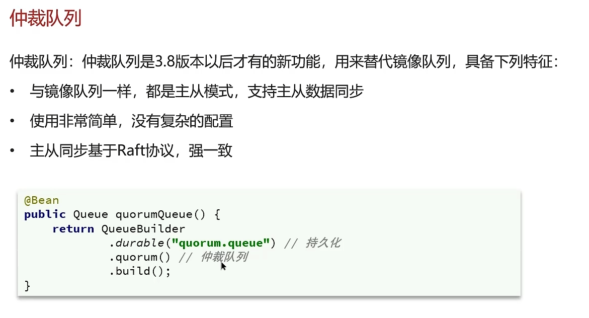

#### 多线程

##### 线程和进程的区别

程序由指令和数据组成，但这些指令要运行，数据要读写，就必须将指令加载至 CPU，数据加载至内存。在指令运行过程中还需要用到磁盘、网络等设备。进程就是用来加载指令、管理内存、管理 IO 的。

**当一个程序被运行，从磁盘加载这个程序的代码至内存，这时就开启了一个进程。**

一个进程之内可以分为一到多个线程。

一个线程就是一个指令流，将指令流中的一条条指令以一定的顺序交给 CPU 执行

Java 中，线程作为最小调度单位，进程作为资源分配的最小单位。在 windows 中进程是不活动的，只是作为线程的容器

**二者对比**

- 进程是正在运行程序的实例，进程中包含了线程，每个线程执行不同的任务
- 不同的进程使用不同的内存空间，在当前进程下的所有线程可以共享内存空间
- 线程更轻量，线程上下文切换成本一般上要比进程上下文切换低(上下文切换指的是从一个线程切换到另一个线程)

**参考回答**

- 进程是正在运行程序的实例，进程中包含了线程，每个线程执行不同的任务
- 不同的进程使用不同的内存空间，在当前进程下的所有线程可以共享内存空间
- 线程更轻量，线程上下文切换成本一般上要比进程上下文切换低(上下文切换指的是从一个线程切换到另一个线程)

##### 并行和并发的区别

单核CPU

- 单核 CPU 下线程实际还是串行执行的
- 操作系统中有一个组件叫做任务调度器，将cpu的时间片（windows下时间片最小约为 15 毫秒）分给不同的程序使用，只是由于cpu在线程间（时间片很短）的切换非常快，人类感觉是同时运行的 。
- 总结为一句话就是： 微观串行，宏观并行

一般会将这种线程轮流使用CPU的做法称为并发（concurrent）

多核CPU

每个核（core）都可以调度运行线程，这时候线程可以是并行的。

**并发（concurrent）是同一时间应对（dealing with）多件事情的能力**

**并行（parallel）是同一时间动手做（doing）多件事情的能力**

**参考回答**

* 现在都是多核CPU，在多核CPU下

* 并发是同一时间应对多件事情的能力，多个线程轮流使用一个或多个CPU

* 并行是同一时间动手做多件事情的能力，4核CPU同时执行4个线程

##### 创建线程的四种方式

共有四种方式可以创建线程，分别是：继承Thread类、实现runnable接口、实现Callable接口、线程池创建线程

详细创建方式参考下面代码：

① **继承Thread类**

```Java
public class MyThread extends Thread {
 
     @Override
     public void run() {
         System.out.println("MyThread...run...");
     }
 
     public static void main(String[] args) {
 
         // 创建MyThread对象
         MyThread t1 = new MyThread() ;
         MyThread t2 = new MyThread() ;
 
         // 调用start方法启动线程
         t1.start();
         t2.start();
 
     }
 }
```

② **实现runnable接口**

```Java
public class MyRunnable implements Runnable{
 
     @Override
     public void run() {
         System.out.println("MyRunnable...run...");
     }
 
     public static void main(String[] args) {
 
         // 创建MyRunnable对象
         MyRunnable mr = new MyRunnable() ;
 
         // 创建Thread对象
         Thread t1 = new Thread(mr) ;
         Thread t2 = new Thread(mr) ;
 
         // 调用start方法启动线程
         t1.start();
         t2.start();
 
     }
 
 }
```

③ **实现Callable接口**

```Java
public class MyCallable implements Callable<String> {
 
     @Override
     public String call() throws Exception {
         System.out.println("MyCallable...call...");
         return "OK";
     }
 
     public static void main(String[] args) throws ExecutionException, InterruptedException {
 
         // 创建MyCallable对象
         MyCallable mc = new MyCallable() ;
 
         // 创建F
         FutureTask<String> ft = new FutureTask<String>(mc) ;
 
         // 创建Thread对象
         Thread t1 = new Thread(ft) ;
         Thread t2 = new Thread(ft) ;
 
         // 调用start方法启动线程
         t1.start();
 
         // 调用ft的get方法获取执行结果
         String result = ft.get();
 
         // 输出
         System.out.println(result);
 
     }
 
 }
```

④ **线程池创建线程**

```Java
public class MyExecutors implements Runnable{
 
     @Override
     public void run() {
         System.out.println("MyRunnable...run...");
     }
 
     public static void main(String[] args) {
 
         // 创建线程池对象
         ExecutorService threadPool = Executors.newFixedThreadPool(3);
         threadPool.submit(new MyExecutors()) ;
 
         // 关闭线程池
         threadPool.shutdown();
 
     }
 
 }
```

**参考回答**

在java中一共有四种常见的创建方式，分别是：继承Thread类、实现runnable接口、实现Callable接口、线程池创建线程。通常情况下，我们项目中都会采用线程池的方式创建线程。

##### runnable 和 callable 有什么区别

**参考回答**

1. Runnable 接口 run 方法没有返回值；Callable 接口 call 方法有返回值，是个泛型，和 Future、FutureTask 配合可以用来获取异步执行的结果
2. Callalbe 接口支持返回执行结果，需要调用 FutureTask.get() 得到，此方法会阻塞主进程的继续往下执行，如果不调用不会阻塞。
3. Callable 接口的call()方法允许抛出异常；而 Runnable 接口的 run() 方法的异常只能在内部消化，不能继续上抛

##### 线程的 run()和 start()有什么区别？

start(): 用来启动线程，通过该线程调用 run 方法执行 run 方法中所定义的逻辑代码。start方法只能被调用一次。（开启线程）

run(): 封装了要被线程执行的代码，可以被调用多次。（与调用普通方法区别不大）

##### 线程包括哪些状态，状态之间是如何变化的

线程的状态可以参考JDK中的Thread类中的枚举State

```Java
public enum State {
         /**
          * 尚未启动的线程的线程状态
          /
         NEW,
 
         /**
          * 可运行线程的线程状态。处于可运行状态的线程正在 Java 虚拟机中执行，但它可能正在等待来自        
          * 操作系统的其他资源，例如处理器。
          /
         RUNNABLE,
 
         /**
          * 线程阻塞等待监视器锁的线程状态。处于阻塞状态的线程正在等待监视器锁进入同步块/方法或在调          
          * 用Object.wait后重新进入同步块/方法。
          /
         BLOCKED,
 
         /**
          * 等待线程的线程状态。由于调用以下方法之一，线程处于等待状态：
         * Object.wait没有超时
          * 没有超时的Thread.join
          * LockSupport.park
          * 处于等待状态的线程正在等待另一个线程执行特定操作。
          * 例如，一个对对象调用Object.wait()的线程正在等待另一个线程对该对象调用Object.notify()         
          * 或Object.notifyAll() 。已调用Thread.join()的线程正在等待指定线程终止。
          /
         WAITING,
 
         /**
          * 具有指定等待时间的等待线程的线程状态。由于以指定的正等待时间调用以下方法之一，线程处于定时等待状态：
         * Thread.sleep
         * Object.wait超时
         * Thread.join超时
         * LockSupport.parkNanos
         * LockSupport.parkUntil
          * </ul>
          /
         TIMED_WAITING,
         
         /**
          * 已终止线程的线程状态。线程已完成执行
          */
         TERMINATED;
     }
```

状态之间是如何变化的


分别是

- 新建
  - 当一个线程对象被创建，但还未调用 start 方法时处于**新建**状态
  - 此时未与操作系统底层线程关联
- 可运行
  - 调用了 start 方法，就会由**新建**进入**可运行**
  - 此时与底层线程关联，由操作系统调度执行
- 终结
  - 线程内代码已经执行完毕，由**可运行**进入**终结**
  - 此时会取消与底层线程关联
- 阻塞
  - 当获取锁失败后，由**可运行**进入 Monitor 的阻塞队列**阻塞**，此时不占用 cpu 时间
  - 当持锁线程释放锁时，会按照一定规则唤醒阻塞队列中的**阻塞**线程，唤醒后的线程进入**可运行**状态
- 等待
  - 当获取锁成功后，但由于条件不满足，调用了 wait() 方法，此时从**可运行**状态释放锁进入 Monitor 等待集合**等待**，同样不占用 cpu 时间
  - 当其它持锁线程调用 notify() 或 notifyAll() 方法，会按照一定规则唤醒等待集合中的**等待**线程，恢复为**可运行**状态
- 有时限等待
  - 当获取锁成功后，但由于条件不满足，调用了 wait(long) 方法，此时从**可运行**状态释放锁进入 Monitor 等待集合进行**有时限等待**，同样不占用 cpu 时间
  - 当其它持锁线程调用 notify() 或 notifyAll() 方法，会按照一定规则唤醒等待集合中的**有时限等待**线程，恢复为**可运行**状态，并重新去竞争锁
  - 如果等待超时，也会从**有时限等待**状态恢复为**可运行**状态，并重新去竞争锁
  - 还有一种情况是调用 sleep(long) 方法也会从**可运行**状态进入**有时限等待**状态，但与 Monitor 无关，不需要主动唤醒，超时时间到自然恢复为**可运行**状态

**参考回答**

在JDK中的Thread类中的枚举State里面定义了6中线程的状态分别是：新建、可运行、终结、阻塞、等待和有时限等待六种。

关于线程的状态切换情况比较多。我分别介绍一下

当一个线程对象被创建，但还未调用 start 方法时处于**新建**状态，调用了 start 方法，就会由**新建**进入**可运行**状态。如果线程内代码已经执行完毕，由**可运行**进入**终结**状态。当然这些是一个线程正常执行情况。

如果线程获取锁失败后，由**可运行**进入 Monitor 的阻塞队列**阻塞**，只有当持锁线程释放锁时，会按照一定规则唤醒阻塞队列中的**阻塞**线程，唤醒后的线程进入**可运行**状态

如果线程获取锁成功后，但由于条件不满足，调用了 wait() 方法，此时从**可运行**状态释放锁**等待**状态，当其它持锁线程调用 notify() 或 notifyAll() 方法，会恢复为**可运行**状态

还有一种情况是调用 sleep(long) 方法也会从**可运行**状态进入**有时限等待**状态，不需要主动唤醒，超时时间到自然恢复为**可运行**状态

##### 新建 T1、T2、T3 三个线程，如何保证它们按顺序执行？

在多线程中有多种方法让线程按特定顺序执行，你可以用线程类的**join**()方法在一个线程中启动另一个线程，另外一个线程完成该线程继续执行。

代码举例：

为了确保三个线程的顺序你应该先启动最后一个(T3调用T2，T2调用T1)，这样T1就会先完成而T3最后完成 

```Java
public class JoinTest {
 
     public static void main(String[] args) {
 
         // 创建线程对象
         Thread t1 = new Thread(() -> {
             System.out.println("t1");
         }) ;
 
         Thread t2 = new Thread(() -> {
             try {
                 t1.join();                          // 加入线程t1,只有t1线程执行完毕以后，再次执行该线程
             } catch (InterruptedException e) {
                 e.printStackTrace();
             }
             System.out.println("t2");
         }) ;
 
 
         Thread t3 = new Thread(() -> {
             try {
                 t2.join();                              // 加入线程t2,只有t2线程执行完毕以后，再次执行该线程
             } catch (InterruptedException e) {
                 e.printStackTrace();
             }
             System.out.println("t3");
         }) ;
 
         // 启动线程
         t1.start();
         t2.start();
         t3.start();
 
     }
 
 }
```

**参考回答**

嗯~~，我思考一下 （适当的思考或想一下属于正常情况，脱口而出反而太假[背诵痕迹]）

可以这么做，在多线程中有多种方法让线程按特定顺序执行，可以用线程类的**join**()方法在一个线程中启动另一个线程，另外一个线程完成该线程继续执行。

比如说：

使用join方法，T3调用T2，T2调用T1，这样就能确保T1就会先完成而T3最后完成

##### notify()和 notifyAll()有什么区别？

notifyAll：唤醒所有wait的线程

notify：只随机唤醒一个 wait 线程

##### java 中 wait 和 sleep 方法的不同？

**参考回答**

共同点

- wait() ，wait(long) 和 sleep(long) 的效果都是让当前线程暂时放弃 CPU 的使用权，进入阻塞状态

不同点

- 方法归属不同
  - sleep(long) 是 Thread 的静态方法
  - 而 wait()，wait(long) 都是 Object 的成员方法，每个对象都有
- 醒来时机不同
  - 执行 sleep(long) 和 wait(long) 的线程都会在等待相应毫秒后醒来
  - wait(long) 和 wait() 还可以被 notify 唤醒，wait() 如果不唤醒就一直等下去
  - 它们都可以被打断唤醒
- 锁特性不同（重点）
  - wait 方法的调用必须先获取 wait 对象的锁，而 sleep 则无此限制
  - wait 方法执行后会释放对象锁，允许其它线程获得该对象锁（我放弃 cpu，但你们还可以用）
  - 而 sleep 如果在 synchronized 代码块中执行，并不会释放对象锁（我放弃 cpu，你们也用不了）

##### 如何停止一个正在运行的线程？

**参考回答**

有三种方式可以停止线程

- 使用退出标志，使线程正常退出，也就是当run方法完成后线程终止
- 使用stop方法强行终止（不推荐，方法已作废）
- 使用 interrupt 方法中断线程

##### synchronized关键字的底层原理

###### 基本使用

如下抢票的代码，如果不加锁，就会出现超卖或者一张票卖给多个人

Synchronized【对象锁】采用互斥的方式让同一时刻至多只有一个线程能持有【对象锁】，其它线程再想获取这个【对象锁】时就会阻塞住

```Java
public class TicketDemo {

    static Object lock = new Object();
    int ticketNum = 10;


    public synchronized void getTicket() {
        synchronized (this) {
            if (ticketNum <= 0) {
                return;
            }
            System.out.println(Thread.currentThread().getName() + "抢到一张票,剩余:" + ticketNum);
            // 非原子性操作
            ticketNum--;
        }
    }

    public static void main(String[] args) {
        TicketDemo ticketDemo = new TicketDemo();
        for (int i = 0; i < 20; i++) {
            new Thread(() -> {
                ticketDemo.getTicket();
            }).start();
        }
    }


}
```

###### Monitor

Monitor 被翻译为监视器，是由jvm提供，c++语言实现

在代码中想要体现monitor需要借助javap命令查看class的字节码，比如以下代码：

```Java
public class SyncTest {

    static final Object lock = new Object();
    static int counter = 0;
    public static void main(String[] args) {
        synchronized (lock) {
            counter++;
        }
    }
}
```

找到这个类的class文件，在class文件目录下执行`javap -v SyncTest.class`，反编译效果如下：

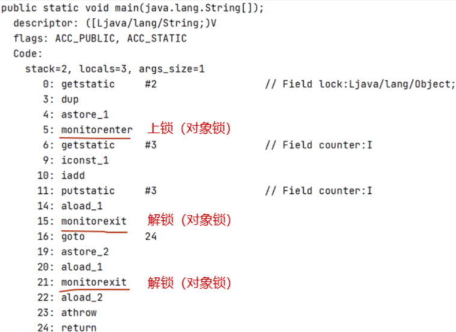

- monitorenter    上锁开始的地方
- monitorexit        解锁的地方
- 其中被monitorenter和monitorexit包围住的指令就是上锁的代码
- 有两个monitorexit的原因，第二个monitorexit是为了防止锁住的代码抛异常后不能及时释放锁（finally）

在使用了synchornized代码块时需要指定一个对象，所以synchornized也被称为对象锁

monitor主要就是跟这个对象产生关联，如下图


###### Monitor内部具体的存储结构：

- Owner：存储当前获取锁的线程的，只能有一个线程可以获取
- EntryList：关联没有抢到锁的线程，处于Blocked状态的线程
- WaitSet：关联调用了wait方法的线程，处于Waiting状态的线程

###### 具体的流程：

- 代码进入synchorized代码块，先让lock（对象锁）关联的monitor，然后判断Owner是否有线程持有
- 如果没有线程持有，则让当前线程持有，表示该线程获取锁成功
- 如果有线程持有，则让当前线程进入entryList进行阻塞，如果Owner持有的线程已经释放了锁，在EntryList中的线程去竞争锁的持有权（非公平）
- 如果代码块中调用了wait()方法，则会进去WaitSet中进行等待

###### 参考回答：

- Synchronized【对象锁】采用互斥的方式让同一时刻至多只有一个线程能持有【对象锁】
- 它的底层由monitor实现的，monitor是jvm级别的对象（ C++实现），线程获得锁需要使用对象（锁）关联monitor
- 在monitor内部有三个属性，分别是owner、entrylist、waitset
- 其中owner是关联的获得锁的线程，并且只能关联一个线程；entrylist关联的是处于阻塞状态的线程；waitset关联的是处于Waiting状态的线程

###### 参考回答

synchronized 底层使用的JVM级别中的Monitor 来决定当前线程是否获得了锁，如果某一个线程获得了锁，在没有释放锁之前，其他线程是不能或得到锁的。synchronized 属于悲观锁。

synchronized 因为需要依赖于JVM级别的Monitor ，相对性能也比较低。

monitor对象存在于每个Java对象的对象头中，synchronized 锁便是通过这种方式获取锁的，也是为什么Java中任意对象可以作为锁的原因

monitor内部维护了三个变量

- WaitSet：保存处于Waiting状态的线程
- EntryList：保存处于Blocked状态的线程
- Owner：持有锁的线程

只有一个线程获取到的标志就是在monitor中设置成功了Owner，一个monitor中只能有一个Owner

在上锁的过程中，如果有其他线程也来抢锁，则进入EntryList 进行阻塞，当获得锁的线程执行完了，释放了锁，就会唤醒EntryList 中等待的线程竞争锁，竞争的时候是非公平的。

##### synchronized关键字的底层原理-进阶

###### Monitor实现的锁属于重量级锁，你了解过锁升级吗？

- Monitor实现的锁属于重量级锁，里面涉及到了用户态和内核态的切换、进程的上下文切换，成本较高，性能比较低。
- 在JDK 1.6引入了两种新型锁机制：偏向锁和轻量级锁，它们的引入是为了解决在没有多线程竞争或基本没有竞争的场景下因使用传统锁机制带来的性能开销问题。

###### 对象的内存结构

在HotSpot虚拟机中，对象在内存中存储的布局可分为3块区域：对象头（Header）、实例数据（Instance Data）和对齐填充


###### MarkWord


> - hashcode：25位的对象标识Hash码
> - age：对象分代年龄占4位
> - biased_lock：偏向锁标识，占1位 ，0表示没有开始偏向锁，1表示开启了偏向锁
> - thread：持有偏向锁的线程ID，占23位
> - epoch：偏向时间戳，占2位
> - ptr_to_lock_record：轻量级锁状态下，指向栈中锁记录的指针，占30位
> - ptr_to_heavyweight_monitor：重量级锁状态下，指向对象监视器Monitor的指针，占30位

我们可以通过lock的标识，来判断是哪一种锁的等级

- 后三位是001表示无锁
- 后三位是101表示偏向锁
- 后两位是00表示轻量级锁
- 后两位是10表示重量级锁

###### Monitor重量级锁


简单说就是：每个对象的对象头都可以设置monoitor的指针，让对象与monitor产生关联

###### 轻量级锁

在很多的情况下，在Java程序运行时，同步块中的代码都是不存在竞争的，不同的线程交替的执行同步块中的代码。这种情况下，用重量级锁是没必要的。因此JVM引入了轻量级锁的概念。

```Java
static final Object obj = new Object();

public static void method1() {
    synchronized (obj) {
        // 同步块 A
        method2();
    }
}

public static void method2() {
    synchronized (obj) {
        // 同步块 B
    }
}
```

###### 轻量级锁加锁的流程

1.在线程栈中创建一个Lock Record，将其obj字段指向锁对象。


2.通过CAS指令将Lock Record的地址存储在对象头的mark word中（数据进行交换），如果对象处于无锁状态则修改成功，代表该线程获得了轻量级锁。

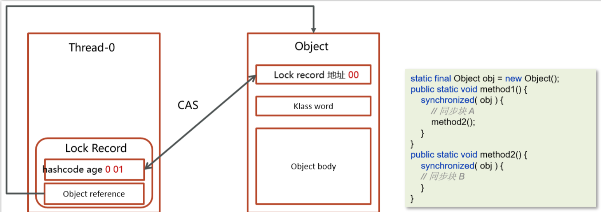

3.如果是当前线程已经持有该锁了，代表这是一次锁重入。设置Lock Record第一部分为null，起到了一个重入计数器的作用。


4.如果CAS修改失败，说明发生了竞争，需要膨胀为重量级锁。

###### 轻量级锁解锁过程

1.遍历线程栈,找到所有obj字段等于当前锁对象的Lock Record。

2.如果Lock Record的Mark Word为null，代表这是一次重入，将obj设置为null后continue。


3.如果Lock Record的 Mark Word不为null，则利用CAS指令将对象头的mark word恢复成为无锁状态。如果失败则膨胀为重量级锁。


###### 偏向锁

轻量级锁在没有竞争时（就自己这个线程），每次重入仍然需要执行 CAS 操作。

Java 6 中引入了偏向锁来做进一步优化：只有第一次使用 CAS 将线程 ID 设置到对象的 Mark Word 头，之后发现

这个线程 ID 是自己的就表示没有竞争，不用重新 CAS。以后只要不发生竞争，这个对象就归该线程所有

```Java
static final Object obj = new Object();

public static void m1() {
    synchronized (obj) {
        // 同步块 A
        m2();
    }
}

public static void m2() {
    synchronized (obj) {
        // 同步块 B
        m3();
    }
}

public static void m3() {
    synchronized (obj) {

    }
}
```

###### 偏向锁加锁流程

1.在线程栈中创建一个Lock Record，将其obj字段指向锁对象。


2.通过CAS指令将Lock Record的**线程id**存储在对象头的mark word中，同时也设置偏向锁的标识为101，如果对象处于无锁状态则修改成功，代表该线程获得了偏向锁。


3.如果是当前线程已经持有该锁了，代表这是一次锁重入。设置Lock Record第一部分为null，起到了一个重入计数器的作用。与轻量级锁不同的时，这里不会再次进行cas操作，只是判断对象头中的线程id是否是自己，因为缺少了cas操作，性能相对轻量级锁更好一些


解锁流程参考轻量级锁

###### 参考回答

Java中的synchronized有偏向锁、轻量级锁、重量级锁三种形式，分别对应了锁只被一个线程持有、不同线程交替持有锁、多线程竞争锁三种情况。

重量级锁：底层使用的Monitor实现，里面涉及到了用户态和内核态的切换、进程的上下文切换，成本较高，性能比较低。

轻量级锁：线程加锁的时间是错开的（也就是没有竞争），可以使用轻量级锁来优化。轻量级修改了对象头的锁标志，相对重量级锁性能提升很多。每次修改都是CAS操作，保证原子性

偏向锁：一段很长的时间内都只被一个线程使用锁，可以使用了偏向锁，在第一次获得锁时，会有一个CAS操作，之后该线程再获取锁，只需要判断mark word中是否是自己的线程id即可，而不是开销相对较大的CAS命令

一旦锁发生了竞争，都会升级为重量级锁

##### JMM（Java 内存模型）

JMM(Java Memory Model)Java内存模型,是java虚拟机规范中所定义的一种内存模型。

Java内存模型(Java Memory Model)描述了Java程序中各种变量(线程共享变量)的访问规则，以及在JVM中将变量存储到内存和从内存中读取变量这样的底层细节。


特点：

1. 所有的共享变量都存储于主内存(计算机的RAM)这里所说的变量指的是实例变量和类变量。不包含局部变量，因为局部变量是线程私有的，因此不存在竞争问题。
2. 每一个线程还存在自己的工作内存，线程的工作内存，保留了被线程使用的变量的工作副本。
3. 线程对变量的所有的操作(读，写)都必须在工作内存中完成，而不能直接读写主内存中的变量，不同线程之间也不能直接访问对方工作内存中的变量，线程间变量的值的传递需要通过主内存完成。

**参考回答**

Java内存模型是Java虚拟机规范中定义的一种非常重要的内存模型。它的主要作用是描述Java程序中线程共享变量的访问规则，以及这些变量在JVM中是如何被存储和读取的，涉及到一些底层的细节。

这个模型有几个核心的特点。首先，所有的共享变量，包括实例变量和类变量，都被存储在主内存中，也就是计算机的RAM。需要注意的是，局部变量并不包含在内，因为它们是线程私有的，所以不存在竞争问题。

其次，每个线程都有自己的工作内存，这里保留了线程所使用的变量的工作副本。这意味着，线程对变量的所有操作，无论是读还是写，都必须在自己的工作内存中完成，而不能直接读写主内存中的变量。

最后，不同线程之间不能直接访问对方工作内存中的变量。如果线程间需要传递变量的值，那么这个过程必须通过主内存来完成。

##### CAS

###### 概述及基本工作流程

CAS的全称是： Compare And Swap(比较再交换)，它体现的一种乐观锁的思想，在无锁情况下保证线程操作共享数据的原子性。

在JUC（ java.util.concurrent ）包下实现的很多类都用到了CAS操作

- AbstractQueuedSynchronizer（AQS框架）
- AtomicXXX类

例子：

我们还是基于刚才学习过的JMM内存模型进行说明

- 线程1与线程2都从主内存中获取变量int a = 100,同时放到各个线程的工作内存中

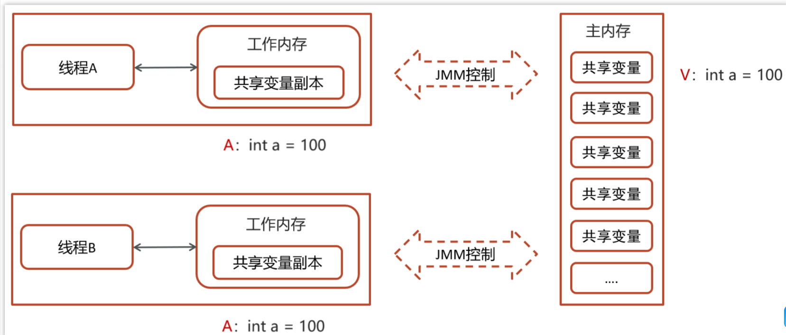

> 一个当前内存值V、旧的预期值A、即将更新的值B，当且仅当旧的预期值A和内存值V相同时，将内存值修改为B并返回true，否则什么都不做，并返回false。如果CAS操作失败，通过自旋的方式等待并再次尝试，直到成功

- 线程1操作：V：int a = 100，A：int a = 100，B：修改后的值：int a = 101 (a++)
  - 线程1拿A的值与主内存V的值进行比较，判断是否相等
  - 如果相等，则把B的值101更新到主内存中


- 线程2操作：V：int a = 100，A：int a = 100，B：修改后的值：int a = 99(a--)
  - 线程2拿A的值与主内存V的值进行比较，判断是否相等(目前不相等，因为线程1已更新V的值99)
  - 不相等，则线程2更新失败

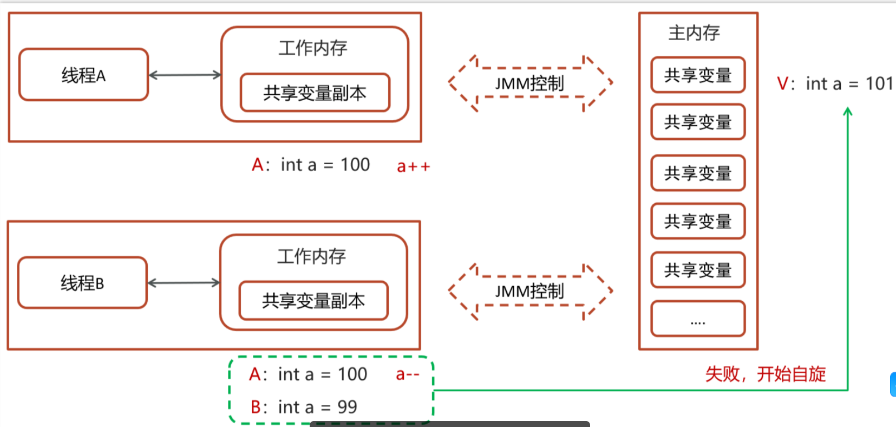

- 自旋锁操作
  - 因为没有加锁，所以线程不会陷入阻塞，效率较高
  - 如果竞争激烈，重试频繁发生，效率会受影响


需要不断尝试获取共享内存V中最新的值，然后再在新的值的基础上进行更新操作，如果失败就继续尝试获取新的值，直到更新成功

###### CAS 底层实现

CAS 底层依赖于一个 Unsafe 类来直接调用操作系统底层的 CAS 指令


都是native修饰的方法，由系统提供的接口执行，并非java代码实现，一般的思路也都是自旋锁实现

在java中比较常见使用有很多，比如ReentrantLock和Atomic开头的线程安全类，都调用了Unsafe中的方法

- ReentrantLock中的一段CAS代码


###### 乐观锁和悲观锁

- CAS 是基于乐观锁的思想：最乐观的估计，不怕别的线程来修改共享变量，就算改了也没关系，我吃亏点再重试呗。
- synchronized 是基于悲观锁的思想：最悲观的估计，得防着其它线程来修改共享变量，我上了锁你们都别想改，我改完了解开锁，你们才有机会。

###### 参考回答

CAS的全称是： Compare And Swap(比较再交换);它体现的一种乐观锁的思想，在无锁状态下保证线程操作数据的原子性。

- CAS使用到的地方很多：AQS框架、AtomicXXX类
- 在操作共享变量的时候使用的自旋锁，效率上更高一些
- CAS的底层是调用的Unsafe类中的方法，都是操作系统提供的，其他语言实现

##### volatile 

一旦一个共享变量（类的成员变量、类的静态成员变量）被volatile修饰之后，那么就具备了两层语义：

**保证线程间的可见性**

保证了不同线程对这个变量进行操作时的可见性，即一个线程修改了某个变量的值，这新值对其他线程来说是立即可见的,volatile关键字会强制将修改的值立即写入主存。

一个典型的例子：永不停止的循环

```Java
package com.itheima.basic;


// 可见性例子
// -Xint
public class ForeverLoop {
    static boolean stop = false;

    public static void main(String[] args) {
        new Thread(() -> {
            try {
                Thread.sleep(100);
            } catch (InterruptedException e) {
                e.printStackTrace();
            }
            stop = true;
            System.out.println("modify stop to true...");
        }).start();
        foo();
    }

    static void foo() {
        int i = 0;
        while (!stop) {
            i++;
        }
        System.out.println("stopped... c:"+ i);
    }
}
```

当执行上述代码的时候，发现foo()方法中的循环是结束不了的，也就说读取不到共享变量的值结束循环。

主要是因为在JVM虚拟机中有一个JIT（即时编辑器）给代码做了优化。

上述代码

```Java
while (!stop) {
    i++;
}
```

在很短的时间内，这个代码执行的次数太多了，当达到了一个阈值，JIT就会优化此代码，如下：

```Java
while (true) {
    i++;
}
```

当把代码优化成这样子以后，及时`stop`变量改变为了`false`也依然停止不了循环

解决方案：

第一：在程序运行的时候加入vm参数`-Xint`表示禁用即时编辑器，不推荐，得不偿失（其他程序还要使用）

第二：在修饰`stop`变量的时候加上`volatile`,表示当前代码禁用了即时编辑器，问题就可以解决，

代码如下：`static volatile boolean stop = false;`

**禁止进行指令重排序**

用 volatile 修饰共享变量会在读、写共享变量时加入不同的屏障，阻止其他读写操作越过屏障，从而达到阻止重排序的效果


在去获取上面的结果的时候，有可能会出现4种情况

情况一：先执行actor2获取结果--->0,0(正常)

情况二：先执行actor1中的第一行代码，然后执行actor2获取结果--->0,1(正常)

情况三：先执行actor1中所有代码，然后执行actor2获取结果--->1,1(正常)

情况四：先执行actor1中第二行代码，然后执行actor2获取结果--->1,0(发生了指令重排序，影响结果)

**解决方案**

在变量上添加volatile，禁止指令重排序，则可以解决问题


屏障添加的示意图


- 写操作加的屏障是阻止上方其它写操作越过屏障排到volatile变量写之下
- 读操作加的屏障是阻止下方其它读操作越过屏障排到volatile变量读之上

**其他补充**

我们上面的解决方案是把volatile加在了int y这个变量上，我们能不能把它加在int x这个变量上呢？

下面代码使用volatile修饰了x变量


屏障添加的示意图


这样显然是不行的，主要是因为下面两个原则：

- 写操作加的屏障是阻止上方其它写操作越过屏障排到volatile变量写之下
- 读操作加的屏障是阻止下方其它读操作越过屏障排到volatile变量读之上

所以，现在我们就可以总结一个volatile使用的小妙招：

- 写变量让volatile修饰的变量的在代码最后位置
- 读变量让volatile修饰的变量的在代码最开始位置

**参考回答**

volatile 是一个关键字，可以修饰类的成员变量、类的静态成员变量，主要有两个功能

第一：保证了不同线程对这个变量进行操作时的可见性，即一个线程修改了某个变量的值，这新值对其他线程来说是立即可见的,volatile关键字会强制将修改的值立即写入主存。

第二： 禁止进行指令重排序，可以保证代码执行有序性。底层实现原理是，添加了一个**内存屏障**，通过插入内存屏障禁止在内存屏障**前后**的指令执行重排序优化

##### AQS

**概述**

全称是 AbstractQueuedSynchronizer，是阻塞式锁和相关的同步器工具的框架，它是构建锁或者其他同步组件的基础框架

AQS与Synchronized的区别

| synchronized                   | AQS                                    |
| ------------------------------ | -------------------------------------- |
| 关键字，c++ 语言实现           | java 语言实现                          |
| 悲观锁，自动释放锁             | 悲观锁，手动开启和关闭                 |
| 锁竞争激烈都是重量级锁，性能差 | 锁竞争激烈的情况下，提供了多种解决方案 |

AQS常见的实现类

- ReentrantLock      阻塞式锁
- Semaphore        信号量
- CountDownLatch   倒计时锁

**工作机制**

- 在AQS中维护了一个使用了volatile修饰的state属性来表示资源的状态，0表示无锁，1表示有锁
- 提供了基于 FIFO 的等待队列，类似于 Monitor 的 EntryList
- 条件变量来实现等待、唤醒机制，支持多个条件变量，类似于 Monitor 的 WaitSet


- 线程0来了以后，去尝试修改state属性，如果发现state属性是0，就修改state状态为1，表示线程0抢锁成功
- 线程1和线程2也会先尝试修改state属性，发现state的值已经是1了，有其他线程持有锁，它们都会到FIFO队列中进行等待，
- FIFO是一个双向队列，head属性表示头结点，tail表示尾结点

**如果多个线程共同去抢这个资源是如何保证原子性的呢？**

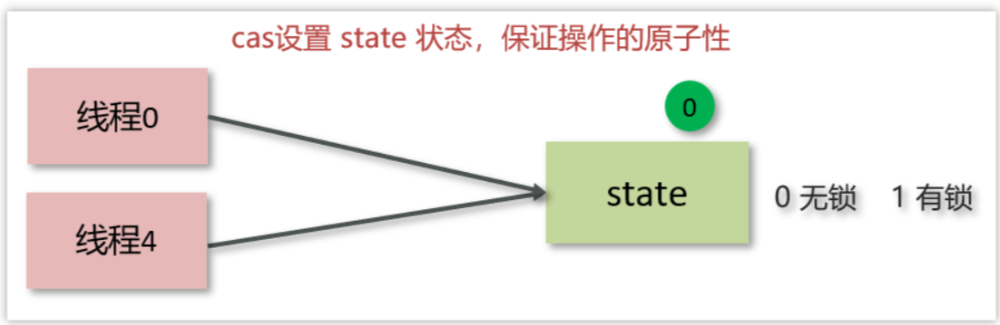

在去修改state状态的时候，使用的cas自旋锁来保证原子性，确保只能有一个线程修改成功，修改失败的线程将会进入FIFO队列中等待

**AQS是公平锁吗，还是非公平锁？**

- 新的线程与队列中的线程共同来抢资源，是非公平锁
- 新的线程到队列中等待，只让队列中的head线程获取锁，是公平锁

比较典型的AQS实现类ReentrantLock，它默认就是非公平锁，新的线程与队列中的线程共同来抢资源

**参考回答**

AQS的话，其实就一个jdk提供的类AbstractQueuedSynchronizer，是阻塞式锁和相关的同步器工具的框架。

内部有一个属性 state 属性来表示资源的状态，默认state等于0，表示没有获取锁，state等于1的时候才标明获取到了锁。通过cas 机制设置 state 状态

在它的内部还提供了基于 FIFO 的等待队列，是一个双向列表，其中

- tail 指向队列最后一个元素
- head  指向队列中最久的一个元素

其中我们刚刚聊的ReentrantLock底层的实现就是一个AQS。

##### ReentrantLock的实现原理

**概述**

- 可中断
- 可以设置超时时间
- 可以设置公平锁
- 支持多个条件变量
- 与synchronized一样，都支持重入


**实现原理**

ReentrantLock主要利用CAS+AQS队列来实现。它支持公平锁和非公平锁，两者的实现类似

构造方法接受一个可选的公平参数（默认非公平锁），当设置为true时，表示公平锁，否则为非公平锁。公平锁的效率往往没有非公平锁的效率高，在许多线程访问的情况下，公平锁表现出较低的吞吐量。

查看ReentrantLock源码中的构造方法：

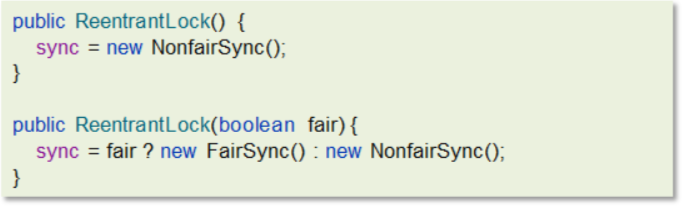

提供了两个构造方法，不带参数的默认为非公平

如果使用带参数的构造函数，并且传的值为true，则是公平锁

其中NonfairSync和FairSync这两个类父类都是Sync而Sync的父类是AQS，所以可以得出ReentrantLock底层主要实现就是基于AQS来实现的


**工作流程**


- 线程来抢锁后使用cas的方式修改state状态，修改状态成功为1，则让exclusiveOwnerThread属性指向当前线程，获取锁成功
- 假如修改状态失败，则会进入双向队列中等待，head指向双向队列头部，tail指向双向队列尾部
- 当exclusiveOwnerThread为null的时候，则会唤醒在双向队列中等待的线程
- 公平锁则体现在按照先后顺序获取锁，非公平体现在不在排队的线程也可以抢锁

**参考回答**

ReentrantLock是一个可重入锁:，调用 lock 方 法获取了锁之后，再次调用 lock，是不会再阻塞，内部直接增加重入次数 就行了，标识这个线程已经重复获取一把锁而不需要等待锁的释放。

ReentrantLock是属于juc报下的类，属于api层面的锁，跟synchronized一样，都是悲观锁。通过lock()用来获取锁，unlock()释放锁。

它的底层实现原理主要利用**CAS+AQS队列**来实现。它支持公平锁和非公平锁，两者的实现类似

构造方法接受一个可选的公平参数（**默认非公平锁**），当设置为true时，表示公平锁，否则为非公平锁。公平锁的效率往往没有非公平锁的效率高。

#####  synchronized 和 Lock 的区别

**参考回答**

第一，语法层面

- synchronized 是关键字，源码在 jvm 中，用 c++ 语言实现，退出同步代码块锁会自动释放
- Lock 是接口，源码由 jdk 提供，用 java 语言实现，需要手动调用 unlock 方法释放锁

第二，功能层面

- 二者均属于悲观锁、都具备基本的互斥、同步、锁重入功能
- Lock 提供了许多 synchronized 不具备的功能，例如获取等待状态、公平锁、可打断、可超时、多条件变量，同时Lock 可以实现不同的场景，如 ReentrantLock， ReentrantReadWriteLock

第三，性能层面

- 在没有竞争时，synchronized 做了很多优化，如偏向锁、轻量级锁，性能不赖
- 在竞争激烈时，Lock 的实现通常会提供更好的性能

统合来看，需要根据不同的场景来选择不同的锁的使用。

##### 死锁产生的条件

**参考回答**

嗯，是这样的，一个线程需要同时获取多把锁，这时就容易发生死锁，举个例子来说：

t1 线程获得A对象锁，接下来想获取B对象的锁

t2 线程获得B对象锁，接下来想获取A对象的锁 

这个时候t1线程和t2线程都在互相等待对方的锁，就产生了死锁

**造成死锁的几个原因**

(1) 一个资源每次只能被一个线程使用

(2) 一个线程在阻塞等待某个资源时，不释放已占有资源

(3) 一个线程已经获得的资源，在未使用完之前，不能被强行剥夺

(4) 若干线程形成头尾相接的循环等待资源关系

这是造成死锁必须要达到的 4 个条件，如果要避免死锁，只需要不满足其中某一个条件即可。而其中前 3 个条件是作为锁要符合的条件，所以要避免死锁就需要打破第 4 个条件，不出现循环等待锁的关系。

**如何避免**

1. 要注意加锁顺序，保证每个线程按同样的顺序进行加锁

2. 要注意加锁时限，可以针对锁设置一个超时时间

3. 要注意死锁检查，这是一种预防机制，确保在第一时间发现死锁并进行解决

##### 如何进行死锁诊断

当程序出现了死锁现象，我们可以使用jdk自带的工具：jps和 jstack

步骤如下：

第一：查看运行的线程

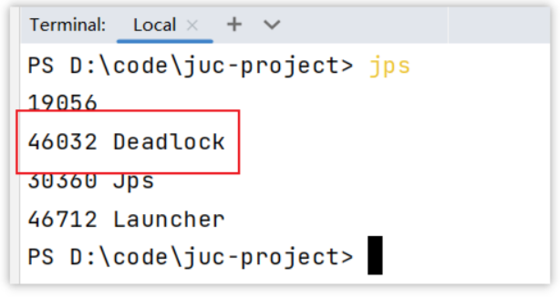

第二：使用jstack查看线程运行的情况，下图是截图的关键信息

运行命令：`jstack -l 46032`


**其他解决工具，可视化工具**

- jconsole

用于对jvm的内存，线程，类 的监控，是一个基于 jmx 的 GUI 性能监控工具

打开方式：java 安装目录 bin目录下 直接启动 jconsole.exe 就行

- VisualVM：故障处理工具

能够监控线程，内存情况，查看方法的CPU时间和内存中的对 象，已被GC的对象，反向查看分配的堆栈

打开方式：java 安装目录 bin目录下 直接启动 jvisualvm.exe就行

**参考回答**

我们只需要通过 jdk 自动的工具就能搞定

我们可以先通过 jps 来查看当前 java 程序运行的进程 id

然后通过 jstack 来查看这个进程id，就能展示出来死锁的问题，并且，可以定位代码的具体行号范围，我们再去找到对应的代码进行排查就行了。

##### ConcurrentHashMap

ConcurrentHashMap 是一种线程安全的高效Map集合

底层数据结构：

- JDK1.7底层采用分段的数组+链表实现
- JDK1.8 采用的数据结构跟HashMap1.8的结构一样，数组+链表/红黑二叉树。

**（1） JDK1.7中concurrentHashMap**

数据结构

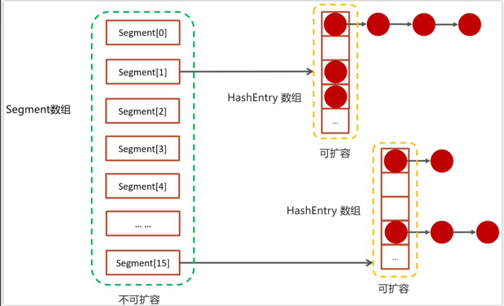

- 提供了一个segment数组，在初始化ConcurrentHashMap 的时候可以指定数组的长度，默认是16，一旦初始化之后中间不可扩容
- 在每个segment中都可以挂一个HashEntry数组，数组里面可以存储具体的元素，HashEntry数组是可以扩容的
- 在HashEntry存储的数组中存储的元素，如果发生冲突，则可以挂单向链表

存储流程


- 先去计算key的hash值，然后确定segment数组下标
- 再通过hash值确定hashEntry数组中的下标存储数据
- 在进行操作数据的之前，会先判断当前segment对应下标位置是否有线程进行操作，为了线程安全使用的是ReentrantLock进行加锁，如果获取锁是被会使用cas自旋锁进行尝试

**（2） JDK1.8中concurrentHashMap**

在JDK1.8中，放弃了Segment臃肿的设计，数据结构跟HashMap的数据结构是一样的：数组+红黑树+链表

采用 CAS + Synchronized来保证并发安全进行实现

- CAS控制数组节点的添加
- synchronized只锁定当前链表或红黑二叉树的首节点，只要hash不冲突，就不会产生并发的问题 , 效率得到提升

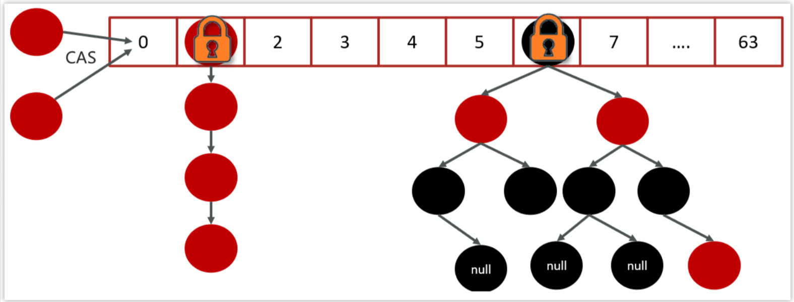

**参考回答**

ConcurrentHashMap 是一种线程安全的高效Map集合，jdk1.7和1.8也做了很多调整。

- JDK1.7的底层采用是**分段的数组**+**链表** 实现
- JDK1.8 采用的数据结构跟HashMap1.8的结构一样，数组+链表/红黑二叉树。

在jdk1.7中 ConcurrentHashMap 里包含一个 Segment 数组。Segment 的结构和HashMap类似，是一 种数组和链表结构，一个 Segment 包含一个 HashEntry 数组，每个 HashEntry 是一个链表结构 的元素，每个 Segment 守护着一个HashEntry数组里的元素，当对 HashEntry 数组的数据进行修 改时，必须首先获得对应的 Segment的锁。

Segment 是一种可重入的锁 ReentrantLock，每个 Segment 守护一个HashEntry 数组里得元 素，当对 HashEntry 数组的数据进行修改时，必须首先获得对应的 Segment 锁

在jdk1.8中的ConcurrentHashMap 做了较大的优化，性能提升了不少。首先是它的数据结构与jdk1.8的hashMap数据结构完全一致。其次是放弃了Segment臃肿的设计，取而代之的是采用Node + CAS + Synchronized来保 证并发安全进行实现，synchronized只锁定当前链表或红黑二叉树的首节点，这样只要hash不冲 突，就不会产生并发 , 效率得到提升

##### 导致并发程序出现问题的根本原因

Java并发编程三大特性

- 原子性
- 可见性
- 有序性

**（1）原子性**

一个线程在CPU中操作不可暂停，也不可中断，要不执行完成，要不不执行

比如，如下代码能保证原子性吗？


以上代码会出现超卖或者是一张票卖给同一个人，执行并不是原子性的

解决方案：

1.synchronized：同步加锁

2.JUC里面的lock：加锁


**（2）内存可见性**

内存可见性：让一个线程对共享变量的修改对另一个线程可见

比如，以下代码不能保证内存可见性


解决方案：

- synchronized
- volatile（推荐）
- LOCK

**（3）有序性**

指令重排：处理器为了提高程序运行效率，可能会对输入代码进行优化，它不保证程序中各个语句的执行先后顺序同代码中的顺序一致，但是它会保证程序最终执行结果和代码顺序执行的结果是一致的

还是之前的例子，如下代码：


解决方案：

- volatile

**参考回答**

Java并发编程有三大核心特性，分别是原子性、可见性和有序性。

首先，原子性指的是一个线程在CPU中的操作是不可暂停也不可中断的，要么执行完成，要么不执行。比如，一些简单的操作如赋值可能是原子的，但复合操作如自增就不是原子的。为了保证原子性，我们可以使用synchronized关键字或JUC里面的Lock来进行加锁。

其次，可见性是指让一个线程对共享变量的修改对另一个线程可见。由于线程可能在自己的工作内存中缓存共享变量的副本，因此一个线程对共享变量的修改可能不会立即反映在其他线程的工作内存中。为了解决这个问题，我们可以使用synchronized关键字、volatile关键字或Lock来确保可见性。

最后，有序性是指处理器为了提高程序运行效率，可能会对输入代码进行优化，导致程序中各个语句的执行先后顺序与代码中的顺序不一致。虽然处理器会保证程序最终执行结果与代码顺序执行的结果一致，但在某些情况下我们可能需要确保特定的执行顺序。为了解决这个问题，我们可以使用volatile关键字来禁止指令重排。

##### 说一下线程池的核心参数（线程池的执行原理知道嘛）

线程池核心参数主要参考ThreadPoolExecutor这个类的7个参数的构造函数


- corePoolSize 核心线程数目
- maximumPoolSize 最大线程数目 = (核心线程+救急线程的最大数目)
- keepAliveTime 生存时间 - 救急线程的生存时间，生存时间内没有新任务，此线程资源会释放
- unit 时间单位 - 救急线程的生存时间单位，如秒、毫秒等
- workQueue - 当没有空闲核心线程时，新来任务会加入到此队列排队，队列满会创建救急线程执行任务
- threadFactory 线程工厂 - 可以定制线程对象的创建，例如设置线程名字、是否是守护线程等
- handler 拒绝策略 - 当所有线程都在繁忙，workQueue 也放满时，会触发拒绝策略

**工作流程**


1，任务在提交的时候，首先判断核心线程数是否已满，如果没有满则直接添加到工作线程执行

2，如果核心线程数满了，则判断阻塞队列是否已满，如果没有满，当前任务存入阻塞队列

3，如果阻塞队列也满了，则判断线程数是否小于最大线程数，如果满足条件，则使用临时线程执行任务

如果核心或临时线程执行完成任务后会检查阻塞队列中是否有需要执行的线程，如果有，则使用非核心线程执行任务

4，如果所有线程都在忙着（核心线程+临时线程），则走拒绝策略

拒绝策略：

1.AbortPolicy：直接抛出异常，默认策略；

2.CallerRunsPolicy：用调用者所在的线程来执行任务；

3.DiscardOldestPolicy：丢弃阻塞队列中靠最前的任务，并执行当前任务；

4.DiscardPolicy：直接丢弃任务；

参考代码：

```Java
public class TestThreadPoolExecutor {

    static class MyTask implements Runnable {
        private final String name;
        private final long duration;

        public MyTask(String name) {
            this(name, 0);
        }

        public MyTask(String name, long duration) {
            this.name = name;
            this.duration = duration;
        }

        @Override
        public void run() {
            try {
                LoggerUtils.get("myThread").debug("running..." + this);
                Thread.sleep(duration);
            } catch (InterruptedException e) {
                e.printStackTrace();
            }
        }

        @Override
        public String toString() {
            return "MyTask(" + name + ")";
        }
    }

    public static void main(String[] args) throws InterruptedException {
        AtomicInteger c = new AtomicInteger(1);
        ArrayBlockingQueue<Runnable> queue = new ArrayBlockingQueue<>(2);
        ThreadPoolExecutor threadPool = new ThreadPoolExecutor(
                2,
                3,
                0,
                TimeUnit.MILLISECONDS,
                queue,
                r -> new Thread(r, "myThread" + c.getAndIncrement()),
                new ThreadPoolExecutor.AbortPolicy());
        showState(queue, threadPool);
        threadPool.submit(new MyTask("1", 3600000));
        showState(queue, threadPool);
        threadPool.submit(new MyTask("2", 3600000));
        showState(queue, threadPool);
        threadPool.submit(new MyTask("3"));
        showState(queue, threadPool);
        threadPool.submit(new MyTask("4"));
        showState(queue, threadPool);
        threadPool.submit(new MyTask("5",3600000));
        showState(queue, threadPool);
        threadPool.submit(new MyTask("6"));
        showState(queue, threadPool);
    }

    private static void showState(ArrayBlockingQueue<Runnable> queue, ThreadPoolExecutor threadPool) {
        try {
            Thread.sleep(300);
        } catch (InterruptedException e) {
            e.printStackTrace();
        }
        List<Object> tasks = new ArrayList<>();
        for (Runnable runnable : queue) {
            try {
                Field callable = FutureTask.class.getDeclaredField("callable");
                callable.setAccessible(true);
                Object adapter = callable.get(runnable);
                Class<?> clazz = Class.forName("java.util.concurrent.Executors$RunnableAdapter");
                Field task = clazz.getDeclaredField("task");
                task.setAccessible(true);
                Object o = task.get(adapter);
                tasks.add(o);
            } catch (Exception e) {
                e.printStackTrace();
            }
        }
        LoggerUtils.main.debug("pool size: {}, queue: {}", threadPool.getPoolSize(), tasks);
    }

}
```

**参考回答**

在线程池中一共有7个核心参数：

1. corePoolSize 核心线程数目 - 池中会保留的最多线程数
2. maximumPoolSize 最大线程数目 - 核心线程+救急线程的最大数目
3. keepAliveTime 生存时间 - 救急线程的生存时间，生存时间内没有新任务，此线程资源会释放
4. unit 时间单位 - 救急线程的生存时间单位，如秒、毫秒等
5. workQueue - 当没有空闲核心线程时，新来任务会加入到此队列排队，队列满会创建救急线程执行任务
6. threadFactory 线程工厂 - 可以定制线程对象的创建，例如设置线程名字、是否是守护线程等
7. handler 拒绝策略 - 当所有线程都在繁忙，workQueue 也放满时，会触发拒绝策略

  拒绝策略有4种，当线程数过多以后，第一种是抛异常、第二种是由调用者执行任务、第三是丢弃当前的任务，第四是丢弃最早排队任务。默认是直接抛异常。

##### 线程池中有哪些常见的阻塞队列

workQueue - 当没有空闲核心线程时，新来任务会加入到此队列排队，队列满会创建救急线程执行任务

比较常见的有4个，用的最多是ArrayBlockingQueue和LinkedBlockingQueue

1.ArrayBlockingQueue：基于数组结构的有界阻塞队列，FIFO。

2.LinkedBlockingQueue：基于链表结构的有界阻塞队列，FIFO。

3.DelayedWorkQueue ：是一个优先级队列，它可以保证每次出队的任务都是当前队列中执行时间最靠前的

4.SynchronousQueue：不存储元素的阻塞队列，每个插入操作都必须等待一个移出操作。

**ArrayBlockingQueue的LinkedBlockingQueue区别**

| LinkedBlockingQueue              | ArrayBlockingQueue     |
| -------------------------------- | ---------------------- |
| 默认无界，支持有界               | 强制有界               |
| 底层是链表                       | 底层是数组             |
| 是懒惰的，创建节点的时候添加数据 | 提前初始化 Node 数组   |
| 入队会生成新 Node                | Node需要是提前创建好的 |
| 两把锁（头尾）                   | 一把锁                 |

左边是LinkedBlockingQueue加锁的方式，右边是ArrayBlockingQueue加锁的方式

- LinkedBlockingQueue读和写各有一把锁，性能相对较好
- ArrayBlockingQueue只有一把锁，读和写公用，性能相对于LinkedBlockingQueue差一些

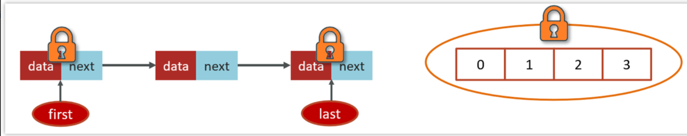

**参考回答**

Jdk中提供了很多阻塞队列，开发中常见的有两个：`ArrayBlockingQueue`和`LinkedBlockingQueue`

`ArrayBlockingQueue`和`LinkedBlockingQueue`是Java中两种常见的阻塞队列，它们在实现和使用上有一些关键的区别。

首先，`ArrayBlockingQueue`是一个有界队列，它在创建时必须指定容量，并且这个容量不能改变。而`LinkedBlockingQueue`默认是无界的，但也可以在创建时指定最大容量，使其变为有界队列。

其次，它们在内部数据结构上也有所不同。`ArrayBlockingQueue`是基于数组实现的，而`LinkedBlockingQueue`则是基于链表实现的。这意味着`ArrayBlockingQueue`在访问元素时可能会更快，因为它可以直接通过索引访问数组中的元素。而`LinkedBlockingQueue`则在添加和删除元素时可能更快，因为它不需要移动其他元素来填充空间。

另外，它们在加锁机制上也有所不同。`ArrayBlockingQueue`使用一把锁来控制对队列的访问，这意味着读写操作都是互斥的。而`LinkedBlockingQueue`则使用两把锁，一把用于控制读操作，另一把用于控制写操作，这样可以提高并发性能。

##### 如何确定核心线程数

在设置核心线程数之前，需要先熟悉一些执行线程池执行任务的类型

- IO密集型任务

一般来说：文件读写、DB读写、网络请求等

推荐：核心线程数大小设置为2N+1    （N为计算机的CPU核数）

- CPU密集型任务

一般来说：计算型代码、Bitmap转换、Gson转换等

推荐：核心线程数大小设置为N+1    （N为计算机的CPU核数）

java代码查看CPU核数


**参考回答**

① 高并发、任务执行时间短 -->（ CPU核数+1 ），减少线程上下文的切换

② 并发不高、任务执行时间长

- IO密集型的任务 --> (CPU核数 * 2 + 1)
- 计算密集型任务 --> （ CPU核数+1 ）

③ 并发高、业务执行时间长，解决这种类型任务的关键不在于线程池而在于整体架构的设计，看看这些业务里面某些数据是否能做缓存是第一步，增加服务器是第二步，至于线程池的设置，设置参考（2）

##### 线程池的种类有哪些

在java.util.concurrent.Executors类中提供了大量创建连接池的静态方法，常见就有四种

1. 创建使用固定线程数的线程池

- 核心线程数与最大线程数一样，没有救急线程
- 阻塞队列是LinkedBlockingQueue，最大容量为Integer.MAX_VALUE
- 适用场景：适用于任务量已知，相对耗时的任务
- 案例：

```Java
public class FixedThreadPoolCase {

    static class FixedThreadDemo implements Runnable{
        @Override
        public void run() {
            String name = Thread.currentThread().getName();
            for (int i = 0; i < 2; i++) {
                System.out.println(name + ":" + i);
            }
        }
    }

    public static void main(String[] args) throws InterruptedException {
        //创建一个固定大小的线程池，核心线程数和最大线程数都是3
        ExecutorService executorService = Executors.newFixedThreadPool(3);

        for (int i = 0; i < 5; i++) {
            executorService.submit(new FixedThreadDemo());
            Thread.sleep(10);
        }

        executorService.shutdown();
    }

}
```

2. 单线程化的线程池，它只会用唯一的工作线程来执行任 务，保证所有任务按照指定顺序(FIFO)执行


- 核心线程数和最大线程数都是1
- 阻塞队列是LinkedBlockingQueue，最大容量为Integer.MAX_VALUE
- 适用场景：适用于按照顺序执行的任务
- 案例：

```Java
public class NewSingleThreadCase {

    static int count = 0;

    static class Demo implements Runnable {
        @Override
        public void run() {
            count++;
            System.out.println(Thread.currentThread().getName() + ":" + count);
        }
    }

    public static void main(String[] args) throws InterruptedException {
        //单个线程池，核心线程数和最大线程数都是1
        ExecutorService exec = Executors.newSingleThreadExecutor();

        for (int i = 0; i < 10; i++) {
            exec.execute(new Demo());
            Thread.sleep(5);
        }
        exec.shutdown();
    }

}
```

3. 可缓存线程池


- 核心线程数为0
- 最大线程数是Integer.MAX_VALUE
- 阻塞队列为SynchronousQueue:不存储元素的阻塞队列，每个插入操作都必须等待一个移出操作。
- 适用场景：适合任务数比较密集，但每个任务执行时间较短的情况
- 案例：

```Java
public class CachedThreadPoolCase {

    static class Demo implements Runnable {
        @Override
        public void run() {
            String name = Thread.currentThread().getName();
            try {
                //修改睡眠时间，模拟线程执行需要花费的时间
                Thread.sleep(100);

                System.out.println(name + "执行完了");
            } catch (InterruptedException e) {
                e.printStackTrace();
            }
        }
    }

    public static void main(String[] args) throws InterruptedException {
        //创建一个缓存的线程，没有核心线程数，最大线程数为Integer.MAX_VALUE
        ExecutorService exec = Executors.newCachedThreadPool();
        for (int i = 0; i < 10; i++) {
            exec.execute(new Demo());
            Thread.sleep(1);
        }
        exec.shutdown();
    }

}
```

4. 提供了“延迟”和“周期执行”功能的ThreadPoolExecutor。


- 适用场景：有定时和延迟执行的任务
- 案例：

```Java
public class ScheduledThreadPoolCase {

    static class Task implements Runnable {
        @Override
        public void run() {
            try {
                String name = Thread.currentThread().getName();

                System.out.println(name + ", 开始：" + new Date());
                Thread.sleep(1000);
                System.out.println(name + ", 结束：" + new Date());

            } catch (InterruptedException e) {
                e.printStackTrace();
            }
        }
    }

    public static void main(String[] args) throws InterruptedException {
        //按照周期执行的线程池，核心线程数为2，最大线程数为Integer.MAX_VALUE
        ScheduledExecutorService scheduledThreadPool = Executors.newScheduledThreadPool(2);
        System.out.println("程序开始：" + new Date());

        /**
         * schedule 提交任务到线程池中
         * 第一个参数：提交的任务
         * 第二个参数：任务执行的延迟时间
         * 第三个参数：时间单位
         */
        scheduledThreadPool.schedule(new Task(), 0, TimeUnit.SECONDS);
        scheduledThreadPool.schedule(new Task(), 1, TimeUnit.SECONDS);
        scheduledThreadPool.schedule(new Task(), 5, TimeUnit.SECONDS);

        Thread.sleep(5000);

        // 关闭线程池
        scheduledThreadPool.shutdown();

    }

}
```

**参考回答**

在jdk中默认提供了4中方式创建线程池

第一个是：newCachedThreadPool创建一个可缓存线程池，如果线程池长度超过处理需要，可灵活回 收空闲线程，若无可回收，则新建线程。 

第二个是：newFixedThreadPool 创建一个定长线程池，可控制线程最大并发数，超出的线程会在队列 中等待。 

第三个是：newScheduledThreadPool 创建一个定长线程池，支持定时及周期性任务执行。 

第四个是：newSingleThreadExecutor 创建一个单线程化的线程池，它只会用唯一的工作线程来执行任 务，保证所有任务按照指定顺序(FIFO, LIFO, 优先级)执行。

##### 为什么不建议用Executors创建线程池


**参考回答**

其实这个事情在阿里提供的最新开发手册《Java开发手册-嵩山版》中也提到了

主要原因是如果使用Executors创建线程池的话，它允许的请求队列默认长度是Integer.MAX_VALUE，这样的话，有可能导致堆积大量的请求，从而导致OOM（内存溢出）。

所以，我们一般推荐使用ThreadPoolExecutor来创建线程池，这样可以明确规定线程池的参数，避免资源的耗尽。

##### CountDownLatch

CountDownLatch（闭锁/倒计时锁）用来进行线程同步协作，等待所有线程完成倒计时（一个或者多个线程，等待其他多个线程完成某件事情之后才能执行）

- 其中构造参数用来初始化等待计数值
- await() 用来等待计数归零
- countDown() 用来让计数减一


案例代码：

```Java
public class CountDownLatchDemo {

    public static void main(String[] args) throws InterruptedException {
        //初始化了一个倒计时锁 参数为 3
        CountDownLatch latch = new CountDownLatch(3);

        new Thread(() -> {
            System.out.println(Thread.currentThread().getName()+"-begin...");
            try {
                Thread.sleep(1000);
            } catch (InterruptedException e) {
                throw new RuntimeException(e);
            }
            //count--
            latch.countDown();
            System.out.println(Thread.currentThread().getName()+"-end..." +latch.getCount());
        }).start();
        new Thread(() -> {
            System.out.println(Thread.currentThread().getName()+"-begin...");
            try {
                Thread.sleep(2000);
            } catch (InterruptedException e) {
                throw new RuntimeException(e);
            }
            //count--
            latch.countDown();
            System.out.println(Thread.currentThread().getName()+"-end..." +latch.getCount());
        }).start();
        new Thread(() -> {
            System.out.println(Thread.currentThread().getName()+"-begin...");
            try {
                Thread.sleep(1500);
            } catch (InterruptedException e) {
                throw new RuntimeException(e);
            }
            //count--
            latch.countDown();
            System.out.println(Thread.currentThread().getName()+"-end..." +latch.getCount());
        }).start();
        String name = Thread.currentThread().getName();
        System.out.println(name + "-waiting...");
        //等待其他线程完成
        latch.await();
        System.out.println(name + "-wait end...");
    }
    
}
```

##### 案例一（es数据批量导入）

在我们项目上线之前，我们需要把数据库中的数据一次性的同步到es索引库中，但是当时的数据好像是1000万左右，一次性读取数据肯定不行（oom异常），当时我就想到可以使用线程池的方式导入，利用CountDownLatch来控制，就能避免一次性加载过多，防止内存溢出

整体流程就是通过CountDownLatch+线程池配合去执行

代码如下：

```java
@Service
@Transactional
@Slf4j
public class ApArticleServiceImpl implements ApArticleService {

    @Autowired
    private ApArticleMapper apArticleMapper;

    @Autowired
    private RestHighLevelClient client;

    @Autowired
    private ExecutorService executorService;

    private static final String ARTICLE_ES_INDEX = "app_info_article";

    private static final int PAGE_SIZE = 2000;

    /**
     * 批量导入
     */
    @SneakyThrows
    @Override
    public void importAll() {

        //总条数
        int count = apArticleMapper.selectCount();
        //总页数
        int totalPageSize = count % PAGE_SIZE == 0 ? count / PAGE_SIZE : count / PAGE_SIZE + 1;
        //开始执行时间
        long startTime = System.currentTimeMillis();
        //一共有多少页，就创建多少个CountDownLatch的计数
        CountDownLatch countDownLatch = new CountDownLatch(totalPageSize);

        int fromIndex;
        List<SearchArticleVo> articleList = null;

        for (int i = 0; i < totalPageSize; i++) {
            //起始分页条数
            fromIndex = i * PAGE_SIZE;
            //查询文章
            articleList = apArticleMapper.loadArticleList(fromIndex, PAGE_SIZE);
            //创建线程，做批量插入es数据操作
            TaskThread taskThread = new TaskThread(articleList, countDownLatch);
            //执行线程
            executorService.execute(taskThread);
        }

        //调用await()方法,用来等待计数归零
        countDownLatch.await();

        long endTime = System.currentTimeMillis();
        log.info("es索引数据批量导入共:{}条,共消耗时间:{}秒", count, (endTime - startTime) / 1000);
    }

    class TaskThread implements Runnable {

        List<SearchArticleVo> articleList;
        CountDownLatch cdl;

        public TaskThread(List<SearchArticleVo> articleList, CountDownLatch cdl) {
            this.articleList = articleList;
            this.cdl = cdl;
        }

        @SneakyThrows
        @Override
        public void run() {
            //批量导入
            BulkRequest bulkRequest = new BulkRequest(ARTICLE_ES_INDEX);

            for (SearchArticleVo searchArticleVo : articleList) {
                bulkRequest.add(new IndexRequest().id(searchArticleVo.getId().toString())
                        .source(JSON.toJSONString(searchArticleVo), XContentType.JSON));
            }
            //发送请求，批量添加数据到es索引库中
            client.bulk(bulkRequest, RequestOptions.DEFAULT);

            //让计数减一
            cdl.countDown();
        }
    }
}

// 线程池的配置
@Bean("taskExecutor")
    public ExecutorService executorService(){
        AtomicInteger c = new AtomicInteger(1);
        LinkedBlockingQueue<Runnable> queue = new LinkedBlockingQueue<Runnable>(QUEUE_CAPACITY);
        return new ThreadPoolExecutor(
                CORE_POOL_SIZE,
                MAX_POOL_SIZE,
                KEEP_ALIVE_SECONDS,
                TimeUnit.MILLISECONDS,
                queue,
                r -> new Thread(r, "itheima-pool-" + c.getAndIncrement()),
                new ThreadPoolExecutor.DiscardPolicy()
        );
    }

```

##### 案例二（数据汇总）

在一个电商网站中，用户下单之后，需要查询数据，数据包含了三部分：订单信息、包含的商品、物流信息；这三块信息都在不同的微服务中进行实现的，我们如何完成这个业务呢？


```java
public Map<String, Object> getOrderDetailNew() {
        long startTime = System.currentTimeMillis();

        Future<Map<String, Object>> f1 = executorService.submit(() -> {
            Map<String, Object> r =
                    restTemplate.getForObject("http://localhost:9991/order/get/{id}", Map.class, 1);
            return r;
        });
        Future<Map<String, Object>> f2 = executorService.submit(() -> {
            Map<String, Object> r =
                    restTemplate.getForObject("http://localhost:9991/product/get/{id}", Map.class, 1);
            return r;
        });

        Future<Map<String, Object>> f3 = executorService.submit(() -> {
            Map<String, Object> r =
                    restTemplate.getForObject("http://localhost:9991/logistics/get/{id}", Map.class, 1);
            return r;
        });


        Map<String, Object> resultMap = new HashMap<>();
        // get 是阻塞方法只会等Future 异步线程返回数据后执行。
        resultMap.put("order", f1.get());
        resultMap.put("product", f2.get());
        resultMap.put("logistics", f3.get());

        long endTime = System.currentTimeMillis();

        log.info("接口调用共耗时:{}毫秒",endTime-startTime);
        return resultMap;
    }
```

- 在实际开发的过程中，难免需要调用多个接口来汇总数据，如果所有接口（或部分接口）的没有依赖关系，就可以使用线程池+future来提升性能
- 报表汇总

##### 案例二（异步调用）

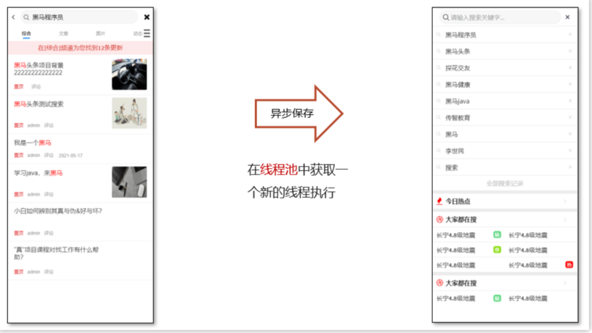

在进行搜索的时候，需要保存用户的搜索记录，而搜索记录不能影响用户的正常搜索，我们通常会开启一个线程去执行历史记录的保存，在新开启的线程在执行的过程中，可以利用线程提交任务

```java
public List<Map> search(String keyword) {

        try {
            SearchRequest request = new SearchRequest(ARTICLE_ES_INDEX);

            //设置查询条件
            BoolQueryBuilder boolQuery = QueryBuilders.boolQuery();
            //第一个条件
            if(null == keyword || "".equals(keyword)){
                request.source().query(QueryBuilders.matchAllQuery());
            }else {
                request.source().query(QueryBuilders.queryStringQuery(keyword).field("title").defaultOperator(Operator.OR));
                //保存搜索历史
                apUserSearchService.insert(userId,keyword);
            }
            //分页
            request.source().from(0);
            request.source().size(20);

            //按照时间倒序排序
            request.source().sort("publishTime", SortOrder.DESC);
            //搜索
            SearchResponse response = client.search(request, RequestOptions.DEFAULT);

            //解析结果
            SearchHits searchHits = response.getHits();
            //获取具体文档数据
            SearchHit[] hits = searchHits.getHits();
            List<Map> resultList = new ArrayList<>();
            for (SearchHit hit : hits) {
                //文档数据
                Map map = JSON.parseObject(hit.getSourceAsString(), Map.class);
                resultList.add(map);
            }
            return resultList;

        } catch (IOException e) {
            throw new RuntimeException("搜索失败");
        }

    }

public interface ApUserSearchService {

    /**
     * 保存搜索历史记录
     * @param userId
     * @param keyword
     */
    public void insert(Integer userId,String keyword);

}

public class ApUserSearchServiceImpl implements ApUserSearchService {


    /**
     * 保存搜索历史记录
     * @param userId
     * @param keyword
     */
    @Async("taskExecutor")
    @Override
    public void insert(Integer userId, String keyword) {

        //保存用户记录  mongodb或mysql
        //执行业务

        log.info("用户搜索记录保存成功,用户id:{},关键字:{}",userId,keyword);

    }
}
```

##### 案例总结

**参考回答**

嗯~~，我想一下当时的场景[根据自己简历上的模块设计多线程场景]

参考场景一：

es数据批量导入

在我们项目上线之前，我们需要把数据量的数据一次性的同步到es索引库中，但是当时的数据好像是1000万左右，一次性读取数据肯定不行（oom异常），如果分批执行的话，耗时也太久了。所以，当时我就想到可以使用线程池的方式导入，利用CountDownLatch+Future来控制，就能大大提升导入的时间。

参考场景二：

在我做那个xx电商网站的时候，里面有一个数据汇总的功能，在用户下单之后需要查询订单信息，也需要获得订单中的商品详细信息（可能是多个），还需要查看物流发货信息。因为它们三个对应的分别三个微服务，如果一个一个的操作的话，互相等待的时间比较长。所以，我当时就想到可以使用线程池，让多个线程同时处理，最终再汇总结果就可以了，当然里面需要用到Future来获取每个线程执行之后的结果才行

参考场景三：

《黑马头条》项目中使用的

我当时做了一个文章搜索的功能，用户输入关键字要搜索文章，同时需要保存用户的搜索记录（搜索历史），这块我设计的时候，为了不影响用户的正常搜索，我们采用的异步的方式进行保存的，为了提升性能，我们加入了线程池，也就说在调用异步方法的时候，直接从线程池中获取线程使用

##### 如何控制某个方法允许并发访问线程的数量？

Semaphore [ˈsɛməˌfɔr] 信号量，是JUC包下的一个工具类，我们可以通过其限制执行的线程数量，达到限流的效果

当一个线程执行时先通过其方法进行获取许可操作，获取到许可的线程继续执行业务逻辑，当线程执行完成后进行释放许可操作，未获取达到许可的线程进行等待或者直接结束。

Semaphore两个重要的方法

lsemaphore.acquire()： 请求一个信号量，这时候的信号量个数-1（一旦没有可使用的信号量，也即信号量个数变为负数时，再次请求的时候就会阻塞，直到其他线程释放了信号量）

lsemaphore.release()：释放一个信号量，此时信号量个数+1

线程任务类：

```Java
public class SemaphoreCase {
    public static void main(String[] args) {
        // 1. 创建 semaphore 对象
        Semaphore semaphore = new Semaphore(3);
        // 2. 10个线程同时运行
        for (int i = 0; i < 10; i++) {
            new Thread(() -> {

                try {
                    // 3. 获取许可
                    semaphore.acquire();
                } catch (InterruptedException e) {
                    e.printStackTrace();
                }
                try {
                    System.out.println("running...");
                    try {
                        Thread.sleep(1000);
                    } catch (InterruptedException e) {
                        e.printStackTrace();
                    }
                    System.out.println("end...");
                } finally {
                    // 4. 释放许可
                    semaphore.release();
                }
            }).start();
        }
    }

}
```

**参考回答**

嗯~~，我想一下

在jdk中提供了一个Semaphore[seməfɔːr]类（信号量）

它提供了两个方法，semaphore.acquire() 请求信号量，可以限制线程的个数，是一个正数，如果信号量是-1,就代表已经用完了信号量，其他线程需要阻塞了

第二个方法是semaphore.release()，代表是释放一个信号量，此时信号量的个数+1

##### ThreadLocal

**概述**

ThreadLocal是多线程中对于解决线程安全的一个操作类，它会为每个线程都分配一个独立的线程副本从而解决了变量并发访问冲突的问题。ThreadLocal 同时实现了线程内的资源共享

案例：使用JDBC操作数据库时，会将每一个线程的Connection放入各自的ThreadLocal中，从而保证每个线程都在各自的 Connection 上进行数据库的操作，避免A线程关闭了B线程的连接。


**ThreadLocal基本使用**

三个主要方法：

- set(value) 设置值
- get() 获取值
- remove() 清除值

```Java
public class ThreadLocalTest {
    static ThreadLocal<String> threadLocal = new ThreadLocal<>();

    public static void main(String[] args) {
        new Thread(() -> {
            String name = Thread.currentThread().getName();
            threadLocal.set("itcast");
            print(name);
            System.out.println(name + "-after remove : " + threadLocal.get());
        }, "t1").start();
        new Thread(() -> {
            String name = Thread.currentThread().getName();
            threadLocal.set("itheima");
            print(name);
            System.out.println(name + "-after remove : " + threadLocal.get());
        }, "t2").start();
    }

    static void print(String str) {
        //打印当前线程中本地内存中本地变量的值
        System.out.println(str + " :" + threadLocal.get());
        //清除本地内存中的本地变量
        threadLocal.remove();
    }

}
```


**ThreadLocal的实现原理&源码解析**

ThreadLocal本质来说就是一个线程内部存储类，从而让多个线程只操作自己内部的值，从而实现线程数据隔离


在ThreadLocal中有一个内部类叫做ThreadLocalMap，类似于HashMap

ThreadLocalMap中有一个属性table数组，这个是真正存储数据的位置

**set方法**

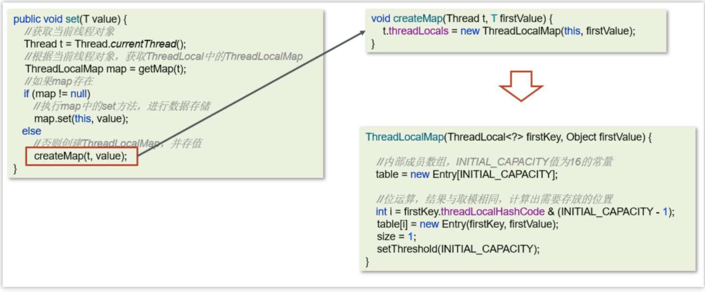

**get方法/remove方法**

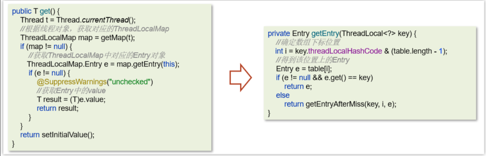

**ThreadLocal-内存泄露问题**

Java对象中的四种引用类型：强引用、软引用、弱引用、虚引用

- 强引用：最为普通的引用方式，表示一个对象处于有用且必须的状态，如果一个对象具有强引用，则GC并不会回收它。即便堆中内存不足了，宁可出现OOM，也不会对其进行回收


- 弱引用：表示一个对象处于可能有用且非必须的状态。在GC线程扫描内存区域时，一旦发现弱引用，就会回收到弱引用相关联的对象。对于弱引用的回收，无关内存区域是否足够，一旦发现则会被回收


每一个Thread维护一个ThreadLocalMap，在ThreadLocalMap中的Entry对象继承了WeakReference。其中key为使用弱引用的ThreadLocal实例，value为线程变量的副本


在使用ThreadLocal的时候，强烈建议：**务必手动remove**

**参考回答**

**面试官**：谈谈你对ThreadLocal的理解

**候选人**：

嗯，是这样的~~

ThreadLocal 主要功能有两个，第一个是可以实现资源对象的线程隔离，让每个线程各用各的资源对象，避免争用引发的线程安全问题，第二个是实现了线程内的资源共享

**面试官**：好的，那你知道ThreadLocal的底层原理实现吗？

**候选人**：

嗯，知道一些~

在ThreadLocal内部维护了一个一个 ThreadLocalMap 类型的成员变量，用来存储资源对象

当我们调用 set 方法，就是以 ThreadLocal 自己作为 key，资源对象作为 value，放入当前线程的 ThreadLocalMap 集合中

当调用 get 方法，就是以 ThreadLocal 自己作为 key，到当前线程中查找关联的资源值

当调用 remove 方法，就是以 ThreadLocal 自己作为 key，移除当前线程关联的资源值

**面试官**：好的，那关于ThreadLocal会导致内存溢出这个事情，了解吗？

**候选人**：

嗯，我之前看过源码，我想一下~~

是因为ThreadLocalMap 中的 key 被设计为弱引用，它是被动的被GC调用释放key，不过关键的是只有key可以得到内存释放，而value不会，因为value是一个强引用。

在使用ThreadLocal 时都把它作为静态变量（即强引用），因此无法被动依靠 GC 回收，建议主动的remove 释放 key，这样就能避免内存溢出。

#### JVM

##### JVM由那些部分组成，运行流程是什么？

**JVM是什么**

Java Virtual Machine Java程序的运行环境（java二进制字节码的运行环境）

好处：

- 一次编写，到处运行
- 自动内存管理，垃圾回收机制


**JVM由哪些部分组成，运行流程是什么？**


**从图中可以看出 JVM 的主要组成部分**

- ClassLoader（类加载器）
- Runtime Data Area（运行时数据区，内存分区）
- Execution Engine（执行引擎）
- Native Method Library（本地库接口）

**运行流程：**

（1）类加载器（ClassLoader）把Java代码转换为字节码

（2）运行时数据区（Runtime Data Area）把字节码加载到内存中，而字节码文件只是JVM的一套指令集规范，并不能直接交给底层系统去执行，而是有执行引擎运行

（3）执行引擎（Execution Engine）将字节码翻译为底层系统指令，再交由CPU执行去执行，此时需要调用其他语言的本地库接口（Native Method Library）来实现整个程序的功能。

##### 程序计数器

程序计数器：线程私有的，内部保存的字节码的行号。用于记录正在执行的字节码指令的地址。

javap -verbose  xx.class    打印堆栈大小，局部变量的数量和方法的参数。


   java虚拟机对于多线程是通过线程轮流切换并且分配线程执行时间。在任何的一个时间点上，一个处理器只会处理执行一个线程，如果当前被执行的这个线程它所分配的执行时间用完了【挂起】。处理器会切换到另外的一个线程上来进行执行。并且这个线程的执行时间用完了，接着处理器就会又来执行被挂起的这个线程。

​        那么现在有一个问题就是，当前处理器如何能够知道，对于这个被挂起的线程，它上一次执行到了哪里？那么这时就需要从程序计数器中来回去到当前的这个线程他上一次执行的行号，然后接着继续向下执行。

​        程序计数器是JVM规范中唯一一个没有规定出现OOM的区域，所以这个空间也不会进行GC。

##### Java堆

线程共享的区域：主要用来保存对象实例，数组等，当堆中没有内存空间可分配给实例，也无法再扩展时，则抛出OutOfMemoryError异常。


- 年轻代被划分为三部分，Eden区和两个大小严格相同的Survivor区，根据JVM的策略，在经过几次垃圾收集后，任然存活于Survivor的对象将被移动到老年代区间。
- 老年代主要保存生命周期长的对象，一般是一些老的对象
- 元空间保存的类信息、静态变量、常量、编译后的代码

为了避免方法区出现OOM，所以在java8中将堆上的方法区【永久代】给移动到了本地内存上，重新开辟了一块空间，叫做**元空间**。那么现在就可以避免掉OOM的出现了。


##### 虚拟机栈

ava Virtual machine Stacks (java 虚拟机栈)

- 每个线程运行时所需要的内存，称为虚拟机栈，先进后出
- 每个栈由多个栈帧（frame）组成，对应着每次方法调用时所占用的内存
- 每个线程只能有一个活动栈帧，对应着当前正在执行的那个方法

**垃圾回收是否涉及栈内存？**

垃圾回收主要指就是堆内存，当栈帧弹栈以后，内存就会释放

**栈内存分配越大越好吗？**

未必，默认的栈内存通常为1024k

栈帧过大会导致线程数变少，例如，机器总内存为512m，目前能活动的线程数则为512个，如果把栈内存改为2048k，那么能活动的栈帧就会减半

**方法内的局部变量是否线程安全？**

* 如果方法内局部变量没有逃离方法的作用范围，它是线程安全的

* 如果是局部变量引用了对象，并逃离方法的作用范围，需要考虑线程安全

* 比如以下代码：


**栈内存溢出情况**

- 栈帧过多导致栈内存溢出，典型问题：递归调用


##### JVM 运行时数据区

组成部分：堆、方法区、栈、本地方法栈、程序计数器

1、堆解决的是对象实例存储的问题，垃圾回收器管理的主要区域。

2、方法区可以认为是堆的一部分，用于存储已被虚拟机加载的信息，常量、静态变量、即时编译器编译后的代码。

3、栈解决的是程序运行的问题，栈里面存的是栈帧，栈帧里面存的是局部变量表、操作数栈、动态链接、方法出口等信息。

4、本地方法栈与栈功能相同，本地方法栈执行的是本地方法（非Java代码实现），一个Java调用非Java代码的接口。

5、程序计数器（PC寄存器）程序计数器中存放的是当前线程所执行的字节码的行数。JVM工作时就是通过改变这个计数器的值来选取下一个需要执行的字节码指令。

##### 方法区

**概述**

- 方法区(Method Area)是各个线程共享的内存区域
- 主要存储类的信息、运行时常量池
- 虚拟机启动的时候创建，关闭虚拟机时释放
- 如果方法区域中的内存无法满足分配请求，则会抛出OutOfMemoryError: Metaspace


**常量池**

可以看作是一张表，虚拟机指令根据这张常量表找到要执行的类名、方法名、参数类型、字面量等信息

查看字节码结构（类的基本信息、常量池、方法定义）`javap -v xx.class`

比如下面是一个Application类的main方法执行，源码如下：

```Java
public class Application {
     public static void main(String[] args) {
         System.out.println("hello world");
     }
 }
```

找到类对应的class文件存放目录，执行命令：`javap -v Application.class`   查看字节码结构

```Java
D:\code\jvm-demo\target\classes\com\heima\jvm>javap -v Application.class
 Classfile /D:/code/jvm-demo/target/classes/com/heima/jvm/Application.class
   Last modified 2023-05-07; size 564 bytes    //最后修改的时间
   MD5 checksum c1b64ed6491b9a16c2baab5061c64f88   //签名
   Compiled from "Application.java"   //从哪个源码编译
 public class com.heima.jvm.Application   //包名，类名
   minor version: 0
   major version: 52     //jdk版本
   flags: ACC_PUBLIC, ACC_SUPER  //修饰符
 Constant pool:   //常量池
    #1 = Methodref          #6.#20         // java/lang/Object."<init>":()V
    #2 = Fieldref           #21.#22        // java/lang/System.out:Ljava/io/PrintStream;
    #3 = String             #23            // hello world
    #4 = Methodref          #24.#25        // java/io/PrintStream.println:(Ljava/lang/String;)V
    #5 = Class              #26            // com/heima/jvm/Application
    #6 = Class              #27            // java/lang/Object
    #7 = Utf8               <init>
    #8 = Utf8               ()V
    #9 = Utf8               Code
   #10 = Utf8               LineNumberTable
   #11 = Utf8               LocalVariableTable
   #12 = Utf8               this
   #13 = Utf8               Lcom/heima/jvm/Application;
   #14 = Utf8               main
   #15 = Utf8               ([Ljava/lang/String;)V
   #16 = Utf8               args
   #17 = Utf8               [Ljava/lang/String;
   #18 = Utf8               SourceFile
   #19 = Utf8               Application.java
   #20 = NameAndType        #7:#8          // "<init>":()V
   #21 = Class              #28            // java/lang/System
   #22 = NameAndType        #29:#30        // out:Ljava/io/PrintStream;
   #23 = Utf8               hello world
   #24 = Class              #31            // java/io/PrintStream
   #25 = NameAndType        #32:#33        // println:(Ljava/lang/String;)V
   #26 = Utf8               com/heima/jvm/Application
   #27 = Utf8               java/lang/Object
   #28 = Utf8               java/lang/System
   #29 = Utf8               out
   #30 = Utf8               Ljava/io/PrintStream;
   #31 = Utf8               java/io/PrintStream
   #32 = Utf8               println
   #33 = Utf8               (Ljava/lang/String;)V
 {
   public com.heima.jvm.Application();  //构造方法
     descriptor: ()V
     flags: ACC_PUBLIC
     Code:
       stack=1, locals=1, args_size=1
          0: aload_0
          1: invokespecial #1                  // Method java/lang/Object."<init>":()V
          4: return
       LineNumberTable:
         line 3: 0
       LocalVariableTable:
         Start  Length  Slot  Name   Signature
             0       5     0  this   Lcom/heima/jvm/Application;
 
   public static void main(java.lang.String[]);  //main方法
     descriptor: ([Ljava/lang/String;)V
     flags: ACC_PUBLIC, ACC_STATIC
     Code:
       stack=2, locals=1, args_size=1
          0: getstatic     #2                  // Field java/lang/System.out:Ljava/io/PrintStream;
          3: ldc           #3                  // String hello world
          5: invokevirtual #4                  // Method java/io/PrintStream.println:(Ljava/lang/String;)V
          8: return
       LineNumberTable:
         line 7: 0
         line 8: 8
       LocalVariableTable:
         Start  Length  Slot  Name   Signature
             0       9     0  args   [Ljava/lang/String;
 }
 SourceFile: "Application.java"
```

下图，左侧是main方法的指令信息，右侧constant pool  是常量池

main方法按照指令执行的时候，需要到常量池中查表翻译找到具体的类和方法地址去执行


**运行时常量池**

常量池是 *.class 文件中的，当该类被加载，它的常量池信息就会放入运行时常量池，并把里面的符号地址变为真实地址


##### 直接内存

不受 JVM 内存回收管理，是虚拟机的系统内存，常见于 NIO 操作时，用于数据缓冲区，分配回收成本较高，但读写性能高，不受 JVM 内存回收管理

举例：

需求，在本地电脑中的一个较大的文件（超过100m）从一个磁盘挪到另外一个磁盘

使用传统的IO的时间要比NIO操作的时间长了很多了，也就说NIO的读性能更好。

这个是跟我们的JVM的直接内存是有一定关系，如下图，是传统阻塞IO的数据传输流程


下图是NIO传输数据的流程，在这个里面主要使用到了一个直接内存，不需要在堆中开辟空间进行数据的拷贝，jvm可以直接操作直接内存，从而使数据读写传输更快。


##### 堆栈的区别

1、栈内存一般会用来存储局部变量和方法调用，但堆内存是用来存储Java对象和数组的的。堆会GC垃圾回收，而栈不会。

2、栈内存是线程私有的，而堆内存是线程共有的。

3,、两者异常错误不同，但如果栈内存或者堆内存不足都会抛出异常。

栈空间不足：java.lang.StackOverFlowError。

堆空间不足：java.lang.OutOfMemoryError。

##### 什么是类加载器，类加载器有哪些?

要想理解类加载器的话，务必要先清楚对于一个Java文件，它从编译到执行的整个过程。


- 类加载器：用于装载字节码文件(.class文件)
- 运行时数据区：用于分配存储空间
- 执行引擎：执行字节码文件或本地方法
- 垃圾回收器：用于对JVM中的垃圾内容进行回收

**类加载器**

JVM只会运行二进制文件，而类加载器（ClassLoader）的主要作用就是将**字节码文件加载到JVM中**，从而让Java程序能够启动起来。现有的类加载器基本上都是java.lang.ClassLoader的子类，该类的只要职责就是用于将指定的类找到或生成对应的字节码文件，同时类加载器还会负责加载程序所需要的资源

**类加载器种类**

类加载器根据各自加载范围的不同，划分为四种类加载器：

- **启动类加载器(BootStrap ClassLoader)：**
- 该类并不继承ClassLoader类，其是由C++编写实现。用于加载**JAVA_HOME/jre/lib**目录下的类库。
- **扩展类加载器(ExtClassLoader)：**
- 该类是ClassLoader的子类，主要加载**JAVA_HOME/jre/lib/ext**目录中的类库。
- **应用类加载器(AppClassLoader)：**
- 该类是ClassLoader的子类，主要用于加载**classPath**下的类，也就是加载开发者自己编写的Java类。
- **自定义类加载器：**
- 开发者自定义类继承ClassLoader，实现自定义类加载规则。

上述三种类加载器的层次结构如下如下：


类加载器的体系并不是“继承”体系，而是**委派体系**，类加载器首先会到自己的 parent 中查找类或者资源，如果找不到才会到自己本地查找。类加载器的委托行为动机是为了避免相同的类被加载多次。

##### 双亲委派模型

如果一个类加载器在接到加载类的请求时，它首先不会自己尝试去加载这个类，而是把这个请求任务委托给父类加载器去完成，依次递归，如果父类加载器可以完成类加载任务，就返回成功；只有父类加载器无法完成此加载任务时，才由下一级去加载。 

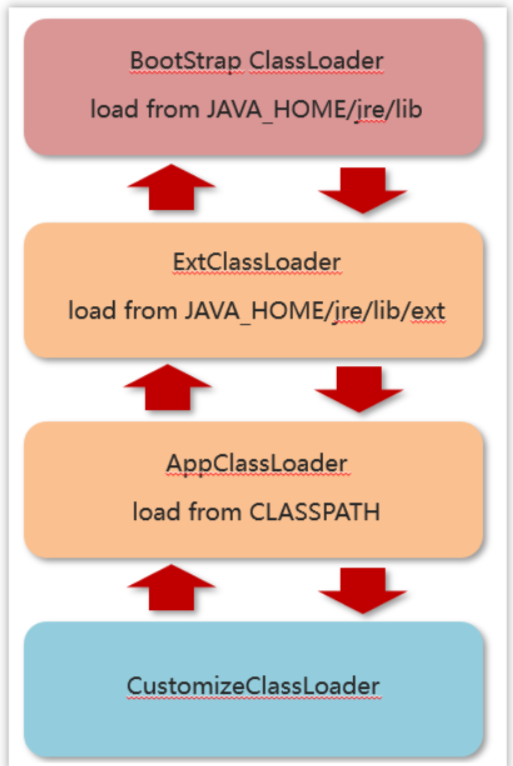

##### JVM为什么采用双亲委派机制

（1）通过双亲委派机制可以避免某一个类被重复加载，当父类已经加载后则无需重复加载，保证唯一性。

（2）为了安全，保证类库API不会被修改

在工程中新建java.lang包，接着在该包下新建String类，并定义main函数

```Java
public class String {
 
     public static void main(String[] args) {
 
         System.out.println("demo info");
     }
 }
```

此时执行main函数，会出现异常，在类 java.lang.String 中找不到 main 方法


出现该信息是因为由双亲委派的机制，java.lang.String的在启动类加载器(Bootstrap classLoader)得到加载，因为在核心jre库中有其相同名字的类文件，但该类中并没有main方法。这样就能防止恶意篡改核心API库。

##### 类装载的执行过程

类从加载到虚拟机中开始，直到卸载为止，它的整个生命周期包括了：加载、验证、准备、解析、初始化、使用和卸载这7个阶段。其中，验证、准备和解析这三个部分统称为连接（linking）。


**类加载过程详解**

1.加载

 


- 通过类的全名，获取类的二进制数据流。
- 解析类的二进制数据流为方法区内的数据结构（Java类模型） 
- 创建java.lang.Class类的实例，表示该类型。作为方法区这个类的各种数据的访问入口


2.验证


**验证类是否符合JVM规范，安全性检查**

(1)文件格式验证:是否符合Class文件的规范

(2)元数据验证

​        这个类是否有父类（除了Object这个类之外，其余的类都应该有父类）

​        这个类是否继承（extends）了被final修饰过的类（被final修饰过的类表示类不能被继承）

​        类中的字段、方法是否与父类产生矛盾。（被final修饰过的方法或字段是不能覆盖的）                                                

(3)字节码验证

​        主要的目的是通过对数据流和控制流的分析，确定程序语义是合法的、符合逻辑的。

(4)符号引用验证：符号引用以一组符号来描述所引用的目标，符号可以是任何形式的字面量

比如：int i = 3;

字面量：3

符号引用：i

3.准备


**为类变量分配内存并设置类变量初始值**

- static变量，分配空间在准备阶段完成（设置默认值），赋值在初始化阶段完成
- static变量是final的基本类型，以及字符串常量，值已确定，赋值在准备阶段完成
- static变量是final的引用类型，那么赋值也会在初始化阶段完成


4.解析


**把类中的符号引用转换为直接引用**

比如：方法中调用了其他方法，方法名可以理解为符号引用，而直接引用就是使用指针直接指向方法。


5.初始化


**对类的静态变量，静态代码块执行初始化操作**

- 如果初始化一个类的时候，其父类尚未初始化，则优先初始化其父类。
- 如果同时包含多个静态变量和静态代码块，则按照自上而下的顺序依次执行。

6.使用


JVM 开始从入口方法开始执行用户的程序代码

- 调用静态类成员信息（比如：静态字段、静态方法）
- 使用new关键字为其创建对象实例

7.卸载

当用户程序代码执行完毕后，JVM 便开始销毁创建的 Class 对象，最后负责运行的 JVM 也退出内存

##### 简述Java垃圾回收机制？（GC是什么？为什么要GC）

为了让程序员更专注于代码的实现，而不用过多的考虑内存释放的问题，所以，在Java语言中，有了自动的垃圾回收机制，也就是我们熟悉的GC(Garbage Collection)。

有了垃圾回收机制后，程序员只需要关心内存的申请即可，内存的释放由系统自动识别完成。

在进行垃圾回收时，不同的对象引用类型，GC会采用不同的回收时机

换句话说，自动的垃圾回收的算法就会变得非常重要了，如果因为算法的不合理，导致内存资源一直没有释放，同样也可能会导致内存溢出的。

当然，除了Java语言，C#、Python等语言也都有自动的垃圾回收机制。

##### 对象什么时候可以被垃圾器回收


简单一句就是：如果一个或多个对象没有任何的引用指向它了，那么这个对象现在就是垃圾，如果定位了垃圾，则有可能会被垃圾回收器回收。

如果要定位什么是垃圾，有两种方式来确定，第一个是引用计数法，第二个是可达性分析算法

**引用计数法**

一个对象被引用了一次，在当前的对象头上递增一次引用次数，如果这个对象的引用次数为0，代表这个对象可回收

```Java
String demo = new String("123");
```


```Java
 String demo = null;
```


当对象间出现了循环引用的话，则引用计数法就会失效


先执行右侧代码的前4行代码


目前上方的引用关系和计数都是没问题的，但是，如果代码继续往下执行，如下图


虽然a和b都为null，但是由于a和b存在循环引用，这样a和b永远都不会被回收。

优点：

- 实时性较高，无需等到内存不够的时候，才开始回收，运行时根据对象的计数器是否为0，就可以直接回收。
- 在垃圾回收过程中，应用无需挂起。如果申请内存时，内存不足，则立刻报OOM错误。
- 区域性，更新对象的计数器时，只是影响到该对象，不会扫描全部对象。

缺点：

- 每次对象被引用时，都需要去更新计数器，有一点时间开销。 
- **浪费CPU资源**，即使内存够用，仍然在运行时进行计数器的统计。
- **无法解决循环引用问题，会引发内存泄露**。（最大的缺点） 

**可达性分析算法**

现在的虚拟机采用的都是通过可达性分析算法来确定哪些内容是垃圾。

会存在一个根节点【GC Roots】，引出它下面指向的下一个节点，再以下一个节点节点开始找出它下面的节点，依次往下类推。直到所有的节点全部遍历完毕。

> 根对象是那些肯定不能当做垃圾回收的对象，就可以当做根对象
>
> 局部变量，静态方法，静态变量，类信息
>
> 核心是：判断某对象是否与根对象有直接或间接的引用，如果没有被引用，则可以当做垃圾回收


X,Y这两个节点是可回收的，但是**并不会马上的被回收！！** 对象中存在一个方法【finalize】。当对象被标记为可回收后，当发生GC时，首先**会判断这个对象是否执行了finalize方法**，如果这个方法还没有被执行的话，那么就会先来执行这个方法，接着在这个方法执行中，可以设置当前这个对象与GC ROOTS产生关联，那么这个方法执行完成之后，GC会再次判断对象是否可达，如果仍然不可达，则会进行回收，如果可达了，则不会进行回收。

​        finalize方法对于每一个对象来说，只会执行一次。如果第一次执行这个方法的时候，设置了当前对象与RC ROOTS关联，那么这一次不会进行回收。 那么等到这个对象第二次被标记为可回收时，那么该对象的finalize方法就不会再次执行了。

**GC ROOTS：**

- 虚拟机栈（栈帧中的本地变量表）中引用的对象

```Java
 /**
demo是栈帧中的本地变量，当 demo = null 时，由于此时 demo 充当了 GC Root 的作用，demo与原来指向的实例 new Demo() 断开了连接，对象被回收。
*/
public class Demo {
 public static  void main(String[] args) {
     Demo demo = new Demo();
     demo = null;
 }
}
```

- 方法区中类静态属性引用的对象

```Java
/**
当栈帧中的本地变量 b = null 时，由于 b 原来指向的对象与 GC Root (变量 b) 断开了连接，所以 b 原来指向的对象会被回收，而由于我们给 a 赋值了变量的引用，a在此时是类静态属性引用，充当了 GC Root 的作用，它指向的对象依然存活!
*/
public class Demo {
    public static Demo a;
    public static  void main(String[] args) {
        Demo b = new Demo();
        b.a = new Demo();
        b = null;
    }
}
```

- 方法区中常量引用的对象

```Java
/**
常量 a 指向的对象并不会因为 demo 指向的对象被回收而回收
*/
public class Demo {
    public static final Demo a = new Demo();
    public static  void main(String[] args) {
        Demo demo = new Demo();
        demo = null;
    }
}
```

- 本地方法栈中 JNI（即一般说的 Native 方法）引用的对象

##### JVM 垃圾回收算法有哪些？

**标记清除算法**

标记清除算法，是将垃圾回收分为2个阶段，分别是**标记和清除**。

1.根据可达性分析算法得出的垃圾进行标记

2.对这些标记为可回收的内容进行垃圾回收


可以看到，标记清除算法解决了引用计数算法中的循环引用的问题，没有从root节点引用的对象都会被回收。

同样，标记清除算法也是有缺点的：

- 效率较低，**标记和清除两个动作都需要遍历所有的对象**，并且在GC时，**需要停止应用程序**，对于交互性要求比较高的应用而言这个体验是非常差的。
- （**重要**）通过标记清除算法清理出来的内存，碎片化较为严重，因为被回收的对象可能存在于内存的各个角落，所以清理出来的内存是不连贯的。

**复制算法**

​        复制算法的核心就是，**将原有的内存空间一分为二，每次只用其中的一块**，在垃圾回收时，将正在使用的对象复制到另一个内存空间中，然后将该内存空间清空，交换两个内存的角色，完成垃圾的回收。

​        如果内存中的垃圾对象较多，需要复制的对象就较少，这种情况下适合使用该方式并且效率比较高，反之，则不适合。 


1）将内存区域分成两部分，每次操作其中一个。

2）当进行垃圾回收时，将正在使用的内存区域中的存活对象移动到未使用的内存区域。当移动完对这部分内存区域一次性清除。

3）周而复始。

优点：

- 在垃圾对象多的情况下，效率较高
- 清理后，内存无碎片

缺点：

- 分配的2块内存空间，在同一个时刻，只能使用一半，内存使用率较低

**标记整理算法**

​        标记压缩算法是在标记清除算法的基础之上，做了优化改进的算法。和标记清除算法一样，也是从根节点开始，对对象的引用进行标记，在清理阶段，并不是简单的直接清理可回收对象，而是将存活对象都向内存另一端移动，然后清理边界以外的垃圾，从而解决了碎片化的问题。


1）标记垃圾。

2）需要清除向右边走，不需要清除的向左边走。

3）清除边界以外的垃圾。

优缺点同标记清除算法，解决了标记清除算法的碎片化的问题，同时，标记压缩算法多了一步，对象移动内存位置的步骤，其效率也有有一定的影响。

与复制算法对比：复制算法标记完就复制，但标记整理算法得等把所有存活对象都标记完毕，再进行整理

##### 分代收集算法

**

在java8时，堆被分为了两份：**新生代和老年代【1：2】**，在java7时，还存在一个永久代。


对于新生代，内部又被分为了三个区域。Eden区，S0区，S1区【8：1：1】

当对新生代产生GC：MinorGC【young GC】

当对老年代代产生GC：Major GC 

当对新生代和老年代产生FullGC： 新生代 + 老年代完整垃圾回收，暂停时间长，**应尽力避免**

**工作机制**


- 新创建的对象，都会先分配到eden区


- 当伊甸园内存不足，标记伊甸园与 from（现阶段没有）的存活对象
- 将存活对象采用复制算法复制到 to 中，复制完毕后，伊甸园和 from 内存都得到释放


- 经过一段时间后伊甸园的内存又出现不足，标记eden区域to区存活的对象，将存活的对象复制到from区


- 当幸存区对象熬过几次回收（最多15次），晋升到老年代（幸存区内存不足或大对象会导致提前晋升）

**MinorGC、 Mixed GC 、 FullGC的区别是什么**


- MinorGC【young GC】发生在新生代的垃圾回收，暂停时间短（STW）
- Mixed GC 新生代 + 老年代部分区域的垃圾回收，G1 收集器特有
- FullGC： 新生代 + 老年代完整垃圾回收，暂停时间长（STW），应尽力避免？

> 名词解释：
>
> STW（Stop-The-World）：暂停所有应用程序线程，等待垃圾回收的完成

##### 说一下 JVM 有哪些垃圾回收器？

在jvm中，实现了多种垃圾收集器，包括：

- 串行垃圾收集器
- 并行垃圾收集器
- CMS（并发）垃圾收集器
- G1垃圾收集器

**串行垃圾收集器**

Serial和Serial Old串行垃圾收集器，是指使用单线程进行垃圾回收，堆内存较小，适合个人电脑

- Serial 作用于新生代，采用复制算法
- Serial Old 作用于老年代，采用标记-整理算法

垃圾回收时，只有一个线程在工作，并且java应用中的所有线程都要暂停（STW），等待垃圾回收的完成。


**并行垃圾收集器**

Parallel New和Parallel Old是一个并行垃圾回收器，**JDK8默认使用此垃圾回收器**

- Parallel New作用于新生代，采用复制算法
- Parallel Old作用于老年代，采用标记-整理算法

垃圾回收时，多个线程在工作，并且java应用中的所有线程都要暂停（STW），等待垃圾回收的完成。


**CMS（并发）垃圾收集器**

CMS全称 Concurrent Mark Sweep，是一款并发的、使用标记-清除算法的垃圾回收器，该回收器是针对老年代垃圾回收的，是一款以获取最短回收停顿时间为目标的收集器，停顿时间短，用户体验就好。其最大特点是在进行垃圾回收时，应用仍然能正常运行。


* 初始标记：找到与GC Roots 直接管理的对象，比如图中的A。

* 并发标记：以 A 为起点找到其他被标记的对象，比如图中的 B、C、D。

* 重新标记：防止在之前有对象重新被引用或者取消引用。所以要重新标记。

* 并发清理：并发清理被标记的对象，其他对象仍能运行。

**详细聊一下G1垃圾回收器**

**概述**

- 应用于新生代和老年代，**在JDK9之后默认使用G1**
- 划分成多个区域，每个区域都可以充当 eden，survivor，old， humongous，其中 humongous 专为大对象准备
- 采用复制算法
- 响应时间与吞吐量兼顾
- 分成三个阶段：新生代回收、并发标记、混合收集
- 如果并发失败（即回收速度赶不上创建新对象速度），会触发 Full GC


**Young Collection(年轻代垃圾回收)**

- 初始时，所有区域都处于空闲状态


- 创建了一些对象，挑出一些空闲区域作为伊甸园区存储这些对象


- 当伊甸园需要垃圾回收时，挑出一个空闲区域作为幸存区，用复制算法复制存活对象，需要暂停用户线程


- 随着时间流逝，伊甸园的内存又有不足
- 将伊甸园以及之前幸存区中的存活对象，采用复制算法，复制到新的幸存区，其中较老对象晋升至老年代


**Young Collection + Concurrent Mark (年轻代垃圾回收+并发标记)** 

当老年代占用内存超过阈值(默认是45%)后，触发并发标记，这时无需暂停用户线程


- 并发标记之后，会有重新标记阶段解决漏标问题，此时需要暂停用户线程。
- 这些都完成后就知道了老年代有哪些存活对象，随后进入混合收集阶段。此时不会对所有老年代区域进行回收，而是根据暂停时间目标优先回收价值高（存活对象少）的区域（这也是 Gabage First 名称的由来）。


**Mixed Collection (混合垃圾回收)** 

复制完成，内存得到释放。进入下一轮的新生代回收、并发标记、混合收集


其中H叫做巨型对象，如果对象非常大，会开辟一块连续的空间存储巨型对象


##### 强引用、软引用、弱引用、虚引用的区别？

**强引用**

强引用：只有所有 GC Roots 对象都不通过【强引用】引用该对象，该对象才能被垃圾回收

```Java
User user = new User();
```


**软引用**

软引用：仅有软引用引用该对象时，在垃圾回收后，内存仍不足时会再次出发垃圾回收

```Java
User user = new User();
SoftReference softReference = new SoftReference(user);
```


**弱引用**

弱引用：仅有弱引用引用该对象时，在垃圾回收时，无论内存是否充足，都会回收弱引用对象

```Java
User user = new User();
WeakReference weakReference = new WeakReference(user);
```

延伸话题：ThreadLocal内存泄漏问题

ThreadLocal用的就是弱引用，看以下源码：

```Java
static class Entry extends WeakReference<ThreadLocal<?>> {
    Object value;

    Entry(ThreadLocal<?> k, Object v) {
         super(k);
         value = v; //强引用，不会被回收
     }
}
```

`Entry`的key是当前ThreadLocal，value值是我们要设置的数据。

`WeakReference`表示的是弱引用，当JVM进行GC时，一旦发现了只具有弱引用的对象，不管当前内存空间是否足够，都会回收它的内存。但是`value`是强引用，它不会被回收掉。

> ThreadLocal使用建议：使用完毕后注意调用清理方法。

**虚引用**

虚引用：必须配合引用队列使用，被引用对象回收时，会将虚引用入队，由 Reference Handler 线程调用虚引用相关方法释放直接内存


##### JVM 调优的参数可以在哪里设置参数值？

**tomcat的设置vm参数**

修改TOMCAT_HOME/bin/catalina.sh文件，如下图

```
JAVA_OPTS="-Xms512m -Xmx1024m"
```


1. #### springboot项目jar文件启动

通常在linux系统下直接加参数启动springboot项目

```
nohup java -Xms512m -Xmx1024m -jar xxxx.jar --spring.profiles.active=prod &
```

> nohup  :  用于在系统后台不挂断地运行命令，退出终端不会影响程序的运行
>
> 参数 **&**  ：让命令在后台执行，终端退出后命令仍旧执行。

##### JVM 调优的参数都有哪些?

1）设置堆的初始大小和最大大小，为了防止垃圾收集器在初始大小、最大大小之间收缩堆而产生额外的时间，通常把最大、初始大小设置为相同的值。

> -Xms：设置堆的初始化大小
>
> -Xmx：设置堆的最大大小

2） 设置年轻代中Eden区和两个Survivor区的大小比例。该值如果不设置，则默认比例为8:1:1。Java官方通过增大Eden区的大小，来减少YGC发生的次数，但有时我们发现，虽然次数减少了，但Eden区满

的时候，由于占用的空间较大，导致释放缓慢，此时STW的时间较长，因此需要按照程序情况去调优。

> -XXSurvivorRatio=3，表示年轻代中的分配比率：survivor:eden = 2:3

3）年轻代和老年代默认比例为1：2。可以通过调整二者空间大小比率来设置两者的大小。

> -XX:newSize   设置年轻代的初始大小
>
> -XX:MaxNewSize   设置年轻代的最大大小，  初始大小和最大大小两个值通常相同

4）线程堆栈的设置：**每个线程默认会开启1M的堆栈**，用于存放栈帧、调用参数、局部变量等，但一般256K就够用。通常减少每个线程的堆栈，可以产生更多的线程，但这实际上还受限于操作系统。

> -Xss   对每个线程stack大小的调整,-Xss128k

5）一般来说，当survivor区不够大或者占用量达到50%，就会把一些对象放到老年区。通过设置合理的eden区，survivor区及使用率，可以将年轻对象保存在年轻代，从而避免full GC，使用-Xmn设置年轻代的大小

6）系统CPU持续飙高的话，首先先排查代码问题，如果代码没问题，则咨询运维或者云服务器供应商，通常服务器重启或者服务器迁移即可解决。

7）对于占用内存比较多的大对象，一般会选择在老年代分配内存。如果在年轻代给大对象分配内存，年轻代内存不够了，就要在eden区移动大量对象到老年代，然后这些移动的对象可能很快消亡，因此导致full GC。通过设置参数：-XX:PetenureSizeThreshold=1000000，单位为B，标明对象大小超过1M时，在老年代(tenured)分配内存空间。

8）一般情况下，年轻对象放在eden区，当第一次GC后，如果对象还存活，放到survivor区，此后，每GC一次，年龄增加1，当对象的年龄达到阈值，就被放到tenured老年区。这个阈值可以同构-XX:MaxTenuringThreshold设置。如果想让对象留在年轻代，可以设置比较大的阈值。

* -XX:+UseParallelGC:年轻代使用并行垃圾回收收集器。这是一个关注吞吐量的收集器，可以尽可能的减少垃圾回收时间。

* -XX:+UseParallelOldGC:设置老年代使用并行垃圾回收收集器。

9）尝试使用大的内存分页：使用大的内存分页增加CPU的内存寻址能力，从而系统的性能。

* -XX:+LargePageSizeInBytes 设置内存页的大小

10）使用非占用的垃圾收集器。

* -XX:+UseConcMarkSweepGC老年代使用CMS收集器降低停顿。
  

**-xmn 与 -XX:newSize 区别**

**-XX:newSize**

仅用于设置新生代的初始大小，需配合 -XX:MaxnewSize 共同使用以限定新生代的最大上限

**-Xmn**

直接指定新生代的初始大小和最大上限，等价于同时设置 -XX:newSize 和 -XX:MaxnewSize

##### JVM 调优的工具

**jps（Java Process Status）**

输出JVM中运行的进程状态信息(现在一般使用jconsole)


**jstack**

查看java进程内**线程的堆栈**信息。

```
jstack [option] <pid>  
```

java案例

```Java
package com.heima.jvm;

public class Application {

    public static void main(String[] args) throws InterruptedException {
        while (true){
            Thread.sleep(1000);
            System.out.println("哈哈哈");
        }
    }
}
```

使用jstack查看进行堆栈运行信息


**jmap**

用于生成堆转存快照

> jmap [options] pid  内存映像信息
>
> jmap -heap pid   显示Java堆的信息
>
> jmap -dump:format=b,file=heap.hprof pid
>
> ​                format=b表示以hprof二进制格式转储Java堆的内存
>
> ​                file=<filename>用于指定快照dump文件的文件名。

例：显示了某一个java运行的堆信息

```Java
C:\Users\yuhon>jmap -heap 53280
Attaching to process ID 53280, please wait...
Debugger attached successfully.
Server compiler detected.
JVM version is 25.321-b07

using thread-local object allocation.
Parallel GC with 8 thread(s)   //并行的垃圾回收器

Heap Configuration:  //堆配置
   MinHeapFreeRatio         = 0   //空闲堆空间的最小百分比
   MaxHeapFreeRatio         = 100  //空闲堆空间的最大百分比
   MaxHeapSize              = 8524922880 (8130.0MB) //堆空间允许的最大值
   NewSize                  = 178257920 (170.0MB) //新生代堆空间的默认值
   MaxNewSize               = 2841640960 (2710.0MB) //新生代堆空间允许的最大值
   OldSize                  = 356515840 (340.0MB) //老年代堆空间的默认值
   NewRatio                 = 2 //新生代与老年代的堆空间比值，表示新生代：老年代=1：2
   SurvivorRatio            = 8 //两个Survivor区和Eden区的堆空间比值为8,表示S0:S1:Eden=1:1:8
   MetaspaceSize            = 21807104 (20.796875MB) //元空间的默认值
   CompressedClassSpaceSize = 1073741824 (1024.0MB) //压缩类使用空间大小
   MaxMetaspaceSize         = 17592186044415 MB //元空间允许的最大值
   G1HeapRegionSize         = 0 (0.0MB)//在使用 G1 垃圾回收算法时，JVM 会将 Heap 空间分隔为若干个 Region，该参数用来指定每个 Region 空间的大小。

Heap Usage:
PS Young Generation
Eden Space: //Eden使用情况
   capacity = 134217728 (128.0MB)
   used     = 10737496 (10.240074157714844MB)
   free     = 123480232 (117.75992584228516MB)
   8.000057935714722% used
From Space: //Survivor-From 使用情况
   capacity = 22020096 (21.0MB)
   used     = 0 (0.0MB)
   free     = 22020096 (21.0MB)
   0.0% used
To Space: //Survivor-To 使用情况
   capacity = 22020096 (21.0MB)
   used     = 0 (0.0MB)
   free     = 22020096 (21.0MB)
   0.0% used
PS Old Generation  //老年代 使用情况
   capacity = 356515840 (340.0MB)
   used     = 0 (0.0MB)
   free     = 356515840 (340.0MB)
   0.0% used

3185 interned Strings occupying 261264 bytes.
```

**jhat**

用于分析jmap生成的堆转存快照（一般不推荐使用，而是使用Ecplise Memory Analyzer）

堆转储文件是 JVM 在某一时刻堆内存的快照，包含了该时刻堆中所有对象的信息。

**jstat**

是JVM统计监测工具。可以用来显示垃圾回收信息、类加载信息、新生代统计信息等。

**常见参数**：

①总结垃圾回收统计

```
jstat -gcutil pid
```


| 字段 | 含义                   |
| ---- | ---------------------- |
| S0   | 幸存1区当前使用比例    |
| S1   | 幸存2区当前使用比例    |
| E    | 伊甸园区使用比例       |
| O    | 老年代使用比例         |
| M    | 元数据区使用比例       |
| CCS  | 压缩使用比例           |
| YGC  | 年轻代垃圾回收次数     |
| YGCT | 年轻代垃圾回收消耗时间 |
| FGC  | 老年代垃圾回收次数     |
| FGCT | 老年代垃圾回收消耗时间 |
| GCT  | 垃圾回收消耗总时间     |

**垃圾回收统计**

```
jstat -gc pid
```


**jconsole**

用于对jvm的内存，线程，类 的监控，是一个基于 jmx 的 GUI 性能监控工具

打开方式：java 安装目录 bin目录下 直接启动 jconsole.exe 就行


可以内存、线程、类等信息


**VisualVM：故障处理工具**

能够监控线程，内存情况，查看方法的CPU时间和内存中的对 象，已被GC的对象，反向查看分配的堆栈

打开方式：java 安装目录 bin 目录下 直接启动 jvisualvm.exe就行


监控程序运行情况


查看运行中的dump


查看堆中的信息


##### java内存泄露的排查思路？

原因：

如果线程请求分配的栈容量超过java虚拟机栈允许的最大容量的时候，java虚拟机将抛出一个StackOverFlowError异常

如果java虚拟机栈可以动态拓展，并且扩展的动作已经尝试过，但是目前无法申请到足够的内存去完成拓展，或者在建立新线程的时候没有足够的内存去创建对应的虚拟机栈，那java虚拟机将会抛出一个OutOfMemoryError异常

如果一次加载的类太多，元空间内存不足，则会报OutOfMemoryError: Metaspace


1、通过 jmap 指定打印他的内存快照 dump（堆转储文件）

有的情况是内存溢出之后程序则会直接中断，而 jmap 只能打印在运行中的程序，所以建议通过参数的方式的生成dump文件，配置如下：

> -XX:+HeapDumpOnOutOfMemoryError
>
> -XX:HeapDumpPath=/home/app/dumps/      指定生成后文件的保存目录
>
> 当 Java 应用程序在运行过程中抛出 `OutOfMemoryError` 异常时，JVM 会自动生成一个堆转储（Heap Dump）文件。

2、通过工具， VisualVM（Ecplise MAT）去分析 dump文件

VisualVM可以加载离线的dump文件，如下图

文件-->装入--->选择dump文件即可查看堆快照信息

如果是linux系统中的程序，则需要把dump文件下载到本地（windows环境）下，打开VisualVM工具分析。VisualVM目前只支持在windows环境下运行可视化


3、通过查看堆信息的情况，可以大概定位内存溢出是哪行代码出了问题


4、找到对应的代码，通过阅读上下文的情况，进行修复即可

##### CPU飙高排查方案与思路？

1.使用top命令查看占用cpu的情况


2.通过top命令查看后，可以查看是哪一个进程占用cpu较高，上图所示的进程为：30978

3.查看当前线程中的进程信息

```
ps H -eo pid,tid,%CPU | grep 40940
```

> pid  进行id
>
> tid   进程中的线程id
>
> %  cpu使用率 


4.通过上图分析，在进程30978中的线程30979占用cpu较高

注意：上述的线程id是一个十进制，我们需要把这个线程id转换为16进制才行，因为通常在日志中展示的都是16进制的线程id名称

转换方式：

在linux中执行命令

```
printf "%x\n" 30979
```


5.可以根据线程 id 找到有问题的线程，进一步定位到问题代码的源码行号

执行命令

```
jstack 30978   此处是进程id
```


##### 面试现场

###### JVM组成

**面试官**：JVM由那些部分组成，运行流程是什么？

**候选人:**

嗯，好的~~

在JVM中共有四大部分，分别是ClassLoader（类加载器）、Runtime Data Area（运行时数据区，内存分区）、Execution Engine（执行引擎）、Native Method Library（本地库接口）

它们的运行流程是：

第一，类加载器（ClassLoader）把Java代码转换为字节码

第二，运行时数据区（Runtime Data Area）把字节码加载到内存中，而字节码文件只是JVM的一套指令集规范，并不能直接交给底层系统去执行，而是有执行引擎运行

第三，执行引擎（Execution Engine）将字节码翻译为底层系统指令，再交由CPU执行去执行，此时需要调用其他语言的本地库接口（Native Method Library）来实现整个程序的功能。

**面试官**：好的，你能详细说一下 JVM 运行时数据区吗？

**候选人:**

嗯，好~

运行时数据区包含了堆、方法区、栈、本地方法栈、程序计数器这几部分，每个功能作用不一样。

- 堆解决的是对象实例存储的问题，垃圾回收器管理的主要区域。
- 方法区可以认为是堆的一部分，用于存储已被虚拟机加载的信息，常量、静态变量、即时编译器编译后的代码。
- 栈解决的是程序运行的问题，栈里面存的是栈帧，栈帧里面存的是局部变量表、操作数栈、动态链接、方法出口等信息。
- 本地方法栈与栈功能相同，本地方法栈执行的是本地方法，一个Java调用非Java代码的接口。
- 程序计数器（PC寄存器）程序计数器中存放的是当前线程所执行的字节码的行数。JVM工作时就是通过改变这个计数器的值来选取下一个需要执行的字节码指令。

**面试官**：好的，你再详细介绍一下程序计数器的作用？

**候选人:**

嗯，是这样~~

java虚拟机对于多线程是通过线程轮流切换并且分配线程执行时间。在任何的一个时间点上，一个处理器只会处理执行一个线程，如果当前被执行的这个线程它所分配的执行时间用完了【挂起】。处理器会切换到另外的一个线程上来进行执行。并且这个线程的执行时间用完了，接着处理器就会又来执行被挂起的这个线程。这时候程序计数器就起到了关键作用，程序计数器在来回切换的线程中记录他上一次执行的行号，然后接着继续向下执行。

**面试官**：你能给我详细的介绍Java堆吗?

**候选人:**

好的~

Java中的堆术语线程共享的区域。主要用来保存**对象实例，数组**等，当堆中没有内存空间可分配给实例，也无法再扩展时，则抛出OutOfMemoryError异常。

​        在JAVA8中堆内会存在年轻代、老年代

​        1）Young区被划分为三部分，Eden区和两个大小严格相同的Survivor区，其中，Survivor区间中，某一时刻只有其中一个是被使用的，另外一个留做垃圾收集时复制对象用。在Eden区变满的时候， GC就会将存活的对象移到空闲的Survivor区间中，根据JVM的策略，在经过几次垃圾收集后，任然存活于Survivor的对象将被移动到Tenured区间。

​        2）Tenured区主要保存生命周期长的对象，一般是一些老的对象，当一些对象在Young复制转移一定的次数以后，对象就会被转移到Tenured区。

**面试官**：能不能解释一下方法区？

**候选人:**

好的~

与虚拟机栈类似。本地方法栈是为虚拟机**执行本地方法时提供服务的**。不需要进行GC。本地方法一般是由其他语言编写。

**面试官**：你听过直接内存吗？

**候选人:**

嗯~~

它又叫做**堆外内存**，**线程共享的区域**，在 Java 8 之前有个**永久代**的概念，实际上指的是 HotSpot 虚拟机上的永久代，它用永久代实现了 JVM 规范定义的方法区功能，**主要存储类的信息，常量，静态变量**，即时编译器编译后代码等，这部分由于是在堆中实现的，受 GC 的管理，不过由于永久代有 -XX:MaxPermSize 的上限，所以如果大量动态生成类（将类信息放入永久代），很容易造成 OOM，有人说可以把永久代设置得足够大，但很难确定一个合适的大小，受类数量，常量数量的多少影响很大。

​        所以在 Java 8 中就把方法区的实现移到了本地内存中的元空间中，这样方法区就不受 JVM 的控制了,也就不会进行 GC，也因此提升了性能。

**面试官**：什么是虚拟机栈

**候选人:**

虚拟机栈是描述的是方法执行时的内存模型,是线程私有的，生命周期与线程相同,每个方法被执行的同时会创建**栈桢**。保存执行方法时的**局部变量、动态连接信息、方法返回地址信息**等等。方法开始执行的时候会进栈，方法执行完会出栈【相当于清空了数据】，所以这块区域**不需要进行 GC**。

**面试官**：能说一下堆栈的区别是什么吗？

**候选人:**

嗯，好的，有这几个区别

第一，栈内存一般会用来存储局部变量和方法调用，但堆内存是用来存储Java对象和数组的的。堆会GC垃圾回收，而栈不会。

第二、栈内存是线程私有的，而堆内存是线程共有的。

第三、两者异常错误不同，但如果栈内存或者堆内存不足都会抛出异常。

栈空间不足：java.lang.StackOverFlowError。

堆空间不足：java.lang.OutOfMemoryError。

###### 类加载器

**面试官**：什么是类加载器，类加载器有哪些?

**候选人:**

嗯，是这样的

JVM只会运行二进制文件，而类加载器（ClassLoader）的主要作用就是将**字节码文件加载到JVM中**，从而让Java程序能够启动起来。

常见的类加载器有4个

第一个是启动类加载器(BootStrap ClassLoader)：其是由C++编写实现。用于加载JAVA_HOME/jre/lib目录下的类库。

第二个是扩展类加载器(ExtClassLoader)：该类是ClassLoader的子类，主要加载JAVA_HOME/jre/lib/ext目录中的类库。

第三个是应用类加载器(AppClassLoader)：该类是ClassLoader的子类，主要用于加载classPath下的类，也就是加载开发者自己编写的Java类。

第四个是自定义类加载器：开发者自定义类继承ClassLoader，实现自定义类加载规则。

**面试官**：说一下类装载的执行过程？

**候选人:**

嗯，这个过程还是挺多的。

类从加载到虚拟机中开始，直到卸载为止，它的整个生命周期包括了：加载、验证、准备、解析、初始化、使用和卸载这7个阶段。其中，验证、准备和解析这三个部分统称为连接（linking）

1.加载：查找和导入class文件

2.验证：保证加载类的准确性

3.准备：为类变量分配内存并设置类变量初始值

4.解析：把类中的符号引用转换为直接引用

5.初始化：对类的静态变量，静态代码块执行初始化操作

6.使用：JVM 开始从入口方法开始执行用户的程序代码

7.卸载：当用户程序代码执行完毕后，JVM 便开始销毁创建的 Class 对象，最后负责运行的 JVM 也退出内存

**面试官**：什么是双亲委派模型？

**候选人:**

嗯，它是是这样的。

如果一个类加载器收到了类加载的请求，它首先不会自己尝试加载这个类，而是把这请求委派给父类加载器去完成，每一个层次的类加载器都是如此，因此所有的加载请求最终都应该传说到顶层的启动类加载器中，只有当父类加载器返回自己无法完成这个加载请求（它的搜索返回中没有找到所需的类）时，子类加载器才会尝试自己去加载

**面试官**：JVM为什么采用双亲委派机制

**候选人:**

主要有两个原因。

第一、通过双亲委派机制可以避免某一个类被重复加载，当父类已经加载后则无需重复加载，保证唯一性。

第二、为了安全，保证类库API不会被修改

###### 垃圾回收

**面试官**：简述Java垃圾回收机制？（GC是什么？为什么要GC）

**候选人:**

嗯，是这样~~

为了让程序员更专注于代码的实现，而不用过多的考虑内存释放的问题，所以，在Java语言中，有了自动的垃圾回收机制，也就是我们熟悉的GC(Garbage Collection)。

有了垃圾回收机制后，程序员只需要关心内存的申请即可，内存的释放由系统自动识别完成。

在进行垃圾回收时，不同的对象引用类型，GC会采用不同的回收时机

**面试官**：强引用、软引用、弱引用、虚引用的区别？

**候选人:**

嗯嗯~

强引用最为普通的引用方式，表示一个对象处于**有用且必须**的状态，如果一个对象具有强引用，则GC并不会回收它。即便堆中内存不足了，宁可出现OOM，也不会对其进行回收

软引用表示一个对象处于**有用且非必须**状态，如果一个对象处于软引用，在内存空间足够的情况下，GC机制并不会回收它，而在内存空间不足时，则会在OOM异常出现之间对其进行回收。但值得注意的是，因为GC线程优先级较低，软引用并不会立即被回收。

弱引用表示一个对象处于**可能有用且非必须**的状态。在GC线程扫描内存区域时，一旦发现弱引用，就会回收到弱引用相关联的对象。对于弱引用的回收，无关内存区域是否足够，一旦发现则会被回收。同样的，因为GC线程优先级较低，所以弱引用也并不是会被立刻回收。

虚引用表示一个对象处于**无用**的状态。在任何时候都有可能被垃圾回收。虚引用的使用必须和引用队列Reference Queue联合使用

**面试官**：对象什么时候可以被垃圾器回收

**候选人:**

思考一会~~

如果一个或多个对象没有任何的引用指向它了，那么这个对象现在就是垃圾，如果定位了垃圾，则有可能会被垃圾回收器回收。

如果要定位什么是垃圾，有两种方式来确定，第一个是引用计数法，第二个是可达性分析算法

通常都使用可达性分析算法来确定是不是垃圾

**面试官**： JVM 垃圾回收算法有哪些？

**候选人:**

我记得一共有四种，分别是标记清除算法、复制算法、标记整理算法、分代回收

**面试官**： 你能详细聊一下分代回收吗？

**候选人:**

关于分代回收是这样的

在java8时，堆被分为了两份：新生代和老年代，它们默认空间占用比例是1:2

对于新生代，内部又被分为了三个区域。Eden区，S0区，S1区默认空间占用比例是8:1:1

具体的工作机制是有些情况：

1）当创建一个对象的时候，那么这个对象会被分配在新生代的Eden区。当Eden区要满了时候，触发YoungGC。

2）当进行YoungGC后，此时在Eden区存活的对象被移动到S0区，并且**当前对象的年龄会加1**，清空Eden区。

3）当再一次触发YoungGC的时候，会把Eden区中存活下来的对象和S0中的对象，移动到S1区中，这些对象的年龄会加1，清空Eden区和S0区。

4）当再一次触发YoungGC的时候，会把Eden区中存活下来的对象和S1中的对象，移动到S0区中，这些对象的年龄会加1，清空Eden区和S1区。

5）对象的年龄达到了某一个限定的值（**默认15岁**  ），那么这个对象就会进入到老年代中。

当然也有特殊情况，如果进入Eden区的是一个大对象，在触发YoungGC的时候，会直接存放到老年代

当老年代满了之后，**触发FullGC**。**FullGC同时回收新生代和老年代**，当前只会存在一个FullGC的线程进行执行，其他的线程全部会被挂起。  我们在程序中要尽量避免FullGC的出现。

**面试官**：讲一下新生代、老年代、永久代的区别？

**候选人:**

嗯！是这样的，简单说就是

**新生代**主要用来存放新生的对象。

**老年代**主要存放应用中生命周期长的内存对象。

**永久代**指的是永久保存区域。主要存放Class和Meta（元数据）的信息。在Java8中，永久代已经被移除，取而代之的是一个称之为“元数据区”（**元空间**）的区域。元空间和永久代类似，不过元空间与永久代之间最大的区别在于：元空间并不在虚拟机中，而是使用本地内存。因此，默认情况下，元空间的大小仅受本地内存的限制。

**面试官**：说一下 JVM 有哪些垃圾回收器？

**候选人:**

在jvm中，实现了多种垃圾收集器，包括：串行垃圾收集器、并行垃圾收集器（JDK8默认）、CMS（并发）垃圾收集器、G1垃圾收集器（JDK9默认）

**面试官**：Minor GC、Major GC、Full GC是什么

**候选人:**

嗯，其实它们指的是不同代之间的垃圾回收

Minor GC 发生在新生代的垃圾回收，暂停时间短

Major GC 老年代区域的垃圾回收，老年代空间不足时，会先尝试触发Minor GC。Minor GC之后空间还不足，则会触发Major GC，Major GC速度比较慢，暂停时间长

Full GC 新生代 + 老年代完整垃圾回收，暂停时间长，**应尽力避免**

###### JVM实践（调优）

**面试官**：JVM 调优的参数可以在哪里设置参数值？

**候选人:**

我们当时的项目是springboot项目，可以在项目启动的时候，java -jar中加入参数就行了

**面试官**：用的 JVM 调优的参数都有哪些？

**候选人:**

嗯，这些参数是比较多的

我记得当时我们设置过堆的大小，像-Xms和-Xmx

还有就是可以设置年轻代中Eden区和两个Survivor区的大小比例

还有就是可以设置使用哪种垃圾回收器等等。具体的指令还真记不太清楚。

**面试官**：嗯，好的，你们平时调试 JVM都用了哪些工具呢？

**候选人:**

嗯，我们一般都是使用jdk自带的一些工具，比如

jps 输出JVM中运行的进程状态信息

jstack查看java进程内**线程的堆栈**信息。

jmap 用于生成堆转存快照

jstat用于JVM统计监测工具

还有一些可视化工具，像jconsole和VisualVM等

**面试官**：假如项目中产生了java内存泄露，你说一下你的排查思路？

**候选人:**

嗯，这个我在之前项目排查过

第一呢可以通过jmap指定打印他的内存快照 dump文件，不过有的情况打印不了，我们会设置vm参数让程序自动生成dump文件

第二，可以通过工具去分析 dump文件，jdk自带的VisualVM就可以分析

第三，通过查看堆信息的情况，可以大概定位内存溢出是哪行代码出了问题

第四，找到对应的代码，通过阅读上下文的情况，进行修复即可

**面试官**：好的，那现在再来说一种情况，就是说服务器CPU持续飙高，你的排查方案与思路？

**候选人:**

嗯，我思考一下~~

可以这么做~~

第一可以使用使用top命令查看占用cpu的情况

第二通过top命令查看后，可以查看是哪一个进程占用cpu较高，记录这个进程id

第三可以通过ps 查看当前进程中的线程信息，看看哪个线程的cpu占用较高

第四可以jstack命令打印进行的id，找到这个线程，就可以进一步定位问题代码的行号

#### 设计模式

##### 命令模式

**什么是命令模式?**
命令模式是一种行为类设计模式， 核心是将每种请求或操作封装为一个独立的对象,从而可以集中管理这些请求
或操作，比如将请求队列化依次执行、或者对操作进行记录和撤销。

命令模式通过将请求的发送者(客户端)和接收者(执行请求的对象)解耦，提供了更大的灵活性和可维护性。

**举个例子。**
我们在生活中都用过电视机，我们就相当于客户端，要操作电视来换台; 而电视就是执行请求的对象，要根据
我们的操作来换台。但是我们一般不会直接按电视上的按钮来换台，而是用一个遥控器，通过点击遥控器上的
操作按钮来控制电视。

这样就相当于把我们和电视解耦了。哪怕遥控器丢了，再换一个遥控器就好了;且现在手机都能作为万能的电
视遥控器，我们可以同时遥控多个品牌的设备，不棚关心设备的具体品牌型号,提供了更大的方便。

**命令模式优点和使用场景**

正如上面的例子，命令模式最大的优点就是解耦请求发送者和接受者，让系统更加灵活、可扩展。
由于每个操作都是一-个独立的命令类，所以我们需要新增命令操作时，不要改动现有代码。

**命令模式典型的应用场景:**
系统需要统- -处理多种复杂的操作，比如操作排队、记录操作历史、撤销重做等。
系統需要持续增加新的命令、或者要处理复杂的组合命令(子命令) ，使用命令模式可以实现解耦。

**命令模式要素和实现**

**命令：** 相当于遥控器操作的制作规范

命令是一个抽象类或接口，它定义了执行操作的方法,通常是 execute 该访法封装了具体的操作。

```java
public interface Command {
    void execute();
}
```

**具体命令**： 相当于遥控器的某个操作按钮。接收者是最终执行命令的对象，知道如何执行具体的操作。

具体命令是命令接口的具体实现类，负责将请求传递给接收者(设备)并执行具体的操作。


```java
public class TurnOffCommand implements Command {
    private Device device;

    public TurnOffCommand(Device device) {
        this.device = device;
    }

    public void execute() {
        device.turnOff();
    }
}

```

```java
public class TurnOnCommand implements Command {
    private Device device;

    public TurnOnCommand(Device device) {
        this.device = device;
    }

    public void execute() {
        device.turnOn();
    }
}

```

**接受者** ：相当于被遥控的设备。接收者是最终执行命令的对象,知道如何执行具体的操作。
比如定义一个设备类,代码如下:

```java
public class Device {
    private String name;

    public Device(String name) {
        this.name = name;
    }

    public void turnOn() {
        System.out.println(name + " 设备打开");
    }

    public void turnOff() {
        System.out.println(name + " 设备关闭");
    }
}

```


**调用者**：相当于遥控器，作用是接受客户端的命令并执行。
比如定义遥控器类,代码如下:

```java
public class RemoteControl {
    private Command command;

    public void setCommand(Command command) {
        this.command = command;
    }

    public void pressButton() {
        command.execute();
    }
}

```

**客户端**：相当于使用遥控器的人，客户端的作用是创建命令对象并将其与接收者关联(绑定设备)，然后将命令 对象传递给调用者(按遥控器)
从而触发执行。
示例客户端代码如下: 

```java
public class Client {
    public static void main(String[] args) {
        // 创建接收者对象
        Device tv = new Device("TV");
        Device stereo = new Device("Stereo");

        // 创建具体命令对象，可以绑定不同设备
        TurnOnCommand turnOn = new TurnOnCommand(tv);
        TurnOffCommand turnOff = new TurnOffCommand(stereo);

        // 创建调用者
        RemoteControl remote = new RemoteControl();

        // 执行命令
        remote.setCommand(turnOn);
        remote.pressButton();

        remote.setCommand(turnOff);
        remote.pressButton();
    }
}

```

##### 模板方法设计模式

模板方法: 定义一套通用的执行流程，负责每个执行步骤的具体实现
模板方法的适用场景: 适于有规范的流程,且执行流程可以复用
作用: 大幅节省复代码量，便于项目扩展、更好维护
1、抽象出具体的流程义一个模板方法抽象类。

复制具体的实现类，把代码从完整的方法抽离成一个个写法

2、定义子类的具体实现
Java原生代码沙箱实现，直接复用模板方法定义好的方法实现:

#### 技术场景

##### JWT解决单点登录

现在有一个微服务的简单架构，如图：


使用jwt解决单点登录的流程如下：


**回答要点**

​     I.  用户访问其他系统，会在网关判断token是否有效

​     II.  如果token无效则会返回401（认证失败）前端跳转到登录页面

​    III.  用户发送登录请求，返回浏览器一个token，浏览器把token保存到cookie

​    IV.  再去访问其他服务的时候，都需要携带token，由网关统一验证后路由到目标服务

##### 权限认证是如何实现的

**概述**

后台的管理系统，更注重权限控制，最常见的就是RBAC模型来指导实现权限

RBAC(Role-Based Access Control)基于角色的访问控制

- 3个基础部分组成：用户、角色、权限
- 具体实现
  - 5张表（用户表、角色表、权限表、用户角色中间表、角色权限中间表）
  - 7张表（用户表、角色表、权限表、菜单表、用户角色中间表、角色权限中间表、权限菜单中间表）

**RBAC权限模型**

最常见的5张表的关系


**数据流转**

张三具有什么权限呢？

流程：张三登录系统---> 查询张三拥有的角色列表--->再根据角色查询拥有的权限


在实际的开发中，也会使用权限框架完成权限功能的实现，并且设置多种粒度，常见的框架有：

- Apache shiro  
- Spring security（推荐）

**回答要点**

- 后台管理系统的开发经验
- 介绍RBAC权限模型5张表的关系（用户、角色、权限）
- 权限框架：Spring security

##### 上传数据的安全性怎么控制？

**概述**


这里的安全性，主要说的是，浏览器访问后台，需要经过网络传输，有可能会出现安全的问题

解决方案：使用非对称加密（或对称加密），给前端一个公钥让他把数据加密后传到后台，后台负责解密后处理数据

**对称加密**

文件加密和解密使用相同的密钥，即加密密钥也可以用作解密密钥


- 数据发信方将明文和加密密钥一起经过特殊的加密算法处理后，使其变成复杂的加密密文发送出去，
- 收信方收到密文后，若想解读出原文，则需要使用加密时用的密钥以及相同加密算法的逆算法对密文进行解密，才能使其回复成可读明文。
- 在对称加密算法中，使用的密钥只有一个，收发双方都使用这个密钥，这就需要解密方事先知道加密密钥。

**优点:**  对称加密算法的优点是算法公开、计算量小、加密速度快、加密效率高。

**缺点:**  没有非对称加密安全.

**用途：** 一般用于保存用户手机号、身份证等敏感但能解密的信息。

**常见的对称加密算法有**: `AES、DES、3DES、Blowfish、IDEA、RC4、RC5、RC6、HS256`

**非对称加密**

两个密钥：公开密钥（publickey）和私有密钥，公有密钥加密，私有密钥解密


解释:  同时生成两把密钥：私钥和公钥，私钥隐秘保存，公钥可以下发给信任客户端.

加密与解密:

- 私钥加密，持有公钥才可以解密
- 公钥加密，持有私钥才可解密

签名:

- 私钥签名,  持有公钥进行验证是否被篡改过.

**优点:**  非对称加密与对称加密相比，其安全性更好；

**缺点:**  非对称加密的缺点是加密和解密花费时间长、速度慢，只适合对少量数据进行加密。 **用途：** 一般用于签名和认证。私钥服务器保存, 用来加密,  公钥客户拿着用于对于令牌或者签名的解密或者校验使用.

**常见的非对称加密算法有：** RSA、DSA（数字签名用）、ECC（移动设备用）、RS256 (采用SHA-256 的 RSA 签名) 

##### 你负责项目的时候遇到了哪些比较棘手的问题

这个面试题主要考察的是，

- 你是否有过开发经验
- 是否是核心开发人员

有4个方面可以回答，只要挑出一个回答就行了

**（1）设计模式**

- 工厂模式+策略
- 责任链模式

回答思路

1，什么背景（技术问题）

2，过程（解决问题的过程）

3，最终落地方案

举例：

①：介绍登录业务（一开始没有用设计模式，所有的登录方式都柔和在一个业务类中，不过，发现需求经常改）

②：登录方式经常会增加或更换，每次都要修改业务层代码，所以，经过我的设计，使用了工厂设计模式和策略模式，解决了，经常修改业务层代码的问题

③：详细介绍一下工厂模式和策略模式（参考前面设计模式的课程）

**（2）线上BUG**

- CPU飙高
- 内存泄漏
- 线程死锁
- ....

回答方式参考上面的回答思路，具体问题可以参考前面的课程（JVM和多线程相关的面试题）

**（3）调优**

- 慢接口
- 慢SQL
- 缓存方案

**（4）组件封装**

- 分布式锁
- 接口幂等
- 分布式事务
- 支付通用

##### 如何采集日志

**问题**

1，为什么要采集日志？

日志是定位系统问题的重要手段，可以根据日志信息快速定位系统中的问题

2，采集日志的方式有哪些?

- ELK：即Elasticsearch、Logstash和Kibana三个软件的首字母
- 常规采集：按天保存到一个日志文件


**ELK基本架构**

ELK即Elasticsearch、Logstash和Kibana三个开源软件的缩写


- Elasticsearch Elasticsearch  全文搜索和分析引擎，对大容量的数据进行接近实时的存储、搜索和分析操作。
- Logstash Logstash是一个数据收集引擎，它可以动态的从各种数据源搜集数据，并对数据进行过滤、分析和统一格式等操作，并将输出结果存储到指定位置上
- Kibana Kibana是一个数据分析和可视化平台，通常与Elasticsearch配合使用，用于对其中的数据进行搜索、分析，并且以统计图标的形式展示。

**参考回答**

- 我们搭建了ELK日志采集系统
- 介绍ELK的三个组件：
  - Elasticsearch是全文搜索分析引擎，可以对数据存储、搜索、分析
  - Logstash是一个数据收集引擎，可以动态收集数据，可以对数据进行过滤、分析，将数据存储到指定的位置
  - Kibana是一个数据分析和可视化平台，配合Elasticsearch对数据进行搜索，分析，图表化展示

##### 查看日志的命令

目前采集日志的方式：按天保存到一个日志文件


也可以在logback配置文件中设置日志的目录和名字


需要掌握的Linux中的日志：

- 实时监控日志的变化
- 实时监控某一个日志文件的变化：tail -f xx.log；实时监控日志最后100行日志： tail –n 100 -f xx.log
- 按照行号查询
  - 查询日志尾部最后100行日志：tail – n 100 xx.log
  - 查询日志头部开始100行日志：head –n 100 xx.log
  - 查询某一个日志行号区间：cat -n xx.log | tail -n +100 | head -n 100 (查询100行至200行的日志)
- 按照关键字找日志的信息
- 查询日志文件中包含debug的日志行号：cat -n xx.log | grep "debug"
- 按照日期查询
- sed -n '/2023-05-18 14:22:31.070/,/ 2023-05-18 14:27:14.158/p’xx.log 
- 日志太多，处理方式
  - 分页查询日志信息：cat -n xx.log |grep "debug" | more
  - 筛选过滤以后，输出到一个文件：cat -n xx.log | grep "debug" >debug.txt  

##### 生产问题怎么排查

已经上线的bug排查的思路：

1，先分析日志，通常在业务中都会有日志的记录，或者查看系统日志，或者查看日志文件，然后定位问题

2，远程debug(通常公司的正式环境（生产环境）是不允许远程debug的。一般远程debug都是公司的测试环境，方便调试代码)

**远程debug配置**

前提条件：**远程的代码和本地的代码要保持一致**

1.远程代码需要配置启动参数，把项目打包放到服务器后启动项目的参数：

 java -jar -agentlib:jdwp=transport=dt_socket,server=y,suspend=n,address=5005 project-1.0-SNAPSHOT.jar

> **-agentlib:jdwp**  是通知JVM使用(java debug wire protocol)来运行调试环境
>
> **transport=dt_socket**  调试数据的传送方式
>
> **server=y**  参数是指是否支持在server模式
>
> **suspend=n** 是否在调试客户端建立起来后，再执行JVM。
>
> **address=5005**  调试端口设置为5005，其它端口也可以

2.idea中设置远程debug，找到idea中的 Edit Configurations...


1. idea中启动远程debug


1. 访问远程服务器，在本地代码中打断点即可调试远程

##### 怎么快速定位系统的瓶颈

- 压测（性能测试），项目上线之前测评系统的压力
  - 压测目的：给出系统当前的性能状况；定位系统性能瓶颈或潜在性能瓶颈
  - 指标：响应时间、 QPS、并发数、吞吐量、 CPU利用率、内存使用率、磁盘IO、错误率
  - 压测工具：LoadRunner、Apache Jmeter …
  - 后端工程师：根据压测的结果进行解决或调优（接口慢、代码报错、并发达不到要求…）
- 监控工具、链路追踪工具，项目上线之后监控
  - 监控工具：Prometheus+Grafana
  - 链路追踪工具：skywalking、Zipkin
- 线上诊断工具Arthas(阿尔萨斯)，项目上线之后监控、排查
  - 官网：https://arthas.aliyun.com/
  - 核心功能：
  - 


## 面试经验

#### Feign如何进行微服务调用的。

首先在Spring启动类上添加@EnableFeignClient注解。如果你要调用一个远程的Controller代码，首先定义一个 @FeignClient 注解，其中属性 value 填入需要调用的服务名称，contextId 主要用于在 Spring 应用上下文中为 Feign 客户端定义一个唯一的标识符。在 Spring Cloud 环境里，当你使用 `@FeignClient` 注解创建多个 Feign 客户端时，每个客户端都需要在 Spring 应用上下文中有一个唯一的名称，以避免名称冲突。通常，默认情况下，`@FeignClient` 的 `value` 属性值会作为客户端的名称，但在某些场景下，你可能需要创建多个指向同一服务（`value` 相同）的 Feign 客户端，这时就需要使用 `contextId` 来区分它们。然后把要调用的 Controller 层代码的注解方法声明复制过来。使用的话直接用 @Resource 注解输入就行。

#### hystrix 是如何使用的

 @FeignClient 注解中填写一个 fallback 属性，属性值就是具体要调用的 hystrix 方法的类。而 hystrix 具体使用@Component加入到Bean中，并且要实现原来的 feign 接口。hystrix 方法的触发机制可以自己设置在 feign方法中使用 @HystrixCommand 中配置.

```java
import org.springframework.stereotype.Component;

@Component
public class YourFallback implements YourFeignClient {
    @Override
    public String yourApiCall() {
        return "Fallback response: Service is unavailable.";
    }
}
```


```java
import com.netflix.hystrix.contrib.javanica.annotation.HystrixCommand;
import org.springframework.cloud.openfeign.FeignClient;
import org.springframework.web.bind.annotation.GetMapping;

@FeignClient(name = "your-service-name", fallback = YourFallback.class)
public interface YourFeignClient {
    @GetMapping("/your-api")
    @HystrixCommand(commandProperties = {
            // 设置超时时间为 3000 毫秒
            @HystrixProperty(name = "execution.isolation.thread.timeoutInMilliseconds", value = "3000"),
            // 设置熔断的错误百分比阈值为 60%
            @HystrixProperty(name = "circuitBreaker.errorThresholdPercentage", value = "60")
    })
    String yourApiCall();
}
```


#### 微服务使用过什么服务监控

我们项目中采用了**SkyWalking**进行微服务监控：

1. SkyWalking能够监控接口、服务和物理实例的状态，帮助我们识别和优化慢服务。
2. 我们还设置了告警规则，一旦检测到异常，系统会通过短信或邮件通知相关负责人。

#### 在线聊天与课程实时弹幕功能如何实现的

使用的是 WebSocket 双向链接，Redis 缓存2分钟弹幕信息，并使用Rabbitmq死信队列将弹幕存入数据库中，实现弹幕只可以在两分钟内撤回。

#### 用过哪些设计模式

**双检索单例模式：**

在代码生成器项目中，用户要读取一些生成代码文件信息比如：生成代码名称，描述，还要要生成的具体类信息。因为每个要生成的模板信息都是一样的，防止多个用户生成的同一份代码模板进行多次重复的加载，并且防止在一瞬间有多个用户请求来执行此代码。所以用双检索单例模式，具体是定义一个static volatile修饰的静态变量，并且对于要加载的数据先判空，然后使用 synchronized，并且synchronized里面再次判空然后再初始化数值。

为什么使用volatile: 因为volatile可以保证线程的可见性，当其中一个用户读入了代码生成器的数据，其他用户立刻就能检测到，这样就防止重复加载数据。

**策略 + 工厂模式**

定义支付接口，并使用多种支付方式实现接口。以支付方式为键，具体支付接口实现类名为值定义配置文件，同时定义一个工厂实现 ApplicationContextAware 重写 setApplicationContext 方法，用于在项目启动时以用户传入的支付方式为键，具体支付方式的实现类为值存入Map中，然后通过选择的的支付方式拿到对应的实现类。假如还有最后一份订单，此时有两个人同时下单为了防止两份订单都下单成功，同时防止一个用户在极少的实践内同时重复点击下单。所以使用 Redisson 分布式锁来保证用户下单的幂等性。下单完成界面有订单信息，商品信息，用户信息可以使用线程池分别查询不同的信息。

**命令模式**

命令模式是一种行为类设计模式， 核心是将每种请求或操作封装为一个独立的对象,从而可以集中管理这些请求
或操作，比如将请求队列化依次执行、或者对操作进行记录和撤销。

命令模式通过将请求的发送者(客户端)和接收者(执行请求的对象)解耦，提供了更大的灵活性和可维护性。

我们在生活中都用过电视机，我们就相当于客户端，要操作电视来换台; 而电视就是执行请求的对象，要根据
我们的操作来换台。但是我们一般不会直接按电视上的按钮来换台，而是用一个遥控器，通过点击遥控器上的
操作按钮来控制电视。

这样就相当于把我们和电视解耦了。哪怕遥控器丢了，再换一个遥控器就好了;且现在手机都能作为万能的电
视遥控器，我们可以同时遥控多个品牌的设备，不棚关心设备的具体品牌型号,提供了更大的方便。

我实现的是简化的命令模式：实现的业务就是当使用命令行时：比如 git status，他就会执行对应的操作。

generate子命令:  生成文件
list子命令：查看要生成的原始文件列表信息
config子命令：查看允许用户传入的动态参数信息

然后再定义一个 CommandExecutor 里面有个execute 执行类顾名思义，他的作用是直接执行子命令。相当于遥控器上的按钮

需要执行命令时直接new CommandExecutor 传入对应参数，他会根据参数执行对应子命令。

**模板方法**

模板方法: 定义一套通用的执行流程，负责每个执行步骤的具体实现

在 OJ 中执行判题的方法，我使用了两种不同的实现，Java原生代码实现和Docker实现，但不论是 Java 原生实现，还是使用Docker实现，他们的判题步骤都是一样比如先编译代码，再执行代码，所以我使用了模板方法设计模式来减少代码量

比如先定义一个代码执行的模板抽象类，然后对于编译执行代码不要都写在一个方法里面，而是重新在此类中封装一个方法直接调用。然后使用执行Docker的具体实现类继承这个模板抽象类，对于对于要改变的方法直接重写即可。比如Docker实现只有编译代码方法和原生抽象类中的编译代码方法不一样，则直接重写编译方法即可，其他代码不需要改变

**代理模式**

因为那个OJ判题系统使用了多种实现方式，比如Java原生实现，Docker实现。如果我要打印判题前的传入参数或者判题后输出结果。首先我可以使用 AOP 切面或者直接在方法里面使用log打印，但如果每种实现方式都要打印那就会有很多重复的操作，所以我用代理模式，在真正执行的方法前后都进行打印，这个时候就不需要重复写打印方法了。

#### 使用Redis做过什么

#### MySql 主从同步原理

MySQL主从复制的核心是二进制日志（Binlog）。步骤如下：

1. 主库在事务提交时记录数据变更到Binlog。
2. 从库读取主库的Binlog并写入中继日志（Relay Log）。
3. 从库重做中继日志中的事件，反映到自己的数据中。

#### 如何控制Redis实现分布式锁的有效时长呢？

redis的`SETNX`指令不好控制这个问题。我们当时采用的是redis的一个框架Redisson实现的。在Redisson中需要手动加锁，并且可以控制锁的失效时间和等待时间。当锁住的一个业务还没有执行完成的时候，Redisson会引入一个看门狗机制。就是说，每隔一段时间就检查当前业务是否还持有锁。如果持有，就增加加锁的持有时间。当业务执行完成之后，需要使用释放锁就可以了。还有一个好处就是，在高并发下，一个业务有可能会执行很快。客户1持有锁的时候，客户2来了以后并不会马上被拒绝。它会自旋不断尝试获取锁。如果客户1释放之后，客户2就可以马上持有锁，性能也得到了提升。

默认情况下，看门狗的检查锁的超时时间（即续期时间）是30秒。这意味着，如果客户端在获取锁后30秒内没有释放锁，Redisson会自动释放这个锁。

#### Redisson 常见操作

**配置和启动 Redisson 客户端**

首先，你需要配置并启动一个 Redisson 客户端实例。这通常涉及到创建一个 `Config` 对象，并设置 Redis 服务器的地址和端口等信息。然后，使用 `Redisson.create(config)` 方法来创建 Redisson 客户端。

```java
Config config = new Config();
config.useSingleServer().setAddress("redis://127.0.0.1:6379");
RedissonClient redisson = Redisson.create(config);
```

**分布式锁**

Redisson 提供了 `RLock` 接口来实现分布式锁。你可以使用 `lock()` 和 `unlock()` 方法来加锁和解锁。

```java
RLock lock = redisson.getLock("myLock");
lock.lock();
try {
    // 临界区代码
} finally {
    lock.unlock();
}
```

你还可以设置锁的超时时间和自动续期的看门狗机制。

```java
lock.lock(10, TimeUnit.SECONDS); // 设置锁的超时时间为10秒，不启动看门狗
// 或者
lock.lock();
// 启动看门狗，默认超时时间为30秒，可以通过 Config.setLockWatchdogTimeout() 方法自定义
```

```java
Config config = new Config();
// 其他配置...
config.setLockWatchdogTimeout(50, TimeUnit.SECONDS); // 将看门狗的超时时间设置为50秒
RedissonClient redissonClient = Redisson.create(config);
```


**分布式信号量**

Redisson 的 `RSemaphore` 允许你控制同时访问某个资源的线程数量。

```java
RSemaphore semaphore = redisson.getSemaphore("mySemaphore");
semaphore.addPermits(3); // 最多获取三个许可
semaphore.acquire(); // 获取一个许可
try {
    // 临界区代码
} finally {
    semaphore.release(); // 释放一个许可
}
```

**分布式可重入读写锁**

`RReadWriteLock` 提供了读写锁的功能，允许多个读线程同时访问，但写线程是独占的。

```java
RReadWriteLock rwLock = redisson.getReadWriteLock("rwLock");
RLock readLock = rwLock.readLock();
RLock writeLock = rwLock.writeLock();
 
readLock.lock();
try {
    // 读操作
} finally {
    readLock.unlock();
}
 
writeLock.lock();
try {
    // 写操作
} finally {
    writeLock.unlock();
}
```

**分布式计数器**

`RAtomicCounter` 是一个可以在分布式环境中安全递增或递减的计数器。

```java
RAtomicCounter counter = redisson.getAtomicCounter("myCounter");
counter.incrementAndGet(); // 递增并返回新值
long value = counter.get(); // 获取当前值
```

**分布式集合**

Redisson 提供了多种集合类型，如 `RSet`, `RMap`, `RList`, `RDeque` 等，它们都是线程安全的，并且可以在分布式环境中使用。

```java
RSet<String> set = redisson.getSet("mySet");
set.add("element");
boolean contains = set.contains("element");
 
RMap<String, String> map = redisson.getMap("myMap");
map.put("key", "value");
String value = map.get("key");
```

**分布式布隆过滤器**

`RBloomFilter` 用于高效地判断一个元素是否可能存在于一个集合中。它允许有误判（即可能将一个不存在的元素判断为存在），但不允许漏判（即不会将一个存在的元素判断为不存在）。

```java
RBloomFilter<String> bloomFilter = redisson.getBloomFilter("myBloomFilter");
bloomFilter.tryInit(500, 0.03); // 初始化布隆过滤器，预计插入500个元素，误判率为0.03
bloomFilter.add("element");
boolean mightContain = bloomFilter.contains("element");
```

**关闭 Redisson 客户端**

最后，不要忘记在不再需要 Redisson 客户端时关闭它，以释放资源。

```java
java复制代码

redisson.shutdown();
```

#### Docker容器和虚拟机的区别是什么？

Docker容器使用操作系统级别的虚拟化，共享宿主机的内核，多个容器之间共享资源，但彼此隔离。相比之下，虚拟机在硬件级别进行虚拟化，每个虚拟机运行独立的操作系统，资源消耗更大。容器通常更轻量、启动更快，且资源占用更少。

#### 谈谈物业管理平台的业务。

#### 谈谈 SSM、SpringBoot、SpringCloud之间的区别。

**SSM**

- SSM 是 Spring、Spring MVC 和 MyBatis 三个框架的缩写，它是一种传统的 Java Web 开发组合。Spring 负责管理对象的生命周期和依赖注入，Spring MVC 用于构建 Web 应用程序的表现层，MyBatis 则是一个优秀的持久层框架，用于与数据库进行交互。

**Spring Boot**

- 它通过自动配置和约定优于配置的原则，减少了 Spring 应用开发中的大量样板代码和配置文件，使开发者能够更快速地搭建和运行 Spring 应用。

**Spring Cloud**

- Spring Cloud 是基于 Spring Boot 构建的一系列用于实现分布式系统的工具集。它提供了诸如服务发现、配置管理、负载均衡、熔断器等功能，帮助开发者快速构建分布式系统和微服务架构。

#### 重写和重载的区别

1. 定义不同
   - 重载（Overload）：在同一个类中定义多个具有相同名称但不同参数列表（参数个数、参数类型、参数顺序不同）的方法。
   - 重写（Override）：子类重新定义父类中已经存在的方法，使得子类中的方法具有不同的实现。重写的方法名必须与父类中的方法名相同，且参数列表也必须相同。
2. 范围不同
   - 重载：发生在同一个类中，是类内部的方法多态性。
   - 重写：发生在子类与父类之间，是子类对父类方法的扩展或修改。
3. 多态性不同
   - 重载：是编译时的多态性。编译器在编译时根据方法的参数列表来确定调用哪个重载方法。
   - 重写：是运行时的多态性。运行时根据对象的实际类型来调用相应的方法。
4. 参数列表不同
   - 重载：参数列表必须不同，包括参数个数、参数类型、参数的顺序。
   - 重写：参数列表必须相同，这是重写的基本要求之一。
5. 修饰符要求不同
   - 重载：对修饰范围没有要求，即重载的方法可以有不同的访问修饰符（如public、protected、private等）。
   - 重写：要求重写方法的修饰范围大于或等于被重写方法的修饰范围。例如，如果父类中的方法是public，那么子类中的重写方法也必须是public。

#### Redis 更新如何保持和Mysql数据一致

嗯！就说我最近做的这个项目仿CSDN的学习交流平台，里面有社区管理员分配给社区成员对应的权限，在给社区成员修改权限的过程中，社区成员不能进行一些有权限的操作，需要让数据库与redis高度保持一致，因为要求时效性比较高。我们当时采用的读写锁保证的强一致性。我们使用的是Redisson实现的读写锁。在读的时候添加共享锁，可以保证读读不互斥、读写互斥。当我们更新数据的时候，添加排他锁。它是读写、读读都互斥，这样就能保证在写数据的同时，是不会让其他线程读数据的，避免了脏数据。这里面需要注意的是，读方法和写方法上需要使用同一把锁才行。

代码如下：

```java
import org.redisson.Redisson;
import org.redisson.api.RLock;
import org.redisson.api.RReadWriteLock;
import org.redisson.api.RedissonClient;
import org.redisson.config.Config;

import java.util.concurrent.TimeUnit;

public class CommunityService {

    private RedissonClient redissonClient;
    private RReadWriteLock readWriteLock;

    public CommunityService() {
        // 配置Redisson客户端
        Config config = new Config();
        config.useSingleServer().setAddress("redis://127.0.0.1:6379");
        redissonClient = Redisson.create(config);
        readWriteLock = redissonClient.getReadWriteLock("communityMemberLock");
    }

    // 读取社区成员权限的方法
    public String getMemberPermission(String memberId) {
        RLock readLock = readWriteLock.readLock();
        readLock.lock();
        try {
            // 从数据库或缓存中读取权限（这里为了简化省略了具体实现）
            return "READ_PERMISSION"; // 假设这是从数据库或缓存中读取到的权限
        } finally {
            readLock.unlock();
        }
    }

    // 更新社区成员权限的方法
    public void updateMemberPermission(String memberId, String newPermission) {
        RLock writeLock = readWriteLock.writeLock();
        writeLock.lock();
        try {
            // 更新数据库中的权限（这里为了简化省略了具体实现）
            // 同时，您可能还需要更新Redis缓存中的权限，以确保一致性
            System.out.println("Updating permission for memberId: " + memberId + " to: " + newPermission);
            // 假设这里已经更新了数据库和缓存
        } finally {
            writeLock.unlock();
        }
    }

    // 关闭Redisson客户端（在实际应用中，这通常会在应用程序关闭时执行）
    public void shutdown() {
        redissonClient.shutdown();
    }

    public static void main(String[] args) {
        CommunityService service = new CommunityService();

        // 读取权限（多个线程可以同时执行这一步，因为读锁是共享的）
        new Thread(() -> System.out.println(service.getMemberPermission("member1"))).start();
        new Thread(() -> System.out.println(service.getMemberPermission("member2"))).start();

        // 更新权限（写锁是独占的，所以在更新权限时，其他读或写操作将被阻塞）
        new Thread(() -> service.updateMemberPermission("member1", "ADMIN_PERMISSION")).start();

        // 记得在应用程序关闭时关闭Redisson客户端
        // service.shutdown(); // 这通常会在应用程序的生命周期结束时调用，比如在一个ServletContextListener中
    }
}
```


当然还有另一种方法因为他是异步的但这时候允许一定的时延：具体操作是操作数据库后将要更新的数据放入Rabbitmq中，使用RabbitMQ异步更新缓存内容。还有另一种异步方法：采用的阿里的Canal组件实现数据同步：不需要更改业务代码，只需部署一个Canal服务。Canal服务把自己伪装成mysql的一个从节点。当mysql数据更新以后，Canal会读取binlog数据，然后再通过Canal的客户端获取到数据，并更新缓存即可。

排他锁之所以能保持读写、读读互斥是因为：排他锁底层使用的也是 SETNX，他保证了同时只能有一个线程操作锁住的方法。

#### Mysql 索引的理解

#### 在 try 里面 执行 return 会执行 finally 吗？

- **`return` 语句会先计算返回值**，并暂存结果，但不会立即退出方法。
- **`finally` 块紧接着执行**，完成后才正式返回之前暂存的返回值。

#### 在 try 里面执行了 return 然后在 finally 里面执行了 return 会怎样。

- **`finally` 中的 `return` 会覆盖 `try` 中的返回值**。
- **`try` 中的异常会被吞没**，导致错误无法被外部捕获。

```java
public static int test() {
    try {
        return 1;        // 返回值 1 被暂存
    } finally {
        return 2;        // 覆盖返回值，最终返回 2
    }
}
// 输出结果：2
```


#### 在开发中你是如何使用Al的？

* 将要完成的需求一步步列出来，然后交给 Al 生成代码，自己在此基础上修改部分，极大增加了开发效率

* 对于一段很冗长的代码可以丢给 Al 去优化，可以学习到一些编码方法简化代码。
* 实习期间见过别人写的代码，有的写的很难懂，所以借助 Al 分析，然 Al 说出代码的每一步在做什么。

#### 为什么选择 Java 为工作语言

当初大二的时候一直纠结学哪种语言，Java、Python、C++、前端等。我上网查了资料，得出 Python，C++ 找工作的话对学历要求较高，且国内岗位较少。而 Java 国内生态丰富，资料多，公司使用多对找工作友好，同时要想自己开发项目就必需学习前端，所以当时前后端一起学，在后面的学习中发现自己对后端比较感兴趣，所以决定侧重 Java 工作。

#### 介绍一下你的项目

我先来简单介绍一下 仿 CSDN 项目，写它的原因是大二的时候发现学了很多的知识，但都仅限于理论未落实到实践，所以我就想写一个项目把所学的都用上，开始想的是写博客，但发现博客需要使用的技术太少了，不符合我的目标。所以就决定写一个类似 CSDN 的学习交流平台。它主要包括社区、课程、资源、问答、文字、用户模块。其中社区除了用户使用的，还有一个社区管理系统。课程有购买课程，还有课程播放，评论，弹幕功能。资源也有购买功能。课程和资源都是使用支付宝沙箱支付，以及阿里云存取视频和资源。

#### 介绍一下你的实习（推荐说一下自己干的事情）

**物业管理平台**：包括 PC 端和小程序端，PC端又包括物业管理、消防管理，公安管理，运营方管理，市政府管理，而小程序端更多是给用户使用。

物业管理：主要负责房屋管理（小区资料、房屋资料、维修管理）、业主服务（业主资料、租户资料、民众诉求）、日常综合（小区公告、装修管理、卫生清洁、园林养护、设施维护、安保巡更、电子档案、采访登记）

消防管理：巡查管理（日常巡查、月度巡查、季度巡查）

公安管理：线索征集、民意调查、民众诉求、纠纷调解、隐患上报

运营方管理：

市政府管理：主要是显示一些统计信息比如：隐患上报统计、纠纷调解统计等。

我主要负责与客户沟通确定需求，以及设计数据库完成后端接口开发。我负责的模块包括物业管理、消防管理、公安管理、市政府管理之类的。

#### 三项安全管理系统：它主要是一系列审核流程，有多个审核员去审核学员。

我负责与客户沟通确定需求，完成数据库设计以及前后端开发。

#### 介绍一下左连接，右连接，内连接。

- **内连接（INNER JOIN）**：仅返回两个表中连接字段匹配的行。它的执行过程相对直接，数据库只需在两个表中找到满足连接条件的记录并返回，无需处理不匹配的行。所以在大数据量时，若连接条件有合适索引，内连接通常效率较高。

```sql
-- 查询学生表和成绩表中，有成绩记录的学生信息和对应成绩
SELECT students.student_id, students.student_name, scores.score
FROM students
-- 通过学生ID进行内连接
INNER JOIN scores ON students.student_id = scores.student_id;
```

- **左连接（LEFT JOIN）**：返回左表中的所有行，以及右表中与左表匹配的行。若右表无匹配行，则结果集中对应列显示为 NULL。因为左连接要处理左表的所有行，即使右表无匹配，所以大数据量时若左表数据量大，效率可能低于内连接。

```sql
-- 查询所有学生信息，以及他们对应的成绩（若有）
SELECT students.student_id, students.student_name, scores.score
FROM students
-- 通过学生ID进行左连接
LEFT JOIN scores ON students.student_id = scores.student_id;
```

- **右连接（RIGHT JOIN）**：与左连接相反，返回右表中的所有行，以及左表中与右表匹配的行。大数据量时若右表数据量大，效率可能低于内连接。在 MySQL 等数据库中，右连接可通过左连接改写实现，性能上没有本质区别。

```sql
-- 查询所有成绩记录，以及对应的学生信息（若有）
SELECT students.student_id, students.student_name, scores.score
FROM students
-- 通过学生ID进行右连接
RIGHT JOIN scores ON students.student_id = scores.student_id;
```


#### 假设我们不仅要查询每个部门薪资大于 5000 的员工的平均薪资，还想筛选出平均薪资大于 7000 的部门。

```sql
SELECT 
    d.dept_name,
    -- 计算每个部门薪资大于 5000 的员工的平均薪资
    AVG(e.salary) AS avg_salary
FROM 
    departments d
JOIN 
    employees e ON d.dept_id = e.dept_id
WHERE 
    e.salary > 5000
GROUP BY -- Group By 后面用Having
    d.dept_id, d.dept_name
HAVING 
    AVG(e.salary) > 7000;
```

#### Redis 基本数据类型

**1. 字符串（String）**

- **存储结构**：二进制安全的字符串，可存储文本、JSON、序列化对象或数字。

- **常用命令**：

  ```
  SET key value          # 设置值
  GET key                # 获取值
  INCR key               # 自增整数
  APPEND key "text"      # 追加字符串
  ```

- **典型场景**：缓存、计数器（如文章阅读量）、分布式锁。

**2. 哈希（Hash）**

- **存储结构**：键值对集合，适合存储对象属性。

- **常用命令**：

  ```
  HSET user:1 name "Alice" age 30    # 设置字段
  HGET user:1 name                   # 获取字段值
  HGETALL user:1                     # 获取所有字段
  ```

- **典型场景**：用户信息存储、商品详情。

**3. 列表（List）**

- **存储结构**：双向链表，支持快速头尾操作。

- **常用命令**：

  ```
  LPUSH queue "task1"       # 左端插入
  RPOP queue                # 右端弹出
  LRANGE queue 0 -1         # 获取全部元素
  ```

- **典型场景**：消息队列、最新文章列表（如微博时间线）。

**4. 集合（Set）**

- **存储结构**：无序且唯一的元素集合，支持交并差运算。

- **常用命令**：

  ```
  SADD tags "Java" "Python"       # 添加元素
  SINTER tags1 tags2              # 求交集
  SMEMBERS tags                   # 获取所有元素
  ```

- **典型场景**：标签系统、共同好友（交集）。

**5. 有序集合（Sorted Set / ZSet）**

- **存储结构**：元素关联 `score`（分数），按分数排序。

- **常用命令**：

  ```
  ZADD leaderboard 100 "Alice"    # 添加带分数的元素
  ZRANGE leaderboard 0 2 WITHSCORES  # 按排名查询
  ZREVRANK leaderboard "Alice"    # 获取逆序排名
  ```

- **典型场景**：排行榜、延时队列（按时间戳排序）。

**6. 位图（Bitmap）**

- **底层实现**：基于字符串的位操作。

- **常用命令**：

  ```
  SETBIT sign:202310 5 1     # 设置第5位为1（表示签到）
  BITCOUNT sign:202310       # 统计1的数量（总签到次数）
  ```

- **典型场景**：用户签到统计、活跃用户标记。

**7. HyperLogLog**

- **功能**：概率型数据结构，用于估算集合基数（唯一元素数量）。

- **常用命令**：

  ```
  PFADD uv:202310 "user1" "user2"   # 添加元素
  PFCOUNT uv:202310                 # 估算UV
  ```

- **典型场景**：大规模数据去重统计（误差约0.81%）。

**8. 地理空间（Geospatial）**

- **底层实现**：基于有序集合存储地理坐标。

- **常用命令**：

  ```
  GEOADD locations 116.40 39.90 "Beijing"     # 添加坐标
  GEORADIUS locations 116 39 100 km           # 查询100公里内的地点
  ```

- **典型场景**：附近的人、地点范围搜索。

**9. 流（Stream）**

- **存储结构**：消息队列，支持多消费者组和消息回溯。

- **常用命令**：

  ```
  XADD orders * product "Phone" price 599    # 添加消息
  XREAD COUNT 10 STREAMS orders 0            # 读取消息
  XGROUP CREATE orders group1 $              # 创建消费者组
  ```

- **典型场景**：实时消息系统、日志采集。

#### Rabbitmq 如何保证消息不丢失

我们使用RabbitMQ来确保 MySQL 和 Redis 间数据双写的一致性，这要求我们实现消息的高可用性，具体措施包括：

1. 开启生产者确认机制，确保消息能被送达队列，如有错误则记录日志并修复数据。
2. 启用持久化功能，保证消息在未消费前不会在队列中丢失，需要对交换机、队列和消息本身都进行持久化。
3. 对消费者开启自动确认机制，并设置重试次数。例如，我们设置了3次重试，若失败则将消息发送至异常交换机，由人工处理。
4. 搭建镜像集群，保证高可用性。

#### Rabbitmq 持久化是如何实现的

**交换机持久化**

```java
import org.springframework.amqp.core.Exchange;
import org.springframework.amqp.core.ExchangeBuilder;

Exchange exchange = ExchangeBuilder.directExchange("myExchange")
    							.durable(true) // 交换机持久化
        						.build();
```

**队列的持久化**

```java
import org.springframework.amqp.core.Queue;
import org.springframework.amqp.core.QueueBuilder;

Queue queue = QueueBuilder.durable("myQueue").build();
```

**消息的持久化**

```java
rabbitTemplate.convertAndSend("myQueue", body, message -> {
    message.getMessageProperties().setDeliveryMode(MessageDeliveryMode.PERSISTENT);
    return message;
});
```

#### SQL 优化的常见手段

- 建表时选择合适的字段类型。
- 使用索引，遵循创建索引的原则。
- 编写高效的SQL语句，比如避免使用`SELECT *`，尽量使用`UNION ALL`代替`UNION`，以及在表关联时使用`INNER JOIN`。
- 采用主从复制和读写分离提高性能。
- 在数据量大时考虑分库分表。

#### 介绍下 Jwt 的作用

**身份验证**：用户在登录时，服务器验证用户的凭据（如用户名和密码）。如果验证成功，服务器会生成一个 JWT 并将其返回给客户端。客户端在后续的请求中会携带这个 JWT，服务器通过验证 JWT 的有效性来确认请求是否来自合法用户。

**授权**：JWT 中可以包含用户的角色和权限信息。服务器在接收到请求后，解析 JWT 并从中提取这些信息，然后根据这些信息决定用户是否有权限访问特定的资源或执行特定的操作。

**单点登录**：在多个相关的应用系统中，用户只需登录一次，即可访问所有相互信任的系统。JWT 可以在不同的系统之间传递用户的身份信息，实现单点登录功能。

#### 如何用WebSocket判断用户是否登录。

用户登录后信息都存在 Redis 里，所以可以根据Redis是否存在该用户信息来判断用户是否登录。首先用户登录后会将用户数据存入 Redis 并设置Redis过期时间，以后用户每发送一次请求都会更新这个过期时间。然后设置定时任务定期检查 Redis 是否过期。若过期则删除此Redis的数据，并通过 WebSocket 发送给前端用户登录状态。若不在线、Redis 数据过期，用户主动退出登录之后，删除用户数据。

#### MySql 行转列

   行转列：是指将原始数据表格中的行数据转换为列数据。这种操作常用于将某一列的值作为新的列名，并将对应的值填入相应的位置。

   列转行：列转行是指将原始数据表格中的列数据转换为行数据。这种操作常用于将多个列的值转换为一列，并将原来的列名作为新的列。

```sql
行转列
原始对象：
          张三          语文          78
          张三          数学          87
          张三          英语          65
          李四          语文          88
          李四          数学          90
  	      李四          英语          98
          王五          语文          73
  	      王五          数学          88
  	      王五          英语          90
  	      
  行转列代码：
    select name,
    max(case subject when '语文' then score else null end) as '语文',
    max(case subject when '数学' then score else null end) as '数学',
    max(case subject when '英语' then score else null end) as '英语'
    from stu_score group by name
 
    结果：
          name      语文          数学           英语
          张三       78            87            65
          李四       88            90            98
          王五       73            88            90

```

```sql
列转行：
原始对象：
          name      语文          数学           英语
          张三       78            87            65
          李四       88            90            98
          王五       73            88            90
 -- 先获取一行的数据,其中，subject列的值始终为字符串'语文'，score列的值将与stu_score_row_columns表中的语文列的值相对应。
select name,'语文' as subject,语文 as 'score' from stu_score_row_columns
union all
select name,'数学' as subject,数学 as 'score' from stu_score_row_columns
union all
select name,'英语' as subject,英语 as 'score' from stu_score_row_columns
order by name;

```

结果：


#### @Autowired  和 @Resource 的区别

@Resource默认通过名称注入，如名称无法找到则通过类型注入；

```java
import javax.annotation.Resource;
import org.springframework.stereotype.Component;

@Component
class ServiceA {
    // 业务逻辑
}

@Component
class MyService {
    @Resource(name = "serviceA")
    private ServiceA service;
}
```


@Autowired默认通过类型注入，如存在多个类型则通过名称注入，也可以配合@Qualifier注解，在@Qualifier中指定bean的名字来注入你想要的那个bean。

```java
import org.springframework.beans.factory.annotation.Autowired;
import org.springframework.beans.factory.annotation.Qualifier;
import org.springframework.stereotype.Component;

@Component
class ServiceA {
    // 业务逻辑
}

@Component
class ServiceB {
    // 业务逻辑
}

@Component
class MyService {
    private final Object service;

    @Autowired
    public MyService(@Qualifier("serviceA") Object service) {
        this.service = service;
    }
}
```


