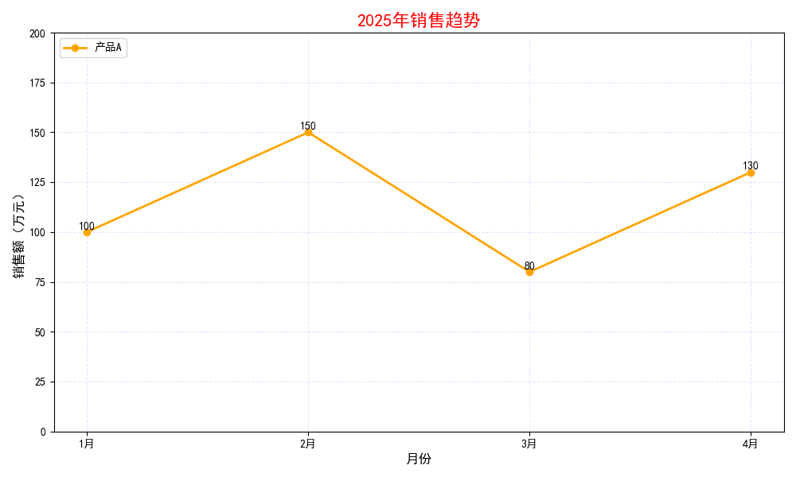
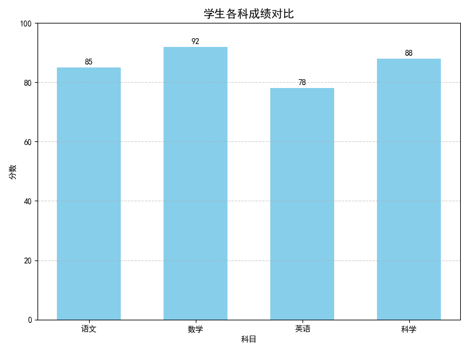
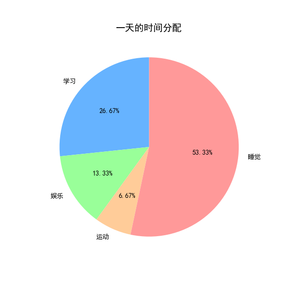
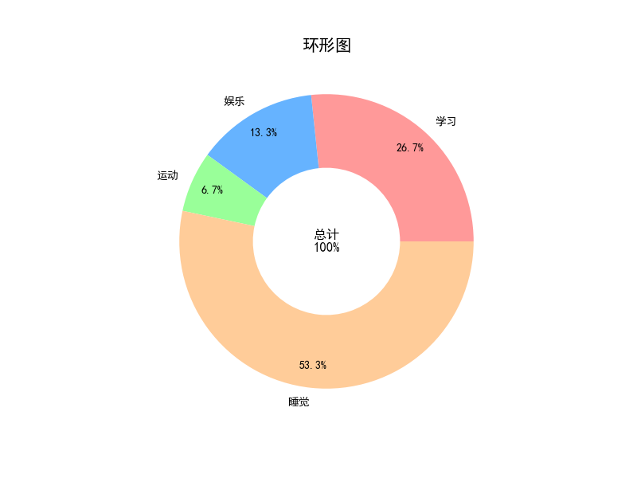
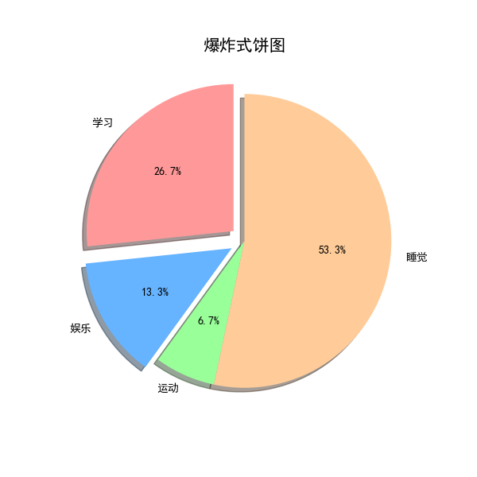
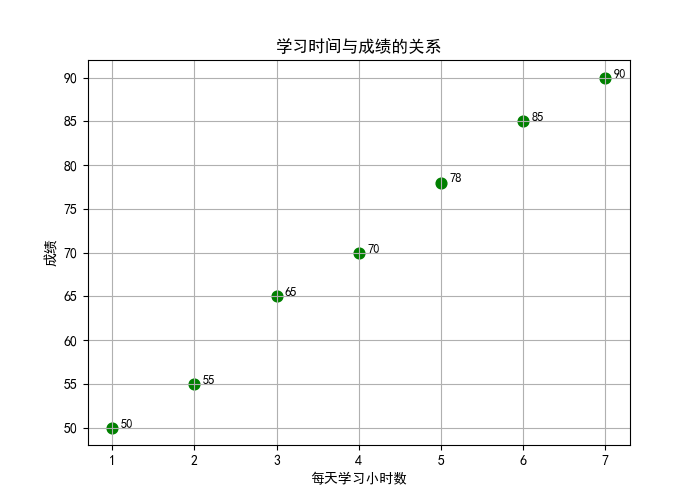
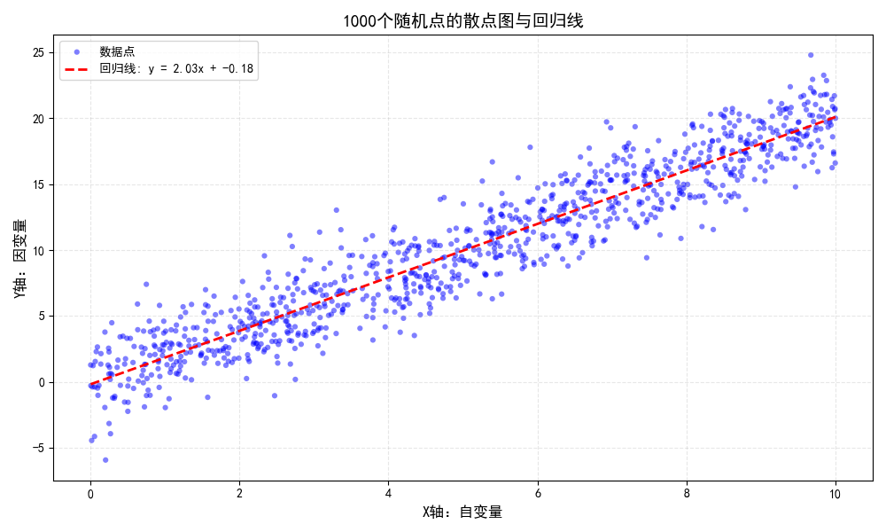
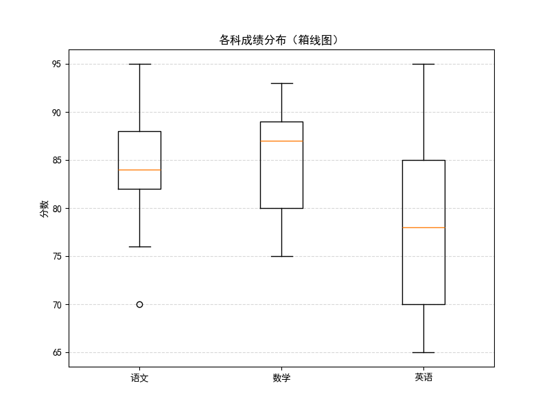
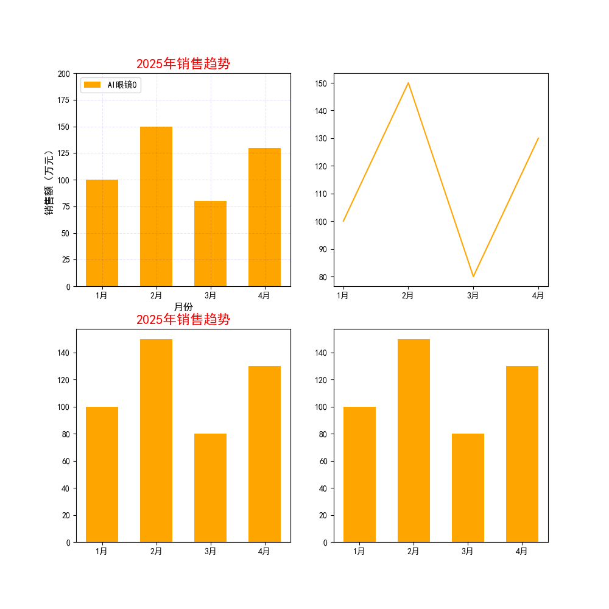

# 简介

​	Matplotlib是一个Python绘图库，广泛用于创建各种类型的静态、动态和交互式图表。它是数据科学、机器学习、工程和科学计算领域中常用的绘图工具之一。

* 支持多种图表类型：折线图（Line plots）、散点图（Scatter plots）、柱状图（Bar charts）、直方图（Histograms）、饼图（Pie charts）、热图（Heatmaps）、箱型图（Box plots）、极坐标图（Polar plots）、3D图（3D plots，配合 mpl_toolkits.mplot3d）。

* 高度自定义：允许用户自定义图表的每个部分，包括标题、轴标签、刻度、图例等。    支持多种颜色、字体和线条样式。提供精确的图形渲染控制，如坐标轴范围、图形大小、字体大小等。

* 兼容性：与NumPy、Pandas等库紧密集成，特别适用于绘制基于数据框和数组的数据可视化。可以输出到多种格式（如PNG、PDF、SVG、EPS等）。

* 交互式绘图：在Jupyter Notebook 中，Matplotlib支持交互式绘图，可以动态更新图表。支持图形缩放、平移等交互操作。

* 动态图表：可以生成动画（使用FuncAnimation类），为用户提供动态数据的可视化。

不同开发环境下显示图形

* 在一个脚本文件中使用Matplotlib，那么显示图形的时候必须使用plt.show()。

* 在Notebook中使用Matplotlib，运行命令之后在每一个Notebook的单元中就会直接将PNG格式图形文件嵌入在单元中。

Matplotlib有两种画图接口：一个是便捷的MATLAB风格的有状态的接口，另一个是功能更强大的面向对象接口。

# 状态接口

## 折线图



```py
import matplotlib.pyplot as plt
from matplotlib import rcParams

# 解决中文显示问题（关键！）
rcParams["font.sans-serif"] = ["SimHei", "PingFang SC"]  # 适配 Windows/macOS
rcParams["axes.unicode_minus"] = False  # 避免负号变成方块

month = ['1月','2月','3月','4月']
sales = [100,150,80,130]

# 创建图表
# 表示图表的宽度为 10 英寸，高度为 6 英寸
plt.figure(figsize=(10,6))

# 绘制折线图
plt.plot(
    month, sales,
    label='产品A',
    # 折线图中线的颜色
    color='orange',
    # 折线图中线的宽度
    linewidth=2,
    # 折线图样式如：'-', '--', '-.', ':', 'None', ' ', '', 'solid', 'dashed', 'dashdot', 'dotted'
    linestyle='solid',
    # 圆形（circle） 来标记每个数据点。这样在折线图上，每个(month, sales)对应的位置都会显示一个小圆点
    marker='o'
)

# 添加标题和标签
plt.title("2025年销售趋势", fontsize=16, color='red')
plt.xlabel('月份', fontsize=12)
plt.ylabel('销售额（万元）', fontsize=12)

# 图例、网格等设置
# 为图表添加图例，并将图例放置在左上角
plt.legend(loc='upper left')

# 为图表添加网格线：
# - True 表示显示网格线
# - alpha=0.1 表示网格线透明度为10%（接近透明）
# - color='blue' 表示网格线为蓝色
# - linestyle='--' 表示网格线为虚线样式
plt.grid(True, alpha=0.1, color='blue', linestyle='--')

# 设置x轴刻度：
# - rotation=0 表示刻度文本水平显示（不旋转）
# - fontsize=10 表示刻度文本大小为10号字
plt.xticks(rotation=0, fontsize=10)

# 设置y轴刻度：
# - rotation=0 表示刻度文本水平显示（不旋转）
# - fontsize=10 表示刻度文本大小为10号字
plt.yticks(rotation=0, fontsize=10)

# 设置y轴的取值范围，从0到200
plt.ylim(0, 200)

# 添加数据标签
# 遍历月份和销售额的对应数据对
# zip(month, sales) 将月份列表和销售额列表按顺序对应组合成元组
for xi, yi in zip(month, sales):
    # 在图表上添加文本标签
    # xi: 文本在x轴上的位置（对应月份）
    # yi + 1.5: 文本在y轴上的位置（在数据点上方1.5单位处，避免重叠）
    # f'{yi}': 要显示的文本内容（当前数据点的销售额数值）
    # ha='center': 设置水平平对齐方式为居中（让文本正对数据点）
    # fontsize=10: 设置文本字体大小为10号
    plt.text(xi, yi + 1.5, f'{yi}', ha='center', fontsize=10)

# 自动调整标题、坐标轴标签、图例等元素的位置和间距
# 避免文本内容超出图表边界或相互重叠
# 确保所有元素都能完整显示，提升图表的美观度和可读性
plt.tight_layout()


plt.show()
```

## 条形图



```py
import matplotlib.pyplot as plt
from matplotlib import rcParams

# 解决中文显示问题（关键！）
rcParams["font.sans-serif"] = ["SimHei", "PingFang SC"]  # 适配 Windows/macOS
rcParams["axes.unicode_minus"] = False  # 避免负号变成方块
# 类别与对应数值
subjects = ['语文', '数学', '英语', '科学']
scores = [85, 92, 78, 88]

# 创建条形图
# # 表示图表的宽度为 8 英寸，高度为 6 英寸
plt.figure(figsize=(8, 6))
plt.bar(subjects, scores, color='skyblue', width=0.6)

# 添加图表元素
plt.title("学生各科成绩对比", fontsize=14)
plt.xlabel("科目")
plt.ylabel("分数")
# 设置y轴范围
plt.ylim(0, 100)
# y轴背景网格样式
plt.grid(axis='y', linestyle='--', alpha=0.6)

# 为每个柱形添加数值标签
for i, score in enumerate(scores):
    plt.text(i, score + 1, str(score), ha='center', fontsize=10)

plt.tight_layout()
plt.show()
```

## 饼图



```py
import matplotlib.pyplot as plt

labels = ['学习', '娱乐', '运动', '睡觉']
time_spent = [4, 2, 1, 8]

# 创建饼图
plt.figure(figsize=(6, 6))
plt.pie(time_spent,
        labels=labels,
        autopct='%.1f%%',         # 显示百分比
        startangle=90,             # 起始角度
        colors=['#66b3ff','#99ff99','#ffcc99','#ff9999'])

plt.title("一天的时间分配", fontsize=14)
plt.show()
```

## 环形图



```py
import matplotlib.pyplot as plt
from matplotlib import rcParams

# 解决中文显示问题（关键！）
rcParams["font.sans-serif"] = ["SimHei", "PingFang SC"]  # 适配 Windows/macOS
rcParams["axes.unicode_minus"] = False  # 避免负号变成方块
# 数据
labels = ['学习', '娱乐', '运动', '睡觉']
time_spent = [4, 2, 1, 8]
colors = ['#ff9999', '#66b3ff', '#99ff99', '#ffcc99']

# 绘制环形图
plt.figure(figsize=(8, 6))
plt.pie(time_spent, labels=labels, colors=colors,
        # 控制环的宽度（0.3~0.7）
        wedgeprops={'width': 0.5},
        # pctdistance调整百分比位置（距离中心点的位置）
        autopct='%.1f%%', pctdistance=0.85)
plt.title('环形图', fontsize=15)

# 在中心添加文字
plt.text(0, 0, "总计\n100%", ha='center', va='center', fontsize=12)
plt.show()
```

## 爆炸式饼图



```py
import matplotlib.pyplot as plt
from matplotlib import rcParams

# 解决中文显示问题（关键！）
rcParams["font.sans-serif"] = ["SimHei", "PingFang SC"]  # 适配 Windows/macOS
rcParams["axes.unicode_minus"] = False  # 避免负号变成方块
# 数据
labels = ['学习', '娱乐', '运动', '睡觉']
time_spent = [4, 2, 1, 8]
colors = ['#ff9999', '#66b3ff', '#99ff99', '#ffcc99']
# 仅突出第一、二块
explode = (0.1, 0.1, 0, 0)

# 绘制爆炸式饼图 shadow：是否显示阴影
plt.figure(figsize=(6, 6))
plt.pie(time_spent, explode=explode, labels=labels, colors=colors,
        autopct='%.1f%%', shadow=True, startangle=90)
plt.title('爆炸式饼图', fontsize=15)
plt.show()
```

## 散点图



```py
import matplotlib.pyplot as plt
from matplotlib import rcParams

# 解决中文显示问题（关键！）
rcParams["font.sans-serif"] = ["SimHei", "PingFang SC"]  # 适配 Windows/macOS
rcParams["axes.unicode_minus"] = False  # 避免负号变成方块
# 模拟数据：学习时间与成绩
study_hours = [1, 2, 3, 4, 5, 6, 7]
scores = [50, 55, 65, 70, 78, 85, 90]

plt.figure(figsize=(7, 5))
# s: 表示绿色的圆点大小
plt.scatter(study_hours, scores, color = 'green', s = 60)

plt.title("学习时间与成绩的关系")
plt.xlabel("每天学习小时数")
plt.ylabel("成绩")
plt.grid(True)

# 添加数据点注释（可选）
for i in range(len(study_hours)):
    plt.text(study_hours[i] + 0.1, scores[i], f"{scores[i]}", fontsize=9)

plt.show()
```



```py
import matplotlib.pyplot as plt
from matplotlib import rcParams
import random

# 解决中文显示问题
rcParams["font.sans-serif"] = ["SimHei", "PingFang SC"]
rcParams["axes.unicode_minus"] = False

# 1. 生成1000个随机点（模拟正相关数据）
random.seed(42)
x = [random.uniform(0, 10) for _ in range(1000)]  # X值：0~10均匀分布
y = [xi * 2 + random.gauss(0, 2) for xi in x]     # Y值：2倍X值 + 高斯噪声

# 2. 计算回归线的斜率（slope）和截距（intercept）（最小二乘法）
n = len(x)
sum_x = sum(x)
sum_y = sum(y)
sum_xy = sum(xi * yi for xi, yi in zip(x, y))
sum_x2 = sum(xi **2 for xi in x)

# 最小二乘法公式：斜率slope = (n*sum_xy - sum_x*sum_y) / (n*sum_x2 - sum_x**2)
# 截距intercept = (sum_y - slope*sum_x) / n
slope = (n * sum_xy - sum_x * sum_y) / (n * sum_x2 - sum_x ** 2)
intercept = (sum_y - slope * sum_x) / n

# 3. 绘制散点图
plt.figure(figsize=(10, 6))
plt.scatter(
    x,                   # X轴坐标数据
    y,                   # Y轴坐标数据
    color='blue',        # 点的填充颜色为蓝色
    alpha=0.5,           # 透明度为50%（半透明）
    s=20,                # 点的大小为20平方磅
    edgecolors='none',   # 点边缘无颜色（无边框）
    label='数据点'       # 图例中显示的标签文本
)

# 4. 绘制回归线（使用计算出的slope和intercept）
# 回归线的X范围取数据的最小值到最大值（更贴合实际数据分布）
x_min, x_max = min(x), max(x)
y_min = slope * x_min + intercept  # 对应X最小值的回归线Y值
y_max = slope * x_max + intercept  # 对应X最大值的回归线Y值

plt.plot(
    [x_min, x_max],  # 回归线的X坐标范围
    [y_min, y_max],  # 回归线的Y坐标范围（根据斜率和截距计算）
    color='red',
    linestyle='--',
    linewidth=2,
    label=f'回归线: y = {slope:.2f}x + {intercept:.2f}'  # 现在可以正常使用slope和intercept了
)

# 5. 美化图表
plt.title('1000个随机点的散点图与回归线', fontsize=14)
plt.xlabel('X轴：自变量', fontsize=12)
plt.ylabel('Y轴：因变量', fontsize=12)
plt.grid(True, linestyle='--', alpha=0.3)
plt.legend()
plt.tight_layout()
plt.show()
```

## 箱线图



```py
import matplotlib.pyplot as plt
from matplotlib import rcParams

# 解决中文显示问题
rcParams["font.sans-serif"] = ["SimHei", "PingFang SC"]
rcParams["axes.unicode_minus"] = False
# 模拟 3 门课的成绩
data = {
    '语文': [82, 85, 88, 70, 90, 76, 84, 83, 95],
    '数学': [75, 80, 79, 93, 88, 82, 87, 89, 92],
    '英语': [70, 72, 68, 65, 78, 80, 85, 90, 95]
}

plt.figure(figsize=(8, 6))
plt.boxplot(data.values(), labels=data.keys())

plt.title("各科成绩分布（箱线图）")
plt.ylabel("分数")
plt.grid(True, axis='y', linestyle='--', alpha=0.5)
plt.show()
```


• 中位数：盒子中间的线

• 上/下四分位数：盒子上下边缘

• 离群值：落在“胡须”外的点

1. 数学成绩

￮ 中位数最高（约88分），且箱体较短 → 学生成绩集中且整体较好。

￮ 无异常值 → 无极端高分或低分。

2. 语文成绩

￮ 箱体较长 → 成绩分布较分散（从70分到95分）。

￮ 上方有一个异常值（95分）→ 可能存在个别高分学生。

3. 英语成绩

￮ 中位数最低（约78分），但箱须向上延伸较长 → 部分学生成绩较高（90+分）。

￮ 下方无异常值 → 无极端低分。

# 面向对象接口

## 多个图表的绘制



```py
import matplotlib.pyplot as plt
from matplotlib import rcParams

# 解决中文显示问题
rcParams["font.sans-serif"] = ["SimHei", "PingFang SC"]
rcParams["axes.unicode_minus"] = False

month = ['1月','2月','3月','4月']
sales = [100,150,80,130]
# 创建画布，并指定画布大小。前两个参数表示有 2行 * 2列个表格
fig, ax = plt.subplots(2,2, figsize=(10, 10))

# 绘制柱状图
ax[0][0].bar(month,sales,
        label='AI眼镜0',
        color='orange',
        width=0.6,)
ax[0][1].plot(month,sales,
        label='AI眼镜1',
        color='orange',
        )
ax[1][0].bar(month,sales,
        label='AI眼镜2',
        color='orange',
        width=0.6,)
ax[1][1].bar(month,sales,
        label='AI眼镜3',
        color='orange',
        width=0.6,)
# 添加标题
ax[0][0].set_title("2025年销售趋势",fontsize=16,color='red')
ax[1][0].set_title("2025年销售趋势",fontsize=16,color='red')
# 添加坐标轴的标签
ax[0][0].set_xlabel('月份',fontsize=12)
ax[0][0].set_ylabel('销售额（万元）',fontsize=12)
# 添加图例
ax[0][0].legend(loc='upper left')
# 添加网格线
ax[0][0].grid(True,alpha=0.1,color='blue',linestyle='--')
# grid（axis='x' axis='y'
# 自定义y轴范围
ax[0][0].set_ylim(0,200)
plt.show()
```

