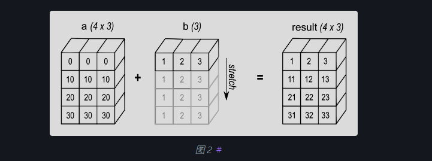
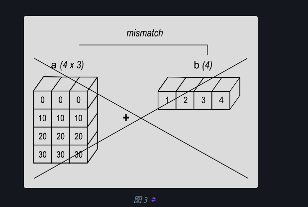
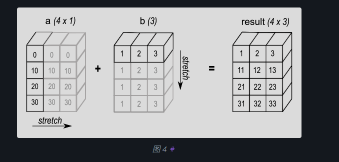
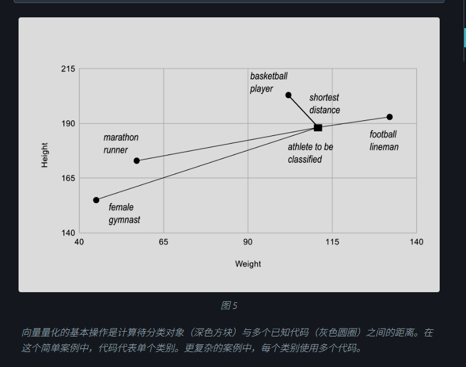

# 简介

​	NumPy 是 Python 中进行科学计算的基础软件包。它是一个 Python 库，提供了多维数组对象、各种派生对象（如掩码数组和矩阵）以及用于数组快速操作的例程集合，包括数学运算、逻辑运算、形状操作、排序、选择、I/O、离散傅里叶变换、基本线性代数、基本统计操作、随机模拟等等。

​	NumPy 软件包的核心是 [`ndarray`](https://numpy.com.cn/doc/stable/reference/generated/numpy.ndarray.html#numpy.ndarray) 对象。它封装了同构数据类型的 *n* 维数组，许多操作都在编译后的代码中执行以提高性能。NumPy 数组与标准 Python 序列之间存在几个重要的区别：

- NumPy 数组在创建时具有固定大小，这与 Python 列表（可以动态增长）不同。更改 [`ndarray`](https://numpy.com.cn/doc/stable/reference/generated/numpy.ndarray.html#numpy.ndarray) 的大小将创建一个新数组并删除原始数组。
- NumPy 数组中的所有元素都必须是相同的数据类型，因此在内存中大小相同。例外情况是：可以创建（Python，包括 NumPy）对象的数组，从而允许包含不同大小元素的数组。
- NumPy 数组有助于对大量数据执行高级数学和其他类型的操作。通常，与使用 Python 内置序列相比，此类操作的执行效率更高，代码量也更少。
- 越来越多的基于 Python 的科学和数学软件包正在使用 NumPy 数组；尽管这些软件包通常支持 Python 序列输入，但在处理之前会将此类输入转换为 NumPy 数组，并且它们通常输出 NumPy 数组。换句话说，为了高效地使用当今许多（甚至可能是大多数）基于 Python 的科学/数学软件，仅仅了解如何使用 Python 的内置序列类型是不够的——还需要知道如何使用 NumPy 数组。

​	关于序列大小和速度的观点在科学计算中尤为重要。举一个简单的例子，考虑将一维序列中的每个元素与其相同长度的另一个序列中的对应元素相乘的情况。如果数据存储在两个 Python 列表 `a` 和 `b` 中，我们可以遍历每个元素

```py
c = []
for i in range(len(a)):
    c.append(a[i]*b[i])
```

​	这会得到正确答案，但如果 `a` 和 `b` 各自包含数百万个数字，我们将为 Python 中循环的低效率付出代价。我们可以通过编写 C 代码更快地完成相同的任务（为清晰起见，我们省略了变量声明和初始化、内存分配等）：

```py
for (i = 0; i < rows; i++) {
  c[i] = a[i]*b[i];
}
```

​	这节省了解释 Python 代码和操作 ython 对象所涉及的所有开销，但却牺牲了在 Python 中编码所带来的好处。此外，所需的编码工作量会随着数据维度的增加而增加。例如，对于一个二维数组，C 代码（如前所述的缩写形式）将扩展为：

```py
for (i = 0; i < rows; i++) {
  for (j = 0; j < columns; j++) {
    c[i][j] = a[i][j]*b[i][j];
  }
}
```

​	NumPy 让我们两全其美：当涉及到 [`ndarray`](https://numpy.com.cn/doc/stable/reference/generated/numpy.ndarray.html#numpy.ndarray) 时，逐元素操作是“默认模式”，但逐元素操作由预编译的 C 代码快速执行。在 NumPy 中，

```py
c = a * b
```

​	执行与前面例子相同的操作，速度接近 C 语言，但具有我们期望的基于 Python 的代码简洁性。实际上，NumPy 的表达方式甚至更简单！最后一个例子说明了 NumPy 的两个核心特性，它们是其强大功能的基础：向量化（vectorization）和广播（broadcasting）。

# 为什么 NumPy 很快？

向量化描述了代码中没有显式循环、索引等——当然，这些操作只是在优化的预编译 C 代码中“幕后”进行。向量化代码具有许多优点，其中包括：

- 向量化代码更简洁、更易读
- 代码行数越少通常意味着 bug 越少
- 代码更接近标准数学符号（通常更容易正确编写数学结构）
- 向量化会产生更“Pythonic”的代码。如果没有向量化，我们的代码将充斥着低效且难以阅读的 `for` 循环。

​	广播（Broadcasting）是用于描述操作隐式逐元素行为的术语；一般来说，在 NumPy 中，所有操作，不仅是算术操作，还包括逻辑、按位、函数等操作，都以这种隐式的逐元素方式行为，即它们都会进行广播。此外，在上面的例子中，`a` 和 `b` 可以是相同形状的多维数组，或者是一个标量和一个数组，甚至可以是两个不同形状的数组，前提是较小的数组可以“扩展”到较大数组的形状，从而使广播结果明确。有关广播的详细“规则”，请参阅 [广播](https://numpy.com.cn/doc/stable/user/basics.broadcasting.html#basics-broadcasting)。

# NumPy 快速入门

## 先决条件

你需要了解一些 Python。如需复习，请参阅 [Python 教程](https://docs.pythonlang.cn/tutorial/)。

要运行示例，除了 NumPy，你还需要安装 `matplotlib`。

**学习者概况**

这是对 NumPy 中数组的快速概述。它演示了 n 维（）数组是如何表示和操作的。特别是，如果你不知道如何将常用函数应用于 n 维数组（不使用 for 循环），或者如果你想了解 n 维数组的轴和形状属性，本文可能会有所帮助。

**学习目标**

阅读后，你应该能够

- 理解 NumPy 中一维、二维和 n 维数组的区别；
- 理解如何在不使用 for 循环的情况下将一些线性代数操作应用于 n 维数组；
- 理解 n 维数组的轴和形状属性。


## 基础知识

​	NumPy 的主要对象是同质多维数组。它是一个元素表（通常是数字），所有元素都具有相同类型，通过非负整数元组进行索引。在 NumPy 中，维度被称为 *轴*。

​	例如，三维空间中一个点的坐标数组 `[1, 2, 1]` 具有一个轴。该轴包含 3 个元素，因此我们说它的长度为 3。在下图所示的示例中，数组具有 2 个轴。第一个轴的长度为 2，第二个轴的长度为 3。

```py
[[1., 0., 0.],
 [0., 1., 2.]]
```

​	NumPy 的数组类名为 `ndarray`。它也以别名 `array` 著称。请注意，`numpy.array` 与标准 Python 库中的 `array.array` 类不同，后者只处理一维数组，功能较少。`ndarray` 对象更重要的属性是

- ndarray.ndim

  数组的轴（维度）数量。

- ndarray.shape

  数组的维度。这是一个整数元组，指示数组在每个维度上的大小。对于一个具有 *n* 行 *m* 列的矩阵，`shape` 将是 `(n,m)`。`shape` 元组的长度因此是轴的数量，即 `ndim`。

- ndarray.size

  数组的元素总数。这等于 `shape` 中元素的乘积。

- ndarray.dtype

  描述数组中元素类型的对象。可以使用标准 Python 类型创建或指定 dtype。此外，NumPy 提供自己的类型。numpy.int32、numpy.int16 和 numpy.float64 是一些示例。

- ndarray.itemsize

  数组中每个元素的字节大小。例如，一个类型为 `float64` 的数组，其 `itemsize` 为 8 (=64/8)，而类型为 `complex32` 的数组，其 `itemsize` 为 4 (=32/8)。它等同于 `ndarray.dtype.itemsize`。

- ndarray.data

  包含数组实际元素的缓冲区。通常，我们不需要使用此属性，因为我们将使用索引工具访问数组中的元素。

### 一个例子

```py
import numpy as np
a = np.arange(15).reshape(3, 5)
a
array([[ 0,  1,  2,  3,  4],
       [ 5,  6,  7,  8,  9],
       [10, 11, 12, 13, 14]])
a.shape
(3, 5)
a.ndim
2
a.dtype.name
'int64'
a.itemsize
8
a.size
15
type(a)
<class 'numpy.ndarray'>
b = np.array([6, 7, 8])
b
array([6, 7, 8])
type(b)
<class 'numpy.ndarray'>
```

### 数组创建

有几种创建数组的方法。

例如，您可以使用 `array` 函数从普通的 Python 列表或元组创建数组。结果数组的类型是根据序列中元素的类型推断出来的。

```py
import numpy as np
a = np.array([2, 3, 4])
a
array([2, 3, 4])
a.dtype
dtype('int64')
b = np.array([1.2, 3.5, 5.1])
b.dtype
dtype('float64')
```

一个常见的错误是调用 `array` 时提供多个参数，而不是提供一个单一序列作为参数。

```py
a = np.array(1, 2, 3, 4)    # WRONG
Traceback (most recent call last):
  ...
TypeError: array() takes from 1 to 2 positional arguments but 4 were given
a = np.array([1, 2, 3, 4])  # RIGHT
```

`array` 将序列的序列转换为二维数组，将序列的序列的序列转换为三维数组，依此类推。

```py
b = np.array([(1.5, 2, 3), (4, 5, 6)])
b
array([[1.5, 2. , 3. ],
       [4. , 5. , 6. ]])
```

数组的类型也可以在创建时明确指定

```
c = np.array([[1, 2], [3, 4]], dtype=complex)
c
array([[1.+0.j, 2.+0.j],
       [3.+0.j, 4.+0.j]])
```

​	通常，数组的元素最初是未知的，但其大小是已知的。因此，NumPy 提供了几个函数来创建具有初始占位符内容的数组。这最大限度地减少了数组扩展的必要性，因为扩展数组是一项昂贵的操作。

​	函数 `zeros` 创建一个全零数组，函数 `ones` 创建一个全一数组，而函数 `empty` 创建一个初始内容是随机的，取决于内存状态的数组。默认情况下，创建的数组的 dtype 是 `float64`，但可以通过关键字参数 `dtype` 指定。

```py
np.zeros((3, 4))
array([[0., 0., 0., 0.],
       [0., 0., 0., 0.],
       [0., 0., 0., 0.]])
np.ones((2, 3, 4), dtype=np.int16)
array([[[1, 1, 1, 1],
        [1, 1, 1, 1],
        [1, 1, 1, 1]],

       [[1, 1, 1, 1],
        [1, 1, 1, 1],
        [1, 1, 1, 1]]], dtype=int16)
np.empty((2, 3)) 
array([[3.73603959e-262, 6.02658058e-154, 6.55490914e-260],  # may vary
       [5.30498948e-313, 3.14673309e-307, 1.00000000e+000]])
```

为了创建数字序列，NumPy 提供了 `arange` 函数，它类似于 Python 内置的 `range`，但返回一个数组。

```
np.arange(10, 30, 5)
array([10, 15, 20, 25])
np.arange(0, 2, 0.3)  # it accepts float arguments
array([0. , 0.3, 0.6, 0.9, 1.2, 1.5, 1.8])
```

​	当 `arange` 与浮点参数一起使用时，由于浮点精度有限，通常无法预测获得的元素数量。因此，通常最好使用函数 `linspace`，它将我们想要的元素数量作为参数，而不是步长。

```py
from numpy import pi
np.linspace(0, 2, 9)                   # 9 numbers from 0 to 2
array([0.  , 0.25, 0.5 , 0.75, 1.  , 1.25, 1.5 , 1.75, 2.  ])
x = np.linspace(0, 2 * pi, 100)        # useful to evaluate function at lots of points
f = np.sin(x)
```

### 打印数组

当你打印一个数组时，NumPy 会以类似于嵌套列表的方式显示它，但具有以下布局

- 最后一个轴从左到右打印，
- 倒数第二个轴从上到下打印，
- 其余的也从上到下打印，每个切片之间用空行分隔。

一维数组将打印为行，二维数组将打印为矩阵，三维数组将打印为矩阵列表。

```py
a = np.arange(6)                    # 1d array
print(a)
[0 1 2 3 4 5]

b = np.arange(12).reshape(4, 3)     # 2d array
print(b)
[[ 0  1  2]
 [ 3  4  5]
 [ 6  7  8]
 [ 9 10 11]]

c = np.arange(24).reshape(2, 3, 4)  # 3d array
print(c)
[[[ 0  1  2  3]
  [ 4  5  6  7]
  [ 8  9 10 11]]

 [[12 13 14 15]
  [16 17 18 19]
  [20 21 22 23]]]
```

如果数组太大无法完全打印，NumPy 会自动跳过数组的中心部分，只打印边缘部分。

```py
print(np.arange(10000))
[   0    1    2 ... 9997 9998 9999]

print(np.arange(10000).reshape(100, 100))
[[   0    1    2 ...   97   98   99]
 [ 100  101  102 ...  197  198  199]
 [ 200  201  202 ...  297  298  299]
 ...
 [9700 9701 9702 ... 9797 9798 9799]
 [9800 9801 9802 ... 9897 9898 9899]
 [9900 9901 9902 ... 9997 9998 9999]]
```

要禁用此行为并强制 NumPy 打印整个数组，可以使用 `set_printoptions` 更改打印选项。

```py
np.set_printoptions(threshold=sys.maxsize)  # sys module should be imported
```

### 基本操作

数组上的算术运算符是*逐元素*应用的。会创建一个新数组并用结果填充它。

```py
a = np.array([20, 30, 40, 50])
b = np.arange(4)
b
array([0, 1, 2, 3])
c = a - b
c
array([20, 29, 38, 47])
b**2
array([0, 1, 4, 9])
10 * np.sin(a)
array([ 9.12945251, -9.88031624,  7.4511316 , -2.62374854])
a < 35
array([ True,  True, False, False])
```

​	与许多矩阵语言不同，NumPy 数组中的乘法运算符 `*` 是逐元素操作的。矩阵乘法可以使用 `@` 运算符（Python >= 3.5）或 `dot` 函数或方法执行

```py
A = np.array([[1, 1],
              [0, 1]])
B = np.array([[2, 0],
              [3, 4]])
A * B     # elementwise product
array([[2, 0],
       [0, 4]])
A @ B     # matrix product
array([[5, 4],
       [3, 4]])
A.dot(B)  # another matrix product
array([[5, 4],
       [3, 4]])
```

某些操作，例如 `+=` 和 `*=`，会就地修改现有数组，而不是创建新数组。

```py
rg = np.random.default_rng(1)  # create instance of default random number generator
a = np.ones((2, 3), dtype=int)
b = rg.random((2, 3))
a *= 3
a
array([[3, 3, 3],
       [3, 3, 3]])
b += a
b
array([[3.51182162, 3.9504637 , 3.14415961],
       [3.94864945, 3.31183145, 3.42332645]])
a += b  # b is not automatically converted to integer type
Traceback (most recent call last):
    ...
numpy._core._exceptions._UFuncOutputCastingError: Cannot cast ufunc 'add' output from dtype('float64') to dtype('int64') with casting rule 'same_kind'
```

当操作不同类型的数组时，结果数组的类型将对应于更通用或更精确的类型（这种行为称为向上转型）。

```py
a = np.ones(3, dtype=np.int32)
b = np.linspace(0, pi, 3)
b.dtype.name
'float64'
c = a + b
c
array([1.        , 2.57079633, 4.14159265])
c.dtype.name
'float64'
d = np.exp(c * 1j)
d
array([ 0.54030231+0.84147098j, -0.84147098+0.54030231j,
       -0.54030231-0.84147098j])
d.dtype.name
'complex128'
```

许多一元操作，例如计算数组中所有元素的和，都作为 `ndarray` 类的方法实现。

```py
a = rg.random((2, 3))
a
array([[0.82770259, 0.40919914, 0.54959369],
       [0.02755911, 0.75351311, 0.53814331]])
a.sum()
3.1057109529998157
a.min()
0.027559113243068367
a.max()
0.8277025938204418
```

​	默认情况下，这些操作应用于数组，就好像它是一个数字列表一样，无论其形状如何。但是，通过指定 `axis` 参数，您可以在数组的指定轴上应用操作

```py
b = np.arange(12).reshape(3, 4)
b
array([[ 0,  1,  2,  3],
       [ 4,  5,  6,  7],
       [ 8,  9, 10, 11]])

b.sum(axis=0)     # sum of each column
array([12, 15, 18, 21])

b.min(axis=1)     # min of each row
array([0, 4, 8])

b.cumsum(axis=1)  # cumulative sum along each row
array([[ 0,  1,  3,  6],
       [ 4,  9, 15, 22],
       [ 8, 17, 27, 38]])
```

### 通用函数

​	NumPy 提供了熟悉的数学函数，例如 sin、cos 和 exp。在 NumPy 中，这些函数被称为“通用函数”（`ufunc`）。在 NumPy 内部，这些函数对数组进行逐元素操作，并生成一个数组作为输出。

```py
B = np.arange(3)
B
np.exp(B)
np.sqrt(B)
C = np.array([2., -1., 4.])
np.add(B, C)
```

### 索引、切片和迭代

**一维**数组可以像 [列表](https://docs.pythonlang.cn/tutorial/introduction.html#lists) 和其他 Python 序列一样进行索引、切片和迭代。

```py
a = np.arange(10)**3
a
array([  0,   1,   8,  27,  64, 125, 216, 343, 512, 729])
a[2]
8
a[2:5]
array([ 8, 27, 64])
# equivalent to a[0:6:2] = 1000;
# from start to position 6, exclusive, set every 2nd element to 1000
a[:6:2] = 1000
a
array([1000,    1, 1000,   27, 1000,  125,  216,  343,  512,  729])
a[::-1]  # reversed a
array([ 729,  512,  343,  216,  125, 1000,   27, 1000,    1, 1000])
for i in a:
    print(i**(1 / 3.))

9.999999999999998  # may vary
1.0
9.999999999999998
3.0
9.999999999999998
4.999999999999999
5.999999999999999
6.999999999999999
7.999999999999999
8.999999999999998
```

**多维**数组的每个轴可以有一个索引。这些索引以逗号分隔的元组形式给出。

```py
def f(x, y):
    return 10 * x + y

b = np.fromfunction(f, (5, 4), dtype=int)
b
array([[ 0,  1,  2,  3],
       [10, 11, 12, 13],
       [20, 21, 22, 23],
       [30, 31, 32, 33],
       [40, 41, 42, 43]])
b[2, 3]
23
b[0:5, 1]  # each row in the second column of b
array([ 1, 11, 21, 31, 41])
b[:, 1]    # equivalent to the previous example
array([ 1, 11, 21, 31, 41])
b[1:3, :]  # each column in the second and third row of b
array([[10, 11, 12, 13],
       [20, 21, 22, 23]])
```

当提供的索引少于轴的数量时，缺失的索引被视为完整切片`:`

```py
b[-1]   # the last row. Equivalent to b[-1, :]
array([40, 41, 42, 43])
```

`b[i]` 中括号内的表达式被视为 `i`，后跟所需数量的 `:` 来表示剩余的轴。NumPy 也允许你使用点号 `b[i, ...]` 来书写。

**点号** (`...`) 代表所需数量的冒号，以生成完整的索引元组。例如，如果 `x` 是一个有 5 个轴的数组，那么

- `x[1, 2, ...]` 等同于 `x[1, 2, :, :, :]`，
- `x[..., 3]` 等同于 `x[:, :, :, :, 3]`，
- `x[4, ..., 5, :]` 等同于 `x[4, :, :, 5, :]`。

```py
c = np.array([[[  0,  1,  2],  # a 3D array (two stacked 2D arrays)
               [ 10, 12, 13]],
              [[100, 101, 102],
               [110, 112, 113]]])
c.shape
(2, 2, 3)
c[1, ...]  # same as c[1, :, :] or c[1]
array([[100, 101, 102],
       [110, 112, 113]])
c[..., 2]  # same as c[:, :, 2]
array([[  2,  13],
       [102, 113]])
```

多维数组的**迭代**是相对于第一个轴进行的

```py
for row in b:
    print(row)

[0 1 2 3]
[10 11 12 13]
[20 21 22 23]
[30 31 32 33]
[40 41 42 43]
```

然而，如果想对数组中的每个元素执行操作，可以使用 `flat` 属性，它是一个遍历数组所有元素的 [迭代器](https://docs.pythonlang.cn/tutorial/classes.html#iterators)

```py
for element in b.flat:
    print(element)

0
1
2
3
10
11
12
13
20
21
22
23
30
31
32
33
40
41
42
43
```

# NumPy 基础

## 广播

​	术语“广播”描述了 NumPy 在算术运算中如何处理具有不同形状的数组。在满足某些约束的条件下，较小的数组会被“广播”到较大的数组上，使它们具有兼容的形状。广播提供了一种向量化数组操作的方法，使循环在 C 而不是 Python 中发生。它在不产生不必要的数据副本的情况下完成此操作，并且通常会带来高效的算法实现。然而，在某些情况下，广播是一个糟糕的主意，因为它会导致内存使用效率低下，从而减慢计算速度。

NumPy 操作通常在成对的数组上以逐元素方式进行。在最简单的情况下，这两个数组必须具有完全相同的形状，如下例所示

```py
import numpy as np
a = np.array([1.0, 2.0, 3.0])
b = np.array([2.0, 2.0, 2.0])
a * b
```

NumPy 的广播规则在数组形状满足某些约束时放宽了这一限制。最简单的广播示例发生在数组和标量值在操作中组合时

```py
import numpy as np
a = np.array([1.0, 2.0, 3.0])
b = 2.0
a * b
array([2.,  4.,  6.])
```

​	结果等同于 `b` 为数组的先前示例。我们可以将标量 `b` 视为在算术运算期间被*拉伸*成与 `a` 相同形状的数组。`b` 中的新元素（如[图 1](https://numpy.com.cn/doc/stable/user/basics.broadcasting.html#broadcasting-figure-1) 所示）只是原始标量的副本。拉伸的比喻只是概念性的。NumPy 足够智能，可以在不实际复制的情况下使用原始标量值，从而使广播操作在内存和计算上尽可能高效。


​											图 1

*在最简单的广播示例中，标量 `b` 被拉伸成与 `a` 相同形状的数组，以便形状兼容进行逐元素乘法。*

第二个示例中的代码比第一个更高效，因为广播在乘法期间移动的内存更少（`b` 是一个标量而不是一个数组）。

## 一般广播规则

​	对两个数组进行操作时，NumPy 会逐元素比较它们的形状。它从末尾（即最右侧）维度开始，然后向左移动。当以下情况时，两个维度是兼容的：

1. 它们相等，或
2. 其中一个为 1。

如果不满足这些条件，则会抛出 `ValueError: operands could not be broadcast together` 异常，表明数组的形状不兼容。

​	输入数组不需要具有相同*数量*的维度。结果数组将具有与具有最大维度数量的输入数组相同的维度数量，其中每个维度的*大小*是输入数组中相应维度的最大大小。请注意，缺失的维度假定大小为 1。

​	例如，如果您有一个 `256x256x3` 的 RGB 值数组，并且您想用不同的值缩放图像中的每个颜色，您可以将图像乘以一个具有 3 个值的一维数组。根据广播规则对齐这些数组尾轴的大小，可以看出它们是兼容的

```py
Image  (3d array): 256 x 256 x 3
Scale  (1d array):             3
Result (3d array): 256 x 256 x 3
```

当所比较的维度中有一个为 1 时，则使用另一个维度。换句话说，大小为 1 的维度会被拉伸或“复制”以匹配另一个维度。

在以下示例中，`A` 和 `B` 数组都有长度为一的轴，它们在广播操作期间被扩展到更大的大小

```py
A      (4d array):  8 x 1 x 6 x 1
B      (3d array):      7 x 1 x 5
Result (4d array):  8 x 7 x 6 x 5
```

## 可广播数组

果上述规则能产生有效结果，则一组数组被称为可以“广播”到相同的形状。

例如，如果 `a.shape` 是 (5,1)，`b.shape` 是 (1,6)，`c.shape` 是 (6,) 并且 `d.shape` 是 ()，使得 *d* 是一个标量，那么 *a*、*b*、*c* 和 *d* 都可以广播到维度 (5,6)；并且

- *a* 表现得像一个 (5,6) 数组，其中 `a[:,0]` 被广播到其他列，
- *b* 表现得像一个 (5,6) 数组，其中 `b[0,:]` 被广播到其他行，
- *c* 表现得像一个 (1,6) 数组，因此也像一个 (5,6) 数组，其中 `c[:]` 被广播到每一行，最后，
- *d* 表现得像一个 (5,6) 数组，其中单个值被重复。

这里有一些更多示例

```py
A      (2d array):  5 x 4
B      (1d array):      1
Result (2d array):  5 x 4

A      (2d array):  5 x 4
B      (1d array):      4
Result (2d array):  5 x 4

A      (3d array):  15 x 3 x 5
B      (3d array):  15 x 1 x 5
Result (3d array):  15 x 3 x 5

A      (3d array):  15 x 3 x 5
B      (2d array):       3 x 5
Result (3d array):  15 x 3 x 5

A      (3d array):  15 x 3 x 5
B      (2d array):       3 x 1
Result (3d array):  15 x 3 x 5
```

这里是无法广播的形状示例

```py
A      (1d array):  3
B      (1d array):  4 # trailing dimensions do not match

A      (2d array):      2 x 1
B      (3d array):  8 x 4 x 3 # second from last dimensions mismatched
```

一维数组添加到二维数组时的广播示例

```py
import numpy as np
a = np.array([[ 0.0,  0.0,  0.0],
              [10.0, 10.0, 10.0],
              [20.0, 20.0, 20.0],
              [30.0, 30.0, 30.0]])
b = np.array([1.0, 2.0, 3.0])
a + b
b = np.array([1.0, 2.0, 3.0, 4.0])
a + b
```

如图 2 所示，`b` 被添加到 `a` 的每一行。在图3中，由于形状不兼容而引发异常。



*一维数组添加到二维数组时，如果一维数组的元素数量与二维数组的列数匹配，则会发生广播。*



当数组的尾部维度不相等时，广播会失败，因为无法将第一个数组行中的值与第二个数组的元素对齐以进行逐元素相加。

广播提供了一种方便的方式来计算两个数组的外积（或任何其他外部操作）。以下示例展示了两个一维数组的外部加法操作

```py
import numpy as np
a = np.array([0.0, 10.0, 20.0, 30.0])
b = np.array([1.0, 2.0, 3.0])
a[:, np.newaxis] + b
```



在某些情况下，广播会拉伸两个数组以形成一个比任何初始数组都大的输出数组。

这里 `newaxis` 索引运算符将一个新轴插入到 `a` 中，使其成为一个二维 `4x1` 数组。将 `4x1` 数组与形状为 `(3,)` 的 `b` 组合，得到一个 `4x3` 数组。

## 实用示例：向量量化

​	广播在实际问题中经常出现。一个典型的例子发生在信息论、分类及其他相关领域中使用的向量量化（VQ）算法。VQ 中的基本操作是找到一组点（在 VQ 术语中称为 `codes`）中与给定点（称为 `observation`）最近的点。在下面所示的非常简单的二维案例中，`observation` 中的值描述了待分类运动员的体重和身高。`codes` 代表不同类别的运动员。[[1\]](https://numpy.com.cn/doc/stable/user/basics.broadcasting.html#f1) 找到最近的点需要计算 `observation` 与每个 `codes` 之间的距离。最短距离提供最佳匹配。在此示例中，`codes[0]` 是最近的类别，表明该运动员可能是一名篮球运动员。

```py
from numpy import array, argmin, sqrt, sum
observation = array([111.0, 188.0])
codes = array([[102.0, 203.0],
               [132.0, 193.0],
               [45.0, 155.0],
               [57.0, 173.0]])
diff = codes - observation    # the broadcast happens here
dist = sqrt(sum(diff**2,axis=-1))
argmin(dist)
```

在此示例中，`observation` 数组被拉伸以匹配 `codes` 数组的形状

```py
Observation      (1d array):      2
Codes            (2d array):  4 x 2
Diff             (2d array):  4 x 2
```



通常，大量 `observations`（可能从数据库读取）与一组 `codes` 进行比较。考虑这个场景

```py
Observation      (2d array):      10 x 3
Codes            (3d array):   5 x 1 x 3
Diff             (3d array):  5 x 10 x 3
```

​	三维数组 `diff` 是广播的结果，并非计算的必需。大型数据集将生成一个计算效率低下的大型中间数组。相反，如果在上述二维示例中对代码使用 Python 循环单独计算每个观察值，则会使用一个更小的数组。

​	广播是一个强大的工具，用于编写简洁且通常直观的代码，这些代码在 C 语言中高效地执行计算。然而，在某些情况下，广播会为特定算法使用不必要的过大内存量。在这些情况下，最好在 Python 中编写算法的外部循环。这可能还会生成更具可读性的代码，因为随着广播维度数量的增加，使用广播的算法往往变得更难以理解。
