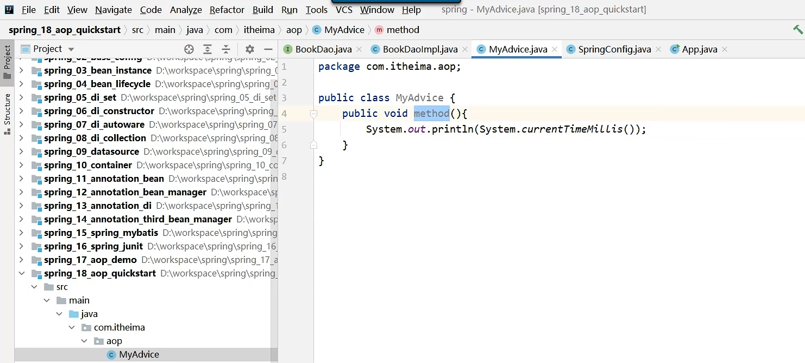
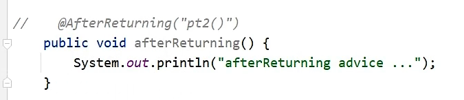

# AOP


连接点：所有方法

切入点：哪些方法需要追加功能的，匹配通知的方法，叫切入点

通知：各个方法共用的功能，叫通知。通知存在于通知类中。

切面：切面描述的是通知共用的功能与所对应切入点的关系。在哪些切入点上执行哪些通知叫切面


## AOP入门案例


```xml
1:pom.xml中导入坐标
```


```xml
3:制作共性功能，通知
```



```xml
4:定义切入点
  在通知类中，定义一个空的private方法，在其上添加注解@Pointcut("execution(返回值类型 包名.类.方法)")

示例：
@Pointcut("execution(void com.itheima.dao.BookDao.update())")
private void pt(){}

在通知方法上，使用注解@Before("pt()")表示在pt()方法指向的切入点（com.itheima.dao.BookDao.update()）之前执行。
```


```xml
5: 添加@Component 表示将该bean交给Spring
   添加@Aspect 表示该为AOP切面
```


```xml
6：在配置类中添加@EnableAspectJAutoProxy注解 

@EnableAspectJAutoProxy 启动了@Aspect 中的功能
@Aspect的功能是将切入点 通知定义好了
```


## 入门案例总结


## AOP工作流程

```xml
1: Spring容器启动
2：读取所有切面配置中的切入点
  （截图中黄色部分，虽然ptx()方法也做了切入点@Pointcut,但是下面并没有声明通知类型 
   比如 @Before("方法（）")）
```


## AOP切入点表达式


## AOP通知类型


环绕通知


返回后通知：发生异常之后，不会运行




写一个通知类的步骤

```java
1: @Component
2: @Aspect
定义的一个通知类

3: @Ponitcut("execution(返回值类型 包.方法(参数))")
定义的通知空方法

4：@Around("类名.通知空方法()")
定义加强的通知方法
public Object runSpeed(ProceedingJoinPoint pjp){
    
    Objection ret = pjp.proceed();
    return ret;
}
```


## AOP通知获取数据


```java
//注解中的returing和形参需要保持一致
@AfterReturing(value = "pt()",returing="ret")
public void afterReturning(String ret){
    
}
```


## 案例-百度网盘密码数据兼容处理


## AOP总结


# Spring中事务失效的场景

**如果方法内部捕获并处理了异常，没有将异常抛出，会导致事务失效。因此，处理异常后应该确保异常能够被抛出。**

**如果方法抛出检查型异常（checked exception），并且没有在`@Transactional`注解上配置`rollbackFor`属性为`Exception`，那么异常发生时事务可能不会回滚。**

**如果事务注解的方法不是公开（public）修饰的，也可能导致事务失效。**

**如果将方法使用 final 修饰也会失效。**

**在某个 Service 类的某个方法中，调用另外一个事务方法，比如**：

```java
@Service
public class UserService {
 
    @Autowired
    private UserMapper userMapper;
 
  
    public void add(UserModel userModel) {
        userMapper.insertUser(userModel);
        updateStatus(userModel);
    }
 
    @Transactional
    public void updateStatus(UserModel userModel) {
        doSameThing();
    }
}
```

我们看到在事务方法 add 中，直接调用事务方法 updateStatus。从前面介绍的内容可以知道，updateStatus 方法拥有事务的能力是因为 spring aop 生成代理了对象，但是这种方法直接调用了 this 对象的方法，所以 updateStatus 方法不会生成事务。

由此可见，在同一个类中的方法直接内部调用，会导致事务失效。
解决方法：

新加一个 Service 方法，把 @Transactional 注解加到新 Service 方法上，把需要事务执行的代码移到新方法中。具体代码如下：

```java
@Servcie
public class ServiceA {
   @Autowired
   prvate ServiceB serviceB;
 
   public void save(User user) {
         queryData1();
         queryData2();
         serviceB.doSave(user);
   }
 }
 
 @Servcie
 public class ServiceB {
 
    @Transactional(rollbackFor=Exception.class)
    public void doSave(User user) {
       addData1();
       updateData2();
    }
 
 }
```

如果不想再新加一个 Service 类，在该 Service 类中注入自己也是一种选择。

```java
@Servcie
public class ServiceA {
   @Autowired
   prvate ServiceA serviceA;
 
   public void save(User user) {
         queryData1();
         queryData2();
         serviceA.doSave(user);
   }
 
   @Transactional(rollbackFor=Exception.class)
   public void doSave(User user) {
       addData1();
       updateData2();
    }
 }
```

在该 Service 类中使用 AopContext.currentProxy() 获取代理对象。

上面的方法 2 确实可以解决问题，但是代码看起来并不直观，还可以通过在该 Service 类中使用 AOPProxy 获取代理对象，实现相同的功能。具体代码如下：

```java
@Servcie
public class ServiceA {
 
   public void save(User user) {
         queryData1();
         queryData2();
         ((ServiceA)AopContext.currentProxy()).doSave(user);
   }
 
   @Transactional(rollbackFor=Exception.class)
   public void doSave(User user) {
       addData1();
       updateData2();
    }
 }
```

**未被 Spring 管理**

使用 spring 事务的前提是：对象要被 spring 管理，需要创建 bean 实例。

通常情况下，我们通过 @Controller、@Service、@Component、@Repository 等注解，可以自动实现 bean 实例化和依赖注入的功能。

如果有一天，你匆匆忙忙地开发了一个 Service 类，但忘了加 @Service 注解，比如：

```java
//@Service
public class UserService {
 
    @Transactional
    public void add(UserModel userModel) {
         saveData(userModel);
         updateData(userModel);
    }    
}
```

从上面的例子，我们可以看到 UserService 类没有加`@Service`注解，那么该类不会交给 spring 管理，所以它的 add 方法也不会生成事务。

**多线程调用**

```java
@Slf4j
@Service
public class UserService {
 
    @Autowired
    private UserMapper userMapper;
    @Autowired
    private RoleService roleService;
 
    @Transactional
    public void add(UserModel userModel) throws Exception {
        userMapper.insertUser(userModel);
        new Thread(() -> {
            roleService.doOtherThing();
        }).start();
    }
}
 
@Service
public class RoleService {
 
    @Transactional
    public void doOtherThing() {
        System.out.println("保存role表数据");
    }
}
```

从上面的例子中，我们可以看到事务方法 add 中，调用了事务方法 doOtherThing，但是事务方法 doOtherThing 是在另外一个线程中调用的。

这样会导致两个方法不在同一个线程中，获取到的数据库连接不一样，从而是两个不同的事务。如果想 doOtherThing 方法中抛了异常，add 方法也回滚是不可能的。

如果看过 spring 事务源码的朋友，可能会知道 spring 的事务是通过数据库连接来实现的。当前线程中保存了一个 map，key 是数据源，value 是数据库连接。

```java
private static final ThreadLocal<Map<Object, Object>> resources =
 
  new NamedThreadLocal<>("Transactional resources");
```

我们说的同一个事务，其实是指同一个数据库连接，只有拥有同一个数据库连接才能同时提交和回滚。如果在不同的线程，拿到的数据库连接肯定是不一样的，所以是不同的事务。

**表不支持事务**

在 mysql5 之前，默认的数据库引擎是`myisam`。

它的好处就不用多说了：索引文件和数据文件是分开存储的，对于查多写少的单表操作，性能比 innodb 更好。

有些老项目中，可能还在用它。

在创建表的时候，只需要把`ENGINE`参数设置成`MyISAM`即可：

```mysql
CREATE TABLE `category` (
  `id` bigint NOT NULL AUTO_INCREMENT,
  `one_category` varchar(20) COLLATE utf8mb4_bin DEFAULT NULL,
  `two_category` varchar(20) COLLATE utf8mb4_bin DEFAULT NULL,
  `three_category` varchar(20) COLLATE utf8mb4_bin DEFAULT NULL,
  `four_category` varchar(20) COLLATE utf8mb4_bin DEFAULT NULL,
  PRIMARY KEY (`id`)
) ENGINE=MyISAM AUTO_INCREMENT=4 DEFAULT CHARSET=utf8mb4 COLLATE=utf8mb4_bin
```

myisam 好用，但有个很致命的问题是：不支持事务。

如果只是单表操作还好，不会出现太大的问题。但如果需要跨多张表操作，由于其不支持事务，数据极有可能会出现不完整的情况。

此外，myisam 还不支持行锁和外键。

所以在实际业务场景中，myisam 使用的并不多。在 mysql5 以后，myisam 已经逐渐退出了历史的舞台，取而代之的是 innodb。

**未开启事务**

有时候，事务没有生效的根本原因是没有开启事务。

你看到这句话可能会觉得好笑。

开启事务不是一个项目中，最最最基本的功能吗？

为什么还会没有开启事务？

没错，如果项目已经搭建好了，事务功能肯定是有的。

但如果你是在搭建项目 demo 的时候，只有一张表，而这张表的事务没有生效。那么会是什么原因造成的呢？

当然原因有很多，但没有开启事务，这个原因极其容易被忽略。

如果你使用的是 springboot 项目，那么你很幸运。因为 springboot 通过DataSourceTransactionManagerAutoConfiguration类，已经默默地帮你开启了事务。

你所要做的事情很简单，只需要配置spring.datasource相关参数即可。

但如果你使用的还是传统的 spring 项目，则需要在 applicationContext.xml 文件中，手动配置事务相关参数。如果忘了配置，事务肯定是不会生效的。

具体配置信息如下：

```xml
<!-- 配置事务管理器 --> 
<bean class="org.springframework.jdbc.datasource.DataSourceTransactionManager" id="transactionManager"> 
    <property name="dataSource" ref="dataSource"></property> 
</bean> 
<tx:advice id="advice" transaction-manager="transactionManager"> 
    <tx:attributes> 
        <tx:method name="*" propagation="REQUIRED"/>
    </tx:attributes> 
</tx:advice> 
<!-- 用切点把事务切进去 --> 
<aop:config> 
    <aop:pointcut expression="execution(* com.susan.*.*(..))" id="pointcut"/> 
    <aop:advisor advice-ref="advice" pointcut-ref="pointcut"/> 
</aop:config> 
```

**错误的传播特性**

其实，我们在使用@Transactional注解时，是可以指定propagation参数的。

该参数的作用是指定事务的传播特性，spring 目前支持 7 种传播特性：

* REQUIRED 如果当前上下文中存在事务，则加入该事务，如果不存在事务，则创建一个事务，这是默认的传播属性值。

* SUPPORTS 如果当前上下文中存在事务，则支持事务加入事务，如果不存在事务，则使用非事务的方式执行。

* MANDATORY 当前上下文中必须存在事务，否则抛出异常。

* REQUIRES_NEW 每次都会新建一个事务，并且同时将上下文中的事务挂起，执行当前新建事务完成以后，上下文事务恢复再执行。

* NOT_SUPPORTED 如果当前上下文中存在事务，则挂起当前事务，然后新的方法在没有事务的环境中执行。

* NEVER 如果当前上下文中存在事务，则抛出异常，否则在无事务环境上执行代码。

* NESTED 如果当前上下文中存在事务，则嵌套事务执行，如果不存在事务，则新建事务。

* 如果我们在手动设置 propagation 参数的时候，把传播特性设置错了，比如：

```java
@Service
public class UserService {
 
    @Transactional(propagation = Propagation.NEVER)
    public void add(UserModel userModel) {
        saveData(userModel);
        updateData(userModel);
    }
}
```

我们可以看到 add 方法的事务传播特性定义成了 Propagation.NEVER，这种类型的传播特性不支持事务，如果有事务则会抛异常。

目前只有这三种传播特性才会创建新事务：REQUIRED，REQUIRES_NEW，NESTED。

**嵌套事务回滚多了**

```java
public class UserService {
 
    @Autowired
    private UserMapper userMapper;
 
    @Autowired
    private RoleService roleService;
 
    @Transactional
    public void add(UserModel userModel) throws Exception {
        userMapper.insertUser(userModel);
        roleService.doOtherThing();
    }
}
 
@Service
public class RoleService {
 
    @Transactional(propagation = Propagation.NESTED)
    public void doOtherThing() {
        System.out.println("保存role表数据");
    }
}
```

这种情况使用了嵌套的内部事务，原本是希望调用 roleService.doOtherThing 方法时，如果出现了异常，只回滚 doOtherThing 方法里的内容，不回滚  userMapper.insertUser 里的内容，即回滚保存点。但事实是，insertUser 也回滚了。

why?

因为 doOtherThing 方法出现了异常，没有手动捕获，会继续往上抛，到外层 add 方法的代理方法中捕获了异常。所以，这种情况是直接回滚了整个事务，不只回滚单个保存点。

怎么样才能只回滚保存点呢？

```java
@Slf4j
@Service
public class UserService {
 
    @Autowired
    private UserMapper userMapper;
 
    @Autowired
    private RoleService roleService;
 
    @Transactional
    public void add(UserModel userModel) throws Exception {
 
        userMapper.insertUser(userModel);
        try {
            roleService.doOtherThing();
        } catch (Exception e) {
            log.error(e.getMessage(), e);
        }
    }
}
```

可以将内部嵌套事务放在 try/catch 中，并且不继续往上抛异常。这样就能保证，如果内部嵌套事务中出现异常，只回滚内部事务，而不影响外部事务。

**大事务问题**

在使用 spring 事务时，有个让人非常头疼的问题，就是大事务问题。

通常情况下，我们会在方法上加`@Transactional`注解，添加事务功能，比如：在使用 spring 事务时，有个让人非常头疼的问题，就是大事务问题。

通常情况下，我们会在方法上加`@Transactional`注解，添加事务功能，比如：

```java
@Service
public class UserService {
    
    @Autowired 
    private RoleService roleService;
    
    @Transactional
    public void add(UserModel userModel) throws Exception {
       query1();
       query2();
       query3();
       roleService.save(userModel);
       update(userModel);
    }
}
 
 
@Service
public class RoleService {
    
    @Autowired 
    private RoleService roleService;
    
    @Transactional
    public void save(UserModel userModel) throws Exception {
       query4();
       query5();
       query6();
       saveData(userModel);
    }
}
```

但`@Transactional`注解，如果被加到方法上，有个缺点就是整个方法都包含在事务当中了。

上面的这个例子中，在 UserService 类中，其实只有这两行才需要事务：

```java
roleService.save(userModel);
update(userModel);
```

在 RoleService 类中，只有这一行需要事务：

```java
saveData(userModel);
```

现在的这种写法，会导致所有的 query 方法也被包含在同一个事务当中。

如果 query 方法非常多，调用层级很深，而且有部分查询方法比较耗时的话，会造成整个事务非常耗时，而从造成大事务问题。

**编程式事务**

上面聊的这些内容都是基于`@Transactional`注解的，主要说的是它的事务问题，我们把这种事务叫做：`声明式事务`。

其实，spring 还提供了另外一种创建事务的方式，即通过手动编写代码实现的事务，我们把这种事务叫做：`编程式事务`。例如：

```java
 @Autowired
   private TransactionTemplate transactionTemplate;
   
   ...
   
   public void save(final User user) {
         queryData1();
         queryData2();
         transactionTemplate.execute((status) => {
            addData1();
            updateData2();
            return Boolean.TRUE;
         })
   }
```

在 spring 中为了支持编程式事务，专门提供了一个类：TransactionTemplate，在它的 execute 方法中，就实现了事务的功能。

相较于@Transactional注解声明式事务，我更建议大家使用基于TransactionTemplate的编程式事务。主要原因如下：

```
避免由于 spring aop 问题导致事务失效的问题。

能够更小粒度地控制事务的范围，更直观。
```

##### 
