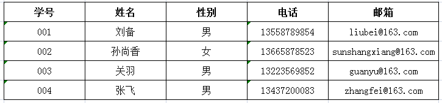
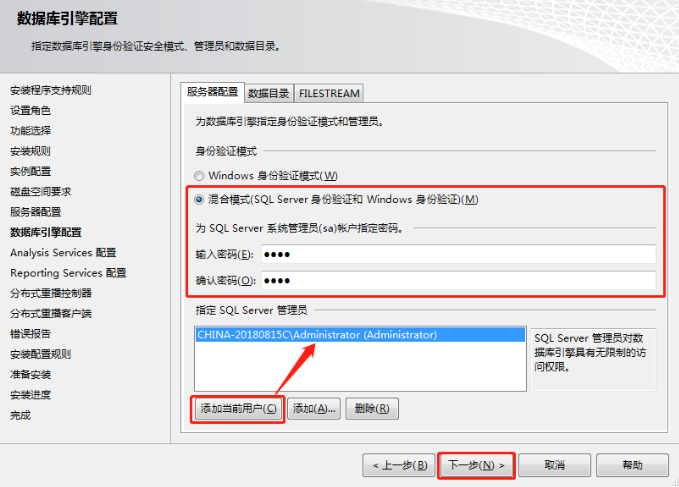

# 介绍

**数据库：**数据库是“按照数据结构来组织、存储和管理数据的仓库”。是一个长期存储在计算机内的、有组织的、可共享的、统一管理的大量数据的集合。

**应用场景：**在软件系统中无处不在，几乎所有的软件系统背后都有数据库，例如（淘宝，QQ，游戏等）。

**数据表展现形式：**



**主流关系型数据库：** SQL SERVER，MySQL，Oracle等。

**数据库的安装：（服务、管理工具）**

（1）在微软官网下载安装程序，https://www.microsoft.com/zh-cn/sql-server/sql-server-downloads

（2）百度搜索"I tell you"，或者访问 https://msdn.itellyou.cn/



**打开数据库：**

（1）启动服务：

​	【1】命令行启动；【2】SQL SERVER配置管理器；【3】Windows服务；

（2）打开SQL SERVER Management Studio，使用工具连接到数据库。

​	【1】Windows身份验证；	【2】SQL SERVER身份验证；

 **数据库基本操作：**

（1）建库。

（2）建表。

（3）数据维护。

**数据库的迁移：**

（1）数据库的分离、附加；（分离和删除的区别在于硬盘上是否还留存有数据库文件）

（2）数据库的备份，还原；

（3）数据库脚本的保存；

# 建库建表

## 一、检查数据库名是否存在

如果需要创建数据库，可能会出现数据库名字重名的现象，我们可以使用如下代码查询数据库名是否存在，存在则删除此数据库。

```sql
--删除数据库
if exists(select * from sys.databases where name = 'DBTEST')
	drop database DBTEST
```

此代码检查数据库中是否存在"DBTEST"数据库，如果存在则删除此数据库，此处理方式最好只在学习阶段使用，在正式生产环境中慎用，操作不当可能会删除重要数据。

## 二、创建数据库

```sql
--创建数据库
create database DBTEST
on  --数据文件
(
	name = 'DBTEST',   --逻辑名称
	filename = 'D:\Data\DBTEST.mdf',  -- 物理路径及名称
	size = 5MB,  -- 数据文件初始大小
	filegrowth = 2MB -- 数据文件增长速度,也可以使用百分比来设置
)
log on  --日志文件
(
	name = 'DBTEST_log', -- 逻辑名称
	filename = 'D:\Data\DBTEST_log.ldf', -- 物理路径及名称
	size = 5MB, -- 日志文件初始大小
	filegrowth = 2MB -- 日志文件增长速度,也可以使用百分比来设置
)
```

以上代码创建"DBTEST"数据库，并且分别使用on和log on规定了数据文件和日志文件的信息。

创建数据库也可以按照如下简单语法来创建：

```sql
create database DBTEST
```

如果按照上述方式创建数据库，数据库的数据文件和日志文件的相关信息，全部采取默认值。

## 三、建表

**使用数据库和删除数据表：**

```sql
use DBTEST  -- 切换当前数据库为DBTEST
-- 删除表(先判断表在当前数据库是否存在,存在则删除,其中type='U'判断对象类型为用户定义表类型)
if exists(select * from sys.objects where name = 'Department' and type = 'U')
	drop table Department
```

**创建数据表语法：**

```sql
create table 表名
(
	字段名1 数据类型(长度),
	字段名2 数据类型(长度)
)
```

其中数据类型，我们在后面用到什么类型，在介绍什么类型，有的类型可以不填写长度。

**创建数据表示例（部门表，职级表，员工信息表）：**

```sql
--创建部门表
create table Department -
(
	-- 创建部门编号;int代表整数类型;primary key代表主键;identity(1,1)代表从1开始步长为1自增长;
	DepartmentId int primary key identity(1,1),
	-- 创建部门名称;nvarchar(50)代表长度50的字符串;not null代表不能为空;
	DepartmentName nvarchar(50) not null,
	-- 创建部门描述；text代表长文本;
	DepartmentRemark text
)
```

**字符串类型比较：**

char：定长，例如 char(10)，不论你存储的数据是否达到了10个字节，都要占去10个字节的空间 。

varchar：变长，例如varchar(10)，并不代表一定占用10个字节，而代表最多占用10个字节。最大长度8000，也可以使用varchar(max)表示2G以内的数据，但存储机制会和text一样，效率会降低。

text：长文本， 最大长度为2^31-1(2,147,483,647)个字符 。

nchar,nvarchar,ntext：名字前面多了一个n， 它表示存储的是Unicode数据类型的字符，区别varchar(100)可以存储100个英文字母或者50个汉字，而nvarchar(100)可以存储100个英文字母，也可以存储100个汉字。

```sql
-- 创建职级表，rank为系统关键字，此处使用[]代表自定义名字，而非系统关键字，
-- 所以这句话的作用就是创建了一个名为[Rank]类型的表
create table [Rank]
(
	RankId int primary key identity(1,1),
	RankName nvarchar(50) not null,
	RankRemark text
)
```

```sql
--创建员工信息表
create table People
(
	PeopleId int primary key identity(1,1),
	-- references代表外键引用,此字段必须符合与其它表的外键约束
	DepartmentId int references Department(DepartmentId)  not null,
	RankId int references [Rank](RankId) not null,
	PeopleName nvarchar(50) not null,
	-- default代表字段默认值; check可以规定字段值的约束条件;
	PeopleSex nvarchar(1) default('男') check(PeopleSex='男' or PeopleSex='女') not null,
	PeopleBirth datetime not null,
	PeopleSalary decimal(12,2) check(PeopleSalary>= 1000 and PeopleSalary <= 100000) not null,
	-- unique代表唯一约束，为数据提供唯一性保证;
	PeoplePhone nvarchar(20) unique not null,
	PeopleAddress nvarchar(100),
	-- datetime和smalldatetime都可以表示时间类型，getdate()用于获取系统当前时间
	PeopleAddTime smalldatetime default(getdate())
)
```

# 修改表结构

 （1）如需在表中添加列，请使用下面的语法: 

```sql
ALTER TABLE table_name
ADD column_name datatype
```

例如该员工表添加一列员工邮箱：

```sql
alter table People
add PeopleMail nvarchar(100)
```

（2）如需在表中删除列，请使用下面的语法: 

```sql
ALTER TABLE table_name
DROP COLUMN column_name
```

例如删除员工表中的邮箱这一列

```sql
alter table People
drop column PeopleMail
```

（3）如需改变表中列的数据类型，请使用下列语法：

```sql
ALTER TABLE table_name
ALTER COLUMN column_name datatype
```

例如需要改变邮箱列的数据类型为varchar(100)

```sql
alter table People
alter column PeopleMail varchar(100)
```

## 五、删除添加约束

删除约束语法：

```sql
if exists(select * from sysobjects where name=约束名)
alter table 表名 drop constraint 约束名;
go
```

添加约束语法：

```sql
-- 添加主键约束
alter table 表名 add constraint 约束名称 primary key(列名)
-- 添加check约束
alter table 表名 add constraint 约束名称 check(条件表达式)
-- 添加unique约束
alter table 表名 add constraint 约束名称 unique(列名)
-- 添加default约束
alter table 表名 add constraint 约束名称 default 默认值 for 列名
-- 添加外键约束
alter table 表名 add constraint 约束名称 foreign key (列名) references 关联表名(关联表列名)
```

# 插入数据

## 一、向部门表插入数据

**标准语法：**

```sql
insert into Department(DepartmentName,DepartmentRemark)
values('软件部','......')
insert into Department(DepartmentName,DepartmentRemark)
values('硬件部','......')
insert into Department(DepartmentName,DepartmentRemark)
values('市场部','......')
```

**简写语法：（省略字段名称）**

```sql
insert into Department values('行政部','公司主管行政工作的部门')
```

此写法在给字段赋值的时候，必须保证顺序和数据表结构中字段顺序完全一致，不推荐使用此种写法，因为数据表结构变化的时候，数据会出错或产生错误数据。

**一次插入多行数据:**

```sql
insert into Department(DepartmentName,DepartmentRemark)
select '市场部','吹牛的部门' union
select '产品部','天马星空的部门' union
select '总经办','都是领导的部门' 
```

## 二、向职级表插入数据

```sql
insert into [Rank](RankName,RankRemark)
values('初级','辅助其他人完成任务')
insert into [Rank](RankName,RankRemark)
values('中级','具备独立处理事务的能力')
insert into [Rank](RankName,RankRemark)
values('高级','具备可以带动全场节奏的能力')
```

## 三、向员工表插入数据

```sql
insert into People(DepartmentId,RankId,PeopleName,PeopleSex,PeopleBirth,
PeopleSalary,PeoplePhone,PeopleAddress,PeopleAddTime)
values(1,3,'刘备','男','1984-7-9',20000,'13554785452','成都',getdate())

insert into People(DepartmentId,RankId,PeopleName,PeopleSex,PeopleBirth,
PeopleSalary,PeoplePhone,PeopleAddress,PeopleAddTime)
values(1,2,'孙尚香','女','1987-7-9',15000,'13256854578','荆州',getdate())

insert into People(DepartmentId,RankId,PeopleName,PeopleSex,PeopleBirth,
PeopleSalary,PeoplePhone,PeopleAddress,PeopleAddTime)
values(1,1,'关羽','男','1988-8-8',12000,'13985745871','荆州',getdate())

insert into People(DepartmentId,RankId,PeopleName,PeopleSex,PeopleBirth,
PeopleSalary,PeoplePhone,PeopleAddress,PeopleAddTime)
values(2,1,'张飞','男','1990-8-8',8000,'13535987412','宜昌',getdate())

insert into People(DepartmentId,RankId,PeopleName,PeopleSex,PeopleBirth,
PeopleSalary,PeoplePhone,PeopleAddress,PeopleAddTime)
values(2,3,'赵云','男','1989-4-8',9000,'13845789568','宜昌',getdate())

insert into People(DepartmentId,RankId,PeopleName,PeopleSex,PeopleBirth,
PeopleSalary,PeoplePhone,PeopleAddress,PeopleAddTime)
values(3,3,'马超','男','1995-4-8',9500,'13878562568','香港',getdate())

insert into People(DepartmentId,RankId,PeopleName,PeopleSex,PeopleBirth,
PeopleSalary,PeoplePhone,PeopleAddress,PeopleAddTime)
values(3,2,'黄盖','男','1989-4-20',8500,'13335457412','武汉',getdate())

insert into People(DepartmentId,RankId,PeopleName,PeopleSex,PeopleBirth,
PeopleSalary,PeoplePhone,PeopleAddress,PeopleAddTime)
values(3,1,'貂蝉','女','1989-4-20',6500,'13437100050','武汉',getdate())

insert into People(DepartmentId,RankId,PeopleName,PeopleSex,PeopleBirth,
PeopleSalary,PeoplePhone,PeopleAddress,PeopleAddTime)
values(2,2,'曹操','男','1987-12-20',25000,'13889562354','北京',getdate())

insert into People(DepartmentId,RankId,PeopleName,PeopleSex,PeopleBirth,
PeopleSalary,PeoplePhone,PeopleAddress,PeopleAddTime)
values(2,3,'许褚','男','1981-11-11',9000,'13385299632','北京',getdate())

insert into People(DepartmentId,RankId,PeopleName,PeopleSex,PeopleBirth,
PeopleSalary,PeoplePhone,PeopleAddress,PeopleAddTime)
values(2,1,'典韦','男','1978-1-13',8000,'13478545263','上海',getdate())

insert into People(DepartmentId,RankId,PeopleName,PeopleSex,PeopleBirth,
PeopleSalary,PeoplePhone,PeopleAddress,PeopleAddTime)
values(1,1,'曹仁','男','1998-12-12',7500,'13878523695','深圳',getdate())

insert into People(DepartmentId,RankId,PeopleName,PeopleSex,PeopleBirth,
PeopleSalary,PeoplePhone,PeopleAddress,PeopleAddTime)
values(1,3,'孙坚','男','1968-11-22',9000,'13698545841','广州',getdate())

insert into People(DepartmentId,RankId,PeopleName,PeopleSex,PeopleBirth,
PeopleSalary,PeoplePhone,PeopleAddress,PeopleAddTime)
values(3,3,'孙策','男','1988-1-22',11000,'13558745874','深圳',getdate())

insert into People(DepartmentId,RankId,PeopleName,PeopleSex,PeopleBirth,
PeopleSalary,PeoplePhone,PeopleAddress,PeopleAddTime)
values(3,2,'孙权','男','1990-2-21',12000,'13698745214','深圳',getdate())

insert into People(DepartmentId,RankId,PeopleName,PeopleSex,PeopleBirth,
PeopleSalary,PeoplePhone,PeopleAddress,PeopleAddTime)
values(3,2,'大乔','女','1995-2-21',13000,'13985478512','上海',getdate())

insert into People(DepartmentId,RankId,PeopleName,PeopleSex,PeopleBirth,
PeopleSalary,PeoplePhone,PeopleAddress,PeopleAddTime)
values(2,1,'小乔','女','1996-2-21',13500,'13778787874','北京',getdate())

insert into People(DepartmentId,RankId,PeopleName,PeopleSex,PeopleBirth,
PeopleSalary,PeoplePhone,PeopleAddress,PeopleAddTime)
values(1,2,'周瑜','男','1992-10-11',8000,'13987455214','武汉',getdate())

insert into People(DepartmentId,RankId,PeopleName,PeopleSex,PeopleBirth,
PeopleSalary,PeoplePhone,PeopleAddress,PeopleAddTime)
values(2,3,'鲁肃','男','1984-9-10',5500,'13254785965','成都',getdate())

insert into People(DepartmentId,RankId,PeopleName,PeopleSex,PeopleBirth,
PeopleSalary,PeoplePhone,PeopleAddress,PeopleAddTime)
values(3,3,'吕蒙','男','1987-5-19',8500,'13352197364','成都',getdate())

insert into People(DepartmentId,RankId,PeopleName,PeopleSex,PeopleBirth,
PeopleSalary,PeoplePhone,PeopleAddress,PeopleAddTime)
values(1,1,'陆逊','男','1996-5-19',7500,'13025457392','南京',getdate())

insert into People(DepartmentId,RankId,PeopleName,PeopleSex,PeopleBirth,
PeopleSalary,PeoplePhone,PeopleAddress,PeopleAddTime)
values(1,2,'太史慈','男','1983-6-1',7500,'13077778888','上海',getdate())
```

其中DepartmentId，RankId，PeopleSalary均为数字类型，在赋值的时候不需要添加单引号，而其它类型需要添加单引号。

## 四、查询数据是否插入成功 

```sql
select * from Department
select * from [Rank]
select * from People 
```

# 修改和删除数据

## 一、修改数据示例

工资普调，为每个员工+500 元工资（批量修改）

```sql
update People set PeopleSalary = PeopleSalary + 500
```

将员工编号为8的工资+1000 元（根据条件修改）

```sql
update People set PeopleSalary = PeopleSalary + 1000 WHERE PeopleId = 8
```

将软件部（部门编号已知=1）所有员工工资低于1万的全部调整成1 万（根据多条件修改）

```sql
update People set PEOPLESALARY = 10000 WHERE DepartmentId=1 and PEOPLESALARY < 10000
```

修改刘备工资为以前的2 倍，并且修改其地址为北京（同时修改多个字段）

```sql
UPDATE People SET PEOPLESALARY = PEOPLESALARY*2,PEOPLEADDRESS='北京' WHERE PEOPLENAME = '刘备'
```

## 二、删除数据示例

删除员工表中所有数据

```sql
DELETE FROM People
```

删除市场部(已知部门编号=3)中工资大于15000 的所有员工

```sql
DELETE FROM People WHERE DepartmentId = 3 and PEOPLESALARY > 15000
```

## 三、drop、truncate、delete区别

**drop table**:删除表对象，表数据、表结构、表对象都进行了删除。

**delete**和**truncate table**：删除表数据，表对象及表结构依然存在。

**delete与truncate table的区别如下：**

* **delete**：

（1）可以删除表所有数据，也可以根据条件删除数据。

（2）如果有自动编号，删除后继续编号，例如delete删除表所有数据后，之前数据的自动编号是1，2，3，那么之后新增数据的编号从4开始。

**truncate table**：

（1）只能清空整个表数据，不能根据条件删除数据。

（2）如果有自动编号，清空表数据后重新编号，例如truncate table清空表所有数据后，之前数据的自动编号是1，2，3，那么之后新增数据的编号仍然从1开始。

# 基础查询

（1）查询所有行所有列

```sql
--查询所有的部门
SELECT * FROM Department
--查询所有的职级
SELECT * FROM [Rank]
--查询所有的员工信息
SELECT * FROM People
```

（2）指定列查询（姓名，性别，月薪，电话）

```sql
SELECT PeopleName,PeopleSex,PeopleSalary,PeoplePhone from People
```

（3）指定列查询,并自定义中文列名（姓名，性别，月薪，电话）

```sql
SELECT PeopleName 姓名,PeopleSex 性别,PeopleSalary 工资,PeoplePhone 电话 from People
```

（4）查询公司员工所在城市（不需要重复数据）

```sql
select distinct PeopleAddress from People
```

（5）假设工资普调10%，查询原始工资和调整后的工资，显示（姓名，性别，月薪，加薪后的月薪）（添加列查询）。

```sql
SELECT PeopleName 姓名,PeopleSex 性别,PeopleSalary 月薪,PeopleSalary*1.1 加薪后月薪 from People
```

# 条件查询

**SQL中常用运算符**

```sql
=：等于，比较是否相等及赋值
!=：比较不等于
>：比较大于
<：比较小于
>=：比较大于等于
<=：比较小于等于
IS NULL：比较为空
IS NOT NULL：比较不为空
in：比较是否在其中
like：模糊查询
BETWEEN...AND...：比较是否在两者之间
and：逻辑与（两个条件同时成立表达式成立）
or：逻辑或（两个条件有一个成立表达式成立） 
not：逻辑非（条件成立，表达式则不成立；条件不成立，表达式则成立）
```

**查询示例：**

（1）根据指定列（姓名，性别，月薪，电话）查询性别为女的员工信息,并自定义中文列名

```sql
SELECT PeopleName 姓名,PeopleSex 性别,PeopleSalary 工资,PeoplePhone 电话 from People
WHERE PEOPLESEX = '女'
```

（2）查询月薪大于等于10000 的员工信息( 单条件 )

```sql
select * from People where PeopleSalary >= 10000 
```

（3）查询月薪大于等于10000 的女员工信息(多条件)

```sql
select * from People where PeopleSalary >= 10000 and PeopleSex = '女'
```

（4）显示出出身年月在1980-1-1之后，而且月薪大于等于10000的女员工信息。

```sql
select * from People where PeopleBirth >= '1980-1-1' and PeopleSalary >= 10000 and PeopleSex = '女'
```

（5）显示出月薪大于等于15000 的员工,或者月薪大于等于8000的女员工信息。

```sql
select * from People where PeopleSalary >= 15000 or (PeopleSalary >= 8000 and PeoPleSex = '女')
```

（6）查询月薪在10000-20000 之间员工信息( 多条件 )

```sql
--方案一：
select * from People where PeopleSalary >= 10000 and PeopleSalary <= 20000
--方案二：
select * from People where PeopleSalary  between 10000 and 20000
```

（7）查询出地址在北京或者上海的员工信息

```sql
--方案一：
select * from People where PeopleAddress = '北京' or PeopleAddress = '上海'
--方案二：
select * from People where PeopleAddress in('北京','上海')
```

（8）查询所有员工信息(根据工资排序，降序排列)

```sql
--order by: 排序  asc: 正序  desc: 倒序
select * from People order by PeopleSalary desc
```

（9）显示所有的员工信息，按照名字的长度进行倒序排列

```sql
select * from People order by len(PeopleName) desc
```

（10）查询工资最高的5个人的信息

```sql
select top 5 * from People order by PeopleSalary desc
```

（11）查询工资最高的10%的员工信息

```sql
select top 10 percent * from People order by PeopleSalary desc
```

（12）查询出地址没有填写的员工信息

```sql
select * from People where PeopleAddress is null
```

（13）查询出地址已经填写的员工信息

```sql
select * from People where PeopleAddress is not null
```

（14）查询所有的80后员工信息

```sql
--方案一：
select * from People where PeopleBirth >= '1980-1-1' and PeopleBirth <= '1989-12-31'
--方案二：
select * from People where PeopleBirth between '1980-1-1' and '1989-12-31'
--方案三：
select * from People where year(PeopleBirth) >= 1980 and year(PeopleBirth) <= 1989
```

（15）查询年龄在30-40 之间，并且工资在15000-30000 之间的员工信息

```sql
--方案一：
select * from People where
(year(getdate())-year(PeopleBirth) >= 30 and year(getdate())-year(PeopleBirth) <= 40) and
(PeopleSalary >= 15000 and PeopleSalary <= 30000)
--方案二：
select * from People where
(year(getdate())-year(PeopleBirth) between 30 and 40)
and PeopleSalary between 15000 and 30000
```

（16）查询出巨蟹 6.22--7.22 的员工信息

```sql
select * from People where 
(month(PeopleBirth) = 6 and DAY(PeopleBirth) >= 22) or
(month(PeopleBirth) = 7 and DAY(PeopleBirth) <= 22)
```

（17）查询工资比赵云高的人

```sql
select * from People where PeopleSalary > 
(select PeopleSalary from People where PEOPLENAME = '赵云')
```

（18）查询出和赵云在同一个城市的人

```sql
select * from People where PEOPLEADDRESS = 
(select PEOPLEADDRESS from People where PEOPLENAME = '赵云')
```

（19）查询出生肖为鼠的人员信息

```sql
select * from People where year(PeopleBirth) % 12 = 4
```

（20）查询所有员工信息，添加一列显示属相(鼠,牛,虎,兔,龙,蛇,马,羊,猴,鸡,狗,猪)

```sql
--方案一：
select PeopleName 姓名,PeopleSex 性别,PeopleSalary 工资,PeoplePhone 电话,PEOPLEBIRTH 生日,
case
	when year(PeopleBirth) % 12 = 4 then '鼠'
	when year(PeopleBirth) % 12 = 5 then '牛'
	when year(PeopleBirth) % 12 = 6 then '虎'
	when year(PeopleBirth) % 12 = 7 then '兔'
	when year(PeopleBirth) % 12 = 8 then '龙'
	when year(PeopleBirth) % 12 = 9 then '蛇'
	when year(PeopleBirth) % 12 = 10 then '马'
	when year(PeopleBirth) % 12 = 11 then '羊'
	when year(PeopleBirth) % 12 = 0 then '猴'
	when year(PeopleBirth) % 12 = 1 then '鸡'
	when year(PeopleBirth) % 12 = 2 then '狗'
	when year(PeopleBirth) % 12 = 3 then '猪'
	ELSE ''
end 生肖
from People

--方案二：
select PeopleName 姓名,PeopleSex 性别,PeopleSalary 工资,PeoplePhone 电话,PEOPLEBIRTH 生日,
case year(PeopleBirth) % 12
	when 4 then '鼠'
	when 5 then '牛'
	when 6 then '虎'
	when 7 then '兔'
	when 8 then '龙'
	when 9 then '蛇'
	when 10 then '马'
	when 11 then '羊'
	when 0 then '猴'
	when 1 then '鸡'
	when 2 then '狗'
	when 3 then '猪'
	ELSE ''
end 生肖
from People
```

# 模糊查询

模糊查询使用like关键字和通配符结合来实现，通配符具体含义如下：

```sql
%：代表匹配0个字符、1个字符或多个字符。
_：代表匹配有且只有1个字符。
[]：代表匹配范围内
[^]：代表匹配不在范围内
```

（1）查询姓刘的员工信息

```sql
select * from People  where PeopleName like '刘%'
```

（2）查询名字中含有 " 尚 " 的员工信息

```sql
select * from People  where PeopleName like '%尚%'
```

（3）显示名字中含有“尚”或者“史”的员工信息

```sql
select * from People  where PeopleName like '%尚%' or PeopleName like '%史%'
```

（4）查询姓刘的员工，名字是2个字

```sql
--方案一：
select * from People  where PeopleName like '刘_'
--方案二：
select * from People where SUBSTRING(PeopleName,1,1) = '刘' and LEN(PeopleName) = 2
```

（5）查询出名字最后一个字是香，名字一共三个字的员工信息

```sql
--方案一：
select * from People  where PeopleName like '__香'
--方案二：
select * from People where SUBSTRING(PeopleName,3,1) = '香' and LEN(PeopleName) = 3
```

（6）查询出电话号码开头138的员工信息

```sql
select * from People  where PeoplePhone like '138%'
```

（7）查询出电话号码开头138的员工信息,第4位可能是7，可能8 ，最后一个号码是5

```sql
select * from People where PeoplePhone like '138[7,8]%5'
```

（8）查询出电话号码开头133的员工信息,第4位是2-5之间的数字 ，最后一个号码不是2和3

```sql
--方案一：
select * from People where PeoplePhone like '133[2,3,4,5]%[^2,3]'
--方案二：
select * from People where PeoplePhone like '133[2-5]%[^2-3]'
```

# 聚合函数

SQL SERVER中聚合函数主要有：

```sql
-- 不能用在wherec处
-- where子句用于在数据分组前筛选行，而聚合函数是对分组后的数据集进行计算，两者执行时机不同。例如，where avg(salary) > 5000是错误的，需用having替代。
count:求数量
max:求最大值
min:求最小值
sum:求和
avg:求平均值
```

## 一、聚合函数举例应用

（1）求员工总人数

```sql
select COUNT(*) 数量 from People
```

（2）求最大值，求最高工资

```sql
select MAX(PeopleSalary) 最高工资 from People
```

（3）求最小时，求最小工资

```sql
select MIN(PeopleSalary) 最低工资 from People
```

（4）求和，求所有员工的工资总和

```sql
select SUM(PeopleSalary) 工资总和 from People
```

（5）求平均值，求所有员工的平均工资

```sql
--方案一：
select AVG(PeopleSalary) 平均工资 from People
--方案二：精确到2位小数
select ROUND(AVG(PeopleSalary),2)  平均工资 from People
--方案三：精确到2位小数
select Convert(decimal(12,2),AVG(PeopleSalary))  平均工资 from People
```

（6）日期格式化

```sql
format(trans_date, 'yyyy-MM') # 2018-12-18 -> 2018-12
```

ROUND函数用法：

```sql
round(num,len,[type])
其中:
num表示需要处理的数字，len表示需要保留的长度，type处理类型(0是默认值代表四舍五入，非0代表直接截取)
select ROUND(123.45454,3)  --123.45500
select ROUND(123.45454,3,1) --123.45400
```

（6）求数量，最大值，最小值，总和，平均值，在一行显示

```sql
select COUNT(*) 数量,MAX(PeopleSalary) 最高工资,MIN(PeopleSalary) 最低工资,SUM(PeopleSalary) 工资总和,AVG(PeopleSalary) 平均工资 from People
```

（7）查询出武汉地区的员工人数，总工资，最高工资，最低工资和平均工资

```sql
select '武汉' 地区,COUNT(*) 数量,MAX(PeopleSalary) 最高工资,MIN(PeopleSalary) 最低工资
,SUM(PeopleSalary) 工资总和,AVG(PeopleSalary) 平均工资 from People 
WHERE PEOPLEADDRESS = '武汉'
```

（8）求出工资比平均工资高的人员信息

```sql
select * from People where PeopleSalary > (select AVG(PeopleSalary) 平均工资 from People)
```

（9）求数量，年龄最大值，年龄最小值，年龄总和，年龄平均值，在一行显示

```sql
-- 方案一：
select COUNT(*) 数量,
MAX(year(getdate())-year(PeopleBirth)) 最高年龄,
MIN(year(getdate())-year(PeopleBirth)) 最低年龄,
SUM(year(getdate())-year(PeopleBirth)) 年龄总和,
AVG(year(getdate())-year(PeopleBirth)) 平均年龄 
from People
-- 方案二：
select COUNT(*) 数量,
MAX(DATEDIFF(year, PeopleBirth, getDate())) 最高年龄,
MIN(DATEDIFF(year, PeopleBirth, getDate())) 最低年龄,
SUM(DATEDIFF(year, PeopleBirth, getDate())) 年龄总和,
AVG(DATEDIFF(year, PeopleBirth, getDate())) 平均年龄 
from People
```

（10）计算出月薪在10000 以上的男性员工的最大年龄，最小年龄和平均年龄

```sql
-- 方案一：
select '男' 性别,COUNT(*) 数量,
MAX(year(getdate())-year(PeopleBirth)) 最高年龄,
MIN(year(getdate())-year(PeopleBirth)) 最低年龄,
SUM(year(getdate())-year(PeopleBirth)) 年龄总和,
AVG(year(getdate())-year(PeopleBirth)) 平均年龄 
from People where PeopleSex = '男' and PeopleSalary >= 10000
-- 方案二：
select '男' 性别,COUNT(*) 数量,
MAX(DATEDIFF(year, PeopleBirth, getDate())) 最高年龄,
MIN(DATEDIFF(year, PeopleBirth, getDate())) 最低年龄,
SUM(DATEDIFF(year, PeopleBirth, getDate())) 年龄总和,
AVG(DATEDIFF(year, PeopleBirth, getDate())) 平均年龄 
from People where PeopleSex = '男' and PeopleSalary >= 10000
```

（11）统计出所在地在“武汉或上海”的所有女员工数量以及最大年龄，最小年龄和平均年龄

```sql
-- 方案一：
select '武汉或上海' 地区,'女' 性别,COUNT(*) 数量,
MAX(year(getdate())-year(PeopleBirth)) 最高年龄,
MIN(year(getdate())-year(PeopleBirth)) 最低年龄,
SUM(year(getdate())-year(PeopleBirth)) 年龄总和,
AVG(year(getdate())-year(PeopleBirth)) 平均年龄  
from People where PeopleSex = '女' and PeopleAddress in('武汉','上海')
-- 方案二：
select '武汉或上海' 地区,'女' 性别,COUNT(*) 数量,
MAX(DATEDIFF(year, PeopleBirth, getDate())) 最高年龄,
MIN(DATEDIFF(year, PeopleBirth, getDate())) 最低年龄,
SUM(DATEDIFF(year, PeopleBirth, getDate())) 年龄总和,
AVG(DATEDIFF(year, PeopleBirth, getDate())) 平均年龄  
from People where PeopleSex = '女' and PeopleAddress in('武汉','上海')
```

（12）求出年龄比平均年龄高的人员信息

```sql
-- 方案一：
select * from People where 
year(getdate())-year(PeopleBirth) > 
(select AVG(year(getdate())-year(PeopleBirth)) 
from People)
-- 方案二：
select * from People where 
DATEDIFF(year, PeopleBirth, getDate()) > 
(select AVG(DATEDIFF(year, PeopleBirth, getDate())) 
from People)
```

## 二、补充-SQL中常用时间处理函数

* **GETDATE()**：返回当前的日期和时间

```sql
SELECT GETDATE(); -- 输出：2024-07-25 15:30:45.123
```

* **DATEPART()** ：从日期 / 时间中提取指定的部分（如年、月、日、小时等），返回整数

```sql
SELECT DATEPART(year, '2024-07-25') AS 年份; -- 输出：2024
SELECT DATEPART(mm, GETDATE()) AS 月份; -- 输出：7（当前月份）
SELECT DATEPART(dd, '2024-07-25 15:30:00') AS 日期; -- 输出：25
```


* **DATEADD()** ：返回日期中添加或减去指定的时间间隔

```sql
-- 当前日期加3天
SELECT DATEADD(day, 3, GETDATE()) AS 三天后; 
-- 2024-07-25 15:30:00 减2小时
SELECT DATEADD(hour, -2, '2024-07-25 15:30:00') AS 两小时前; -- 输出：2024-07-25 13:30:00
-- 加1个月
SELECT DATEADD(month, 1, '2024-07-25') AS 一个月后; -- 输出：2024-08-25 00:00:00
```


* **DATEDIFF()** ：返回两个日期直接的时间

```sql
-- 两个日期相差的天数
SELECT DATEDIFF(day, '2024-07-20', '2024-07-25') AS 相差天数; -- 输出：5
-- 相差的小时数
SELECT DATEDIFF(hour, '2024-07-25 10:00', '2024-07-25 15:30') AS 相差小时; -- 输出：5
-- 结束日期在起始日期之前，返回负数
SELECT DATEDIFF(month, '2024-08-01', '2024-07-01') AS 相差月份; -- 输出：-1
```


* **DATENAME()**： 返回指定日期的指定日期部分的整数

```sql
-- 返回月份名称（英文环境下）
SELECT DATENAME(month, '2024-07-25') AS 月份名称; -- 输出：July
-- 返回星期几（英文环境下）
SELECT DATENAME(weekday, '2024-07-25') AS 星期几; -- 输出：Thursday（假设2024-07-25是周四）
-- 返回季度（字符串形式）
SELECT DATENAME(quarter, '2024-07-25') AS 季度; -- 输出：3
```


* **CONVERT()**：  返回不同格式的时间

```sql
-- 转换为 'yyyy-mm-dd' 格式
SELECT CONVERT(varchar(10), GETDATE(), 23) AS 日期; -- 输出：2024-07-25
-- 转换为带时间的格式
SELECT CONVERT(varchar(20), GETDATE(), 120) AS 日期时间; -- 输出：2024-07-25 15:30:45
-- 仅显示时间
SELECT CONVERT(varchar(8), GETDATE(), 108) AS 时间; -- 输出：15:30:45
```


**示例：**

```
select DATEDIFF(day, '2019-08-20', getDate());    --获取指定时间单位的差值
SELECT DATEADD(MINUTE,-5,GETDATE())               --加减时间,此处为获取五分钟前的时间,MINUTE 表示分钟，可为 YEAR,MONTH,DAY,HOUR
select DATENAME(month, getDate());                --当前月份
select DATENAME(WEEKDAY, getDate());              --当前星期几
select DATEPART(month, getDate());                --当前月份
select DAY(getDate());                            --返回当前日期天数
select MONTH(getDate());                          --返回当前日期月数
select YEAR(getDate());                           --返回当前日期年数

SELECT CONVERT(VARCHAR(22),GETDATE(),20)          --2020-01-09 14:46:46
SELECT CONVERT(VARCHAR(24),GETDATE(),21)          --2020-01-09 14:46:55.91
SELECT CONVERT(VARCHAR(22),GETDATE(),23)		  --2020-01-09
SELECT CONVERT(VARCHAR(22),GETDATE(),24)          --15:04:07
Select CONVERT(varchar(20),GETDATE(),14)          --15:05:49:330
```

**时间格式控制字符串：**

| 名称         | 日期单位    | 缩写      |
| ------------ | ----------- | --------- |
| 年           | year        | yyyy 或yy |
| 季度         | quarter     | qq,q      |
| 月           | month       | mm,m      |
| 一年中第几天 | dayofyear   | dy,y      |
| 日           | day         | dd,d      |
| 一年中第几周 | week        | wk,ww     |
| 星期         | weekday     | dw        |
| 小时         | Hour        | hh        |
| 分钟         | minute      | mi,n      |
| 秒           | second      | ss,s      |
| 毫秒         | millisecond | ms        |

## isnull, nullif

```sql
select p.product_id,
isnull(round(sum(p.price * u.units) * 1.0 / NULLIF(sum(u.units), 0), 2), 0) as average_price
from Prices p
left join UnitsSold u on p.product_id = u.product_id
and u.purchase_date between p.start_date and p.end_date  
group by p.product_id

当round(sum(p.price * u.units) * 1.0 / sum(u.units), 2)为null时返回0
当sum(u.units)为0时返回null
```

## Lag

​	LAG 是 SQL 中的窗口函数（Window Function），主要作用是在有序的结果集中，获取当前行「之前第 N 行」的数据，常用于比较当前行与历史行的差异、识别连续数据等场景。

```sql
LAG(目标列, 偏移量, 默认值) OVER (ORDER BY 排序列)
```

- **目标列**：需要获取的字段（如 `num`、`value` 等）。
- **偏移量**：向前取第 N 行（默认为 1，即前 1 行）。
- **默认值**：当「前 N 行不存在」时返回的值（可选，默认返回 `NULL`）。
- **ORDER BY**：指定排序规则，决定 “前后” 的顺序（必须包含，否则无法确定行的位置关系）。

# 分组查询

（1）根据员工所在地区分组统计员工人数 ,员工工资总和 ,平均工资，最高工资和最低工资

```sql
--方案一：使用union(此方案需要知道所有的地区，分别查询出所有地区的数据，然后使用union拼接起来。)
select '武汉' 地区,COUNT(*) 数量,MAX(PeopleSalary) 最高工资,MIN(PeopleSalary) 最低工资
,SUM(PeopleSalary) 工资总和,AVG(PeopleSalary) 平均工资 from People
 where PeopleAddress = '武汉' union
select '北京' 地区,COUNT(*) 数量,MAX(PeopleSalary) 最高工资,MIN(PeopleSalary) 最低工资
,SUM(PeopleSalary) 工资总和,AVG(PeopleSalary) 平均工资 from People
 where PeopleAddress = '北京'
 --...其它地区数据
 --...其他地区数据
 
 --方案二：使用Group by
select PeopleAddress 地区,COUNT(*) 人数,SUM(PeopleSalary) 工资总和,
AVG(PeopleSalary) 平均工资,MAX(PeopleSalary) 最高工资,MIN(PeopleSalary) 最低工资 
from People group by PeopleAddress
```

（2）根据员工所在地区分组统计员工人数，员工工资总和，平均工资，最高工资和最低工资，1985 年及以后出身的员工不参与统计。

```sql
select PeopleAddress 地区,COUNT(*) 人数,SUM(PeopleSalary) 工资总和,
AVG(PeopleSalary) 平均工资,MAX(PeopleSalary) 最高工资,MIN(PeopleSalary) 最低工资 
from People
where PeopleBirth < '1985-1-1'
group by PeopleAddress
```

（3）根据员工所在地区分组统计员工人数，员工工资总和，平均工资，最高工资和最低工资，要求筛选出员工人数至少在2人及以上的记录，并且1985年及以后出身的员工不参与统计。

```sql
select PeopleAddress 地区,COUNT(*) 人数,SUM(PeopleSalary) 工资总和,
AVG(PeopleSalary) 平均工资,MAX(PeopleSalary) 最高工资,MIN(PeopleSalary) 最低工资 
from People 
where PeopleBirth < '1985-1-1'
group by PeopleAddress
having COUNT(*) >= 2
```

# 多表查询

## 一、笛卡尔乘积

```sql
select * from People,Department
```

此查询结果会将People表的所有数据和Department表的所有数据进行依次排列组合形成新的记录。例如People表有10条记录，Department表有3条记录，则排列组合之后查询结果会有10*3=30条记录。

## 二、简单多表查询

此种查询不符合主外建关系的数据不会被显示

**查询员工信息，同时显示部门名称**

```sql
select * from People,Department where People.DepartmentId = Department.DepartmentId 
```

**查询员工信息，同时显示职级名称**

```sql
select * from People,Rank where People.RankId = Rank.RankId
```

**查询员工信息，同时显示部门名称，职位名称**

```sql
select * from People,Department,Rank
where People.DepartmentId = Department.DepartmentId and People.RankId = Rank.RankId
```

## 三、内连接

此种查询不符合主外建关系的数据不会被显示

**查询员工信息，同时显示部门名称**

```sql
select * from People inner join Department on People.DepartmentId = Department.DepartmentId 
```

**查询员工信息，同时显示职级名称**

```sql
select * from People inner join Rank on People.RankId = Rank.RankId
```

**查询员工信息，同时显示部门名称，职位名称**

```sql
select * from People 
inner join Department on People.DepartmentId = Department.DepartmentId 
inner join Rank on People.RankId = Rank.RankId
```

## 三、外连接

外连接分为左外连接、右外连接和全外连接。

左外联接：以左表为主表显示全部数据，主外键关系找不到数据的地方null取代。

**以下是左外连接的语法示例：**

**查询员工信息，同时显示部门名称**

```sql
select * from People left join Department on People.DepartmentId = Department.DepartmentId 
```

**查询员工信息，同时显示职级名称**

```sql
select * from People left join Rank on People.RankId = Rank.RankId
```

**查询员工信息，同时显示部门名称，职位名称**

```sql
select * from People 
left join Department on People.DepartmentId = Department.DepartmentId 
left join Rank on People.RankId = Rank.RankId
```

右外连接（right join）：右外连接和左外连接类似，A left join B  ==  B right join A

全外连接（full join）：两张表的所有数据无论是否符合主外键关系必须全部显示，不符合主外键关系的地方null取代。

## 四、多表查询综合示例

（1）查询出武汉地区所有的员工信息，要求显示部门名称以及员工的详细资料

```sql
select PeopleName 姓名,People.DepartmentId 部门编号 ,DepartmentName 部门名称,
PeopleSex 性别,PeopleBirth 生日,
PeopleSalary 月薪,PeoplePhone 电话,PeopleAddress 地区
from People left join DEPARTMENT on Department.DepartmentId = People.DepartmentId
where PeopleAddress = '武汉'
```

（2）查询出武汉地区所有的员工信息，要求显示部门名称，职级名称以及员工的详细资料

```sql
select PeopleName 姓名,DepartmentName 部门名称,RankName 职位名称,
PeopleSex 性别,PeopleBirth 生日,
PeopleSalary 月薪,PeoplePhone 电话,PeopleAddress 地区
from People left join DEPARTMENT on Department.DepartmentId = People.DepartmentId
left join [Rank] on [Rank].RankId = People.RankId
where PeopleAddress = '武汉'
```

（3）根据部门分组统计员工人数，员工工资总和，平均工资，最高工资和最低工资。

```sql
--提示：在进行分组统计查询的时候添加二表联合查询。
select DepartmentName 部门名称,COUNT(*) 人数,SUM(PeopleSalary) 工资总和,
AVG(PeopleSalary) 平均工资,MAX(PeopleSalary) 最高工资,MIN(PeopleSalary) 最低工资 
from People left join DEPARTMENT on Department.DepartmentId = People.DepartmentId
group by Department.DepartmentId,DepartmentName
```

（4）根据部门分组统计员工人数，员工工资总和，平均工资，最高工资和最低工资，平均工资在10000 以下的不参与统计，并且根据平均工资降序排列。

```sql
select DepartmentName 部门名称,COUNT(*) 人数,SUM(PeopleSalary) 工资总和,
AVG(PeopleSalary) 平均工资,MAX(PeopleSalary) 最高工资,MIN(PeopleSalary) 最低工资 
from People left join DEPARTMENT on Department.DepartmentId = People.DepartmentId
group by Department.DepartmentId,DepartmentName
having AVG(PeopleSalary) >= 10000
order by AVG(PeopleSalary) desc
```

（5）根据部门名称，然后根据职位名称，分组统计员工人数，员工工资总和，平均工资，最高工资和最低工资

```sql
select DepartmentName 部门名称,RANKNAME 职级名称,COUNT(*) 人数,SUM(PeopleSalary) 工资总和,
AVG(PeopleSalary) 平均工资,MAX(PeopleSalary) 最高工资,MIN(PeopleSalary) 最低工资 
from People 
LEFT JOIN DEPARTMENT on Department.DepartmentId = People.DepartmentId
LEFT JOIN [Rank] on [Rank].RANKID = People.RANKID
group by Department.DepartmentId,DepartmentName,[Rank].RANKID,RANKNAME
```

## 五、自连接

自连接：自己连接自己。

例如有如下结构和数据：

```sql
create table Dept
(
	DeptId int primary key,  --部门编号
	DeptName varchar(50) not null, --部门名称
	ParentId int not null,  --上级部门编号
)
insert into Dept(DeptId,DeptName,ParentId)
values(1,'软件部',0)
insert into Dept(DeptId,DeptName,ParentId)
values(2,'硬件部',0)

insert into Dept(DeptId,DeptName,ParentId)
values(3,'软件研发部',1)
insert into Dept(DeptId,DeptName,ParentId)
values(4,'软件测试部',1)
insert into Dept(DeptId,DeptName,ParentId)
values(5,'软件实施部',1)

insert into Dept(DeptId,DeptName,ParentId)
values(6,'硬件研发部',2)
insert into Dept(DeptId,DeptName,ParentId)
values(7,'硬件测试部',2)
insert into Dept(DeptId,DeptName,ParentId)
values(8,'硬件实施部',2)
```

如果要查询出所有部门信息，并且查询出自己的上级部门，查询结果如下：

```sql
--部门编号      部门名称     上级部门
-- 3           软件研发部     软件部
-- 4           软件测试部     软件部
-- 5           软件实施部     软件部
-- 6           硬件研发部     硬件部
-- 7           硬件测试部     硬件部
-- 8           硬件实施部     硬件部

select A.DeptId 部门编号,A.DeptName 部门名称,B.DeptName 上级名称 from Dept A 
inner join Dept B on A.ParentId = B.DeptId
```

# 数据库设计

## 一、数据库结构设计三范式

**第一范式：**是对属性的原子性，要求属性具有原子性，不可再分解。

如有如下表结构设计：

```sql
create table Student --学生表
(
	StuId varchar(20) primary key,--学号
	StuName varchar(20) not null,--学生姓名
	StuContact varchar(50) not null, --联系方式
)
insert into Student(StuId,StuName,StuContact) 
values('001','刘备','QQ:185699887;Tel:13885874587')
select * from Student
```

上述设计则不满足第一范式，联系方式这一列并不是不可再分的最小单元,应修改为如下结构

```sql
create table Student --学生表
(
	StuId varchar(20) primary key,--学号
	StuName varchar(20) not null,--学生姓名
  	Tel varchar(20) not null, --联系电话
  	QQ varchar(20) not null,  --联系QQ
)
```

**第二范式：**是对记录的惟一性，要求记录有惟一标识，即实体的惟一性，即不存在部分依赖；

如有如下表结构设计：

```sql
--选课成绩表
create table StudentCourse
(
	StuId varchar(20),--学号
	StuName varchar(20) not null,--学生姓名
	CourseId varchar(20) not null,--课程编号
	CourseName varchar(20) not null, --选课课程名称
	CourseScore int not null, --考试成绩
)
insert into StudentCourse(StuId,StuName,CourseId,CourseName,CourseScore)
values('001','刘备','001','语文',80)
insert into StudentCourse(StuId,StuName,CourseId,CourseName,CourseScore)
values('001','刘备','002','数学',70)
insert into StudentCourse(StuId,StuName,CourseId,CourseName,CourseScore)
values('002','关羽','003','英语',80)
insert into StudentCourse(StuId,StuName,CourseId,CourseName,CourseScore)
values('003','张飞','003','英语',90)
```

上述设计中有两个事物，一个学生信息，一个课程信息，很显然这两个事物都没有保证实体的唯一性，这里的姓名依赖学号，课程名称依赖课程编号，所以不符合二范式。

```sql
create table Course --课程
(
	CourseId int primary key identity(1,1),--课程编号
	CourseName varchar(30) not null, --课程名称
	CourseContent text --课程介绍
)
insert into Course(CourseName,CourseContent) values('HTML','静态网页的制作')
insert into Course(CourseName,CourseContent) values('WinForm','Windows应用程序开发')

create table Student --学生
(
	StuId int primary key identity(1,1), --学生编号
	StuName varchar(50) not null, --学生名字
	StuSex char(2) not null --学生性别
)
insert into Student(StuName,StuSex) values('刘备','男')
insert into Student(StuName,StuSex) values('关羽','男')

create Table Exam --考试信息表
(
	ExamId int primary key identity(1,1), --选课成绩编号
	StuId int not null, --学生编号
	CourseId int not null,  --课程编号
	Score int not null, --考试分数
)
insert into Exam(StuId,CourseId,Score) values(1,1,90)
insert into Exam(StuId,CourseId,Score) values(1,2,80)
insert into Exam(StuId,CourseId,Score) values(2,2,85)

select * from Student inner join Exam on Student.StuId = Exam.StuId
inner join Course on Course.CourseId = Exam.CourseId
```

**第三范式：**要求任何字段不能由其他字段派生出来，它要求字段没有冗余，即不存在传递依赖 ；

如有如下表结构设计：

```sql
create table Student
(
	StuId varchar(20) primary key,--学号
	StuName varchar(20) not null,--学生姓名
	ProfessionalId int not null,--专业编号
	ProfessionalName varchar(50),--专业名称
	ProfessionalRemark varchar(200), --专业介绍
)
insert into Student(StuId,StuName,ProfessionalId,ProfessionalName,ProfessionalRemark)
values('001','刘备',1,'计算机','最牛的专业')
insert into Student(StuId,StuName,ProfessionalId,ProfessionalName,ProfessionalRemark)
values('002','关羽',2,'工商管理','管理学的基础专业')
insert into Student(StuId,StuName,ProfessionalId,ProfessionalName,ProfessionalRemark)
values('003','张飞',1,'计算机','最牛的专业')
select * from Student
```

上述设计种专业名称字段和专业介绍字段，在数据库种会产生很多冗余数据，不满足第二范式，优化方案如下：

```sql
create table Professional
(
	ProfessionalId int primary key identity(1,1),--专业编号
	ProfessionalName varchar(50),--专业名称
	ProfessionalRemark varchar(200), --专业介绍
)
create table Student
(
	StuId varchar(20) primary key,--学号
	StuName varchar(20) not null,--学生姓名
	ProfessionalId int not null,--专业编号
)
insert into Professional(ProfessionalName,ProfessionalRemark) values('计算机','最牛的专业')
insert into Professional(ProfessionalName,ProfessionalRemark) values('工商管理','管理学的基础专业')
insert into Student(StuId,StuName,ProfessionalId) values('001','刘备',1)
insert into Student(StuId,StuName,ProfessionalId) values('002','关羽',2)
insert into Student(StuId,StuName,ProfessionalId) values('003','张飞',1)
select * from Student
```

## 二、表关系

**（1）一对多关系（专业--学生）**

```sql
create table Profession  --专业
(
	ProId int primary key identity(1,1), --专业编号
	ProName varchar(50) not null --专业名称
)
create table Student --学生
(
	StuId int primary key identity(1,1), --学生编号
	ProId int references Profession(ProId),
	StuName varchar(50) not null, --学生名字
	StuSex char(2) not null --学生性别
)
insert into Profession(ProName) values('软件开发')
insert into Profession(ProName) values('企业信息化')
insert into Student(ProId,StuName,StuSex) values(1,'刘备','男')
insert into Student(ProId,StuName,StuSex) values(1,'关羽','男')
insert into Student(ProId,StuName,StuSex) values(2,'张飞','男')
insert into Student(ProId,StuName,StuSex) values(2,'赵云','男')
select * from Student left join Profession on Student.ProId = Profession.ProId
```

**（2）一对一关系（学生基本信息--学生详情）**

**方案一：**

```sql
create table StudentBasicInfo  --学生基本信息
(
	StuNo varchar(20) primary key not null,  --学号
	StuName varchar(20) not null, --姓名
	StuSex nvarchar(1) not null  --性别
)
create table StudentDetailInfo  --学生详细信息
(
	StuNo varchar(20) primary key not null,
	StuQQ varchar(20), --QQ
	stuPhone varchar(20), --电话
	StuMail varchar(100), --邮箱
	StuBirth date         --生日
)
--插入数据的时候按照顺序先插入刘备的基本信息，在插入关羽的基本信息
--insert into StudentBasicInfo(StuNo,StuName,StuSex) values('QH001','刘备','男')
--insert into StudentBasicInfo(StuNo,StuName,StuSex) values('QH002','关羽','男')
--插入数据的时候按照顺序先插入关羽的详细信息，在插入刘备的详细信息
--insert into StudentDetailInfo(StuNo,StuQQ,stuPhone,StuMail,StuBirth)
--values('QH002','156545214','13654525478','guanyu@163.com','1996-6-6')
--insert into StudentDetailInfo(StuNo,StuQQ,stuPhone,StuMail,StuBirth)
--values('QH001','186587854','15326545214','liubei@163.com','1998-8-8')

--或者如下结构也行：
create table StudentBasicInfo  --学生基本信息
(
	StuNo int primary key identity(1,1),  --学号
	StuName varchar(20) not null, --姓名
	StuSex nvarchar(1) not null  --性别
)
create table StudentDetailInfo  --学生详细信息
(
	StuNo int primary key,  --学号
	StuQQ varchar(20), --QQ
	stuPhone varchar(20), --电话
	StuMail varchar(100), --邮箱
	StuBirth date         --生日
)
```

此方案要求两个表的主键相等关系确定一个学生，所以此设计必须保证主键是可以维护和编辑的，如果主键是自动增长，将很大程度增加了数据维护的难度。

**方案二：**

```sql
create table StudentBasicInfo  --学生基本信息
(
	StuNo int primary key identity(1,1),  --学号
	StuName varchar(20) not null, --姓名
	StuSex nvarchar(1) not null  --性别
)
create table StudentDetailInfo  --学生详细信息
(
	StuDetailNo int primary key identity(1,1),  --详细信息编号
	StuNo int references StudentBasicInfo(StuNo) --学号,外键
	StuQQ varchar(20), --QQ
	stuPhone varchar(20), --电话
	StuMail varchar(100), --邮箱
	StuBirth date         --生日
)
```

此方案中实际上我们是使用一对多的模式来表示一对一，保证多的表中只有一条对应数据即可。

**（3）多对多关系：（选课成绩--学生）**

```sql
create table Course --课程
(
	CourseId int primary key identity(1,1),--课程编号
	CourseName varchar(30) not null, --课程名称
	CourseContent text --课程介绍
)
insert into Course(CourseName,CourseContent) values('HTML','静态网页的制作')
insert into Course(CourseName,CourseContent) values('WinForm','Windows应用程序开发')

create table Student --学生
(
	StuId int primary key identity(1,1), --学生编号
	StuName varchar(50) not null, --学生名字
	StuSex char(2) not null --学生性别
)
insert into Student(StuName,StuSex) values('刘备','男')
insert into Student(StuName,StuSex) values('关羽','男')

create Table Exam --考试信息表
(
	ExamId int primary key identity(1,1), --选课成绩编号
	StuId int not null, --学生编号
	CourseId int not null,  --课程编号
	Score int not null, --考试分数
)
insert into Exam(StuId,CourseId,Score) values(1,1,90)
insert into Exam(StuId,CourseId,Score) values(1,2,80)
insert into Exam(StuId,CourseId,Score) values(2,2,85)

select * from Student inner join Exam on Student.StuId = Exam.StuId
inner join Course on Course.CourseId = Exam.CourseId
```

此方案中，一个学生可以有多门选课，一门课程也可以被多个学生选择，我们称之为多对多关系，在处理多对多关系的时候，我们需要建立一个中间关联表，该关联表中需要有另外两张表的主键字段。

# 使用T-SQL编程

## 一、信息打印

```sql
print:直接打印消息
select:在表格中打印消息，可以设置多列，以及每一列的名字
```

## 二、变量

**T-SQL中变量分为局部变量和全局变量**

**局部变量：（1）以@作为前缀（2）先声明，在赋值**

```sql
declare @str varchar(20)
set @str = '我爱数据库编程' --或者 select @str = '我爱数据库编程'
print @str
```

备注：set赋值和select赋值区别：

set：赋给变量指定的值

select：一般用于从表中查询出的数据，查询记录如果有多条，将最后一条记录的值赋给变量，例如：

```sql
select @变量名 = 字段名 from 表名
```

在赋值过程中，如果是表中查询的数据，如果记录只有一条，使用set和select都可以，但是习惯上使用select。

**全局变量：（1）以@@作为前缀（2）由系统进行定义和维护,只读**

```sql
@@ERROR：返回执行的上一个语句的错误号
@@IDENTITY：返回最后插入的标识值
@@MAX_CONNECTIONS：返回允许同时进行的最大用户连接数
@@ROWCOUNT：返回受上一语句影响的行数
@@SERVERNAME：返回运行 SQL Server 的本地服务器的名称
@@SERVICENAME：返回 SQL Server 正在其下运行的注册表项的名称
@@TRANCOUNT：返回当前连接的活动事务数
@@LOCK_TIMEOUT：返回当前会话的当前锁定超时设置（毫秒）
@@IDENTITY：返回当前会话中最后一次执行 INSERT 操作时自动生成的标识列（自增列）的值
```

**变量示例：**

（1）为赵云此人进行开户开卡操作，赵云身份证：420107199904054233

```sql
declare @AccountId int
insert into AccountInfo(AccountCode,AccountPhone,RealName,OpenTime)
values('420107199904054233','15878547898','赵云',GETDATE())
set @AccountId = @@identity
insert into BankCard(CardNo,AccountId,CardPwd,CardMoney,CardState)
values('6225123412357896',@AccountId,'123456',0,1)
```

（2）需要求出张飞的银行卡卡号和余额，张飞身份证：420107199602034138

```sql
-- 方案一：连接查询
select CardNo 卡号, CardMoney 余额 from BankCard 
left join AccountInfo on BankCard.AccountId = AccountInfo.AccountId
where AccountCode = '420107199602034138'
-- 方案二：使用变量
declare @AccountId int
select @AccountId =  (select AccountId from AccountInfo where AccountCode = '420107199602034138')
select CardNo 卡号, CardMoney 余额 from BankCard where BankCard.AccountId = @AccountId
```

## 三、go语句

go语句：

（1）等待go语句前的代码执行完成后，再执行go后面的代码。

（2）批处理语句的结束标志。

```sql
-- 下面的@num变量作用域为全局
--declare @num int
--set @num = 0

-- 下面的@num变量的作用域是局部，只在两个go之间可以使用，最后一行代码会报错
--.........sql代码
--go
--declare @num int
--set @num = 0
--go
--set @num = 1
```

**添加测试数据：**

```sql
-- 为刘备，关羽，张飞三个人进行开户开卡的操作
-- 刘备身份证：420107198905064135
-- 关羽身份证：420107199507104133
-- 张飞身份证：420107199602034138
insert into AccountInfo(AccountCode,AccountPhone,RealName,OpenTime)
values('420107198905064135','13554785425','刘备',GETDATE())
insert into BankCard(CardNo,AccountId,CardPwd,CardMoney,CardState)
values('6225125478544587',1,'123456',0,1)

insert into AccountInfo(AccountCode,AccountPhone,RealName,OpenTime)
values('420107199507104133','13454788854','关羽',GETDATE())
insert into BankCard(CardNo,AccountId,CardPwd,CardMoney,CardState)
values('6225547858741263',2,'123456',0,1)

insert into AccountInfo(AccountCode,AccountPhone,RealName,OpenTime)
values('420107199602034138','13456896321','张飞',GETDATE())
insert into BankCard(CardNo,AccountId,CardPwd,CardMoney,CardState)
values('6225547854125656',3,'123456',0,1)

select * from AccountInfo
select * from BankCard

--进行存钱操作，刘备存钱2000元，关羽存钱：8000元，张飞存钱：500000元
select * from AccountInfo
update BankCard set CardMoney = CardMoney + 2000 where CardNo = '6225125478544587'
insert into CardExchange(CardNo,MoneyInBank,MoneyOutBank,ExchangeTime)
values('6225125478544587',2000,0,GETDATE())

update BankCard set CardMoney = CardMoney + 8000 where CardNo = '6225547858741263'
insert into CardExchange(CardNo,MoneyInBank,MoneyOutBank,ExchangeTime)
values('6225547858741263',8000,0,GETDATE())

update BankCard set CardMoney = CardMoney + 500000 where CardNo = '6225547854125656'
insert into CardExchange(CardNo,MoneyInBank,MoneyOutBank,ExchangeTime)
values('6225547854125656',500000,0,GETDATE())

--转账：刘备给张飞转账1000元
update BankCard set CardMoney = CardMoney -1000 where CardNo = '6225125478544587'
update BankCard set CardMoney = CardMoney + 1000 where CardNo = '6225547854125656'
insert into CardTransfer(CardNoOut,CardNoIn,TransferMoney,TransferTime)
values('6225125478544587','6225547854125656',1000,GETDATE())
```

# 运算符

T-SQL中使用的运算符分为7种

```sql
算数运算符：加（+）、减（-）、乘（*）、除（/）、模（%） 
逻辑运算符：AND、OR、LIKE、BETWEEN、IN、EXISTS、NOT、ALL、ANY、 
赋值运算符：= 
字符串运算符：+ 
比较运算符：=、>、<、>=、<=、<> 
位运算符：|、&、^ 
复合运算符：+=、-=、/=、%=、*=
```

## 运算符示例

（1）已知长方形的长和宽，求长方形的周长和面积

```sql
declare @c int = 5
declare @k int = 10
declare @zc int
declare @mj int
set @zc = (@c+@k)*2
set @mj = @c * @k
print '周长为:' + Convert(varchar(20),@zc)
print '面积为:' + Convert(varchar(20),@mj)
```

（2）查询银行卡状态为冻结，并且余额超过1000000的银行卡信息

```sql
select * from BankCard where CardState = 3 and CardMoney > 1000000
```

（3）查询出银行卡状态为冻结或者余额等于0的银行卡信息

```sql
select * from BankCard where CardState = 3 or CardMoney = 0
```

（4）查询出姓名中含有'刘'的账户信息以及银行卡信息

```sql
select * from AccountInfo left join BankCard on AccountInfo.AccountId = BankCard.AccountId where RealName like '%刘%'
```

（5）查询出余额在2000-5000之间的银行卡信息

```sql
select * from BankCard where CardMoney between 2000 and 5000
```

（6）查询出银行卡状态为冻结或者注销的银行卡信息

```sql
select * from BankCard where CardState in(3,4)
```

（7）关羽身份证：420107199507104133，关羽到银行来开户，查询身份证在账户表是否存在，不存在则进行开户开卡，存在则不开户直接开卡。

```sql
declare @AccountId int
if exists(select * from AccountInfo where AccountCode = '420107199507104133')
	begin		
		select @AccountId = (select AccountId from AccountInfo where AccountCode = '420107199507104133')
		insert into BankCard(CardNo,AccountId,CardPwd,CardMoney,CardState)
		values('6225456875357896',@AccountId,'123456',0,1)				
	end
else
	begin
		insert into AccountInfo(AccountCode,AccountPhone,RealName,OpenTime)
		values('420107199507104133','13335645213','关羽',GETDATE())
		set @AccountId = @@identity
		insert into BankCard(CardNo,AccountId,CardPwd,CardMoney,CardState)
		values('6225456875357896',@AccountId,'123456',0,1)		
	end
```

上述代码也可以使用not exists进行判断，表示不存在。

扩展：上面需求添加一个限制即一个人最多只能开3张银行卡。

```sql
declare @AccountId int
declare @count int
if exists(select * from AccountInfo where AccountCode = '420107199507104133')
	begin		
		select @AccountId = (select AccountId from AccountInfo where AccountCode = '420107199507104133')
		select @count = (select COUNT(*) from BankCard where AccountId = @AccountId)
		if @count <= 2
            begin
                insert into BankCard(CardNo,AccountId,CardPwd,CardMoney,CardState)
                values('6225456875357898',@AccountId,'123456',0,1)	
            end	
		else
            begin
                print '一个人最多只能办理三张银行卡'
            end		
	end
else
	begin
		insert into AccountInfo(AccountCode,AccountPhone,RealName,OpenTime)
		values('420107199507104133','13335645213','关羽',GETDATE())
		set @AccountId = @@identity
		insert into BankCard(CardNo,AccountId,CardPwd,CardMoney,CardState)
		values('6225456875357898',@AccountId,'123456',0,1)		
	end
```

（8）查询银行卡账户余额，是不是所有的账户余额都超过了3000。

```sql
if 3000 < ALL(select CardMoney from BankCard) 
	print '所有账户余额都超过了3000'
else
	print '存在有余额不超过3000的账户'
```

（9）查询银行卡账户余额，是否含有账户余额超过30000000的信息

```sql
if 30000000 < ANY(select CardMoney from BankCard) 
	print '存在账户余额超过30000000的账户'
else
	print '不存在账户余额超过30000000的账户'
```

# 流程控制

## 一、选择分之结构

（1）某用户银行卡号为“6225547854125656”，该用户执行取钱操作，取钱5000元，余额充足则进行取钱操作，并提示"取钱成功"，否则提示“余额不足”。

```sql
declare @balance money
select @balance = (select CardMoney from BankCard where CardNo='6225547854125656')
if @balance >= 5000
	begin
		update BankCard set CardMoney = CardMoney - 5000
		insert into CardExchange(CardNo,MoneyInBank,MoneyOutBank,ExchangeTime)
		values('6225547854125656',0,5000,GETDATE())
	end
else
	print '余额不足'
```

（2）查询银行卡信息，将银行卡状态1,2,3,4分别转换为汉字“正常,挂失,冻结,注销”，并且根据银行卡余额显示银行卡等级 30万以下为“普通用户”,30万及以上为"VIP用户"，显示列分别为卡号，身份证，姓名，余额，用户等级，银行卡状态。

```sql
select CardNo 卡号,AccountCode 身份证,RealName 姓名,CardMoney 余额,
case
	when CardMoney < 300000 then '普通用户'
	else 'VIP用户' 
end 用户等级,
case
	when CardState = 1 then '正常'
	when CardState = 2 then '挂失'
	when CardState = 3 then '冻结'
	when CardState = 4 then '注销'
	else '异常'
end 卡状态
from BankCard inner join AccountInfo on BankCard.AccountId = AccountInfo.AccountId
```

或如下写法：

```sql
select CardNo 卡号,AccountCode 身份证,RealName 姓名,CardMoney 余额,
case
	when CardMoney < 300000 then '普通用户'
	else 'VIP用户' 
end 用户等级,
case CardState
	when 1 then '正常'
	when 2 then '挂失'
	when 3 then '冻结'
	when 4 then '注销'
	else '异常'
end 卡状态
from BankCard inner join AccountInfo on BankCard.AccountId = AccountInfo.AccountId
```

## 二、循环结构

（1）循环打印1-10。

```sql
declare @i int  = 1
while @i <= 10
begin
	print @i
	set @i = @i + 1
end
```

（2）循环打印九九乘法表

```sql
declare @i int = 1
declare @str varchar(1000)
while @i<=9
begin
	declare @j int = 1
	set @str = ''
	while @j <= @i
	begin
		-- 方案一
		--set @str = @str + cast(@i as varchar(2)) + '*' + cast(@j as varchar(2)) + 
		--'=' + cast(@i*@j as varchar(2)) + CHAR(9)
		-- 方案二
		set @str = @str + Convert(varchar(2),@i) + '*' + Convert(varchar(2),@j) + 
		'=' + Convert(varchar(2),@i*@j) + CHAR(9)		
		set @j = @j + 1
	end
	print @str
	set @i = @i + 1
end
```

备注：

（1）特殊字符：制表符	CHAR(9)；换行符	CHAR(10)；回车	CHAR(13)；

（2）循环中若出现break和CONTINUE,作用与Java，C#等语言一致。

# 子查询

（1）关羽的银行卡号为"6225547858741263"，查询出余额比关羽多的银行卡信息，显示卡号，身份证，姓名，余额。

```sql
--方案一：
declare @gyBalance money
select @gyBalance = (select CardMoney from BankCard where CardNo='6225547858741263')
select CardNo 卡号,AccountCode 身份证,RealName 姓名,CardMoney 余额 from BankCard 
left join AccountInfo on BankCard.AccountId = AccountInfo.AccountId
where CardMoney > @gyBalance
```

```sql
--方案二:
select CardNo 卡号,AccountCode 身份证,RealName 姓名,CardMoney 余额 from BankCard 
left join AccountInfo on BankCard.AccountId = AccountInfo.AccountId
where CardMoney > 
(select CardMoney from BankCard where CardNo='6225547858741263')
```

（2）从所有账户信息中查询出余额最高的交易明细(存钱取钱信息)。

```sql
--方案一：
select * from CardExchange where CardNo in 
(select CardNo from BankCard where CardMoney = 
  (select MAX(CardMoney) from BankCard)
)
```

```sql
--方案二：（如果有多个银行卡余额相等并且最高，此方案只能求出其中一个人的明细）
select * from CardExchange where CardNo = 
(select top 1 CardNo from BankCard order by CardMoney desc)
```

（3）查询有取款记录的银行卡及账户信息，显示卡号，身份证，姓名，余额。

```sql
select CardNo 卡号,AccountCode 身份证,RealName 姓名,CardMoney 余额 from BankCard 
left join AccountInfo on BankCard.AccountId = AccountInfo.AccountId
where CardNo in
(select CardNo from CardExchange where MoneyOutBank <> 0)
```

（4）查询出没有存款记录的银行卡及账户信息，显示卡号，身份证，姓名，余额。

```sql
select CardNo 卡号,AccountCode 身份证,RealName 姓名,CardMoney 余额 from BankCard 
left join AccountInfo on BankCard.AccountId = AccountInfo.AccountId
where CardNo not in
(select CardNo from CardExchange where MoneyInBank <> 0)
```

（5）关羽的银行卡号为"6225547858741263",查询当天是否有收到转账。

```sql
if exists(select * from CardTransfer where CardNoIn = '6225547858741263'
and convert(varchar(10),TransferTime, 120) = convert(varchar(10),getdate(), 120)
)
	print '有转账记录'
else
	print '没有转账记录'
--备注：上述例子也可以使用not exists来实现，表示不不存在记录
```

（6）查询出交易次数（存款取款操作）最多的银行卡账户信息，显示：卡号，身份证，姓名，余额，交易次数。

```sql
--方案一
select top 1 BankCard.CardNo 卡号,AccountCode 身份证,RealName 姓名,CardMoney 余额,
exchangeCount 交易次数 from BankCard 
inner join AccountInfo on BankCard.AccountId = AccountInfo.AccountId
inner join
(select CardNo,COUNT(*) exchangeCount from CardExchange group by CardNo) CarcExchageTemp
on BankCard.CardNo = CarcExchageTemp.CardNo
order by exchangeCount desc
```

```sql
--方案二(如果有多个人交易次数相同，都是交易次数最多，则使用以下方案)
select  BankCard.CardNo 卡号,AccountCode 身份证,RealName 姓名,CardMoney 余额,交易次数 
from AccountInfo
inner join BankCard on AccountInfo.AccountId = BankCard.AccountId
inner join
(select CardNo,COUNT(*) 交易次数 from CardExchange group by CardNo) Temp 
on BankCard.CardNo = Temp.CardNo
where 交易次数 = (select max(交易次数) from
(select CardNo,COUNT(*) 交易次数 from CardExchange group by CardNo) Temp )
```

（7）查询出没有转账交易记录的银行卡账户信息，显示卡号，身份证，姓名，余额。

```sql
select CardNo 卡号,AccountCode 身份证,RealName 姓名,CardMoney 余额 from BankCard 
left join AccountInfo on BankCard.AccountId = AccountInfo.AccountId
where BankCard.CardNo not in (select CardNoIn from CardTransfer)
and BankCard.CardNo not in (select CardNoOut from CardTransfer)
```

（8）分页。

```sql
--数据结构和数据如下：
create table Student
(
	StuId int primary key identity(1,2), --自动编号
	StuName varchar(20),
	StuSex varchar(4)
)
insert into Student(StuName,StuSex) values('刘备','男')
insert into Student(StuName,StuSex) values('关羽','男')
insert into Student(StuName,StuSex) values('张飞','男')
insert into Student(StuName,StuSex) values('赵云','男')
insert into Student(StuName,StuSex) values('马超','男')
insert into Student(StuName,StuSex) values('黄忠','男')
insert into Student(StuName,StuSex) values('魏延','男')
insert into Student(StuName,StuSex) values('简雍','男')
insert into Student(StuName,StuSex) values('诸葛亮','男')
insert into Student(StuName,StuSex) values('徐庶','男')
insert into Student(StuName,StuSex) values('周仓','男')
insert into Student(StuName,StuSex) values('关平','男')
insert into Student(StuName,StuSex) values('张苞','男')
insert into Student(StuName,StuSex) values('曹操','男')
insert into Student(StuName,StuSex) values('曹仁','男')
insert into Student(StuName,StuSex) values('曹丕','男')
insert into Student(StuName,StuSex) values('曹植','男')
insert into Student(StuName,StuSex) values('曹彰','男')
insert into Student(StuName,StuSex) values('典韦','男')
insert into Student(StuName,StuSex) values('许褚','男')
insert into Student(StuName,StuSex) values('夏侯敦','男')
insert into Student(StuName,StuSex) values('郭嘉','男')
insert into Student(StuName,StuSex) values('荀彧','男')
insert into Student(StuName,StuSex) values('贾诩','男')
insert into Student(StuName,StuSex) values('孙权','男')
insert into Student(StuName,StuSex) values('孙坚','男')
insert into Student(StuName,StuSex) values('孙策','男')
insert into Student(StuName,StuSex) values('太史慈','男')
insert into Student(StuName,StuSex) values('大乔','女')
insert into Student(StuName,StuSex) values('小乔','女')
```

```sql
--  方案一：使用row_number分页
declare @PageSize int = 5
declare @PageIndex int = 1
select * from (select ROW_NUMBER() over(order by StuId) RowId,Student.* from Student) TempStu
where RowId between (@PageIndex-1)*@PageSize+1 and @PageIndex*@PageSize
```

```sql
--  方案二：使用top分页
declare @PageSize int = 5
declare @PageIndex int = 1
select top(@PageSize) * from Student
where StuId not in (select top((@PageIndex-1)*@PageSize) StuId from Student)
```

# 事务-索引-视图-游标

## 一、事务

人员信息如下：（第二列是身份证号，第三列是银行卡卡号）

--刘备  420107198905064135  6225125478544587
--关羽  420107199507104133  6225547858741263
--张飞  420107199602034138  6225547854125656

（1）假设刘备取款6000，(添加check约束，设置账户余额必须>=0)，要求：使用事务实现，修改余额和添加取款记录两步操作使用事务

```sql
begin transaction
declare @MyError int = 0
update BankCard set CardMoney = CardMoney-6000 where CardNo = '6225125478544587'
set @MyError = @MyError + @@ERROR
insert into CardExchange(CardNo,MoneyInBank,MoneyOutBank,ExchangeTime)
values('6225125478544587',0,6000,GETDATE())
set @MyError = @MyError + @@ERROR
if @MyError = 0
begin
	commit transaction
	print '取款成功'
end	
else
begin
	rollback transaction
	print '余额不足'
end
```

（2）假设刘备向张飞转账1000元，(添加check约束，设置账户余额必须>=0)；分析步骤有三步（1）张飞添加1000元，（2）刘备扣除1000元，（3）生成转账记录；使用事务解决此问题。

```sql
begin transaction
declare @Error int = 0
update BankCard set CardMoney = CardMoney -1000 where CardNo = '6225125478544587'
set @Error = @@ERROR + @Error
update BankCard set CardMoney = CardMoney + 1000 where CardNo = '6225547854125656'
set @Error = @@ERROR + @Error
insert into CardTransfer(CardNoOut,CardNoIn,TransferMoney,TransferTime)
values('6225125478544587','6225547854125656',1000,GETDATE())
set @Error = @@ERROR + @Error
if @Error = 0
	begin
		commit
		print '转账成功'
	end
else
	begin
		rollback
		print '转账失败'		
	end
```

## 二、索引

索引：提高检索查询效率。

**SQL SERVER索引类型：**按存储结构区分：“聚集索引（又称聚类索引，簇集索引）”，“非聚集索引（非聚类索引，非簇集索引）”；

聚集索引：根据数据行的键值在表或视图中的排序存储这些数据行，每个表只有一个聚集索引。聚集索引是一种对磁盘上实际数据重新组织以按指定的一列或多列值排序(类似字典中的拼音索引)(物理存储顺序)。

非聚集索引：具有独立于数据行的结构，包含非聚集索引键值，且每个键值项都有指向包含该键值的数据行的指针。（类似字典中的偏旁部首索引）（逻辑存储顺序）。

**SQL SERVER索引其他分类：**

按数据唯一性区分：“唯一索引”，“非唯一索引”；按键列个数区分：“单列索引”，“多列索引”。

**创建索引的方式：**

1.  通过显式的CREATE INDEX命令 
2.  在创建约束时作为隐含的对象 
    1.  主键约束(聚集索引) 
    2.  唯一约束(唯一索引) 

**创建索引语法：**

```sql
CREATE [UNIQUE] [CLUSTERED | NONCLUSTERED]
INDEX <index name> ON <table or view name>(<column name> [ASC|DESC][,...n])
```

**索引基本示例语法：**

```sql
-- exp:创建一个非聚集索引
-- create nonclustered index indexAccount on AccountInfo(AccountCode)
-- 删除一个索引
-- drop index indexAccount on AccountInfo
```

备注：索引信息存储在系统视图sys.indexes中。

**按照指定索引进行查询**

```sql
select * from AccountInfo with(index=indexAccount) where AccountCode='6225125478544587'
```

## 三、视图

视图：可以理解成虚拟表。

（1）编写视图实现查询出所有银行卡账户信息，显示卡号，身份证，姓名，余额。

```sql
create view CardAndAccount as
select CardNo 卡号,AccountCode 身份证,RealName 姓名,CardMoney 余额 from BankCard 
left join AccountInfo on BankCard.AccountId = AccountInfo.AccountId
go
```

如果要进行相应信息的查询，不需要编写复杂的SQL语句，直接使用视图，如下：

```
select * from CardAndAccount
```

## 四、游标

游标：定位到结果集中某一行。

游标分类：
（1）静态游标(Static)：在操作游标的时候，数据发生变化，游标中数据不变
（2）动态游标(Dynamic)：在操作游标的时候，数据发生变化，游标中数据改变，默认值。
（3）键集驱动游标(KeySet)：在操作游标的时候，被标识的列发生改变，游标中数据改变，其他列改变，游标中数据不变。

假设有如下表结构和数据：

```sql
create table Member
(
	MemberId int primary key identity(1,1),
	MemberAccount nvarchar(20) unique check(len(MemberAccount) between 6 and 12),
	MemberPwd nvarchar(20),
	MemberNickname nvarchar(20),
	MemberPhone nvarchar(20)
)

insert into Member(MemberAccount,MemberPwd,MemberNickname,MemberPhone)
values('liubei','123456','刘备','4659874564')
insert into Member(MemberAccount,MemberPwd,MemberNickname,MemberPhone)
values('guanyu','123456','关羽','42354234124')
insert into Member(MemberAccount,MemberPwd,MemberNickname,MemberPhone)
values('zhangfei','123456','张飞','41253445')
insert into Member(MemberAccount,MemberPwd,MemberNickname,MemberPhone)
values('zhangyun','123456','赵云','75675676547')
insert into Member(MemberAccount,MemberPwd,MemberNickname,MemberPhone)
values('machao','123456','马超','532523523')
```

**创建游标：**

```sql
-- 1.创建游标(Scroll代表滚动游标，不加Scroll则是只进的，只能支持fetch next)
-- Scroll 关键字表示声明的是 "滚动游标"，这种游标支持多种移动方式（如向前、向后、直接定位到首行 / 末行 / 特定行）
-- 如果不添加 Scroll 关键字，则默认是 "只进游标"（Forward-Only），这种游标只能支持 FETCH NEXT 操作，即只能从第一行开始依次向后读取数据，不能向前移动或跳跃定位
declare CURSORMember cursor scroll 
for select MemberAccount from Member
```

**打开游标：**

```sql
open  CURSORMember
```

**提取数据：**

```sql
-- 结果集的第一行
fetch first from CURSORMember
-- 最后一行
fetch last from CURSORMember
-- 从游标的第一行开始数，第n行
fetch absolute 1 from CURSORMember
-- 从当前位置数，第n行
fetch relative 3 from CURSORMember
-- 当前位置的下一行
fetch next from CURSORMember
-- 当前位置的上一行
fetch prior from CURSORMember
```

**提取数据给变量以供它用（取出第3行用户名，查询该用户详细信息）：**

```sql
declare @MemberAccount varchar(30)
fetch absolute 3 from CURSORMember into @MemberAccount
select * from Member where MemberAccount = @MemberAccount
```

**利用游标提取所有的账户信息：**

```sql
-- 方案一：
fetch absolute 1 from CURSORMember
-- @@FETCH_STATUS=0,提取成功，-1提取失败，-2行不存在
while @@FETCH_STATUS = 0  
	begin
		fetch next from CURSORMember
	end
	
-- 方案二：
declare @MemberAccount varchar(30)
-- fetch next from CURSORMember into @MemberAccount
fetch absolute 1 from CURSORMember into @MemberAccount
-- @@FETCH_STATUS=0,提取成功，-1提取失败，-2行不存在
while @@FETCH_STATUS = 0  
	begin
		print '提取成功:' + @MemberAccount
		fetch next from CURSORMember into @MemberAccount
	end
```

**利用游标修改和删除数据：**

```sql
-- 会将游标 CURSORMember 定位到结果集中的第 3 行
fetch absolute 3 from CURSORMember
-- 更新游标当前所指向的那一行数据（也就是刚才定位到的第 3 行）
update Member set MemberPwd = '1234567' where Current of CURSORMember

fetch absolute 3 from CURSORMember
delete Member where Current of CURSORMember
```

**关闭游标：**

```sql
close CURSORMember
```

**删除游标：**

```sql
deallocate CURSORMember
```

**创建游标指向某行多列数据,并循环显示数据：**

```sql
-- 此处如果指向所有数据，可以将for后面的语句修改成select * from Member
-- INTO 子句的字段映射遵循 “顺序匹配” 原则，即游标查询结果集中的列与 INTO 后变量的对应关系由位置顺序决定，而非字段名或数据类型（但数据类型需兼容）。
declare CURSORMember cursor scroll
for select MemberAccount,MemberPwd,MemberNickname,MemberPhone from Member

open CURSORMember

declare @MemberAccount varchar(30)
declare	@MemberPwd nvarchar(20)
declare	@MemberNickname nvarchar(20)
declare	@MemberPhone nvarchar(20)
fetch next from CURSORMember into @MemberAccount,@MemberPwd,@MemberNickname,@MemberPhone
-- @@FETCH_STATUS=0,提取成功，-1提取失败，-2行不存在
while @@FETCH_STATUS = 0  
	begin
		print '提取成功:' + @MemberAccount+','+@MemberPwd+','+@MemberNickname+','+@MemberPhone
		fetch next from CURSORMember into @MemberAccount,@MemberPwd,@MemberNickname,@MemberPhone
	end
close CURSORMember
```

# 函数-存储过程-触发器

## 一、函数

函数分为（1）系统函数，（2）自定义函数。

其中自定义函数又可以分为（1）标量值函数（返回单个值），（2）表值函数（返回查询结果）

本文主要介绍自定义函数的使用。

（1）编写一个函数求该银行的金额总和

```sql
create function GetSumCardMoney()
returns money 
as
begin
	declare @AllMOney money
	select @AllMOney = (select SUM(CardMoney) from BankCard)
	return @AllMOney
end
```

函数调用

```sql
select dbo.GetSumCardMoney()
```

上述函数没有参数，下面介绍有参数的函数的定义及使用

（2）传入账户编号，返回账户真实姓名

```sql
create function GetNameById(@AccountId int)
returns  varchar(20)
as
begin
	declare @RealName varchar(20)
	select @RealName = (select RealName from AccountInfo where AccountId = @AccountId)
	return @RealName
end
```

函数调用

```sql
print dbo.GetNameById(2)
```

（3）传递开始时间和结束时间，返回交易记录（存钱取钱），交易记录中包含 真实姓名，卡号，存钱金额，取钱金额，交易时间。

方案一（逻辑复杂，函数内容除了返回结果的sql语句还有其他内容，例如定义变量等）：

```sql
-- 表值函数的返回逻辑是 “先往定义好的表变量里填数据，最后用 return 告诉系统数据已准备好，可以返回了
create function GetExchangeByTime(@StartTime varchar(30),@EndTime varchar(30))
returns @ExchangeTable table
(
	RealName varchar(30),  --真实姓名
	CardNo varchar(30),    --卡号
	MoneyInBank money,     --存钱金额
	MoneyOutBank money,    --取钱金额
	ExchangeTime smalldatetime  --交易时间
)
as
begin
	insert into @ExchangeTable
	select AccountInfo.RealName,CardExchange.CardNo,CardExchange.MoneyInBank,
	CardExchange.MoneyOutBank,CardExchange.ExchangeTime from CardExchange
	left join BankCard on CardExchange.CardNo = BankCard.CardNo
	left join AccountInfo on BankCard.AccountId = AccountInfo.AccountId
	where CardExchange.ExchangeTime between @StartTime+' 00:00:00' and @EndTime+' 23:59:59'
	return
end
```

函数调用

```sql
select * from GetExchangeByTime('2018-6-1','2018-7-1')
```

方案二（逻辑简单，函数内容直接是一条sql查询语句）：

```sql
create function GetExchangeByTime(@StartTime varchar(30),@EndTime varchar(30))
returns table
as
	return
	select AccountInfo.RealName,CardExchange.CardNo,CardExchange.MoneyInBank,
	CardExchange.MoneyOutBank,CardExchange.ExchangeTime from CardExchange
	left join BankCard on CardExchange.CardNo = BankCard.CardNo
	left join AccountInfo on BankCard.AccountId = AccountInfo.AccountId
	where CardExchange.ExchangeTime between @StartTime+' 00:00:00' and @EndTime+' 23:59:59'
go
```

函数调用：

```SQL
select * from GetExchangeByTime('2018-6-19','2018-6-19')
```

（4）查询银行卡信息，将银行卡状态1,2,3,4分别转换为汉字“正常,挂失,冻结,注销”，根据银行卡余额显示银行卡等级 30万以下为“普通用户”,30万及以上为"VIP用户"，分别显示卡号，身份证，姓名，余额，用户等级，银行卡状态。

方案一：直接在sql语句中使用case when

```SQL
select * from AccountInfo
select * from BankCard
select CardNo 卡号,AccountCode 身份证,RealName 姓名,CardMoney 余额,
case
	when CardMoney < 300000 then '普通用户'
	else 'VIP用户' 
end 用户等级,
case
	when CardState = 1 then '正常'
	when CardState = 2 then '挂失'
	when CardState = 3 then '冻结'
	when CardState = 4 then '注销'
	else '异常'
end 卡状态
from BankCard inner join AccountInfo on BankCard.AccountId = AccountInfo.AccountId
```

方案二：将等级和状态用函数实现

```SQL
create function GetGradeByMoney(@myMoney int)
returns varchar(10)
as
begin
	declare @result varchar(10)
	if @myMoney < 3000 
		set @result = '普通用户'
	else
		set @result = 'VIP用户'
	return @result
end
go

create function GetStatusByNumber(@myNum int)
returns varchar(10)
as
begin
	declare @result varchar(10)
	if @myNum = 1
		set @result = '正常'
	else if @myNum = 2
		set @result = '挂失'
	else if @myNum = 3
		set @result = '冻结'
	else if @myNum = 4
		set @result = '注销'
	else
		set @result = '异常'	
	return @result
end
go
```

函数调用实现查询功能

```SQL
select CardNo 卡号,AccountCode 身份证,RealName 姓名,CardMoney 余额,
dbo.GetGradeByMoney(CardMoney) 账户等级,dbo.GetStatusByNumber(CardState) 卡状态
from BankCard inner join AccountInfo on BankCard.AccountId = AccountInfo.AccountId
```

（5）编写函数，根据出生日期求年龄，年龄求实岁，例如：

​		生日为2000-5-5，当前为2018-5-4，年龄为17岁
​		生日为2000-5-5，当前为2018-5-6，年龄为18岁

测试数据如下：

```SQL
create table Emp
(
	EmpId int primary key identity(1,2), --自动编号
	empName varchar(20), --姓名
	empSex varchar(4),   --性别
	empBirth smalldatetime --生日
)
insert into Emp(empName,empSex,empBirth) values('刘备','男','2008-5-8')
insert into Emp(empName,empSex,empBirth) values('关羽','男','1998-10-10')
insert into Emp(empName,empSex,empBirth) values('张飞','男','1999-7-5')
insert into Emp(empName,empSex,empBirth) values('赵云','男','2003-12-12')
insert into Emp(empName,empSex,empBirth) values('马超','男','2003-1-5')
insert into Emp(empName,empSex,empBirth) values('黄忠','男','1988-8-4')
insert into Emp(empName,empSex,empBirth) values('魏延','男','1998-5-2')
insert into Emp(empName,empSex,empBirth) values('简雍','男','1992-2-20')
insert into Emp(empName,empSex,empBirth) values('诸葛亮','男','1993-3-1')
insert into Emp(empName,empSex,empBirth) values('徐庶','男','1994-8-5')
```

函数定义：

```sql
create function GetAgeByBirth(@birth smalldatetime)
returns int
as
begin
	declare @age int
	set @age = year(getdate()) - year(@birth)
	if month(getdate()) < month(@birth)
		set @age = @age - 1
	if month(getdate()) = month(@birth) and day(getdate()) < day(@birth)
		set @age = @age -1
	return @age
end
```

函数调用实现查询

```sql
select *,dbo.GetAgeByBirth(empBirth) 年龄 from Emp
```

## 二、触发器

触发器分类：（1） “Instead of”触发器（2）“After”触发器
“Instead of”触发器：在执行操作之前被执行
“After”触发器：在执行操作之后被执行

触发器中后面的案例中需要用到的表及测试数据如下：

```sql
-- 部门
create table Department
(
	DepartmentId varchar(10) primary key , -- 主键，自动增长
	DepartmentName nvarchar(50), --部门名称
)
-- 人员信息
create table People
(
	PeopleId int primary key identity(1,1), -- 主键,自动增长
	DepartmentId varchar(10), -- 部门编号,外键,与部门表关联
	PeopleName nvarchar(20), -- 人员姓名
	PeopleSex nvarchar(2), -- 人员性别
	PeoplePhone nvarchar(20), -- 电话，联系方式
)
insert into Department(DepartmentId,DepartmentName)
values('001','总经办')
insert into Department(DepartmentId,DepartmentName)
values('002','市场部')
insert into Department(DepartmentId,DepartmentName)
values('003','人事部')
insert into Department(DepartmentId,DepartmentName)
values('004','财务部')
insert into Department(DepartmentId,DepartmentName)
values('005','软件部')
insert into People(DepartmentId,PeopleName,PeopleSex,PeoplePhone)
values('001','刘备','男','13558785478')
insert into People(DepartmentId,PeopleName,PeopleSex,PeoplePhone)
values('001','关羽','男','13558788785')
insert into People(DepartmentId,PeopleName,PeopleSex,PeoplePhone)
values('002','张飞','男','13698547125')
```

（1）假设有部门表和员工表，在添加员工的时候，该员工的部门编号如果在部门表中找不到，则自动添加部门信息，部门名称为"新部门"。

编写触发器：

```sql
-- inserted 是一个特殊的临时表（也称为 “插入表”），用于存储触发触发器的 INSERT 操作所插入的新数据行。
create trigger tri_InsertPeople on People
after insert
as
if not exists(select * from Department where DepartmentId = (select DepartmentId from inserted))
	insert into Department(DepartmentId,DepartmentName)
	values((select DepartmentId from inserted),'新部门')
go
```

测试触发器：

```sql
insert People(DepartmentId,PeopleName,PeopleSex,PeoplePhone)
values('009','赵云','男','13854587456')
```

我们会发现，当插入赵云这个员工的时候会自动向部门表中添加数据。

（2）触发器实现，删除一个部门的时候将部门下所有员工全部删除。

编写触发器：

```sql
create trigger tri_DeleteDept on Department
after delete
as
delete from People where People.DepartmentId = 
(select DepartmentId from deleted)
go
```

测试触发器：

```sql
delete Department where DepartmentId = '001'
```

我们会发现当我们删除此部门的时候，同时会删除该部门下的所有员工

（3）创建一个触发器，删除一个部门的时候判断该部门下是否有员工，有则不删除，没有则删除。

编写触发器：

```sql
drop trigger tri_DeleteDept	-- 删除掉之前的触发器，因为当前触发器也叫这个名字
create trigger tri_DeleteDept on Department
Instead of delete
as
  if not exists(select * from People where DepartmentId = (select DepartmentId from deleted))
  begin
	delete from Department where DepartmentId = (select DepartmentId from deleted)
  end
go
```

测试触发器：

```sql
delete Department where DepartmentId = '001'
delete Department where DepartmentId = '002'
delete Department where DepartmentId = '003'
```

我们会发现，当部门下没有员工的部门信息可以成功删除，而部门下有员工的部门并没有被删除。

（4）修改一个部门编号之后，将该部门下所有员工的部门编号同步进行修改

编写触发器：

```sql
-- 存储更新前的旧数据（被修改前的原始记录）
-- 存储更新后的新数据（修改后的记录）
create trigger tri_UpdateDept on Department
after update
as
	update People set DepartmentId = (select DepartmentId from inserted)
	where DepartmentId = (select DepartmentId from deleted)
go
```

测试触发器：

```sql
update Department set DepartmentId = 'zjb001' where DepartmentId='001'
```

我们会发现不但部门信息表中的部门编号进行了修改，员工信息表中部门编号为001的信息也被一起修改了。

## 三、存储过程

存储过程（Procedure）是SQL语句和流程控制语句的预编译集合。

（1）没有输入参数，没有输出参数的存储过程。

定义存储过程实现查询出账户余额最低的银行卡账户信息,显示银行卡号，姓名，账户余额

```sql
-- 方案一
create proc proc_MinMoneyCard
as
    select top 1 CardNo 银行卡号,RealName 姓名,CardMoney 余额
    from BankCard inner join AccountInfo on BankCard.AccountId = AccountInfo.AccountId
    order by CardMoney asc
go

-- 方案二：（余额最低，有多个人则显示结果是多个）
create proc proc_MinMoneyCard
as
    select CardNo 银行卡号,RealName 姓名,CardMoney 余额
    from BankCard inner join AccountInfo on BankCard.AccountId = AccountInfo.AccountId
    where CardMoney=(select MIN(CardMoney) from BankCard)
go
```

执行存储过程：

```sql
exec proc_MinMoneyCard
```

（2）有输入参数，没有输出参数的存储过程

模拟银行卡存钱操作，传入银行卡号，存钱金额，实现存钱操作

```sql
create proc proc_CunQian
@CardNo varchar(30),
@MoneyInBank money
as
    update BankCard set CardMoney = CardMoney + @MoneyInBank where CardNo = @CardNo
    insert into CardExchange(CardNo,MoneyInBank,MoneyOutBank,ExchangeTime)
    values(@CardNo,@MoneyInBank,0,GETDATE())
go
```

执行存储过程：

```sql
exec proc_CunQian '6225125478544587',3000
```

（3）有输入参数，没有输出参数，但是有返回值的存储过程（返回值必须整数）。

模拟银行卡取钱操作，传入银行卡号，取钱金额，实现取钱操作，取钱成功，返回1，取钱失败返回-1

```sql
create proc proc_QuQian
@CardNo varchar(30),
@MoneyOutBank money
as
    update BankCard set CardMoney = CardMoney - @MoneyOutBank where CardNo = @CardNo
    if @@ERROR <> 0
        return -1
    insert into CardExchange(CardNo,MoneyInBank,MoneyOutBank,ExchangeTime)
    values(@CardNo,0,@MoneyOutBank,GETDATE())
    return 1
go
```

执行存储过程：

```sql
declare @returnValue int
exec @returnValue = proc_QuQian '662018092100000002',1000000
print @returnValue
```

（4）有输入参数，有输出参数的存储过程

查询出某时间段的银行存取款信息以及存款总金额，取款总金额，传入开始时间，结束时间，显示存取款交易信息的同时，返回存款总金额，取款总金额。

```sql
create proc proc_SelectExchange
    @startTime varchar(20),  -- 开始时间
    @endTime varchar(20),    -- 结束时间
    @SumIn money output,     -- 存款总金额
    @SumOut money output    -- 取款总金额
as
select @SumIn = (select SUM(MoneyInBank) from CardExchange 
				where ExchangeTime between @startTime+' 00:00:00' and @endTime+' 23:59:59')
select @SumOut = (select SUM(MoneyOutBank) from CardExchange 
				where ExchangeTime between @startTime+' 00:00:00' and @endTime+' 23:59:59')
select * from CardExchange 
where ExchangeTime between @startTime+' 00:00:00' and @endTime+' 23:59:59'
go
```

执行存储过程：

```sql
declare @SumIn money     -- 存款总金额
declare @SumOut money   -- 取款总金额
exec proc_SelectExchange '2018-1-1','2018-12-31',@SumIn output,@SumOut output
select @SumIn
select @SumOut
```

（5）具有同时输入输出参数的存储过程

密码升级，传入用户名和密码，如果用户名密码正确，并且密码长度<8，自动升级成8位密码

```sql
-- 有输入输出参数（密码作为输入参数也作为输出参数）
-- 密码升级，传入用户名和密码，如果用户名密码正确，并且密码长度<8，自动升级成8位密码
select FLOOR(RAND()*10) --0-9之间随机数
create proc procPwdUpgrade
@cardno nvarchar(20),
@pwd nvarchar(20) output
as
	if not exists(select * from BankCard where CardNo=@cardno and CardPwd=@pwd)
		set @pwd = ''
	else
	begin
		if len(@pwd) < 8
		begin
			declare @len int = 8- len(@pwd)
			declare @i int = 1
			while @i <= @len
			begin
				
				set @pwd = @pwd + cast(FLOOR(RAND()*10) as varchar(1))
				set @i = @i+1
			end
			update BankCard set CardPwd = @pwd where CardNo=@cardno
		end
	end
go
declare @pwd nvarchar(20) = '123456'
exec procPwdUpgrade '6225547854125656',@pwd output
select @pwd
```

# 关键字

* **ALTER PROCEDURE**: 修改已存在的存储过程

```sql
ALTER PROCEDURE [dbo].[PreGroup_GetPatientRY]` 表示要修改名为 `PreGroup_GetPatientRY` 的存储过程（属于 `dbo` 架构）

当存储过程已经存在时，使用 `ALTER PROCEDURE` 可以更新其定义（包括参数、SQL 逻辑等）

如果该存储过程不存在，执行此语句会报错（此时应使用 `CREATE PROCEDURE` 来创建新的存储过程）
```

* **AS**: 用于分隔定义与实现，明确标识 “声明部分” 与 “执行逻辑部分” 的边界

```sql
ALTER PROCEDURE [dbo].[PreGroup_GetPatientRY]
    -- 参数列表
AS
BEGIN
    -- 存储过程的执行逻辑
END
```

* **BEGIN**: 主要作用是定义代码块的开始，通常与 `END` 配合使用，用于将一组 SQL 语句组合成一个逻辑单元。

```sql
IF @IsSpecial=1
BEGIN
  -- 特殊用户的处理逻辑
END;
ELSE
BEGIN
  -- 普通用户的处理逻辑
END
```

**示例**

```sql
ALTER FUNCTION  [dbo].[Get_术种全院例次]
(	
	-- Add the parameters for the function here
	@出院起始日期 date,
	@出院结束日期 date
)
RETURNS TABLE 
AS
RETURN 
(
	SELECT 手术编码,SUM(例次) as 例次 from [dbo].[本院_手术例次月分布] 
	WHERE 年=YEAR(@出院起始日期) AND 月 BETWEEN MONTH(@出院起始日期) AND MONTH(@出院结束日期)
	GROUP BY 手术编码
)


ALTER FUNCTION [dbo].[Get_医院术种排名]
(	
	-- Add the parameters for the function here
	@出院起始日期 Datetime,
	@出院结束日期 date
)
RETURNS TABLE 
AS
RETURN 
(
	SELECT  手术编码,医院名称, SUM(例次) as 例次, RANK() OVER( partition BY 手术编码 ORDER BY SUM(例次) DESC,医院名称) AS 排名 	
	FROM 优劣势对比_术种例次
	WHERE 年=YEAR(@出院起始日期) AND 月 BETWEEN MONTH(@出院起始日期) AND MONTH(@出院结束日期)
	GROUP BY 手术编码,医院名称
)

ALTER FUNCTION [dbo].[Get_病种全院人次量]
(	
	-- Add the parameters for the function here
	@出院起始日期 Datetime,
	@出院结束日期 date
)
RETURNS TABLE 
AS
RETURN 
(
	SELECT 病种名称, SUM(CMI * 全院人次量)/NULLIF(sum(全院人次量),0) AS CMI, SUM(全院人次量) as 全院人次量  from [dbo].[本院_病种月分布] 
	WHERE convert ( datetime , convert ( varchar ,   年)+'-'+convert ( varchar , 月)+'-1'  ) between  @出院起始日期 and @出院结束日期
	group by 病种名称
)

ALTER FUNCTION [dbo].[Get_医院病种排名]
(	
	-- Add the parameters for the function here
	@出院起始日期 Datetime,
	@出院结束日期 date
)
RETURNS TABLE 
AS
RETURN 
(
	SELECT  病种名称,医院名称 , 人次量,排名  FROM (

	SELECT  病种名称,医院名称, SUM(人次量) as 人次量, row_number() OVER( partition BY 病种名称 ORDER BY SUM(人次量) DESC) AS 排名 	
	FROM 优劣势对比_病种人次
	WHERE convert ( datetime , convert ( varchar ,   年)+'-'+convert ( varchar , 月)+'-1'  ) between  @出院起始日期 and @出院结束日期
	group by 病种名称,医院名称
	
	
	) A 
)

```

# 但引号与双引号

| 引号类型          | 用途                                                         | 示例                                                         |
| ----------------- | ------------------------------------------------------------ | ------------------------------------------------------------ |
| **单引号（`'`）** | 专门用于包裹 **字符串常量**（包括日期、文本等），表示这是一个 “具体的值”。 | `'2019-01-01'`（日期值）、`'张三'`（文本值）                 |
| **双引号（`"`）** | 专门用于包裹 **标识符**（表名、列名等），通常在标识符包含特殊字符（如空格、关键字）时使用。 | `"Product Info"`（表名含空格）、`"order"`（列名是 SQL 关键字） |
