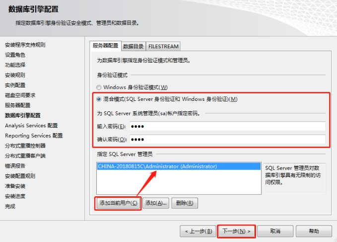

# 介绍

**数据库：**数据库是“按照数据结构来组织、存储和管理数据的仓库”。是一个长期存储在计算机内的、有组织的、可共享的、统一管理的大量数据的集合。

**应用场景：**在软件系统中无处不在，几乎所有的软件系统背后都有数据库，例如（淘宝，QQ，游戏等）。

**数据表展现形式：**


**主流关系型数据库：** SQL SERVER，MySQL，Oracle等。

**数据库的安装：（服务、管理工具）**

（1）在微软官网下载安装程序，https://www.microsoft.com/zh-cn/sql-server/sql-server-downloads

（2）百度搜索"I tell you"，或者访问 https://msdn.itellyou.cn/



**打开数据库：**

（1）启动服务：

​	【1】命令行启动；【2】SQL SERVER配置管理器；【3】Windows服务；

（2）打开SQL SERVER Management Studio，使用工具连接到数据库。

​	【1】Windows身份验证；	【2】SQL SERVER身份验证；

 **数据库基本操作：**

（1）建库。

（2）建表。

（3）数据维护。

**数据库的迁移：**

（1）数据库的分离、附加；（分离和删除的区别在于硬盘上是否还留存有数据库文件）

（2）数据库的备份，还原；

（3）数据库脚本的保存；

# 建库建表

## 一、检查数据库名是否存在

如果需要创建数据库，可能会出现数据库名字重名的现象，我们可以使用如下代码查询数据库名是否存在，存在则删除此数据库。

```sql
--删除数据库
if exists(select * from sys.databases where name = 'DBTEST')
	drop database DBTEST
```

此代码检查数据库中是否存在"DBTEST"数据库，如果存在则删除此数据库，此处理方式最好只在学习阶段使用，在正式生产环境中慎用，操作不当可能会删除重要数据。

## 二、创建数据库

```sql
--创建数据库
create database DBTEST
on  --数据文件
(
	name = 'DBTEST',   --逻辑名称
	filename = 'D:\Data\DBTEST.mdf',  -- 物理路径及名称
	size = 5MB,  -- 数据文件初始大小
	filegrowth = 2MB -- 数据文件增长速度,也可以使用百分比来设置
)
log on  --日志文件
(
	name = 'DBTEST_log', -- 逻辑名称
	filename = 'D:\Data\DBTEST_log.ldf', -- 物理路径及名称
	size = 5MB, -- 日志文件初始大小
	filegrowth = 2MB -- 日志文件增长速度,也可以使用百分比来设置
)
```

以上代码创建"DBTEST"数据库，并且分别使用on和log on规定了数据文件和日志文件的信息。

创建数据库也可以按照如下简单语法来创建：

```sql
create database DBTEST
```

如果按照上述方式创建数据库，数据库的数据文件和日志文件的相关信息，全部采取默认值。

## 三、建表

**使用数据库和删除数据表：**

```sql
use DBTEST  -- 切换当前数据库为DBTEST
-- 删除表(先判断表在当前数据库是否存在,存在则删除,其中type='U'判断对象类型为用户定义表类型)
if exists(select * from sys.objects where name = 'Department' and type = 'U')
	drop table Department
```

**创建数据表语法：**

```sql
create table 表名
(
	字段名1 数据类型(长度),
	字段名2 数据类型(长度)
)
```

其中数据类型，我们在后面用到什么类型，在介绍什么类型，有的类型可以不填写长度。

**创建数据表示例（部门表，职级表，员工信息表）：**

```sql
--创建部门表
create table Department -
(
	-- 创建部门编号;int代表整数类型;primary key代表主键;identity(1,1)代表从1开始步长为1自增长;
	DepartmentId int primary key identity(1,1),
	-- 创建部门名称;nvarchar(50)代表长度50的字符串;not null代表不能为空;
	DepartmentName nvarchar(50) not null,
	-- 创建部门描述；text代表长文本;
	DepartmentRemark text
)
```

**字符串类型比较：**

char：定长，例如 char(10)，不论你存储的数据是否达到了10个字节，都要占去10个字节的空间 。

varchar：变长，例如varchar(10)，并不代表一定占用10个字节，而代表最多占用10个字节。最大长度8000，也可以使用varchar(max)表示2G以内的数据，但存储机制会和text一样，效率会降低。

text：长文本， 最大长度为2^31-1(2,147,483,647)个字符 。

nchar,nvarchar,ntext：名字前面多了一个n， 它表示存储的是Unicode数据类型的字符，区别varchar(100)可以存储100个英文字母或者50个汉字，而nvarchar(100)可以存储100个英文字母，也可以存储100个汉字。

```sql
-- 创建职级表，rank为系统关键字，此处使用[]代表自定义名字，而非系统关键字，
-- 所以这句话的作用就是创建了一个名为[Rank]类型的表
create table [Rank]
(
	RankId int primary key identity(1,1),
	RankName nvarchar(50) not null,
	RankRemark text
)
```

```sql
--创建员工信息表
create table People
(
	PeopleId int primary key identity(1,1),
	-- references代表外键引用,此字段必须符合与其它表的外键约束
	DepartmentId int references Department(DepartmentId)  not null,
	RankId int references [Rank](RankId) not null,
	PeopleName nvarchar(50) not null,
	-- default代表字段默认值; check可以规定字段值的约束条件;
	PeopleSex nvarchar(1) default('男') check(PeopleSex='男' or PeopleSex='女') not null,
	PeopleBirth datetime not null,
	PeopleSalary decimal(12,2) check(PeopleSalary>= 1000 and PeopleSalary <= 100000) not null,
	-- unique代表唯一约束，为数据提供唯一性保证;
	PeoplePhone nvarchar(20) unique not null,
	PeopleAddress nvarchar(100),
	-- datetime和smalldatetime都可以表示时间类型，getdate()用于获取系统当前时间
	PeopleAddTime smalldatetime default(getdate())
)
```

# 修改表结构

 （1）如需在表中添加列，请使用下面的语法: 

```sql
ALTER TABLE table_name
ADD column_name datatype
```

例如该员工表添加一列员工邮箱：

```sql
alter table People
add PeopleMail nvarchar(100)
```

（2）如需在表中删除列，请使用下面的语法: 

```sql
ALTER TABLE table_name
DROP COLUMN column_name
```

例如删除员工表中的邮箱这一列

```sql
alter table People
drop column PeopleMail
```

（3）如需改变表中列的数据类型，请使用下列语法：

```sql
ALTER TABLE table_name
ALTER COLUMN column_name datatype
```

例如需要改变邮箱列的数据类型为varchar(100)

```sql
alter table People
alter column PeopleMail varchar(100)
```

## 五、删除添加约束

删除约束语法：

```sql
if exists(select * from sysobjects where name=约束名)
alter table 表名 drop constraint 约束名;
go
```

添加约束语法：

```sql
-- 添加主键约束
alter table 表名 add constraint 约束名称 primary key(列名)
-- 添加check约束
alter table 表名 add constraint 约束名称 check(条件表达式)
-- 添加unique约束
alter table 表名 add constraint 约束名称 unique(列名)
-- 添加default约束
alter table 表名 add constraint 约束名称 default 默认值 for 列名
-- 添加外键约束
alter table 表名 add constraint 约束名称 foreign key (列名) references 关联表名(关联表列名)
```

# 插入数据

## 一、向部门表插入数据

**标准语法：**

```sql
insert into Department(DepartmentName,DepartmentRemark)
values('软件部','......')
insert into Department(DepartmentName,DepartmentRemark)
values('硬件部','......')
insert into Department(DepartmentName,DepartmentRemark)
values('市场部','......')
```

**简写语法：（省略字段名称）**

```sql
insert into Department values('行政部','公司主管行政工作的部门')
```

此写法在给字段赋值的时候，必须保证顺序和数据表结构中字段顺序完全一致，不推荐使用此种写法，因为数据表结构变化的时候，数据会出错或产生错误数据。

**一次插入多行数据:**

```sql
insert into Department(DepartmentName,DepartmentRemark)
select '市场部','吹牛的部门' union
select '产品部','天马星空的部门' union
select '总经办','都是领导的部门' 
```

## 二、向职级表插入数据

```sql
insert into [Rank](RankName,RankRemark)
values('初级','辅助其他人完成任务')
insert into [Rank](RankName,RankRemark)
values('中级','具备独立处理事务的能力')
insert into [Rank](RankName,RankRemark)
values('高级','具备可以带动全场节奏的能力')
```

## 三、向员工表插入数据

```sql
insert into People(DepartmentId,RankId,PeopleName,PeopleSex,PeopleBirth,
PeopleSalary,PeoplePhone,PeopleAddress,PeopleAddTime)
values(1,3,'刘备','男','1984-7-9',20000,'13554785452','成都',getdate())

insert into People(DepartmentId,RankId,PeopleName,PeopleSex,PeopleBirth,
PeopleSalary,PeoplePhone,PeopleAddress,PeopleAddTime)
values(1,2,'孙尚香','女','1987-7-9',15000,'13256854578','荆州',getdate())

insert into People(DepartmentId,RankId,PeopleName,PeopleSex,PeopleBirth,
PeopleSalary,PeoplePhone,PeopleAddress,PeopleAddTime)
values(1,1,'关羽','男','1988-8-8',12000,'13985745871','荆州',getdate())

insert into People(DepartmentId,RankId,PeopleName,PeopleSex,PeopleBirth,
PeopleSalary,PeoplePhone,PeopleAddress,PeopleAddTime)
values(2,1,'张飞','男','1990-8-8',8000,'13535987412','宜昌',getdate())

insert into People(DepartmentId,RankId,PeopleName,PeopleSex,PeopleBirth,
PeopleSalary,PeoplePhone,PeopleAddress,PeopleAddTime)
values(2,3,'赵云','男','1989-4-8',9000,'13845789568','宜昌',getdate())

insert into People(DepartmentId,RankId,PeopleName,PeopleSex,PeopleBirth,
PeopleSalary,PeoplePhone,PeopleAddress,PeopleAddTime)
values(3,3,'马超','男','1995-4-8',9500,'13878562568','香港',getdate())

insert into People(DepartmentId,RankId,PeopleName,PeopleSex,PeopleBirth,
PeopleSalary,PeoplePhone,PeopleAddress,PeopleAddTime)
values(3,2,'黄盖','男','1989-4-20',8500,'13335457412','武汉',getdate())

insert into People(DepartmentId,RankId,PeopleName,PeopleSex,PeopleBirth,
PeopleSalary,PeoplePhone,PeopleAddress,PeopleAddTime)
values(3,1,'貂蝉','女','1989-4-20',6500,'13437100050','武汉',getdate())

insert into People(DepartmentId,RankId,PeopleName,PeopleSex,PeopleBirth,
PeopleSalary,PeoplePhone,PeopleAddress,PeopleAddTime)
values(2,2,'曹操','男','1987-12-20',25000,'13889562354','北京',getdate())

insert into People(DepartmentId,RankId,PeopleName,PeopleSex,PeopleBirth,
PeopleSalary,PeoplePhone,PeopleAddress,PeopleAddTime)
values(2,3,'许褚','男','1981-11-11',9000,'13385299632','北京',getdate())

insert into People(DepartmentId,RankId,PeopleName,PeopleSex,PeopleBirth,
PeopleSalary,PeoplePhone,PeopleAddress,PeopleAddTime)
values(2,1,'典韦','男','1978-1-13',8000,'13478545263','上海',getdate())

insert into People(DepartmentId,RankId,PeopleName,PeopleSex,PeopleBirth,
PeopleSalary,PeoplePhone,PeopleAddress,PeopleAddTime)
values(1,1,'曹仁','男','1998-12-12',7500,'13878523695','深圳',getdate())

insert into People(DepartmentId,RankId,PeopleName,PeopleSex,PeopleBirth,
PeopleSalary,PeoplePhone,PeopleAddress,PeopleAddTime)
values(1,3,'孙坚','男','1968-11-22',9000,'13698545841','广州',getdate())

insert into People(DepartmentId,RankId,PeopleName,PeopleSex,PeopleBirth,
PeopleSalary,PeoplePhone,PeopleAddress,PeopleAddTime)
values(3,3,'孙策','男','1988-1-22',11000,'13558745874','深圳',getdate())

insert into People(DepartmentId,RankId,PeopleName,PeopleSex,PeopleBirth,
PeopleSalary,PeoplePhone,PeopleAddress,PeopleAddTime)
values(3,2,'孙权','男','1990-2-21',12000,'13698745214','深圳',getdate())

insert into People(DepartmentId,RankId,PeopleName,PeopleSex,PeopleBirth,
PeopleSalary,PeoplePhone,PeopleAddress,PeopleAddTime)
values(3,2,'大乔','女','1995-2-21',13000,'13985478512','上海',getdate())

insert into People(DepartmentId,RankId,PeopleName,PeopleSex,PeopleBirth,
PeopleSalary,PeoplePhone,PeopleAddress,PeopleAddTime)
values(2,1,'小乔','女','1996-2-21',13500,'13778787874','北京',getdate())

insert into People(DepartmentId,RankId,PeopleName,PeopleSex,PeopleBirth,
PeopleSalary,PeoplePhone,PeopleAddress,PeopleAddTime)
values(1,2,'周瑜','男','1992-10-11',8000,'13987455214','武汉',getdate())

insert into People(DepartmentId,RankId,PeopleName,PeopleSex,PeopleBirth,
PeopleSalary,PeoplePhone,PeopleAddress,PeopleAddTime)
values(2,3,'鲁肃','男','1984-9-10',5500,'13254785965','成都',getdate())

insert into People(DepartmentId,RankId,PeopleName,PeopleSex,PeopleBirth,
PeopleSalary,PeoplePhone,PeopleAddress,PeopleAddTime)
values(3,3,'吕蒙','男','1987-5-19',8500,'13352197364','成都',getdate())

insert into People(DepartmentId,RankId,PeopleName,PeopleSex,PeopleBirth,
PeopleSalary,PeoplePhone,PeopleAddress,PeopleAddTime)
values(1,1,'陆逊','男','1996-5-19',7500,'13025457392','南京',getdate())

insert into People(DepartmentId,RankId,PeopleName,PeopleSex,PeopleBirth,
PeopleSalary,PeoplePhone,PeopleAddress,PeopleAddTime)
values(1,2,'太史慈','男','1983-6-1',7500,'13077778888','上海',getdate())
```

其中DepartmentId，RankId，PeopleSalary均为数字类型，在赋值的时候不需要添加单引号，而其它类型需要添加单引号。

## 四、查询数据是否插入成功 

```sql
select * from Department
select * from [Rank]
select * from People 
```

# 修改和删除数据

## 一、修改数据示例

工资普调，为每个员工+500 元工资（批量修改）

```sql
update People set PeopleSalary = PeopleSalary + 500
```

将员工编号为8的工资+1000 元（根据条件修改）

```sql
update People set PeopleSalary = PeopleSalary + 1000 WHERE PeopleId = 8
```

将软件部（部门编号已知=1）所有员工工资低于1万的全部调整成1 万（根据多条件修改）

```sql
update People set PEOPLESALARY = 10000 WHERE DepartmentId=1 and PEOPLESALARY < 10000
```

修改刘备工资为以前的2 倍，并且修改其地址为北京（同时修改多个字段）

```sql
UPDATE People SET PEOPLESALARY = PEOPLESALARY*2,PEOPLEADDRESS='北京' WHERE PEOPLENAME = '刘备'
```

## 二、删除数据示例

删除员工表中所有数据

```sql
DELETE FROM People
```

删除市场部(已知部门编号=3)中工资大于15000 的所有员工

```sql
DELETE FROM People WHERE DepartmentId = 3 and PEOPLESALARY > 15000
```

## 三、drop、truncate、delete区别

**drop table**:删除表对象，表数据、表结构、表对象都进行了删除。

**delete**和**truncate table**：删除表数据，表对象及表结构依然存在。

**delete与truncate table的区别如下：**

* **delete**：

（1）可以删除表所有数据，也可以根据条件删除数据。

（2）如果有自动编号，删除后继续编号，例如delete删除表所有数据后，之前数据的自动编号是1，2，3，那么之后新增数据的编号从4开始。

**truncate table**：

（1）只能清空整个表数据，不能根据条件删除数据。

（2）如果有自动编号，清空表数据后重新编号，例如truncate table清空表所有数据后，之前数据的自动编号是1，2，3，那么之后新增数据的编号仍然从1开始。

# 基础查询

（1）查询所有行所有列

```sql
--查询所有的部门
SELECT * FROM Department
--查询所有的职级
SELECT * FROM [Rank]
--查询所有的员工信息
SELECT * FROM People
```

（2）指定列查询（姓名，性别，月薪，电话）

```sql
SELECT PeopleName,PeopleSex,PeopleSalary,PeoplePhone from People
```

（3）指定列查询,并自定义中文列名（姓名，性别，月薪，电话）

```sql
SELECT PeopleName 姓名,PeopleSex 性别,PeopleSalary 工资,PeoplePhone 电话 from People
```

（4）查询公司员工所在城市（不需要重复数据）

```sql
select distinct PeopleAddress from People
```

（5）假设工资普调10%，查询原始工资和调整后的工资，显示（姓名，性别，月薪，加薪后的月薪）（添加列查询）。

```sql
SELECT PeopleName 姓名,PeopleSex 性别,PeopleSalary 月薪,PeopleSalary*1.1 加薪后月薪 from People
```

# 条件查询

**SQL中常用运算符**

```sql
=：等于，比较是否相等及赋值
!=：比较不等于
>：比较大于
<：比较小于
>=：比较大于等于
<=：比较小于等于
IS NULL：比较为空
IS NOT NULL：比较不为空
in：比较是否在其中
like：模糊查询
BETWEEN...AND...：比较是否在两者之间
and：逻辑与（两个条件同时成立表达式成立）
or：逻辑或（两个条件有一个成立表达式成立） 
not：逻辑非（条件成立，表达式则不成立；条件不成立，表达式则成立）
```

**查询示例：**

（1）根据指定列（姓名，性别，月薪，电话）查询性别为女的员工信息,并自定义中文列名

```sql
SELECT PeopleName 姓名,PeopleSex 性别,PeopleSalary 工资,PeoplePhone 电话 from People
WHERE PEOPLESEX = '女'
```

（2）查询月薪大于等于10000 的员工信息( 单条件 )

```sql
select * from People where PeopleSalary >= 10000 
```

（3）查询月薪大于等于10000 的女员工信息(多条件)

```sql
select * from People where PeopleSalary >= 10000 and PeopleSex = '女'
```

（4）显示出出身年月在1980-1-1之后，而且月薪大于等于10000的女员工信息。

```sql
select * from People where PeopleBirth >= '1980-1-1' and PeopleSalary >= 10000 and PeopleSex = '女'
```

（5）显示出月薪大于等于15000 的员工,或者月薪大于等于8000的女员工信息。

```sql
select * from People where PeopleSalary >= 15000 or (PeopleSalary >= 8000 and PeoPleSex = '女')
```

（6）查询月薪在10000-20000 之间员工信息( 多条件 )

```sql
--方案一：
select * from People where PeopleSalary >= 10000 and PeopleSalary <= 20000
--方案二：
select * from People where PeopleSalary  between 10000 and 20000
```

（7）查询出地址在北京或者上海的员工信息

```sql
--方案一：
select * from People where PeopleAddress = '北京' or PeopleAddress = '上海'
--方案二：
select * from People where PeopleAddress in('北京','上海')
```

（8）查询所有员工信息(根据工资排序，降序排列)

```sql
--order by: 排序  asc: 正序  desc: 倒序
select * from People order by PeopleSalary desc
```

（9）显示所有的员工信息，按照名字的长度进行倒序排列

```sql
select * from People order by len(PeopleName) desc
```

（10）查询工资最高的5个人的信息

```sql
select top 5 * from People order by PeopleSalary desc
```

（11）查询工资最高的10%的员工信息

```sql
select top 10 percent * from People order by PeopleSalary desc
```

（12）查询出地址没有填写的员工信息

```sql
select * from People where PeopleAddress is null
```

（13）查询出地址已经填写的员工信息

```sql
select * from People where PeopleAddress is not null
```

（14）查询所有的80后员工信息

```sql
--方案一：
select * from People where PeopleBirth >= '1980-1-1' and PeopleBirth <= '1989-12-31'
--方案二：
select * from People where PeopleBirth between '1980-1-1' and '1989-12-31'
--方案三：
select * from People where year(PeopleBirth) >= 1980 and year(PeopleBirth) <= 1989
```

（15）查询年龄在30-40 之间，并且工资在15000-30000 之间的员工信息

```sql
--方案一：
select * from People where
(year(getdate())-year(PeopleBirth) >= 30 and year(getdate())-year(PeopleBirth) <= 40) and
(PeopleSalary >= 15000 and PeopleSalary <= 30000)
--方案二：
select * from People where
(year(getdate())-year(PeopleBirth) between 30 and 40)
and PeopleSalary between 15000 and 30000
```

（16）查询出巨蟹 6.22--7.22 的员工信息

```sql
select * from People where 
(month(PeopleBirth) = 6 and DAY(PeopleBirth) >= 22) or
(month(PeopleBirth) = 7 and DAY(PeopleBirth) <= 22)
```

（17）查询工资比赵云高的人

```sql
select * from People where PeopleSalary > 
(select PeopleSalary from People where PEOPLENAME = '赵云')
```

（18）查询出和赵云在同一个城市的人

```sql
select * from People where PEOPLEADDRESS = 
(select PEOPLEADDRESS from People where PEOPLENAME = '赵云')
```

（19）查询出生肖为鼠的人员信息

```sql
select * from People where year(PeopleBirth) % 12 = 4
```

（20）查询所有员工信息，添加一列显示属相(鼠,牛,虎,兔,龙,蛇,马,羊,猴,鸡,狗,猪)

```sql
--方案一：
select PeopleName 姓名,PeopleSex 性别,PeopleSalary 工资,PeoplePhone 电话,PEOPLEBIRTH 生日,
case
	when year(PeopleBirth) % 12 = 4 then '鼠'
	when year(PeopleBirth) % 12 = 5 then '牛'
	when year(PeopleBirth) % 12 = 6 then '虎'
	when year(PeopleBirth) % 12 = 7 then '兔'
	when year(PeopleBirth) % 12 = 8 then '龙'
	when year(PeopleBirth) % 12 = 9 then '蛇'
	when year(PeopleBirth) % 12 = 10 then '马'
	when year(PeopleBirth) % 12 = 11 then '羊'
	when year(PeopleBirth) % 12 = 0 then '猴'
	when year(PeopleBirth) % 12 = 1 then '鸡'
	when year(PeopleBirth) % 12 = 2 then '狗'
	when year(PeopleBirth) % 12 = 3 then '猪'
	ELSE ''
end 生肖
from People

--方案二：
select PeopleName 姓名,PeopleSex 性别,PeopleSalary 工资,PeoplePhone 电话,PEOPLEBIRTH 生日,
case year(PeopleBirth) % 12
	when 4 then '鼠'
	when 5 then '牛'
	when 6 then '虎'
	when 7 then '兔'
	when 8 then '龙'
	when 9 then '蛇'
	when 10 then '马'
	when 11 then '羊'
	when 0 then '猴'
	when 1 then '鸡'
	when 2 then '狗'
	when 3 then '猪'
	ELSE ''
end 生肖
from People
```

# 模糊查询

模糊查询使用like关键字和通配符结合来实现，通配符具体含义如下：

```sql
%：代表匹配0个字符、1个字符或多个字符。
_：代表匹配有且只有1个字符。
[]：代表匹配范围内
[^]：代表匹配不在范围内
```

（1）查询姓刘的员工信息

```sql
select * from People  where PeopleName like '刘%'
```

（2）查询名字中含有 " 尚 " 的员工信息

```sql
select * from People  where PeopleName like '%尚%'
```

（3）显示名字中含有“尚”或者“史”的员工信息

```sql
select * from People  where PeopleName like '%尚%' or PeopleName like '%史%'
```

（4）查询姓刘的员工，名字是2个字

```sql
--方案一：
select * from People  where PeopleName like '刘_'
--方案二：
select * from People where SUBSTRING(PeopleName,1,1) = '刘' and LEN(PeopleName) = 2
```

（5）查询出名字最后一个字是香，名字一共三个字的员工信息

```sql
--方案一：
select * from People  where PeopleName like '__香'
--方案二：
select * from People where SUBSTRING(PeopleName,3,1) = '香' and LEN(PeopleName) = 3
```

（6）查询出电话号码开头138的员工信息

```sql
select * from People  where PeoplePhone like '138%'
```

（7）查询出电话号码开头138的员工信息,第4位可能是7，可能8 ，最后一个号码是5

```sql
select * from People where PeoplePhone like '138[7,8]%5'
```

（8）查询出电话号码开头133的员工信息,第4位是2-5之间的数字 ，最后一个号码不是2和3

```sql
--方案一：
select * from People where PeoplePhone like '133[2,3,4,5]%[^2,3]'
--方案二：
select * from People where PeoplePhone like '133[2-5]%[^2-3]'
```

# 聚合函数

SQL SERVER中聚合函数主要有：

```sql
-- 不能用在wherec处
-- where子句用于在数据分组前筛选行，而聚合函数是对分组后的数据集进行计算，两者执行时机不同。例如，where avg(salary) > 5000是错误的，需用having替代。
count:求数量
max:求最大值
min:求最小值
sum:求和
avg:求平均值
```

## 一、聚合函数举例应用

（1）求员工总人数

```sql
select COUNT(*) 数量 from People
```

（2）求最大值，求最高工资

```sql
select MAX(PeopleSalary) 最高工资 from People
```

（3）求最小时，求最小工资

```sql
select MIN(PeopleSalary) 最低工资 from People
```

（4）求和，求所有员工的工资总和

```sql
select SUM(PeopleSalary) 工资总和 from People
```

（5）求平均值，求所有员工的平均工资

```sql
--方案一：
select AVG(PeopleSalary) 平均工资 from People
--方案二：精确到2位小数
select ROUND(AVG(PeopleSalary),2)  平均工资 from People
--方案三：精确到2位小数
select Convert(decimal(12,2),AVG(PeopleSalary))  平均工资 from People
```

ROUND函数用法：

```sql
round(num,len,[type])
其中:
num表示需要处理的数字，len表示需要保留的长度，type处理类型(0是默认值代表四舍五入，非0代表直接截取)
select ROUND(123.45454,3)  --123.45500
select ROUND(123.45454,3,1) --123.45400
```

（6）求数量，最大值，最小值，总和，平均值，在一行显示

```sql
select COUNT(*) 数量,MAX(PeopleSalary) 最高工资,MIN(PeopleSalary) 最低工资,SUM(PeopleSalary) 工资总和,AVG(PeopleSalary) 平均工资 from People
```

（7）查询出武汉地区的员工人数，总工资，最高工资，最低工资和平均工资

```sql
select '武汉' 地区,COUNT(*) 数量,MAX(PeopleSalary) 最高工资,MIN(PeopleSalary) 最低工资
,SUM(PeopleSalary) 工资总和,AVG(PeopleSalary) 平均工资 from People 
WHERE PEOPLEADDRESS = '武汉'
```

（8）求出工资比平均工资高的人员信息

```sql
select * from People where PeopleSalary > (select AVG(PeopleSalary) 平均工资 from People)
```

（9）求数量，年龄最大值，年龄最小值，年龄总和，年龄平均值，在一行显示

```sql
-- 方案一：
select COUNT(*) 数量,
MAX(year(getdate())-year(PeopleBirth)) 最高年龄,
MIN(year(getdate())-year(PeopleBirth)) 最低年龄,
SUM(year(getdate())-year(PeopleBirth)) 年龄总和,
AVG(year(getdate())-year(PeopleBirth)) 平均年龄 
from People
-- 方案二：
select COUNT(*) 数量,
MAX(DATEDIFF(year, PeopleBirth, getDate())) 最高年龄,
MIN(DATEDIFF(year, PeopleBirth, getDate())) 最低年龄,
SUM(DATEDIFF(year, PeopleBirth, getDate())) 年龄总和,
AVG(DATEDIFF(year, PeopleBirth, getDate())) 平均年龄 
from People
```

（10）计算出月薪在10000 以上的男性员工的最大年龄，最小年龄和平均年龄

```sql
-- 方案一：
select '男' 性别,COUNT(*) 数量,
MAX(year(getdate())-year(PeopleBirth)) 最高年龄,
MIN(year(getdate())-year(PeopleBirth)) 最低年龄,
SUM(year(getdate())-year(PeopleBirth)) 年龄总和,
AVG(year(getdate())-year(PeopleBirth)) 平均年龄 
from People where PeopleSex = '男' and PeopleSalary >= 10000
-- 方案二：
select '男' 性别,COUNT(*) 数量,
MAX(DATEDIFF(year, PeopleBirth, getDate())) 最高年龄,
MIN(DATEDIFF(year, PeopleBirth, getDate())) 最低年龄,
SUM(DATEDIFF(year, PeopleBirth, getDate())) 年龄总和,
AVG(DATEDIFF(year, PeopleBirth, getDate())) 平均年龄 
from People where PeopleSex = '男' and PeopleSalary >= 10000
```

（11）统计出所在地在“武汉或上海”的所有女员工数量以及最大年龄，最小年龄和平均年龄

```sql
-- 方案一：
select '武汉或上海' 地区,'女' 性别,COUNT(*) 数量,
MAX(year(getdate())-year(PeopleBirth)) 最高年龄,
MIN(year(getdate())-year(PeopleBirth)) 最低年龄,
SUM(year(getdate())-year(PeopleBirth)) 年龄总和,
AVG(year(getdate())-year(PeopleBirth)) 平均年龄  
from People where PeopleSex = '女' and PeopleAddress in('武汉','上海')
-- 方案二：
select '武汉或上海' 地区,'女' 性别,COUNT(*) 数量,
MAX(DATEDIFF(year, PeopleBirth, getDate())) 最高年龄,
MIN(DATEDIFF(year, PeopleBirth, getDate())) 最低年龄,
SUM(DATEDIFF(year, PeopleBirth, getDate())) 年龄总和,
AVG(DATEDIFF(year, PeopleBirth, getDate())) 平均年龄  
from People where PeopleSex = '女' and PeopleAddress in('武汉','上海')
```

（12）求出年龄比平均年龄高的人员信息

```sql
-- 方案一：
select * from People where 
year(getdate())-year(PeopleBirth) > 
(select AVG(year(getdate())-year(PeopleBirth)) 
from People)
-- 方案二：
select * from People where 
DATEDIFF(year, PeopleBirth, getDate()) > 
(select AVG(DATEDIFF(year, PeopleBirth, getDate())) 
from People)
```

## 二、补充-SQL中常用时间处理函数

* **GETDATE()**：返回当前的日期和时间

```sql
SELECT GETDATE(); -- 输出：2024-07-25 15:30:45.123
```

* **DATEPART()** ：从日期 / 时间中提取指定的部分（如年、月、日、小时等），返回整数

```sql
SELECT DATEPART(year, '2024-07-25') AS 年份; -- 输出：2024
SELECT DATEPART(mm, GETDATE()) AS 月份; -- 输出：7（当前月份）
SELECT DATEPART(dd, '2024-07-25 15:30:00') AS 日期; -- 输出：25
```


* **DATEADD()** ：返回日期中添加或减去指定的时间间隔

```sql
-- 当前日期加3天
SELECT DATEADD(day, 3, GETDATE()) AS 三天后; 
-- 2024-07-25 15:30:00 减2小时
SELECT DATEADD(hour, -2, '2024-07-25 15:30:00') AS 两小时前; -- 输出：2024-07-25 13:30:00
-- 加1个月
SELECT DATEADD(month, 1, '2024-07-25') AS 一个月后; -- 输出：2024-08-25 00:00:00
```


* **DATEDIFF()** ：返回两个日期直接的时间

```sql
-- 两个日期相差的天数
SELECT DATEDIFF(day, '2024-07-20', '2024-07-25') AS 相差天数; -- 输出：5
-- 相差的小时数
SELECT DATEDIFF(hour, '2024-07-25 10:00', '2024-07-25 15:30') AS 相差小时; -- 输出：5
-- 结束日期在起始日期之前，返回负数
SELECT DATEDIFF(month, '2024-08-01', '2024-07-01') AS 相差月份; -- 输出：-1
```


* **DATENAME()**： 返回指定日期的指定日期部分的整数

```sql
-- 返回月份名称（英文环境下）
SELECT DATENAME(month, '2024-07-25') AS 月份名称; -- 输出：July
-- 返回星期几（英文环境下）
SELECT DATENAME(weekday, '2024-07-25') AS 星期几; -- 输出：Thursday（假设2024-07-25是周四）
-- 返回季度（字符串形式）
SELECT DATENAME(quarter, '2024-07-25') AS 季度; -- 输出：3
```


* **CONVERT()**：  返回不同格式的时间

```sql
-- 转换为 'yyyy-mm-dd' 格式
SELECT CONVERT(varchar(10), GETDATE(), 23) AS 日期; -- 输出：2024-07-25
-- 转换为带时间的格式
SELECT CONVERT(varchar(20), GETDATE(), 120) AS 日期时间; -- 输出：2024-07-25 15:30:45
-- 仅显示时间
SELECT CONVERT(varchar(8), GETDATE(), 108) AS 时间; -- 输出：15:30:45
```


**示例：**

```
select DATEDIFF(day, '2019-08-20', getDate());    --获取指定时间单位的差值
SELECT DATEADD(MINUTE,-5,GETDATE())               --加减时间,此处为获取五分钟前的时间,MINUTE 表示分钟，可为 YEAR,MONTH,DAY,HOUR
select DATENAME(month, getDate());                --当前月份
select DATENAME(WEEKDAY, getDate());              --当前星期几
select DATEPART(month, getDate());                --当前月份
select DAY(getDate());                            --返回当前日期天数
select MONTH(getDate());                          --返回当前日期月数
select YEAR(getDate());                           --返回当前日期年数

SELECT CONVERT(VARCHAR(22),GETDATE(),20)          --2020-01-09 14:46:46
SELECT CONVERT(VARCHAR(24),GETDATE(),21)          --2020-01-09 14:46:55.91
SELECT CONVERT(VARCHAR(22),GETDATE(),23)		  --2020-01-09
SELECT CONVERT(VARCHAR(22),GETDATE(),24)          --15:04:07
Select CONVERT(varchar(20),GETDATE(),14)          --15:05:49:330
```

**时间格式控制字符串：**

| 名称         | 日期单位    | 缩写      |
| ------------ | ----------- | --------- |
| 年           | year        | yyyy 或yy |
| 季度         | quarter     | qq,q      |
| 月           | month       | mm,m      |
| 一年中第几天 | dayofyear   | dy,y      |
| 日           | day         | dd,d      |
| 一年中第几周 | week        | wk,ww     |
| 星期         | weekday     | dw        |
| 小时         | Hour        | hh        |
| 分钟         | minute      | mi,n      |
| 秒           | second      | ss,s      |
| 毫秒         | millisecond | ms        |

# 关键字

* **ALTER PROCEDURE**: 修改已存在的存储过程

```sql
ALTER PROCEDURE [dbo].[PreGroup_GetPatientRY]` 表示要修改名为 `PreGroup_GetPatientRY` 的存储过程（属于 `dbo` 架构）

当存储过程已经存在时，使用 `ALTER PROCEDURE` 可以更新其定义（包括参数、SQL 逻辑等）

如果该存储过程不存在，执行此语句会报错（此时应使用 `CREATE PROCEDURE` 来创建新的存储过程）
```

* **AS**: 用于分隔定义与实现，明确标识 “声明部分” 与 “执行逻辑部分” 的边界

```sql
ALTER PROCEDURE [dbo].[PreGroup_GetPatientRY]
    -- 参数列表
AS
BEGIN
    -- 存储过程的执行逻辑
END
```

* **BEGIN**: 主要作用是定义代码块的开始，通常与 `END` 配合使用，用于将一组 SQL 语句组合成一个逻辑单元。

```sql
IF @IsSpecial=1
BEGIN
  -- 特殊用户的处理逻辑
END;
ELSE
BEGIN
  -- 普通用户的处理逻辑
END
```

**示例**

```sql
ALTER FUNCTION  [dbo].[Get_术种全院例次]
(	
	-- Add the parameters for the function here
	@出院起始日期 date,
	@出院结束日期 date
)
RETURNS TABLE 
AS
RETURN 
(
	SELECT 手术编码,SUM(例次) as 例次 from [dbo].[本院_手术例次月分布] 
	WHERE 年=YEAR(@出院起始日期) AND 月 BETWEEN MONTH(@出院起始日期) AND MONTH(@出院结束日期)
	GROUP BY 手术编码
)


ALTER FUNCTION [dbo].[Get_医院术种排名]
(	
	-- Add the parameters for the function here
	@出院起始日期 Datetime,
	@出院结束日期 date
)
RETURNS TABLE 
AS
RETURN 
(
	SELECT  手术编码,医院名称, SUM(例次) as 例次, RANK() OVER( partition BY 手术编码 ORDER BY SUM(例次) DESC,医院名称) AS 排名 	
	FROM 优劣势对比_术种例次
	WHERE 年=YEAR(@出院起始日期) AND 月 BETWEEN MONTH(@出院起始日期) AND MONTH(@出院结束日期)
	GROUP BY 手术编码,医院名称
)

ALTER FUNCTION [dbo].[Get_病种全院人次量]
(	
	-- Add the parameters for the function here
	@出院起始日期 Datetime,
	@出院结束日期 date
)
RETURNS TABLE 
AS
RETURN 
(
	SELECT 病种名称, SUM(CMI * 全院人次量)/NULLIF(sum(全院人次量),0) AS CMI, SUM(全院人次量) as 全院人次量  from [dbo].[本院_病种月分布] 
	WHERE convert ( datetime , convert ( varchar ,   年)+'-'+convert ( varchar , 月)+'-1'  ) between  @出院起始日期 and @出院结束日期
	group by 病种名称
)

ALTER FUNCTION [dbo].[Get_医院病种排名]
(	
	-- Add the parameters for the function here
	@出院起始日期 Datetime,
	@出院结束日期 date
)
RETURNS TABLE 
AS
RETURN 
(
	SELECT  病种名称,医院名称 , 人次量,排名  FROM (

	SELECT  病种名称,医院名称, SUM(人次量) as 人次量, row_number() OVER( partition BY 病种名称 ORDER BY SUM(人次量) DESC) AS 排名 	
	FROM 优劣势对比_病种人次
	WHERE convert ( datetime , convert ( varchar ,   年)+'-'+convert ( varchar , 月)+'-1'  ) between  @出院起始日期 and @出院结束日期
	group by 病种名称,医院名称
	
	
	) A 
)


```

