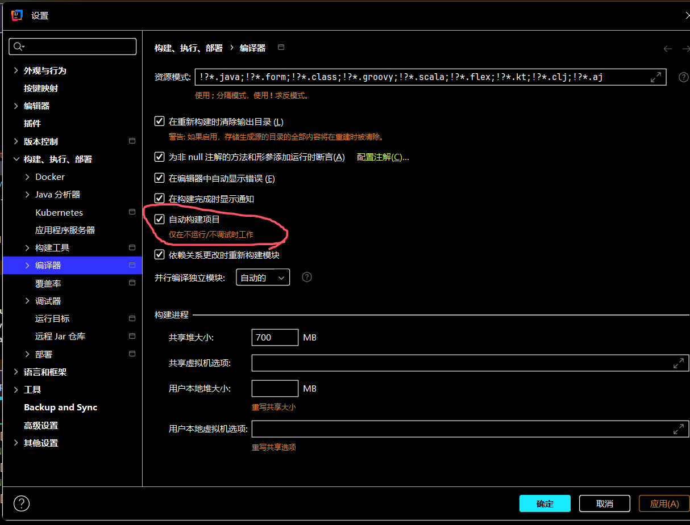
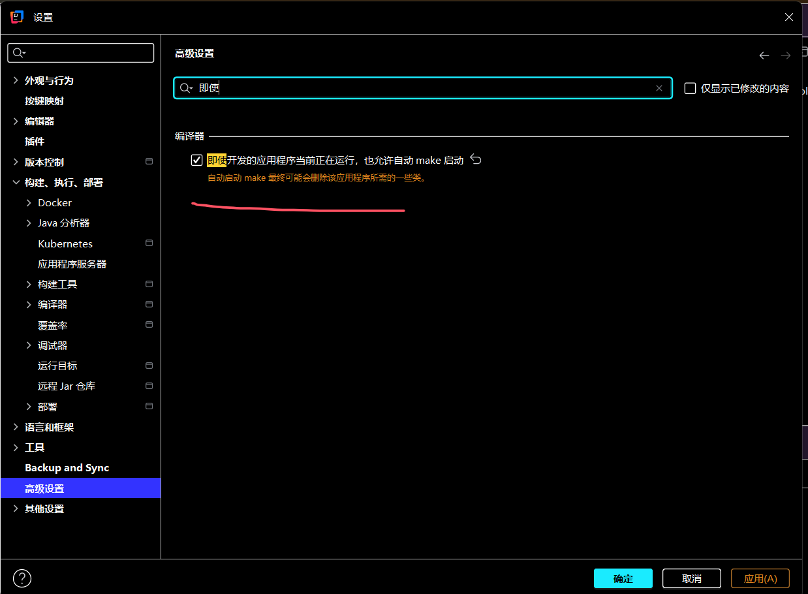
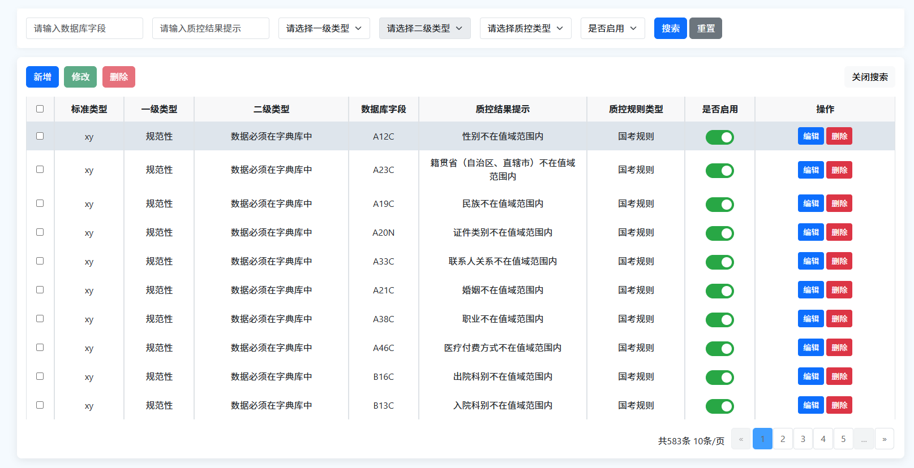
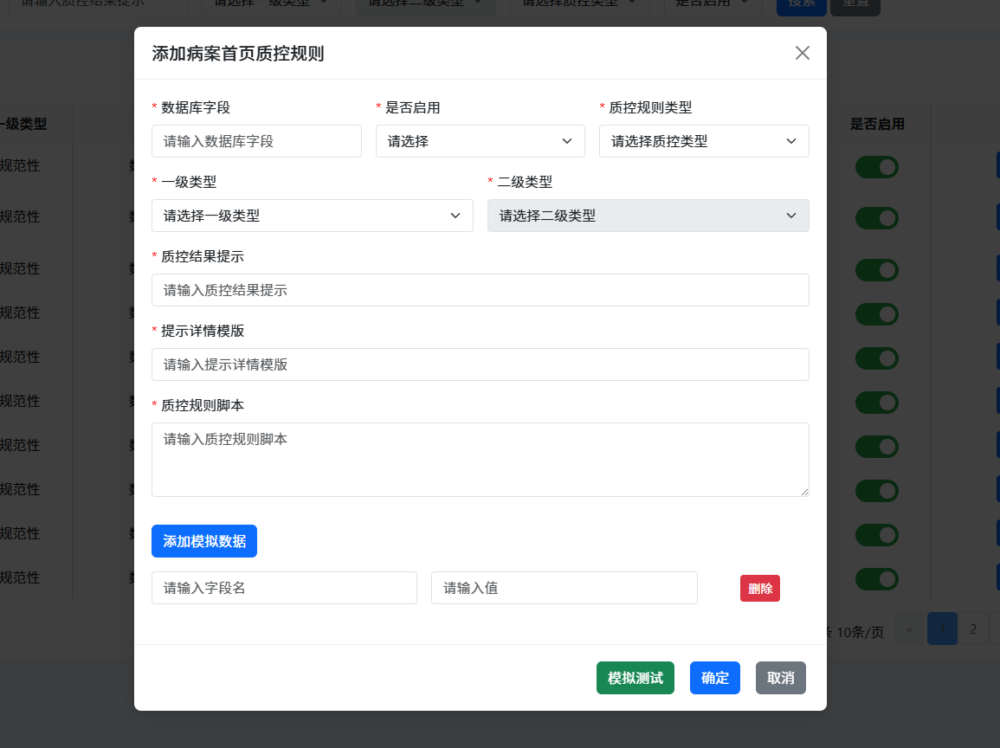

# 热部署

添加此配置文件取消thymeleaf缓存

```yml
spring:
  thymeleaf:
    prefix: classpath:/static/templates
    suffix: .html
    cache: false
    mode: HTML5
```





# 访问页面

```java
@GetMapping("/ZhiKongGuiZe")
    public String initZhiKongGuiZeList(@RequestParam(name = "biaoZhunLeiXing")
                                       @NotBlank(message = "标准类型不能为空") String biaoZhunLeiXing, Model model) {
        BaseZhiKongGuiZeBo baseZhiKongGuiZeBo = new BaseZhiKongGuiZeBo();
        baseZhiKongGuiZeBo.setBiaoZhunLeiXing(biaoZhunLeiXing);
        IPage<BaseZhiKongGuiZeVo> data = ruleEngineService.getZhiKongGuiZeList(baseZhiKongGuiZeBo);
        List<String> zhiKongGuiZeList = ruleEngineService.getZhiKongLeiXing(baseZhiKongGuiZeBo);
        model.addAttribute("pageNum", data.getCurrent());
        model.addAttribute("pageSize", data.getSize());
        model.addAttribute("total", data.getTotal());
        model.addAttribute("tableData", data.getRecords());
        model.addAttribute("zhiKongGuiZeList", zhiKongGuiZeList);
        return "/ZhiKongGuiZe";
    }
```

上述方法中的返回值即为请求此方法需要调整到的页面。页面路径为：

```plain
localhost:port + 配置文件中的prefix + /ZhiKongGuiZe + 配置文件中的html
```

上述方法传入了ruleEngineList参数，在 **Html**上使用的方法为：

```html
<tr th:each="data : ${tableData}">
    <td th:text="${data.biaoZhunLeiXing}"></td>
    <td th:text="${data.yiJiLeiXing}"></td>
    <td th:text="${data.erJiLeiXing}"></td>
    <td th:text="${data.shuJuKuZiDuan}"></td>
    <td th:text="${data.zhiKongJieGuoTiShi}"></td>
    <td th:text="${data.zhiKongLeiXing}"></td>
</tr>
```

在 **Script**上使用的方法为

```javascript
<script th:inline="javascript">
    let pageNum = /*[[${pageNum}]]*/ 1;
    let pageSize = /*[[${pageSize}]]*/ 10;
    let total = /*[[${total}]]*/ 0;
</script>
```

# 从 Html 中向 Script 传入数据

**传入数据：row**

```html
<input class="form-check-input custom-switch"
       type="checkbox"
       role="switch"
       th:id="'switch_' + ${data.id}"
       th:data-row='${data}'
       th:checked="${data.shiFouQiYong == 1}"
       onchange="tableShiFouQiYong(this)"/>
```

**接收数据**

```javascript
function tableShiFouQiYong(element) {
        const data = parseBaseZhiKongGuiZeVo(element.dataset.row);
}
```

**解析数据**

```javascript
// 后端传来的代码可能存在BaseZhiKongGuiZeVo。因此需要解析
function parseBaseZhiKongGuiZeVo(str) {
    // 移除开头的类名和首尾括号
    const content = str.replace(/^BaseZhiKongGuiZeVo\(/, '').replace(/\)$/, '');

    // 正则表达式：匹配属性名=属性值（支持多行、特殊字符，属性间用逗号分隔）
    // 说明：
    // (\w+)：匹配属性名（字母、数字、下划线）
    // =：匹配等号
    // ((?:[\s\S]*?))：匹配属性值（非贪婪模式，包含所有字符，直到遇到下一个"属性名="或结束）
    // (?=,\s*\w+=|$)：断言后面是"逗号+属性名="或字符串结束（确保属性值完整）
    const regex = /(\w+)=((?:[\s\S]*?))(?=,\s*\w+=|$)/g;

    const result = {};
    let match;

    // 循环匹配所有属性
    while ((match = regex.exec(content)) !== null) {
        const key = match[1].trim();
        let value = match[2].trim();

        // 处理可能的引号（如果值被单/双引号包裹，移除引号）
        if ((value.startsWith("'") && value.endsWith("'")) || (value.startsWith('"') && value.endsWith('"'))) {
            value = value.slice(1, -1);
        }

        result[key] = value;
    }

    return result;
}
```

# 完整代码

## 效果





## 后端代码

```java
package org.yunshu.basedata.controller;

import com.baomidou.mybatisplus.core.metadata.IPage;
import jakarta.annotation.Resource;
import jakarta.validation.Valid;
import jakarta.validation.constraints.NotBlank;
import jakarta.validation.constraints.NotEmpty;
import org.springframework.stereotype.Controller;
import org.springframework.ui.Model;
import org.springframework.validation.annotation.Validated;
import org.springframework.web.bind.annotation.*;
import org.yunshu.basedata.domain.bo.BaseZhiKongGuiZeBo;
import org.yunshu.basedata.domain.bo.TestQianZhiTiaoJianBo;
import org.yunshu.basedata.domain.vo.BaseZhiKongGuiZeVo;
import org.yunshu.basedata.domain.vo.DictTreeNodeVo;
import org.yunshu.basedata.service.IZhiKongRuleService;
import org.yunshu.common.core.domain.R;
import org.yunshu.common.core.validate.EditGroup;
import org.yunshu.common.core.validate.QueryGroup;

import java.util.List;

/**
 * @Author: 吴思豪
 * @CreateTime: 2025-08-13
 * @Description: 质控规则
 */
@Validated
@Controller
@RequestMapping("/RuleEngine/ZhiKongGuiZe")
public class ZhiKongRuleContoller {

    @Resource
    private IZhiKongRuleService zhiKongRuleService;

    /**
     * @Auther: wusihao
     * @Date: 2025/8/8 09:55
     * @Description: 得到质控规则列表
     */
    @GetMapping
    public String initZhiKongGuiZeList(@RequestParam(name = "biaoZhunLeiXing")
                                       @NotBlank(message = "标准类型不能为空") String biaoZhunLeiXing, Model model) {
        BaseZhiKongGuiZeBo baseZhiKongGuiZeBo = new BaseZhiKongGuiZeBo();
        baseZhiKongGuiZeBo.setBiaoZhunLeiXing(biaoZhunLeiXing);
        IPage<BaseZhiKongGuiZeVo> data = zhiKongRuleService.getZhiKongGuiZeList(baseZhiKongGuiZeBo);
        List<DictTreeNodeVo> sysDictDataVoList = zhiKongRuleService.getOneAndTwoLevelDictData();
        List<String> zhiKongGuiZeLeiXingList = zhiKongRuleService.getZhiKongGuiZeLeiXing();
        model.addAttribute("pageNum", data.getCurrent());
        model.addAttribute("pageSize", data.getSize());
        model.addAttribute("total", data.getTotal());
        model.addAttribute("tableData", data.getRecords());
        model.addAttribute("zhiKongGuiZeList", zhiKongGuiZeLeiXingList);
        model.addAttribute("oneLevelAndTowLevel", sysDictDataVoList);
        return "/ZhiKongGuiZe";
    }

    /**
     * @Auther: wusihao
     * @Date: 2025/8/8 09:55
     * @Description: 得到质控规则列表
     */
    @Validated(QueryGroup.class)
    @PostMapping
    public String getZhiKongGuiZeList(@RequestBody BaseZhiKongGuiZeBo bo, Model model) {
        IPage<BaseZhiKongGuiZeVo> data = zhiKongRuleService.getZhiKongGuiZeList(bo);
        model.addAttribute("pageNum", data.getCurrent());
        model.addAttribute("pageSize", data.getSize());
        model.addAttribute("total", data.getTotal());
        model.addAttribute("tableData", data.getRecords());
        return "/ZhiKongGuiZe";
    }


    /**
     * @Auther: wusihao
     * @Date: 2025/8/11 11:50
     * @Description: 修改质控规则列表
     */
    @PutMapping("/update")
    @ResponseBody
    public R<Void> updateZhiKongGuiZeList(@RequestBody @Validated(EditGroup.class) BaseZhiKongGuiZeBo bo) {
        zhiKongRuleService.updateZhiKongGuiZeList(bo);
        return R.ok();
    }

    /**
     * @Auther: wusihao
     * @Date: 2025/8/11 15:50
     * @Description: 模拟测试接口
     */
    @PostMapping("/test")
    @ResponseBody
    public R<Object> test(@RequestBody TestQianZhiTiaoJianBo bo) {
        Object b = zhiKongRuleService.testQianZhiTiaoJian(bo);
        return R.ok(b);
    }

    /**
     * @Auther: wusihao
     * @Date: 2025/8/12 10:31
     * @Description: 添加质控规则
     */
    @PostMapping("/add")
    @ResponseBody
    public R addZhiKongGuiZeList(@RequestBody @Valid BaseZhiKongGuiZeBo bo) {
        Boolean flag = zhiKongRuleService.addZhiKongGuiZeList(bo);
        return flag? R.ok() : R.fail();
    }

    /**
     * @Auther: wusihao
     * @Date: 2025/8/12 11:29
     * @Description: 删除质控规则
     */
    @DeleteMapping("/delete/{ids}")
    @ResponseBody
    public R deleteZhiKongGuiZeList(@NotEmpty(message = "主键不能为空") @PathVariable List<Long> ids) {
        Boolean flag = zhiKongRuleService.deleteZhiKongGuiZeList(ids);
        return flag? R.ok() : R.fail();
    }

    /**
     * @Auther: wusihao
     * @Date: 2025/8/13 10:36
     * @Description: 删除质控规则加密后的数据, 替换为未加密的数据
     */
    @GetMapping("/deleteEncryptData")
    @ResponseBody
    public R deleteEncryptData() {
        Boolean flag = zhiKongRuleService.deleteEncryptData();
        return flag? R.ok() : R.fail();
    }
}

```

前端代码

```html
<!DOCTYPE html>
<html xmlns:th="http://www.thymeleaf.org">
<head>
    <title>质控规则</title>
    <link th:href="@{/css/bootstrap.min.css}" rel="stylesheet">
    <script th:src="@{/js/bootstrap.bundle.min.js}"></script>
    <style>
        /* 基础样式设置 */
        html, body {
            height: 100%;
            margin: 0;
            padding: 0;
            background-color: #F5FAFE;
            font-family: 'Segoe UI', Tahoma, Geneva, Verdana, sans-serif;
        }

        /* 主容器样式 */
        .main {
            margin: 0 auto;
            padding: 16px;
            width: 98%;
            max-width: 1600px;
        }

        /* 表格和卡片样式 */
        .tableHeader {
            background-color: #f8f8f9;
            font-weight: 600;
        }

        .header {
            background-color: #fff;
        }

        a {
            text-decoration: none;
            transition: all 0.2s ease;
        }

        .card {
            border: none;
            border-radius: 8px;
            box-shadow: 0 2px 10px rgba(0, 0, 0, 0.05);
            transition: box-shadow 0.3s ease;
        }

        .card:hover {
            box-shadow: 0 4px 15px rgba(0, 0, 0, 0.08);
        }

        .cardBody {
            padding: 0 16px 16px;
            margin-top: 16px;
            max-height: 800px;
            overflow-y: auto;
        }

        /* 分页容器 */
        .pagination-container {
            display: flex;
            justify-content: right;
            align-items: center;
            flex-wrap: wrap;
            gap: 10px;
            margin-top: 15px;
        }

        /* 开关样式 */
        .form-switch {
            margin: 0 auto;
            width: fit-content;
        }

        /* 未启用状态（未选中）的开关样式 */
        .form-check-input:not(:checked) {
            background-color: #dc3545;
            border-color: #dc3545;
            transition: background-color 0.3s ease, border-color 0.3s ease;
        }

        /* 启用状态（选中）的开关样式 */
        .form-check-input:checked {
            background-color: #28a745;
            border-color: #28a745;
            transition: background-color 0.3s ease, border-color 0.3s ease;
        }

        /* 开关滑块的颜色 */
        .form-check-input:not(:checked)::after {
            background-color: white;
        }

        /* 聚焦状态的样式优化 */
        .form-check-input:focus {
            box-shadow: 0 0 0 0.25rem rgba(40, 167, 69, 0.25);
        }

        .form-check-input:not(:checked):focus {
            box-shadow: 0 0 0 0.25rem rgba(220, 53, 69, 0.25);
        }

        /* 自定义开关大小 */
        .custom-switch {
            width: 50px !important;
            height: 26px;
        }

        /* 调整滑块大小和位置 */
        .custom-switch::after {
            width: 20px;
            height: 20px;
            top: 2px;
            left: 2px;
        }

        /* 自定义消息提示 */
        .custom-alert {
            z-index: 2000;
            padding: 12px 20px;
            border-radius: 6px;
            color: white;
            position: fixed;
            top: 20px;
            left: 50%;
            transform: translateX(-50%);
            opacity: 0;
            box-shadow: 0 4px 12px rgba(0, 0, 0, 0.15);
            transition: opacity 0.3s ease, transform 0.3s ease;
            transform: translate(-50%, -20px);
        }

        .custom-alert.show {
            opacity: 1;
            transform: translate(-50%, 0);
        }

        /* 不同类型的背景色 */
        .custom-alert.success {
            background-color: #67C23A;
            border: 1px solid #52b12c;
        }

        .custom-alert.warning {
            background-color: #E6A23C;
            border: 1px solid #d49017;
        }

        .custom-alert.error {
            background-color: #F56C6C;
            border: 1px solid #e35757;
        }

        .custom-alert.info {
            background-color: #409EFF;
            border: 1px solid #2d8ae8;
        }

        /* 表格样式 */
        .table {
            margin-bottom: 0;
            border-collapse: separate;
            border-spacing: 0;
            background-color: #fff;
            text-align: center;
        }

        .table td, .table th {
            vertical-align: middle;
            padding: 10px 12px;
            transition: background-color 0.2s ease;
        }

        .table-hover tbody tr:hover {
            background-color: #f0f7ff;
        }

        .table thead th {
            position: sticky;
            top: 0;
            z-index: 10;
            background-color: #f8f8f9;
        }

        /* 按钮样式 */
        .btn {
            transition: all 0.2s ease;
        }

        .btn:hover:not(:disabled) {
            transform: translateY(-1px);
            box-shadow: 0 3px 5px rgba(0, 0, 0, 0.1);
        }

        .btn:active:not(:disabled) {
            transform: translateY(1px);
        }

        .btn:disabled {
            opacity: 0.7;
            cursor: not-allowed;
        }

        .btn-header .btn {
            margin-right: 5px;
            transition: all 0.2s ease;
        }
        .btn-header .btn:last-child {
            margin-right: 0;
        }

        /* 表单元素样式 */
        .form-control, .form-select {
            transition: border-color 0.2s ease, box-shadow 0.2s ease;
            border-radius: 4px;
        }

        .form-control:focus, .form-select:focus {
            border-color: #409EFF;
            box-shadow: 0 0 0 3px rgba(64, 158, 255, 0.1);
            outline: none;
        }

        .form-control.is-invalid, .form-select.is-invalid {
            border-color: #F56C6C;
            box-shadow: 0 0 0 3px rgba(245, 108, 108, 0.1);
        }

        /* 模态框样式 */
        .modal-content {
            border-radius: 8px;
            border: none;
            box-shadow: 0 5px 20px rgba(0, 0, 0, 0.15);
        }

        .modal-header {
            border-bottom: 1px solid #f0f0f0;
            padding: 15px 20px;
        }

        .modal-footer {
            border-top: 1px solid #f0f0f0;
            padding: 15px 20px;
            justify-content: flex-end;
            gap: 10px;
        }

        .modal-body {
            padding: 20px;
            max-height: 70vh;
            overflow-y: auto;
        }

        /* 分页样式 */
        .pagination {
            margin-bottom: 0;
        }

        .page-item .page-link {
            color: #666;
            border-radius: 4px;
            margin: 0 2px;
            transition: all 0.2s ease;
        }

        .page-item.active .page-link {
            background-color: #409EFF;
            border-color: #409EFF;
        }

        .page-item .page-link:hover:not(.active) {
            background-color: #f5f7fa;
            color: #409EFF;
        }

        .page-item.disabled .page-link {
            opacity: 0.6;
        }

        /* 加载状态 */
        .loading {
            display: inline-block;
            width: 20px;
            height: 20px;
            border: 3px solid rgba(255,255,255,.3);
            border-radius: 50%;
            border-top-color: white;
            animation: spin 1s ease-in-out infinite;
            vertical-align: middle;
        }

        @keyframes spin {
            to { transform: rotate(360deg); }
        }

        /*!* 模拟数据行样式 *!*/
        .mock-data-row {
            margin-bottom: 10px;
        }

        /* 响应式调整 */
        @media (max-width: 1200px) {
            .main {
                width: 95%;
            }
        }

        @media (max-width: 992px) {
            .search .row {
                gap: 10px;
            }

            .modal-lg {
                max-width: 90%;
            }
        }

        @media (max-width: 768px) {
            .pagination-container {
                justify-content: center;
            }

            .table-responsive {
                font-size: 14px;
            }

            .modal-dialog {
                margin: 10px;
            }
        }

        /* 动画效果 */
        .fade-in {
            animation: fadeIn 0.3s ease forwards;
        }

        @keyframes fadeIn {
            from { opacity: 0; }
            to { opacity: 1; }
        }

        .slide-in {
            animation: slideIn 0.3s ease forwards;
        }

        @keyframes slideIn {
            from { transform: translateY(10px); opacity: 0; }
            to { transform: translateY(0); opacity: 1; }
        }

        /* 空状态样式 */
        .empty-state {
            text-align: center;
            padding: 50px 20px;
            color: #888;
        }

        .empty-state i {
            font-size: 50px;
            margin-bottom: 20px;
            color: #ccc;
        }

    </style>
</head>
<body>
<div class="main">
    <!-- 搜索区域 -->
    <div class="header mb-3">
        <div class="card">
            <div class="card-body">
                <form class="row row-cols-lg-auto g-3 align-items-center search" id="searchForm">
                    <!-- 数据库字段 -->
                    <div class="col-auto">
                        <input type="text" class="form-control" id="shuJuKuZiDuan" placeholder="请输入数据库字段" th:value="${shuJuKuZiDuan ?: ''}">
                    </div>

                    <!-- 质控结果提示 -->
                    <div class="col-auto">
                        <input type="text" class="form-control" id="zhiKongJieGuoTiShi" placeholder="请输入质控结果提示" th:value="${zhiKongJieGuoTiShi ?: ''}">
                    </div>

                    <!-- 一级类型 -->
                    <div class="col-auto">
                        <select class="form-select" id="yiJiLeiXing">
                            <option>请选择一级类型</option>
                        </select>
                    </div>

                    <!-- 二级类型 -->
                    <div class="col-auto">
                        <select class="form-select" id="erJiLeiXing" disabled>
                            <option>请选择二级类型</option>
                        </select>
                    </div>

                    <!-- 质控规则类型 -->
                    <div class="col-auto">
                        <select class="form-select" id="zhiKongLeiXing">
                            <option>请选择质控规则类型</option>
                        </select>
                    </div>

                    <!-- 是否启用 -->
                    <div class="col-auto">
                        <select class="form-select" id="shiFouQiYong">
                            <option>是否启用</option>
                            <option value="1" th:selected="${shiFouQiYong != null and shiFouQiYong == '1'}">是</option>
                            <option value="0" th:selected="${shiFouQiYong != null and shiFouQiYong == '0'}">否</option>
                        </select>
                    </div>

                    <!-- 搜索按钮 -->
                    <div class="col-auto">
                        <button type="submit" class="btn btn-primary" id="searchBtn">
                             搜索
                        </button>
                        <button type="button" class="btn btn-secondary" id="resetBtn">
                            重置
                        </button>
                    </div>
                </form>
            </div>
        </div>
    </div>

    <!-- 主内容区 -->
    <div class="card cardBody">
        <!-- 操作按钮 -->
        <div class="mt-3 mb-3" style="text-align: left;">
            <div class="row">
                <div class="col">
                    <div class="btn-header">
                        <button type="button"
                                class="btn btn-primary"
                                data-bs-toggle="modal"
                                data-bs-target="#addModal"
                                onclick="handleAdd()">
                            新增
                        </button>
                        <button type="button" class="btn btn-success" id="editBtn" disabled>
                            修改
                        </button>
                        <button type="button" class="btn btn-danger" id="deleteBtn" disabled>
                            删除
                        </button>
                    </div>
                </div>
                <div class="col text-end">
                    <button type="button" class="btn btn-light" id="toggleSearchBtn" aria-label="显示或隐藏搜索框">
                        关闭搜索
                    </button>
                </div>
            </div>
        </div>

        <!-- 表格 -->
        <div class="table-responsive">
            <table class="table table-bordered table-hover">
                <thead class="tableHeader">
                <tr>
                    <th scope="col" style="width: 40px;">
                        <input type="checkbox" id="selectAll" aria-label="全选">
                    </th>
                    <th scope="col" style="width: 100px">标准类型</th>
                    <th scope="col" style="width: 100px">一级类型</th>
                    <th scope="col" style="width: 220px">二级类型</th>
                    <th scope="col" style="width: 100px">数据库字段</th>
                    <th scope="col" style="width: 240px">质控结果提示</th>
                    <th scope="col" style="width: 140px">质控规则类型</th>
                    <th scope="col" style="width: 100px">是否启用</th>
                    <th scope="col" style="width: 200px;">操作</th>
                </tr>
                </thead>
                <tbody id="tableBody">
                <tr th:each="data : ${tableData}">
                    <td><input type="checkbox" class="row-select" th:data-id="${data.id}"></td>
                    <td th:text="${data.biaoZhunLeiXing}"></td>
                    <td th:text="${data.yiJiLeiXing}"></td>
                    <td th:text="${data.erJiLeiXing}"></td>
                    <td th:text="${data.shuJuKuZiDuan}"></td>
                    <td th:text="${data.zhiKongJieGuoTiShi}"></td>
                    <td th:text="${data.zhiKongLeiXing}"></td>
                    <td>
                        <!-- 根据data中的enabled字段控制开关状态 -->
                        <div class="form-check form-switch">
                            <input class="form-check-input custom-switch"
                                   type="checkbox"
                                   role="switch"
                                   th:data-zhiKongGuiZeJiaoBen="${data.zhiKongGuiZeJiaoBen}"
                                   th:id="'switch_' + ${data.id}"
                                   th:data-row='${data}'
                                   th:checked="${data.shiFouQiYong == 1}"
                                   onchange="tableShiFouQiYong(this)"/>
                        </div>
                    </td>
                    <td>
                        <button type="button"
                                class="btn btn-sm btn-primary edit-btn"
                                th:data-id="${data.id}">
                             编辑
                        </button>
                        <button type="button"
                                class="btn btn-sm btn-danger delete-btn"
                                th:data-id="${data.id}">
                             删除
                        </button>
                    </td>
                </tr>
                <!-- 当没有数据时显示的空状态 -->
                <tr th:if="${#lists.isEmpty(tableData)}">
                    <td colspan="8" class="empty-state">
                        <div>暂无数据</div>
                    </td>
                </tr>
                </tbody>
            </table>
        </div>

        <!-- 分页控件 -->
        <nav aria-label="Page navigation example" class="pagination-container">
            <div class="ms-3 mt-2" id="paginationInfo">
                共 [[${total}]] 条 [[${pageSize}]] 条/页
            </div>
            <ul class="pagination" id="pagination">
                <li class="page-item" id="prevPage">
                    <a class="page-link" href="#" aria-label="Previous">
                        <span aria-hidden="true">&laquo;</span>
                    </a>
                </li>
                <!-- 动态页码区域，后续通过JS生成 -->
                <div id="pageItems" style="display: flex;"></div>
                <li class="page-item" id="nextPage">
                    <a class="page-link" href="#" aria-label="Next">
                        <span aria-hidden="true">&raquo;</span>
                    </a>
                </li>
            </ul>

        </nav>
    </div>

    <!-- 添加/编辑模态框 -->
    <div class="modal fade modal-lg" id="addModal" tabindex="-1" aria-labelledby="addModalLabel" aria-hidden="true">
        <!-- 核心容器：居中 + 可滚动 -->
        <div class="modal-dialog modal-dialog-centered modal-dialog-scrollable">
            <!-- 模态框内容容器 -->
            <div class="modal-content">
                <!-- 模态框头部 -->
                <div class="modal-header">
                    <h5 class="modal-title" id="addModalLabel">添加病案首页质控规则</h5>
                    <button type="button" class="btn-close" aria-label="Close"
                            onclick="closeModal()"></button>
                </div>
                <!-- 模态框主体 -->
                <div class="modal-body">
                    <form id="addRuleForm" class="row g-3">
                        <!-- 隐藏字段：用于存储编辑ID -->
                        <input type="hidden" id="editId" value="">

                        <!-- 数据库字段 -->
                        <div class="col-md-4">
                            <label for="addShuJuKuZiDuan" class="form-label">
                                <span style="color: red">*</span>
                                数据库字段</label>
                            <input type="text" class="form-control" id="addShuJuKuZiDuan" placeholder="请输入数据库字段">
                            <div class="invalid-feedback" id="addShuJuKuZiDuanError">数据库字段不能为空</div>
                        </div>

                        <!-- 是否启用 + 规则类型选择 -->
                        <div class="col-md-4">
                            <label for="addShiFouQiYong" class="form-label">
                                <span style="color: red">*</span>
                                是否启用</label>
                            <select class="form-select" id="addShiFouQiYong">
                                <option value="">请选择</option>
                                <option value="1">是</option>
                                <option value="0">否</option>
                            </select>
                            <div class="invalid-feedback" id="addShiFouQiYongError">是否启用不能为空</div>
                        </div>

                        <!-- 质控规则类型 -->
                        <div class="col-md-4">
                            <label for="addZhiKongLeiXing" class="form-label">
                                <span style="color: red">*</span>
                                质控规则类型</label>
                            <select class="form-select" id="addZhiKongLeiXing">
                                <option value="">请选择质控规则类型</option>
                                <!-- 动态加载的选项后续可通过 JS 填充 -->
                            </select>
                            <div class="invalid-feedback" id="addZhiKongLeiXingError">质控规则类型不能为空</div>
                        </div>

                        <!-- 一级类型 -->
                        <div class="col-md-6">
                            <label for="addYiJiLeiXing" class="form-label">
                                <span style="color: red">*</span>
                                一级类型</label>
                            <select class="form-select" id="addYiJiLeiXing">
                                <option value="">请选择一级类型</option>
                                <!-- 动态加载的选项后续可通过 JS 填充 -->
                            </select>
                            <div class="invalid-feedback" id="addYiJiLeiXingError">一级类型不能为空</div>
                        </div>

                        <!-- 二级类型 -->
                        <div class="col-md-6">
                            <label for="addErJiLeiXing" class="form-label">
                                <span style="color: red">*</span>
                                二级类型</label>
                            <select class="form-select" id="addErJiLeiXing" disabled>
                                <option value="">请选择二级类型</option>
                                <!-- 动态加载的选项后续可通过 JS 填充 -->
                            </select>
                            <div class="invalid-feedback" id="addErJiLeiXingError">二级类型不能为空</div>
                        </div>

                        <!-- 质控结果提示 -->
                        <div class="col-md-12">
                            <label for="addZhiKongJieGuoTiShi" class="form-label">
                                <span style="color: red">*</span>
                                质控结果提示</label>
                            <input type="text" class="form-control" id="addZhiKongJieGuoTiShi" placeholder="请输入质控结果提示">
                            <div class="invalid-feedback" id="addZhiKongJieGuoTiShiError">质控结果提示不能为空</div>
                        </div>

                        <!-- 提示详情模版 -->
                        <div class="col-md-12">
                            <label for="addZhiKongJieGuoTiShiDetailTemplate" class="form-label">
                                <span style="color: red">*</span>
                                提示详情模版</label>
                            <input type="text" class="form-control" id="addZhiKongJieGuoTiShiDetailTemplate" placeholder="请输入提示详情模版">
                            <div class="invalid-feedback" id="addZhiKongJieGuoTiShiDetailTemplateError">提示详情模版不能为空</div>
                        </div>

                        <!-- 质控规则脚本 -->
                        <div class="mb-3">
                            <label for="addZhiKongGuiZeJiaoBen" class="form-label">
                                <span style="color: red">*</span>
                                质控规则脚本</label>
                            <textarea class="form-control" id="addZhiKongGuiZeJiaoBen" rows="3" placeholder="请输入质控规则脚本"></textarea>
                            <div class="invalid-feedback" id="addZhiKongGuiZeJiaoBenError">质控规则脚本不能为空</div>
                        </div>

                        <!-- 添加模拟数据 -->
                        <div class="mb-3">
                            <button type="button" class="btn btn-primary" id="addMockDataBtn">
                                添加模拟数据
                            </button>
                            <div id="mockDataContainer" class="mt-3">
                                <!-- 模拟数据项将动态添加到这里 -->
                            </div>
                        </div>
                    </form>
                </div>
                <!-- 模态框底部 -->
                <div class="modal-footer">
                    <button
                        type="button"
                        class="btn btn-success"
                        onclick="testQianZhiTiaoJian()">
                        模拟测试
                    </button>
                    <button type="button" class="btn btn-primary" id="submitBtn">
                        确定
                    </button>
                    <button type="button" class="btn btn-secondary"
                            onclick="closeModal()">
                        取消
                    </button>
                </div>
            </div>
        </div>
    </div>

    <!-- 分页信息 -->
    <div style="display: none;">
        <span
            th:attr="data-page-num=${pageNum}, data-page-size=${pageSize}, data-total=${total}"></span>
    </div>

    <!-- 消息提示元素 -->
    <div id="customMessage" class="alert custom-alert"></div>
</div>

<script th:inline="javascript">
    // DOM元素缓存
    const elements = {
        // 表格和分页元素
        tableBody: document.getElementById('tableBody'),
        pagination: document.getElementById('pagination'),
        prevPage: document.getElementById('prevPage'),
        nextPage: document.getElementById('nextPage'),
        pageItems: document.getElementById('pageItems'),
        paginationInfo: document.getElementById('paginationInfo'),
        selectAll: document.getElementById('selectAll'),
        editBtn: document.getElementById('editBtn'),
        deleteBtn: document.getElementById('deleteBtn'),
        toggleSearchBtn: document.getElementById('toggleSearchBtn'),
        searchContainer: document.querySelector('.header .card-body'),

        // 搜索表单元素
        searchForm: document.getElementById('searchForm'),
        shuJuKuZiDuan: document.getElementById('shuJuKuZiDuan'),
        zhiKongJieGuoTiShi: document.getElementById('zhiKongJieGuoTiShi'),
        yiJiLeiXing: document.getElementById('yiJiLeiXing'),
        erJiLeiXing: document.getElementById('erJiLeiXing'),
        zhiKongLeiXing: document.getElementById('zhiKongLeiXing'),
        shiFouQiYong: document.getElementById('shiFouQiYong'),
        searchBtn: document.getElementById('searchBtn'),
        resetBtn: document.getElementById('resetBtn'),

        // 模态框元素
        addModal: document.getElementById('addModal'),
        addModalLabel: document.getElementById('addModalLabel'),
        editId: document.getElementById('editId'),
        submitBtn: document.getElementById('submitBtn'),
        addMockDataBtn: document.getElementById('addMockDataBtn'),
        mockDataContainer: document.getElementById('mockDataContainer'),

        // 表单字段
        formFields: {
            shuJuKuZiDuan: document.getElementById('addShuJuKuZiDuan'),
            shiFouQiYong: document.getElementById('addShiFouQiYong'),
            zhiKongLeiXing: document.getElementById('addZhiKongLeiXing'),
            yiJiLeiXing: document.getElementById('addYiJiLeiXing'),
            erJiLeiXing: document.getElementById('addErJiLeiXing'),
            zhiKongJieGuoTiShi: document.getElementById('addZhiKongJieGuoTiShi'),
            zhiKongJieGuoTiShiDetailTemplate: document.getElementById('addZhiKongJieGuoTiShiDetailTemplate'),
            zhiKongGuiZeJiaoBen: document.getElementById('addZhiKongGuiZeJiaoBen')
        },

        // 错误提示
        errors: {
            shuJuKuZiDuan: document.getElementById('addShuJuKuZiDuanError'),
            shiFouQiYong: document.getElementById('addShiFouQiYongError'),
            zhiKongLeiXing: document.getElementById('addZhiKongLeiXingError'),
            yiJiLeiXing: document.getElementById('addYiJiLeiXingError'),
            erJiLeiXing: document.getElementById('addErJiLeiXingError'),
            zhiKongJieGuoTiShi: document.getElementById('addZhiKongJieGuoTiShiError'),
            zhiKongJieGuoTiShiDetailTemplate: document.getElementById('addZhiKongJieGuoTiShiDetailTemplateError'),
            zhiKongGuiZeJiaoBen: document.getElementById('addZhiKongGuiZeJiaoBenError')
        },

        // 消息提示
        customMessage: document.getElementById('customMessage')
    };

    // 分页参数
    let pageNum = /*[[${pageNum}]]*/ 1;
    let pageSize = /*[[${pageSize}]]*/ 10;
    let total = /*[[${total}]]*/ 0;
    let totalPages = Math.ceil(total / pageSize);

    // 模拟数据列表
    const moNiShuJuBoList = [];

    // 标准类型参数
    const biaoZhunLeiXingParam = getQueryParam("biaoZhunLeiXing");

    // 页面加载完成后初始化
    document.addEventListener('DOMContentLoaded', function () {
        // 初始化页面
        initPage();

        // 绑定事件
        bindEvents();
    });

    // 初始化页面
    function initPage() {
        // 初始化质控类型
        initZhiKongLeiXing();

        // 初始化一级和二级类型
        initYiJiAndErJiLeiXing();

        // 初始化分页控件
        renderPagination();
    }

    // 绑定事件
    function bindEvents() {
        // 搜索表单提交
        elements.searchForm.addEventListener('submit', function (e) {
            e.preventDefault();
            pageNum = 1;  // 搜索时重置到第一页
            searchData();
        });

        // 重置按钮
        elements.resetBtn.addEventListener('click', function () {
            elements.erJiLeiXing.disabled = true;
            elements.searchForm.reset();
            pageNum = 1;
            searchData();
            showMessage('已重置搜索条件', 'info');
        });

        // 全选/取消全选
        elements.selectAll.addEventListener('change', handleSelectAllChange);

        // 行选择框事件委托
        elements.tableBody.addEventListener('change', function(e) {
            if (e.target.classList.contains('row-select')) {
                // 添加选中行高亮效果
                const row = e.target.closest('tr');
                if (e.target.checked) {
                    row.classList.add('selected');
                } else {
                    row.classList.remove('selected');
                }

                updateButtonStates();
                // 检查是否所有行都被选中，更新全选框状态
                checkAllRowsSelected();
            }
        });

        // 编辑和删除按钮事件委托
        elements.tableBody.addEventListener('click', function(e) {
            const editBtn = e.target.closest('.edit-btn');
            const deleteBtn = e.target.closest('.delete-btn');

            if (editBtn) {
                const id = editBtn.getAttribute('data-id');
                openEditModal(id);
            } else if (deleteBtn) {
                const id = deleteBtn.getAttribute('data-id');
                showDeleteConfirm([id]);
            }
        });

        // 批量编辑按钮事件
        elements.editBtn.addEventListener('click', handleBatchEdit);

        // 批量删除按钮事件
        elements.deleteBtn.addEventListener('click', handleBatchDelete);

        // 切换搜索框显示/隐藏
        elements.toggleSearchBtn.addEventListener('click', toggleSearchContainer);

        // 上一页按钮点击事件
        elements.prevPage.addEventListener('click', function(e) {
            e.preventDefault();
            if (pageNum > 1) {
                pageNum--;
                searchData();
            }
        });

        // 下一页按钮点击事件
        elements.nextPage.addEventListener('click', function(e) {
            e.preventDefault();
            if (pageNum < totalPages) {
                pageNum++;
                searchData();
            }
        });

        // 添加模拟数据按钮
        elements.addMockDataBtn.addEventListener('click', handleAddMoNiShuJu);

        // 提交按钮事件
        elements.submitBtn.addEventListener('click', handleSubmit);

        // 绑定动态元素事件
        bindDynamicEvents();
    }

    // 绑定动态元素事件
    function bindDynamicEvents() {
        // 先解绑已有的事件，避免重复绑定
        document.querySelectorAll('.edit-btn').forEach(btn => {
            btn.removeEventListener('click', handleEditButtonClick);
        });

        // 重新绑定编辑按钮事件
        document.querySelectorAll('.edit-btn').forEach(btn => {
            btn.addEventListener('click', handleEditButtonClick);
        });

    }

    // 初始化质控类型
    function initZhiKongLeiXing() {
        const zhiKongGuiZeList = /*[[${zhiKongGuiZeList}]]*/ [];

        // 清空现有选项
        elements.zhiKongLeiXing.innerHTML = '<option>请选择质控类型</option>';
        elements.formFields.zhiKongLeiXing.innerHTML = '<option value="">请选择质控类型</option>';

        // 添加质控类型
        zhiKongGuiZeList.forEach(item => {
            const option1 = new Option(item, item);
            const option2 = new Option(item, item);
            elements.zhiKongLeiXing.add(option1);
            elements.formFields.zhiKongLeiXing.add(option2);
        });
    }

    // 初始化一级和二级类型
    function initYiJiAndErJiLeiXing() {
        const oneLevelAndTowLevel = /*[[${oneLevelAndTowLevel}]]*/ [];

        // 清空现有选项
        elements.yiJiLeiXing.innerHTML = '<option>请选择一级类型</option>';
        elements.formFields.yiJiLeiXing.innerHTML = '<option value="">请选择一级类型</option>';

        // 添加一级类型选项
        oneLevelAndTowLevel
            .filter(item => item.parentLevel === '-1')
            .forEach(item => {
                const option1 = new Option(item.label, item.value);
                const option2 = new Option(item.label, item.value);
                elements.yiJiLeiXing.add(option1);
                elements.formFields.yiJiLeiXing.add(option2);
            });

        // 绑定一级类型改变事件
        elements.yiJiLeiXing.addEventListener('change', function() {
            onYiJiLeiXingChange(this, true);
        });

        elements.formFields.yiJiLeiXing.addEventListener('change', function() {
            onYiJiLeiXingChange(this, false);
        });
    }

    // 一级类型改变事件处理函数
    function onYiJiLeiXingChange(selectElement, isQuery = true) {
        const selectedValue = selectElement.value;
        const oneLevelAndTowLevel = /*[[${oneLevelAndTowLevel}]]*/ [];

        // 确定目标二级类型选择框
        const targetErJiSelect = isQuery ? elements.erJiLeiXing : elements.formFields.erJiLeiXing;

        // 清空二级类型选项并禁用
        targetErJiSelect.innerHTML = '<option>请选择二级类型</option>';
        targetErJiSelect.disabled = true;

        if (selectedValue) {
            // 添加加载效果
            targetErJiSelect.innerHTML = '<option value="">加载中...</option>';

            // 模拟加载延迟
            setTimeout(() => {
                // 根据选中的一级类型筛选二级类型
                const erJiOptions = oneLevelAndTowLevel.filter(item => item.parentLevel === selectedValue);

                if (erJiOptions.length > 0) {
                    // 清空并添加新选项
                    targetErJiSelect.innerHTML = '<option value="">请选择二级类型</option>';
                    erJiOptions.forEach(item => {
                        const option = new Option(item.label, item.value);
                        targetErJiSelect.add(option);
                    });
                    targetErJiSelect.disabled = false;
                } else {
                    targetErJiSelect.innerHTML = '<option value="">无可用二级类型</option>';
                    targetErJiSelect.disabled = true;
                }
            }, 200);
        }
    }

    // 渲染分页控件
    function renderPagination() {
        totalPages = Math.ceil(total / pageSize);

        // 如果总页数小于等于 1，不显示分页控件
        if (totalPages <= 1) {
            elements.paginationInfo.textContent = `共${total}条 ${pageSize}条/页`;
            elements.pagination.style.display = 'none';
            return;
        } else {
            elements.pagination.style.display = 'flex';
        }

        // 清空现有的页码
        elements.pageItems.innerHTML = '';

        // 禁用/启用上一页按钮
        if (pageNum <= 1) {
            elements.prevPage.classList.add('disabled');
        } else {
            elements.prevPage.classList.remove('disabled');
        }

        // 禁用/启用下一页按钮
        if (pageNum >= totalPages) {
            elements.nextPage.classList.add('disabled');
        } else {
            elements.nextPage.classList.remove('disabled');
        }

        // 生成页码按钮 (只显示当前页附近几页)
        const maxVisiblePages = 5;
        let startPage = Math.max(1, pageNum - Math.floor(maxVisiblePages / 2));
        let endPage = Math.min(totalPages, startPage + maxVisiblePages - 1);

        // 调整起始页，确保显示足够的页码
        startPage = Math.max(1, endPage - maxVisiblePages + 1);

        // 如果总页数小于等于最大可见页数，直接显示所有页码
        if (totalPages <= maxVisiblePages) {
            startPage = 1;
            endPage = totalPages;
        }

        // 添加省略号（如果需要）
        if (startPage > 1) {
            const ellipsis = document.createElement('li');
            ellipsis.className = 'page-item disabled';
            ellipsis.innerHTML = '<span class="page-link">...</span>';
            elements.pageItems.appendChild(ellipsis);
        }

        // 添加页码按钮
        for (let i = startPage; i <= endPage; i++) {
            const pageItem = document.createElement('li');
            pageItem.className = 'page-item' + (i === pageNum ? ' active' : '');

            const pageLink = document.createElement('a');
            pageLink.className = 'page-link';
            pageLink.href = '#';
            pageLink.textContent = i;
            pageLink.addEventListener('click', function(e) {
                e.preventDefault();
                if (i !== pageNum) {
                    pageNum = i;
                    searchData();
                }
            });

            pageItem.appendChild(pageLink);
            elements.pageItems.appendChild(pageItem);
        }

        // 添加省略号（如果需要）
        if (endPage < totalPages) {
            const ellipsis = document.createElement('li');
            ellipsis.className = 'page-item disabled';
            ellipsis.innerHTML = '<span class="page-link">...</span>';
            elements.pageItems.appendChild(ellipsis);
        }

        // 更新分页信息
        elements.paginationInfo.textContent = `共${total}条 ${pageSize}条/页`;
    }

    // 全选/取消全选处理
    function handleSelectAllChange() {
        const checkboxes = document.querySelectorAll('.row-select');
        checkboxes.forEach(checkbox => {
            checkbox.checked = this.checked;
            // 更新行选中状态
            const row = checkbox.closest('tr');
            if (this.checked) {
                row.classList.add('selected');
            } else {
                row.classList.remove('selected');
            }
        });
        updateButtonStates();
    }

    // 检查是否所有行都被选中
    function checkAllRowsSelected() {
        const checkboxes = document.querySelectorAll('.row-select');
        const checkedBoxes = document.querySelectorAll('.row-select:checked');
        elements.selectAll.checked = checkboxes.length > 0 && checkboxes.length === checkedBoxes.length;
    }

    // 更新按钮状态
    function updateButtonStates() {
        const checkedBoxes = document.querySelectorAll('.row-select:checked');

        if (checkedBoxes.length === 0) {
            elements.editBtn.disabled = true;
            elements.deleteBtn.disabled = true;
        } else if (checkedBoxes.length === 1) {
            elements.editBtn.disabled = false;
            elements.deleteBtn.disabled = false;
        } else {
            elements.editBtn.disabled = true;
            elements.deleteBtn.disabled = false;
        }
    }

    // 打开编辑模态框
    function openEditModal(id) {
        // 获取当前行数据
        const row = document.querySelector(`input.row-select[data-id="${id}"]`).closest('tr');
        const switchEl = row.querySelector('.form-check-input');
        const dataStr = switchEl.dataset.row;
        const data = parseBaseZhiKongGuiZeVo(dataStr);

        // 显示模态框并修改标题
        const modal = new bootstrap.Modal(elements.addModal);
        modal.show();
        elements.addModalLabel.textContent = '编辑病案首页质控规则';

        // 填充表单数据
        fillFormData(data);

        // 重置错误状态
        resetFormErrors();

        // 绑定表单验证事件
        bindFormValidationEvents();
    }

    // 显示删除确认
    function showDeleteConfirm(ids) {
        if (confirm(`是否确认删除选中的 ${ids.length} 条数据？`)) {
            // 显示删除状态
            const deleteBtn = elements.deleteBtn;
            const originalText = deleteBtn.innerHTML;
            deleteBtn.disabled = true;
            deleteBtn.innerHTML = '<span class="loading"></span> 删除中...';

            fetch(`/RuleEngine/ZhiKongGuiZe/delete/${ids}`, {
                method: 'DELETE',
                headers: {
                    'Content-Type': 'application/json'
                }
            })
                .then(response => {
                    if (!response.ok) {
                        throw new Error('删除失败，网络响应异常');
                    }
                    return response.json();
                })
                .then(data => {
                    // 恢复按钮状态
                    deleteBtn.innerHTML = originalText;
                    deleteBtn.disabled = false;

                    if (data.code === 200) {
                        searchData(); // 刷新表格数据
                        updateButtonStates();
                        checkAllRowsSelected();
                        showMessage(`成功删除 ${ids.length} 条数据`, 'success');
                    } else {
                        showMessage(data.msg || '删除失败', 'error');
                    }
                })
                .catch(error => {
                    // 恢复按钮状态
                    deleteBtn.innerHTML = originalText;
                    deleteBtn.disabled = false;
                    showMessage('删除失败: ' + error.message, 'error');
                });
        }
    }

    // 处理批量编辑
    function handleBatchEdit() {
        const checkedBoxes = document.querySelectorAll('.row-select:checked');
        if (checkedBoxes.length === 1) {
            const id = checkedBoxes[0].getAttribute('data-id');
            openEditModal(id);
        }
    }

    // 处理批量删除
    function handleBatchDelete() {
        const checkedBoxes = document.querySelectorAll('.row-select:checked');
        const ids = Array.from(checkedBoxes).map(checkbox => checkbox.getAttribute('data-id'));
        showDeleteConfirm(ids);
    }

    // 切换搜索框显示/隐藏
    function toggleSearchContainer() {
        const isHidden = elements.searchContainer.style.display === 'none';

        if (isHidden) {
            elements.searchContainer.style.display = 'block';
            elements.searchContainer.style.opacity = '0';
            elements.searchContainer.style.transform = 'translateY(-10px)';
            elements.searchContainer.style.transition = 'opacity 0.3s ease, transform 0.3s ease';

            setTimeout(() => {
                elements.searchContainer.style.opacity = '1';
                elements.searchContainer.style.transform = 'translateY(0)';
            }, 10);

            elements.toggleSearchBtn.innerHTML = '关闭搜索';
        } else {
            elements.searchContainer.style.opacity = '0';
            elements.searchContainer.style.transform = 'translateY(-10px)';

            setTimeout(() => {
                elements.searchContainer.style.display = 'none';
            }, 300);

            elements.toggleSearchBtn.innerHTML = '搜索';
        }
    }

    // 搜索数据函数
    function searchData() {
        // 显示加载状态
        const originalText = elements.searchBtn.innerHTML;
        elements.searchBtn.disabled = true;
        elements.searchBtn.innerHTML = '<span class="loading"></span> 搜索中...';

        // 获取表单数据
        const shuJuKuZiDuan = elements.shuJuKuZiDuan.value;
        const zhiKongJieGuoTiShi = elements.zhiKongJieGuoTiShi.value;
        const yiJiLeiXing = elements.yiJiLeiXing.value !== '请选择一级类型' ? elements.yiJiLeiXing.value : '';
        const erJiLeiXing = elements.erJiLeiXing.value !== '请选择二级类型' ? elements.erJiLeiXing.value : '';
        const shiFouQiYong = elements.shiFouQiYong.value !== '是否启用' ? elements.shiFouQiYong.value : '';
        const zhiKongLeiXing = elements.zhiKongLeiXing.value !== '请选择质控类型' ? elements.zhiKongLeiXing.value : '';

        // 构建请求数据
        const requestData = {
            shuJuKuZiDuan: shuJuKuZiDuan,
            zhiKongJieGuoTiShi: zhiKongJieGuoTiShi,
            yiJiLeiXing: yiJiLeiXing,
            erJiLeiXing: erJiLeiXing,
            shiFouQiYong: shiFouQiYong,
            zhiKongLeiXing: zhiKongLeiXing,
            pageNum: pageNum,
            pageSize: pageSize,
            biaoZhunLeiXing: biaoZhunLeiXingParam
        };

        // 发送POST请求
        fetch('/RuleEngine/ZhiKongGuiZe', {
            method: 'POST',
            headers: {
                'Content-Type': 'application/json'
            },
            body: JSON.stringify(requestData)
        })
            .then(response => {
                if (!response.ok) {
                    throw new Error('网络响应异常: ' + response.status);
                }
                return response.text();
            })
            .then(html => {
                // 恢复按钮状态
                elements.searchBtn.innerHTML = originalText;
                elements.searchBtn.disabled = false;

                // 创建临时元素来解析返回的HTML
                const parser = new DOMParser();
                const doc = parser.parseFromString(html, 'text/html');

                // 更新表格内容
                const newTableBody = doc.querySelector('#tableBody');
                if (newTableBody) {
                    elements.tableBody.innerHTML = newTableBody.innerHTML;
                    // 添加淡入动画
                    elements.tableBody.classList.add('fade-in');
                    setTimeout(() => elements.tableBody.classList.remove('fade-in'), 300);
                }

                // 更新分页信息
                const pageInfoSpan = doc.querySelector('span[data-page-num]');
                if (pageInfoSpan) {
                    pageNum = parseInt(pageInfoSpan.getAttribute('data-page-num'));
                    pageSize = parseInt(pageInfoSpan.getAttribute('data-page-size'));
                    total = parseInt(pageInfoSpan.getAttribute('data-total'));
                }

                // 重新渲染分页控件
                renderPagination();

                // 重新绑定动态元素事件
                bindDynamicEvents();

                // 重新绑定行选择事件
                bindRowSelectEvents();

                showMessage('搜索完成', 'success');
            })
            .catch(error => {
                // 恢复按钮状态
                elements.searchBtn.innerHTML = originalText;
                elements.searchBtn.disabled = false;

                showMessage('搜索失败: ' + error.message, 'error');
            });
    }

    // 绑定行选择事件
    function bindRowSelectEvents() {
        // 行选择框事件委托
        elements.tableBody.addEventListener('change', function(e) {
            if (e.target.classList.contains('row-select')) {
                // 添加选中行高亮效果
                const row = e.target.closest('tr');
                if (e.target.checked) {
                    row.classList.add('selected');
                } else {
                    row.classList.remove('selected');
                }

                updateButtonStates();
                // 检查是否所有行都被选中，更新全选框状态
                checkAllRowsSelected();
            }
        });
    }

    // 处理添加按钮
    function handleAdd() {
        // 重置表单
        resetModalForm();

        // 显示模态框
        const modal = new bootstrap.Modal(elements.addModal);
        modal.show();

        // 绑定表单验证事件
        bindFormValidationEvents();
    }

    // 编辑按钮点击事件
    function handleEditButtonClick(event) {
        // 获取当前行数据
        const button = event.currentTarget;
        const row = button.closest('tr');
        const switchEl = row.querySelector('.form-check-input');
        const dataStr = switchEl.dataset.row;
        const data = parseBaseZhiKongGuiZeVo(dataStr);

        // 显示模态框并修改标题
        const modal = new bootstrap.Modal(elements.addModal);
        modal.show();
        elements.addModalLabel.textContent = '编辑病案首页质控规则';

        // 填充表单数据
        fillFormData(data);

        // 重置错误状态
        resetFormErrors();

        // 绑定表单验证事件
        bindFormValidationEvents();
    }

    // 填充表单数据
    function fillFormData(data) {
        // 存储编辑ID
        elements.editId.value = data.id;
        // 填充表单字段
        elements.formFields.shuJuKuZiDuan.value = data.shuJuKuZiDuan || '';
        elements.formFields.shiFouQiYong.value = data.shiFouQiYong || '';
        elements.formFields.zhiKongLeiXing.value = data.zhiKongLeiXing || '';
        elements.formFields.zhiKongJieGuoTiShi.value = data.zhiKongJieGuoTiShi || '';
        elements.formFields.zhiKongJieGuoTiShiDetailTemplate.value = data.zhiKongJieGuoTiShiDetailTemplate || '';
        elements.formFields.zhiKongGuiZeJiaoBen.value = data.zhiKongGuiZeJiaoBen || '';

        // 处理一级和二级类型联动
        elements.formFields.yiJiLeiXing.value = data.yiJiLeiXing || '';
        elements.formFields.yiJiLeiXing.dispatchEvent(new Event('change'));

        // 延迟设置二级类型，等待联动数据加载完成
        setTimeout(() => {
            elements.formFields.erJiLeiXing.value = data.erJiLeiXing || '';
        }, 300);
    }

    // 【添加模拟数据】函数
    // 【添加模拟数据】函数
    function handleAddMoNiShuJu() {
        const index = moNiShuJuBoList.length;

        // 创建一行
        const rowDiv = document.createElement('div');
        rowDiv.className = 'row g-3 mock-data-row slide-in align-items-center';
        rowDiv.setAttribute('data-index', index);

        // 创建“字段”列
        const fieldCol = document.createElement('div');
        fieldCol.className = 'col-md-5';

        const fieldInput = document.createElement('input');
        fieldInput.type = 'text';
        fieldInput.className = 'form-control';
        fieldInput.placeholder = '请输入字段名';
        fieldInput.required = true;

        // 组装字段列
        fieldCol.appendChild(fieldInput);

        // 创建“值”列
        const valueCol = document.createElement('div');
        valueCol.className = 'col-md-5';

        const valueInput = document.createElement('input');
        valueInput.type = 'text';
        valueInput.className = 'form-control';
        valueInput.placeholder = '请输入值';
        valueInput.required = true;

        // 组装值列
        valueCol.appendChild(valueInput);

        // 创建“删除”列
        const deleteCol = document.createElement('div');
        deleteCol.className = 'col-md-2 d-flex justify-content-center';

        const deleteBtn = document.createElement('button');
        deleteBtn.type = 'button';
        deleteBtn.className = 'btn btn-danger delete-mock-btn btn-sm';
        deleteBtn.innerHTML = '删除';

        // 给删除按钮绑定事件
        deleteBtn.onclick = function () {
            // 添加删除动画
            rowDiv.style.opacity = '0';
            rowDiv.style.transform = 'translateX(-10px)';

            setTimeout(() => {
                handleDeleteMoNiShuJu(rowDiv);
            }, 200);
        };

        deleteCol.appendChild(deleteBtn);

        // 把三列组装到一行里
        rowDiv.appendChild(fieldCol);
        rowDiv.appendChild(valueCol);
        rowDiv.appendChild(deleteCol);

        // 把这一行添加到容器里
        elements.mockDataContainer.appendChild(rowDiv);

        // 存入数组
        moNiShuJuBoList.push({
            ziDuanMingCheng: fieldInput,
            ziDuanZhi: valueInput
        });
    }

    // 【删除模拟数据】函数
    function handleDeleteMoNiShuJu(rowElement) {
        // 从容器里移除对应的行
        elements.mockDataContainer.removeChild(rowElement);

        // 从数组中删除
        const index = parseInt(rowElement.getAttribute('data-index'));
        if (index !== -1) {
            moNiShuJuBoList.splice(index, 1);
        }

        // 更新索引
        updateMockDataIndices();
    }

    // 更新模拟数据索引
    function updateMockDataIndices() {
        const rows = document.querySelectorAll('.mock-data-row');
        rows.forEach((row, index) => {
            row.setAttribute('data-index', index);
        });
    }

    // 处理提交按钮
    function handleSubmit() {
        // 表单验证
        const isValid = validateForm();
        if (!isValid) return;

        // 获取表单数据
        const submitData = getFormData();

        // 区分添加/编辑接口
        const editId = elements.editId.value;
        const url = editId ? '/RuleEngine/ZhiKongGuiZe/update' : '/RuleEngine/ZhiKongGuiZe/add';
        const method = editId ? 'PUT' : 'POST';

        // 显示提交状态
        const originalText = elements.submitBtn.innerHTML;
        elements.submitBtn.disabled = true;
        elements.submitBtn.innerHTML = '<span class="loading"></span> 提交中...';

        // 发送请求
        fetch(url, {
            method: method,
            headers: { 'Content-Type': 'application/json' },
            body: JSON.stringify(submitData)
        })
            .then(response => response.json())
            .then(data => {
                // 恢复按钮状态
                elements.submitBtn.innerHTML = originalText;
                elements.submitBtn.disabled = false;

                if (data.code === 200) {
                    showMessage(editId ? '修改成功' : '添加成功', 'success');
                    closeModal(); // 关闭模态框
                    searchData(); // 刷新表格数据
                } else {
                    showMessage(data.msg || (editId ? '修改失败' : '添加失败'), 'error');
                }
            })
            .catch(error => {
                // 恢复按钮状态
                elements.submitBtn.innerHTML = originalText;
                elements.submitBtn.disabled = false;

                showMessage('操作失败，请重试', 'error');
            });
    }

    // 提取表单数据
    function getFormData() {
        return {
            id: elements.editId.value || '',
            shuJuKuZiDuan: elements.formFields.shuJuKuZiDuan.value.trim(),
            shiFouQiYong: parseInt(elements.formFields.shiFouQiYong.value),
            zhiKongLeiXing: elements.formFields.zhiKongLeiXing.value,
            yiJiLeiXing: elements.formFields.yiJiLeiXing.value,
            erJiLeiXing: elements.formFields.erJiLeiXing.value,
            zhiKongJieGuoTiShi: elements.formFields.zhiKongJieGuoTiShi.value.trim(),
            zhiKongJieGuoTiShiDetailTemplate: elements.formFields.zhiKongJieGuoTiShiDetailTemplate.value.trim(),
            zhiKongGuiZeJiaoBen: elements.formFields.zhiKongGuiZeJiaoBen.value.trim(),
            biaoZhunLeiXing: biaoZhunLeiXingParam
        };
    }

    // 表单验证
    function validateForm() {
        let hasError = false;

        // 验证数据库字段
        if (!elements.formFields.shuJuKuZiDuan.value.trim()) {
            elements.formFields.shuJuKuZiDuan.classList.add('is-invalid');
            hasError = true;
        } else {
            elements.formFields.shuJuKuZiDuan.classList.remove('is-invalid');
        }

        // 验证是否启用
        if (!elements.formFields.shiFouQiYong.value) {
            elements.formFields.shiFouQiYong.classList.add('is-invalid');
            hasError = true;
        } else {
            elements.formFields.shiFouQiYong.classList.remove('is-invalid');
        }

        // 验证质控规则类型
        if (!elements.formFields.zhiKongLeiXing.value) {
            elements.formFields.zhiKongLeiXing.classList.add('is-invalid');
            hasError = true;
        } else {
            elements.formFields.zhiKongLeiXing.classList.remove('is-invalid');
        }

        // 验证一级类型
        if (!elements.formFields.yiJiLeiXing.value) {
            elements.formFields.yiJiLeiXing.classList.add('is-invalid');
            hasError = true;
        } else {
            elements.formFields.yiJiLeiXing.classList.remove('is-invalid');
        }

        // 验证二级类型
        if (!elements.formFields.erJiLeiXing.value) {
            elements.formFields.erJiLeiXing.classList.add('is-invalid');
            hasError = true;
        } else {
            elements.formFields.erJiLeiXing.classList.remove('is-invalid');
        }

        // 验证质控结果提示
        if (!elements.formFields.zhiKongJieGuoTiShi.value.trim()) {
            elements.formFields.zhiKongJieGuoTiShi.classList.add('is-invalid');
            hasError = true;
        } else {
            elements.formFields.zhiKongJieGuoTiShi.classList.remove('is-invalid');
        }

        // 验证提示详情模版
        if (!elements.formFields.zhiKongJieGuoTiShiDetailTemplate.value.trim()) {
            elements.formFields.zhiKongJieGuoTiShiDetailTemplate.classList.add('is-invalid');
            hasError = true;
        } else {
            elements.formFields.zhiKongJieGuoTiShiDetailTemplate.classList.remove('is-invalid');
        }

        // 验证质控规则脚本
        if (!elements.formFields.zhiKongGuiZeJiaoBen.value.trim()) {
            elements.formFields.zhiKongGuiZeJiaoBen.classList.add('is-invalid');
            hasError = true;
        } else {
            elements.formFields.zhiKongGuiZeJiaoBen.classList.remove('is-invalid');
        }

        // 如果有错误，滚动到第一个错误字段
        if (hasError) {
            const firstError = document.querySelector('.is-invalid');
            if (firstError) {
                firstError.scrollIntoView({ behavior: 'smooth', block: 'center' });
                firstError.focus();
            }
        }

        return !hasError;
    }

    // 绑定表单验证事件
    function bindFormValidationEvents() {
        // 为每个表单字段添加失焦验证
        Object.values(elements.formFields).forEach(field => {
            // 先移除已有的事件监听
            field.removeEventListener('blur', validateFieldOnBlur);
            field.addEventListener('blur', validateFieldOnBlur);

            // 输入时移除错误状态
            field.removeEventListener('input', removeFieldErrorOnInput);
            field.addEventListener('input', removeFieldErrorOnInput);
        });
    }

    // 失焦时验证字段
    function validateFieldOnBlur() {
        const fieldName = this.id.replace('add', '').replace(/^[A-Z]/, (match) => match.toLowerCase());

        if (fieldName === 'shuJuKuZiDuan' ||
            fieldName === 'zhiKongJieGuoTiShi' ||
            fieldName === 'zhiKongJieGuoTiShiDetailTemplate' ||
            fieldName === 'zhiKongGuiZeJiaoBen') {
            // 文本类型验证
            if (!this.value.trim()) {
                this.classList.add('is-invalid');
            } else {
                this.classList.remove('is-invalid');
            }
        } else if (fieldName === 'shiFouQiYong' ||
            fieldName === 'zhiKongLeiXing' ||
            fieldName === 'yiJiLeiXing' ||
            fieldName === 'erJiLeiXing') {
            // 选择类型验证
            if (!this.value) {
                this.classList.add('is-invalid');
            } else {
                this.classList.remove('is-invalid');
            }
        }
    }

    // 输入时移除错误状态
    function removeFieldErrorOnInput() {
        if (this.classList.contains('is-invalid') && this.value.trim()) {
            this.classList.remove('is-invalid');
        }
    }

    // 重置表单错误状态
    function resetFormErrors() {
        Object.values(elements.formFields).forEach(field => {
            field.classList.remove('is-invalid');
        });
    }

    // 关闭弹窗
    function closeModal() {
        const modal = bootstrap.Modal.getInstance(elements.addModal);
        if (modal) {
            modal.hide();
        }

        // 手动移除 modal-open 类和 backdrop
        document.body.classList.remove('modal-open');
        const backdrops = document.querySelectorAll('.modal-backdrop');
        backdrops.forEach(backdrop => {
            backdrop.remove();
        });

        // 重置表单
        resetModalForm();
    }

    // 重置模态框表单
    function resetModalForm() {
        document.getElementById('addRuleForm').reset();
        elements.editId.value = '';
        elements.formFields.erJiLeiXing.disabled = true;
        elements.addModalLabel.textContent = '添加病案首页质控规则';

        // 清空模拟数据
        elements.mockDataContainer.innerHTML = '';
        moNiShuJuBoList.length = 0;

        // 重置错误状态
        resetFormErrors();
    }

    // 模拟测试
    function testQianZhiTiaoJian() {
        // 收集模拟数据
        const mockDataInputs = document.querySelectorAll('.mock-data-row');
        const mockData = [];
        let hasError = false;

        mockDataInputs.forEach(row => {
            const fieldInput = row.querySelector('.form-control:first-of-type');
            const valueInput = row.querySelector('.form-control:last-of-type');
            const field = fieldInput.value;
            const value = valueInput.value;

            // 验证字段
            if (!field) {
                fieldInput.classList.add('is-invalid');
                hasError = true;
            } else {
                fieldInput.classList.remove('is-invalid');
            }

            if (!value) {
                valueInput.classList.add('is-invalid');
                hasError = true;
            } else {
                valueInput.classList.remove('is-invalid');
            }

            if (field && value) {
                mockData.push({
                    ziDuanMingCheng: field,
                    ziDuanZhi: value
                });
            }
        });

        if (hasError || mockData.length === 0) {
            showMessage('请完善模拟数据', 'error');
            return;
        }

        // 显示测试中状态
        const simulationBtn = event.currentTarget;
        const originalText = simulationBtn.innerHTML;
        simulationBtn.disabled = true;
        simulationBtn.innerHTML = '<span class="loading"></span> 测试中...';

        // 获取表单数据
        const addZhiKongGuiZeJiaoBen = elements.formFields.zhiKongGuiZeJiaoBen.value;
        const addZhiKongJieGuoTiShiDetailTemplate = elements.formFields.zhiKongJieGuoTiShiDetailTemplate.value;

        const params = {
            zhiKongGuiZeJiaoBen: addZhiKongGuiZeJiaoBen,
            zhiKongJieGuoTiShiDetailTemplate: addZhiKongJieGuoTiShiDetailTemplate,
            moNiShuJuBoList: mockData
        };

        // 发送测试请求
        fetch('/RuleEngine/ZhiKongGuiZe/test', {
            method: 'POST',
            headers: {
                'Content-Type': 'application/json'
            },
            body: JSON.stringify(params)
        })
            .then(response => response.json())
            .then(data => {
                // 恢复按钮状态
                simulationBtn.innerHTML = originalText;
                simulationBtn.disabled = false;

                if (data.code === 200) {
                    showMessage('模拟测试成功结果为: ' + data.data, 'success');
                } else {
                    showMessage(data.msg, 'error');
                }
            })
            .catch(error => {
                // 恢复按钮状态
                simulationBtn.innerHTML = originalText;
                simulationBtn.disabled = false;
                showMessage('测试失败: ' + error.message, 'error');
            });
    }

    // 表格是否启用开关
    function tableShiFouQiYong(element) {
        const data = parseBaseZhiKongGuiZeVo(element.dataset.row);

        // 显示加载状态
        element.disabled = true;

        const params = {
            id: data.id || '',
            shuJuKuZiDuan: data.shuJuKuZiDuan,
            shiFouQiYong: element.checked ? 1 : 0,
            zhiKongLeiXing: data.zhiKongLeiXing,
            yiJiLeiXing: data.yiJiLeiXing,
            erJiLeiXing: data.erJiLeiXing,
            zhiKongJieGuoTiShi: data.zhiKongJieGuoTiShi,
            zhiKongJieGuoTiShiDetailTemplate: data.zhiKongJieGuoTiShiDetailTemplate,
            zhiKongGuiZeJiaoBen: data.zhiKongGuiZeJiaoBen || '',
            biaoZhunLeiXing: biaoZhunLeiXingParam
        };

        // 发送更新请求
        fetch('/RuleEngine/ZhiKongGuiZe/update', {
            method: 'PUT',
            headers: {
                'Content-Type': 'application/json'
            },
            body: JSON.stringify(params)
        })
            .then(response => response.json())
            .then(data => {
                element.disabled = false;

                if (data.code === 200) {
                    showMessage(data.msg, "success");
                } else {
                    // 恢复原始状态
                    element.checked = !element.checked;
                    showMessage(data.error || '更新失败', "error");
                }
            })
            .catch(error => {
                // 恢复原始状态
                element.checked = !element.checked;
                element.disabled = false;
                showMessage('操作失败: ' + error.message, "error");
            });
    }

    // 获取当前搜索条件
    function getCurrentSearchData() {
        return {
            shuJuKuZiDuan: elements.shuJuKuZiDuan.value,
            zhiKongJieGuoTiShi: elements.zhiKongJieGuoTiShi.value,
            yiJiLeiXing: elements.yiJiLeiXing.value !== '请选择一级类型' ? elements.yiJiLeiXing.value : '',
            erJiLeiXing: elements.erJiLeiXing.value !== '请选择二级类型' ? elements.erJiLeiXing.value : '',
            shiFouQiYong: elements.shiFouQiYong.value !== '是否启用' ? elements.shiFouQiYong.value : '',
            zhiKongLeiXing: elements.zhiKongLeiXing.value !== '请选择质控类型' ? elements.zhiKongLeiXing.value : '',
            biaoZhunLeiXing: biaoZhunLeiXingParam
        };
    }

    // 显示消息提示
    function showMessage(content, type = 'info') {
        const msgEl = elements.customMessage;
        msgEl.textContent = content;
        msgEl.className = 'alert custom-alert';
        msgEl.classList.add(type);
        msgEl.style.display = 'block';

        // 触发显示动画
        setTimeout(() => {
            msgEl.classList.add('show');
        }, 10);

        // 自动隐藏
        setTimeout(() => {
            msgEl.classList.remove('show');
            setTimeout(() => {
                msgEl.style.display = 'none';
            }, 300);
        }, 3000);
    }

    // 解析数据对象
    function parseBaseZhiKongGuiZeVo(str) {
        // 移除开头的类名和首尾括号
        const content = str.replace(/^BaseZhiKongGuiZeVo\(/, '').replace(/\)$/, '');

        // 正则表达式：匹配属性名=属性值（支持多行、特殊字符，属性间用逗号分隔）
        // 说明：
        // (\w+)：匹配属性名（字母、数字、下划线）
        // =：匹配等号
        // ((?:[\s\S]*?))：匹配属性值（非贪婪模式，包含所有字符，直到遇到下一个"属性名="或结束）
        // (?=,\s*\w+=|$)：断言后面是"逗号+属性名="或字符串结束（确保属性值完整）
        const regex = /(\w+)=((?:[\s\S]*?))(?=,\s*\w+=|$)/g;

        const result = {};
        let match;

        // 循环匹配所有属性
        while ((match = regex.exec(content)) !== null) {
            const key = match[1].trim();
            let value = match[2].trim();

            // 处理可能的引号（如果值被单/双引号包裹，移除引号）
            if ((value.startsWith("'") && value.endsWith("'")) || (value.startsWith('"') && value.endsWith('"'))) {
                value = value.slice(1, -1);
            }

            result[key] = value;
        }

        return result;
    }

    // 处理属性值
    function processValue(key, value) {
        // 如果是数字类型字段，转换为数字
        if (['id', 'shiFouQiYong'].includes(key) && value !== '') {
            return Number(value);
        }

        return value;
    }

    // 获取URL参数
    function getQueryParam(paramName) {
        const urlParams = new URLSearchParams(window.location.search);
        return urlParams.get(paramName);
    }
</script>
</body>
</html>

```

