# 计组

## 第一章 计算机系统概述

### 计算机系统的层次结构

​	计算机是一个硬软件组成的综合体。因为面对的应用范围越来越广，所以必须有复杂的系 统软件和硬件的支持。软/硬件的设计者和使用者从不同的角度、用不同的语言来对待同一个计 算机系统，因此他们看到的计算机系统的属性对计算机系统提出的要求也就各不相同。

​	计算机系统的多级层次结构的作用，就是针对上述情况，根据从各种角度所看到的机器之间的 有机联系，来分清彼此之间的界面，明确各自的功能，以便构成合理、高效的计算机系统。

关于计算机系统层次结构的分层方式，目前尚无统一的标准，这里采用如图1.3所示的多级层次结构。

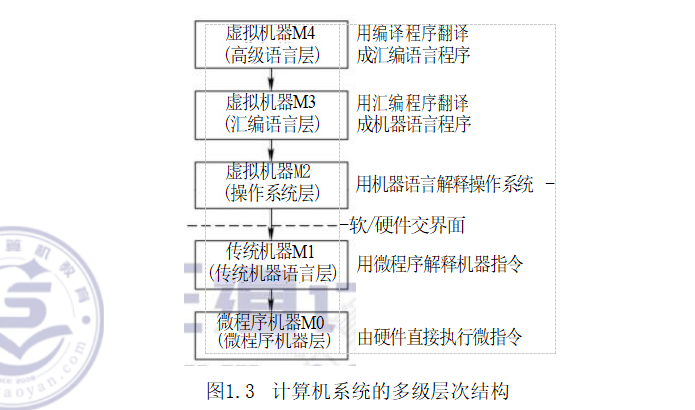

第 1 级 是微程序机器层，这是一个实在的硬件层，它由机器硬件直接执行微指令。

第 2 级 是传统机器语言层，它也是一个实际的机器层，由微程序解释机器指令系统。

​	第 3 级 是操作系统层，它由操作系统程序实现。操作系统程序是由机器指令和广义指令组成 的，这些广义指令是为了扩展机器功能而设置的，是由操作系统定义和解释的软件指令，所以这 一 层也称混合层。

第 4 级 是汇编语言层，这一层由汇编程序支持和执行，借此可编写汇编语言源程序。

​	第 5 级 是高级语言层，它是面向用户的，是为方便用户编写应用程序而设置的。该层由各种 高级语言编译程序支持和执行。在高级语言层之上，还可以有应用程序层，它由解决实际问题的 处理程序组成，如文字处理软件、多媒体处理软件和办公自动化软件等。

​	没有配备软件的纯硬件系统称裸机。第3层～第5层称为虚拟机器，简单来说就是软件实现 的机器。虚拟机器只对该层的观察者存在，这里的分层和计算机网络的分层类似，对于某层的观 察者来说，其只能通过该层的语言来了解和使用计算机，而不必关心下层是如何工作的。

层次之间的关系紧密，下层是上层的基础，上层是下层的扩展。

​	软件和硬件之间的界面就是指令集体系结构(ISA),ISA  定义了一 台计算机可以执行的所有 指令的集合，每条指令规定了计算机执行什么操作，以及所处理的操作数存放的地址空间和操作 数类型。可以看出， ISA 是指软件能感知到的部分，也称软件可见部分。

本门课程主要讨论传统机器M1 和微程序机器M0  的组成原理及设计思想。

### 从源程序到可执行文件

​	在计算机中编写的C 语言程序，都必须被转换为一系列的低级机器指令，这些指令按照一种 称为可执行目标文件的格式打好包，并以二进制磁盘文件的形式存放起来。

​	以 UNIX  系统中的GCC 编译器程序为例，读取源程序文件 hello.c,  并把它翻译成一个可执 行目标文件hello,整个翻译过程可分为四个阶段完成，如图1.5所示。

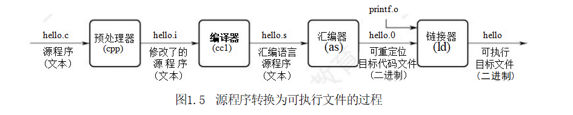

​	1)预处理阶段：预处理器 (cpp)   对源程序中以字符#开头的命令进行处理，例如将#include 命令后面的.h 文件内容插入程序文件。输出结果是一个以.i 为扩展名的源程序hello.i。

​	2)编译阶段：编译器 (ccl)   对预处理后的源程序进行编译，生成一个汇编语言源程序hello.s。汇编语言源程序中的每条语句都以一种文本格式描述了一条低级机器语言指令。

​	3)汇编阶段：汇编器 (as) 将 hello.s 翻译成机器语言指令，把这些指令打包成一个称为可 重定位目标代码文件hello.o,它是一种二进制文件，因此用文本编辑器打开会显示乱码。

​	4)链接阶段：链接器 (ld)  将多个可重定位目标代码文件和标准库函数合并为一个可执行目 标文件，简称可执行文件。本例中，链接器将hello.o 和标准库函数 printf 所在的可重定位 目标模块printfo  合并，生成可执行文件hello。最终生成的可执行文件被保存在磁盘上。

### 计算单位

K -> M -> G -> T -> P -> E -> Z(10^21)

### 几个专业术语

​	1)系列机。具有基本相同的体系结构，使用相同基本指令系统的多个不同型号的计算机组 成的一个产品系列。

​	2)兼容。指软件或硬件的通用性，即运行在某个型号的计算机系统中的硬/软件也能应用 于另一个型号的计算机系统时，称这两台计算机在硬件或软件上存在兼容性。

​	3)固件。将程序固化在ROM 中组成的部件称为固件。固件是一种具有软件特性的硬件，吸 收了软件/硬件各自的优点，其执行速度快于软件，灵活性优于硬件，是软/硬件结合的产 物。例如，目前操作系统已实现了部分固化(把软件永恒地存储于ROM 中)。

### 翻译程序、解释程序、汇编程序、编译程序的区别和联系

​	翻译程序有两种：一种是编译程序，它将高级语言源程序一次全部翻译成目标程序，只要源 程序不变，就无须重新翻译。另一种是解释程序，它将源程序的一条语句翻译成对应的机器目标 代码，并立即执行，然后翻译下一条源程序语句并执行，直至所有源程序语句全部被翻译并执行完。所以解释程序的执行过程是翻译一句执行一句，并且不会生成目标程序。

汇编程序也是一种语言翻译程序，它把汇编语言源程序翻译为机器语言程序。

​	编译程序与汇编程序的区别：若源语言是诸如C 、C++ 、Java 等“高级语言”,而目标语言是 诸如汇编语言或机器语言之类的“低级语言”,则这样的一个翻译程序称为编译程序。若源语言 是汇编语言，而目标语言是机器语言，则这样的一个翻译程序称为汇编程序。

## 第二章 数据的表示和运算

### 溢出判别方法

**CF = Sub异或Cout**

**OF = C（n） 异或 C（n - 1）**

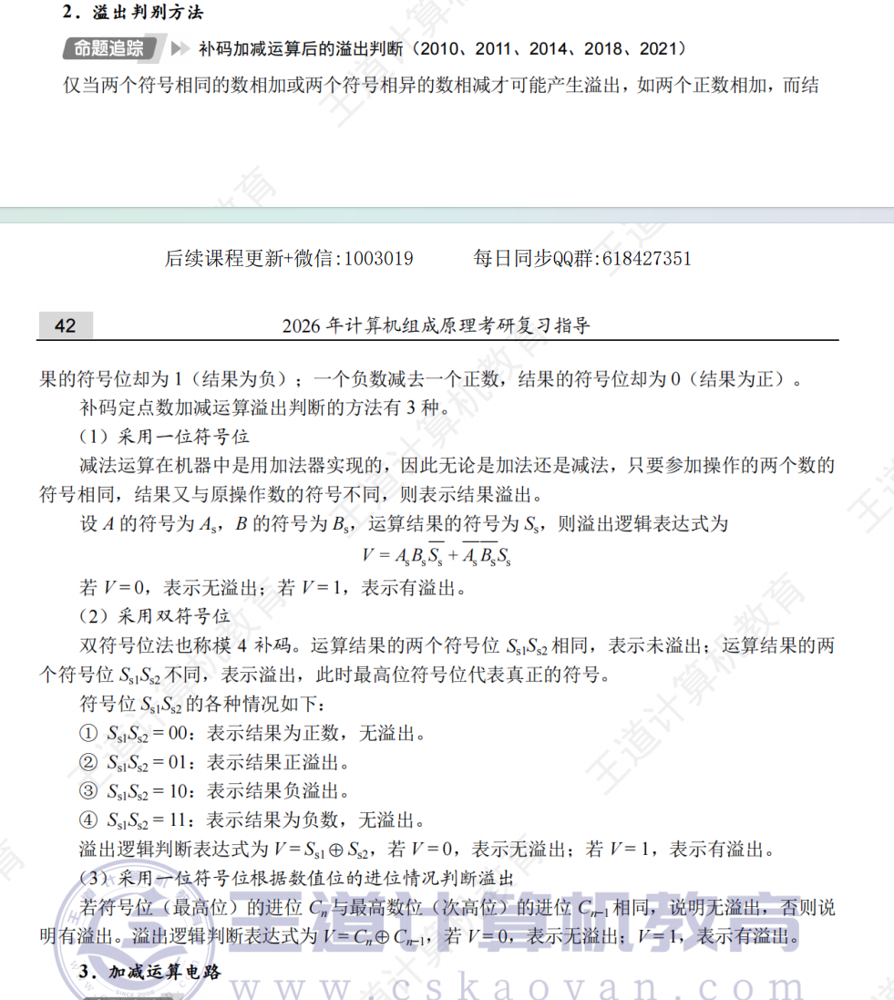

### 原码的加减法运算

在原码加减运算中，将符号位和数值位分开处理，具体的规则如下。

**加法规则**：遵循“同号求和，异号求差”的原则，先判断两个操作数的符号位。具体来说， 符号位相同，则数值位相加，结果符号位不变，若最高数值位相加产生进位，则发生溢出；符号位不同，则做减法，绝对值大的数减去绝对值小的数，结果符号位与绝对值大的数相同。

**减法规则**：先将减数的符号取反，然后将被减数与符号取反后的减数按原码加法进行运算。

### 定点数的乘除运算

1.定点乘法运算

**乘法运算的基本原理**

原码乘法的特点是符号位与数值位是分开求的，原码乘法运算分为两步：

① 乘积的符号位由 两个乘数的符号位“异或”得到；

② 乘积的数值位是两个乘数的绝对值之积。两个定点数的数值 部分之积可视为两个无符号数的乘积。下面是两个无符号数相乘的手算过程。

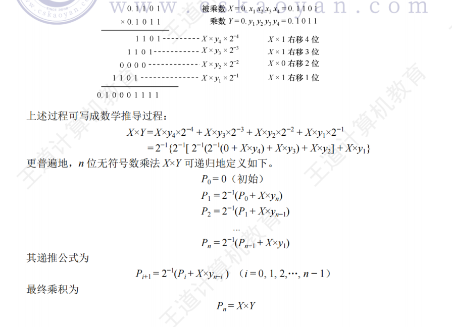

​	由上述分析可知，乘法运算可用加法和移位运算来实现(乘以 $2^{-1}$ 相当于做 一 次右移),两 个 n 位无符号数相乘共需进行n 次加法和n 次移位运算。原码乘法运算的过程可归纳如下：

①被乘数和乘数均取绝对值参加运算，视为无符号数，符号位为$x_s$ $a \oplus b$

② 部 分 积 $P_{i}$  是乘法运算的中间结果，初值 $P_{0}$ = 0 。 从乘数的最低位  $Y_{n}$ 开始，将前面所得的 部分积  $P_{i}$  加 上 X × $y_{n - i}$,  然后右移一位，此步骤重复n 次 。

参与运算的是两个数的数值位，因此运算过程中的右移操作均为逻辑右移。

**乘法运算电路**

​	图2.10是32位无符号数乘法运算的逻辑结构图。部分积和被乘数X 做无符号数加法时， 可能产生进位，因此设置一个专门的进位位C 。乘积寄存器P 初始置0。计数器Cn初值为32, 每循环一次减1。ALU 是乘法器的核心部件，对乘积寄存器P 和被乘数寄存器X 的内容做“无 符号加法”运算，结果送回乘积寄存器P, 进位存放在C 中。每次循环都对进位位C、寄存器 P 和寄存器 Y实现同步“逻辑右移”,此时，进位位C 移入寄存器P 的最高位，寄存器Y的最 低位移出。每次从寄存器 Y 移出的最低位都被送到控制逻辑，以决定被乘数是否“加”到部分积上。

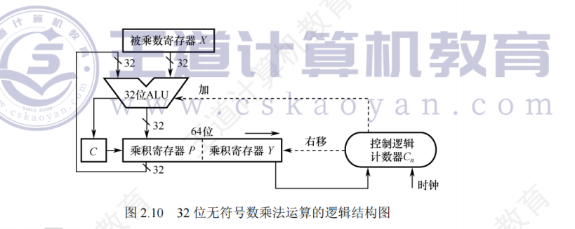

​	在字长为32位的计算机中，对于两个int型变量x 和y 的乘积，若乘积高32位的每一位都 相同，且都等于乘积低32位的符号，则表示不溢出，否则表示溢出。当x 和 y 都 为unsigned  int 型变量时，若乘积的高32位全为0,则表示不溢出，否则表示溢出。

​	统考真题还涉及过阵列乘法器的基本概念。阵列乘法器是一种快速乘法器，它采用硬件叠加的方式， 所有部分积同时产生并组成一个阵列，再运用多操作数相加，就能得到最终的积，因此最快可在一个时 钟周期内完成一条乘运算指令。

**除法运算**

**除法运算的基本原理**

​	原码的除法运算与乘法运算很相似，都是一种移位和加减运算迭代的过程，但比乘法运算更 复杂。n 位定点数的除法运算，需统一为： 一个2n 位的数除以一个n 位的数，得到一个n 位的商，

​	因此需要对被除数进行扩展。对于定点正小数(原码小数),只需在被除数低位添n 个0即可。 对于定点正整数(无符号数),只需在被除数高位添 n 个0即可。做整数除法时，若除数为0, 则发生“除数为0”异常，此时需调出操作系统相应的异常处理程序进行处理。

下面以两个无符号数为例说明手算除法步骤。


上述除法运算的过程可归纳如下：

​	①被除数与除数相减，够减则上商为1,不够减则上商为0。

​	②每次得到的差为中间余数，将除数右移后与上次的中间余数比较。用中间余数减除数， 够减则上商为1,不够减则上商为0。如此重复，直到商的位数满足要求为止。

​	若是2n 位除以n 位的无符号数，商的位数为n+1 位，当第一次试商为1时，则表示结果溢 出(无法用n 位表示商),如11111111/1111=10001。若是两个n 位的无符号数相除，则第一位 商为0,且结果肯定不会溢出，如两个4位数相除的最大商为00001111/0001=1111。对于浮点数 尾数的原码小数相除，第一次试商为1,则说明尾数部分有溢出，可通过右规消除。

​	计算机内部的除法运算与手算除法一样，通过被除数(中间余数)减除数来得到每一位商， 够减上商1,不够减上商0。原码除法运算也要将符号位和数值位分开处理，商的符号位是两个 数的符号位的“异或”结果，商的数值位是两个数的绝对值之商。

**除法运算电路**

​	图2.11是一个32位除法逻辑结构图。寄存器 Y存放除数；寄存器R 初始时存放扩展被除数 的高32位，运算过程中存放中间余数的高位部分，结束时存放的是余数；寄存器 Q 初始时存放 扩展被除数的低32位，运算过程中部分存放中间余数的低位部分、部分存放商，结束时存放的 是32位商。ALU 是除法器的核心部件，对寄存器R 和 Y的内容做加/减运算，运算结果被送回寄 存器 R 。计数器 Cn初值为32,每循环一次减1。每次循环，寄存器R 和 Q 实现同步左移，左移 时 ，Q 的最高位移入R 的最低位，Q 中空出的最低位被上商。从低位开始，逐次把商的各个数位 左移到Q 中。每次由控制逻辑根据ALU 运算结果的符号来决定上商是0还是1。

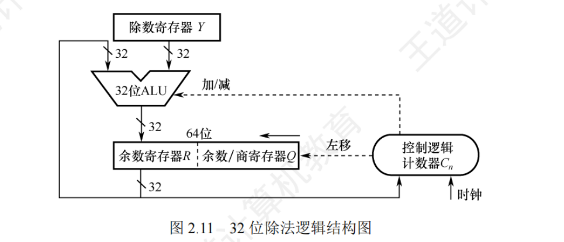

若是两个32位 int 型整数相除，则除了${(-2)^{31}}$/-1会溢出，其余情况都不会溢出。

### IEEE754

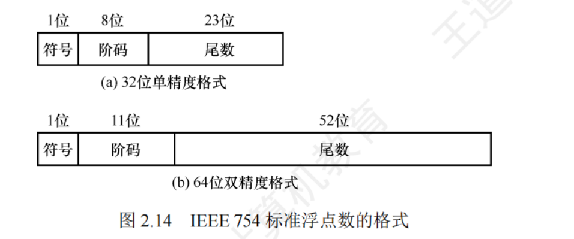

**32位**：阶码范围：1 ~ 254

64位：阶码范围：1 ~ 2046

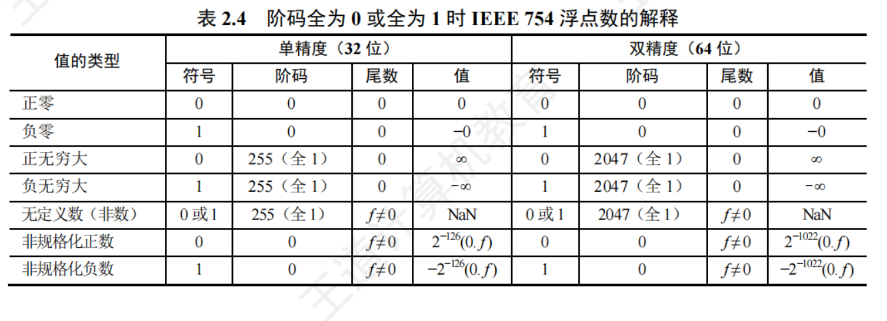

## 第三章 存储系统

### 串行访问存储器

​	对存储单元进行读/写操作时，需按其物理位置的先后顺序寻址，包括 顺序存取存储器(如磁带)和直接存取存储器(如磁盘、光盘)。

​	顺序存取存储器的内容只能按某种顺序存取，存取时间的长短与信息在存储体上的物理位置 有关，其特点是存取速度慢。直接存取存储器既不像RAM 那样随机地访问任何一个存储单元， 又不像顺序存取存储器那样完全按顺序存取，而是介于两者之间。存取信息时通常先寻找整个存 储器中的某个小区域(如磁盘上的磁道),再在小区域内顺序查找。

### SDRAM

​	目前更常用的是SDRAM  (同步DRAM)  芯片，与传统的异步DRAM 不同，SDRAM 与 CPU  的数据交换同步于系统的时钟信号，并且以CPU- 主存总线的最高速度运行，而不需要插入等待状 态。在传统DRAM 中 ，CPU 将地址和控制信号送至存储器后，需经过一段延迟时间，数据才读出 或写入。在此期间，CPU 不断采样DRAM  的完成信号，在读写完成之前，CPU 不能做其他工作， 降低了CPU 的执行速度。而SDRAM 在系统时钟的控制下进行数据的读出和写入，它将CPU 发出 的地址和控制信号锁存起来，经过指定的时钟周期数后再响应，此时CPU 可执行其他操作。

### SRAM和DRAM的比较

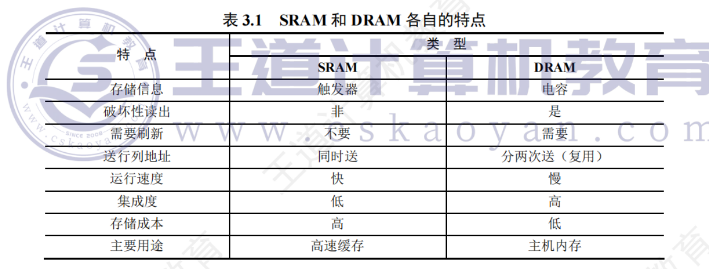

### ROM的种类

根据制造工艺的不同，ROM 可分为掩模式只读存储器(MROM)、  一次可编程只读存储器

(PROM) 、 可擦除可编程只读存储器 (EPROM) 、Flash  存储器和固态硬盘 (SSD)。

**(1) 掩模式只读存储器**

​	MROM 的内容由半导体制造厂商按用户提出的要求在芯片的生产过程中直接写入，写入以 后任何人都无法改变其内容。优点是可靠性高、集成度高、价格便宜；缺点是灵活性差。

**(2) 一次可编程只读存储器**

​	PROM 是可以实现一次性编程的只读存储器，允许用户利用专门的设备(编程器)写入自己 的程序，一旦写入，内容就无法改变。

**(3) 可擦除可编程只读存储器**

​	EPROM 不仅可以由用户利用编程器写入信息，而且可以对其内容进行多次改写。EPROM虽 然既可读又可写，但它不能取代RAM,  因为EPROM 的编程次数有限，且写入时间过长。

**(4) Flash 存储器**

​	Flash 存储器是在EPROM 的基础上发展起来的，它兼有ROM 和RAM 的优点，可在不加电 的情况下长期保存信息，又能在线进行快速擦除与重写。Flash 存储器既有 EPROM 价格便宜、集 成度高的优点，又有E²PROM 电可擦除重写的特点，且擦除重写的速度快。

**(5) 固态硬盘 (Solid  State  Drive,SSD)**

​	基于闪存的固态硬盘是用固态电子存储芯片阵列制成的硬盘，由控制单元和存储单元(Flash芯片)组成。保留了Flash  存储器长期保存信息、快速擦除与重写的特性。对比传统硬盘也具有 读/写速度快、低功耗的特性，缺点是价格较高。

### 磁盘存储器

​	磁盘驱动器。驱动磁盘转动并在盘面上通过磁头进行读/写操作的装置，如图3 . 14所示。

​	磁盘控制器。磁盘驱动器与主机的接口，负责接收并解释CPU 发来的命令，向磁盘驱 动器发出各种控制信号，并负责检测磁盘驱动器的状态。

**磁盘的工作过程**

​	磁盘的主要操作是寻址、读盘、写盘。每个操作都对应一个控制字，磁盘工作时，第一步是 取控制字，第二步是执行控制字。磁盘属于机械式部件，其读/写操作是串行的，不可能在同一时 刻既读又写，也不可能在同一时刻读两组数据或写两组数据。

### 磁盘阵列

RAID 的分级如下所示。在 RAID1～RAID5 几种方案中，无论何时有磁盘损坏，都可随时拔 出受损的磁盘再插入好的磁盘，而数据不会损坏，提升了系统的可靠性。
●   RAID0:  无冗余和无校验的磁盘阵列。
●   RAID1:  镜像磁盘阵列。
●   RAID2:  采用纠错的海明码的磁盘阵列。
●   RAID3:  位交叉奇偶校验的磁盘阵列。
●   RAID4:  块交叉奇偶校验的磁盘阵列。
●   RAID5:  无独立校验的奇偶校验磁盘阵列。
	RAID0  把连续多个数据块交替地存放在不同物理磁盘的扇区中，几个磁盘交叉并行读/写， 即条带化技术，这样不仅扩大了存储容量，还提高了磁盘存取速度，但RAID0 没有容错能力。
	为了提高可靠性，RAID1  使两个磁盘同时进行读/写，互为备份，若一个磁盘出现故障，可 从另一磁盘中读出数据。两个磁盘当一个磁盘使用，意味着容量减少一半。
	总之，RAID  通过同时使用多个磁盘，提高了传输速率；通过在多个磁盘上并行存取来大幅 提高存储系统的数据吞吐量；通过镜像功能，提高安全可靠性；通过数据校验，提供容错能力。

### Cache 行涉及字段

有效位：占1位，用于说明Cache行中的数据是否有效。

脏位(修改位): 占1位，回写法才需要设置，用以说明Cache 行中的数据是否被修改过。

LRU 替换位：位数为log₂(组内块数),用于LRU 替换算法中的访问计数。

标记位 Tag: 主存地址结构中的标记字段，其位数取决于所用的映射方式，用于匹配 Cache行对应主存中的哪个块。

行内数据：与主存对应

## 第四章 指令系统

### 指令集体系结构

​	机器指令(简称指令)是指示计算机执行某种操作的命令。 一台计算机的所有指令的集合构 成该机的指令系统，也称指令集。指令系统是指令集体系结构 (ISA) 中最核心的部分，ISA  完 整定义了软件和硬件之间的接口，是机器语言或汇编语言程序员所应熟悉的。

ISA 规定的内容主要包括：

1. 指令格式，指令寻址方式，操作类型，以及每种操作对应的操作数的相应规定。

2. 操作数的类型，操作数寻址方式，以及是按大端方式还是按小端方式存放。

3. 程序可访问的寄存器编号、个数和位数，存储空间的大小和编址方式。

4. 指令执行过程的控制方式等，包括程序计数器、条件码定义等。

### 基址、变址、相对

1. 基址寻址扩大了操作数寻址范围，适用于多道程序设计，常用于为程序或数据分配存储空间。 基址寄存器是面向操作系统的，其内容由操作系统或管理程序确定。

2. 变址寻址主要用于处理数组问题，适合编制循环程序。变址寄存器是面向用户的，在程序执行过程中，变址寄存器的内容可由用户改变。

3. 相对寻址用于控制程序的执行顺序、转移等。

### CISC 与 RISC 的区别

| 对比项目         | 类别                                 |                                      |
| ---------------- | ------------------------------------ | ------------------------------------ |
|                  | CISC                                 | RISC                                 |
| 指令系统         | 复杂，庞大                           | 简单，精简                           |
| 指令数目         | 一般大于200条                        | 一般小于100条                        |
| 指令字长         | 不固定                               | 定长                                 |
| 可访存指令       | 不加限制                             | 只有LOAD/STORE指令                   |
| 各种指令执行时间 | 相差较大                             | 绝大多数在一个周期内完成             |
| 各种指令使用频度 | 相差很大                             | 都比较常用                           |
| 通用寄存器数量   | 较少                                 | 多                                   |
| 目标代码         | 难以用优化编译生成高效的目标代码程序 | 采用优化的编译程序，生成代码较为高效 |
| 控制方式         | 绝大多数为微程序控制                 | 绝大多数为组合逻辑控制               |
| 指令流水线       | 可以通过一定方式实现                 | 必须实现                             |

## 第五章 中央处理器

### 数据通路

​	数据在指令执行过程中所经过的路径，包括路径上的部件，称为数据通路，ALU、通用寄存 器、状态寄存器、异常和中断处理逻辑等都是指令执行时数据流经的部件，都属于数据通路的一 部分。数据通路描述了信息从哪里开始，中间经过哪些部件，最后被传送到哪里。数据通路由控 制部件控制，控制部件根据每条指令功能的不同，生成对数据通路的控制信号。

**数据通路的组成**

​	组成数据通路的元件主要分为组合逻辑元件和时序逻辑元件两类。

**组合逻辑元件(操作元件)**

​	在组合逻辑元件中，任何时刻产生的输出仅取决于当前的输入。组合逻辑元件不含存储信号 的记忆单元，也不受时钟信号的控制，输出与输入之间无反馈通路，信号是单向传输的。数据通 路中常用的组合逻辑元件有加法器、算术逻辑单元 (ALU) 、 译码器、多路选择器、三态门等， 如图5.7所示。

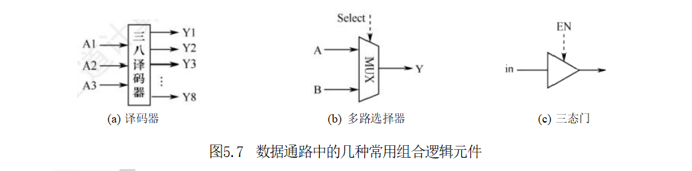

**时序逻辑元件(状态元件)**

​	任何时刻的输出不仅与该时刻的输入有关，还与该时刻以前的输入有关，因此时序电路必然 包含存储信号的记忆单元。此外，时序逻辑元件必须在时钟节拍下工作。各类寄存器和存储器， 如通用寄存器组、程序计数器、状态/移位/暂存/锁存寄存器等，都属于时序逻辑元件。

### 硬布线控制器

​	硬布线控制器由复杂的组合逻辑门电路和触发器构成，也称组合逻辑控制器，其原理是根据 指令的要求、当前的时序及内外部的状态，按时间的顺序发送一系列微操作控制信号。
​	指令的操作码是决定控制单元(CU)   发出不同控制信号的关键。为了简化CU 的逻辑，将存 放在IR 的 n 位操作码经过译码电路产生2”个输出，每种操作码对应一个输出送至CU。若将指令 译码器和节拍发生器从CU 中分离出来，则可得到简化的控制单元框图，如图5.10所示。


控制单元 (CU)  的输入信号来源如下：

​	1：经指令译码器译码产生的指令信息。它与时钟配合产生不同的控制信号。

​	2：时钟脉冲，其频率为机器的主频。它使CU 能够按一定的节拍发出各个控制信号。

​	3：来自执行单元的反馈信息即标志。 CU 有时需依赖 CPU 当前的状态来产生控制信号。

图5.10中，节拍发生器产生各时钟周期中的节拍信号，使不同的微操作命令C; (控制信号)

​	按时间的先后发出。个别指令的操作不仅受操作码控制，而且还受状态标志控制，因此CU 的输 入来自操作码译码电路、节拍发生器及状态标志，其输出到CPU内部或外部控制总线上。

​	硬布线控制的功能由逻辑门组合实现，其速度主要取决于电路延迟，因此高速计算机中的 关键核心部件CPU 往往采用硬布线逻辑实现。因此，RISC 一般都选用硬布线控制器。硬布线控 制器的控制信号先用逻辑式列出，经化简后用电路来实现，因此显得零乱复杂，当需要修改或 增加指令时就必须重新设计电路，非常麻烦。而且指令系统功能越全，微操作命令就越多，电路也就越庞杂，调试就更困难。为了克服这些缺点，便产生了微程序设计方法。

### 微指令的编码方式

​	微指令的编码方式也称微指令的控制方式，是指如何对微指令的控制字段进行编码，以形成 控制信号。编码的目标是在保证速度的情况下，尽量缩短微指令字长。
(1)：直接编码(直接控制)方式
​	微指令的直接编码方式如图5.12所示。直接编码法无须进行译码，微指令的操作控制字段中 每一位都代表一个微命令。设计微指令时，选用或不选用某个微命令，只要将表示该微命令的对 应位设置成1或0即可。每个微命令对应并控制数据通路中的一个微操作。


​	这种编码的优点是简单、直观，执行速度快，操作并行性好；缺点是微指令字长过长，n 个 微命令就要求微指令的操作字段有 n 位，造成控制存储器容量极大。
(2)：字段直接编码方式

​	将微指令的操作控制字段分成若干小字段，把互斥性微命令放在同一字段中，把相容性微命 令放在不同字段中，每个字段独立编码，每种编码代表一个微命令且各字段编码含义单独定义， 与其他字段无关，这就是字段直接编码方式，如图5.13所示。这种方式可以缩短微指令字长，但 因为要通过译码电路后再发出微命令，因此比直接编码方式慢。


微命令字段分段的原则：
	①互斥性微命令分在同一段内，相容性微命令分在不同段内。
	②每个小段中包含的信息位不能太多，否则将增加译码电路的复杂性和译码时间。
	③一般每个小段还要留出一个状态，表示本字段不发出任何微命令。因此，当某字段的长 度为3位时，最多只能表示7个互斥的微命令，通常用000表示不操作。
(3)：字段间接编码方式
	一个字段的某些微命令需由另一个字段中的某些微命令来解释，因为不是靠字段直接译码发 出的微命令，所以称为字段间接编码，也称隐式编码。这种方式可进一步缩短微指令字长，但因 削弱了微指令的并行控制能力，因此通常作为字段直接编码方式的一种辅助手段。

### 中断与异常

1：异常的分类
	异常是由 CPU 内部产生的意外事件，分为硬故障中断和程序性异常。硬故障中断是由硬连 线出现异常引起的，如存储器校验错、总线错误等。程序性异常也称软件中断，是指在CPU 内部 因执行指令而引起的异常事件。如整除0、溢出、断点、单步跟踪、非法指令、栈溢出、地址越 界、缺页等。按异常发生原因和返回方式的不同，可分为故障、自陷和终止。

(1)：故障(Fault)

​	指在引起故障的指令启动后、执行结束前被检测到的异常事件。例如，指令译码时，出现“非 法操作码”;取数据时，发生“缺段”或“缺页”;执行整数除法指令时，发现“除数为0”等。 对于“缺段”“缺页”等异常事件，经处理后，可将所需的段或页面从磁盘调入主存，回到发生 故障的指令继续执行，断 点为当前发生故障的指令；对于“非法操作码”“除数为0”等，因为无 法通过异常处理程序恢复故障，因此不能回到原断点执行，必须终止进程的执行。

(2)：自陷(Trap)

​	陷也称陷阱或陷入，它是预先安排的一种“异常”事件，就像预先设定的“陷阱”一样。 通常的做法是：事先在程序中用一条特殊指令或通过某种方式设定特殊控制标志来人为设置一个“陷阱”,当执行到被设置了“陷阱”的指令时，CPU 在执行完自陷指令后，自动根据不同“陷阱” 类型进行相应的处理，然后返回到自陷指令的下一条指令执行。
​	在x86 机器中，用于程序调试“断点设置”和单步跟踪的功能就是通过陷阱机制实现的。此 外，系统调用指令、条件自陷指令(如MIPS 中的 teq、teqi、tne、tnei等)等都属于陷阱指令， 执行到这些指令时，无条件或有条件地自动调出操作系统内核程序进行执行。
故障异常和自陷异常属于程序性异常(软件中断)。

(3)：终止 (Abort)

​	若在执行指令的过程中发生了使计算机无法继续执行的硬件故障，如控制器出错、存储器校 验错、总线错误等，则程序将无法继续执行，只能终止，此时，调出异常服务程序来重启系统。 这种异常与故障和自陷不同，不是由特定指令产生的，而是随机发生的。
终止异常和外中断属于硬件中断。

**中断的分类**

​	中断是指来自CPU 外部、与CPU 执行指令无关的事件引起的中断，包括I/O 设备发出的I/O 中断(如键盘输入、打印机缺纸等),或发生某种特殊事件(如用户按Esc 键、定时器计数时间到) 等。外部 I/O 设备通过特定的中断请求信号线向 CPU 提出中断请求，CPU 每执行完一条指令就 检查中断请求信号线，若检测到中断请求，则进入中断响应周期。
中断可分为可屏蔽中断和不可屏蔽中断。
(1)：可屏蔽中断
​	指通过可屏蔽中断请求线INTR 向 CPU  发出的中断请求。CPU 可以通过在中断控制器中设置相应的屏蔽字来屏蔽它或不屏蔽它，被屏蔽的中断请求将不被送到CPU。
(2)：不可屏蔽中断
​	指通过专门的不可屏蔽中断请求线NMI 向 CPU 发出的中断请求，通常是非常紧急的硬件故 障，如电源掉电等。这类中断请求信号不可被屏蔽，以让CPU 快速处理这类紧急事件。
中断和异常在本质上是一样的，但它们之间有以下两个重要的不同点：
​	1)：“缺页”或“溢出”等异常事件是由特定指令在执行过程中产生的，而中断不和任何指令 相关联，也不阻止任何指令的完成。
​	2)：异常的检测由CPU自身完成，不必通过外部的某个信号通知 CPU 。对于中断，CPU  必 须通过中断请求线获取中断源的信息，才能知道哪个设备发生了何种中断。

```
所有的异常和中断事件都是由硬件检测发现的。
```

​	此外，根据识别中断服务程序地址的方式，可分为向量中断和非向量中断；根据中断处理过 程是否允许被打断，还可分为单重中断和多重中断。

### 指令流水线

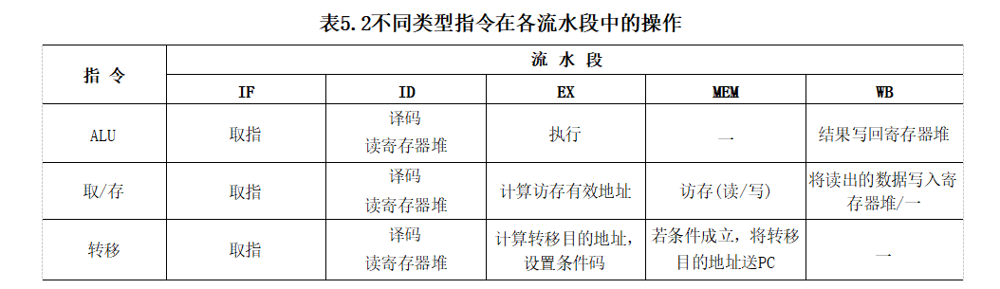

### 多处理器的基本概念

#### SISD 、SIMD 、MIMD 的基本概念
​	基于指令流的数量和数据流的数量，将计算机体系结构分为SISD 、SIMD 、MISD 和 MIMD 四类。常规的单处理器属于SISD,   而常规的多处理器属于MIMD。

1：单指令流单数据流 (SISD)    结构
	SISD  是传统的串行计算机结构，这种计算机通常仅包含一个处理器和一个存储器，处理器 在一段时间内仅执行一条指令，按指令流规定的顺序串行执行指令流中的若干指令。为了提高 速度，有些SISD 计算机采用流水线的方式，因此，SISD 处理器有时会设置多个功能部件，并且 采用多模块交叉方式组织存储器。本书前面介绍的内容多属于SISD 结构。

2：单指令流多数据流 (SIMD)    结构
	SIMD 是指一个指令流同时对多个数据流进行处理，一般称为数据级并行技术。这种结构的 计算机通常由一个指令控制部件、多个处理单元组成。每个处理单元虽然执行的都是同一条指 令，但是每个单元都有自己的地址寄存器，这样每个单元就都有不同的数据地址，因此，不同 处理单元执行的同一条指令所处理的数据是不同的。 一个顺序应用程序被编译后，既可能按 SISD 组织并运行于串行硬件上，又可能按SIMD 组织并运行于并行硬件上。
	SIMD 在使用for 循环处理数组时最有效，比如， 一条分别对16对数据进行运算的SIMD 指 令若在16个ALU 中同时运算，则只需要一次运算时间就能完成运算。SIMD 在使用case 或switch 语句时效率最低，此时每个执行单元必须根据不同的数据执行不同的操作。

3：多指令流单数据流 (MISD)   结构
	MISD 是指同时执行多条指令，处理同一个数据，实际上不存在这样的计算机。

4：多指令流多数据流 (MIMD)    结构
	MIMD 是指同时执行多条指令分别处理多个不同的数据，MIMD  分为多计算机系统和多处 理器系统。多计算机系统中的每个计算机节点都具有各自的私有存储器，并且具有独立的主存地址空间，不能通过存取指令来访问不同节点的私有存储器，而要通过消息传递进行数据传 送，也称消息传递 MIMD 。多处理器系统是共享存储多处理器 (SMP)   系统的简称，它具有共享 的单一地址空间，通过存取指令来访问系统中的所有存储器，也称共享存储 MIMD。
	向量处理器是 SIMD 的变体，是一种实现了直接操作一维数组(向量)指令集的CPU,   而串 行处理器只能处理单一数据集。其基本理念是将从存储器中收集的一组数据按顺序放到一组向 量寄存器中，然后以流水化的方式对它们依次操作，最后将结果写回寄存器。向量处理器在特 定工作环境中极大地提升了性能，尤其是在数值模拟或者相似的领域中。
SIMD 和 MIMD  是两种并行计算模式，其中 SIMD  是一种数据级并行模式，而MIMD  是一 种并行程度更高的线程级并行或线程级以上并行计算模式。

#### 硬件多线程的基本概念

​	在传统 CPU  中，线程的切换包含一系列开销，频繁地切换会极大影响系统的性能，为了减 少线程切换过程中的开销，便诞生了硬件多线程。在支持硬件多线程的 CPU中，必须为每个线 程提供单独的通用寄存器组、单独的程序计数器等，线程的切换只需激活选中的寄存器，从而 省略了与存储器数据交换的环节，大大减少了线程切换的开销。
硬件多线程有3种实现方式：细粒度多线程、粗粒度多线程和同时多线程 (SMT)。

1：细粒度多线程
	多个线程之间轮流交叉执行指令，多个线程之间的指令是不相关的，可以乱序并行执行。 在这种方式下，处理器能在每个时钟周期切换线程。例如，在时钟周期 i, 将线程A 中的多条指 令发射执行；在时钟周期i+1,    将线程B 中的多条指令发射执行。

2：粗粒度多线程
	连续几个时钟周期都执行同一线程的指令序列，仅在当前线程出现了较大开销的阻塞时， 才切换线程，如Cache 缺失。在这种方式下，当发生流水线阻塞时，必须清除被阻塞的流水线， 新线程的指令开始执行前需要重载流水线，因此，线程切换的开销比细粒度多线程更大。
上述两种多线程技术都实现了指令级并行，但线程级不并行。

3：同时多线程
	同时多线程(SMT)   是上述两种多线程技术的变体。它在实现指令级并行的同时，实现线程 级并行，也就是说，它在同一个时钟周期中，发射多个不同线程中的多条指令执行。
图5.20分别是三种硬件多线程实现方式的调度示例。

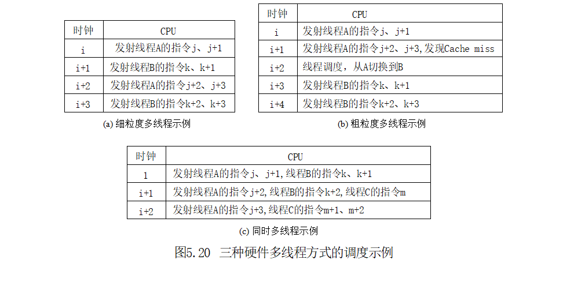

​	Intel 处理器中的超线程 (Hyper-threading)   就是同时多线程SMT,   即在一个单处理器或单个 核中设置了两套线程状态部件，共享高速缓存和功能部件。

#### 多核处理器的基本概念

​	多核处理器是指将多个处理单元集成到单个CPU 中，每个处理单元称为一个核(core),    通 常也称片上多处理器。每个核既可以有自己的 Cache, 又可以共享同一个 Cache,   所有核通常共 享主存储器。图5.21是一个不共享Cache 的双核CPU 结构。

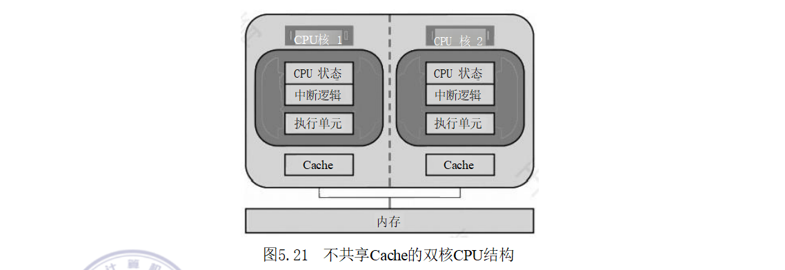

​	在多核计算机系统中，如要充分发挥硬件的性能，必须采用多线程(或多进程)执行，使得 每个核在同  时刻都有线程在执行。与单核上的多线程不同，多核上的多个线程是在物理上并 行执行的，是真正意义上的并行执行，在同一时刻有多个线程在并行执行。而单核上的多线程 是一种多线程交错执行，实际上在同一时刻只有一个线程在执行。

​	下面通过一个例子来理解相关的概念。假设要将四颗圆石头滚到马路对面，滚动每颗石头 平均需花费1分钟。串行处理器会逐一滚动每颗石头，花费4分钟。拥有两个核的多核处理器让 两个人滚石头，即每人滚两颗，花费2分钟。向量处理器找到一根长木板，放在四颗石头后面， 推动木板即可同时滚动四块石头，理论上只要力量够大，就只需要1分钟。多核处理器相当于拥 有多名工人，而向量处理器拥有一种方法，可以同时对多件事进行相同的操作。

#### 共享内存多处理器的基本概念

​	具有共享的单一物理地址空间的多处理器称为共享内存多处理器( SMP) 。 处理器通过存储 器中的共享变量互相通信，所有处理器都能通过存取指令访问存储器的任何位置。注意，即使这 些系统共享同一个物理地址空间，它们仍然可在自己的虚拟地址空间中单独地运行程序。
单一地址空间的多处理器有两种类型：
​	1：统一存储访问 ( UMA)  多处理器。每个处理器对所有存储单元的访问时间是大致相同的， 即访问时间与哪个处理器提出访存请求及访问哪个字无关。
​	2：非统一存储访问 (N UMA)  多处理器。某些存储器的访存速度要比其他的快，具体取决于 哪个处理器提出访问请求及访问哪个字，这是由于主存被分割分配给了不同处理器。

​	早期的计算机，内存控制器没有整合进 CPU, 访存操作需要经过北桥芯片(集成了内存控 制器，并与内存相连),CPU 通过前端总线和北桥芯片相连，这就是UMA 构架。随着CPU 性能 提升由提高主频转到增加 CPU 数量(多核、多CPU),   越来越多的CPU  对前端总线的争用使得 前端总线成为瓶颈。为了消除 UMA 架构的瓶颈，NUMA  构架诞生，内存控制器被集成到 CPU内部，每个CPU 都有独立的内存控制器。每个 CPU 都独立连接到一部分内存，CPU 直连的这部 分内存被称为本地内存。CPU 之间通过QPI 总线相连。CPU 可以通过QPI 总线访问其他 CPU 的 远程内存。与UMA 架构不同的是，在NUMA 架构下，内存的访问出现了本地和远程的区别，访 问本地内存明显要快于访问远程内存。

由于可能出现多个处理器同时访问同一共享变量的情况，在操作共享变量时需要进行同步， 否则，一个处理器可能在其他处理器尚未完成对共享变量的修改时，就开始使用该变量。常用方 法是通过对共享变量加锁的方式来控制对共享变量互斥访问。在一个时刻只能有一个处理器获得 锁，其他需要操作该共享变量的处理器必须等待，直到该处理器解锁该变量为止。

第3章讨论的一致性是指Cache 与主存之间的数据一致性。在UMA 构架的多处理器中，所 有CPU 共享同一内存空间，每个CPU 的 Cache 都是共享内存中的一部分副本，因此多核系统的 Cache 一致性既包括Cache 和内存之间的一致性，还包括各CPU 的 Cache 之间的一致性，也就是 说，对内存同一位置的数据，不同CPU 的 Cache 不应该有不一致的内容。

### 读后写、写后写

​	1：读后写(Write   After   Read,WAR)  冲突。表示当前指令读出数据后，下一条指令才能写 该寄存器。否则，先写后读，读到的就是错误(新)数据。在下列指令中，寄存器R1 可 能存在这样的冲突，当指令I2 试图在指令I1 读 R1 之前就写入该寄存器时，指令I1 就错 误地读出该寄存器新的内容。

在 WAR冲突中，指令I2 的目的操作数是指令I1 的源操作数。
	3：写后写(Write  After  Write, WAW) 相关。表示当前指令写入寄存器后，下一条指令才能 写该寄存器。否则，下一条指令在当前指令之前写，将使寄存器的值不是最新值。在下 列指令中，寄存器R1 可能存在这样的冲突，当指令I2 试图在指令I1 之前就写入R1 时，就会错误地使由指令I1 写入的值成为该寄存器的内容。
I1      add    R1,R2,R3                                       #(R2)+(R3)→R1
I2      sub     R1,R4,R5                                        #(R4)-(R5)→R1
在WAW冲突中，指令I2 和指令I1 的目的操作数是相同的。

​	在非按序执行的流水线中，因为允许后进入流水线的指令超过先进入流水线的指令而先流出流水线， 所以既可能发生RAW 相关，又可能发生WAR和WAW 相关。

## 第六章 总线

### 总线结构

1：单总线结构
	单总线结构将 CPU 、主存、I/O 设备(通过I/O 接口)都挂在一组总线上，允许I/O 设备之间、I/O 设备与主存之间直接交换信息，如图6.1所示。CPU 与主存、CPU 与外设之间都可以通 过总线直接进行信息交换，而无须经过中间设备的干预。需要注意的是，单总线并不是指只有一 根信号线，系统总线按传送信息的不同可细分为地址总线、数据总线和控制总线。


优点：结构简单，成本低，易于接入新的设备。
缺点：带宽低、负载重，多个部件只能争用唯一的总线，且不支持并发传送操作。

2：双总线结构
	双总线结构有两条总线：一条是主存总线，用于在CPU、主存和通道之间传送数据；另一条 是I/O 总线，用于在多个外部设备与通道之间传送数据，如图6.2所示。
优点：将低速I/O 设备从原单总线上分离出来，实现了存储器总线和I/O 总线分离。
缺点 ： 需要增加通道等硬件设备 。

3：三总线结构
	三总线结构是在计算机系统各部件之间采用3条各自独立的总线来构成信息通路，这三条总 线分别为主存总线、I/O总线和直接内存访问(DMA)   总线，如图6.3所示。

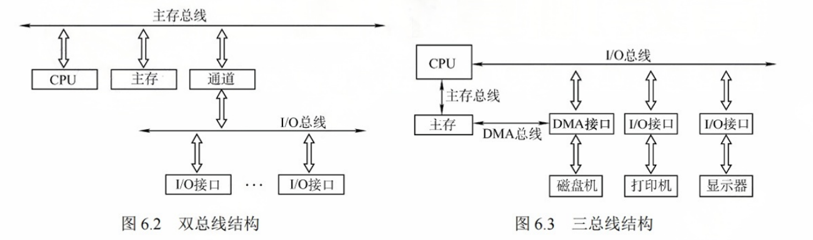

​	主存总线用于在CPU 和内存之间传送地址、数据和控制信息。I/O 总线用于在CPU 和各类 外设之间通信。DMA 总线用于在内存和高速外设之间直接传送数据。
优点：提高了I/O 设备的性能，使其更快地响应命令，提高系统吞吐量。
缺点：任意时刻只能使用一种总线，系统工作效率较低。

### 总线事务

​	从请求总线到完成总线使用的操作序列称为总线事务，它是在一个总线周期中发生的一系列 活动。典型的总线事务包括请求操作、仲裁操作、地址传输、数据传输和总线释放。
1：请求阶段。主设备(CPU   或 DMA)   发出总线传输请求，并且获得总线控制权。
2：仲裁阶段。 总线仲裁机构决定将下一个传输周期的总线使用权授予某个申请者。
3：寻址阶段。主设备通过总线给出要访问的从设备地址及有关命令，启动从模块。
4：传输阶段。主模块和从模块进行数据交换，可单向或双向进行数据传送。
5：释放阶段。主模块的有关信息均从系统总线上撤除，让出总线使用权。 

​	总线上的数据传送方式分为非突发方式和突发方式两种。非突发传送方式在每个传送周期内 都先传送地址，再传送数据，主、从设备之间通常每次只能传输一个字长的数据。

​	突发(猝发)传送方式能够进行连续成组数据的传送，其寻址阶段发送的是连续数据单元的 首地址，在传输阶段传送多个连续单元的数据，每个时钟周期可以传送一个字长的信息，但是不 释放总线，直到一组数据全部传送完毕后，再释放总线。

### 总线定时方式

**半同步定时方式**

​	半同步定时方式保留了同步定时的特点，如所有地址、命令、数据信号的发出时间都严格参 照系统时钟的某个前沿开始，而接收方都采用系统时钟后沿时刻来进行判断识别；同时，又像异  步定时那样，允许不同速度的设备和谐地工作。为此增设一条Wait 响应信号线。例如，某个半同 步总线总是从某个时钟开始，在每个时钟到来时，采样Wait 信号，若无效，则说明数据未准备好， 下个时钟到来时，再采样Wait信号，直到检测到有效，再去数据线上取数据。半同步定时适用于  系统工作速度不高，但又包含了由许多速度差异较大的各类设备组成的简单系统。
​	优点：控制方式比异步定时简单，各模块在系统时钟的控制下同步工作，可靠性较高。
​	缺点：系统时钟频率不能要求太高，所以从整体上来看，系统工作的速度不是很高。
​	以上三种定时方式都从主设备发出地址和读/写命令开始，直到数据传输结束，在整个传输周 期中，总线的使用权完全由主设备及由其选中的从设备占据。其实，从设备在准备数据的阶段，总线纯属空闲等待，为进一步挖掘总线的潜力，又提出了分离式定时方式。

**分离式定时方式**

​	分离式定时方式将总线事务分解为请求和应答两个子过程。在第一个子过程中，主设备A 获 得总线使用权后，将命令、地址等信息发到总线上，经总线传输后由从设备B 接收。此过程占用 总线的时间很短，主设备一旦发送完，立即释放总线，以便其他设备使用。在第二个子过程中， 设备B 收到设备A 发来的有关命令后，将设备A 所需的数据准备好后，便由设备B 申请总线使 用权，一旦获准，设备B 便将相应的数据送到总线上，由设备A 接收。上述两个子过程都只有单 方向的信息流，每个设备都变为主设备。
​	优点：在不传送数据时释放总线，使总线可接受其他设备的请求，不存在空闲等待时间。
​	缺点：控制复杂，开销也大。

## 第七章 输入/输出系统

### 程序中断的工作流程

(1) 中断请求
	中断源是请求 CPU  中断的设备或事件， 一台计算机允许有多个中断源。每个中断源向CPU   发出中断请求的时间是随机的。为记录中断事件并区分不同的中断源，中断系统需对每个中断源 设 置中断请求标记触发器，当其状态为“1”时，表示该中断源有请求。这些触发器可组成中断 请求标记寄存器，该寄存器可集中在 CPU 中，也可分散在各个中断源中。

​	通过INTR 线发出的是可屏蔽中断，通过NMI线发出的是不可屏蔽中断。可屏蔽中断的优先 级最低，在关中断模式下不被响应。不可屏蔽中断用于处理紧急和重要的事件，如时钟中断、电 源掉电等，其优先级最高。
(2)中断响应判优
​	中断响应优先级是 指 CPU   响应中断请求的先后顺序。由于许多中断源提出中断请求的时间 都是随机的，因此当多个中断源同时提出请求时，需通过中断判优逻辑来确定响应哪个中断源的 请求，中断响应的判优通常是通过硬件排队器(或中断查询程序)实现的。
一般来说，①不可屏蔽中断>可屏蔽中断；②在I/O 传送类中断请求中，高速设备>低速设 备；输入设备>输出设备；实时设备>普通设备。

​	中断优先级包括响应优先级和处理优先级，响应优先级由硬件线路或查询程序的查询顺序决定，不 可动态改变。处理优先级可利用中断屏蔽技术动态调整，以实现多重中断。

**中断向量**

​	每个中断源都有一个唯一的类型号，每个中断类型号都对应一个中断服务程序，每个中断服 务程序都有一个入口地址，即中断向量，CPU 必须找到入口地址。把系统中的全部中断向量集中 存放到存储器的某个区域内，这个存放中断向量的存储区就称为中断向量表。

​	CPU 响应中断后，通过识别中断源获得中断类型号，然后据此计算出对应中断向量的地址； 再根据该地址从中断向量表中取出中断服务程序的入口地址，并送入程序计数器 PC,   以转去执  行中断服务程序，这种方法被称为中断向量法，采用中断向量法的中断被称为向量中断。

**保存现场和屏蔽字**：

​	进入中断服务程序后首先要保存现场和中断屏蔽字，现场信息是指 用户可见的工作寄存器的内容，它存放程序执行到断点处的现行值。

​	现场和断点，这两类信息都不能被中断服务程序破坏。由于现场信息用指令可直接访问，因此通常 在中断服务程序中通过指令把它们保存到栈中，即由软件实现。而断点信息由CPU 在中断响应时自动保 存到栈或指定的寄存器中，即由硬件实现。

​	中断处理优先级是指多重中断的实际优先级处理次序，可以利用中断屏蔽技术动态调整，从 而可以灵活地调整中断服务程序的优先级，使中断处理更加灵活。若不使用中断屏蔽技术，则处 理优先级和响应优先级相同。现代计算机一般使用中断屏蔽技术，它通过在中断系统中设置中断 屏蔽字寄存器来实现。每个中断源对应中断屏蔽字寄存器中的某一位，1 表示屏蔽该中断源的请 求，0表示可以正常请求。中断屏蔽字寄存器的内容称为中断屏蔽字。
​	来自设备i的中断请求信号(IRi) 记录在中断请求寄存器中的对应位，每个中断源都有对应 的中断屏蔽字。CPU 在执行某个中断服务程序时，会将该中断源的中断屏蔽字送入中断屏蔽字寄 存器，所有中断请求信号都会与中断屏蔽字寄存器中对应位的非值进行逻辑“与”,然后被送入 中断判优电路按固定的响应优先级进行仲裁，如图7.6所示。被屏蔽的中断请求将无法送到中断 判优电路，未被屏蔽的中断请求仍然按照中断判优电路的响应优先级次序被处理。

​	通过配置中断屏蔽字，可以动态改变中断处理优先级。但是，因为中断屏蔽字寄存器的内容 只有在执行中断服务程序时才会被更新，所以中断屏蔽只在CPU 运行中断服务程序时才有用，其 并不能改变CPU 运行主程序时的中断响应优先级。即使在CPU 运行中断服务程序时，同时到达 的多个未屏蔽中断请求的处理也只能按中断判优电路的响应优先级进行处理。
关于中断屏蔽字的设置及多重中断程序执行的轨迹，下面通过实例说明。

【例7.3】假设某机有4个中断源A 、B 、C 、D, 其硬件排队次序(响应优先级)为A>B>C >D,  现要求将中断处理次序(处理优先级)改为A>D>C>B。
写出每个中断源对应的中断屏蔽字。
解：
中断处理优先级改为A>D>C>B      后 ，A  具有最高的处理优先级，可以屏蔽其他所有中 断，且不能中断自身，因此A 对应的屏蔽字为1111; D 具有次高的处理优先级，只能被 A 中断，因此D 对应的屏蔽字为0111,以此类推，得到4个中断源的屏蔽字见表7.1。


### DMA

DMA 请求触发器：每当 I/O 设备准备好数据后，发出一个控制信号，使DMA 请求触发器 置 位 。

DMA   请求触发器：每当 I/O 设备准备好数据后，发出一个控制信号，使DMA 请求触发器 置 位 。

**DMA 的传送方式**

​	主存和I/O 设备之间交换信息时，不通过CPU。但 当I/O 设备和CPU同时访问主存时，可能 发生冲突，为了有效地使用主存，DMA 与 CPU 通常采用以下3种方式使用主存。
**1：停止CPU 访存**
​	当 I/O 设备有DMA 请求时，由DMA 接口向CPU 发送一个停止信号，使CPU 放弃总线控 制权，停止访问主存，直到DMA 传送一块数据结束，如图7.9所示。数据传送结束后，DMA 接 口通知 CPU 可以使用主存，并把总线控制权交回给CPU。

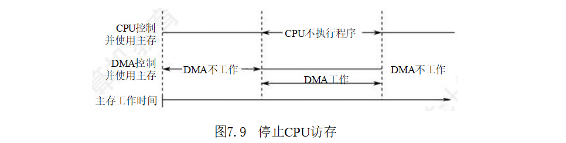

优点：控制简单，适用于数据传输速率很高的I/O 设备实现成组数据的传送。
缺点：DMA 在访问主存时，CPU 基本上处于不工作状态。

**2：周期挪用**

​	由 于I/O 访存的优先级高于CPU 访 存(I/O  不立即访存就可能丢失数据),因此由1/O设备挪 用一个存取周期，传送完一个数据字后立即释放总线，如图7.10所示。它是一种单字传送方式。 当 I/O 设备有DMA 请求时，会遇到3种情况：

①：此时 CPU不在访存，因此I/O 的访存请求与 CPU 未发生冲突；

②：CPU 正在访存，此时必须待存取周期结束后，CPU 再将总线占有权让出；
③：I/O 和 CPU 同时请求访存，出现访存冲突，此时CPU 要暂时放弃总线占有权。


优点：既实现了I/O 传送，又较好地发挥了主存与 CPU 的效率。
缺点：每挪用一个主存周期，DMA  接口都要申请、建立和归还总线控制权。
3：DMA与 CPU 交替访存
	将 CPU 的工作周期分成两个时间片，一个给CPU 访存，另一个给DMA 访存，这样在每个 CPU 周期内，CPU 和 DMA 就都可以轮流访存，如图7.11所示。这种方式适用于CPU 的工作周 期比主存存取周期长的情况。例如，若CPU 的工作周期是1.2μs,  主存的存取周期小于0.6 μs,  则 可将一个CPU 周期分为C₁ 和 C₂ 两个周期，其中C₁ 专供DMA 访存，C₂ 专供CPU 访存。这种方 式不需要申请、建立和归还总线使用权，总线使用权是通过C₁ 和C₂ 分时控制的。
	优点：不需要总线控制权的申请、建立和归还过程，具有很高的传送速率。
	缺点：相应的硬件逻辑变得更复杂。

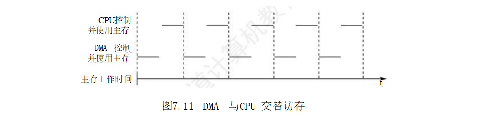

**DMA 的传送过程**

图7.12所示为DMA 的数据传送流程，分为预处理、数据传送和后处理3个阶段。

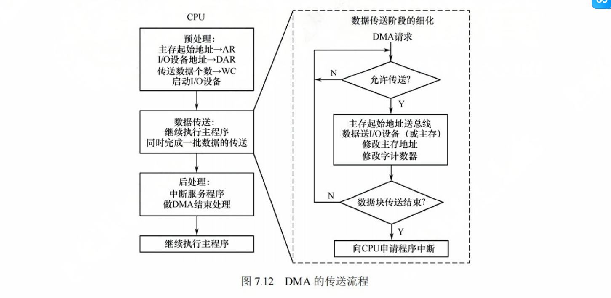

1：预处理
	由 CPU 完成一些必要的准备工作。首先，初始化DMA 控制器中的有关寄存器、设置传送方 向、测试并启动设备等。然后，CPU 继续执行原程序，直到I/O 设备准备好发送的数据(输入情 况)或接收的数据(输出情况)时，I/O 设备向DMA  控制器发送DMA  请求，再由DMA  控制器 向 CPU 发出总线请求(这两个过程也可统称DMA  请求),用以传输数据。
2：数据传送
	DMA  以数据块为基本传送单位。DMA  占用总线后的数据输入/输出操作都是通过循环来实现的，这一循环也是由DMA 控制器实现的，即数据传送阶段完全由DMA (硬件)控制。
3：后处理
	DMA 控制器向CPU 发送中断请求，CPU 执行中断服务程序做 DMA 结束处理，包括校验 数据(出错则转诊断程序)等后处理工作。
在 DMA 方式下，整个数据块的传送过程都不需要CPU 参 与 ，CPU 只在最初的DMA 控 制器初始化和最后的DMA 结束处理时才介入，因此CPU 用于I/O 的开销非常小。

### DMA 方式和中断方式的区别

①：中断方式是程序的切换，需要保护和恢复现场；而DMA 方式不中断现行程序，无须保护 现场，除了预处理和后处理，其他时候不占用任何CPU 资源。
②：对中断请求的响应只能发生在每条指令执行结束时(执行周期后);而对DMA 请求的响 应可以发生在任意一个机器周期结束时(取指、间址、执行周期后均可)。
③：中断传送过程需要CPU 的干预；而DMA  传送过程不需要CPU 的干预，因此数据传输速 率非常高，适合于高速外设的成组数据传送。

④：DMA  请求的优先级高于中断请求。
⑤：中断方式具有处理异常事件的能力，而 DMA 方式仅局限于大批数据的传送。
⑥：从数据传送来看，中断方式靠程序传送，DMA方式靠硬件传送。

### 在开中断情况下，CPU 检测到中断就一定会立即响应吗

​	在开中断情况下，CPU 总在每条指令执行结束时采样中断信号，此时若检测到中断请求信号， 则会立即响应。即便是多重中断，CPU 正在处理某个中断的过程中，因为存在中断屏蔽字，CPU   检测不到处理优先级更低的中断请求信号，所以若检测到中断请求信号，则说明新中断源的处理 优先级更高，同样也会立即响应。

### 向量中断、中断向量、向量地址

​	中断向量：每个中断源都有对应的处理程序，这个处理程序称为中断服务程序，其入口地址 称为中断向量。所有中断的中断服务程序入口地址构成一个表，称为中断向量表；也有的机器把 中断服务程序入口的跳转指令构成一张表，称为中断向量跳转表。
​	向量地址：中断向量表或中断向量跳转表中每个表项所在的内存地址或表项的索引值，称为 向量地址或中断类型号。
​	向量中断：指一种识别中断源的技术或方式。识别中断源的目的是找到中断源对应的中断服
务程序的入口地址的地址，即获得向量地址。

## 习题

```
冯 · 诺依曼机的基本工作方式是()。
A.  控制流驱动方式                  B. 多指令多数据流方式
C.   微程序控制方式                  D.   数据流驱动方式

A: 冯 ·诺依曼机的基本工作方式是控制流驱动方式，也就是按照指令的执行序列，依次读取指 令，然后根据指令所含的控制信息，调用数据信息进行处理。因此，在执行程序的过程中，始终 以控制信息流为驱动工作的因素，而数据信息流则是被动地被调用处理。
```

```
下列()是冯 · 诺依曼机工作方式的基本特点。
A.  多指令流单数据流                B. 按地址访问并顺序执行指令
C. 堆栈操作                        D. 存储器按内容选择地址

B: 选项A 是不存在的机器，选项B 是对“存储程序”的阐述，因此正确。选项C 是与题干无 关的选项。选项D 是相联存储器的特点。
```

```
下列关于机器指令和汇编指令的叙述中，错误的是()。
A.  可以直接用机器语言(机器指令)编写程序
B.   汇编指令和机器指令都能被计算机直接执行
C. 汇编语言和机器语言都与计算机系统结构相关
D.   汇编指令和机器指令一一对应，功能相同

B:计算机只能直接执行机器指令，而汇编指令需要通过汇编程序转换成机器指令才能被计算机直接执行。
```

```
以下说法中，错误的是()。
A. 计算机的机器字长是指数据运算的基本单位长度
B.   寄存器是由触发器构成的
C.  计算机中一个字的长度都是32位
D.  磁盘可以永久性存放数据和程序

C: 计算机中一个字的长度可以是16、32、64位等， 一般是8的整数倍，不一定都是32位。
```


# 操统

## 第一章 计算机系统概述

### 命令接口和程序接口

​	为让用户方便、快捷、可靠地操纵计算机硬件并运行自己的程序，操作系统还提供用户接口。 操作系统提供的接口主要分为两类：一类是命令接口，用户利用这些操作命令来组织和控制作业 的执行；另一类是程序接口，编程人员可用来请求操作系统服务。

**(1)命令接口**

​	使用命令接口进行作业控制的主要方式有两种，即联机控制方式和脱机控制方式。按作业控 制方式的不同，可将命令接口分为联机命令接口和脱机命令接口。

​	联机命令接口也称交互式命令接口，适用于分时或实时系统的接口。联机命令由一组键盘操 作命令组成。用户通过控制台或终端输入操作命令，向系统提出各种服务要求。用户每输入一条 命令，控制权就转给操作系统的命令解释程序，然后由命令解释程序解释并执行输入的命令，进 而完成指定的功能。之后，控制权转回控制台或终端，此时用户又可输入下一条命令。联机命令 接口可以这样理解：“雇主”说一句话，“工人”做一件事，并做出反馈，这就强调了交互性。

脱机命令接口也称批处理命令接口，适用于批处理系统。脱机命令由一组作业控制命令组成。

​	脱机用户不能直接干预作业的运行，而应事先用相应的作业控制命令编写一份作业操作说明书， 连同作业一起提交给系统。当系统调度到该作业时，由系统中的命令解释程序逐条解释执行作业 说明书上的命令，进而间接地控制作业的运行。脱机命令接口可以这样理解：“雇主”将要“工 人”做的事情写在清单上，“工人”按照清单逐条完成这些事情，这就是批处理。

**(2)程序接口**

​	程序接口由一组系统调用(也称广义指令)组成。用户通过在程序中使用这些系统调用来请 求操作系统为其提供服务，如使用各种外部设备、申请分配和回收内存及其他各种要求。

​	当前最流行的是图形用户界面 (GUI),  即图形接口。GUI 最终是通过调用程序接口实现的， 用户通过鼠标和键盘在图形界面上单击或使用快捷键，就能方便地使用操作系统。严格来说，图 形接口不是操作系统的一部分，但图形接口所调用的系统调用命令是操作系统的一部分。

### 中断和异常的定义

​	中断 (Interruption)   也称外中断，是指来自CPU 执行指令外部的事件，通常用于信息输入/ 输出(见第5章),如设备发出的I/O 结束中断，表示设备输入/输出处理已经完成。时钟中断， 表示一个固定的时间片已到，让处理机处理计时、启动定时运行的任务等。

​	异常 (Exception)   也称内中断，是指来自CPU 执行指令内部的事件，如程序的非法操作码、 地址越界、运算溢出、虚存系统的缺页及专门的陷入指令等引起的事件。异常不能被屏蔽， 一旦 出现，就应立即处理。关于内中断和外中断的联系与区别如图1.2所示。

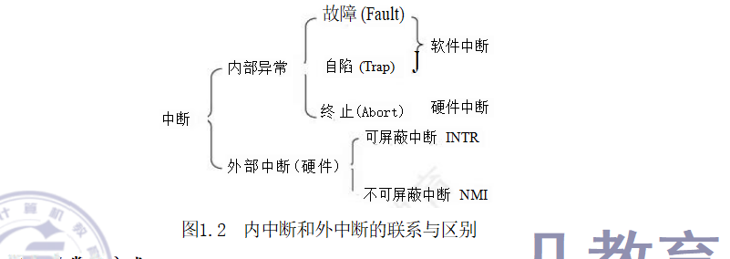

​	外中断可分为可屏蔽中断和不可屏蔽中断。 可屏蔽中断是指通过INTR 线发出的中断请求， 通过改变屏蔽字可以实现多重中断，从而使得中断处理更加灵活。 不可屏蔽中断是指通过 NMI 线发出的中断请求，通常是紧急的硬件故障，如电源掉电等。此外，异常也是不能被屏蔽的。

​	异常可分为故障、自陷和终止。故障(Fault) 通常是由指令执行引起的异常，如非法操作码、 缺页故障、除数为0、运算溢出等。自陷 (Trap,   也称陷入)是一种事先安排的“异常”事件， 用于在用户态下调用操作系统内核程序，如条件陷阱指令、系统调用指令等。终止(Abort) 是指 出现了使得CPU 无法继续执行的硬件故障，如控制器出错、存储器校验错等。故障异常和自陷异 常属于软件中断 (程序性异常),终止异常和外部中断属于硬件中断。

## 第二章 进程与线程

### 进程的创建

​	允许一个进程创建另一个进程，此时创建者称为父进程，被创建的进程称为子进程。子进程 可以继承父进程所拥有的资源。当子进程终止时，应将其从父进程那里获得的资源还给父进程。

​	在操作系统中，终端用户登录系统、作业调度、系统提供服务、用户程序的应用请求等都会 引起进程的创建。操作系统创建一个新进程的过程如下(创建原语):

​	1)为新进程分配一个唯一的进程标识号，并申请一个空白PCB(PCB  是有限的)。若PCB 申 请失败，则创建失败。

​	2)为进程分配其运行所需的资源，如内存、文件、 I/O 设备和 CPU 时间等(在PCB 中体 现)。这些资源或从操作系统获得，或仅从其父进程获得。若资源不足(如内存),则并 不是创建失败，而是处于创建态，等待内存资源。

​	3)初始化PCB, 主要包括初始化标志信息、初始化CPU 状态信息和初始化CPU 控制信息， 以及设置进程的优先级等。

​	4)若进程就绪队列能够接纳新进程，则将新进程插入就绪队列，等待被调度运行。

### 进程的终止

​	引起进程终止的事件主要有：①正常结束，表示进程的任务已完成并准备退出运行。②异常 结束，表示进程在运行时，发生了某种异常事件，使程序无法继续运行，如存储区越界、保护错、 非法指令、特权指令错、运行超时、算术运算错、I/O  故障等。③外界干预，指进程应外界的请  求而终止运行，如操作员或操作系统干预、父进程请求和父进程终止。

操作系统终止进程的过程如下(终止原语):

1)根据被终止进程的标识符，检索出该进程的PCB, 从中读出该进程的状态。

2)若被终止进程处于运行状态，立即终止该进程的执行，将CPU 资源分配给其他进程。

3)若该进程还有子孙进程，则通常需将其所有子孙进程终止(有些系统无此要求)。

4)将该进程所拥有的全部资源，或归还给其父进程，或归还给操作系统。

5)将该PCB 从所在队列(链表)中删除。

​	有些系统不允许子进程在父进程终止的情况下存在，对于这类系统，若一个进程终止，则它 的所有子进程也终止，这种现象称为级联终止。然而，不是所有操作系统都是这么设计的。

### 进程的通信

​	进程通信是指进程之间的信息交换。PV 操作(见2.3节)是低级通信方式，高级通信方式是 指以较高的效率传输大量数据的通信方式。高级通信方法主要有（共享存储、消息传递、管道通信）

#### 管道通信

​	管 道是一个特殊的共享文件，也称pipe 文件，数据在管道中是先进先出的。管道通信允许 两个进程按生产者-消费者方式进行通信(见图2.4),只要管道不满，写进程就能向管道的一端 写入数据；只要管道非空，读进程就能从管道的一端读出数据。为了协调双方的通信，管道机 制必须提供三方面的协调能力：①互斥，指当一个进程对管道进行读/写操作时，其他进程必须 等待。②同步，指写进程向管道写入一定数量的数据后，写进程阻塞，直到读进程取走数据后 再将它唤醒；读进程将管道中的数据取空后，读进程阻塞，直到写进程将数据写入管道后才将 其唤醒。③确定对方的存在。


​	在Linux 中，管道是一种使用非常频繁的通信机制。从本质上说，管道也是一种文件，但它 又和一般的文件有所不同，管道可以克服使用文件进行通信的两个问题，具体表现如下：

​	1)限制管道的大小。管道文件是一个固定大小的缓冲区，在Linux 中该缓冲区的大小为 4KB, 这使得它的大小不像普通文件那样不加检验地增长。使用单个固定缓冲区也会 带来问题，比如在写管道时可能变满，这种情况发生时，随后对管道的write() 调用将 默认地被阻塞，等待某些数据被读取，以便腾出足够的空间供write() 调用。

​	2)读进程也可能工作得比写进程快。当管道内的数据已被读取时，管道变空。当这种情况 发生时， 一个随后的read() 调用将被阻塞，等待某些数据的写入。

​	管道只能由创建进程所访问，当父进程创建一个管道后，管道是一种特殊文件，子进程会继 承父进程的打开文件，因此子进程也继承父进程的管道，并可用它来与父进程进行通信。

​	从管道读数据是一次性操作，数据一旦被读取，就释放空间以便写更多数据。普通管道只允许单向 通信，若要实现两个进程双向通信，则需要定义两个管道。

#### 信号

​	信号 ( Signal)  是一种用于通知进程发生了某个事件的机制。不同的系统事件对应不同的信 号类型，每类信号对应一个序号。例如，Linux定义了30种信号，分别用序号1～30表示。

​	在进程的PCB 中，用至少n 位向量记录该进程的待处理信号，如Linux 使用一个32位的int  型变量表示。若给某个进程发送一个信号，则把该类信号对应的位修改为1。一旦该信号被处理， 就把对应的位修改为0。此外，还用另一个 n 位向量记录被阻塞(被屏蔽)的信号。当某个位为 1时，表示该位对应的信号类型将被进程忽略，无须响应。

接下来探讨信号是如何发送的，主要有两种方式：

​	1)内核给某个进程发送信号。当内核检测到某个特定的系统事件时，就给进程发送信号。 例如，若进程使用非法指令，则内核给该进程发送SIGILL 信号(序号为4)。

​	2)一个进程给另一个进程发送信号。进程可以调用kill 函数，要求内核发送一个信号给目的 进程(需要指明接收进程的PID 和信号的序号)。当然，进程也可给自己发送信号。

​	当操作系统把一个进程从内核态切换到用户态时(如系统调用返回时),会检查该进程是否 有未被阻塞的待处理信号，若有，则强制进程接收信号，并立即处理信号(若有多个待处理信号， 则通常先处理序号更小的信号)。信号的处理方式有两种：

​	1)执行默认的信号处理程序。操作系统为每类信号预设了默认的信号处理程序。例如，收 到 SIGILL 信号的默认操作就是终止进程。

​	2)执行进程定义的信号处理程序。进程可为某类信号自定义信号处理程序。例如，进程可 以定义收到SIGILL 信号时输出“hello   world”,而不是终止进程***\*。\****

信号处理程序运行结束后，通常会返回进程的下一条指令继续执行。

### 调度的概念

**1. 调度的基本概念**

​	在多道程序系统中，进程的数量往往多于CPU 的个数，因此进程争用CPU 的情况在所难免。 CPU 调度是对 CPU 进行分配，即从就绪队列中按照一定的算法(公平、高效的原则)选择一个进程并将CPU 分配给它运行，以实现进程并发地执行。

CPU 调度是多道程序操作系统的基础，是操作系统设计的核心问题。

**调度的层次**

一个作业从提交开始直到完成，往往要经历以下三级调度，如图2.7所示。

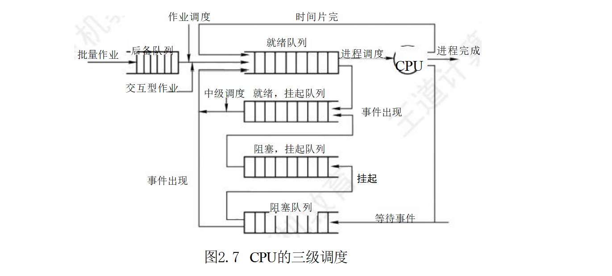

(1)高级调度(作业调度)

​	按照某种规则从外存上处于后备队列的作业中挑选一个(或多个),给它(们)分配内存、I/O 设备等必要的资源，并建立相应的进程，以使它(们)获得竞争CPU 的权利。简言之，作业 调度就是内存与辅存之间的调度。每个作业只调入一次、调出一次。

多道批处理系统中大多配有作业调度，而其他系统中通常不需要配置作业调度。

(2)中级调度(内存调度)

​	引入中级调度的目的是提高内存利用率和系统吞吐量。为此，将那些暂时不能运行的进程调 至外存等待，此时进程的状态称为挂起态。当它们已具备运行条件且内存又稍有空闲时，由中级 调度来决定将外存上的那些已具备运行条件的挂起进程再重新调入内存，并修改其状态为就绪 态，挂在就绪队列上等待。中级调度实际上是存储器管理中的对换功能。

(3)低级调度(进程调度)

​	按照某种算法从就绪队列中选取一个进程，将 CPU 分配给它。进程调度是最基本的一种调 度，在各种操作系统中都必须配置这级调度。进程调度的频率很高，一般几十毫秒一次。

### 调度的实现

**1. 调度程序(调度器)**

用于调度和分派CPU 的组件称为调度程序，它通常由三部分组成，如图2.8所示。

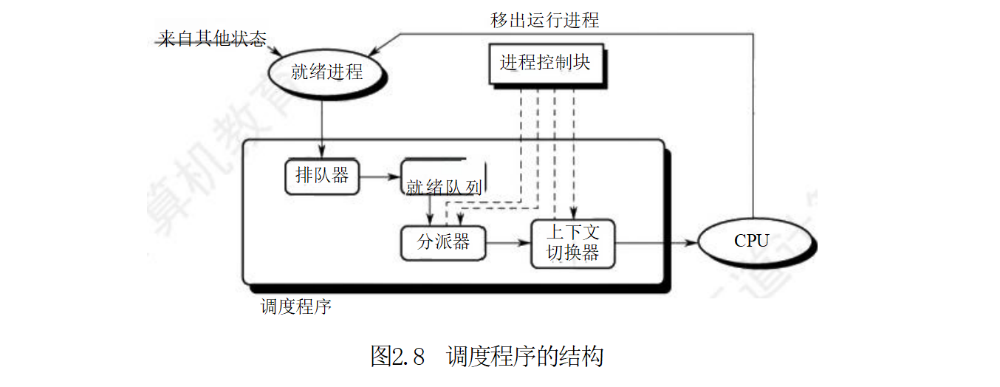

​	1)排队器。将系统中的所有就绪进程按照一定的策略排成一个或多个队列，以便于调度程 序选择。每当有一个进程转变为就绪态时，排队器便将它插入相应的就绪队列。

2)分派器。依据调度程序所选的进程，将其从就绪队列中取出，将CPU 分配给新进程。

​	3)上下文切换器。在对 CPU 进行切换时，会发生两对上下文的切换操作：第一对，将当前 进程的上下文保存到其 PCB  中，再装入分派程序的上下文，以便分派程序运行；第二对，移出 分派程序的上下文，将新选进程的CPU 现场信息装入CPU 的各个相应寄存器。

​	在上下文切换时，需要执行大量load 和store 指令，以保存寄存器的内容，因此会花费较多时间。现在已有硬件实现的方法来减少上下文切换时间。通常采用两组寄存器，其中一组 供内核使用， 一组供用户使用。这样，上下文切换时，只需改变指针，让其指向当前寄存器 组即可。

### **闲逛进程**

​	当进程切换时，若系统中没有就绪进程，则会调度闲逛进程 ( Idle  Process) 运行，它的PID  为0。若没有其他进程就绪，则该进程就一直运行，并在指令周期后测试中断。闲逛进程的优先 级最低，没有就绪进程时才会运行闲逛进程，只要有进程就绪，就会立即让出CPU。闲逛进程不需要CPU 之外的资源，它不会被阻塞。

### 基于公平原则的调度算法

(1)保证调度算法

​	保证调度算法向用户做出明确的性能保证，而非优先运行保证。一种很实际且很容易实现的 保证是：若系统中有n 个用户登录，则每个用户都保证获得1/n 的 CPU 时间；又如，若在单用户 系统中有n 个进程正在运行，则每个进程都保证获得1/n 的 CPU 时间。

为了实现保证调度算法，系统必须具有下列功能：

​	1)跟踪各个进程自创建以来已获得了多少CPU 时间。

​	2)计算各个进程应获得的CPU 时间，即自创建以来的时间除以n。

​	3)计算各个进程真正获得的CPU 时间和应获得的CPU 时间之比。若比率为0.5,则说明一 个进程只获得了应得时间的一半，而若比率为2.0,则说明它获得了应得时间的2倍。

​	4)调度比率最小的进程持续运行，直到该进程的比率超过最接近它的进程的比率为止。

(2)公平分享调度算法

​	保证对进程公平，但并不意味着对用户也公平。假设各个用户所拥有的进程数不同，如用户 1启动4个进程而用户2只启动1个进程，采用RR 调度，那么对每个进程而言很公平，用户1 得到80%的CPU 时间，而用户2只得到20%的CPU 时间，显然对用户2有失公平。

​	公平分享调度算法保证所有用户能获得相同的 CPU  时间，或所要求的时间比例。在这种方 式下，不论用户启动多少进程，都能保证每个用户分配到应得的CPU 份额。例如，系统中有两个 用户，用户1有4个进程A 、B 、C 和 D, 而用户2只有1个进程E, 若 采 用RR 调度，为保证两 个用户能获得相同的CPU 时间，一个满足条件的调度序列是

AEBECEDEAEBECEDE …

若用户1获得的CPU 时间是用户2的两倍，则可能的调度序列是

ABECDEABECDE …

### 多处理机调度

多处理机系统的调度较单处理机系统复杂，它与系统结构有关。

​	非对称多处理机 (Asymmetric    MultiProcessing,AMP) 大多采用主从式操作系统，内核驻留 在主机上，而从机上只运行用户程序，进程调度由主机负责。当从机空闲时，便向主机发送一个 索求进程的信号，在主机中有一个就绪队列，只要队列不为空，主机便从队首摘下一个进程分配 给索求进程的从机。这种分配方式实现简单，缺点是主机太忙，容易成为系统瓶颈。

​	对称多处理机 (Symmetric   MultiProcessing,SMP)的所有处理机都是相同的，因此由调度程 序将任何一个进程分配给任何一个CPU。 本节主要讨论 SMP 系统的调度问题。

**1.亲和性和负载平衡**

​	当一个进程从一个CPU 移到其他CPU 上时，应将第一个CPU 的缓存设置为无效，然后重新 填充第二个CPU 的缓存，这种操作的代价较高，因此系统应尽量避免将进程从一个CPU 移到另 一个CPU,  而应试图让一个进程运行在同一个CPU 上，这称为处理器亲和性。

​	对于SMP 系统，应尽量保证所有CPU 的负载平衡(也称负载均衡),以便充分利用多处理 机的优点，否则，一个或多个CPU 会空闲，而其他CPU 会处于高负载状态，且有一些进程处于 等待状态。负载平衡应设法将负载平均分配到SMP 系统的所有CPU 上。

​	然而，负载平衡通常会抵消处理器亲和性带来的好处，保持一个进程运行在同一个 CPU 上 的好处是可以利用它在该CPU 的缓存。而将进程从一个CPU 迁移到另一个CPU 会失去这个好处。 因此，在某些系统中，只有当不平衡达到一定程度后才移动进程。

**2.多处理机调度方案**

方案一：公共就绪队列

​	系统中仅设置一个公共就绪队列，所有 CPU  共享同一个就绪队列。这种方案很好地实现了 负载平衡，因为CPU 一旦空闲，它就立刻从公共就绪队列中选择一个进程运行。缺点是各进程可 能频繁地在不同的CPU 上运行，处理器亲和性不好。

​	提升处理器亲和性的方法有两种：软亲和和硬亲和。软亲和是指由调度程序尽量保持一个进 程到某个CPU 上，但这个进程也可以迁移到其他CPU 上。硬亲和是指由用户进程通过系统调用， 主动请求系统分配到固定的CPU 上。例如，Linux 系统实现了软亲和，也支持硬亲和的系统调用。

方案二：私有就绪队列

​	系统为每个CPU 设置一个私有就绪队列，当CPU 空闲时，就从各自的私有就绪队列中选择 一个进程运行。这种方案很好地实现了处理器亲和性，缺点是必须进行负载平衡。

​	平衡负载的方法通常有两种：推迁移和拉迁移。对于推迁移，一个特定的系统程序周期性检 查每个CPU 的负载，若发现不平衡，则从超载CPU 的就绪队列中“推”一些进程到空闲CPU 的就绪队列，从而平均分配负载。若一个CPU 负载很低，则从超载 CPU 的就绪队列中“拉”一些 进程到自己的就绪队列，发生拉迁移。在系统中，推迁移和拉迁移常被并行实现。

### 读者写者问题

①允许多个读者可以同时对文件执行读操作；

②只允许一个写者 往文件中写信息；

③任意一个写者在完成写操作之前不允许其他读者或写者工作；

④写者执行写 操作前，应让已有的读者和写者全部退出。

**读进程优先**

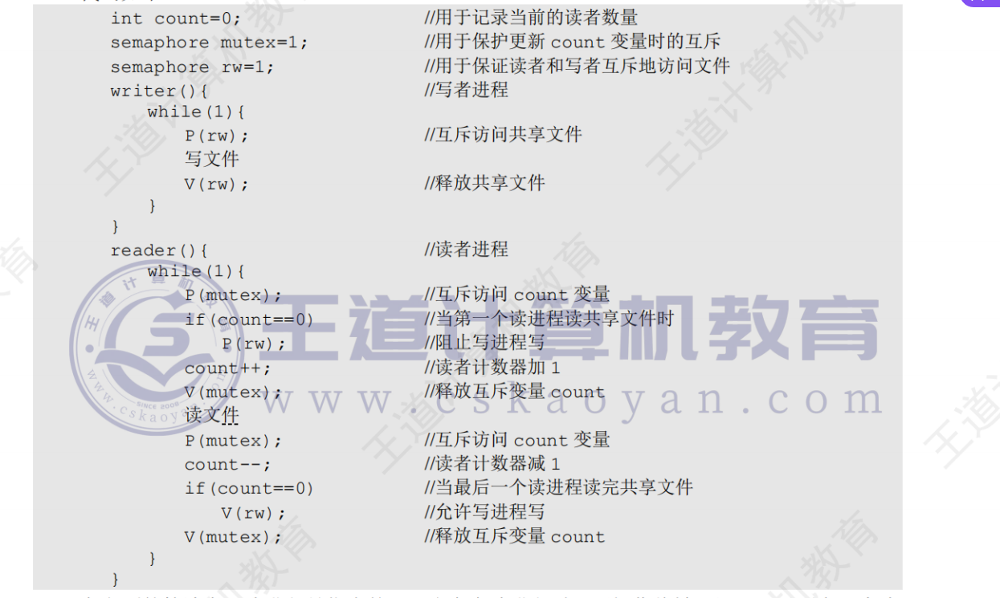

**读写公平法**

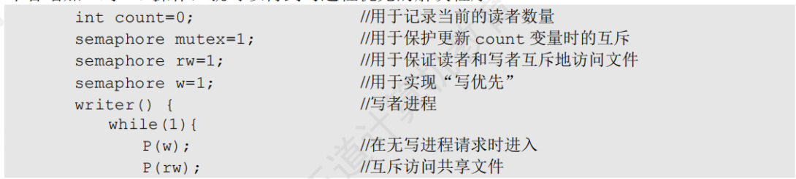

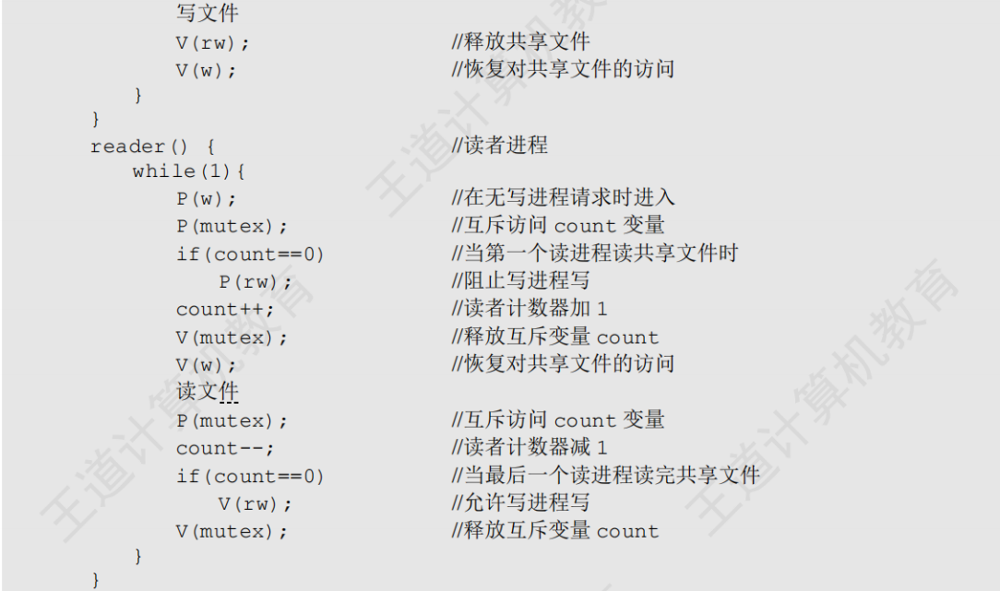

### 管程

​	在信号量机制中，每个要访问临界资源的进程都必须自备同步的PV 操作，大量分散的同步 操作给系统管理带来了麻烦，且容易因同步操作不当而导致系统死锁。于是，便产生了一种新的 进程同步工具——管程。管程的特性保证了进程互斥，无须程序员自己实现互斥，从而降低了死 锁发生的可能性。同时管程提供了条件变量，可以让程序员灵活地实现进程同步。

**管程的定义**

​	系统中的各种硬件资源和软件资源，均可用数据结构抽象地描述其资源特性，即用少量信息 和对资源所执行的操作来表征该资源，而忽略它们的内部结构和实现细节。

​	利用共享数据结构抽象地表示系统中的共享资源，而将对该数据结构实施的操作定义为一组 过程。进程对共享资源的申请、释放等操作，都通过这组过程来实现，这组过程还可以根据资源 情况，或接受或阻塞进程的访问，确保每次仅有一个进程使用共享资源，这样就可以统一管理对 共享资源的所有访问，实现进程互斥。这个代表共享资源的数据结构，以及由对该共享数据结构 实施操作的一组过程所组成的资源管理程序，称为管程(monitor) 。 管程定义了一个数据结构和 能为并发进程所执行(在该数据结构上)的一组操作，这组操作能同步进程和改变管程中的数据。

由上述定义可知，管程由4部分组成：

* 管程的名称；

* 局部于管程内部的共享数据结构说明；

* 对该数据结构进行操作的 一 组过程(或函数);

* 对局部于管程内部的共享数据设置初始值的语句。

管程的定义描述举例如下：

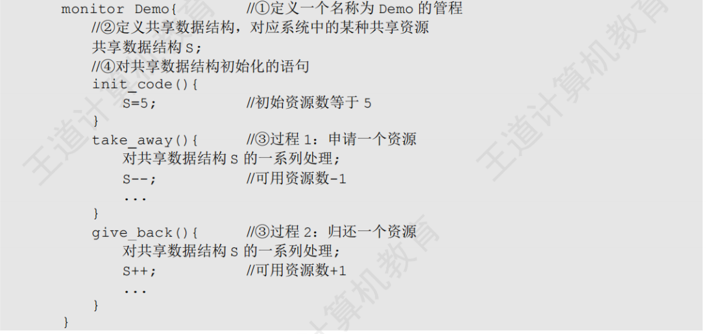

熟悉面向对象程序设计的读者看到管程的组成后，会立即联想到管程很像一个类 (class)。

​	1)管程将对共享资源的操作封装起来，管程内的共享数据结构只能被管程内的过程所访问。一个进程只有通过调用管程内的过程才能进入管程访问共享资源。对于上例，外部 进程只能通过调用take_away()过程来申请一个资源；归还资源也类似。

​	2)每次仅允许一个进程进入管程，从而实现进程互斥。若多个进程同时调用 take_away(), give_back(),则只有某个进程运行完它调用的过程后，下一进程才能开始运行它调用的过 程。即各进程只能串行执行管程内的过程，这一特性保证了进程互斥访问S。

**条件变量**

当一个进程进入管程后被阻塞，直到阻塞的原因解除时，在此期间，若该进程不释放管程， 则其他进程无法进入管程。为此，将阻塞原因定义为条件变量condition。通常，一个进程被阻 塞的原因可以有多个，因此在管程中设置了多个条件变量。每个条件变量保存了一个等待队列， 用于记录因该条件变量而阻塞的所有进程，对条件变量只能进行两种操作，即wait 和 signal。

**x.wait**：当 x 对应的条件不满足时，正在调用管程的进程调用x.wait 将自己插入x 条件的等 待队列，并释放管程。此时其他进程可以使用该管程。

**s.signal**：对应的条件发生了变化，则调用x.signal,  唤醒一个因x 条件而阻塞的进程。

下面给出条件变量的定义和使用：

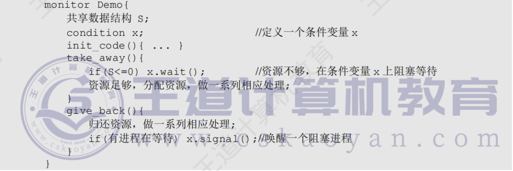

条件变量和信号量的比较：

​	相似点：条件变量的wait/signal操作类似于信号量的P/V 操作，可以实现进程的阻塞/唤醒。

​	不同点：条件变量是“没有值”的，仅实现了“排队等待”功能；而信号量是“有值”的， 信号量的值反映了剩余资源数，而在管程中，剩余资源数用共享数据结构记录。

### 死锁预防

**预防死锁的发生只需破坏死锁产生的4个必要条件之一即可。**

**破坏互斥条件**

​	若将只能互斥使用的资源改造为允许共享使用，则系统不会进入死锁状态。但有些资源根本 不能同时访问，如打印机等临界资源只能互斥使用。所以，破坏互斥条件而预防死锁的方法不太 可行，而且为了系统安全，很多时候还必须保护这种互斥性。

**破坏不可剥夺条件**

​	当一个已经保持了某些不可剥夺资源的进程，请求新的资源而得不到满足时，它必须释放已 经保持的所有资源，待以后需要时再重新申请。这意味着，进程已占有的资源会被暂时释放，或 者说是被剥夺了，从而破坏了不可剥夺条件。

​	该策略实现起来比较复杂。释放已获得的资源可能造成前一阶段工作的失效，因此这种方法 常用于状态易于保存和恢复的资源，如CPU 的寄存器及内存资源，一般不能用于打印机之类的资 源。反复地申请和释放资源既影响进程推进速度，又增加系统开销，进而降低了系统吞吐量。

**破坏请求并保持条件**

要求进程在请求资源时不能持有不可剥夺资源，可以通过两种方法实现：

​	1)采用预先静态分配方法，即进程在运行前一次申请完它所需要的全部资源。在它的资源 未满足前，不让它投入运行。在进程的运行期间，不会再提出资源请求，从而破坏了“请 求”条件。在等待期间，进程不占有任何资源，从而破坏了“保持”条件。

​	2)允许进程只获得运行初期所需的资源后，便可开始运行。进程在运行过程中再逐步释放 已分配给自己且已使用完毕的全部资源后，才能请求新的资源。

​	方法一的实现简单，但缺点也显而易见，系统资源被严重浪费，其中有些资源可能仅在运行 初期或快结束时才使用，而且会导致“饥饿”现象，由于个别资源长期被其他进程占用，将导致 等待该资源的进程迟迟不能开始运行。方法二则改进了这些缺点。

**破坏循环等待条件**

​	为了破坏循环等待条件，可以采用顺序资源分配法。首先给系统中的各类资源编号，规定每 个进程必须按编号递增的顺序请求资源，同类资源(编号相同的资源)一次申请完。也就是说， 一个进程只在已经占有小编号的资源时，才有资格申请更大编号的资源。按此规则，已持有大编 号资源的进程不可能再逆向申请小编号的资源，因此不会产生循环等待的现象。
​	这种方法的缺点：编号必须相对稳定，因此不便于增加新类型设备；尽管在编号时已考虑到 大多数进程使用这些资源的顺序，但是进程实际使用资源的顺序还是可能和编号的次序不一致， 这就会造成资源的浪费；此外，必须按规定次序申请资源，也会给用户编程带来麻烦。

### 死锁定理

死锁的条件是当且仅当S 状态的资源分配图是不可完全简化的，该条件为**死锁定理**。

在资源分配图中，用死锁定理化简后，还有边相连的那些进程就是死锁进程。

###　死锁解除

一旦检测出死锁，就应立即采取相应的措施来解除死锁。死锁解除的主要方法有：

​	1)资源剥夺法。挂起某些死锁进程，并抢占它的资源，将这些资源分配给其他的死锁进程。 但应防止被挂起的进程长时间得不到资源而处于资源匮乏的状态。

​	2)撤销进程法。强制撤销部分、甚至全部死锁进程，并剥夺这些进程的资源。撤销的原则 可以按进程优先级和撤销进程代价的高低进行。这种方式实现简单，但付出的代价可能 很大，因为有些进程可能已经接近结束，一旦被终止，以后还得从头再来。

​	3)进程回退法。让一个或多个死锁进程回退到足以回避死锁的地步，进程回退时自愿释放 资源而非被剥夺。要求系统保持进程的历史信息，设置还原点。

## 第三章 内存管理

### 程序的链接与装入

​	创建进程首先要将程序和数据装入内存。将用户源程序变为可在内存中执行的程序，通常需 要以下几个步骤：

​	编译：由编译程序将用户源代码编译成若干目标模块。

​	链接：由链接程序将编译后形成的一组目标模块，以及它们所需的库函数链接在一起，形 成一个完整的装入模块。

​	装入：由装入程序将装入模块装入内存运行。将用户程序变为可在内存中执行的程序的步骤如图3.1所示。

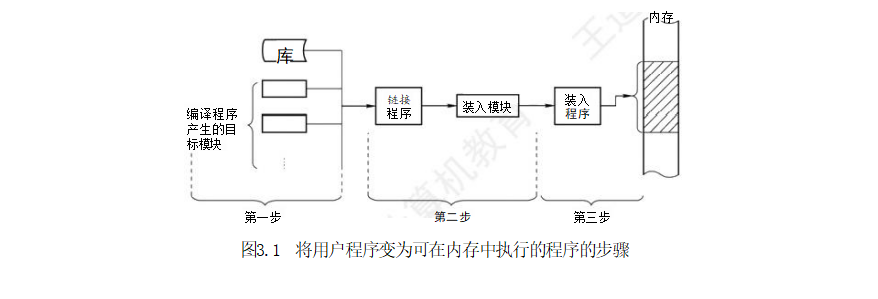

将一个装入模块装入内存时，有以下三种装入方式。
	(1) 绝对装入
	绝对装入方式只适用于单道程序环境。在编译时，若知道程序将放到内存的哪个位置，则编 译程序将产生绝对地址的目标代码。装入程序按照装入模块的地址，将程序和数据装入内存。程 序中的逻辑地址与实际内存地址完全相同，因此不需对程序和数据的地址进行修改。
程序中使用的绝对地址，可在编译或汇编时给出，也可由程序员直接赋予。而通常情况下在 程序中采用的是符号地址，编译或汇编时再转换为绝对地址。
	(2) 可重定位装入
	可重定位装入也称静态重定位。 经过编译、链接后的装入模块的始址(起始地址)通常都是 从0开始的，程序中使用的指令和数据的地址都是相对于始址而言的逻辑地址。可根据内存的当 前情况，将装入模块装入内存的适当位置。在装入时对目标程序中的相对地址的修改过程称为重 定 位，地址转换通常是在进程装入时一次完成的，如图3.2(a) 所示。
当一个作业装入内存时，必须给它分配要求的全部内存空间，若没有足够的内存，则无法装 入。作业一旦进入内存，整个运行期间就不能在内存中移动，也不能再申请内存空间。
	(3) 动态运行时装入
	动态运行时装入也称动态重定位。 程序若要在内存中发生移动，则要采用动态的装入方式。 装入程序将装入模块装入内存后，并不会立即将装入模块中的相对地址转换为绝对地址，而是将 这种地址转换推迟到程序真正要执行时才进行。因此，装入内存后的所有地址均为相对地址。这 种方式需要一个重定位寄存器(存放装入模块的起始位置)的支持，如图3 .2(b) 所 示 。
动态重定位的优点：可以将程序分配到不连续的存储区；在程序运行前只需装入它的部分代 码即可投入运行，然后在程序运行期间，根据需要动态申请分配内存；便于程序段的共享。


​	对目标模块进行链接时，根据链接的时间不同，分为以下三种链接方式。
​	(1) 静态链接
​	在程序运行之前，先将各目标模块及它们所需的库函数链接成一个完整的装入模块，以后不 再拆开。将几个目标模块装配成一个装入模块时，需要解决两个问题：①修改相对地址，编译后 的所有目标模块都是从0开始的相对地址，当链接成一个装入模块时要修改相对地址。②变换外 部调用符号，将每个模块中所用的外部调用符号也都变换为相对地址。
​	(2 )装入时动态链接
​	将用户源程序编译后所得到的一组目标模块，在装入内存时，采用边装入边链接的方式。其 优点是便于修改和更新，便于实现对目标模块的共享。

​	(3) 运行时动态链接
​	在程序执行中需要某目标模块时，才对它进行链接。凡在程序执行中未用到的目标模块，都 不会被调入内存和链接到装入模块上。其优点是能加快程序的装入过程，还可节省内存空间。

### 进程的内存映像

不同于存放在硬盘上的可执行程序文件，当一个程序调入内存运行时，就构成了进程的内 存映像。一个进程的内存映像一般有几个要素：

* 代码段：即程序的二进制代码，代码段是只读的，可以被多个进程共享。

* 数据段：即程序运行时加工处理的对象，包括全局变量和静态变量。

* 进程控制块 (PCB):  存放在系统区。操作系统通过PCB 来控制和管理进程。

* 堆：用来存放动态分配的变量。通过调用malloc函数动态地向高地址分配空间。

* 栈：用来实现函数调用。从用户空间的最大地址往低地址方向增长。

  代码段和数据段在程序调入内存时就指定了大小，而堆和栈不一样。当调用像malloc 和 free 这样的C 标准库函数时，堆可以在运行时动态地扩展和收缩。用户栈在程序运行期间也可以动态 地扩展和收缩，每次调用一个函数，栈就会增长；从一个函数返回时，栈就会收缩。图3.3是一个进程在内存中的映像。其中，共享库用来存放进程用到的共享函数库代码，如 printf()函数等。在只读代码段中，init  是程序初始化时调用的_init  函数；text 是用户程序的机器 代码；rodata 是只读数据。在读/写数据段中，.data 是已初始化的全局变量和静态变量；.bss 是未 初始化及所有初始化为0的全局变量和静态变量。

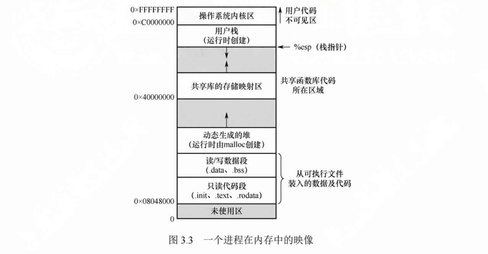


### 内存保护

​	确保每个进程都有一个单独的内存空间。内存分配前，需要保护操作系统不受用户进程的影 响，同时保护用户进程不受其他用户进程的影响。内存保护可采取两种方法：
​	1 ) 在CPU 中设置一对上、下限寄存器，存放用户进程在主存中的下限和上限地址，每当 CPU 要访问一个地址时，分别和两个寄存器的值相比，判断有无越界。
​	2) 采用重定位寄存器(也称基地址寄存器)和界地址寄存器(也称限长寄存器)进行越界检查。重定位寄存器中存放的是进程的起始物理地址，界地址寄存器中存放的是进程的 最大逻辑地址。内存管理部件将逻辑地址与界地址寄存器进行比较，若未发生地址越界， 则加上重定位寄存器的值后映射成物理地址，再送交内存单元，如图3.4所示。

​	实现内存保护需要重定位寄存器和界地址寄存器，因此要注意两者的区别。重定位寄存器 是用来“加”的，逻辑地址加上重定位寄存器中的值就能得到物理地址；界地址寄存器是用来 “比”的，通过比较界地址寄存器中的值与逻辑地址的值来判断是否越界。
​	加载重定位寄存器和界地址寄存器时必须使用特权指令，只有操作系统内核才可以加载这 两个存储器。这种方案允许操作系统内核修改这两个寄存器的值，而不允许用户程序修改。

### 分页与分段的区别

​	分页管理方式是从计算机的角度考虑设计的，目的是提高内存的利用率，提升计算机的性能。

​	分页通过硬件机制实现，对用户完全透明。分段管理方式的提出则考虑了用户和程序员，以满足 方便编程、信息保护和共享、动态增长及动态链接等多方面的需要。

### 驻留集

​	对于分页式的虚拟内存，在进程准备执行时，不需要也不可能将 一 个进程的所有页都读入主 存。因此，操作系统必须决定读取多少页，即决定给特定的进程分配几个页框。给 一 个进程分配 的页框的集合就是这个进程的驻 留 集。需要考虑以下两点：
​	1) 驻留集越小，驻留在内存中的进程就越多，可以提高多道程序的并发度，但分配给每个 进程的页框太少，会导致缺页率较高， CPU  需耗费大量时间来处理缺页。
​	1) 驻留集越大，当分配给进程的页框超过某个数量时，再为进程增加页框对缺页率的改善 是不明显的，反而只能是浪费内存空间，还会导致多道程序并发度的下降。

### 内存分配策略

​	在请求分页系统中，可采取两种内存分配策略，即固定和可变分配策略。在进行置换时，也 可采取两种策略，即全局和局部置换。于是可组合出下面三种适用的策略。

​	全局置换意味着一个进程拥有的物理块数量必然会变，因此不可能与固定分配组合。

​	(1) 固定分配局部置换
​	为每个进程分配固定数量的物理块，在进程运行期间都不改变。所谓局部置换，是指若进程 在运行中发生缺页，则只能从分配给该进程在内存的页面中选出一页换出，然后再将所缺页面调 入，以保证分配给该进程的内存空间不变。实现这种策略时，难以确定应为每个进程分配的物理 块数量：太少会频繁出现缺页中断，太多又会降低CPU 和其他资源的利用率。

​	(2) 可变分配全局置换
​	先为每个进程分配一定数量的物理块，在进程运行期间可根据情况适当地增加或减少。所谓 全局置换，是指若进程在运行中发生缺页，则系统从空闲物理块队列中取出一块分配给该进程， 并将所缺页面调入。这种方法比固定分配局部置换更加灵活，可以动态增加进程的物理块，但也 存在弊端，如它会盲目地给进程增加物理块，从而导致系统多道程序的并发能力下降。

​	(3) 可变分配局部置换
​	为每个进程分配一定数量的物理块，当某进程发生缺页时，只允许从该进程在内存的页面中 选出一页换出，因此不会影响其他进程的运行。若进程在运行中频繁地发生缺页中断，则系统再 为该进程分配若干物理块，直至该进程的缺页率趋于适当程度；反之，若进程在运行中的缺页率 特别低，则可适当减少分配给该进程的物理块，但不能引起其缺页率的明显增加。这种方法在保 证进程不会过多地调页的同时，也保持了系统的多道程序并发能力。当然它需要更复杂的实现， 也需要更大的开销，但对比频繁地换入/换出所浪费的计算机资源，这种牺牲是值得的。

### 物理块调入算法

​	采用固定分配策略时，将系统中的空闲物理块分配给各个进程，可采用下述几种算法。

​	平均分配算法，将系统中所有可供分配的物理块平均分配给各个进程。
​	按比例分配算法，根据进程的大小按比例分配物理块。优先权分配算法，为重要和紧迫的进程分配较多的物理块。通常采取的方法是将所有可 分配的物理块分成两部分：一部分按比例分配给各个进程；一部分则根据优先权分配。

### 调入页面的时机

​	为确定系统将进程运行时所缺的页面调入内存的时机，可采用以下两种调页策略：
​	1)预调页策略。 根据局部性原理，一次调入若干个相邻的页面会比一次调入一页更高效。但 若提前调入的页面中大多数都未被访问，则又是低效的。因此，可以预测不久之后可能被访问的页面，将它们预先调入内存，但目前预测成功率仅约50%。因此这种策略主要用于 进程的首次调入，由程序员指出应先调入哪些页。
​	2)请求调页策略。进程在运行中需要访问的页面不在内存，便提出请求，由系统将其所需 页面调入内存。由这种策略调入的页一定会被访问，且比较易于实现，因此目前的虚拟 存储器大多采用此策略。其缺点是每次仅调入一页，增加了磁盘I/O 开销。
预调页实际上就是运行前的调入，请求调页实际上就是运行期间的调入。

### 从何处调入页面

​	请求分页系统中的外存分为两部分：用于存放文件的文件区和用于存放对换页面的对换区， 也称交换区。对换区采用连续分配方式，而文件区采用离散分配方式，因此对换区的磁盘I/O 速 度比文件区的更快。这样，当发生缺页请求时，系统从何处将缺页调入内存就分为三种情况：

​	系统拥有足够的对换区空间。 可以全部从对换区调入所需页面，以提高调页速度。为此， 在进程运行前，需将与该进程有关的文件从文件区复制到对换区。

​	系统缺少足够的对换区空间。 凡是不会被修改的文件都直接从文件区调入；当换出这些 页面时，由于它们不会被修改而不必再换出。但对于那些可能被修改的部分，在将它们 换出时必须放在对换区，以后需要时再从对换区调入(因为读比写的速度快)。

​	UNIX   方式。与进程有关的文件都放在文件区，因此未运行过的页面都应从文件区调入。 曾经运行过但又被换出的页面，因为放在对换区，所以在下次调入时应从对换区调入。  进程请求的共享页面若被其他进程调入内存，则不需要再从对换区调入。

### 改进型CLOCK 置换算法

​	将一个页面换出时，若该页已被修改过，则要将该页写回磁盘，若该页未被修改过，则不必 将它写回磁盘。可见，对于修改过的页面，替换代价更大。在改进型 CLOCK 算法中，除考虑页 面使用情况外，还增加了置换代价——修改位。在选择页面换出时，优先考虑既未使用过又未修 改过的页面。由访问位A 和修改位 M 可以组合成下面四种类型的页面：
​	1 类A=0,M=0:        最近未被访问，且未被修改，是最佳的淘汰页。
​	2 类A =0,M=1:       最近未被访问，但已被修改，是次佳的淘汰页。
​	3 类A=1,M=0:       最近已被访问，但未被修改，可能再被访问。
​	4 类A=1,M=1:       最近已被访问，且已被修改，可能再被访问。
​	内存中的每页必定都是这四类页面之一。在进行页面置换时，可采用与简单CLOCK 算法类 似的算法，差别在于该算法要同时检查访问位和修改位。算法执行过程如下：
​	1：从指针的当前位置开始，扫描循环队列，寻找A=0 且 M=0  的1类页面，将遇到的第一 个1类页面作为选中的淘汰页。在第一次扫描期间不改变访问位A。
​	2：若第1)步失败，则进行第二轮扫描，寻找A=0  且 M=1   的2类页面。将遇到的第一个 2类页面作为淘汰页。在第二轮扫描期间，将所有扫描过的页面的访问位都置0。
​	3：若第2)步也失败，则将指针返回到开始的位置，并将所有帧的访问位复0。重复第1) 步，并且若有必要，重复第2)步，此时一定能找到被淘汰的页。
​	改进型CLOCK 算法优于简单 CLOCK 算法的地方在于，可减少磁盘的I/O 操作次数。但为 了找到一个可置换的页，可能要经过几轮扫描，即实现算法本身的开销将有所增加。
​	操作系统中的页面置换算法都有一个原则，即尽可能保留访问过的页面，而淘汰未访问过的 页面。简单的CLOCK 算法只考虑页面是否被访问过；改进型CLOCK 算法对这两类页面做了细分，分为修改过和未修改过的页面。因此，若有未使用过的页面，则当然优先将其中未修改过的 页面换出。若全部页面都使用过，还是优先将其中未修改过的页面换出。

### 抖动和工作集

1：抖动
	在页面置换过程中，一种最糟糕的情形是，刚刚换出的页面马上又要换入内存，刚刚换入的 页面马上又要换出内存，这种频繁的页面调度行为称为抖动或颠簸。

​	系统发生抖动的根本原因是，分配给每个进程的物理块太少，不能满足进程正常运行的基本 要求，致使每个进程在运行时频繁地出现缺页，必须请求系统将所缺页面调入内存。显然，对磁 盘的访问时间也随之急剧增加，造成每个进程的大部分时间都用于页面的换入/换出，而几乎不能 再去做任何有效的工作，进而导致发生CPU 利用率急剧下降并趋于零的情况。

​	抖动是进程运行时出现的严重问题，必须采取相应的措施解决它。由于抖动的发生与系统为 进程分配物理块的多少(驻留集)有关，于是又提出了关于进程工作集的概念。

2：工作集

​	工作集是指在某段时间间隔内，进程要访问的页面集合。 一般来说，工作集 W 可由时间 t 和工作集窗口尺寸△来确定。例如，某个进程对页面的访问次序如下：


​	假设工作集窗口尺寸4设置为5,则在t₁ 时刻，进程的工作集为{2,3,5},t₂ 时刻，进程的工 作集为{1,2,3,4}。实际应用中，工作集窗口会设置得很大，对于局部性好的程序，工作集大小一 般会比工作集窗口4小很多。工作集反映了进程在接下来的一段时间内很有可能频繁访问的页面 集合，因此驻留集大小不能小于工作集大小，否则进程在运行过程中会频繁缺页。

### 页框回收

​	本节是2025年大纲新增考点，2012年统考真题45题实际上已涉及页框回收，该题对页框回 收过程的描述是“被系统回收的页框，放入空闲页框链尾，其中内容在下一次分配之前不清空”, 该描述便是对页面缓冲算法中空闲页面链表的定义，因此本节主要介绍页面缓冲算法。页框回收 算法较复杂，且常见的操作系统教材中也未介绍页框回收算法的内容，而主要存在于一些深入讲 解 Linux 系统的图书中，408考查的概率也很低，因此本书不做介绍。

**1：页面缓冲算法**

在页式虚拟存储系统中，页面换入/换出的开销会对系统性能产生重大影响。
**影响页面换入/换出效率的因素主要包括：**
	1：对页面进行置换的算法。好的页面置换算法可使进程在运行过程中具有较低的缺页率， 从而减少页面换入/换出的开销。
	2：将已修改页面写回磁盘的频率。对于已被修改的页面，将其换出时，应写回磁盘。若每 当有一个页面要被换出时就将它写回磁盘，则会导致很大的磁盘 I/O 开销。
	3：将磁盘内容读入内存的频率。若进程的每次访问都要将磁盘内容读入内存，则会导致非常高的磁盘I/O 频率，进而增加页面换入的开销。

​	**页面缓冲算法**在原页面置换算法的基础上增设已修改页面链表，保存已修改且需要被换出的 页面，等被换出的页面数量达到一定值时，再一起换出到磁盘，以减少页面换出的开销。页面缓 冲算法的主要特点有：显著降低页面换入/换出的频率，使磁盘的I/O 开销大为减少，进而减小页 面换入/换出的开销；由于换入/换出的开销大幅减小，当其采用一种较简单的置换策略(如FIFO  页面置换算法)时，不需要特殊硬件的支持，实现起来非常简单。

为了显著降低页面换入/换出的频率，在内存中设置了如下两个链表：

​	1：空闲页面链表。也称空闲页框链表。 当进程需要读入一个页面时，便从空闲页面链表中 取链首的页框并装入该页。当有一个未被修改的页面要换出时，实际上并不将它换出到 磁盘，而将它所在的页框挂在空闲链表的链尾。注意，这些挂在空闲链表内且未被修改 的页框中是有数据的，若以后某个进程需要这些数据，则可从空闲链表上将它们取下， 进而避免从磁盘读入的操作，减少页面换入的开销。
​	2：修改页面链表。 当进程需要将一个已修改的页面换出时，系统并不立即将它换出到磁盘， 而将它所在的页框挂在修改页面链表的末尾。这样做的目的是降低将已修改页面写回磁 盘的频率，进而降低将磁盘内容读入内存的频率。
上述将物理页面换出的过程即为页框的回收。

**2：页框回收**

​	当系统可分配的内存不足时，就必须回收一些页框，但并非所有页框都是可以回收的。属于 内核的大部分页框(如内核栈、内核代码段、内核数据段和大部分内核使用的页框)都是不能回 收的，而由进程使用的页框(如进程代码段、进程数据段、进程堆栈、进程访问文件时映射的文 件页、进程间共享内存使用的页框)大部分是可以回收的。

​	在Linux 内核中，设置了一个负责页面换出的守护进程kswapd, 它定期检查内存的使用情况， 当空闲页框数量少于特定的阈值时，便发起页框回收操作。下面解释为什么空闲页框数量少于特 定的阈值时就要发起回收操作。例如，要释放一个页框，内核可能需要将页框的数据写回磁盘， 为此内核可能要请求一个页框来作为I/O 传送的缓冲区，而系统中不存在空闲页框，因此不可能 释放页框，此时可能导致内核陷入一种内存请求的僵局，并导致系统奔溃。

​	Linux 系统采用3.1.2节介绍的“伙伴算法”对内存中具有不同长度的连续空闲页框进行统计 和记录。将内存中连续的空闲页框视为空闲页框块，并根据它们的大小(连续页框的数量)分组。 分配页框是一个化整为零的过程，会产生很多碎片，而系统也必须有把零碎的页框合并成大的连 续页框块的机制，Linux  使用伙伴算法的逆操作进行页框的回收。回收页框时，算法先检查是否 有大小相等的伙伴页框块存在，若有，则将它们合并成一个大小为原来两倍的新空闲页框块，每 次合并完后，还要检查是否可以继续合并成更大的页框块。

### 内存映射文件

​	内存映射文件(Memo ry-Mapped  Files)是操作系统向应用程序提供的一个系统调用，它与虚 拟内存有些相似，在磁盘文件与进程的虚拟地址空间之间建立映射关系。
​	进程通过该系统调用，将一个文件映射到其虚拟地址空间的某个区域，之后就能用访问内 存的方式来读/写文件。这种功能将一个文件当作内存中的一个大字符数组来访问，而不通过文 件 I/O  操作来访问，显然更为便利。磁盘文件的读/写由操作系统负责完成，对进程而言是透明 的。在映射进程的页面时，不会实际读入文件的内容，而只在访问页面时才被每次一页地读 入。当进程退出或关闭文件映射时，所有被改动的页面才被写回磁盘文件。

​	进程可通过共享内存来通信，实际上，很多时候，共享内存是通过映射相同文件到通信进 程的虚拟地址空间来实现的。当多个进程映射到同一个文件时，各进程的虚拟地址空间都是相 互独立的，但操作系统将对应的这些虚拟地址空间映射到相同的物理内存(用页表实现),如图 3.28所示。一个进程在共享内存上完成了写操作，此刻当另一个进程在映射到这个文件的虚拟地 址空间上执行读操作时，就能立刻看到上一个进程写操作的结果。


​	由此可见，内存映射文件带来的好处主要是：①使程序员的编程更简单，已建立映射的文 件，只需按访问内存的方式进行读/写；②方便多个进程共享同一个磁盘文件。

## 第四章 文件管理

### 文件的逻辑结构

​	文件的逻辑结构是指从用户角度出发所看到的文件的组织形式。而文件的物理结构(也称存 储结构)是指将文件存储在外存上的存储组织形式，是用户所看不见的。文件的逻辑结构与存储 介质特性无关，它实际上是指在文件的内部，数据在逻辑上是如何组织起来的。
​	按逻辑结构，文件可划分为无结构文件和有结构文件两大类。

1：无结构文件
	无结构文件是最简单的文件组织形式，它是由字符流构成的文件，所以也称流式文件，其长 度以字节为单位。对流式文件的访问，是通过读/写指针来指出下一个要访问的字节。在系统中运 行的大量源程序、可执行文件、库函数等，所采用的就是无结构文件。无结构文件没有结构，因 此对记录的访问只能通过穷举搜索的方式，因此这种文件形式对很多应用不适用。

2：有结构文件
	有结构文件是指由一个以上的记录构成的文件，所以也称记录式文件。各记录由相同或不同 数量的数据项组成，根据各记录的长度是否相等，可分为定长记录和变长记录两种。

1. 定长记录。文件中所有记录的长度都是相同的，各数据项都在记录中的相同位置，具有 相同的长度。检索记录的速度快，方便用户对文件进行处理，广泛用于数据处理中。

2. 变长记录。 文件中各记录的长度不一定相同，原因可能是记录中所包含的数据项数量不 同，也可能是数据项本身的长度不定。检索记录只能顺序查找，速度慢。

   有结构文件按记录的组织形式可以分为顺序文件、索引文件、索引顺序文件。

(1) 顺序文件
	文件中的记录一个接一个地顺序排列，记录可以是定长记录或变长记录。顺序文件中记录的 排列有两种结构：①串结构，各记录之间的顺序与关键字无关，通常是按存入的先后时间进行排 列，检索时必须从头开始顺序依次查找，比较费时；②顺序结构，所有记录按关键字顺序排列， 对于定长记录的顺序文件，检索时可采用折半查找，效率较高。
	在对记录进行批量操作，即每次要读或写一大批记录时，顺序文件的效率是所有逻辑文件中最高的。此外，对于顺序存储设备(如磁带),也只有顺序文件才能被存储并能有效地工作。在 经常需要查找、修改、增加或删除单个记录的场合，顺序文件的性能较差。

(2) 索引文件
	对于定长记录的顺序文件，要查找第i 条记录，可直接根据下式计算得到第i 条记录相对于 第1条记录的地址： A₁=iL 。 然而，对于变长记录的顺序文件，要查找第i 条记录，必须顺序地 查找前i-1   条记录，以获得相应记录的长度L,  进而按下式计算出第i 条记录的地址：


​	变长记录的顺序文件只能顺序查找，效率较低。为此，可以建立一张索引表，为主文件的每个 记录在索引表中分别设置一个索引表项，其中包含指向记录的指针和记录长度，索引表按关键字排 序，因此其本身也是一个定长记录的顺序文件。索引文件示意图如图4.4所示。这样就将对变长记 录顺序文件的顺序检索，转变成了对定长记录索引文件的随机检索，从而加快了记录的检索速度。

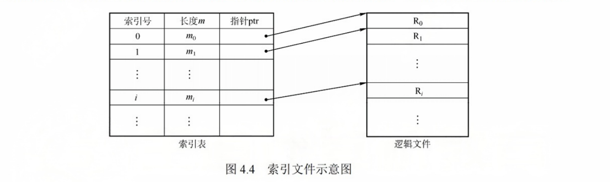

索引文件需要配置索引表，且每个记录都要有长个索引项，因此增加了存储开销。
(3)索引顺序文件
	索引顺序文件是顺序文件和索引文件的结合。最简单的索引顺序文件只使用了一级索引，先 将变长记录顺序文件中的所有记录分为若干组，然后为文件建立一张索引表，并为每组中的第一 个记录建立一个索引项，其中包含该记录的关键字和指向该记录的指针。
	图4.5所示为索引顺序文件示意图，其中主文件包含姓名和其他数据项，姓名为关键字，  记录按姓名的首字母分组，同一个组内的关键字可以无序，但是组与组之间的关键字必须有序。 将每组的第一个记录的姓名及其逻辑地址放入索引表，索引表按姓名递增排列。检索时，首先  查找索引表，找该记录所在的组，然后在该组中使用顺序查找，就能很快地找到记录。

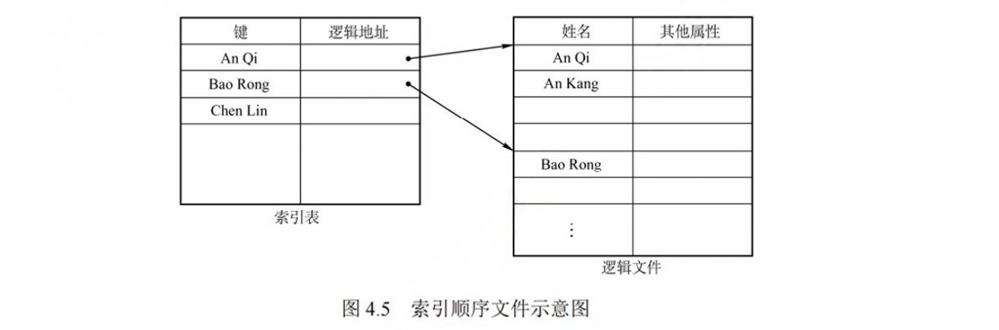

​	对于含有N 条记录的顺序文件，查找某关键字的记录时，平均需要查找N/2 次。在索引顺序文件中，假设N 条记录分为 √N 组，索引表中有 √N 个表项，每组有 √N 条记录，在查找某关键 字的记录时，先顺序查找索引表，需要查找 √N/2  次，然后在主文件对应的组中顺序查找，也需 要查找 √N/2  次，因此共需查找 √N/2+√N/2=√N        次。显然，索引顺序文件提高了查找效率， 若记录数很多，则可采用两级或多级索引。这种方式就是数据结构中的分块查找。
索引文件和索引顺序文件都提高了查找速度，但都因配置索引表而增加了存储空间。
(4)直接文件或散列文件 (Hash   File)
​	给定记录的键值或通过散列函数转换的键值直接决定记录的物理地址。散列文件具有很高的 存取速度，但是会引起冲突，即不同关键字的散列函数值可能相同。

### 文件的物理结构

​	前面说过，文件实际上是一种抽象数据类型，我们要研究它的逻辑结构、物理结构，以及关 于它的一系列操作。文件的物理结构就是研究文件的实现，即文件数据在物理存储设备上是如何 分布和组织的。同一个问题有两个方面的回答：一是文件的分配方式，讲的是对磁盘非空闲块的 管理；二是文件存储空间管理，讲的是对磁盘空闲块的管理(详见4.3节)。

​	文件分配对应于文件的物理结构，是指如何为文件分配磁盘块。常用的文件分配方法有三种： 连续分配、链接分配和索引分配。注意与文件的逻辑结构区分，从历年的经验来看，这是很多读 者容易搞混的地方(读者复习完数据结构后，可以类比线性表、顺序表和链表之间的关系)。
​	类似于内存分页，磁盘中的存储单元也被分为一个个的块，称为磁盘块，其大小通常与内存 的页面大小相同。内存与磁盘之间的数据交换(磁盘I/O)  都是以块为单位进行的。

**1. 连续分配**

​	连续分配方法要求每个文件在磁盘上占有一组连续的块(见图4.6)。磁盘地址定义了磁盘上 的一个线性排序，这种排序使进程访问磁盘时需要的寻道数和寻道时间最小。

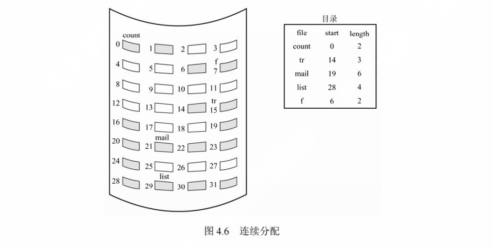

​	采用连续分配时，逻辑文件中的记录也顺序存储在相邻的物理块中。 一个文件的目录项中应 记录该文件的第一个磁盘块的块号和所占用的块数。若文件长n 块并从位置b 开始，则该文件将 占有块b,b+1,b+2,…,b+n-1,  要访问文件的第 i 块，可直接访问块b + i - 1。
连续分配的优点：

① 支持顺序访问和直接访问。

② 顺序访问容易且速度快，文件所占用的块 可能位于一条或几条相邻的磁道上，磁头的移动距离最小。

缺点：

① 要为一个文件分配连续的存 储空间，与内存分配类似，为文件分配连续的存储空间会产生很多外部碎片。

② 必须事先知道文 件的长度，也无法满足文件动态增长的要求，否则会覆盖物理上相邻的后续文件。

③ 为保持文件 的有序性，删除和插入记录时，需要对相邻的记录做物理上的移动。

**2. 链接分配**

​	链接分配是一种采用离散分配的方式。链式分配的优点：①消除了磁盘的外部碎片，提高了 磁盘的利用率。②便于动态地为文件分配盘块，因此无须事先知道文件的大小。③文件的插入、 删除和修改也非常方便。链接分配又可分为隐式链接和显式链接两种形式。

(1) 隐式链接

​	隐式链接方式如图4.7所示。目录项中含有文件第一块的指针(盘块号)和最后一块的指针。 每个文件对应一个磁盘块的链表，磁盘块分布在磁盘的任何地方。除文件的最后一个盘块外，每 个盘块都存有指向文件下一个盘块的指针，这些指针对用户是透明的。

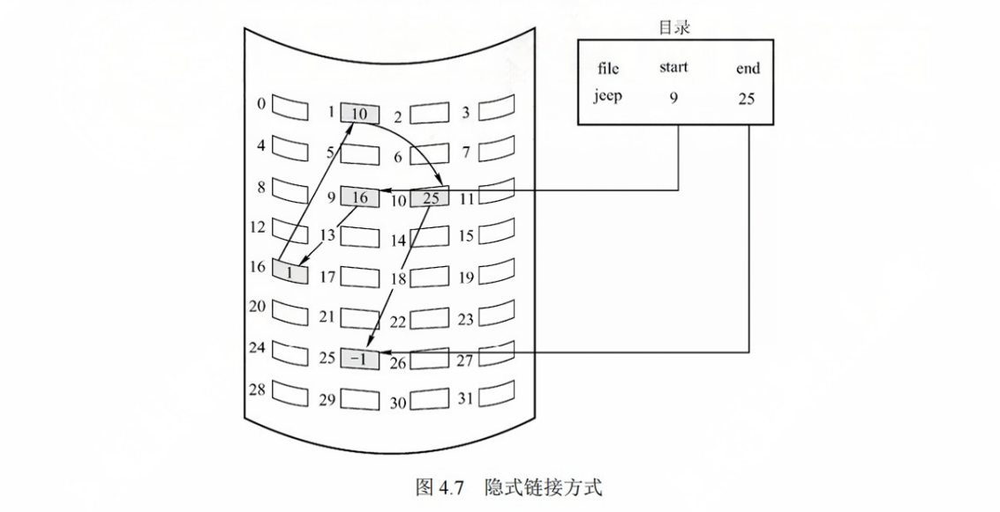

​	隐式链接的缺点：①只支持顺序访问，若要访问文件的第i 块，则只能从第1块开始，通过 盘块指针顺序查找到第i 块，随机访问效率很低。②稳定性问题，文件盘块中的任何一个指针出 问题，都会导致文件数据的丢失。③指向下一个盘块的指针也要耗费一定的存储空间。

​	为了提高查找速度和减小指针所占用的存储空间，可以将几个盘块组成一个簇，按簇而不按 块来分配，可以大幅地减少查找时间，也可以改善许多算法的磁盘访问时间。比如一簇为4块， 这样，指针所占的磁盘空间比例也要小得多。这种方法的代价是增加了内部碎片。

**(2) 显式链接**
	显式链接是指将用于链接文件各物理块的指针，显式地存放在内存的一张链接表中，该表在 整个文件系统中仅设置一张，称为文件分配表(File     Allocation     Table,FAT)。每个表项中存放指 向下一个盘块的指针。文件目录中只需记录该文件的起始块号，后续块号可通过查FAT 找到。例 如，某磁盘共有100个盘块，存放了两个文件：文件 “aaa”   占三个块，依次是2 →8 →5;文件 “bbb”占两个块，依次是7 → 1。其余盘块都是空闲块，该磁盘的文件分配表 (FAT)   如图4.8所示。

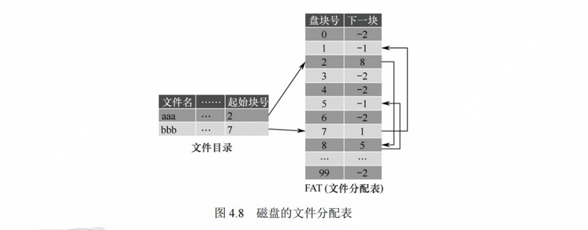

​	不难看出， FAT 的表项与全部磁盘块一一对应，并且可以用一个特殊的数字-1表示文件的 最后一块，可以用-2表示这个磁盘块是空闲的(当然也可指定为-3,-4)。因此，FAT 还标记了 空闲的磁盘块，操作系统可以通过FAT对磁盘空闲空间进行管理。当某进程请求系统分配一个磁 盘块时，系统只需从FAT 中找到-2的表项，并将对应的磁盘块分配给该进程即可。
显式链接的优点：①支持顺序访问，也支持直接访问，要访问第i 块，无须依次访问前 i - 1 块；②FAT在系统启动时就被读入内存，检索记录是在内存中进行的，因此不仅显著提高了检索 速度，还明显减少了访问磁盘的次数。 缺点：FAT 需要占用一定的内存空间。

**3. 索引分配**

**(1)单级索引分配方式**

​	事实上，在打开某个文件时，只需将该文件对应的盘块的编号调入内存即可，完全没有必要 将整个FAT 调入内存。为此，应该将每个文件所有的盘块号集中地放在一起，当访问到某个文件 时，将该文件对应的盘块号一起调入内存即可，这就是索引分配的思想。它为每个文件分配一个 索 引 块 ( 表),将分配给该文件的所有盘块号都记录在该索引块中，如图4.9所示。
​	例如，假设盘块大小为4KB, 每个盘块号占4B, 则一个索引块中可存放1024个盘块号，若 采用单级索引，则支持的最大文件为1024×4KB=4MB。
索引分配的优 点是支持直接访问，当要访问第i 块时，索引块的第i 个条目指向的便是文件 的 第i 个块。索引分配也不会产生外部碎片。 缺 点是索引块增加了额外的存储空间开销。
​	索引块的主要问题是，每个文件必须有一个索引块，当文件很小时，比如只有数个盘块，该方式仍为之分配一个索引块，此时索引块的利用率很低；当文件很大时，若其盘块号都需占用若 干个索引块，此时可通过链指针将各索引块按序链接起来，但这种方法是低效的。

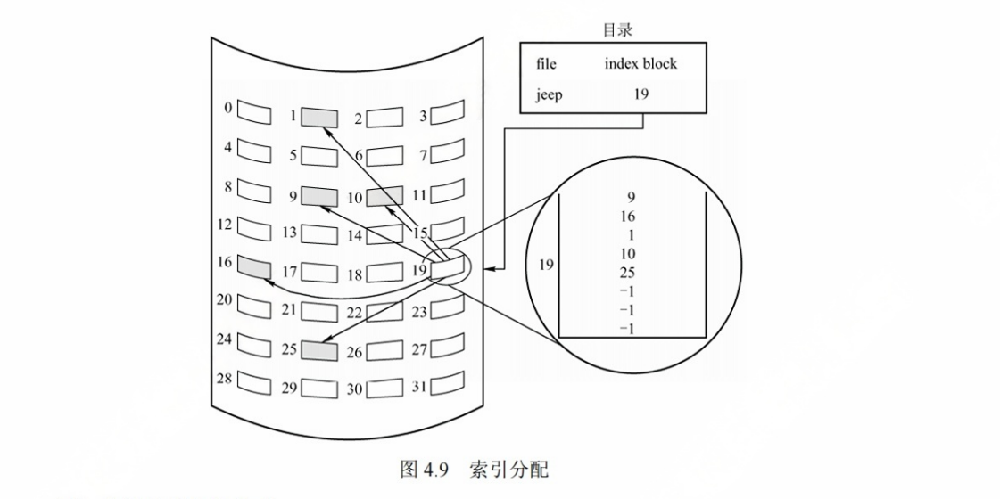

**(2) 多级索引分配方式**
	显然，当文件太大而索引块太多时，应该为这些索引块再建立一级索引，称为主索引，将第 一 个索引块的盘块号、第二个索引块的盘块号……填入该主索引表，这样，便形成了二级索引分配方 式，其原理类似于内存管理中的多级页表，如图4.10所示。查找时，通过主索引查找第二级索引，再 通过第二级索引查找所需数据块。若文件非常大，则还可使用三级、四级索引分配方式。

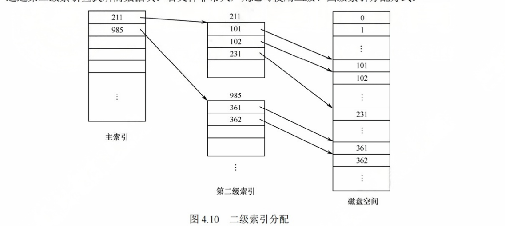

​	例如，假设盘块大小为4KB, 每个盘块号占4B, 一个索引块中可存放1024个盘块号，若采 用两级索引，则支持的最大文件为1024×1024×4KB=4GB。
多级索引的优点：极大加快了对大型文件的查找速度。缺点：当访问一个盘块时，其所需启 动磁盘的次数随着索引级数的增加而增多，即使是对数量众多的小文件也是如此。由此可见，若 在文件系统中仅采用了多级索引组织方式，则并不能获得理想的效果。

**(3)混合索引分配方式**

​	为了能够较全面地照顾到小型、中型、大型和特大型文件，可采用混合索引分配方式。对于小文件，为了提高对众多小文件的访问速度，最好能将它们的每个盘块地址直接放入FCB, 这样 就可以直接从FCB 中获得该文件的盘块地址，即为直接寻址。对于中型文件，可以采用单级索引 分配，需要先从FCB 中找到该文件的索引表，从中获得该文件的盘块地址，即为一次间址。对于 大型或特大型文件，可以采用两级和三级索引分配。UNIX  系统采用的就是这种分配方式，在其 索引节点中，共设有13个地址项，即iaddr(O)~i.addr(12),    如图4.11所示。

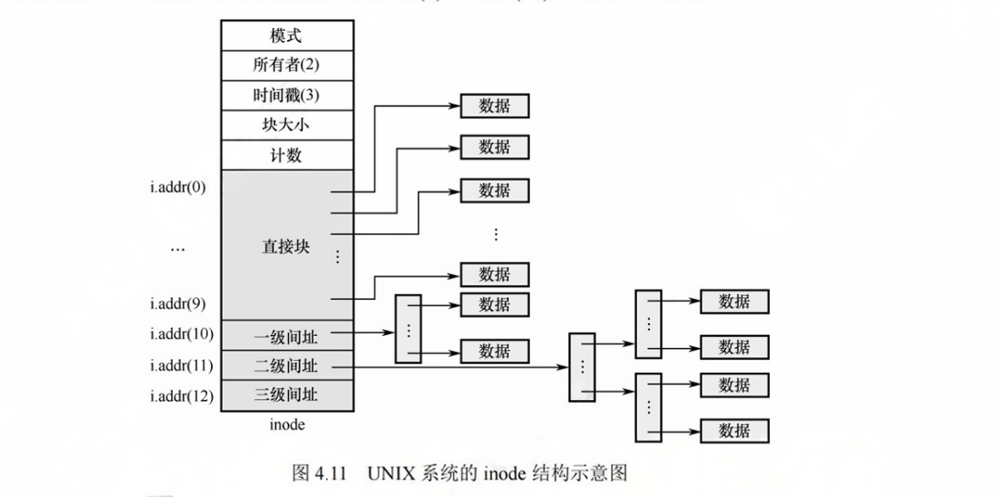

​	1：直接地址。为了提高对小文件的检索速度，在索引节点中可设置10个直接地址项，即用 i.addr(0)～i.addr(9) 来存放直接地址，即文件数据块的盘块号。假如每个盘块的大小为 4KB, 当文件不大于40KB 时，便可直接从索引节点中读出该文件的全部盘块号。
​	2：一次间接地址。对于中、大型文件，只采用直接地址并不现实的。为此，可再利用索引 节点中的地址项 i.addr(10)来提供一次间接地址，即采用一级索引分配。一次间接地址中  记录了文件的一次间址块号，一次间址块就是索引块，其中记录了文件数据块的盘块号。 一次间址块中可以存放1024个盘块号，可以表示1K×4KB=4MB   大小的文件。因此，同 时采用直接地址和一次间址，允许的文件最大长度为4MB+40KB。

​	3：多次间接地址。当文件长度大于4MB+40KB   时，还需利用地址项i.addr(11)来提供二次 间接地址，即采用两级索引分配。二次间接地址中记录了文件的主索引块号，主索引块 中记录了文件的一次间址块号。当地址项 i.addr(11) 作为二次间址块时，可以表示 1K×1K×4KB=4GB  大小的文件。因此，同时采用直接地址、一次间址和二次间址时，允 许的文件最大长度为4GB+4MB+40KB。    同理，同时采用直接地址、一次间址、二次间 址和三次间址时，允许的文件最大长度为4TB+4GB+4MB+40KB。

### 文件保护

​	解决访问控制最常用的方法是根据用户身份进行控制。而实现基于身份访问的最为普通的方 法是，为每个文件和目录增加一个访问控制列表 (Access-Control List, ACL),  以规定每个用户 名及其所允许的访问类型。这种方法的优点是可以使用复杂的访问方法，缺点是长度无法预计并 且可能导致复杂的空间管理，使用精简的访问列表可以解决这个问题。

精简的访问控制列表可采用拥有者、组和其他三种用户类型。
	1：拥有者。创建文件的用户。
	2：组。一组需要共享文件且具有类似访问的用户。
	3：其他。 系统内的所有其他用户。
	表4.1是一个访问控制列表的实例，每项占用一个二进制位，这样只需用3×4位的矩阵即可 描述这三类用户的访问权限。创建文件时，系统将文件拥有者的名字、所属组名记录在该文件的 FCB 中。用户访问该文件时，若用户是文件主，按照文件主所拥有的权限访问文件；若用户和文件主在同一个用户组，则按照同组权限访问，否则只能按其他用户权限访问。

**一个精简的访问控制列表**

| 用户类型 | 访问类型 |       |       |      |
| -------- | -------- | ----- | ----- | ---- |
| 读 取    | 写 入    | 删 除 | 执 行 |      |
| 拥有者   | 1        | 1     | 1     | 1    |
| 组       | 1        | 0     | 0     | 0    |
| 其他     | 0        | 0     | 0     | 0    |

口令和密码是另外两种访问控制方法。
	口令指用户在建立一个文件时提供一个口令，系统为其建立 FCB 时附上相应口令，同时告 诉允许共享该文件的其他用户。用户请求访问时必须提供相应的口令。这种方法时间和空间的开 销不多，缺点是口令直接存在系统内部，不够安全。
	密码指用户对文件进行加密，文件被访问时需要使用密钥。这种方法保密性强，节省了存储 空间，不过编码和译码要花费一定的时间。
口令和密码都是防止用户文件被他人存取或窃取，并没有控制用户对文件的访问类型。

​	对于多级目录结构而言，不仅需要保护单个文件，还需要保护子目录内的文件，即需要提供目录保护机制。目录操作与文件操作并不相同，因此需要不同的保护机制。

### 文件系统结构

​	文件系统 ( File system) 提供高效和便捷的磁盘访问，以便允许存储、定位、提取数据。文 件系统有两个不同的设计问题：第一个问题是，定义文件系统的用户接口，它涉及定义文件及其 属性、所允许的文件操作、如何组织文件的目录结构。第二个问题是，创建算法和数据结构，以便映射逻辑文件系统到物理外存设备。现代操作系统有多种文件系统类型，因此文件系统的层次 结构也不尽相同。图4.19是一个合理的文件系统层次结构。

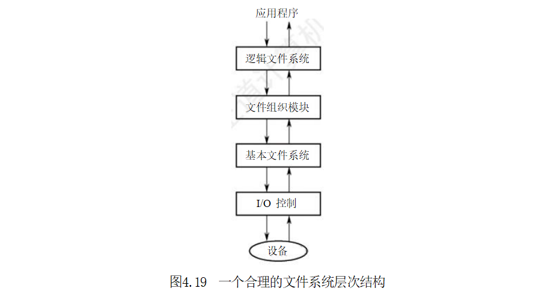

1：I/O 控制层
	包括设备驱动程序和中断处理程序，在内存和磁盘系统之间传输信息。设备驱动程序将输入 的命令翻译成底层硬件的特定指令，硬件控制器利用这些指令使I/O 设备与系统交互。设备驱动 程序告诉I/O 控制器对设备的什么位置采取什么动作。
2：基本文件系统
	向对应的设备驱动程序发送通用命令，以读取和写入磁盘的物理块。每个物理块由磁盘地址 标识。该层也管理内存缓冲区，并保存各种文件系统、目录和数据块的缓存。在进行磁盘块传输 前，分配合适的缓冲区，并对缓冲区进行管理。管理它们对于系统性能的优化至关重要。
3：文件组织模块
	组织文件及其逻辑块和物理块。文件组织模块可以将文件的逻辑块地址转换为物理块地址， 每个文件的逻辑块从0到N 编号，它与数据的物理块不匹配，因此需要通过转换来定位。文件组 织模块还包括空闲空间管理器，以跟踪未分配的块，根据需求提供给文件组织模块。
4：逻辑文件系统
	用于管理文件系统中的元数据信息。元数据包括文件系统的所有结构，而不包括实际数据(或 文件内容)。逻辑文件系统管理目录结构，以便根据给定文件名为文件组织模块提供所需要的信 息。它通过文件控制块来维护文件结构。逻辑文件系统还负责文件保护。

### 文件系统布局

**文件系统在磁盘中的结构**

文件系统存放在磁盘上，多数磁盘划分为一个或多个分区，每个分区中有一个独立的文件 系统。文件系统可能包括如下信息：启动存储在那里的操作系统的方式、总的块数、空闲块的 数量和位置、目录结构以及各个具体文件等。图4.20所示为一个可能的文件系统布局。
简单描述如下：
	1：主引导记录(Master  Boot     Record,MBR),位于磁盘的0号扇区，用来引导计算机，MBR  的后面是分区表，该表给出每个分区的起始和结束地址。表中的一个分区被标记为活动 分区。当计算机启动时，BIOS 读入并执行MBR 。MBR 做的第一件事是确定活动分区， 读入它的第一块，即引导块。

​	2：引导块 (boot block),MBR 执行引导块中的程序后，该程序负责启动该分区中的操作系 统。每个分区都是统一从一个引导块开始，即使它不含有一个可启动的操作系统，也不 排除以后会在该分区安装一个操作系统。Windows 系统称之为分区引导扇区。
除了从引导块开始，磁盘分区的布局是随着文件系统的不同而变化的。文件系统经常包 含有如图4.20所列的一些项目。
​	3：超级块 (super    block),包含文件系统的所有关键信息，在计算机启动时，或者在该文件 系统首次使用时，超级块会被读入内存。超级块中的典型信息包括分区的块的数量、块 的大小、空闲块的数量和指针、空闲的FCB 数量和FCB 指针等。
​	4：文件系统中空闲块的信息，可以用位示图或指针链接的形式给出。后面也许跟的是一组 i 节点，每个文件对应一个节点，i  节点说明了文件的方方面面。接着可能是根目录，它 存放文件系统目录树的根部。最后，磁盘的其他部分存放了其他所有的目录和文件。

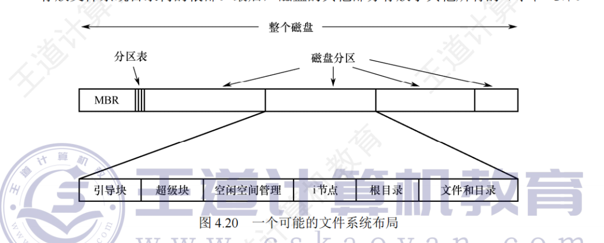

**文件系统在内存中的结构**
	内存中的信息用于管理文件系统并通过缓存来提高性能。这些数据在安装文件系统时被加 载，在文件系统操作期间被更新，在卸载时被丢弃。这些结构的类型可能包括：
1：内存中的安装表(mount    table),包含每个已安装文件系统分区的有关信息。
2：内存中的目录结构的缓存，包含最近访问目录的信息。
3：整个系统的打开文件表，包含每个打开文件的 FCB 副本、打开计数及其他信息。
4：每个进程的打开文件表，包含进程打开文件的文件描述符 (Windows  称之为文件句柄) 和指向整个系统的打开文件表中对应表项的指针。

### 成组链接法

​	空闲表法和空闲链表法都不适用于大型文件系统，因为这会使空闲表或空闲链表太大。UNIX 系统中采用的是成组链接法，它结合了上述两种方法的思想而克服“表太长”的缺点。
​	成组链接法的思想：将空闲盘块分成若干组，如每100个盘块作为一组，每组的第一个盘块 记录下一组的空闲盘块总数和空闲盘块号。这样，由各组的第一个盘块可以链接成一条链。第一组的空闲盘块总数和空闲盘块号保存在内存的专用栈中，称为空闲盘块号栈。假设系统空闲区为 第201～7999号盘块，则第一组的盘块号为201～300……次末组的盘块号为7801～7900,最末 一组的盘块号为7901～7999。最末一组只有99个盘块，它们的块号记录在前一组的7900号盘块 中，该块中存放的第一个盘块号是“0”,以作为空闲盘块链的结束标志，如图4.23所示。

简而言之，每组(除了最后一组)的第一块作为索引块，然后将这些索引块链接起来。

**盘块的分配：**
	根据空闲盘块号栈的指针，将与之对应的盘块分配给用户，同时移动指针，并将栈中的空闲 盘块数减1。若该指针指向的是栈底的盘块号，则在该盘块号对应的盘块中保存的是下一组空闲 盘块号，因此要将该盘块的内容读入栈，作为新的空闲盘块号栈的内容，并将原栈底盘块号对应 的盘块分配出去(其中有用的数据已读入栈)。
	例如，在图4.23中，分配盘块时，先依次分配201～299号盘块，当需要分配300号盘块时， 首先将300号盘块的内容读入空闲盘块号栈，然后再分配300号盘块。

**盘块的回收：**
	将回收的盘块号存入空闲盘块号栈的顶部，同时移动指针，并将栈中的空闲盘块数加1。当  栈中的空闲盘块数已达100时，表示栈已满，将现有栈中的100个空闲盘块号存入新回收的盘块， 并将该新回收的盘块号作为新栈底，再将栈中的空闲盘块数置为1。
	表示空闲空间的位向量表或空闲盘块号栈，以及卷中的目录区、文件区划分信息都要存放在 磁盘中，一般放在卷头位置，在UNIX 系统中称为超级块。在对卷中的文件进行操作前，超级块 要预先读入内存，并且经常保持主存超级块与磁盘卷中超级块的一致性。

### 虚拟文件系统

​	虚拟文件系统 (V FS)  屏蔽了不同文件系统的差异和操作细节，向上为用户提供了文件操作 的统一调用接口，如图4.24所示。当用户程序访问文件时，通过VFS 提供的统一调用函数(如 open()等)来操作不同文件系统的文件，而无须考虑具体的文件系统和实际的存储介质。
​	虚拟文件系统采用了面向对象的思想，它抽象出一个通用的文件系统模型，定义了通用文 件系统都支持的接口。新的文件系统只要支持并实现这些接口，即可安装和使用。为了实现虚 拟文件系统，系统抽象了四种对象类型。每个对象都包含数据和函数指针，这些函数指针指向 操作这些数据的文件系统的实现函数。这四种对象类型如下。
**(1) 超级块对象**
​	表示一个已安装(或称挂载)的特定文件系统。超级块对象对应于磁盘上特定扇区的文件系 统超级块，用于存储已安装文件系统的元信息。其操作方法包含一系列可在超级块对象上调用的操作函数，主要有分配inode 、销毁inode 、读 inode、写 inode 等 。

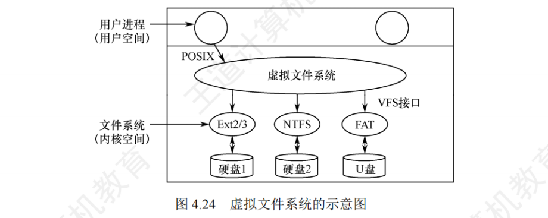

**(2) 索引节点对象**
	表示一个特定的文件。索引节点和文件是一对一的关系。只有当文件被访问时，才在内存中 创建索引节点对象，每个索引节点对象都会复制磁盘索引节点包含的一些数据。索引节点对象 还提供许多操作函数，如创建新索引节点、创建硬链接、创建新目录等。
**(3) 目录项对象**
	表示一个特定的目录项。目录项对象是一个路径的组成部分，它包含指向关联索引节点的指 针，还包含指向父目录和指向子目录的指针。不同于前面两个对象，目录项对象在磁盘上没有 对应的数据结构，而是VFS 在遍历路径的过程中，将它们逐个解析成目录项对象的。
**(4) 文件对象**
	表示一个与进程相关的已打开文件。可以通过调用open()打开一个文件，通过调用close() 关闭一个文件。文件对象和物理文件的关系类似于进程和程序的关系。文件对象仅是进程视 角上代表已打开的文件，它反过来指向其索引节点。文件对象包含与该文件相关联的自录项 对象，包含该文件的文件系统、文件指针等，还包含在该文件对象上的一系列操作函数。
	当进程发起一个面向文件的系统调用时，内核调用 VFS  中的一个函数，该函数调用目标文 件系统中的相应函数，将文件系统请求转换到面向设备的指令。以在用户空间调用write() 为例， 它在 VFS  中通过 sys_write()函数处理，sys_write() 找到具体文件系统提供的写方法，将控制权交 给该文件系统，最后由该文件系统与物理介质交互并写入数据，如图4.25所示。

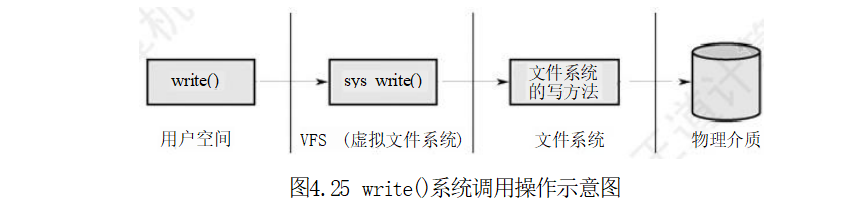

​	对用户来说，不需要关心不同文件系统的具体实现细节，只需要对一个虚拟的文件操作界 面进行操作。VFS 对每个文件系统的所有细节进行抽象，使得不同的文件系统在系统中运行的进 程看来都是相同的。严格来说，VFS 并不是一种实际的文件系统，它只存在于内存中，不存在于 任何外存空间中。VFS 在系统启动时建立，在系统关闭时消亡。

### 文件系统挂载

如文件在使用前要打开那样，文件系统在进程使用之前必须先安装，也称挂载(Mounting)。

​	将设备中的文件系统挂载到某个目录后，就可通过这个目录来访问该设备上的文件。注意，这 里的设备指的是逻辑上的设备，如一个磁盘上的不同分区都可视为不同的设备。
​	Windows 系统维护一个扩展的两级目录结构，用驱动器字母表示设备和卷。卷具有常规树 结构的目录，与驱动器号相关联，还含有指向已安装文件系统的指针。特定文件的路径形式为 driver-letter:\path\tolfile, 访问时，操作系统找到相应文件系统的指针，并遍历该设备的目录结 构，以查找指定的文件。新版的Windows 允许文件系统安装在目录树下的任意位置，就像UNIX  一样。在启动时，Windows 操作系统自动发现所有设备，并且安装所有找到的文件系统。
​	UNIX 使用系统的根文件系统，它是在系统启动时直接安装的，也是内核映像所在的文件系 统。除了根文件系统，所有其他文件系统都要先挂载到根文件系统中的某个目录后才能访问。 其他文件系统要么在系统初始化时自动安装，要么由用户挂载在已安装文件系统的目录下。安 装文件系统的这个目录称为安装点，同一个设备可以有多个安装点，同一个安装点同时只能挂 载一个设备。将设备挂载到安装点之后，通过该目录就可以读取该设备中的数据。
假定将存放在磁盘/dev/fd0 上的ext2 文件系统通过mount  命令安装到/flp:

```
mount     -t     ext2     /dev/fd0     /flp
```

如需卸载该文件系统，可以使用 umount 命令。

### 文件打开的过程描述

​	① 检索目录，要求打开的文件应该是已经创建的文件，它应登记在文件目录中，否则会出 错。在检索到指定文件后，就将其磁盘iNode 复制到活动 iNode 表中。
​	② 将参数mode 所给出的打开方式与活动iNode 中在创建文件时所记录的文件访问权限相比 较，若合法，则此次打开操作成功。
​	③ 当打开合法时，为文件分配用户打开文件表表项和系统打开文件表表项，并为后者设置 初值，通过指针建立表项与活动 iNode 之间的联系，再将文件描述符fd 返回给调用者。

## 第五章 输入/输出管理

### I/O软件层次结构

I/O  软件涉及的面很宽，往下与硬件有着密切关系，往上又与虚拟存储器系统、文件系统 和用户直接交互，它们都需要I/O 软件来实现I/O 操作。

​	为使复杂的I/O 软件能具有清晰的结构、良好的可移植性和易适应性，目前普遍采用层次结 构的 I/O 软件。将系统中的设备管理模块分为若干层次，每层都是利用其下层提供的服务，完成 输入/输出功能中的某些子功能，并屏蔽这些功能实现的细节，向高层提供服务。在层次结构的I/O 软件中，只要层次间的接口不变，对某一层次中的软件的修改都不会引起其下层或高层代码的变 更，仅最低层才涉及硬件的具体特性。 一个比较合理的层次划分如图5.5所示。整个I/O 软件可 以视为具有4个层次的系统结构，各层次及其功能如下：

**(1) 用户层软件**

​	实现与用户交互的接口，用户可直接调用在用户层提供的、与I/O 操作有关的库函数，对设 备进行操作。通常大部分的I/O 软件都在操作系统内核，但仍有一小部分在用户层，包括与用户程序链接在一起的库函数。用户层I/O 软件必须通过一组系统调用来获取操作系统服务。

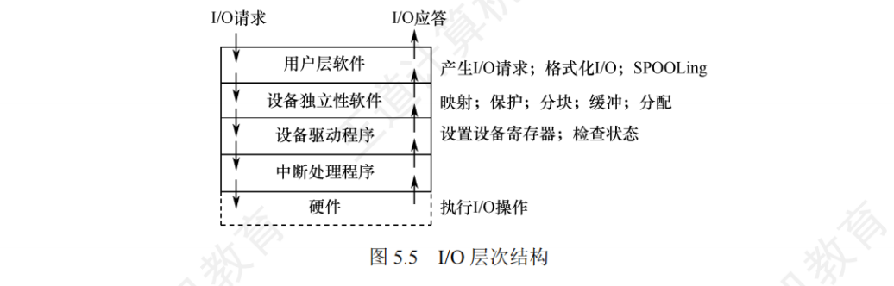

**(2) 设备独立性软件**

​	用于实现用户程序与设备驱动器的统一接口、设备命名、设备保护，以及设备的分配与释放 等 ， 同时为设备管理和数据传送提供必要的存储空间 
​	设备独立性也称设备无关性，其含义是指应用程序所用的设备不局限于某个具体的物理设 备。为实现设备独立性而引入了逻辑设备和物理设备这两个概念。在应用程序中，使用逻辑设备 名来请求使用某类设备；而在系统实际执行时，必须将逻辑设备名映射成物理设备名。
​	使用逻辑设备名的好处是：①增加设备分配的灵活性；②易于实现I/O 重定向，所谓I/O 重 定向，是指用于I/O 操作的设备可以更换(重定向),而不必改变应用程序。
​	为了实现设备独立性，必须再在驱动程序之上设置一层设备独立性软件。总体而言，设备独 立性软件的主要功能可分为以下两个方面。①执行所有设备的公有操作，包括：对设备的分配与 回收；将逻辑设备名映射为物理设备名；对设备进行保护，禁止用户直接访问设备；缓冲管理； 差错控制；提供独立于设备的大小统一的逻辑块，屏蔽设备之间信息交换单位大小和传输速率的 差异。②向用户层(或文件层)提供统一接口。无论何种设备，它们向用户所提供的接口应是相同的 。 例 如 ， 对各种设备的读 / 写操作 ， 在应用程序中都统 一 使用read/write 命令等 。

**(3) 设备驱动程序**
	与硬件直接相关，每类设备需要配置一个设备驱动程序。设备驱动程序负责具体实现系统对 设备发出的操作指令，驱动I/O 设备工作的驱动程序，它是I/O 进程与设备控制器之间的通信程 序，通常以进程的形式存在。设备驱动程序向上层用户程序提供一组标准接口，设备具体的差别 被设备驱动程序所封装，用于接收上层软件发来的抽象I/O 要求，如 read 和 write 命令，转换为 具体要求后，发送给设备控制器，控制I/O 设备工作；它也将由设备控制器发来的信号传送给上 层软件，从而为I/O内核子系统隐藏设备控制器之间的差异。
**(4)中断处理程序**
	当I/O 操作完成时，设备控制器发送一个中断信号，CPU  响应中断后，根据中断类型号找到 相应的中断处理程序进行处理，处理完后，再返回到被中断的进程。
	中断处理层的主要任务有：进行进程上下文的切换，对处理中断信号源进行测试，读取设备 状态和修改进程状态等。中断处理与硬件紧密相关，对用户而言，应尽量加以屏蔽，因此应放在 操作系统的底层，系统的其余部分尽可能少地与之发生联系。
	类似于文件系统的层次结构，I/O 子系统的层次结构也是我们需要记忆的内容，但记忆不是 死记硬背，我们以用户对设备的一次命令来总结各层次的功能，帮助各位读者记忆。

​	例如，①当用户要读取某设备的内容时，通过操作系统提供的 read 命令接口，这就经过了 用户层。②操作系统提供给用户使用的接口一般是统一的通用接口，也就是几乎每个设备都可 以响应的统一命令，如 read 命令，用户发出的 read 命令，首先经过设备独立层进行解析，然后 交往下层。③接下来，不同类型的设备对 read 命令的行为有所不同，如磁盘接收 read 命令后的 行为与打印机接收read命令后的行为是不同的。因此，需要针对不同的设备，将read 命令解析成 不同的指令，这就经过了设备驱动层。④命令解析完毕后，需要中断正在运行的进程，转而执行 read 命令，这就需要中断处理程序。⑤最后，命令真正抵达硬件设备，硬件设备的控制器按照上 层传达的命令操控硬件设备，完成相应的功能。

### 1.I/O 接口的分类

在I/O 系统与高层之间的接口中，根据设备类型的不同，又进一步分为若干类。
**(1) 字符设备接口**
	字符设备是指数据的存取和传输是以字符为单位的设备，如键盘、打印机等。基本特征是 传输速率较低、不可寻址，并且在输入/输出时通常采用中断驱动方式。
	get和 put操作，由于字符设备不可寻址，只能采取顺序存取方式，通常为字符设备建立一个 字符缓冲区，用户程序通过get 操作从缓冲区获取字符，通过put 操作将字符输出到缓冲区。
	in-control 指令，字符设备类型繁多，差异甚大，因此在接口中提供一种通用的in-control  指 令来处理它们(包含了许多参数，每个参数表示一个与具体设备相关的特定功能)。
	字符设备都属于独占设备，为此接口中还需要提供打开和关闭操作，以实现互斥共享。

**(2) 块设备接口**
	块设备是指数据的存取和传输是以数据块为单位的设备，典型的块设备是磁盘。基本特征 是传输速率较高、可寻址。磁盘设备的I/O 常采用DMA 方式。
	块设备接口支持将上层发来的打开、读、写和关闭等抽象命令，映射为设备能识别的较低层 的具体操作。块设备接口还隐藏了磁盘的二维结构，每个扇区的地址需要用磁道号和扇区号来表 示，该接口将所有扇区从0到n-1 依次编号，这样，将二维结构变为了一种线性序列。
	内存映射接口通过内存的字节数组来访问磁盘，而不提供读/写磁盘操作。映射文件到内存 的系统调用返回包含文件副本的一个虚拟内存地址。只在需要访问内存映像时，才由虚拟存储 器实际调页。内存映射文件的访问如同内存读/写一样简单，极大地方便了程序员。

**(3) 网络设备接口**
	现代操作系统都提供面向网络的功能，因此还需要提供相应的网络软件和网络通信接口， 使计算机能够通过网络与网络上的其他计算机进行通信或上网浏览。
	许多操作系统提供的网络I/O 接口为网络套接字接口，套接字接口的系统调用使应用程序创 建的本地套接字连接到远程应用程序创建的套接字，通过此连接发送和接收数据。


### 阻塞 I/O 和非阻塞 I/O

操作系统的I/O 接口还涉及两种模式：阻塞和非阻塞。
	阻塞 I/O 是指当用户进程调用 I/O 操作时，进程就被阻塞，并移到阻塞队列，I/O 操作完成 后，进程才被唤醒，移到就绪队列。当进程恢复执行时，它收到系统调用的返回值，并继续处 理数据。大多数操作系统提供的 I/O  接口都是采用阻塞 I/O 。例如，你和朋友去咖啡店买咖啡，点完单后，因为不知道咖啡什么时候做好，所以只能一直等待，其他什么事也不能干。
	优点：操作简单，实现难度低，适合并发量小的应用开发。
	缺点：I/O 执行阶段进程会一直阻塞下去。
	非阻塞I/O 是指当用户进程调用I/O 操作时，不阻塞该进程，但进程需要不断询问I/O 操作 是否完成，在 I/O 执行阶段，进程还可以做其他事情。当问到I/O 操作完成后，系统将数据从内 核复制到用户空间，进程继续处理数据。例如，你和朋友去咖啡店买咖啡，吸取了上次的教 训，点完单后顺便逛逛商场，因为担心错过取餐，所以每隔一段时间就过来询问服务员。
	优点：进程在等待I/O 期间不会阻塞，可以做其他事情，适合并发量大的应用开发。
	缺点：轮询方式询问I/O 结果，会占用CPU 的时间。

### 缓冲池

​	相比于缓冲区(仅是一块内存空间),缓冲池是包含一个用于管理自身的数据结构和一组操 作函数的管理机制，用于管理多个缓冲区。缓冲池可供多个进程共享使用。
​	缓冲池由多个系统公用的缓冲区组成，缓冲区按其使用状况可以分为：①空缓冲队列，由空 缓冲区链接而成的队列；②输入队列，由装满输入数据的缓冲区链接而成的队列；③输出队列， 由装满输出数据的缓冲区链接而成的队列。此外还应具有4种工作缓冲区：①用于收容输入数据 的工作缓冲区 (hin),②  用于提取输入数据的工作缓冲区 (sin),③  用于收容输出数据的工作缓 冲区(hout),④  用于提取输出数据的工作缓冲区 (sout),   如图5.10所示。

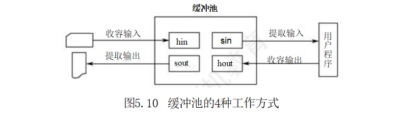

缓冲池中的缓冲区有以下4种工作方式。
	1：收容输入。 输入进程需要输入数据时，从空缓冲队列的队首摘下一个空缓冲区，作为收容输入工作缓冲区，然后将数据输入其中，装满后再将它挂到输入队列的队尾。
	2：提取输入。 计算进程需要输入数据时，从输入队列的队首取得一个缓冲区，作为提取输 入工作缓冲区，从中提取数据，用完该数据后将它挂到空缓冲队列的列尾。
	3：收容输出。计算进程需要输出数据时，从空缓冲队列的队首取得一个空缓冲区，作为收 容输出工作缓冲区，当其中装满数据后，再将它挂到输出队列的队尾。
	4：提取输出。输出进程需要输出数据时，从输出队列的队首取得一个装满输出数据的缓冲 区，作为提取输出工作缓冲区，当数据提取完后，再将它挂到空缓冲队列的队尾。

### 设备分配方式

​	1：安全分配方式。每当进程发出I/O 请求后，便进入阻塞态，直到其I/O 操作完成时才被唤 醒。这样，进程一旦获得某种设备后便会阻塞，不能再请求任何资源，而在它阻塞时也 不保持任何资源。其优点是设备分配安全，缺点是 CPU 和 I/O 设备是串行工作的。
​	2：不安全分配方式。进程在发出 I/O  请求后仍继续运行，需要时又会发出第二个、第三个 I/O 请求等。仅当进程所请求的设备已被另一进程占用时，才进入阻塞态。优点是一个进 程可同时操作多个设备，使进程推进迅速；缺点是有可能造成死锁。

### 设备分配的步骤

下面以独占设备为例，介绍设备分配的过程。
	1：分配设备。首先根据 I/O 请求中的物理设备名，查找 SDT,   从中找出该设备的 DCT,   再 根据 DCT 中的设备状态字段，可知该设备的状态。若忙，则将进程 PCB 挂到设备等待 队列中；若不忙，则根据一定的策略将设备分配给该进程。
	2：分配控制器。设备分配后，根据DCT 找到COCT,   查询控制器的状态。若忙，则将进程 PCB 挂到控制器等待队列中；若不忙，则将控制器分配给该进程。
	3：分配通道。 控制器分配后，根据COCT  找到CHCT,  查询通道的状态。若忙，则将进程 PCB  挂到通道等待队列中；若不忙，则将通道分配给该进程。只有设备、控制器和通道 都分配成功时，这次的设备分配才算成功，之后便可启动设备进行数据传送。
	在上面的例子中，进程是以物理设备名提出I/O 请求的。若指定设备已分配给其他进程，则 该进程分配失败；或者说上面的设备分配程序不具有与设备无关性。为了获得设备的独立性，进 程应使用逻辑设备名。这样，系统首先从SDT  中找出第一个该类设备的DCT。若该设备忙，则 查找第二个该类设备的DCT, 仅当所有该类设备都忙时，才将进程挂到该类设备的等待队列上。 而只要有一个该类设备可用，系统便进入进一步的分配操作。

### 逻辑设备名到物理设备名的映射

​	为了实现设备的独立性，进程中应使用逻辑设备名来请求某类设备。但是，系统只能识别物 理设备名，因此在系统中需要配置一张逻辑设备表，用于将逻辑设备名映射为物理设备名。
​	逻辑设备表 (Logical    Unit    Table,LUT) 的每个表项中包含3项内容：逻辑设备名、物理设 备名和设备驱动程序的入口地址。当进程用逻辑设备名来请求分配设备时，系统会为它分配一台 相应的物理设备，并在LUT 中建立一个表目，填上相应的信息，当以后进程再利用该逻辑设备名 请求I/O 操作时，系统通过查找LUT 来寻找对应的物理设备及其驱动程序。
在系统中，可采取两种方式设置逻辑设备表：
​	1：整个系统中只设置一张LUT 。如图5.13(a) 所示。所有进程的设备分配情况都记录在同一 张 LUT 中，这就要求所有用户不能使用相同的逻辑设备名，主要适用于单用户系统。
​	2：为每个用户设置一张LUT。如图5.13(b)所示。系统为每个用户设置一张LUT,   同时在多 用户系统中都配置系统设备表。因此，不同用户可以使用相同的逻辑设备名。

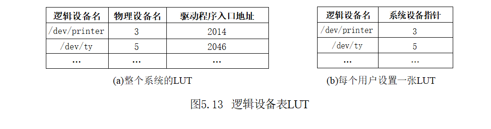

### SPOOLing 技术(假脱机技术)

​	为了缓和 CPU 的高速性与I/O 设备的低速性之间的矛盾，引入了假脱机技术，它是操作系统 中采用的一项将独占设备改造成共享设备的技术。该技术利用专门的外围控制机，先将低速 I/O  设备上的数据传送到高速磁盘上，或者相反。当CPU 需要输入数据时，便可直接从磁盘中读取数 据；反之，当CPU 需要输出数据时，也能以很快的速度将数据先输出到磁盘上。引入多道程序技 术后，系统便可利用程序来模拟脱机输入/输出时的外围控制机，在主机的直接控制下实现脱机输 入/输出功能。SPOOLing 系统的组成如图5.14所示。

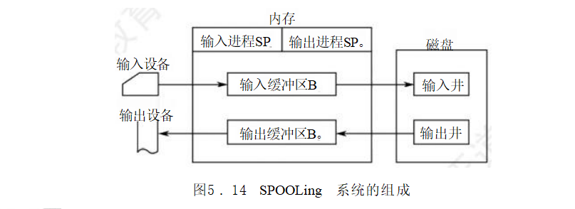

**(1) 输入井和输出井**
	在磁盘上开辟出的两个存储区域。输入井模拟脱机输入时的磁盘，用于收容I/O 设备输入的 数据。输出井模拟脱机输出时的磁盘，用于收容用户程序的输出数据。一个进程的输入(或输出) 数据保存为一个文件，所有进程的输入(或输出)文件链接成一个输入(或输出)队列。

**(2) 输入缓冲区和输出缓冲区**
	在内存中开辟的两个缓冲区。输入缓冲区用于暂存由输入设备送来的数据，以后再传送到输 入井。输出缓冲区用于暂存从输出井送来的数据，以后再传送到输出设备。

**(3) 输入进程和输出进程**
	输入进程用于模拟脱机输入时的外围控制机，将用户要求的数据从输入设备传送到输入缓冲 区，再存放到输入井中。当CPU 需要输入数据时，直接从输入井读入内存。输出进程用于模拟脱 机输出时的外围控制机，将用户要求输出的数据从内存传送到输出井，待输出设备空闲时，再将 输出井中的数据经输出缓冲区输出至输出设备。

**(4) 井管理程序**
用于控制作业与磁盘井之间信息的交换。
	打印机是典型的独占设备，利用SPOOLing 技术可将它改造为一台可供多个用户共享的打印 设备。当多个用户进程发出打印输出请求时，SPOOLing  系统同意它们的请求，但并不真正立即 将打印机分配给它们，而由假脱机管理进程为每个进程做如下两项工作：
	1：在磁盘缓冲区中为进程申请一个空闲盘块，并将要打印的数据送入其中暂存。
	2：为用户进程申请一张空白的用户请求打印表，并将用户的打印要求填入其中，再将该表 挂到假脱机文件队列上。
	对每个用户进程而言，系统并非即时执行真实的打印操作，而只是即时将数据输出到缓冲区， 这时的数据并未被真正打印，而只让用户感觉系统已为它打印，真正的打印操作是在打印机空闲 且该打印任务在等待队列中已排到队首时进行的。以上过程用户是不可见的。虽然系统中只有一 台打印机 ， 但当进程提出打印请求时 ， 系统都会在输出井中为其分配一个缓冲区(相当于分配一台逻辑设备),使每个进程都觉得自己在独占一台打印机，从而实现对打印机的共享。
	SPOOLing 系统的特点：①提高了 I/O 速度，将对低速I/O 设备执行的操作演变为对磁盘缓 冲区中数据的存取操作，如同脱机输入/输出一样，缓和了CPU 和低速 I/O 设备之间速度不匹配 的矛盾；②将独占设备改造为共享设备，在假脱机打印机系统中，实际上并没有为任何进程分配 设备；③实现了虚拟设备功能，对每个进程而言，它们都认为自己独占了一台设备。
	SPOOLing 技术是一种以空间换时间的技术，我们很容易理解它牺牲了空间，因为它开辟了 磁盘上的空间作为输入井和输出井，但它又是如何节省时间的呢?
	从前述内容我们了解到，磁盘是一种高速设备，在与内存交换数据的速度上优于打印机、键  盘、鼠标等中低速设备。试想一下，若没有SPOOLing 技术，CPU 要向打印机输出要打印的数据， 打印机的打印速度比较慢，CPU 就必须迁就打印机，在打印机将数据打印完后才能继续做其他的 工作，浪费了CPU 的不少时间。在SPOOLing 技术下，CPU 要打印机打印的数据可以先输出到  磁盘的输出井中(这个过程由假脱机进程控制),然后做其他的事情。若打印机此时被占用，则  SPOOLing  系统就会将这个打印请求挂到等待队列上，待打印机有空时再将数据打印出来。向磁 盘输出数据的速度比向打印机输出数据的速度快，因此就节省了时间。

### 设备驱动程序接口

​	设备驱动程序是I/O 系统的上层与设备控制器之间的通信程序，其主要任务是接收上层应用 发来的抽象I/O 请求，如 read 或 write 命令，将它们转换为具体要求后发送给设备控制器，进而 使其启动设备去执行任务；反之，它也将设备控制器发来的信号传送给上层应用。

​	为了实现上层应用与设备控制器之间的通信，设备驱动程序应具有以下功能：① 接收由上 层软件发来的命令和参数，并将抽象要求转换为与设备相关的具体要求。例如，将抽象要求中 的盘块号转换为磁盘的盘面号、磁道号和扇区号。② 检查用户I/O 请求的合法性，了解设备的工 作状态，传递与设备操作有关的参数，设置设备的工作方式。③ 发出I/O 命令，若设备空闲，则 立即启动它，完成指定的I/O 操作；若设备忙，则将请求者的PCB 挂到设备队列上等待。④ 及时响应由设备控制器发来的中断请求，并根据其中断类型，调用相应的中断处理程序进行处理。

​	相比于普通的应用程序和系统程序，设备驱动程序具有以下差异：① 设备驱动程序将抽象 的 I/O 请求转换成具体的I/O 操作后，传送给设备控制器，并将设备控制器中记录的设备状态和 I/O 操作的完成情况及时地反馈给请求进程。② 设备驱动程序与设备采用的 I/O 控制方式紧密相 关，常用的 I/O 控制方式是中断驱动方式和 DMA 方式。③ 设备驱动程序与硬件密切相关，对于 不同类型的设备，应配置不同的设备驱动程序。④ 由于设备驱动程序与硬件紧密相关，目前很 多设备驱动程序的基本部分已固化在ROM 中。⑤设备驱动程序应允许同时多次调用执行。
​	为了使所有的设备驱动程序都有统一的接口，一方面，要求每个设备驱动程序与操作系统 之间都有相同或相近的接口，以便更容易地添加一个新的设备驱动程序，同时更容易地编制设 备驱动程序；另一方面，要将抽象的设备名转换为具体的物理设备名，并且进一步找到相应的 设备驱动程序入口。此外，还应对设备进行保护，防止无权访问的用户使用设备。

### I/O操作举例

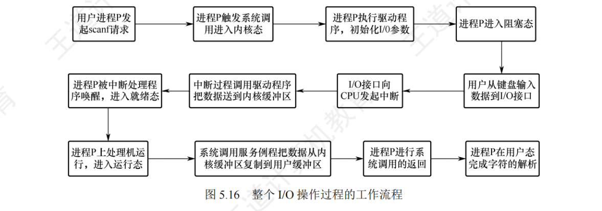

​	值得注意的是，在整个过程中，用户输入的字符首先从键盘I/O 接口中的数据端口送到内核 缓冲区，然后从内核缓冲区送到用户缓冲区，其中第一个过程是由设备驱动程序完成的，因为这 需要和I/O 端口直接打交道，第二个过程是由普通的内核程序(属于设备无关软件层)完成的， 因为这和具体的硬件没有关系。数据的流向如图5.17所示。

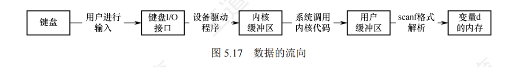

### 磁盘的管理

**1：磁盘初始化**

一个新的磁盘只是一个磁性记录材料的空白盘。在磁盘可以存储数据之前，必须将它分成扇 区，以便磁盘控制器能够进行读/写操作，这个过程称为低级格式化(也称物理格式化)。每个扇 区通常由头部、数据区域和尾部组成。头部和尾部包含了一些磁盘控制器的使用信息，其中利用 磁道号、磁头号和扇区号来标志一个扇区，利用CRC 字段对扇区进行校验。
大多数磁盘在工厂时作为制造过程的一部分就已低级格式化，这种格式化能够让制造商测试  磁盘，并且初始化逻辑块号到无损磁盘扇区的映射。对于许多磁盘，当磁盘控制器低级格式化时， 还能指定在头部和尾部之间留下多长的数据区，通常选择256字节或512字节等。

**2：分区**

​	在可以使用磁盘存储文件之前，还要完成两个步骤。第一步是，将磁盘分区(我们熟悉的 C 盘、D 盘等形式的分区),每个分区由一个或多个柱面组成，每个分区的起始扇区和大小都记录 在磁盘主引导记录的分区表中。第二步是，对物理分区进行逻辑格式化(也称高级格式化),将 初始的文件系统数据结构存储到磁盘上，这些数据结构包括空闲的空间和已分配的空间，以及一个初始为空的目录，建立根目录、对保存空闲磁盘块信息的数据结构进行初始化。

​	因为扇区的单位太小，为了提高效率，操作系统将多个相邻的扇区组合在一起，形成一簇(在 Linux 中称为块)。为了更高效地管理磁盘，一簇只能存放一个文件的内容，文件所占用的空间只 能是簇的整数倍；若文件大小小于一簇(甚至是0字节),则也要占用一簇的空间。

**3：引导块**
	计算机启动时需要运行一个初始化程序(自举程序),它初始化CPU 、寄存器、设备控制器 和内存等，接着启动操作系统。为此，自举程序找到磁盘上的操作系统内核，将它加载到内存， 并转到起始地址，从而开始操作系统的运行。
	自举程序通常存放在ROM  中，为了避免改变自举代码而需要改变ROM  硬件的问题，通常 只在ROM 中保留很小的自举装入程序，而将完整功能的引导程序保存在磁盘的启动块上，启动 块位于磁盘的固定位置。具有启动分区的磁盘称为启动磁盘或系统磁盘。
	引导ROM  中的代码指示磁盘控制器将引导块读入内存，然后开始执行，它可以从非固定的  磁盘位置加载整个操作系统，并且开始运行操作系统。下面以 Windows  为例来分析引导过程。  Windows 允许将磁盘分为多个分区，有一个分区为引导分区，它包含操作系统和设备驱动程序。 Windows 系统将引导代码存储在磁盘的第0号扇区，它称为主引导记录 (MBR  )。引导首先运行  ROM 中的代码，这个代码指示系统从MBR 中读取引导代码。除了包含引导代码，MBR 还包含  一个磁盘分区表和一个标志(以指示从哪个分区引导系统),如图5.20所示。当系统找到引导分  区时，读取分区的第一个扇区，称为引导扇区，并继续余下的引导过程，包括加载各种系统服务。

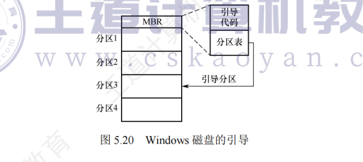

**4：坏块**
	磁盘有移动部件且容错能力弱，因此容易导致一个或多个扇区损坏。部分磁盘甚至在出厂时 就有坏块。根据所用的磁盘和控制器，对这些块有多种处理方式。
	对于简单磁盘，如采用IDE 控制器的磁盘，坏块可手动处理，如MS-DOS 的 Format 命令执 行逻辑格式化时会扫描磁盘以检查坏块。坏块在FAT 表上会标明，因此程序不会使用它们。
	对于复杂的磁盘，控制器维护磁盘内的坏块列表。这个列表在出厂低级格式化时就已初始化， 并在磁盘的使用过程中不断更新。低级格式化将一些块保留作为备用，操作系统看不到这些块。  控制器可以采用备用块来逻辑地替代坏块，这种方案称为扇区备用。
对坏块的处理实质上就是用某种机制使系统不去使用坏块。

### 增加设备分配的灵活性、成功率

可以从以下两方面对基本的设备分配程序加以改进：
	1：增加设备的独立性。进程使用逻辑设备名请求I/O。 这样，系统首先从 SDT  中找出第一 个该类设备的DCT 。若该设备忙，则又查找第二个该类设备的DCT 。仅当所有该类设备 都忙时，才将进程挂到该类设备的等待队列上；只要有一个该类设备可用，系统便进一 步计算分配该设备的安全性。
	2：考虑多通路情况。为防止I/O 系统的“瓶颈”现象，通常采用多通路的I/O 系统结构。此 时对控制器和通道的分配同样要经过几次反复，即若设备(控制器)所连接的第一个控 制器(通道)忙时，则应查看其所连接的第二个控制器(通道),仅当所有控制器(通道) 都忙时，此次的控制器(通道)分配才算失败，才将进程挂到控制器(通道)的等待队 列上。而只要有一个控制器(通道)可用，系统便可将它分配给进程。

​	设备分配过程中，先后分别访问的数据结构为 SDT→DCT→COCT→CHCT 。 要成功分配一 个设备，必须要：①设备可用；②控制器可用；③通道可用。所以，“设备分配，要过三关”。

### 用户缓冲区、内核缓冲区

​	用户缓冲区是指当用户进程读文件时，通常先申请一块内存数组，称为Buffer,    用来存放读 取的数据。每次read 调用，将读取的数据写入Buffer,   之后程序都从buffer 中获取数据，当buffer  使用完后，再进行下一次调用，填充 buffer。可见，用户缓冲区的目的是减少系统调用次数，从 而降低系统在用户态与内核态之间切换的开销。
​	内核也有自己的缓冲区。当用户进程从磁盘读取数据时，不直接读磁盘，而将内核缓冲区中 的数据复制到用户缓冲区中。若内核缓冲区中没有数据，则内核请求从磁盘读取，然后将进程挂  起，为其他进程服务，等到数据已读取到内核缓冲区中时，将内核缓冲区中的数据复制到用户进 程的缓冲区，才通知进程(当然， I/O 模型不同，处理的方式也不同)。当用户进程需要写数据时， 数据可能不直接写入磁盘，而将数据写入内核缓冲区，时机适当时(如内核缓冲区的数据积累到 一定量后),内核才将内核缓冲区的数据写入磁盘。可见，内核缓冲区是为了在操作系统级别提 高磁盘I/O 效率，优化磁盘写操作。

# 计网

## 第一章 计算机网络体系结构

### internet、Internet

​	**internet** (互连网)是一个通用名词，泛指由多个计算机网络互连而成的计算机网络。在这 些网络之间可以使用任意的通信协议作为通信规则，不一定非要使用 TCP/IP。

​	**Internet**: (互联网或因特网)则是一个专用名词，指当前全球最大的、开放的、由众多网络 和路由器互连而成的特定计算机网络，它采用TCP/IP 族作为通信规则。

### 协议数据单元

协议数据单元(PDU): 对等层之间传送的数据单位。第n 层的PDU 记为n-PDU。 各层的 PDU 都分为服务数据单元和协议控制信息两部分。

服务数据单元(SDU):   层与层之间交换的数据单位。第n 层的 SDU 记为n-SDU。

协议控制信息(PCI): 控制协议操作的信息。第n 层的PCI 记为n-PCI。

### 协议

​	要在网络中做到有条不紊地交换数据，就必须遵循一些事先约定好的规则，其规定了所交换 数据的格式及有关的同步问题。为了在网络中进行数据交换而建立的这些规则、标准或约定称为 网络协议 (Network   Protocol),是控制在对等实体之间进行通信的规则的集合，是水平的。不对 等实体之间是没有协议的，如用TCP/IP 栈通信的两个节点A 和节点B,  节 点A 的传输层和节点 B的传输层之间存在协议，但节点A 的传输层和节点B 的网络层之间不存在协议。

协议由语法、语义和同步三部分组成。

​	1)语法。数据与控制信息的格式。例如，TCP 报文段格式就是由TCP 的语法定义的。

​	2)语义。即需要发出何种控制信息、完成何种动作及做出何种应答。例如，在建立TCP 连 接时每次握手所执行的操作就是由TCP 的语义定义的。

​	3)同步(或时序)。执行各种操作的条件、时序关系等，即事件实现顺序的详细说明。例如， 建立 TCP 连接的三次握手操作的时序关系就是由TCP 的同步定义的。

### 会话层

​	会话层允许不同主机上的各个进程之间进行会话。这种服务主要为表示层实体或用户进程建 立连接，并在连接上有序地传输数据，这就是会话，也称建立同步 (SYN) 。 会话层负责管理主机间的会话进程，包括建立、管理和终止进程间的会话。会话层包含一种称为检查点的机制来维 持可靠会话，使通信会话在通信失效时从检查点继续恢复通信，即断点下载的原理。

### 表示层

​	表示层主要处理在不同主机中交换信息的表示方式。不同机器采用的编码和表示方法不同， 为了使不同表示方法的数据和信息之间能够互相交换，表示层采用抽象的标准方法定义数据结 构，并采用标准的编码形式。此外，数据压缩、加密和解密也是表示层的功能。

## 第二章 物理层

### 信道的极限容量

​	任何实际的信道都不是理想的，信号在信道上传输时会不可避免地产生失真。但是，只要 接收端能够从失真的信号波形中识别出原来的信号，这种失真对通信质量就没有影响。但是，若信号失真很严重，接收端就无法识别出每个码元。码元的传输速率越高，或者信号的传输距 离越远，或者噪声干扰越大，或者传输介质的质量越差，接收端波形的失真就越严重。

**奈奎斯特定理(奈氏准则)**

​	具体的信道所能通过的频率范围总是有限的。信号中的许多高频分量往往不能通过信道， 否则在传输中就会衰减，导致接收端收到的信号波形失去码元之间的清晰界限，这种现象称为 码间串扰。奈奎斯特定理规定：在理想低通(没有噪声、带宽有限)信道中，为了避免码间串 扰，极限码元传输速率为2W波 特，其中 W 是信道的频率带宽(单位为Hz) 。 若 用V 表示每个 码元的离散电平数量(码元的离散电平数量是指有多少种不同的码元，若有16种不同的码元， 则需要4个二进制位，因此数据传输速率是码元传输速率的4倍),则极限数据传输速率为

```
理想低通信道的极限数据传输速率=2Wlog₂V   ( 单 位 为b/s) 
```

**对于奈氏准则，有以下结论：**

1)在任何信道中，码元传输速率是有上限的。若传输速率超过上限，则会出现严重的码间 串扰问题，使得接收端无法完全正确地识别码元。

2)信道的带宽越大，则传输码元的能力越强。

3)奈氏准则给出了码元传输速率的限制，但并未限制信息传输速率，即未对一个码元最多 可以携带多少比特给出限制。

因为码元传输速率受奈氏准则制约，所以要提高数据传输速率，就要设法使每个码元携带更 多比特的信息量，此时需要采用多元制的调制方法。

**香农定理**

​	实际的信道会有噪声，噪声是随机产生的。香农定理给出了带宽受限且有高斯噪声干扰的信 道的极限数据传输速率，当用该速率传输数据时，不会产生误差。香农定理定义为:

```
信道的极限数据传输速率=Wlog₂ (1+SIN)     (单位为b/s)
```

​	上式中，W为信道的频率带宽(单位为Hz),  S为信道内所传输信号的平均功率， N为信道内的高斯噪声功率。S/N 为信噪比，即信号的平均功率与噪声的平均功率之比，信噪比有两种表示形式：无单位记法和分贝(dB)   记法。当采用无单位记法时，信噪比=S/N;  当采用分贝记法时，信噪比 =             10log₁₀(S/N)  (单位为dB),   例如，当S/N=1000  时，信噪比为30dB。注意，在使用香农定 理计算信道的极限数据传输速率时，信噪比应采用无单位记法。

对于香农定理，有以下结论：

1)信道的带宽或信道中的信噪比越大，信息的极限传输速率越高。

2)对一定的传输带宽和一定的信噪比，信息传输速率的上限是确定的。

3)只要信息传输速率低于信道的极限传输速率，就能找到某种方法实现无差错的传输。

香农定理得出的是极限信息传输速率，实际信道能达到的传输速率要比它低不少。 

​	奈氏准则只考虑了带宽与极限码元传输速率之间的关系，而香农定理不仅考虑了带宽，还考虑了信噪比。这从另一个侧面表明， 一个码元可以携带的比特数是有限的。

### 编码与调制

​	信号是数据的具体表示形式，数据无论是数字的还是模拟的，为了传输的目的，都要转换成 信号。将数据转换为数字信号的过程称为编码，将数据转换为模拟信号的过程称为调制。

​	数字数据可通过数字发送器转换为数字信号传输，也可通过调制器转换成模拟信号传输；同 样，模拟数据可通过 PCM 编码器转换成数字信号传输，也可通过放大器调制器转换成模拟信号 传输。这样，就形成了如下4种编码与调制方式。

**数字数据编码为数字信号**

​	数字数据编码用于基带传输中，即在基本不改变数字数据信号频率的情况下，直接传输数字 信号。具体用什么样的数字信号表示0及用什么样的数字信号表示1,就是所谓的编码。编码的 规则有多种，只要能有效区分0和1即可。常用的数字数据编码有以下几种，如图2.2所示。

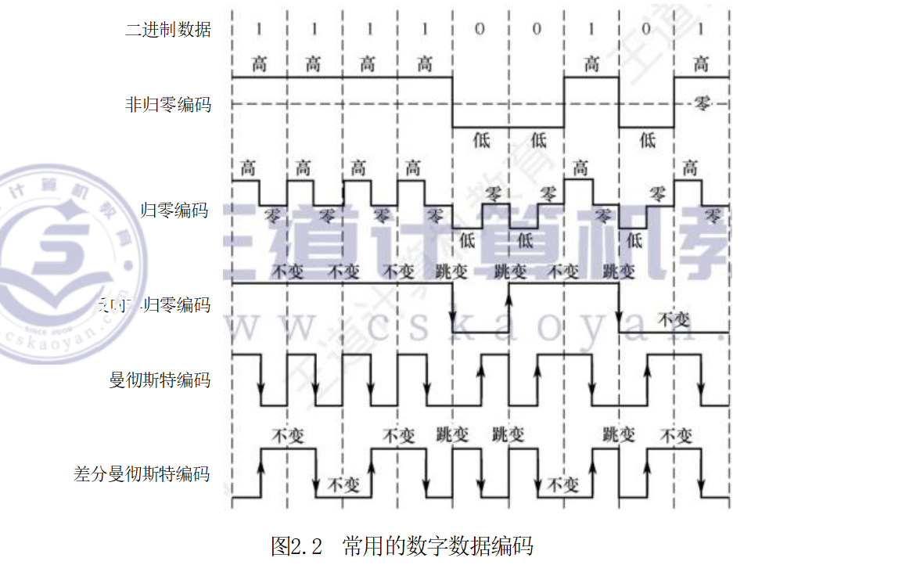

​	1 ) 归 零 (RZ) 编 码。用高电平表示1、低电平表示0(或者相反),每个码元的中间均跳变 到零电平(归零),接收方根据该跳变调整本方的时钟基准，这就为收发双方提供了自同步机制。因为归零需要占用一部分带宽，所以传输效率受到了一定的影响。

​	2)非归零(NRZ) 编码。与RZ 编码的区别是不用归零， 一个时钟全部用来传输数据，编码 效率最高。但NRZ 编码的收发双方存在同步问题，为此需要双方都带有时钟线。
​	3)反向非归零(NRZI) 编码。与NRZ 编码的区别是用电平的跳变表示0、电平保持不变表 示1。跳变信号本身可作为一种通知机制。这种编码方式集成了前两种编码的优点，既能 传输时钟信号，又能尽量不损失系统带宽。USB 2.0的编码方式就是NRZI 编码。

​	4)曼彻斯特编码。每个码元的中间都发生电平跳变，电平跳变既作为时钟信号(用于同步), 又作为数据信号。可用向下跳变表示1、向上跳变表示0,或者采用相反的规定。

​	5)差分曼彻斯特编码。每个码元的中间都发生电平跳变，与曼彻斯特编码不同的是，电平  跳变仅表示时钟信号，而不表示数据。数据的表示在于每个码元开始处是否有电平跳变： 无跳变表示1,有跳变表示0。差分曼彻斯特编码拥有更强的抗干扰能力。
​	标准以太网使用的就是曼彻斯特编码，而差分曼彻斯特编码则被广泛用于宽带高速网中。

**模拟数据编码为数字信号**

​	主要包括三个步骤，即采样、量化和编码，常用于对音频信号进行编码的PCM 编码。

​	1)采样是指对模拟信号进行周期性扫描，将时间上连续的信号变成时间上离散的信号。根 据奈奎斯特定理，采样频率必须大于或等于模拟信号最大频率的两倍。

​	2)量化是指将采样得到的电平幅值按照一定的分级标度转换为对应的数值并取整，这样就 将连续的电平幅值转换为了离散的数字量。采样和量化的实质就是分割和转换。

​	3)编码是指将量化得到的离散整数转换为与之对应的二进制编码。

**数字数据调制为模拟信号**

​	数字数据调制技术在发送端将数字信号转换为模拟信号，而在接收端将模拟信号还原为数字 信号，分别对应于调制解调器的调制和解调过程。图2.3中显示了数字调制的三种方式。

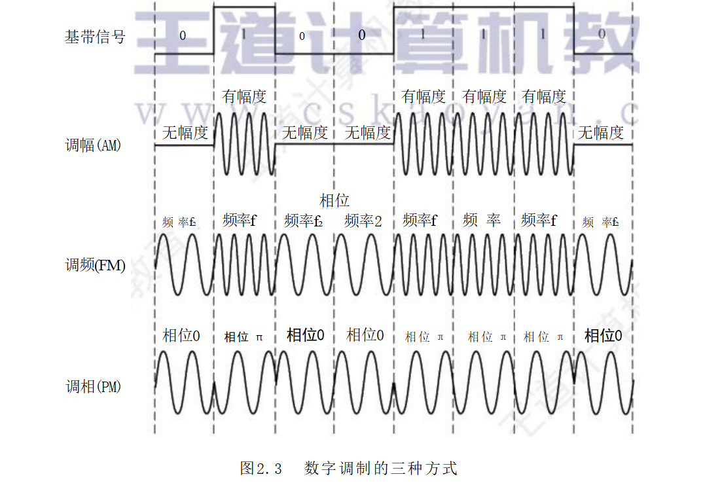

​	1)调幅(AM)  或幅移键控 (ASK) 。 通过改变载波的振幅来表示数字信号1和0。例如， 用有载波和无载波输出分别表示1和0。这种方式比较容易实现，但抗干扰能力差。

​	2)调频(FM) 或频移键控( FSK) 。通过改变载波的频率来表示数字信号1和0。例如，用 频率f  和频率f₂ 分别表示1和0。这种方式容易实现，抗干扰能力强，目前应用较广泛。

​	3)调相(PM)  或相移键控(PSK)。 通过改变载波的相位来表示数字信号1和0。例如，用 相位0和π分别表示1和0,是一种绝对调相方式。

​	与PSK不同，DPSK(差分相移键控)是一种相对调相方式，它通过检测当前码元与前一个码元的 载波相位差来传输数字信息。例如，使用相位有无变化分别表示1和0。

4)正交幅度调制( QAM)。 在频率相同的前提下，将AM 与 PM 结合起来，形成叠加信号。设波特率为B,  采用m 个相位，每个相位有n 种振幅，则该QAM 的数据传输速率R 为

```python
							R=Blog₂(mn)        (单位为b/s)
```

**模拟数据调制为模拟信号**

​	为了实现传输的有效性，可能需要较高的频率。这种调制方式还可使用频分复用 (FDM)  技 术，充分利用带宽资源。电话机和本地局交换机采用模拟信号传输模拟数据的编码方式。

### 物理层设备

​	传输介质也称传输媒体，是数据传输系统中发送器和接收器之间的物理通路。传输介质可分 为：①导向传输介质，指铜线或光纤等，电磁波被导向为沿固体介质传播；②非导向传输介质，指自由空间(空气、真空或海水),电磁波在非导向传输介质中的传输称为无线传输。

**1. 双绞线**

​	双绞线是最常用的传输介质，在局域网和传统电话网中普遍使用。双绞线由两根采用一定规 则并排绞合、相互绝缘的铜导线组成。绞合可减少对相邻导线的电磁干扰。为了进一步提高抗电 磁干扰的能力，还可在双绞线的外面加上一层金属丝编织成的屏蔽层，这就是屏蔽双绞线(STP)。 无屏蔽层的双绞线称为非屏蔽双绞线( UTP)。 双绞线的结构如图2.4所示。

​	双绞线的价格便宜，模拟传输和数字传输都可使用双绞线，通信距离一般为几千米到数十千 米。双绞线的带宽取决于铜线的粗细和传输的距离。距离太远时，对于模拟传输，要用放大器放 大衰减的信号；对于数字传输，要用中继器来对失真的信号进行整形。


**2.同轴电缆**

​	同轴电缆由内导体、绝缘层、外导体屏蔽层和绝缘保护套层构成，如图2.5所示。同轴电缆 一般分为两类：①50Ω同轴电缆，主要用于传送基带数字信号，在早期局域网中应用广泛；②75Ω 同轴电缆，主要用于传送宽带信号，在有线电视系统中应用广泛。因为外导体屏蔽层的作用，所 以同轴电缆具有良好的抗干扰特性而被广泛用于传输较高速率的数据。


随着技术的发展和集线器的出现，在局域网领域基本上都采用双绞线作为传输介质。

**3. 光纤**

​	光纤通信是指利用光导纤维(简称光纤)传递光脉冲来进行通信。有光脉冲表示1,无光脉 冲表示0。可见光的频率约为10⁸MHz, 因此光纤通信系统的带宽极大。

​	光纤主要由纤芯和包层构成(见图2.6),纤芯很细，直径仅为8～100μm, 包层较纤芯有较 低的折射率，光波通过纤芯进行传导。当光线从高折射率的介质射向低折射率的介质时，其折射 角将大于入射角。因此，只要入射角大于某个临界角，就会出现全反射，即光线碰到包层时就会 折射回纤芯，这个过程不断重复，光也就沿着光纤传输下去。

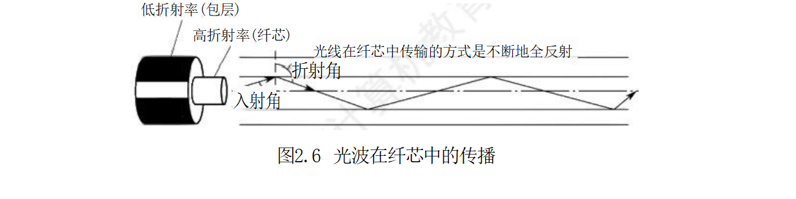

​	利用光的全反射特性，可让从不同角度入射的多条光线在一根光纤中传输，这种光纤称为多 模光纤(见图2.7)。光脉冲在多模光纤中传输的损耗更高，因此较适合近距离传输。


​	当光纤的直径减小到只有一个光的波长时，光纤就像一根波导那样，可使光线一直向前传播， 而不产生多次反射，这样的光纤就是单模光纤(见图2.8)。单模光纤的纤芯很细，直径只有几微 米，制造成本较高。同时，单模光纤的光源是定向性很好的半导体激光器，因此单模光纤的衰减 较小，可传输数千米甚至数十千米而不必采用中继器，适合远距离传输。


光纤不仅具有通信容量非常大的优点，还具有如下特点：

​	1)传输损耗小，中继距离长，对远距离传输特别经济。

​	2)抗雷电和电磁干扰性能好，在有大电流脉冲干扰的环境下这尤为重要。

​	3)无串音干扰，保密性好，不易被窃听或截取数据。

​	4)体积小，重量轻，在现有电缆管道已拥塞不堪的情况下这特别有利。

**4. 无线传输介质**

​	无线通信已广泛用于蜂窝移动电话领域。便携式计算机的出现，以及军事、野外等特殊场合 对移动联网的需要，促进了移动通信的发展，现在无线局域网的应用已非常普遍。

**(1) 无线电波**

​	无线电波具有较强的穿透能力，可以传输很长的距离，因此广泛用于通信领域，如无线手机 通信、计算机网络中的无线局域网 (WLAN)  等。因为无线电波使信号向所有方向散播，所以有 效距离范围内的接收设备无须对准某个方向，就可与无线电波发射者进行通信连接，大大简化了 通信连接。这也是无线电波传输的最重要优点之一。

**(2) 微波、红外线和激光**

​	目前高带宽的无线通信主要使用三种技术：微波、红外线和激光，它们都需要在发送方 和接收方之间有一条视线通路，有很强的指向性。不同的是，红外线通信和激光通信将要传 输的信号分别转换为各自的信号格式，即红外线信号和激光信号，再直接在空间中传播。

​	微波通信的频率较高，频段范围也很宽，载波频率通常为2～40GHz,  因此通信信道的容量 大。例如， 一个带宽为2MHz 的频段可容纳500条语音线路，若用来传输数字信号，则数据率可 达数兆比特/秒。与通常的无线电波不同，微波通信的信号是沿直线传播的，因此在地面上的传播 距离有限，超过一定距离后就要使用中继站来接力。

​	卫星通信利用地球同步卫星作为中继站来转发微波信号，可以突破地面微波通信距离的限 制。三颗相隔120°的同步卫星几乎就能覆盖整个地球表面，因此基本能实现全球通信。卫星通信 的优点是通信容量大、距离远、覆盖广，缺点是保密性差、端到端传播时延长。

### 物理层接口的特性

​	物理层考虑的是如何在连接各种计算机的传输介质上传输比特流，而不指具体的传输介 质。网络中的硬件设备和传输介质的种类繁多，通信方式也各不相同。物理层应尽可能屏蔽 这些差异，让数据链路层感觉不到这些差异，使其只需考虑如何实现本层的协议和服务。

物理层的主要任务是确定与传输介质的接口有关的一些特性：

​	1)机械特性。指明接口所用接线器的形状和尺寸、引脚数量和排列、固定和锁定装置等。

​	2)电气特性。 指明在接口电缆的各条线上的电压范围、传输速率和距离限制等。

​	3)功能特性。指明某条线上出现的某一电平的电压的意义，以及每条线的功能。

​	4)过程特性，也称规程特性。 指明不同功能的各种可能事件的出现顺序。

### 物理层设备

**1. 中继器**

​	中继器的主要功能是放大、整形并转发信号，以消除信号经过一长段电缆后产生的失真和衰 减，使信号的波形和强度达到所需的要求，进而扩大网络传输的距离。其原理是信号再生(而非 简单地放大衰减的信号)。中继器有两个端口，数据从一个端口输入，从另一个端口发出。端口 仅作用于信号的电气部分，而不管是否有错误数据或不适于网段的数据。
​	中继器两端的网络部分是网段，而不是子网，使用中继器连接的几个网段仍是一个局域 网。中继器若出现故障，则对相邻两个网段的工作都产生影响。

​	若某个网络设备没有存储转发功能，则认为它不能连接两个不同的协议。中继器没有存储转发功能， 因此它连接两个速率不同的网段可能会出现问题，若两个网段的速率分别为10Mb/s和10/100Mb/s, 则用 中继器连接后，都只能工作在10Mb/s的速率。

​	从理论上讲，中继器的使用数量是无限的，网络因而也可无限延长。但事实上这是不可能的， 因为网络标准中对信号的延迟范围做了具体规定，中继器只能在该范围内进行有效的工作，否则 会引起网络故障。例如，在采用粗同轴电缆的10BASE5  以太网规范中，互相串联的中继器的个 数不能超过4个，而且用4个中继器串联的5段通信介质中，只有3段可以挂接计算机，其余2 段只能用作扩展通信范围的链路段，不能挂接计算机。这就是所谓的“5-4-3规则”。
​	放大器和中继器都起放大作用，只不过放大器放大的是模拟信号，其原理是放大衰减的信号， 而中继器放大的是数字信号，其原理是整形再生衰减的信号。

**2. 集线器**

​	集线器(Hub)   实质上是一个多端口的中继器。当Hub  工作时， 一个端口接收到数据信号后， 因为信号在从端口到Hub 的传输过程中已有衰减，所以Hub 便对该信号进行整形放大，使之再生 (恢复)到发送时的状态，紧接着转发到其他所有(除输入端口外)处于工作状态的端口。 若 同 时有两个或多个端口输入，则输出时将发生冲突，致使这些数据都无效。从Hub 的工作方式可以 看出，它在网络中只起信号放大和转发作用，目的是扩大网络的传输范围，而不具备信号的定向传送能力，即信息传输的方向是固定的，是标准的共享式设备。

​	使用Hub 组网灵活，它将所有节点的通信集中在以其为中心的节点上，由Hub 组成的网络 是共享式网络，但逻辑上仍是总线网。 Hub 的每个端口连接的是同一网络的不同网段，同时 Hub 也只能在半双工状态下工作，网络的吞吐率因而受到限制。

​	集线器不能分割冲突域，集线器的所有端口都属于同一个冲突域。集线器在一个时钟周期内只能传 输一组信息，当一台集线器连接的机器数较多且多台机器经常需要同时通信时，将导致冲突，使得集线 器的工作效率很差。例如，一个带宽为10Mb/s的集线器上连接了8台计算机，当这8台计算机同时工作 时，每台计算机所真正拥有的带宽为10/8Mb/s=1.25Mb/s。

### 基带传输、频带传输、宽带传输

​	在计算机内部或在相邻设备之间近距离传输时，可不经过调制就在信道上直接进行的传输方 式称为基带传输。它通常用于局域网。数字基带传输就是在信道中直接传输数字信号，且传输介 质的整个带宽都被基带信号占用，双向地传输信息。最简单的方法是用两个高低电平来表示二进 制数字，常用的编码方法有不归零编码和曼彻斯特编码。例如，要传输1010,低电平代表0,高 电平代表1,那么在基带传输下，1010需要向通信线路传输(高、低、高、低电平)。

​	用数字信号对特定频率的载波进行调制(数字调制),将其变成适合传送的信号后再进行传 输，这种传输方式就是频带传输。当采用远距离传输或无线传输时，数字信号必须用频带传输技 术进行传输。利用频带传输，不仅解决了电话系统传输数字信号的问题，还可以实现多路复用， 进而提高传输信道的利用率。同样传输1010,经过调制， 一个码元对应4个二进制位，假设码元 A 代表1010,那么在模拟信道上传输码元A 就相当于传输1010。

​	借助频带传输，可将链路分解成两个或多个信道，每个信道可携带不同的信号，这就是宽带 传输。宽带传输中所有的信道能同时互不干扰地发送信号。例如，对信道进行频分复用，划分为 2个互不相关的子信道，分别在两个子信道上同时进行频带传输，链路容量就会大大增加。

## 第三章 数据链路层

### 字符计数法

​	字符计数法是指在帧首部使用一个计数字段来记录该帧所含的字节数(包括计数字段自身所 占用的1字节),如图3.5所示。当接收方读出帧首部的字节计数值时，就知道后面跟随的字节数， 从而确定帧结束位置。因为帧与帧之间是连续传输的，所以也能确定下一帧的开始位置。

### 字 节 填 充 法

​	字节填充法使用特定字节来定界一帧的开始与结束，在图3.6的例子中，控制字符SOH 放在 帧的最前面，表示帧的开始，控制字符EOT 表示帧的结束。为了使信息位中出现的特殊字符不被误判为帧的首尾定界符，可在特殊字符之前填充一个转义字符ESC 来加以区分(注意，转义字符误判为帧的首尾定界符，可在特殊字符之前填充一个转义字符ESC 来加以区分(注意，转义字符

### 零比特填充法

​	零比特填充法允许数据帧包含任意个数的比特，它使用一个特定的比特串01111110来标志一帧的开始和结束，如图3.7所示。为了不使数据字段中出现的比特流01111110被误判为帧的首尾 标志，发送方先扫描整个数据字段，每遇到5个连续的“1”,就自动在其后插入一个“0”。经过 这种比特填充后，就可保证数据字段中不会出现6个连续的“1”。接收方执行该过程的逆操作， 即每收到5个连续的“1”,就自动删除后面紧跟的“0”,以恢复原始数据。在数据链路层早期使 用的HDLC 协议中，便是采用这种比特填充的首尾标志法来实现透明传输的。

### 循环冗余码

数据链路层广泛使用循环冗余码 (Cyclic  Redundancy  Code,CRC) 检错技术。
循环冗余码 (CRC)   检错的基本思想：
	1：收发双方约定一个生成多项式G(x) (要求最低位必须为1)。 k 位位串可视为阶数为k-1   的 多项式的系数序列。例如，可用多项式x³+x²+1    表示位串1101。
	2：发送方基于待发送的数据和G(x),计算出冗余码，将冗余码附加到数据后面一起发送。
	3：接收方收到数据和冗余码后，通过G(x) 来计算收到的数据和冗余码是否产生差错。
	假设一个待传送m 位的数据，CRC 运算产生一个r 位的冗余码，称为帧检验序列(FCS) 。 这 样形成的帧将由m+r   位组成。在所要发送的数据后面增加 r  位冗余码，虽然增大了传输开销， 但是可以进行差错检测，这种代价往往是值得的。这个带检验码的帧刚好能被预先确定的多项式 G(x)整除。接收方用相同的多项式去除收到的帧，若余数为0,则认为无差错。

假设一段m 位数据，则计算冗余码的步骤如下：
	1：加0。假设G(x)的阶为r,   在数据后面加r 个0,相当于乘以2。
	2：模2除。利用模2除法，用G(x)对应的二进制串去除1)中计算得出的数据串，得到的余 数即为冗余码(共r 位，前面的0不可省略)。
按照模2运算规则，加法不进位，减法不借位，相当于对应位进行逻辑异或运算。
	冗余码的计算举例。假设数据 M=101001(m=6),        除数G(x)=1101(r=3),          经模2除法运 算后的结果是：商Q=110101 (这个商没什么用),余数R=001。因此，发送出去的数据为101001001 (2M+FCS),        共有m+r  位，循环冗余码的运算过程如图3.8所示。
发送方的FCS 生成和接收方的CRC 检验都是由硬件实现的，处理很迅速，不会影响数据的  传输。若在传输过程中无差错，则经过CRC 检验后得出的余数R 肯定为0。但是，若出现误码， 则余数R 仍为0的概率极低。因此，通过CRC 检错技术，可以做到对帧的无差错接受，即“凡 是接收方数据链路层接受的帧，我们都能以非常接近1的概率认为这些帧在传输过程中未产生差 错”;而接收方丢弃的帧虽然曾经收到，但最终因为有差错而被丢弃，即未被接受。


​	循环冗余码(CRC)   是具有纠错功能的，只是数据链路层仅使用了它的检错功能，检测到帧出错则 直接丢弃，是为了方便协议的实现，因此本节不介绍CRC的检错功能。

### 纠错编码

​	最常见的纠错编码是海明码，其实现原理是在有效信息位中加入几个检验位形成海明码，并 把海明码的每个二进制位分配到几个奇偶检验组中。某一位出错后，就会引起有关的几个检验位 的值发生变化，这不但可以发现错位，而且能指出错位的位置，为自动纠错提供依据。

**码距**

​	任何一种编码的检错能力和纠错能力都与该编码的最小距离有关。码距(也称海明距离)是 指两个码字对应位取值不同的比特数量。计算码距的十种方法是对两个位串进行异或(xor) 运算， 结果中1的个数即为码距。例如，0110异或0011=0101,异或结果中有两个1,说明这两个码字有 2个比特不同，因此0110和0011的码距为2。在一个编码集中，任意两个码字的码距的最小值称 为该编码集的码距。例如，对于编码集{10011,01011,11110,00001},尽管11110和00001的码距 为5,但10011和01011 的码距为2,取最小值，因此该编码集的码距为2。
根据纠错理论，编码方案的检错能力和纠错能力与码距1的关系如下：


​	即码距 l 越大，其检错的位数d 就越大，纠错的位数c 也就越大，且纠错能力恒小于或等于检错 能力(能纠错必然能检错)。例如，当码距1=3时，这种编码最多能检错2位，或能纠错1位。 此外，考虑到c=0 和 d=c 的两种边界情况，还可以推出如下结论：
​	1：为了检测d 位错误，需要一个码距为d+1 的编码方案。当一个有效码字发生d 位错误时， 不可能变成另一个有效码字。可见，码距为1的编码方案无法检测任何错误。
​	2：为了纠正c 位错误，需要一个码距为2c+1  的编码方案。当一个有效码字发生c 位错误 时，它还是离原来的码字最近，从而能确定原来的码字，达到纠错的目的。

**海明码的编码过程**

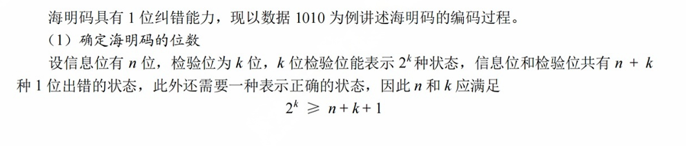


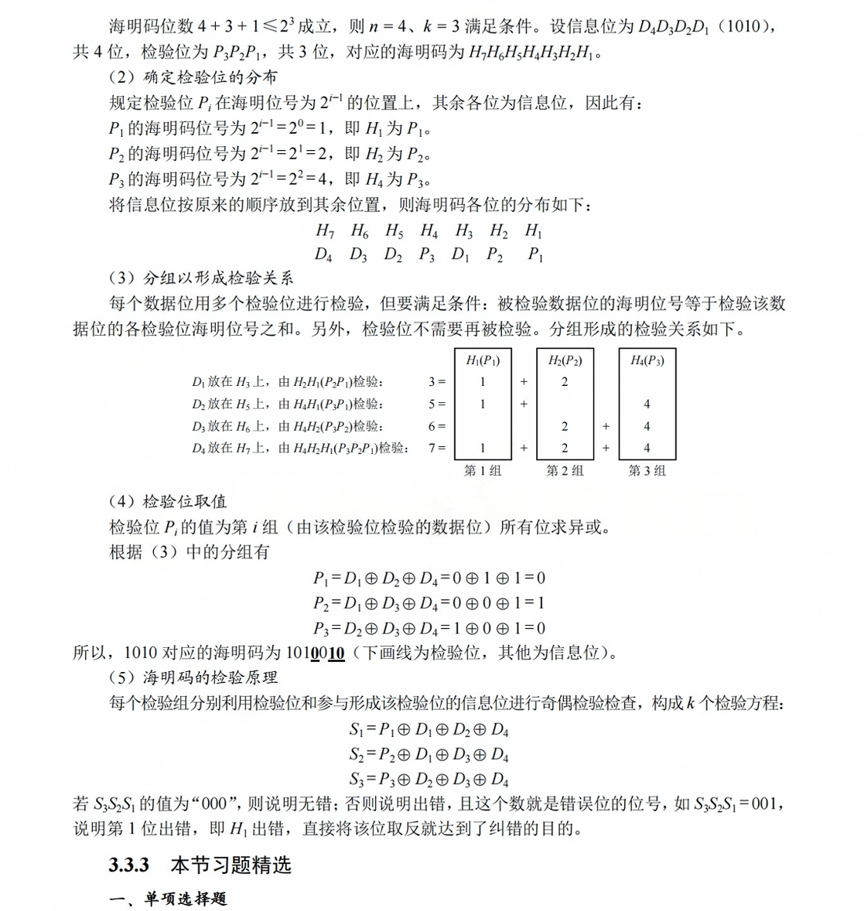

### CSMA/CD

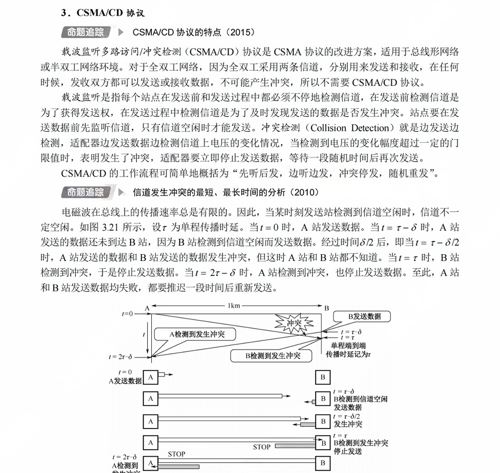

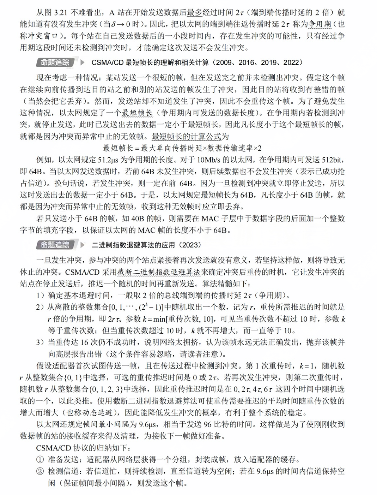


### CSMA/CA

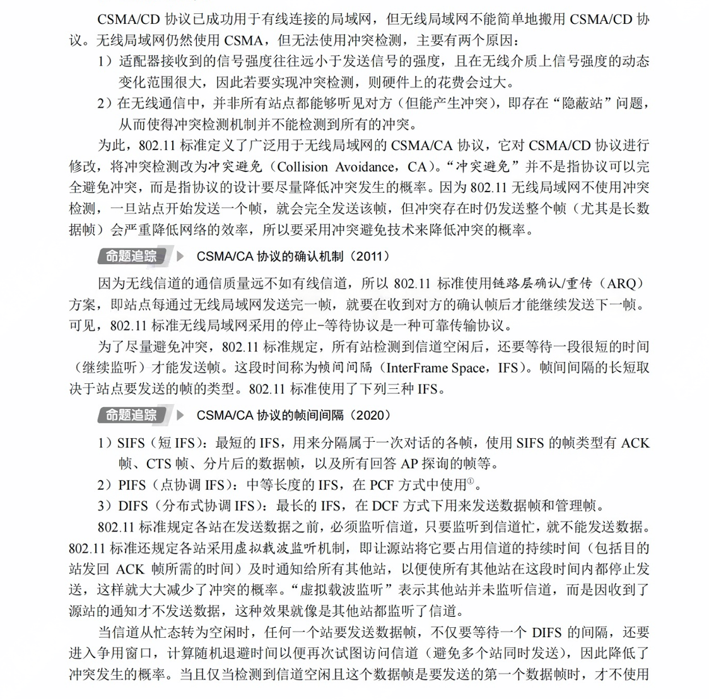

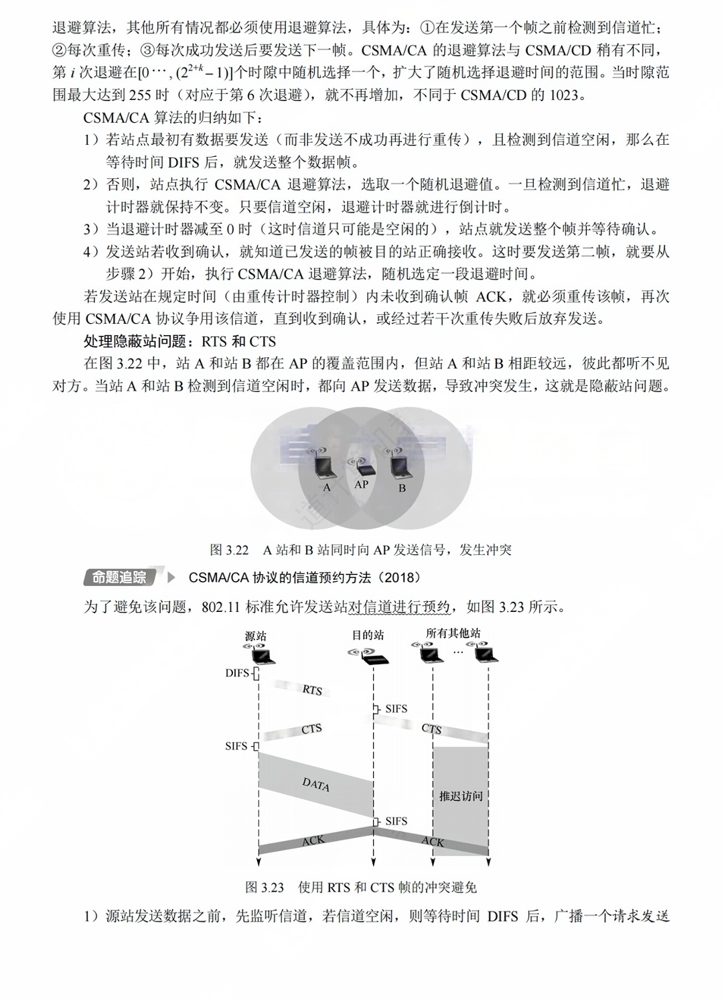

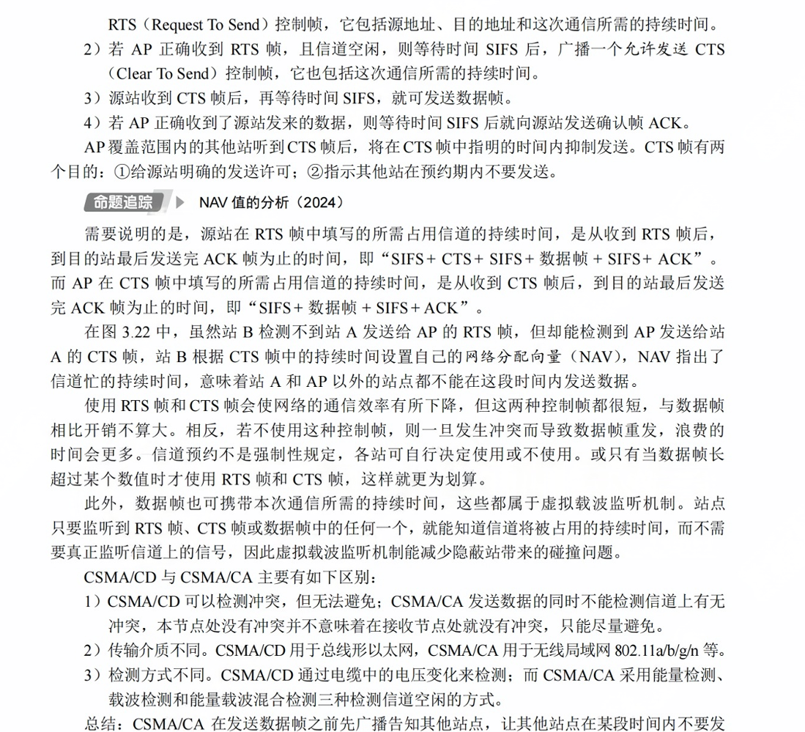

### 轮询访问：令牌传递协议

​	在轮询访问中，用户不能随机地发送信息，而要通过一个集中控制的监控站，以循环方式轮 询每个节点，再决定信道的分配。典型的轮询访问控制协议是令牌传递协议。
​	在令牌传递协议中，一个令牌 (Token)   沿着环形总线在各站之间依次传递。令牌是一个特 殊的控制帧，它本身并不包含信息，仅控制信道的使用，确保同一时刻只有一个站独占信道。当 环上的一个站希望发送帧时，必须等待令牌。站点只有取得令牌后才能发送帧，因此令牌环网络 不会发生冲突(因为令牌只有一个)。站点发送完一帧后，应释放令牌，以便让其他站使用。因 为令牌在网环上是按顺序依次传递的，所以对所有联网计算机而言，访问权是公平的。

**令牌环网络中令牌和数据的传递过程如下：**
	1：当网络空闲时，环路中只有令牌帧在循环传递。
	2：当令牌传递到有数据要发送的站点时，该站点就修改令牌中的一个标志位，并在令牌中 附加自己需要传输的数据，将令牌变成一个数据帧，然后将这个数据帧发送出去。
	3：数据帧沿着环路传输，接收到的站点一边转发数据， 一边查看帧的目的地址。若目的地 址和自己的地址相同，则接收站就复制该数据帧，以便进一步处理。
	4：数据帧沿着环路传输，直到到达该帧的源站点，源站点收到自己发出去的帧后便不再转 发。同时，通过检验返回的帧来查看数据传输过程中是否出错，若出错，则重传。
	5：源站点传送完数据后，重新产生一个令牌，并传递给下一站点，交出信道控制权。
	令牌传递协议非常适合负载很高(多个节点在同一时刻发送数据的概率很大)的广播信道， 若采用随机介质访问控制，则发生冲突的概率很大。令牌传递协议既不共享时间，又不共享空间； 它实际上在随机访问介质访问控制的基础上，限定了有权发送数据的节点只能有一个。
即使是广播信道也可通过介质访问控制机制，使广播信道变为逻辑上的点对点信道，所以说 数据链路层研究的是“点到点”之间的通信。

### 三种特殊的局域网拓扑

以太网 (目前使用范围最广)。逻辑拓扑是总线形结构，物理拓扑是星形结构。
令 牌 环 (Token Ring,IEEE 802.5)。逻辑拓扑是环形结构，物理拓扑是星形结构。
FDDI (光纤分布数字接口，IEEE 802.8)。逻辑拓扑是环形结构，物理拓扑是双环结构。

​	IEEE 802 标准定义的局域网参考模型只对应于OSI 参考模型的数据链路层和物理层，并将数 据链路层拆分为两个子层：逻辑链路控制 (LLC)  子层和介质访问控制 (MA  C)  子层。与接入传 输介质有关的内容都放在 MAC  子层，它向上层屏蔽对物理层访问的各种差异，主要功能包括： 组帧和拆卸帧、比特传输差错检测、透明传输。LLC 子层与传输介质无关，它向网络层提供无确 认无连接、面向连接、带确认无连接、高速传送四种不同的连接服务类型。
​	因为在局域网市场中的垄断地位，以太网几乎成为局域网的代名词，而802 委员会制定的
​	LLC 子层作用已经不大，所以现在许多网卡仅装MAC  协议而不装LLC 协议。IEEE  802协议层

与OSI 参考模型的比较如图3.24所示。

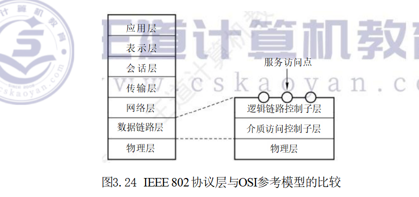

### 以太网

​	以太网采用两项措施来简化通信：①采用无连接的工作方式，既不对发送的数据帧编号，又 不要求接收方发送确认，即以太网尽最大努力交付数据，提供的是不可靠服务，对差错的纠正则 由高层完成；②发送的数据都使用曼彻斯特编码的信号，每个码元的中间出现一次电压转换，接 收方利用这种电压转换方便地将位同步信号提取出来。

**以太网的传输介质与网卡**

以太网常用的传输介质有4种：粗缆、细缆、双绞线和光纤，它们的适用情况见表3.2。

**表3.2 各种传输介质的适用情况**

 

| 标准名称     | 0BASE5         | 10BASE2        | 10BASE-T     | 10BASE-F      |
| ------------ | -------------- | -------------- | ------------ | ------------- |
| 传输介质     | 同轴电缆(粗缆) | 同轴电缆(细缆) | 非屏蔽双绞线 | 光纤对(850nm) |
| 编码         | 曼彻斯特编码   | 曼彻斯特编码   | 曼彻斯特编码 | 曼彻斯特编码  |
| 拓扑结构     | 总线形         | 总线形         | 星形         | 点对点        |
| 最大段长     | 500m           | 185m           | 100m         | 2000m         |
| 最多节点数量 | 100            | 30             | 2            | 2             |

​	计算机与外界局域网的连接是通过主板上嵌入的一块网络适配器(Adapter ) [也称网络接口卡 (Network    Interface    Card,NIC)] 实现的。适配器上装有处理器和存储器，工作在数据链路层。适 配器和局域网的通信是通过电缆或双绞线以串行方式进行的，而适配器和计算机的通信则是通过 计算机的I/O 总线以并行方式进行的。因此，适配器的重要功能就是进行数据的串并转换。
​	适配器不仅能实现与局域网传输介质之间的物理连接和电信号匹配，还涉及帧的发送与接 收、帧的封装与拆封、介质访问控制、数据的编码与解码及数据缓存等功能。当适配器收到正确 的帧时，就使用中断来通知该计算机，并交付协议栈中的网络层。当计算机要发送IP 数据报时， 就由协议栈把IP 数据报向下交给适配器，组帧后发送到局域网。

**3：以太网的MAC帧**

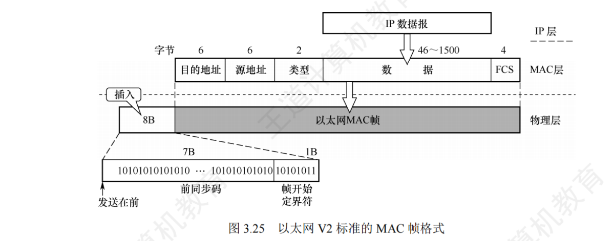

​	在帧前面插入的8字节前导码分为两个字段：第一个字段是7字节的前同步码，用来实现 MAC 帧的比特同步；第二个字段是1字节的帧开始定界符，表示后面的信息就是 MAC 帧。

​	以太网帧不需要帧结束定界符，因为当以太网传送帧时，各帧之间必须有一定的间隙。因此，接收方 只要找到帧开始定界符，其后面连续到达的比特流就都属于同一帧。实际上，以太网采用了违规编码法的 思想，因为以太网使用曼彻斯特编码，所以每个码元中间都有一次电压的跳变。发送方发完一帧后，发送 方网络接口上的电压不再变化，这样接收方就能很容易地找到帧的结束位置，这个位置往前数4字节就是 FCS 字段，于是就能确定数据字段的结束位置。

目的地址：6字节，帧在局域网上的目的适配器的 MAC 地址。
源地址：6字节，传输帧到局域网上的源适配器的 MAC 地址。
类 型：2字节，指出数据字段中的数据应交给哪个上层协议处理，如网络层的IP。

数据：46～1500字节，承载上层的协议数据单元(如IP  数据报)。以太网的最大传输单元是 1500字节，若 IP 数据报超过1500字节，则必须将该IP 数据报分片。此外，由于CSMA/CD 算 法的限制，以太网帧必须满足最小长度是64字节，当IP 数据报少于46字节时，MAC 子层就在 数据字段的后面加 一 个整数字节的填 充字段，以确保帧长不小于64字节。

​	检验码( FCS):4   字节，检验范围从目的地址段到数据字段，算法采用32位CRC 码，不但 要 检 验MAC   帧的数据部分，而且要检验目的地址、源地址和类型字段，但不检验前导码。

**4.高速以太网**

速率达到或超过100Mb/s 的以太网称为高速以太网，表3.3列出了几种高速以太网技术。 表3.3几种高速以太网技术

| 标准名称         | 100Base-T以太网             | 吉比特以太网   | 10吉比特以太网 |
| ---------------- | --------------------------- | -------------- | -------------- |
| 传输速率         | 100Mb/s                     | 1Gb/s          | 10Gb/s         |
| 传输介质         | 双绞线                      | 双绞线或光纤   | 双绞线或光纤   |
| 通信方式         | 支持半双工和全双工方式      | 只有全双工方式 |                |
| 介质访问控制协议 | 半双工方式下使用CSMA/CD协议 | 无             |                |

**(1)100BASE-T   以太网**
	100BASE-T 是在双绞线上传送100Mb/s 基带信号的星形拓扑以太网，它仍然使用CSMA/CD  协议，也称快速以太网。100 BASE-T 既支持全双工方式，又支持半双工方式，可在全双工方式下 工作而无冲突发生，因此在全双工方式下不使用 CSMA/CD  协议。
100BASE-T 的 MAC 帧格式仍然是802.3标准规定的帧格式。保持最短帧长不变，但将一个 网段的最大长度减小到100m。帧间最小间隔从原来的9.6μs 改为0.96 μs。

**(2)吉比特以太网**
	吉比特以太网也称千兆以太网，允许在1Gb/s 速率下以全双工和半双工两种方式工作。使用 802.3协议规定的帧格式。使用双绞线或光纤作为传输介质。在半双工方式下使用CSMA/CD 协 议，而在全双工方式不使用CSMA/CD 协议。与10BASE-T和100BASE-T 技术向后兼容。

**(3)10吉比特以太网**
	10吉比特以太网的帧格式与10Mb/s、100Mb/s和IGb/s 以太网的帧格式完全相同，还保留了 802.3标准规定的以太网最小帧长和最大帧长，以便升级和向后兼容。10吉比特以太网只工作在 全双工方式，不存在争用问题，当然也不使用CSMA/CD 协议。
	以太网从10Mb/s到10Gb/s 的演进证明了以太网是可扩展的(从10Mb/s 到 1 0Gb/s)、灵活的 (多种传输介质、全/半双工、共享/交换),且易于安装，稳健性好。

### 无线局域网

**1：无线局域网的组成**
	无线局域网可分为两大类：有固定基础设施的无线局域网和无固定基础设施的移动自组织网 络。所谓“固定基础设施”,是指预先建立的、能覆盖一定地理范围的固定基站。
**(1) 有固定基础设施无线局域网**
	对于有固定基础设施的无线局域网，IEEE 制定了无线局域网的802.11系列协议标准，包括 802.11a/b/g/n 等。802.11标准使用星形拓扑，其中心称为接入点 (Access  Point,AP), 在 MAC 层使用CSMA/CA 协议。使用 802.11系列协议的局域网也称Wi-Fi。
802.11标准规定无线局域网的最小构件是基本服务集(Basic Service Set,BSS)。一个基本服务集包括一个接入点和若干移动站。各站在本 BSS 内的通信，或与本BSS 外部站的通信，都必 须通过本 BSS 的 AP 。上面提到的AP 就是基本服务集中的基站 (base station)。安装AP 时，必须为其分配一个不超过32字节的服务集标识符(Service    Set   IDentifier,SSID)和一个信道。SSID  是指使用该 AP 的无线局域网的名称。基本服务集覆盖的地理范围称为基本服务区(Basic   Service Area, BSA), 无线局域网的基本服务区的直径一般不超过100m。

​	基本服务集可以是孤立的，也可通过AP 连接到一个分配系统 (Distribution     System,DS), 然后 连接到另一个基本服务集，构成一个扩展的服务集(Extended  Service  Set,ESS) 。分配系统的作用是 使扩展的服务集对上层的表现就像一个基本服务集。ESS 还可通过一种称为Portal (门户)的设备为 无线用户提供到有线连接的以太网接入。门户的作用相当于网桥。在图3.26中，移动站A 若要和另 一个基本服务集中的移动站B 通信，则必须经过两个接入点AP1 和AP2,   即 A→AP1→AP2→B, 注意 AP1 到 AP2 的通信是使用有线传输的。

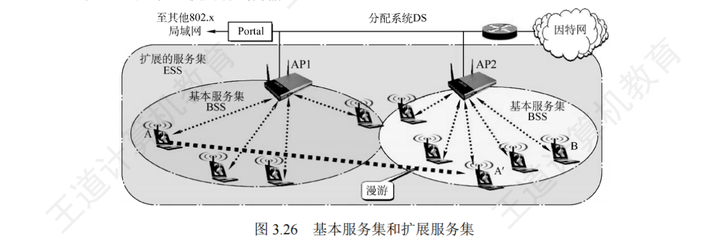

​	当移动站A 从某个基本服务集漫游到另一个基本服务集时(图3.26中的A'),   仍可保持与另 一个移动站B 的通信。但A 在不同的基本服务集中使用的AP 改变了。
**(2) 无固定基础设施移动自组织网络**
​	另一种无线局域网是无固定基础设施的无线局域网，也称自组网络 (ad  hoc  network)。自 组 网络没有上述基本服务集中的AP,   而有由一些平等状态的移动站相互通信组成的临时网络(见 图3.27)。各节点之间地位平等，中间节点都为转发节点，因此都具有路由器的功能。

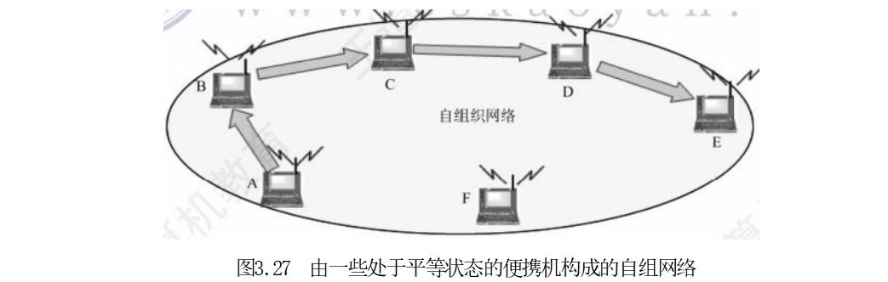

​	自组网络通常是这样构成的：一些可移动设备发现在它们附近还有其他的可移动设备，且要 求和其他移动设备进行通信。自组网络中的每个移动站都要参与网络中其他移动站的路由发现和 维护，同时由移动站构成的网络拓扑可能随时间变化很快，因此在固定网络中行之有效的一些路 由选择协议对移动自组网络已不适用，需引起特别的关注。
​	自组网络和移动 IP 并不相同。移动 IP 技术使漫游的主机可用多种方法连接到因特网，其核心网络功能仍然基于固定网络中一直使用的各种路由选择协议。而自组网络是将移动性扩展到无 线领域中的自治系统，具有自己特定的路由选择协议，且可以不和因特网相连。

**2.802.11局域网的MAC 帧**

802.11帧共有三种类型，即数据帧、控制帧和管理帧。802.11局域网的数据帧的格式如图3.28 所 示 

802.11数据帧由以下三部分组成：
1：MAC   首部，共30字节。帧的复杂性都在MAC 首部。
2：帧主体，即帧的数据部分，不超过2312字节。它比以太网的最大长度长很多。
3：帧检验序列FCS 是 MAC 尾部，共4字节。

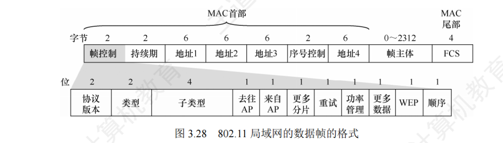

​	802.11帧的MAC 首部中最重要的是4个地址字段(都是MAC 地 址)。这里仅讨论前三个地址(地址4用于自组网络)。这三个地址的内容取决于帧控制字段中的“去往AP” 和“来自 AP” 这两个字段的数值。表3.4中给出了802.11帧的地址字段最常用的两种情况。

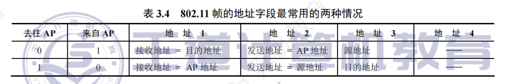

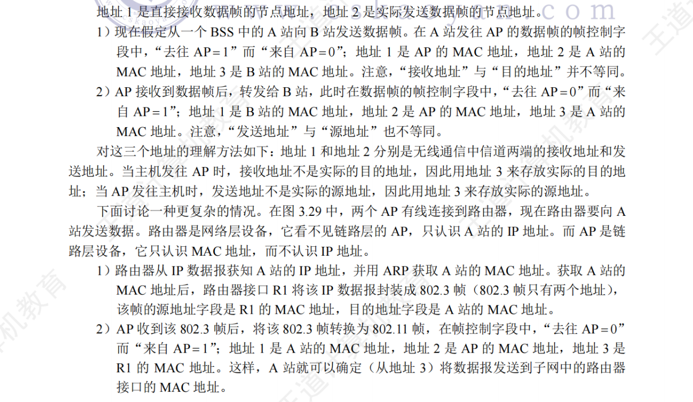

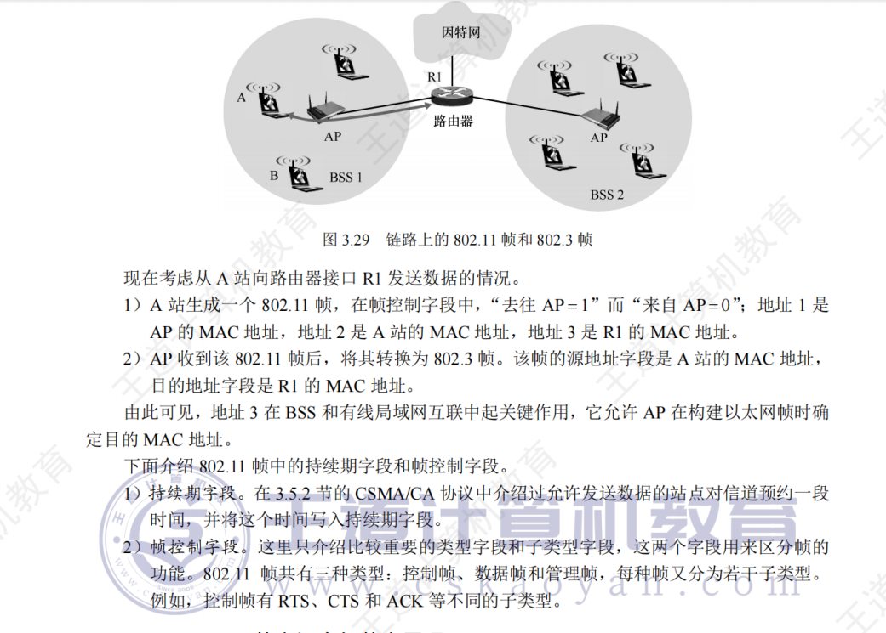

### VLAN 基本概念与基本原理

一个以太网是一个广播域，当一个以太网中包含的计算机太多时，往往会导致：
●以太网中出现大量的广播帧，特别是经常使用的ARP 和 DHCP (第4章)。
· 一个单位的不同部门共享一个局域网，对信息保密和安全不利。
通过虚拟局域网 (Virtual        LAN,VLAN),可将一个较大的局域网分割成一些较小的与地理 位置无关的逻辑上的VLAN, 而 每 个 VLAN 是一个较小的广播域。属于同一个 VLAN 的计算机 之间可以直接通信，而不同 VLAN  的计算机之间不能直接通信。
有以下三种划分 VLAN  的方式：
	1：基于接口。将交换机的若干接口划为一个逻辑组，这种方法最简单、最有效，若主机离 开了原来的接口，则可能进入一个新的子网。
	2：基于MAC 地址。按MAC 地址将一些主机划分为一个逻辑子网，当主机的物理位置从一 个交换机移动到另一个交换机时，它仍属于原来的子网。
	3：基于IP 地址。根据网络层地址或协议划分VLAN,  这样的VLAN 可以跨越路由器进行扩 展，将多个局域网的主机组成一个VLAN。
	802.3ac 标准定义了支持 VLAN 的以太网帧格式的扩展。它在以太网帧中插入一个4字节的 标识符(插在源地址字段和类型字段之间),称为VLAN  标签，用来指明发送该帧的计算机属于 哪个虚拟局域网。插入VLAN  标签的帧称为802.1Q 帧，如图3.30所示。因为VLAN  帧的首部增加了4字节，所以以太网帧的数据字段的最小长度从原来的46字节变为42字节，最大长度保持 不 变 ， 因 此以太网帧的最大帧长从原来的 1518 字节变为 1522 字 节 。

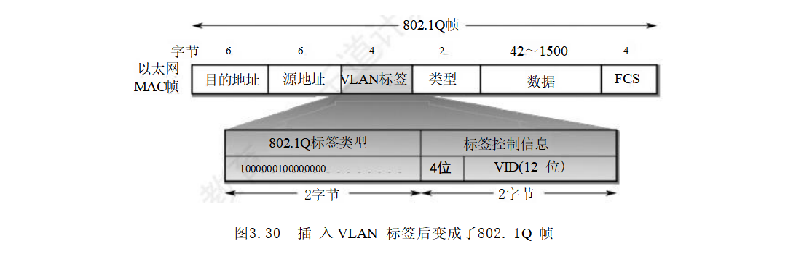

​	VLAN 标签的前两个字节总是置为0x8100, 表示这是一个802.1Q 帧。在 VLAN 标签的后 两个字节中，前4位实际上并没什么作用，这里不讨论，后12位是该VLAN 的标识符 VID,    它唯一地标识该802.1Q 帧属于哪个 VLAN 。12 位的VID 可识别4096个不同的 VLAN。插入 VLAN 标签后，802.1Q 帧最后的FCS 必须重新计算。
​	如图3.31所示，交换机1连接7台计算机，该局域网划分为两个虚拟局域网 VLAN-10 和 VLAN-20, 这里的10和20就是802.1Q 帧中的VID 字段的值，由交换机管理员设定。各主机并 不知道自己的VID 值(但交换机必须知道),主机与交换机之间交互的都是标准以太网帧。一个 VLAN的范围可以跨越不同的交换机，前提是所用的交换机能够识别和处理VLAN。交换机2连 接5台计算机，并与交换机1相连。交换机2中的2台计算机加入VLAN-10, 另外3台计算机加 入 VLAN-20。这两个VLAN 虽然都跨越了两个交换机，但各自都是一个广播域。

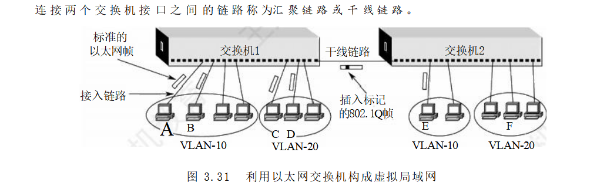

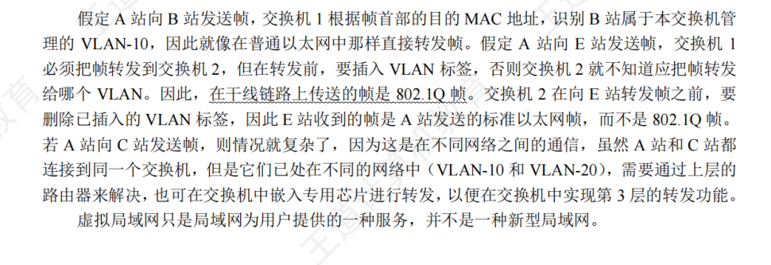

### 点对点协议

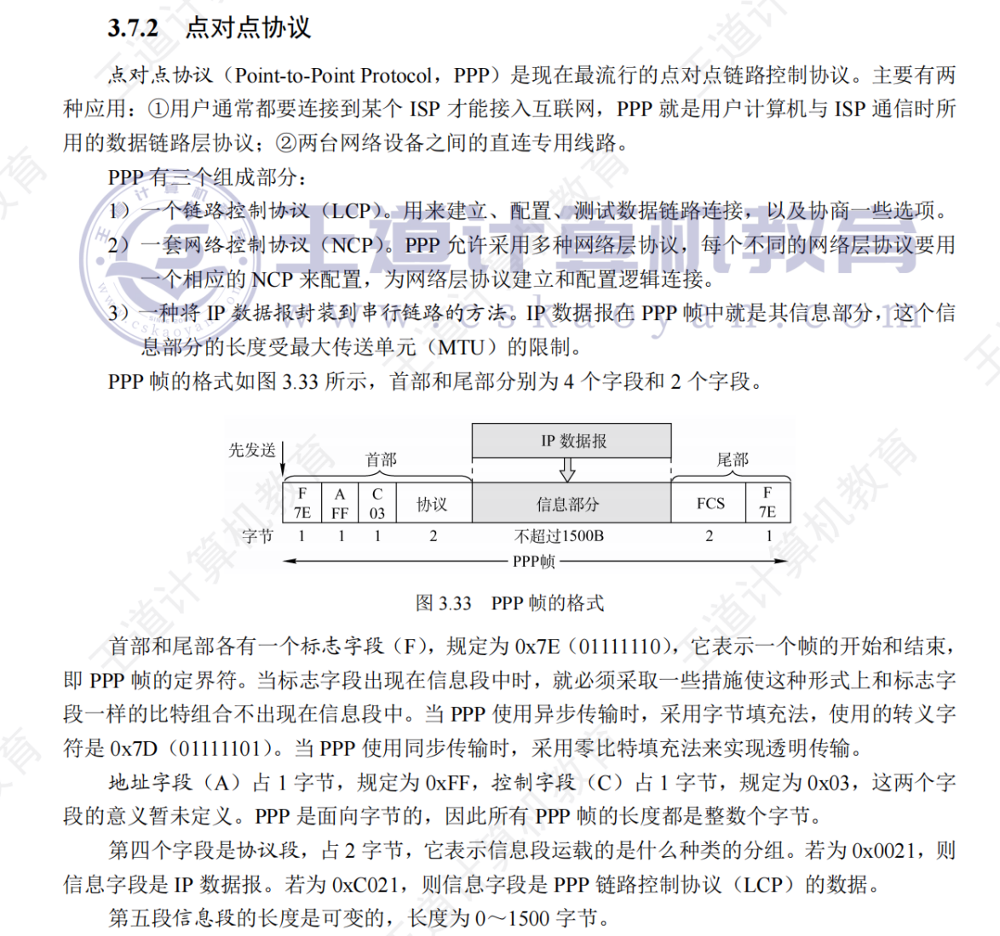

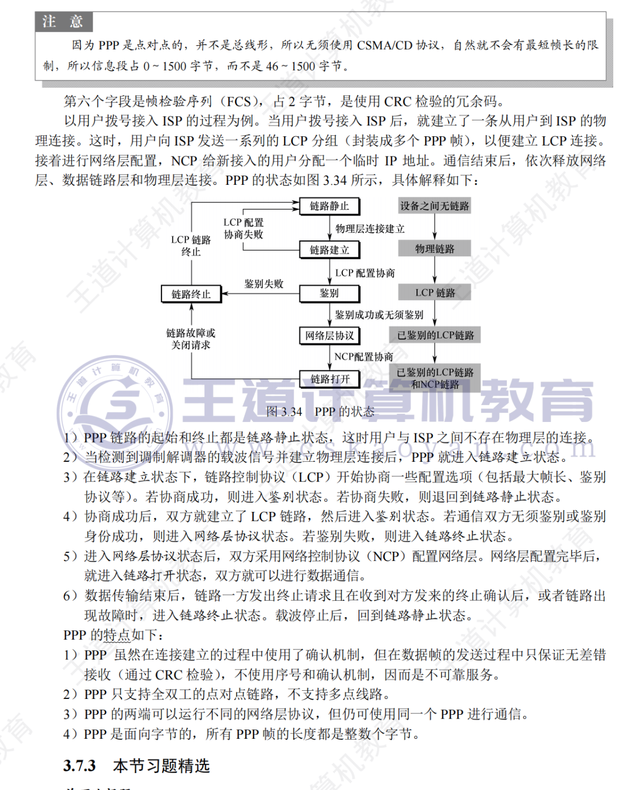

## 第四章：网络层

### SDN 的基本概念

​	网络层的主要任务是转发和路由选择。可以将网络层抽象地划分为数据平面(也称转发层面) 和控制平面，转发是数据平面实现的功能，而路由选择是控制平面实现的功能。
​	软件定义网络(Software Defined Network,SDN)是近年流行的一种创新网络架构，它采用 集中式的控制平面和分布式的数据平面，两个平面相互分离，控制平面利用控制-数据接口对数 据平面上的路由器进行集中式控制，方便软件来控制网络。传统网络中的路由器既有转发表，又 有路由选择软件，即既有数据平面，又有控制平面。但是在图4.4所示的SDN 结构中，路由器都 变得简单了，它的路由选择软件都不需要了，因此路由器之间不再相互交换路由信息。在网络的 控制平面有一个逻辑上的远程控制器(可由多个服务器组成)。远程控制器掌握各主机和整个网 络的状态，为每个分组计算出最佳路由，通过Openflow 协议(或其他途径)将转发表(在SDN  中称为流表)下发给路由器。路由器的工作很单纯，即收到分组、查找转发表、转发分组。

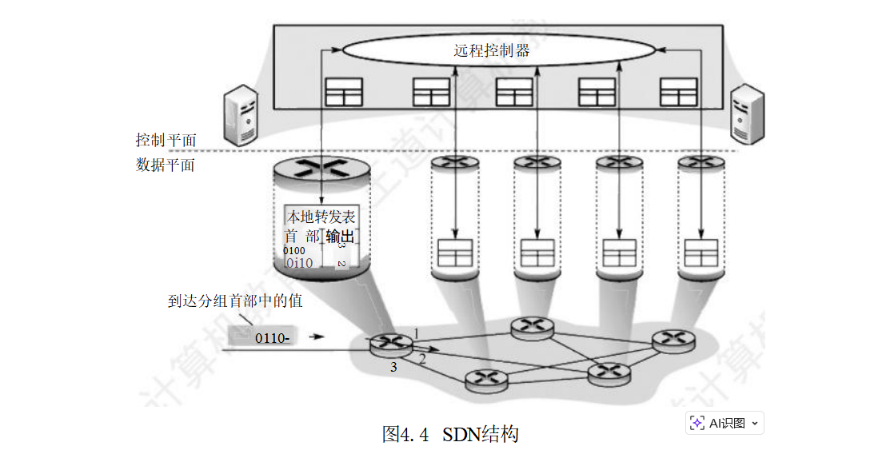

​	这样，网络又变成集中控制的，而本来互联网是分布式的。SDN 并非要把整个互联网都改造 成如图4.4所示的集中控制模式，这是不现实的。然而，在某些具体条件下，特别是像一些大型 的数据中心之间的广域网，使用SDN 模式来建造，就可使网络的运行效率更高。
​	SDN 的可编程性通过为开发者提供强大的编程接口，使得网络具有很好的编程性。对上层应 用的开发者，SDN 提供的编程接口称为北向接口，北向接口提供了一系列丰富的API,   开发者可 以在此基础上设计自己的应用，而不必关心底层的硬件细节。SDN 控制器和转发设备建立双向会 话的接口称为南向接口，通过不同的南向接口协议(如Openflow),SDN  控制器就可兼容不同的 硬件设备，同时可在设备中实现上层应用的逻辑。SDN 控制器集群内部控制器之间的通信接口称 为东西向接口，用于增强整个控制平面的可靠性和可拓展性。
​	SDN 的优点：①全局集中式控制和分布式高速转发，既利于控制平面的全局优化，又利于高 性能的网络转发。②灵活可编程与性能的平衡，控制和转发功能分离后，使得网络可以由专有的 自动化工具以编程方式配置。③降低成本，控制和数据平面分离后，尤其是在使用开放的接口协 议后，就实现了网络设备的制造与功能软件的开发相分离，从而有效降低了成本。
​	SDN 的问题：①安全风险，集中管理容易受攻击，若崩溃，则整个网络会受到影响。②瓶颈问 题，原本分布式的控制平面集中化后，随着网络规模扩大，控制器可能成为网络性能的瓶颈。

### 解决拥塞控制的方法

​	1：开环控制。 在设计网络时事先将有关发生拥塞的因素考虑周到，力求网络在工作时不产 生拥塞。这是一种静态的预防方法。 一旦整个系统启动并运行，中途就不再需要修改。 开环控制手段包括确定何时可接收新流量、何时可丢弃分组及丢弃哪些分组，确定何种 调度策略等。所有这些手段的共性是，在做决定时不考虑当前网络的状态。
​	2：闭环控制。 事先不考虑有关发生拥塞的各种因素，采用监测网络系统去监视，及时检测 哪里发生了拥塞，然后将拥塞信息传到合适的地方，以便调整网络系统的运行，并解决 出现的问题。闭环控制是基于反馈环路的概念，是一种动态的方法。

### IPv4  地址

​	IP 地址是给连接到互联网上的每台主机(或路由器)的每个接口，分配的一个在全球范围内 唯一的32位标识符。IP 地址由互联网名字和数字分配机构ICANN 进行分配。为方便书写和记忆， 常把32位IP 地址分成4段，每段8位，用等效的十进制数表示，并在每段数字之间加一个小数  点，即一个IP 地址用4段十进制数表示，称为点分十进制记法。

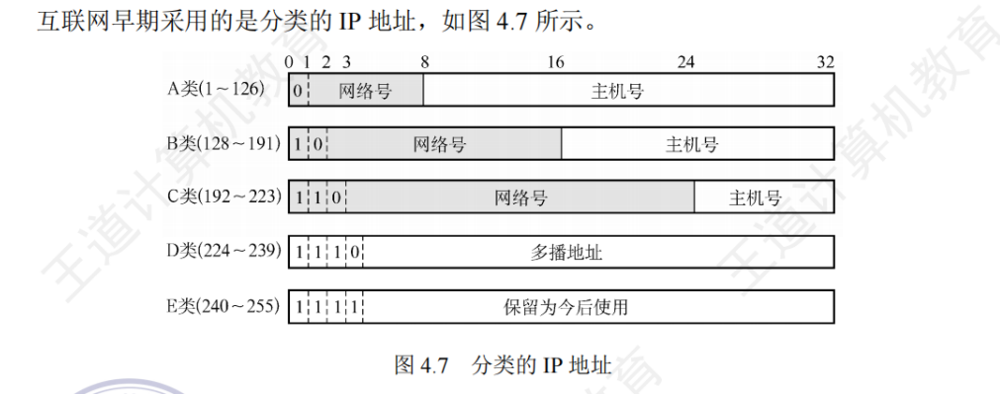

​	无论哪类IP 地址，都由网络号和主机号两部分组成。即IP 地址：:={<网络号>,<主机号>}。 其中网络号标志主机(或路由器)所连接到的网络。 一个网络号在整个互联网范围内必须是唯一 的。主机号标志该主机(或路由器)。 一个主机号在它前面的网络号所指明的网络范围内必须是 唯一的。由此可见，一个IP 地址在整个互联网范围内是唯一的。
在各类IP 地址中，有些IP 地址具有特殊用途，不用作主机的IP 地址：
​	1：主机号全为0表示本网络本身，如202.98.174.0。
​	2：主机号全为1表示本网络的广播地址，也称直接广播地址，如202.98.174.255。
​	3：127. ×. ×. ×保留作为本地软件环回测试(Loopback Test)本主机的进程之间的通信用，本主机不会将目的地址为环回地址的IP 数据报发送到任何网络。
​	4：32位全为0,即0.0.0.0,表示本网络上的本主机(见DHCP)。

​	5：32位全为1,即255.255.255.255,表示受限广播地址，只在本网络上进行广播。 常用的三种类别IP 地址的使用范围见表4.2。

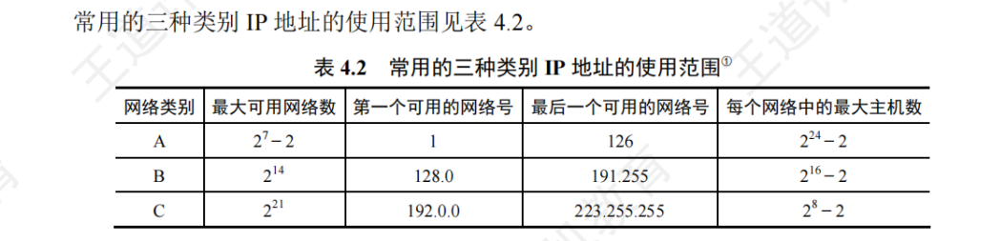

​	在表4.2中，A 类地址可用的网络数为2⁷-2,减2的原因是：第一，网络号字段全为0的IP  地址是保留地址，意思是本**网络**; 第二，网络号为127的IP 地址是环回自检地址。每个网络中的最大主机数减 2 的原因是：全 0 和全 1 的主机号一般不指派。

### 网络地址转换 (NAT)

​	网络地址转换 (Network   Address   Translation,NAT) 是指通过将专用网络地址(如Intranet)转换为公用地址(如Internet),   从而对外隐藏内部管理的IP 地址。它使得整个专用网只需要一个全球IP 地址就可与互联网连通，因为专用网本地IP 地址是可重用的，所以NAT 大大节省了IP 地址的消耗。同时，它隐藏了内部网络结构，从而降低了内部网络受到攻击的风险。

​	此外，为了网络安全，划出了三个私有IP 地址块。私有IP 地址只用于LAN,   不用于WAN连接(因此私有IP地址不能直接用于互联网，必须通过网关利用NAT将私有IP 地址转换为互联 网中合法的全球IP 地址后，才能出现在互联网上),并且允许私有IP 地址被LAN 重复使用。这 有效地解决了IP 地址不足的问题。这三个私有IP 地址块如下：
1：10.0.0.0/8,即10.0.0.0～10255.255.255,相 当 于 1 个A 类网络。

2：172.16.0.0/12,即 172.16.0.0～172.31.255.255,相当于16个连续的B 类网络。

3：192.168.0.0/16, 即192.168.0.0～192.168.255.255,相当于256个连续的C 类网络。
	在互联网中的所有路由器，对目的地址是私有地址的数据报一律不进行转发。这种采用私有 IP 地址的互联网络称为专用互联网或本地互联网。私 有IP 地址也称可重用地址。
	使用NAT 时需要在专用网连接到互联网的路由器上安装NAT 软件，NAT 路由器至少有一个 有效的外部全球IP 地址。当使用本地地址的主机和外界通信时，NAT 路由器使用NAT 转换表进  行本地IP 地址和全球IP 地址的转换。NAT 转换表中存放着{本地IP 地址：端口}到{全球IP 地址： 端口}的映射。通过这种映射方式，可让多个私有IP 地址映射到一个全球 IP 地址。

​	如图4.8所示，假设某家庭办理了10Mb/s 的电信宽带，那么该家庭就获得一个全球 IP 地 址(如138.76.29.7),而家庭网络内3台主机使用私有地址(如10.0.0.0网段),家庭网关路由 器应开启NAT 功能。NAT路由器的工作原理：

​	① 假设用户主机10.0.0.1(随机端口3345)向 Web 服务器128.119.40.186(端口80)发送请求。

​	② NAT 路由器收到IP 分组后，为该IP 分组生成一个新端口号5001,将IP 分组的源地址改为138.76.29.7(NAT 路由器的全球IP 地址), 将源端口号改为5001。NAT路由器在NAT转换表中增加一个表项。

​	③ Web 服务器并不知道刚 抵达的IP 分组已被NAT路由器改装，更不知道用户的专用地址，它响应的IP 分组的目的地址 是NAT路由器的全球IP 地址138.76.29.7,目的端口号是5001。

​	④ 响应分组到达NAT路由器 后，通过NAT转换表将IP 分组的目的IP 地址改为10.0.0.1,将目的端口号改为3345。

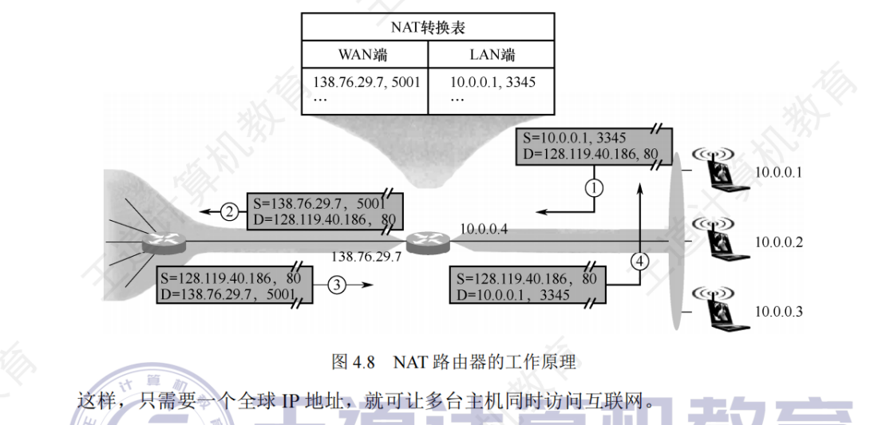

​	普通路由器在转发IP 分组时，其源IP 地址和目的IP 地址都不会改变。而 NAT 路由器在转发IP 分 组时，一定要更换其IP 地址(转换源IP 地址或目的IP 地址)。普通路由器仅工作在网络层，而NAT路 由器转发数据报时需要查看和转换传输层的端口号。

​	在某些场合，内网中的一些服务器需要向公网用户提供服务，比如私网中部署的一些 Web  服务器、 FTP   服务器等。此时，可在NAT  表中配置“公网IP  地址+端口号”与“私网 IP  地 址 + 端口号”的映射关系，实现公网用户通过该映射关系访问私网服务器的功能。

### 特定主机路由、默认路由

​	1：特定主机路由：对特定目的主机的IP 地址专门指明一个路由，以方便网络管理员控制和测试网络。若特定主机的IP 地址是a.b.c.d,   则转发表中对应项的目的网络是a.b.c.d/32。132表示的子网掩码没有意义，但是，这个特殊的前缀可以用在转发表中。 

​	2：默认路由：用特殊前缀 0.0.0.0/0 表示默认路由，全 0 掩码和任何目的地址进行按位与运算，结果必然为全 0,即必然和前缀 0.0.0.0/0 相匹配。只要目的网络是其他网络(不在转发表中), 就一律选择默认路由。默认路由通常用于路由器到互联网的路由，互联网包括无数的网络集合，不可能在路由表项中一一列出，因此只能采用默认路由的方式。
特定主机路由条目的匹配优先级最高，默认路由条目的匹配优先级最低。

### 地址解析协议

​	无论网络层使用什么协议，在实际网络的链路上传送数据帧时，最终必须使用硬件地址。所 以需要一种方法来完成 IP  地址到 MAC  地址的映射，这就是地址解析协议 (Address     Resolution Protocol,ARP) 。  每台主机都设有一个 ARP   高速缓存，用来存放本局域网上各主机和路由器的 IP 地址到MAC  地址的映射表，称 ARP 表。使用ARP 来动态维护ARP  表 。ARP 对高速缓存中的 每个映射表项都设置了生存时间(如20min),    超时的项目会从高速缓存中删除。

​	ARP 工作在网络层，其工作原理如下：主机 A 欲向本局域网上的某台主机 B 发送 IP 数据报时，先在其 ARP 高速缓存中查看有无主机 B 的 IP 地址。若有，则可以查出其对应的硬件地址，  再将此硬件地址写入 MAC  帧，然后通过局域网将该MAC  帧发往此硬件地址。若没有，则通过  使用目的MAC 地址为 FF-FF-FF-FF-FF-FF   的帧来封装并广播 ARP  请求分组(广播发送), 使同一个局域网里的所有主机都收到此ARP  请求。主机 B 收到该ARP  请求后，向主机 A 发出 ARP    响应分组(单播发送),分组中包含主机B 的 IP 地址与MAC 地址的映射关系，主机A 收 到ARP   响应分组后就将此映射写入ARP  缓存，然后按查询到的硬件地址发送MAC 帧 。ARP  因为“看到  了”IP 地址，所以它工作在网络层，而NAT 路由器因为“看到了”端口，所以它工作在传输层。 对于某个协议工作在哪个层次，读者应该能通过协议的工作原理进行推测。

​	ARP 用于解决同一局域网上的主机或路由器的 IP 地址和硬件地址的映射问题。若目的主机和源主 机不在同一个局域网上，则要通过ARP找到本局域网上的某个路由器的硬件地址，然后把分组发送给这 个路由器，让这个路由器把分组转发给下一个网络，剩下的工作就由下一个网络来做。尽管ARP 请求分 组是广播发送的，但 ARP 响应分组是普通的单播。

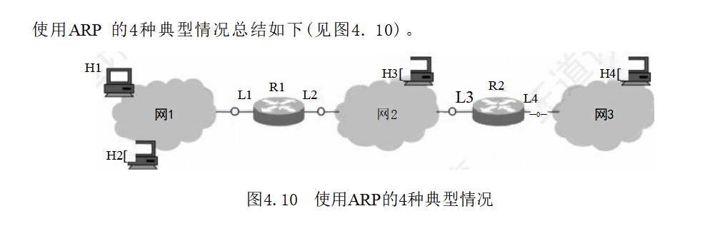

​	1：发送方是主机(如H1),    要 把IP  分组发送到本网络上的另一台主机(如H2) 。 这时 H1 在 网 1 用ARP 找到目的主机H2 的硬件地址。
​	2：发送方是主机(如H1),    要把 IP 分组发送到其他网络上的一台主机(如H4) 。 这 时 H1   用 ARP 找到与网1连接的路由器R1 的硬件地址(默认网关),剩下的工作由R1 来完成。

​	开始在H1 和R1之间传送时，MAC帧首部中的源地址是H1的MAC地址，目的地址是L1 的硬件地址，路由器R1收到此MAC帧后，在数据链路层，要丢弃原MAC的首部和尾部。这时首部中的源地址和目的地址分别为L2 和L3的MAC地址。路由器R2收到此帧后，再次更换MAC帧的首部和尾部， 首部中的源地址和目的地址分别变为L4 和H4 的MAC 地址。MAC 帧首部的这种变化，在上面的IP 层 中是看不见的。

3：发送方是路由器(如R1),  要 把IP 分组转发到与 R1 连接的网络(网2)上的一台主机(如 H3) 。 这时R1 在网2用ARP 找到目的主机H₃ 的硬件地址。
4：发送方是路由器(如R1),    要把IP 分组转发到网3上的一台主机(如H4) 。 这时R1 在 网 2 用ARP 找到与网2连接的路由器R2 的硬件地址，剩下的工作由R2 来完成。
	从 IP  地址到硬件地址的解析是自动进行的，主机的用户并不知道这种地址解析过程。只要 主机或路由器和本网络上的另一个已知 IP 地址的主机或路由器进行通信，ARP 就自动地将这个 IP 地址解析为数据链路层所需的硬件地址，然后插入MAC  帧。

### 动态主机配置协议DHCP

​	动态主机配置协议(Dynamic Host Configuration Protocol,DHCP)常用于给主机动态地分配 IP  地址，它提供了即插即用的联网机制，这种机制允许一台计算机加入新的网络和自动获取 IP 地址而不用手工参与。DHCP是应用层协议，它是基于UDP 的 。

​	DHCP 使用客户/服务器模型。其工作原理：需要IP 地址的主机在启动时就向DHCP  服务器 广播发送发现报文，这时该主机就成为DHCP 客户。本地网络上的所有主机都能收到这个广播报 文，但只有DHCP 服务器才能回答该广播报文。DHCP 服务器先在其数据库中查找该计算机的配 置信息。若找到，则返回找到的信息；若找不到，则从服务器的IP 地址池中取一个地址分配给该 主机。DHCP 服务器的回答报文称为提供报文，包含提供的 IP 地址等配置信息。

DHCP 服务器和DHCP 客户的交换过程如下：
	1：DHCP    客户广播 “DHCP  发现”消息，试图找到网络中的DHCP  服务器，以便从 DHCP 服务器获得一个IP 地址。源地址为0.0.0.0,目的地址为255.255.255.255。
	2：DHCP    服务器收到 “DHCP   发现”消息后，广播 “DHCP   提供”消息，其中包括提供给 DHCP 客户机的IP 地址。源地址为 DHCP 服务器地址，目的地址为255.255.255.255。
	3：DHCP   客户收到 “DHCP  提供”消息，若接受该 IP 地址，则广播 “DHCP 请求”消息向 DHCP 服务器请求提供IP 地址。源地址为0.0.0.0,目的地址为255.255.255.255。
	4：DHCP   服务器广播 “DHCP 确认”消息，将 IP 地址分配给DHCP 客户。源地址为DHCP 服务器地址，目的地址为255.255.255.255。

​	DHCP 服务器分配给 DHCP 客户的IP 地址是临时的，因此DHCP 客户只能在一段有限的时 间内使用这个分配到的 IP 地址。DHCP  称这段时间为租用期。租用期的数值应由 DHCP  服务器 自己决定，DHCP 客户也可在自己发送的报文中提出对租用期的要求。DHCP 客户可随时提前终 止服务器提供的租用期，这时只需向DHCP 服务器发送释放报文。
​	DHCP 客户和服务器端需要通过广播方式来进行交互，原因是在DHCP 执行初期，客户机不知道服务器端的IP 地址，而在执行中间，客户机并未被分配IP 地址，从而导致两者之间的通信 必须采用广播的方式。采用 UDP 而不采用TCP 的原因也很明显：TCP 需要建立连接，若连对方 的IP 地址都不知道，则更不可能通过双方的套接字建立连接。

### 网际控制报文协议 ICMP

​	为了有效地转发 IP  数据报和提高交付成功的机会，在网络层使用了网际控制报文协议 (Internet   Control   Message   Protocol,ICMP),  让主机或路由器报告差错和异常情况。ICMP 报文被 封装在IP 数据报中发送，但 ICMP 不是高层协议，而是网络层的协议。
ICMP 报文有两种，即IC MP 差错报告报文和 ICMP 询问报文。

ICMP 差错报告报文用于目标主机或到目标主机路径上的路由器，向源主机报告差错和异常 情况。共有以下5种常用的类型：
	1：终点不可达。 当路由器或主机不能交付数据报时，就向源点发送终点不可达报文。
	2：源点抑制①。当路由器或主机因为拥塞而丢弃数据报时，就向源点发送源点抑制报文，使 源点知道应当把数据报的发送速率放慢。
	3：时间超过。当路由器收到一个数据报时，会将其首部中生存时间 (TTL)   的值减1。若结 果不为0,则路由器将该数据报转发出去。若结果为0,则路由器不但要丢弃该数据报， 而且要向源点发送时间超过报文。当终点在预先规定的时间内不能收到一个数据报的全 部数据报片时，就把已收到的数据报片都丢弃，并向源点发送时间超过报文。
	4：参数问题。当路由器或目的主机收到的数据报的首部中有的字段(注意不是任意字段) 的值不正确时，就丢弃该数据报，并向源点发送参数问题报文。
	5：改变路由(重定向)。路由器把改变路由报文发送给主机，让主机知道下次应将数据报发 送给另外的路由器(可通过更好的路由)。
对于以下几种情况，不应发送ICMP 差错报告报文：
1：对 ICMP 差错报告报文，不再发送ICMP 差错报告报文。
2：对第一个分片的数据报片的所有后续数据报片，都不发送ICMP 差错报告报文。
3：对具有多播地址的数据报，都不发送ICMP 差错报告报文。
4：对具有特殊地址(如127.0.0.0或0.0.0.0)的数据报，不发送ICMP 差错报告报文。 

常用的ICMP 询问报文有两种类型：
1：回送请求和回答报文。用来测试目的主机是否可达以及了解其有关状态。
2：时间戳请求和回答报文。利用报文中记录的时间戳，发送方可计算出当前的往返时延。
	ICMP 的两个常见应用是分组网间探测 PING (用来测试两台主机之间的连通性)和 Traceroute (UNIX中的名字，在Windows中是Tracert, 可以用来跟踪分组经过的路由)。其中PING 使用了ICMP回送请求和回答报文，Traceroute(Tracert)使用了ICMP 时间超过报文。

PING工作在应用层，它直接使用网络层的ICMP;Traceroute/Tracert  工作在网络层。

### IPV6

**IPV6特点**	

​	1：更大的地址空间。这是最重要的。 IPv6 将地址从IPv4 的32位增大到128位， IPv6 的地 址空间是IPv4 的2¹²8/2³²=2 倍，从长远来看，这些地址是绝对够用的。
​	2：扩展的地址层次结构。IPv6 因为地址空间很大，所以可以划分为更多的层次。
​	3：灵活的首部格式。 IPv6 定义了许多可选的扩展首部，不仅可提供比IPv4 更多的功能，还 能提高路由器的处理效率，这是因为路由器对扩展首部不进行处理。
​	4：改进的选项。IPv6  首部长度是固定的，其选项放在有效载荷中，选项是灵活可变的。而 IPv4 所规定的选项是固定不变的，其选项放在首部的可变部分。
​	5：允许协议继续扩充。 IPv6 允许不断扩充功能，而IPv4 的功能是固定不变的。
​	6：支持即插即用(自动配置)。因此IPv6 不需要使用DHCP。
​	7：支持资源的预分配。 IPv6 支持实时音/视频等要求保证一定带宽和时延的应用。
​	8：IPv6 只有源主机才能分片，是端到端的，不允许类似IPv4 在中间路由器进行分片。
​	9：IPv6 首部长度是固定的40B, 而 IPv4 首部长度是可变的(必须是4B 的整数倍)。
​	10：增大了安全性。身份鉴别和保密功能是IPv6 的扩展首部。
​	虽然IPv6 与 IPv4不兼容，但总体而言它与所有其他的互联网协议兼容，包括TCP 、UDP、 ICMP 、IGMP 和 DNS 等，只是在少数地方做了必要的修改(大部分是为了处理长地址)。

**IPv6数据报的基本首部**

​	IPv6 数据报由两部分组成：基本首部和有效载荷(也称净负荷)。有效载荷由零个或多个扩 展首部 (扩展首部不属于IPv6 数据报的首部)及其后面的数据部分构成，如图4.11所示。

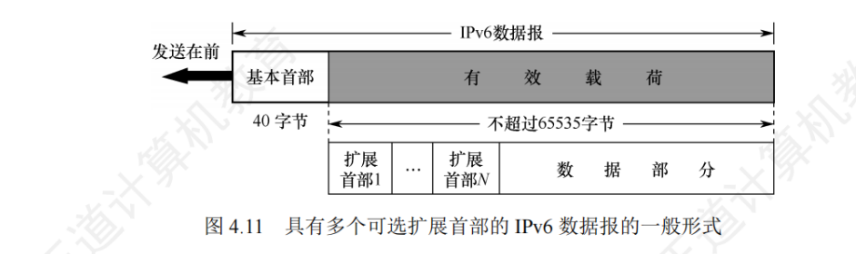

与IPv4 相 比 ，IPv6 对首部中的某些字段进行了如下更改：
	1：取消了首部长度字段，因为它的首部长度是固定的(40B)。
	2：取消了服务类型字段，因为优先级和流标号字段实现了服务类型字段的功能。
	3：取消了总长度字段，改用有效载荷长度字段。
	4：取消了标识、标志和片偏移字段，因为这些功能已包含在分片扩展首部中。
	5：把TTL 字段改称为跳数限制字段，但作用是一样的(名称与作用更加一致)。
	6：取消了协议字段，改用下一个首部字段。
	7：取消了检验和字段，毕竟在传输层有差错检验功能，这样就加快了路由器的处理速度。
	8：取消了选项字段，而用扩展首部来实现选项功能。

​	因为取消了首部中不必要的功能，IPv6 基本首部的字段数减少到只有8个，但是由于IPv6 地址长度为128位，所以IPv6 基本首部的长度反而增大到40B。IPv6数据报的基本首部的格式如 图4.12所示。

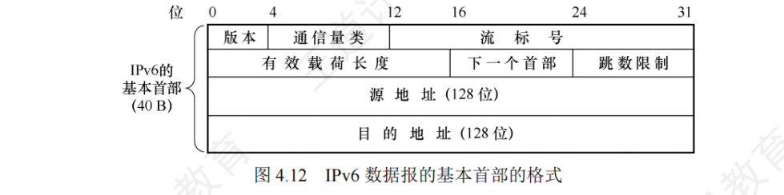

下面简单介绍IPv6 基本首部中各字段的含义：
	1：版本。占4位，指明协议的版本，对于IPv6 该字段的值是6。
	2：通信量类。 占8位，用来区分不同的IPv6 数据报的类别或优先级。
	3：流标号。占20位，IPv6 提出流的抽象概念。流是指互联网上从特定源点到特定终点(单 播或多播)的一系列数据报(如实时音/视频传输),而在这个流所经过的路径上的路
由器都保证指明的服务质量。所有属于同一个流的数据报都具有相同的流标号。
	4：有效载荷长度。占16位，指明 IPv6 数据报除基本首部以外的字节数(所有扩展首部都 算在有效载荷之内)。这个字段的最大值是65535(单位为字节)。
	5：下一个首部。占8位，该字段相当于IPv4首部中的协议字段或可选字段。当IPv6 没有扩 展首部时，其作用与IPv4 的协议字段一样，它指明IPv6 数据报所运载的数据是何种协议 数据单元；当IPy6 带有扩展首部时，它就标识后面第一个扩展首部的类型。(
	6：跳数限制。占8位，类似于IPv4 首部的TTL 字段。源点在每个数据报发出时即设定某个 限制值(最大为255)。路由器每次转发时将其值减1,减为0时就将该数据报丢弃。
	7：源地址和目的地址。 占128位，是数据报的发送端/接收端的IP 地址。

### IPv6地址的分类

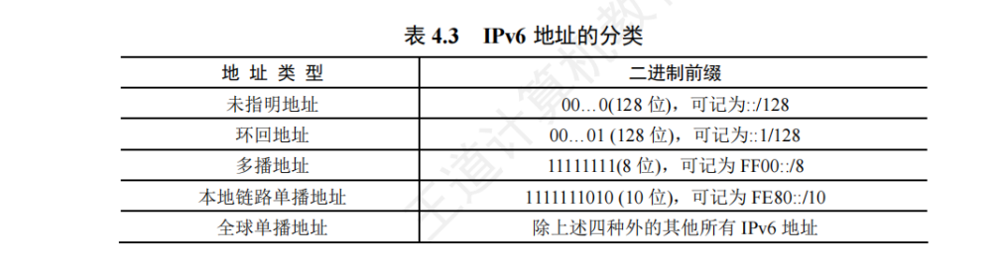

对表4.3给出的五类地址简单解释如下：
	1：未指明地址：该地址不能用作目的地址，只能用于还未配置IPv6 地址的主机作为源地址。
	2：环回地址：该地址的作用与IPv4 的环回地址相同，但IPv6 的环回地址仅此一个。
	3：多播地址：该地址的作用和IPv4的一样。这类地址占IPv6 地址空间的1/256。
	4：本地链路单播地址：该地址的作用类似于IPv4 的私有IP 地址。
	5：全球单播地址：用得最多的地址。

​	IPv6 全球单播地址采用三级结构(见图4.13):第一 级为全球路由选择前缀，占48位，用于互联网中的路由选择，相当于IPv4 分类地址中 的网络号；第二级为子网标识符，占16位，用于各机构构建自己的子网；第三级为接口 标识符，用于指明主机或路由器的单个网络接口，相当于IPv4 分类地址中的主机号。

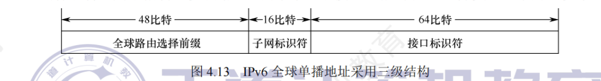

### 从 IPv4  向 IPv6  过 渡

​	从IPv4 向 IPv6 过渡只能采用逐步演进的办法，同时还必须使新安装的IPv6 系统能够向后兼 容。IPv6 系统必须能够接收和转发IPv4 分组，并且能够为IPv4 分组选择路由。

从 IPv4 向 IPv6 过渡可以采用下列两种策略：
	1：双协议栈，是指在一台设备上同时装有 IPv4 和 IPv6 两个协议栈，分别配置了一个 IPv4 地址和一个 IPv6 地址，因此这台设备既能和IPv4 网络通信，又能和 IPv6 网络 通信。双协议栈主机在与IPv6 主机通信时采用IPv6 地址，而在与 IPv4 主机通信时 采用 IPv4 地址，双协议栈主机使用应用层的域名系统 (DNS)   获知目的主机采用的 是哪种地址。若DNS 返回的是IPv4 地址，则双协议的源主机就使用IPv4 地址。若 DNS 返回的是 IPv6 地址，则双协议栈的源主机就使用IPv6 地址。
	2：隧道技术，是指在IPv6 数据报要进入 IPv4 网络时，把整个IPv6 数据报封装成IPv4 数据报的数据部分，使原来的IPv6 数据报就好像在IPv4 网络的隧道中传输。当IPv4  数据报离开IPv4 网络时，再将其数据部分交给主机的IPv6 协议。

路由信息协议

​	路由信息协议(Routing Information Protocol, RIP)是内部网关协议 IGP 中最先得到广泛应用的协议。RIP 是一种分布式的基于距离向量的路由选择协议。

**RIP 的规定**

​	1：网络中的每个路由器都要维护从它自身到其他每个目的网络的距离记录，即距离向量。
​	2：RIP 使用跳数 (Hop   Count) (或称距离)来衡量到达目的网络的距离。规定从一路由器 到直接连接的网络的距离定义为1;而每经过一个路由器，距离就加1。
​	3：RIP 认为好的路由就是它通过的路由器数量少，即距离短或跳数少。

​	4：RIP 允许一条路径最多只能包含15个路由器。因此距离等于16时表示网络不可达。可见 RIP 只适用于小型互联网。距离向量路由可能会出现环路的情况，规定路径上的最高跳数 的目的是防止分组不断在环路上循环，减少网络拥塞的可能性。
​	5：每个路由表项都有三个关键字段：<目的网络N,   距离d,   下一跳路由器地址X>。

**RIP 的特点**

​	RIP的每个路由器都要不断与其他路由器交换信息，下面三个特点非常重要。
​	1：和谁交换信息：仅和直接相邻的路由器交换信息。
​	2：交换什么信息：交换的信息是本路由器所知道的全部信息，即自己的路由表。
​	3：何时交换信息：按固定的时间间隔(通常为30秒)交换路由信息。当网络拓扑发生变化 时，路由器也及时向相邻路由器通告拓扑变化后的路由信息。
​	路由器刚开始工作时，只知道自己到直接相连的几个网络的距离为1。每个路由器仅和相邻 路由器周期性地交换并更新路由信息。经过若干次交换和更新后，所有的路由器最终都会知道到 达本自治系统内任何网络的最短距离和下一跳路由器的地址，称为收敛。

​	RIP 是应用层协议，它使用UDP 传送数据(端口520)。 RIP 选择的路径不一定是时间最短 的，但一定是具有最少的路由跳数，因为它是根据最少跳数进行路径选择的。

**RIP  的距离向量算法**

对每个相邻路由器发送来的RIP 报文，执行如下步骤：
1：对地址为X 的相邻路由器发来的RIP 报文，先修改该报文中的所有项目：把“下一跳” 字段中的地址都改为X,  并把所有“距离”字段的值加1。
2：对修改后的RIP 报文中的每个项目，执行如下步骤：
IF(若原来的路由表中没有目的网络N) 则把该项目添加到路由表中(表明这是新的目的网络)。
	ELSEIF  (若原来的路由表中有目的网络N,  且下一跳路由器的地址是X) 用收到的项目替换原路由表中的项目(因为要以更新的消息为准)。
	ELSEIF  (若原来的路由表中有目的网络N,    且下一跳路由器的地址不是X) 若收到的项目中的距离d 小于路由表中的距离，则进行更新。
ELSE  什么也不做。
3 ) 若180 秒(RIP  默认超时时间)还没有收到相邻路由器的更新路由表，则把此相邻路由器 记为不可达的路由器，即把距离设置为16(表示不可达)。
4 ) 返回 。

​	下面举例说明RIP 路由条目的更新过程。已知路由器 R6 和 R4 互为相邻路由器，表4.4(a) 所 示 为R6 的路由表，现在收到相邻路由器 R4 发来的路由更新信息，如表4.4(b) 所示。

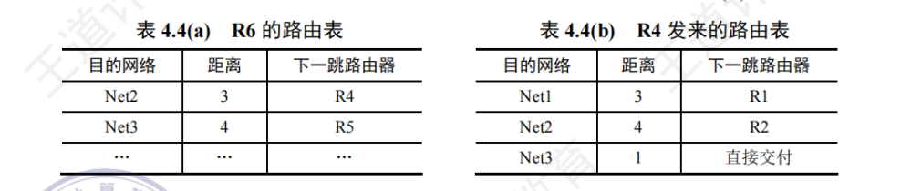

​	现在试更新R6 的路由表。先把R4 发来的路由表[表4.4(b)]   中各项的距离都加1,并把下 一跳路由器都改为R4,   得到表4.5(a)。将这个表的每行与R6 的路由表[表4 .4(a)]   进行比较。
​	第 一 行的Net1 在表4.4(a)中没有，因此要把这一行添加到表4.4(a)中 。
​	第二行的Net2 在表4.4(a)中有，且下一跳路由器也是R4, 因此要更新(距离增大了)。
​	第三行的Net3 在表4.4(a)中有，但下一跳路由器不同。于是需要比较距离。新的路由信息的距离是 2, 小于原表中的4, 因此要更新。这样，得出更新后的R6 的路由表如表4.5(b) 所示。

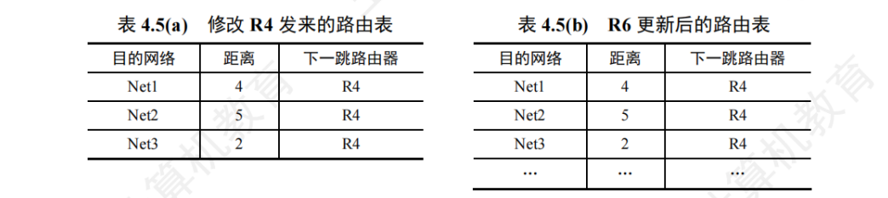

**RIP 的优点：**
	1：实现简单、开销小、收敛过程较快。
	2：若一个路由器发现了更短的路由，则这种更新

信息就传播得很快，在较短时间内便可被传至所有路由器，俗称“好消息传播得快”。
**RIP 的缺点：**
	1：RIP    限制了网络的规模，它能使用的最大距离为15(16表示不可达)。
	2：路由器之间交换的是路由器中的完整路由表，因此网络规模越大，开销也越大。
	3：当网络出现故障时，路由器之间需反复多次交换信息才能完成收敛，要经过较长时间才 能将故障消息传送到所有路由器 (慢收敛现象),俗称坏消息传播得慢。

​	下面举例说明 RIP“好消息传播得快，坏消息传播得慢”的特点。假设图4.17中的路由器都 采用RIP 交换路由信息，初始时 R1 到网络N 的距离为4,且R1和 R2 均已收敛。

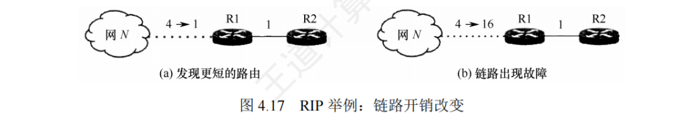

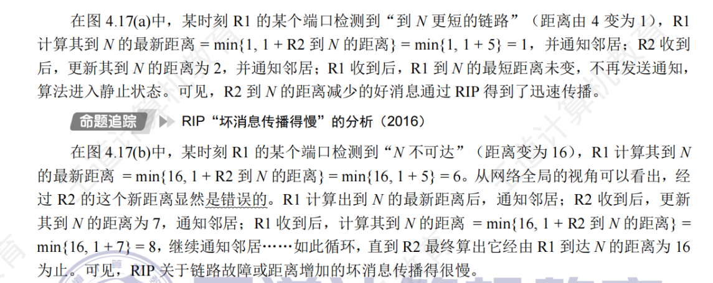

### 开放最短路径优先协议

**1.   开放最短路径优先 (OSPF)   的基本特点**

OSPF 协议是使用分布式链路状态路由算法的典型代表，也是内部网关协议(IGP) 的一种。 与 RIP 相比，OSPF 有下面4个主要特点：
	1：OSPF  使用洪泛法向本自治系统中所有路由器发送信息，路由器通过所有输出端口向所有 相邻的路由器发送信息，而每个相邻的路由器又将此信息发往所有的相邻路由器(但不 再发送给刚刚发来信息的那个路由器)。这样，最终整个区域中所有的路由器都得到了这 个信息的一个副本。而RIP 仅仅向自己相邻的几个路由器发送信息。
	2：发送的信息是与本路由器相邻的所有路由器的链路状态，但是，这只是路由器所知道的 部分信息。而在RIP 中，发送的信息是本路由器所知道的全部信息，即整个路由表。
	3：只有当链路状态发生变化时，路由器才用洪泛法向所有路由器发送此信息，并且更新过程收敛得快，不会出现 RIP “坏消息传得慢”的问题。而在RIP  中，不管网络拓扑是否 发生变化，路由器之间都要定期交换路由表的信息。

​	4：OSPF  是网络层协议，它不用UDP 或 TCP, 而直接用IP 数据报传送(其IP 数据报首部 的协议字段为89)。而RIP 是应用层协议，它在传输层使用UDP。

**除以上区别外，OSPF 还有以下特点：**
	1：OSPF   允许对每条路由设置成不同的代价，对于不同类型的业务可计算出不同的路由。
	2：若到同一个目的网络有多条相同代价的路径，则可将通信量分配给这几条路径。
	3：OSPF  分组具有鉴别功能，从而保证仅在可信赖的路由器之间交换链路状态信息。
	4：OSPF  支持可变长度的子网划分和无分类编址CIDR。
	5：每个链路状态都带上一个32位的序号，序号越大，状态就越新。

**OSPF  的基本工作原理**

​	因为各路由器之间频繁地交换链路状态信息，所以所有路由器最终都能建立一个链路状态数 据库，即全网的拓扑结构图。然后，每个路由器利用链路状态数据库中的数据，使用 Dijkstra 算 法计算自己到达各目的网络的最优路径，构造出自己的路由表。此后，当链路状态发生变化时， 每个路由器重新计算到达各目的网络的最优路径，构造出新的路由表。

​	虽然使用 Dijkstra 算法能计算出完整的最优路径，但路由表中不会存储完整路径，而只存储 下 一 跳 (只有到了下 一 跳路由器，才能知道再下 一 跳应当怎样走)。

​	为了使 OSPF 能用于规模很大的网络，将一个自治系统再划分为若干更小的范围，称为区域。 划分区域的好处是，把利用洪泛法交换链路状态信息的范围局限在各个区域，而不是整个 AS,  从而减少了整个网络上的通信量。在一个区域内，由一个或多个区域边界路由器负责为流向该区  域以外的分组提供路由选择。在AS  内只有一个区域配置成主干区域，它包含AS 内的所有区域边界路由器，可能还包含一些非边界路由器，主干区域的作用是连通其他区域。当分组在AS 内  的不同区域之间传送时，要先找到本区域内的一个区域边界路由器(如R3 、R4 、R7), 再通过主干区域路由到位于目的区域的区域边界路由器，最后路由到目的地。在图4.18中，R3 、R4 和 R7 都是区域边界路由器，每个区域至少有一个区域边界路由器。主干区域还要有一个路由器专门负  责和本AS 外的其他AS 交换路由器信息，称为自治系统边界路由器(如R6)。

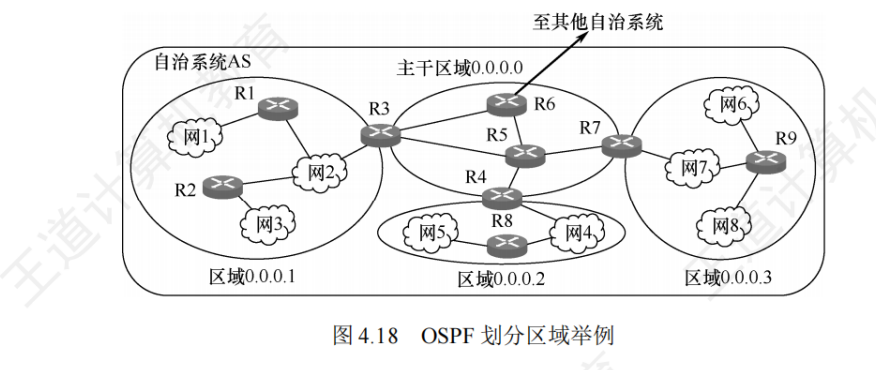

3.OSPF    的分组类型
**OSPF 共有以下五种分组类型：**
	1：问候分组，用来发现和维持邻站的可达性。
	2：数据库描述分组，向邻站给出自己的链路状态数据库中的所有链路状态项目的摘要信息。
	3：链路状态请求分组，向对方请求发送某些链路状态项目的详细信息。
	4：链路状态更新分组，用洪泛法对全网更新链路状态，它是OSPF 最核心的部分。

​	5：链路状态确认分组，对链路更新分组的确认。
​	通常网络中传送的大多数OSPF 分组都是问候分组。OSPF 规定，两个相邻路由器每隔10秒 要交换一次问候分组，以便知道哪些邻站可达。若有40秒没有收到某个相邻路由器发来的问候 分组，则认为该相邻路由器不可达，应立即修改链路状态数据库，并重新计算路由表。
​	路由器刚开始工作时，它只能通过问候分组得知它与哪些路由器相邻，以及相应链路的代价。 为了得到链路状态数据库，若让所有路由器都将自己的本地链路状态信息进行全网广播，则未免  开销太大。因此，OSPF  让每个路由器使用数据库描述分组和相邻路由器交换本数据库中已有的  链路状态摘要信息。然后，路由器使用链路状态请求分组，向对方请求发送自己所缺少的某些链  路状态项目的详细信息。通过一系列的这种分组交换，就建立了全网同步的链路数据库。图4.19 给出了OSPF 的基本操作，说明了两个路由器需要交换的各种类型的分组。

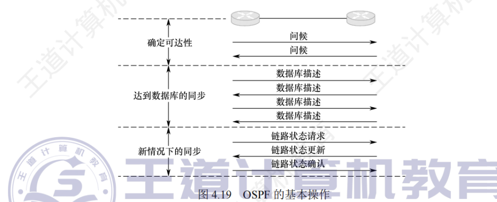

​	在网络运行的过程中，只要一个路由器的链路状态发生变化，该路由器就要使用链路状态更 新分组，用可靠的洪泛法向全网更新链路状态，其他路由器在收到更新分组后要发送确认。
​	为了确保链路状态数据库与全网的状态保持一致，OSPF 还规定每隔一段时间(如30分钟) 要刷新一次数据库中的链路状态。因为一个路由器的链路状态只涉及与相邻路由器的连通状态， 与整个网络的规模并无直接关系，所以当互联网规模很大时，OSPF 要比RIP 好得多。

### 边界网关协议

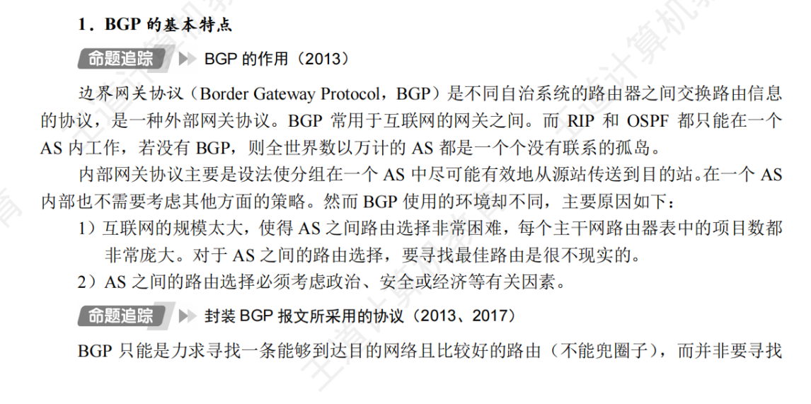

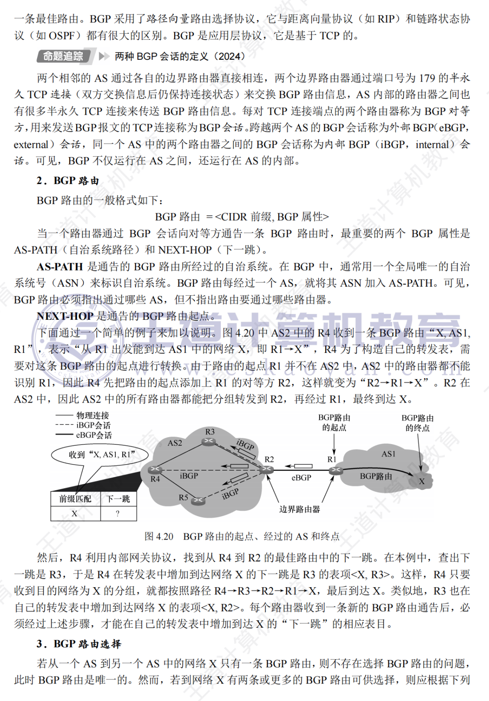

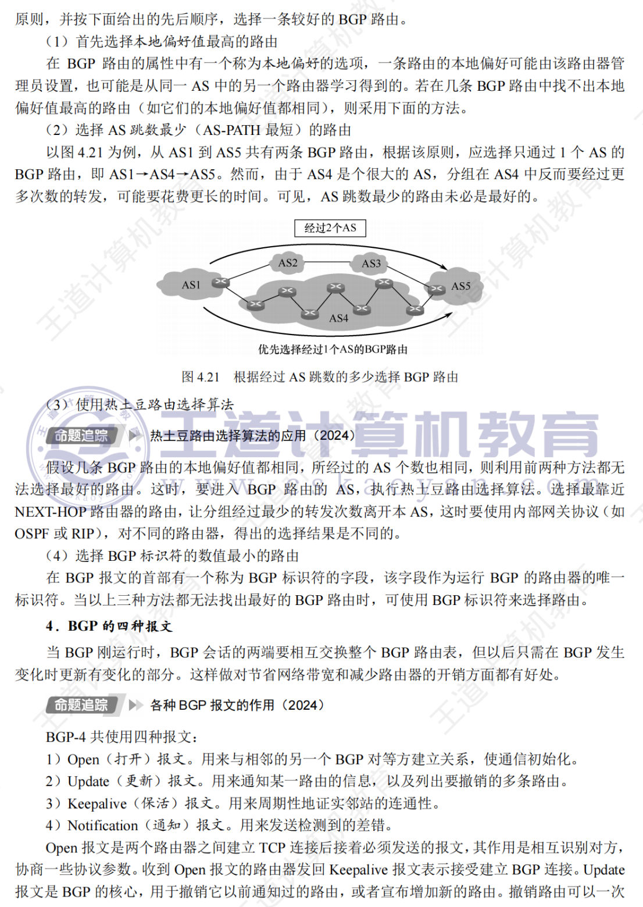

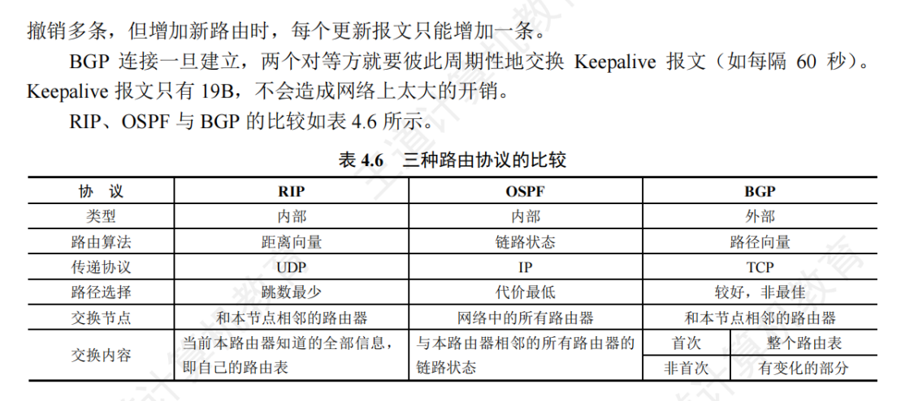

### IP 多播

4.5.1  多播的概念
	多播(也称组播)是让源主机一次发送的单个分组可以抵达用一个组地址标识的若干目的主机，即一对多的通信。在互联网上进行的多播，称为IP 多播。
	与单播相比，在一对多的通信中，多播可大大节约网络资源。假设视频服务器向90台主 机传送同样的视频节目，单播与多播的比较如图4.22所示。多播时仅发送一份数据，并且只需发送 一 次 ， 只有在传送路径出现分岔时才将分组复制后继续转发 ， 因此大大减轻了发送者的负担和网络的负载。多播需要路由器的支持才能实现，能够运行多播协议的路由器称为多播路由器

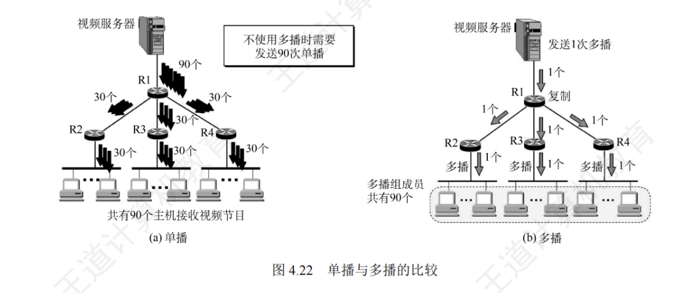

**IP 多播地址**

​	多播数据报的源地址是源主机的 IP 地址，目的地址是 IP 多播地址。IP 多播地址就是 IPv4 中的D 类地址。D 类地址的前四位是1110,因此D 类地址范围是224.0.0.0～239.255.255.255。每 个D 类IP 地址标志一个多播组，一台主机可以随时加入或离开一个多播组。
多播数据报和一般的IP 数据报的区别是，前者使用D 类 IP 地址作为目的地址，并且首部中 的协议字段值是2,表明使用IGMP。 需要注意的是：
​	1：多播数据报也是“尽最大努力交付”,不提供可靠交付。
​	2：多播地址只能用于目的地址，而不能用于源地址。
​	3：对多播数据报不产生ICMP 差错报文。
​	IP 多播可以分为两种：①只在本局域网上进行硬件多播；②在互联网的范围内进行多播。目前大部分主机都是通过局域网接入互联网的。因此，在互联网上进行多播的最后阶段，还是要把 多播数据报在局域网上用硬件多播交付给多播组的所有成员[见图4.22(b)]。
​	多播机制仅应用于UDP,  它能将报文同时发送给多个接收者。而TCP 是一个面向连接的协议，它意味着分别运行在两台主机的进程之间存在一条连接，因此会一对一地发送。

**在局域网上进行硬件多播**

​	因为局域网支持硬件多播，所以只要把IP 多播地址映射成多播MAC  地址，即可将 IP 多播 数据报封装在局域网的MAC 帧中，而MAC 帧首部的目的MAC 地址字段就设置为由IP 多播地 址映射成的多播 MAC 地址。这样，就很方便地利用硬件多播实现了局域网内的IP 多播。
​	IANA 拥有的以太网多播地址的范围是从01-00-5E-00-00-00到01-00-5E-7F-FF-FF。在这些地 址中，只有后23位可用作多播。但D 类IP 地址可供分配的有28位，即这28位中的前5位无法映 射到以太网多播地址，因此两者是多对一的映射关系，如图4.23所示。
​	例如，IP 多播地址224.128.64.32(E0-80-40-20) 和另一个IP 多播地址224.0.64.32(E0-00-40-20)   转换成以太网的多播地址都是01-00-5E-00-40-20。因此收到多播数据报的主机，还要在IP 层利用 软件进行过滤，把不是本主机要接收的数据报丢弃。

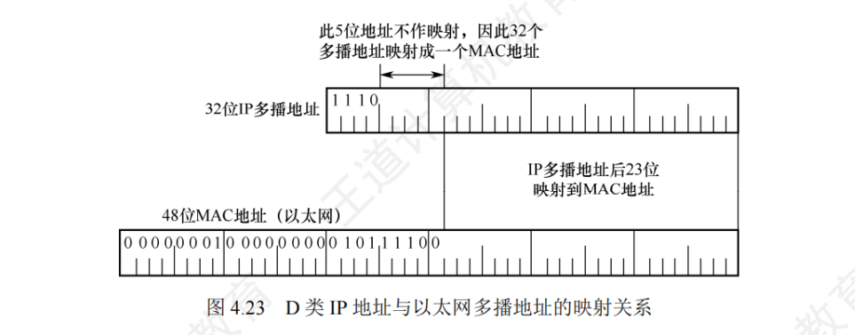

**IGMP与多播路由协议**

​	路由器要获得多播组的成员信息，需要利用网际组管理协议 (Internet  Group  Management Protocol,IGMP)。 连接到局域网上的多播路由器还必须和互联网上的其他多播路由器协同工 作，以便把多播数据报用最小代价传送给所有组成员，这就需要使用多播路由选择协议。
​	IGMP 是让连接到本地局域网上的多播路由器，知道本局域网上是否有主机参加或退出了某 个多播组。IGMP 并不是在互联网范围内对所有多播组成员进行管理的协议。IGMP 不知道IP 多 播组包含的成员数，也不知道这些成员分布在哪些网络上。
​	IGMP 报文被封装在IP 数据报中传送，但它也向IP 提供服务。因此不把 IGMP 视为一个单 独的协议，而视为整个网际协议IP 的一个组成部分。IGMP 的工作可分为两个阶段。
​	第一阶段：当某台主机加入新的多播组时，该主机应向多播组的多播地址发送一个IGMP 报 文，声明自己要成为该组的成员。本地的多播路由器收到IGMP 报文后，还要利用多播路由选择 协议，把这种组成员关系转发给互联网上的其他多播路由器。
​	第二阶段：组成员关系是动态的。本地多播路由器要周期性地探询本地局域网上的主机，以 便知道这些主机是否仍然是组的成员。只要对某个组有一台主机响应，多播路由器就认为这个组 是活跃的。但一个组在经过几次探询后仍然没有一台主机响应，多播路由器就认为本网络上的主 机都已离开了这个组，因此就不再把这个组的成员关系转发给其他的多播路由器。
​	多播路由选择实际上就是要找出以源主机为根节点的多播转发树，其中每个分组在每条链路 上只传送一次(在多播转发树上的路由器不会收到重复的多播数据报)。不同的多播组对应于不 同的多播转发树；同一个多播组，对不同的源点也会有不同的多播转发树。

### 移动 IP

**4.6.1   移 动 IP 的概念**

​	移动IP 技术是指移动站以固定的IP 地址实现跨越不同网络的漫游功能，并保证基于IP 的网 络权限在漫游过程中不发生任何改变。移动IP 的目标是把分组自动地投递给移动站。一个移动站是把其连接点从一个网络或子网改变到另一个网络或子网的主机。

移动IP 定义了三种功能实体：移动节点、本地代理(也称归属代理)和外地代理。
	1：移动节点。 具有永久IP 地址的移动主机。
	2：本地代理。通常就是连接在归属网络(原始连接到的网络)上的路由器。
	3：外地代理。通常就是连接在被访网络(移动到另一地点所接入的网络)上的路由器。
	值得注意的是，某用户将笔记本关机后从家里带到办公室重新上网，在办公室能很方便地通 过 DHCP  自动获取新的IP  地址。虽然笔记本移动了，更换了地点及所接入的网络，但是，这并 不是移动 IP 。但是，若我们需要在移动中进行 TCP  传输，则在移动站漫游时，应一直保持这个 TCP 连接，否则移动站的 TCP  连接就会断断续续。可见，若要使移动站在移动中的TCP 连接不 中断，就必须使笔记本的IP 地址在移动中保持不变。这就是移动IP 要研究的问题。

### 移动IP 通信过程

​	用一个通俗的例子来描述移动 IP 的通信原理。例如，在以前科技不那么发达的年代，本科 毕业时都将走向各自的工作岗位。因为事先并不知道自己未来的准确通信地址，所以怎样继续和 同学们保持联系呢?实际上也很简单。彼此留下各自的家庭地址(永久地址)。毕业后若要和某 同学联系，只要写信寄到该同学的永久地址，再请其家长把信件转交即可。
​	在移动IP 中，每个移动站都有一个原始地址，即永久地址(或归属地址),移动站原始连接的网络称为归属网络。永久地址和归属网络的关联是不变的。在图4.24中，移动站 A 的永久地 址是 131.8.6.7/16,而其归属网络是 131.8.0.0/16。归属代理通常是连接到归属网络上的路由器， 然而它实现的代理功能是在应用层完成的。当移动站移动到另一地点，所接入的外地网络也称被 访网络。在图4.24中，移动站A 被移动到被访网络15.0.0.0/8。被访网络中使用的代理称为外地 代理，它通常是连接在被访网络上的路由器。外地代理有两个重要功能：①要为移动站创建一个
临时地址，称为转交地址。在图4.24中，移动站 A 的转交地址是15.5.6.78。转交地址的网络号
显然和被访网络一致。②及时把移动站的转交地址告诉其归属代理。

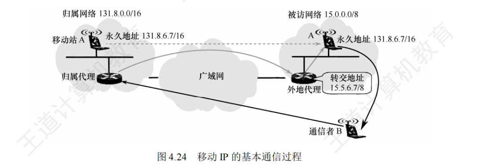

​	请注意两点：转交地址是供移动站、归属代理及外地代理使用的，各种应用程序都不会使用。 外地代理要向连接在被访网络上的移动站发送IP 分组时，直接使用移动站的MAC  地址。
​	在图4.24中，通信者B 要和移动站A 进行通信。B 并不知道A 在什么地方，但 B 使 用A 的 永久地址作为发送的IP 分组中的目的地址，移动IP 的基本通信流程如下：
​	1：移动站A 在归属网络时，按传统的TCP/IP 方式进行通信。
​	2：移动站 A 漫游到被访网络时，向外地代理进行登记，以获得一个临时的转交地址。外地 代理要向A 的归属代理登记A 的转交地址。

​	3：归属代理知道移动站A 的转交地址后，会构建一条通向转交地址的隧道，将截获的发送 给 A 的 IP 分组进行再封装，并通过隧道发送给被访网络的外地代理。
​	4：外地代理把收到的封装的IP 分组进行拆封，恢复成原始的IP 分组，然后发送给移动站A, 这样 A 在被访网络就能收到这些发送给它的 IP 分组。
​	5：移动站A 在被访网络对外发送IP 分组时，仍然使用自己的永久地址作为IP 分组的源地 址，此时显然无须通过A 的归属代理来转发，而是直接通过被访网络的外部代理。
​	6：移动站A 移动到另一被访网络时，在新外地代理登记后，然后新外地代理将A 的新转 交地址告诉其归属代理。无论如何移动，A 收到的IP 分组都是由归属代理转发的。
​	7：移动站A 回到归属网络时，A  向归属代理注销转交地址。
​	为了支持移动性，在网络层中还应增加一些新功能：① 移动站到外地代理的登记协议；② 外地代理到归属代理的登记协议；③ 归属代理数据报封装协议；④ 外地代理拆封协议。

## 第五章 传输层

### 端口号

​	应用进程通过端口号进行标识，端口号长度为16比特，能够表示65536(2¹⁶)个不同的端 口号。端口号只具有本地意义，即端口号只标识本计算机应用层中的各进程，在因特网中不同计 算机的相同端口号是没有联系的。根据端口号范围可将端口分为两类：

​	1：服务器端使用的端口号。它又分为两类，最重要的一类是熟知端口号，数值为0～1023, IANA (互联网地址指派机构)把这些端口号指派给了TCP/IP 最重要的一些应用程序， 让所有的用户都知道。另一类称为登记端口号，数值为1024～49151,它是供没有熟知端 口号的应用程序使用的，使用这类端口号必须在IANA 登记，以防止重复。

一些常用的熟知端口号如下：

| 应用程序   | FTP  | TELNET | SMTP | DNS  | TFTP | [HTTP](HTTP) | SNMP |
| ---------- | ---- | ------ | ---- | ---- | ---- | ------------ | ---- |
| 熟知端口号 | 21   | 23     | 25   | 53   | 69   | 80           | 161  |

​	2：客户端使用的端口号，数值为49152～65535。因为这类端口号仅在客户进程运行时才动态地选择，所以也称短暂端口号。当服务器进程收到客户进程的报文时，就知道了客户 进程所使用的端口号，因而可以把数据发送给客户进程。通信结束后，刚用过的客户端 口号就不复存在，这个端口号就可以供其他客户进程使用。

| 互联网应用   | TCP/IP应用层协议              | TCP/IP传输层协议 |
| ------------ | ----------------------------- | ---------------- |
| 域名解析     | 域名系统(DNS)                 | UDP              |
| 文件传送     | 简单文件传送协议(TFTP)        | UDP              |
| 路由选择     | 路由信息协议(RIP)             | UDP              |
| IP地址分配   | 动态主机配置协议(DHCP)        | UDP              |
| 网络管理     | 简单网络管理协议(SNMP)        | UDP              |
| IP多播       | 网际组管理协议(IGMP)          | UDP              |
| 电子邮件     | 简单邮件传送协议(SMTP)        | TCP              |
| 远程终端接入 | 远程终端协议(TELNET)          | TCP              |
| 万维网       | 超文本传送协议([HTTP)](HTTP)) | TCP              |
| 文件传送     | 文件传送协议(FTP)             | TCP              |

### UDP

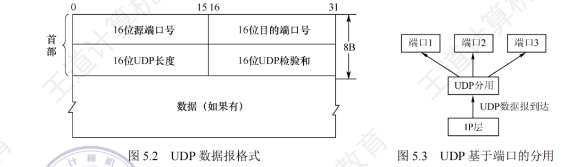

**UDP 的检验**

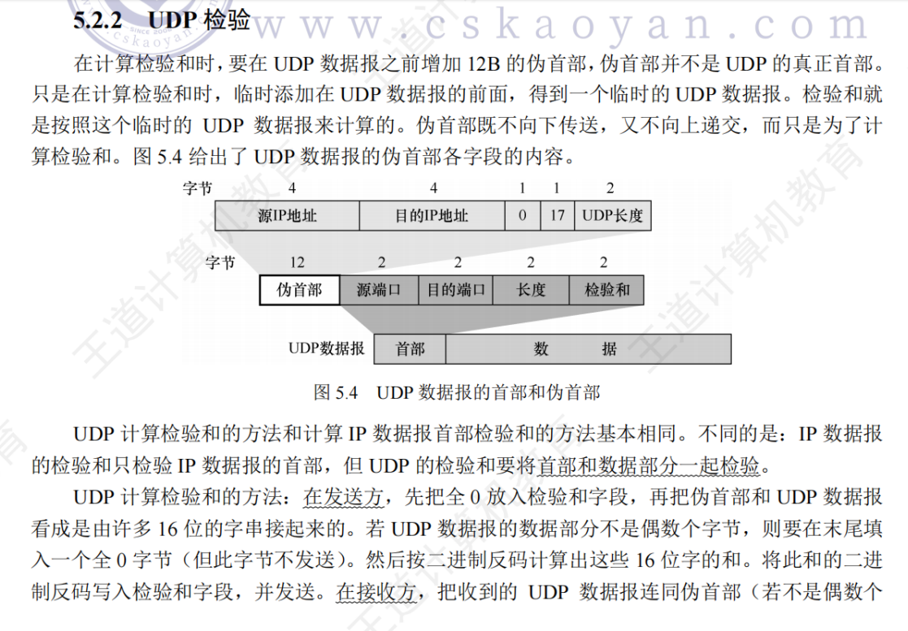

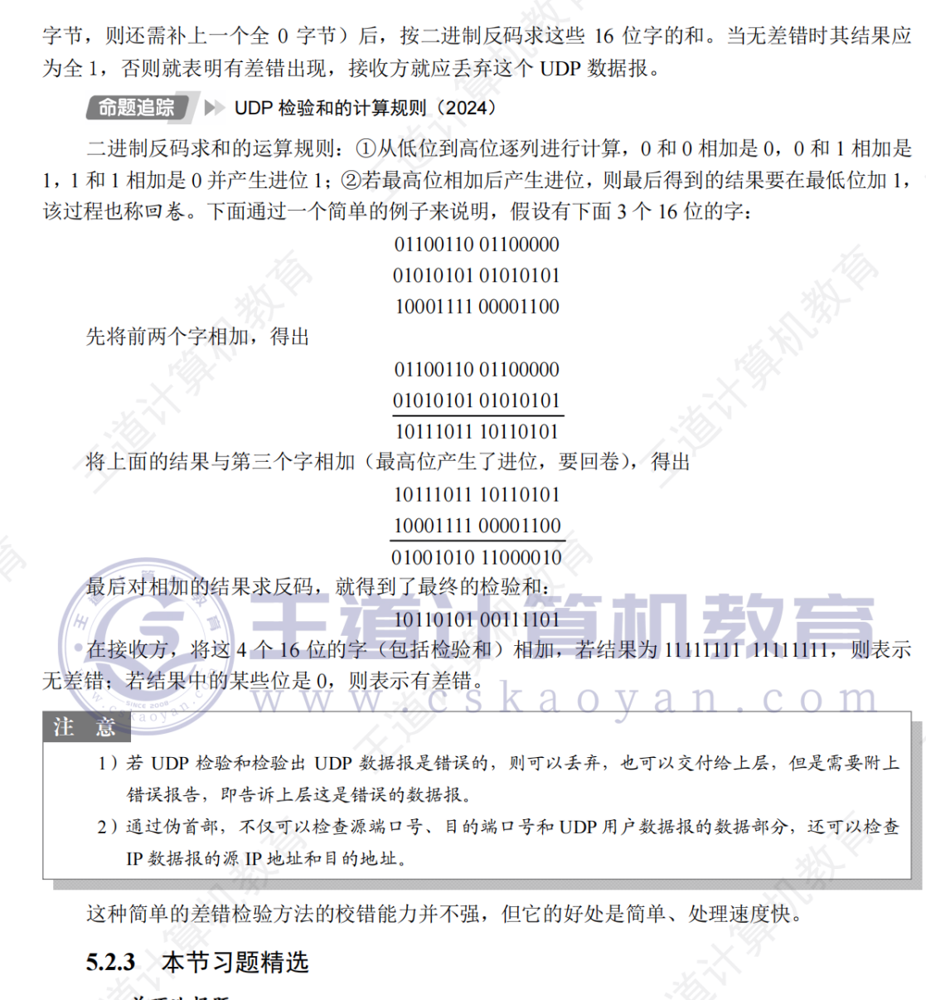


### TCP 报文段

​	TCP  传送的数据单元称为报文段。TCP  报文段既可用来运载数据，又可用来建立连接、释 放连接和应答。一个 TCP 报文段分为首部和数据两部分，整个 TCP 报文段作为IP 数据报的数 据部分封装在IP 数据报中，如图5.5所示。其首部的前20B 是固定的。TCP 首部最短为20B,    后面有4N 字节是根据需要而增加的选项，长度为4B的整数倍。

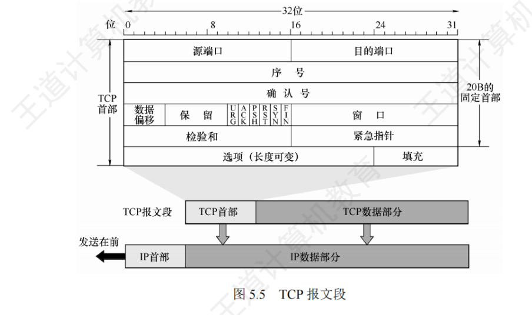

​	1：源端口和目的端口。 各 占 2B。分别表示发送方和接收方使用的端口号。 命题追踪      TCP 首部中序号、确认号的含义(2009、2016)
​	2：序号。占 4B,   范围为0～2³²-1,共2³2个序号。 TCP 连接中传送的字节流中的每个字节 都要按顺序编号，序号字段值指的是本报文段所发送的数据的第一个字节的序号。
例如，一报文段的序号字段值是301,而携带的数据共有100B,  表明本报文段的数据的 最后一个字节的序号是400,因此下一个报文段的数据序号应从401开始。
​	3：确认号。占4B,  是期望收到对方下一个报文段的第一个数据字节的序号。若确认号为N, 则表明到序号N-1   为止的所有数据都已正确收到。
例如，B 正确收到了A 发送过来的一个报文段，其序号字段是501,而数据长度是200B( 序 号501～700),这表明B 正确收到了A 发送的到序号700为止的数据。因此B 期望收到A 的下一个数据序号是701,于是B 在发送给A 的确认报文段中把确认号置为701。
​	4：数据偏移(首部长度)。占4位，这里不是IP 数据报分片的那个数据偏移，而是表示首 部长度(首部中还有长度不确定的选项字段),它指出TCP 报文段的数据起始处距离TCP  报文段的起始处有多远。“数据偏移”的单位是32位(以4B 为计算单位)。因为4位二 进制数能表示的最大值为15,所以TCP 首部的最大长度为60B。
​	5：保留。占6位，保留为今后使用，但目前应置为0。
​	6：紧急位 URG。当 URG=1  时，表明紧急指针字段有效。它告诉系统此报文段中有紧急数 据，应尽快传送(相当于高优先级的数据)。紧急数据被插入至报文段数据的最前面，而 在紧急数据后面的数据仍是普通数据，因此要与首部中的紧急指针字段配合使用。
​	7：确认位ACK 。仅当ACK=1  时确认号字段才有效。当ACK=0   时，确认号无效。 TCP 规定，在连接建立后所有传送的报文段都必须把ACK 置1。
​	8：推送位PSH(Push) 。 两个应用进程进行交互式通信时，都希望在键入一个命令后立即就 能收到对方的响应，此时发送方TCP 把 PSH 置1,接收方TCP 收到PSH=1  的报文段后， 就尽快交付给接收应用进程，而不再等到整个缓存都填满了后再向上交付。
​	9：复位位RST(Reset) 。 当 RST=1  时，表示TCP 连接中出现严重差错(如主机崩溃等), 必须释放连接，然后重新建立传输连接。此外，它还可用于拒绝一个非法的报文段。
​	10：同步位SYN 。当 SYN=1  时表示这是一个连接请求或连接接受报文。
当SYN=1,ACK=0      时，表明这是一个连接请求报文，若对方同意建立连接，则应在响应
报文中使用SYN=1,ACK=1 。  关于连接的建立和释放，下一节会详细讨论。
​	11：终止位FIN(Finish) 。 用来释放一个连接。当FIN=1  时，表明此报文段的发送方的数据 已发送完毕，并要求释放传输连接。
​	12：窗口。占2B,  范围为0～2¹⁶-1。窗口值告诉对方，从本报文段首部中的确认号算起，接 收方目前允许对方发送的数据量(以字节为单位)。接收方的数据缓存空间是有限的，因 此窗口值作为接收方让发送方设置其发送窗口的依据。
例如，设确认号是701,窗口字段是1000。这表明，从701号算起，发送此报文段的一 方还有接收1000字节数据(字节序号为701～1700)的接收缓存空间。
​	13：检验和。 占 2B。检验和字段检验的范围包括首部和数据两部分。计算检验和时，和UDP一样，要在TCP 报文段的前面加上12B 的伪首部(只需将UDP 伪首部的协议字段的17 改 成 6 ,UDP 长度字段改成 TCP 长度，其他的和UDP 一样)。
​	14：紧急指针。 占 2B。紧急指针仅在URG=1  时才有意义，它指出本报文段中的紧急数据的 字节数(紧急数据在报文段数据的最前面)。即使窗口为零，也可以发送紧急数据。
​	15：选项。长度可变，最长可达40B 。当不使用选项时，TCP 首部长度是20B 。TCP最初只规定 了一种选项，即最大报文段长度(M aximum  Segment  Size,MSS),   它是TCP 报文段中的数 据字段的最大长度。之后又陆续增加了窗口扩大、时间戳等选项，具体请参见教材。
​	16：填充。这是为了使整个首部长度是4B的整数倍。

### TCP 连接管理

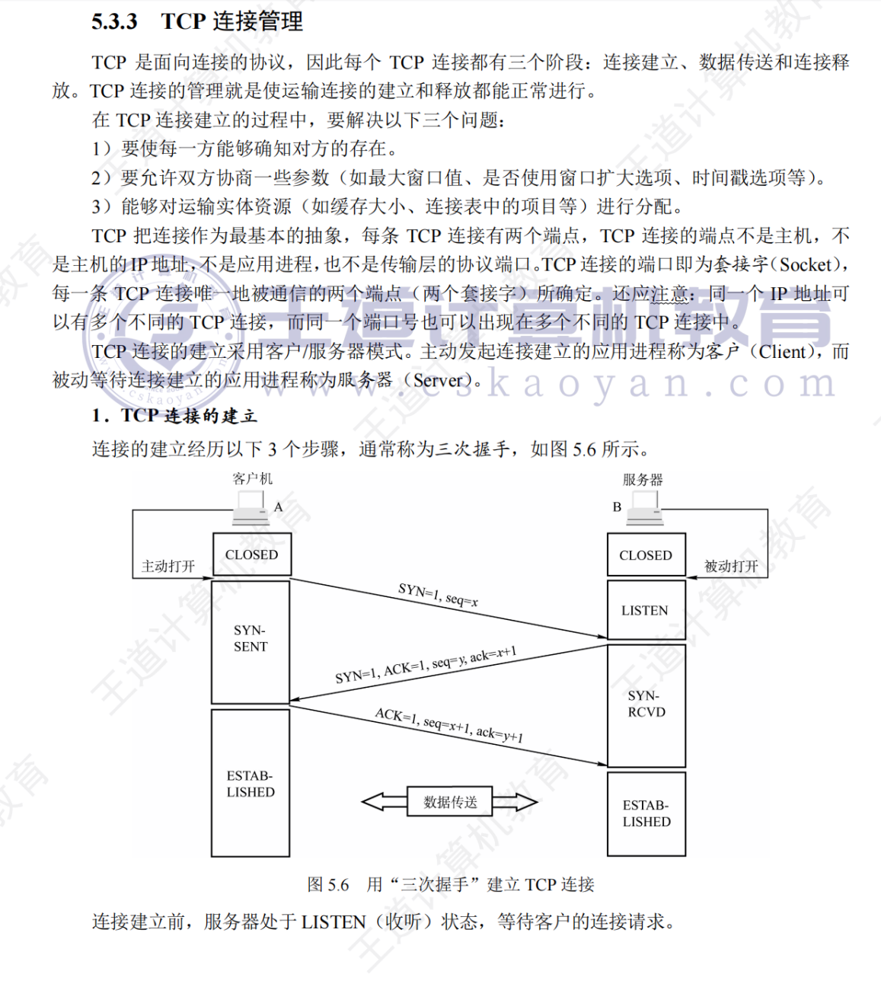

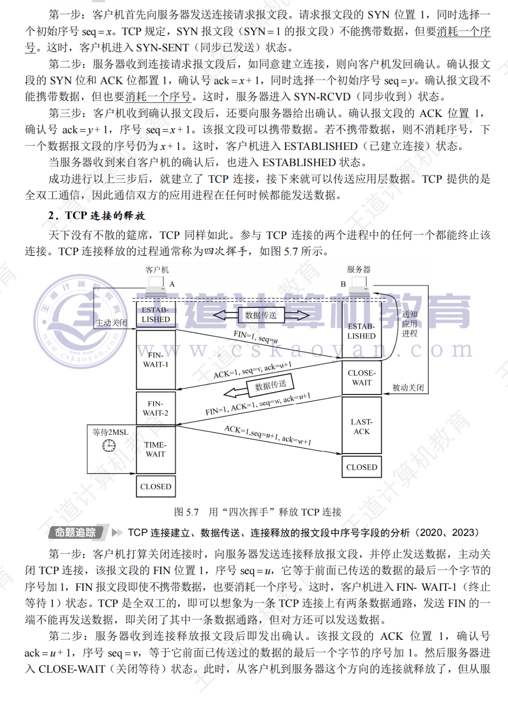

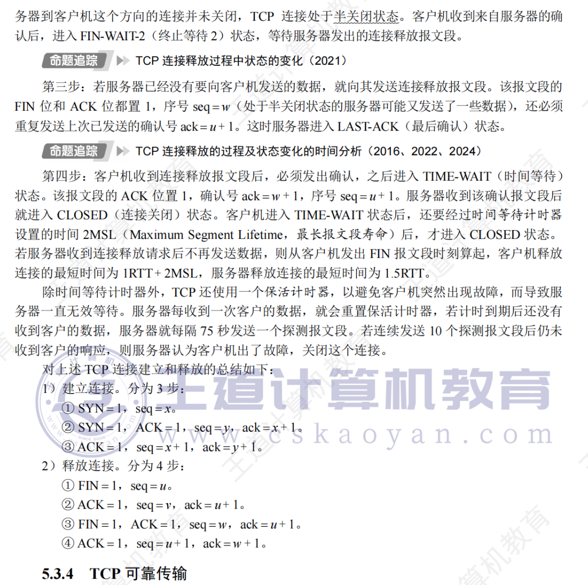

### 为何不采用两次握手

​	这主要是为了防止两次握手情况下已失效的连接请求报文段突然又传送到服务器而产生错 误。考虑下面这种情况。客户 A 向服务器B 发出TCP 连接请求，第一个连接请求报文在网络的 某个节点长时间滞留，A 超时后认为报文丢失，于是再重传一次连接请求，B 收到后建立连接。 数据传输完毕后双方断开连接。而此时，前一个滞留在网络中的连接请求到达服务器 B,  而 B 认 为 A 又发来连接请求，此时若使用“三次握手”,则B 向 A 返回确认报文段，因为是一个失效的 请求，所以A 不予理睬，建立连接失败。若采用的是“两次握手”,则这种情况下B 认为传输连 接已经建立，并一直等待A 传输数据，而A 此时并无连接请求，因此不予理睬，这样就造成了B 的资源白白浪费。

### 若链路不出错，可靠传输还需要存在吗

不是多余的。TCP 的“可靠交付”功能在互联网中起着至关重要的作用。至少在以下的情况 下 ，TCP 的“可靠交付”功能是必不可少的。
	1：每个IP 数据报独立地选择路由，因此在到达目的主机时有可能出现失序。
	2：由于路由选择的计算出现错误，导致IP 数据报在互联网中转圈。最后数据报首部中的生 存时间 (TTL)   的数值下降到零。这个数据报在中途就被丢失。
	3：某个路由器突然出现很大的通信量，以致路由器来不及处理到达的数据报。因此有的数 据报被丢弃。
以上列举的问题表明：必须依靠TCP 的“可靠交付”功能才能保证在目的主机的目的进程中 接收到正确的报文。

## 第六章 应用层

### P2P 模型

​	在C/S 模型中(图6.1),服务器性能的好坏决定了整个系统的性能，当大量用户请求服务时，服 务器就必然成为系统的瓶颈。P2P  模型(见图6.2)的思想是整个网络中的传输内容不再被保存在中 心服务器上，每个节点都同时具有下载、上传的功能，其权利和义务都是大体对等的。

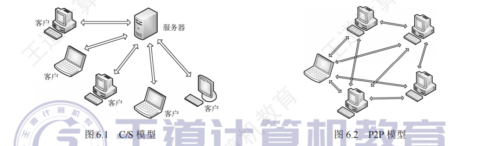

​	在 P2P 模型中，各计算机没有固定的客户和服务器划分。相反，任意一对计算机——称为对 等方(P eer),  直接相互通信。实际上，P2P 模型从本质上来看仍然使用客户/服务器模型，每个节点既作为客户访问其他节点的资源，又作为服务器提供资源给其他节点访问。
​	与 C/S 模型相比，P2P 模型的优点主要体现如下：
​	1：减轻了服务器的计算压力，消除了对某个服务器的完全依赖，可以将任务分配到各个节 点上，因此大大提高了系统效率和资源利用率。
​	2：多个客户机之间可以直接共享文档。
​	3：可扩展性好，传统服务器有响应和带宽的限制，因此只能接受一定数量的请求。
​	4：网络健壮性强，单个节点的失效不会影响其他部分的节点。
​	P2P 模型也有缺点。在获取服务的同时，还要给其他节点提供服务，因此会占用较多的内存， 影响整机速度。例如，经常进行P2P 下载还会对硬盘造成较大的损伤。据某互联网调研机构统计， 某些年份 P2P 程序占了互联网50%～90%的流量，使网络变得非常拥塞，因此各大ISP  (互联网 服务提供商，如电信、网通等)通常都对P2P 应用持反对态度。

### FTP控制连接与数据连接

**1.控制连接**

​	服务器监听21号端口，等待客户连接，建立在这个端口上的连接称为控制连接，用来传输 控制信息(如连接请求、传送请求等)。FTP 客户发出的传送请求，通过控制连接发送给服务器 端的控制进程，但控制连接并不用来传送文件。在传输文件时还可以使用控制连接(如客户在传 输中途发一个中止传输的命令),因此控制连接在整个会话期间一直保持打开状态。

**2.数据连接**

​	服务器端的控制进程在接收到FTP 客户发送来的文件传输请求后，就创建“数据传送进程” 和“数据连接”。数据连接用来连接客户端和服务器端的数据传送进程，数据传送进程实际完成   文件的传送，在传送完毕后关闭“数据传送连接”并结束运行。
​	数据连接有两种传输模式：主动模式 PORT 和被动模式 PAS V 。PORT 模式的工作原理：客  户端连接到服务器的21 端口，登录成功后要读取数据时，客户端随机开放一个端口，并发送命  令告知服务器，服务器收到 PORT 命令和端口号后，通过20端口和客户端开放的端口连接，发送数据。PASV 模式的不同点是，客户端要读取数据时，发送 PASV 命令到服务器，服务器在本  地随机开放一个端口，并告知客户端，客户端再连接到服务器开放的端口进行数据传输。可见，是用 PORT 模式还是PASV 模式，选择权在客户端。简单概括为，主动模式传送数据是“服务器” 连接到“客户端”的端口；被动模式传送数据是客户端连接到服务器的端口。

很多教材并未介绍这两种模式，若无特别说明，则可默认为采用主动模式。

​	因为FTP  使用了一个分离的控制连接，所以也称 FTP  的控制信息是带外 (Out-of-band)   传 送的。使用FTP 时，要修改服务器上的文件，就需要先将此文件传送到本地主机，然后将修改后 的文件副本传送到原服务器，来回传送耗费很多时间。网络文件系统 (NFS)  采用另一种思路， 它允许进程打开一个远程文件，并能在该文件的某个特定位置开始读写数据。这样，NFS 可使用 户只复制一个大文件中的一个很小的片段，而不需要复制整个大文件。

**POP3  和 IMAP**

​	邮局协议 (Post   Office    Protocol,POP) 是一个非常简单但功能有限的邮件读取协议，现在使 用的版本是 POP3 。POP 也采用客户/服务器模式，在传输层使用TCP,   端口号为110。
​	接收方的用户代理必须运行 POP 客户程序，而接收方的邮件服务器中则运行POP 服务器程 序 。POP 有两种工作方式：“下载并保留”和“下载并删除”。在“下载并保留”方式下，用户从 邮件服务器上读取邮件后，邮件依然会保存在邮件服务器上，用户可再次从服务器上读取该邮件； 而使用 “下载并删除”方式时，邮件一旦被读取，就被从邮件服务器上删除。
​	另一个邮件读取协议是因特网报文存取协议 (IMAP),    它比POP 复杂得多，IMAP 为用户提 供了创建文件夹、在不同文件夹之间移动邮件及在远程文件夹中查询邮件等联机命令，为此IMAP  服务器维护了会话用户的状态信息。IMAP  的另一特性是允许用户代理只获取报文的某些部分， 例如可以只读取一个报文的首部，或多部分MIME 报文的一部分。这非常适用于低带宽的情况， 用户可能并不想取回邮箱中的所有邮件，尤其是包含很多音频或视频的大邮件。
​	此外，随着万维网的流行，目前出现了很多基于万维网的电子邮件，如Hotmail 、Gmail 等 。 这种电子邮件的特点是，用户浏览器与 Hotmail 或 Gmail 的邮件服务器之间的邮件发送或接收使 用的是HTTP,  而仅在不同邮件服务器之间传送邮件时才使用SMTP。

### HTTP

​	从协议执行过程来说，浏览器要访问WWW   服务器时，首先要完成对 WWW   服务器的域名 解析。一旦获得了服务器的IP 地址，浏览器就通过TCP 向服务器发送连接建立请求。
​	万维网的大致工作过程如图6.11所示。
​	每个万维网站点都有一个服务器进程，它不断地监听TCP 的端口80(默认),当监听到连接 请求后便与浏览器建立TCP 连接。然后，浏览器就向服务器发送请求获取某个Web 页面的HTTP   请求。服务器收到请求后，将构建所请求Web 页的必需信息，并通过HTTP 响应返回给浏览器。 浏览器再将信息进行解释，然后将Web 页显示给用户。最后，TCP  连接释放。

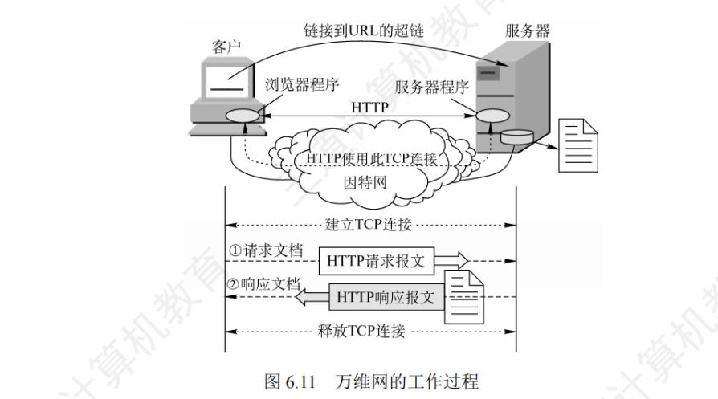

用户单击鼠标后所发生的事件顺序如下(以访问清华大学的网站为例):
1：浏览器分析链接指向页面的URL(http://www.tsinghua.edu.cn /chn/index.htm)。
2：浏览器向DNS 请求解析www.tsinghua.edu.cn 的 IP 地址。
3：域名系统DNS 解析出清华大学服务器的IP 地址。
4：浏览器与该服务器建立TCP 连接(默认端口号为80)。
5：浏览器发出HTTP 请求：GET /chn/index.htm。
6：服务器通过HTTP 响应把文件index.htm发送给浏览器。
7：释放TCP 连接。
8：浏览器解释文件index.htm,  并将 Web页显示给用户。
	上述过程只是一个简化过程，实际过程涉及 TCP/IP 体系结构中应用层的 DHCP、DNS   和 HTTP, 传输层的UDP 和 TCP,   网际层的IP 和 ARP,  数据链路层的CSMA/CD或 PPP (若涉及 ISP 接入或广域网传输)。本节主要介绍HTTP。

**HTTP 报文结构**

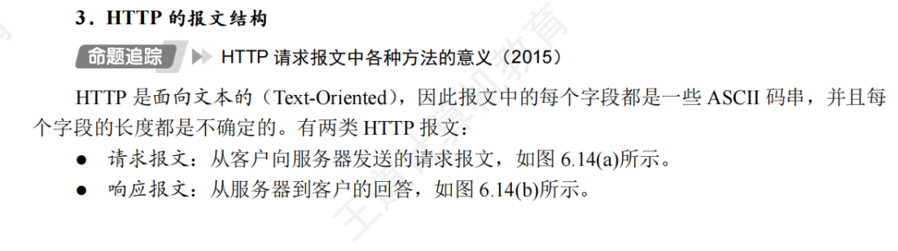

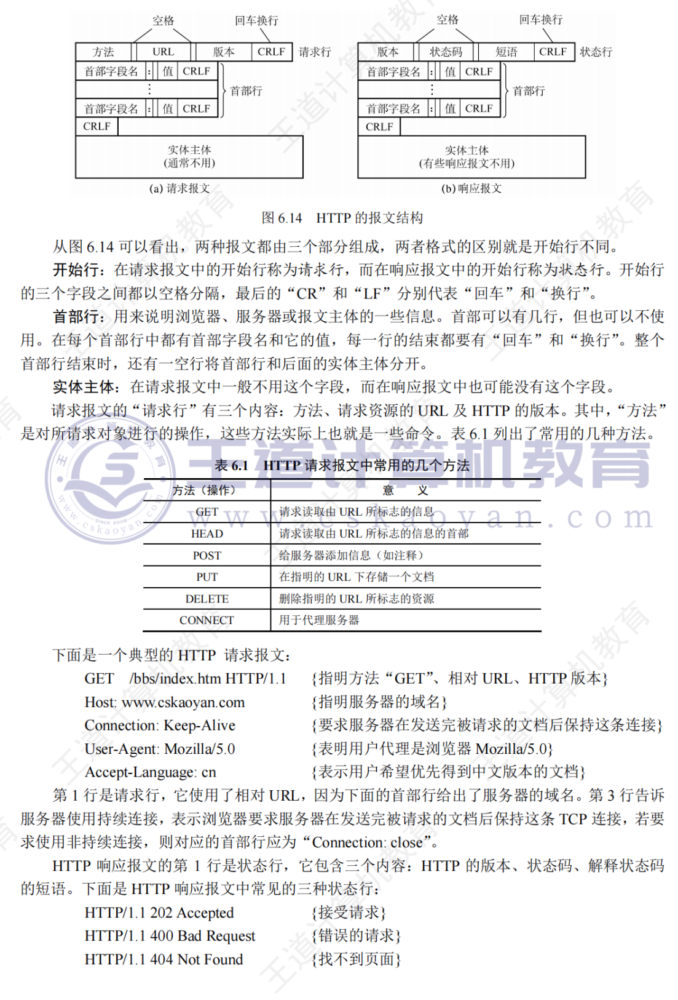

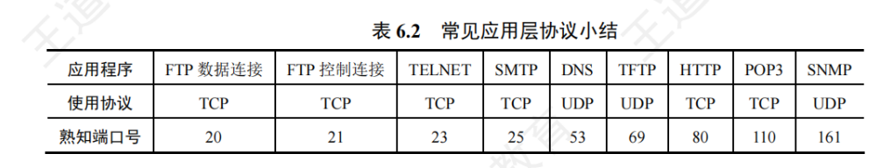
