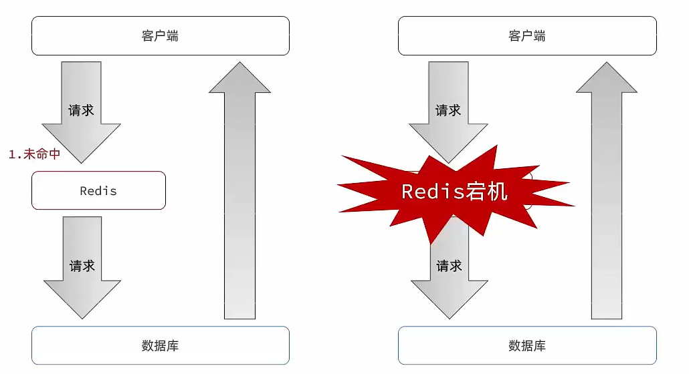
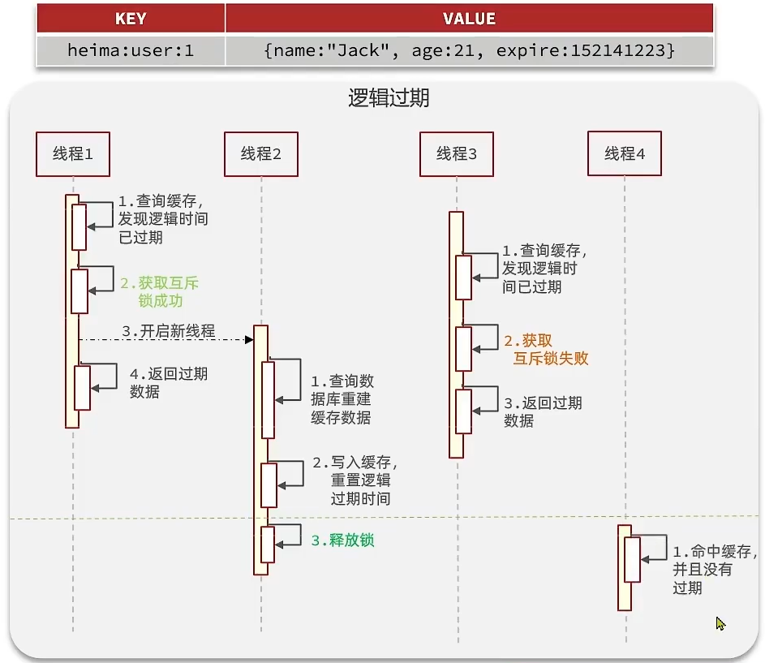
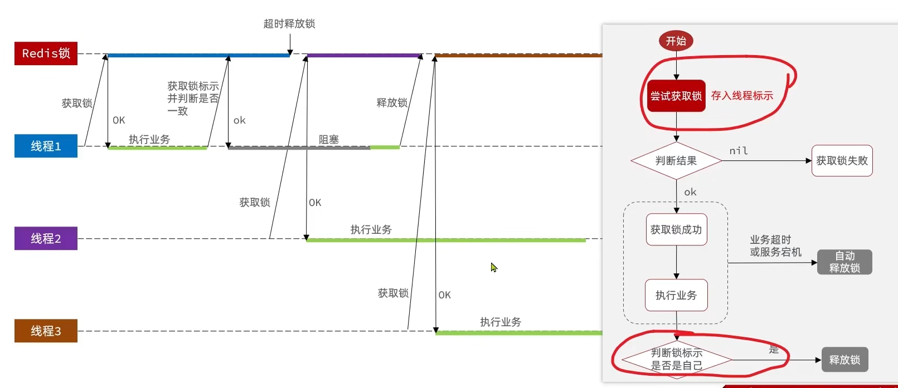

# 黑马点评（Redis实战）

## 项目快速启动

配置数据库，导入文件 [hmdp.sql](..\..\BaiduNetdiskDownload\7、Redis入门到实战教程\Redis-笔记资料\02-实战篇\资料\hmdp.sql) 


配置Redis，修改密码

> `XGROUP CREATE stream.orders g1 0 MKSTREAM` 
>
> 在redis客户端使用这个命令创建消息队列相关数据


后端项目

> 修改application_original.yaml  为  application.yaml 并且修改文件中关于数据库和Redis的配置


> 修改 `IMAGE_UPLOAD_DIR `字段为你nginx的地址，使得发布笔记的图片保存到你的nginx中


前端项目

> 进入nginx文件夹，打开命令行输入 start nginx.exe
>
> 访问地址     http://localhost:8080/


## 短信登录

### 基于session实现

登录流程图


发送短信验证码（这里是没有真实实现短信验证码，后续考虑加上）

```java
@Override
public Result sentCode(String phone, HttpSession session) {
    if( !RegexUtils.isCodeInvalid(phone))  return Result.fail("手机号格式错误!");

    String code = RandomUtil.randomNumbers(6);

    session.setAttribute("code",code);

    log.debug("发送短信验证码成功，验证码：{}", code);

    return Result.ok();
}
```

登录逻辑

```java
@Override
public Result login(LoginFormDTO loginForm, HttpSession session) {
    // 1.校验手机号
    String phone = loginForm.getPhone();
    if (RegexUtils.isPhoneInvalid(phone)) {
        // 2.如果不符合，返回错误信息
        return Result.fail("手机号格式错误！");
    }
    // 3.校验验证码
    Object cacheCode = session.getAttribute("code");
    String code = loginForm.getCode();
    if(cacheCode == null || !cacheCode.toString().equals(code)){
        //3.不一致，报错
        return Result.fail("验证码错误");
    }
    //一致，根据手机号查询用户
    User user = query().eq("phone", phone).one();

    //5.判断用户是否存在
    if(user == null){
        //不存在，则创建
        user = new User();
        user.setPhone(phone);
        user.setNickName(USER_NICK_NAME_PREFIX+RandomUtil.randomString(10));
        save(user);
    }
    //7.保存用户信息到session中
    UserDTO userDTO = new UserDTO();
    BeanUtils.copyProperties(user, userDTO);
    session.setAttribute("user", userDTO);
    return Result.ok();
}
```

拦截器


ThreadLocal

`ThreadLocal` 叫做本地线程变量，意思是说，`ThreadLocal` 中填充的的是当前线程的变量，该变量对其他线程而言是封闭且隔离的，`ThreadLocal` 为变量在每个线程中创建了一个副本，这样每个线程都可以访问自己内部的副本变量。

从字面意思很容易理解，但是实际角度就没那么容易了，作为一个面试常问的点，使用场景也是很丰富。

- 1、在进行对象跨层传递的时候，使用ThreadLocal可以避免多次传递，打破层次间的约束。
- 2、线程间数据隔离
- 3、进行事务操作，用于存储线程事务信息。
- 4、数据库连接，`Session`会话管理。

```java
public class UserHolder {
    private static final ThreadLocal<UserDTO> tl = new ThreadLocal<>();

    public static void saveUser(UserDTO user){
        tl.set(user);
    }

    public static UserDTO getUser(){
        return tl.get();
    }

    public static void removeUser(){
        tl.remove();
    }
}
```

拦截器

```java
public class LoginInterceptor implements HandlerInterceptor {
    // 在进入controller之前之星
    @Override
    public boolean preHandle(HttpServletRequest request, HttpServletResponse response, Object handler) throws Exception {
        //1.获取session
        HttpSession session = request.getSession();
        //2.获取session中的用户
        Object user = session.getAttribute("user");
        //3.判断用户是否存在
        if(user == null){
            //4.不存在，拦截，返回401状态码
            response.setStatus(401);
            return false;
        }
        //5.存在，保存用户信息到Threadlocal
        UserHolder.saveUser((UserDTO) user);
        return true;
    }
}
```

加入拦截器

```java
@Configuration
public class MvcConfig implements WebMvcConfigurer {
    @Override
    public void addInterceptors(InterceptorRegistry registry) {
        // 登录拦截器
        registry.addInterceptor(new LoginInterceptor())
            // 哪些路径不拦截
                .excludePathPatterns(
                        "/shop/**",
                        "/voucher/**",
                        "/shop-type/**",
                        "/upload/**",
                        "/blog/hot",
                        "/user/code",
                        "/user/login"
                );
    }
}
```

获取当前登录的用户

```java
@GetMapping("/me")
public Result me(){
    return Result.ok(UserHolder.getUser());
}
```

### session存在的共享问题

每个tomcat中都有一份属于自己的session,假设用户第一次访问第一台tomcat，并且把自己的信息存放到第一台服务器的session中，但是第二次这个用户访问到了第二台tomcat，那么在第二台服务器上，肯定没有第一台服务器存放的session，所以此时整个登录拦截功能就会出现问题，我们能如何解决这个问题呢？早期的方案是session拷贝，就是说虽然每个tomcat上都有不同的session，但是每当任意一台服务器的session修改时，都会同步给其他的Tomcat服务器的session，这样的话，就可以实现session的共享了

但是这种方案具有两个大问题

1、每台服务器中都有完整的一份session数据，服务器压力过大。

2、session拷贝数据时，可能会出现延迟

所以咱们后来采用的方案都是基于redis来完成，我们把session换成redis，redis数据本身就是共享的，就可以避免session共享的问题了。


### 基于Redis的实现

流程图


登录

```java
@Override
public Result login(LoginFormDTO loginForm, HttpSession session) {
    // 1.校验手机号
    String phone = loginForm.getPhone();
    if (RegexUtils.isPhoneInvalid(phone)) {
        // 2.如果不符合，返回错误信息
        return Result.fail("手机号格式错误！");
    }
    // 3.校验验证码
    Object cacheCode = stringRedisTemplate.opsForValue().get(LOGIN_CODE_KEY + phone);
    String code = loginForm.getCode();
    if(cacheCode == null || !cacheCode.toString().equals(code)){
        //3.不一致，报错
        return Result.fail("验证码错误");
    }
    //一致，根据手机号查询用户
    User user = query().eq("phone", phone).one();

    //5.判断用户是否存在
    if(user == null){
        //不存在，则创建
        user = new User();
        user.setPhone(phone);
        user.setNickName(USER_NICK_NAME_PREFIX+RandomUtil.randomString(10));
        save(user);
    }
    //7.保存用户信息到Redis中,生成token，返回给前端
    UserDTO userDTO = new UserDTO();
    BeanUtil.copyProperties(user, userDTO);
    Map<String, Object> userMap = BeanUtil.beanToMap(userDTO, new HashMap<>(),
            CopyOptions.create()
                    .setIgnoreNullValue(true)
                    .setFieldValueEditor((fieldName, fieldValue) -> fieldValue.toString()));
    String token = UUID.randomUUID().toString(true);
    String tokenKey = LOGIN_USER_KEY + token;
    stringRedisTemplate.opsForHash().putAll(tokenKey,userMap);
    stringRedisTemplate.expire(tokenKey, LOGIN_USER_TTL, TimeUnit.MINUTES);
    return Result.ok(token);
}
```

发送短信

```java
@Override
public Result sentCode(String phone, HttpSession session) {
    if( !RegexUtils.isCodeInvalid(phone))  return Result.fail("手机号格式错误!");

    String code = RandomUtil.randomNumbers(6);

    // 验证码存储在redis
    stringRedisTemplate.opsForValue().set( LOGIN_CODE_KEY + phone, code, 2, TimeUnit.MINUTES);

    log.debug("发送短信验证码成功，验证码：{}", code);

    return Result.ok();
}
```

刷新redis中用户信息过滤器（使得redis中的用户信息在用户最后一次访问之后的30分钟失效）

```java
public class RefreshTokenInterceptor implements HandlerInterceptor {

    private StringRedisTemplate stringRedisTemplate;

    public RefreshTokenInterceptor(StringRedisTemplate stringRedisTemplate) {
        this.stringRedisTemplate = stringRedisTemplate;
    }
    @Override
    public boolean preHandle(HttpServletRequest request, HttpServletResponse response, Object handler) throws Exception {
        // 1.获取请求头中的token
        String token = request.getHeader("authorization");
        if (StrUtil.isBlank(token)) {
            return true;
        }

        // 2.基于TOKEN获取redis中的用户
        String key  = LOGIN_USER_KEY + token;
        Map<Object, Object> userMap = stringRedisTemplate.opsForHash().entries(key);
        // 3.判断用户是否存在
        if (userMap.isEmpty()) {
            return true;
        }

        // 用户存在，刷新时间，存入UserHolder
        UserDTO userDTO = BeanUtil.fillBeanWithMap(userMap, new UserDTO(), false);
        UserHolder.saveUser(userDTO);
        stringRedisTemplate.expire(key,LOGIN_USER_TTL, TimeUnit.MINUTES);
        return  true;
    }

    @Override
    public void afterCompletion(HttpServletRequest request, HttpServletResponse response, Object handler, Exception ex) throws Exception {
        // 移除用户
        UserHolder.removeUser();
    }
}
```

登录拦截器

```java
public class LoginInterceptor implements HandlerInterceptor {
    // 在进入controller之前执行
    @Override
    public boolean preHandle(HttpServletRequest request, HttpServletResponse response, Object handler) throws Exception {
        // 1.判断是否需要拦截（ThreadLocal中是否有用户）
        if (UserHolder.getUser() == null) {
            // 没有，需要拦截，设置状态码
            response.setStatus(401);
            // 拦截
            return false;
        }
        // 有用户，则放行
        return true;
    }

}
```

注册拦截器

```java
@Configuration
public class MvcConfig implements WebMvcConfigurer {
    @Resource
    StringRedisTemplate stringRedisTemplate;
    @Override
    public void addInterceptors(InterceptorRegistry registry) {
        // 登录拦截器
        registry.addInterceptor(new LoginInterceptor())
                .excludePathPatterns(
                        "/shop/**",
                        "/voucher/**",
                        "/shop-type/**",
                        "/upload/**",
                        "/blog/hot",
                        "/user/code",
                        "/user/login"
                ).order(1);
        // Redis刷新，order越小越先执行
        registry.addInterceptor(new RefreshTokenInterceptor(stringRedisTemplate)).order(0);
    }
}
```


## 商户查询缓存

​		缓存数据存储于代码中,而代码运行在内存中,内存的读写性能远高于磁盘,缓存可以大大降低**用户访问并发量带来的**服务器读写压力。缓存的信息主要是对于一致性要求不太高的数据，例如商铺类别，商铺的主要信息等。还比如浏览量等，注意如果是浏览量这种会频繁更新的数据，在更新缓存的策略是不用每次都去更新缓存，可以采用定时更新缓存的策略。

### 添加和更新缓存

**添加缓存**


**更新缓存**


**更新缓存时解决数据不一致**


在以上三种方案中，我们选择第一种方案。

* 删除缓存还是更新缓存？
  * 更新缓存：每次更新数据库都更新缓存，无效写操作较多
  * 删除缓存：更新数据库时让缓存失效，查询时再更新缓存（√）

* 如何保证缓存与数据库的操作的同时成功或失败？
  * 单体系统，将缓存与数据库操作放在一个事务（√）
  * 分布式系统，利用TCC等分布式事务方案

* 先操作缓存还是先操作数据库？
  * 先删除缓存，再操作数据库
  * 先操作数据库，再删除缓存（√）

**代码实现**

查询商铺

```java
@Override
public Result queryShopById(Long id) {

    String cacheShop = stringRedisTemplate.opsForValue().get(CACHE_SHOP_KEY + id);

    // redis中查到了 就直接返回
    if(!StrUtil.isBlank(cacheShop)){
        Shop shop = JSONUtil.toBean(cacheShop, Shop.class);
        return  Result.ok(shop);
    }

    // 查询数据库
    Shop shop = getById(id);
    if( shop == null){
        return  Result.fail("该店铺不存在。");
    }

    // 查到了，写入redis并设置过期时间
    stringRedisTemplate.opsForValue().set(CACHE_SHOP_KEY + id, JSONUtil.toJsonStr(shop), CACHE_SHOP_TTL, TimeUnit.MINUTES);
    return Result.ok(shop);
}
```

更新商铺信息（注意**@Transactional注解**）

```java
@Override
@Transactional
public Result updateShop(Shop shop) {
    // 先更新数据库，在删除缓存，并且加上事务注解，保证函数的操作全部成功或者全部失败

    Long id = shop.getId();
    if(id == null){
        return  Result.fail("店铺id不能为空");
    }

    updateById(shop);

    stringRedisTemplate.delete(CACHE_SHOP_KEY + id);

    return Result.ok();
}
```

### 缓存穿透

缓存穿透 ：缓存穿透是指客户端请求的数据在缓存中和数据库中都不存在，这样缓存永远不会生效，这些请求都会打到数据库。

常见的解决方案有两种：

* 缓存空对象
  * 优点：实现简单，维护方便
  * 缺点：
    * 额外的内存消耗
    * 可能造成短期的不一致
* 布隆过滤
  * 优点：内存占用较少，没有多余key
  * 缺点：
    * 实现复杂
    * 存在误判可能


**缓存空对象：**当我们客户端访问不存在的数据时，先请求redis，但是此时redis中没有数据，此时会访问到数据库，但是数据库中也没有数据，这个数据穿透了缓存，直击数据库，我们都知道数据库能够承载的并发不如redis这么高，如果大量的请求同时过来访问这种不存在的数据，这些请求就都会访问到数据库，简单的解决方案就是哪怕这个数据在数据库中也不存在，我们也把这个数据存入到redis中去，这样，下次用户过来访问这个不存在的数据，那么在redis中也能找到这个数据就不会进入到缓存了


**布隆过滤：**布隆过滤器其实采用的是哈希思想来解决这个问题，通过一个庞大的二进制数组，走哈希思想去判断当前这个要查询的这个数据是否存在，如果布隆过滤器判断存在，则放行，这个请求会去访问redis，哪怕此时redis中的数据过期了，但是数据库中一定存在这个数据，在数据库中查询出来这个数据后，再将其放入到redis中，

假设布隆过滤器判断这个数据不存在，则直接返回

这种方式优点在于节约内存空间，存在误判，误判原因在于：布隆过滤器走的是哈希思想，只要哈希思想，就可能存在哈希冲突


**使用缓存空对象解决缓存穿透**


查询商铺使用缓存空字符串来解决缓存穿透

```java
private Shop queryShopWithCacheNull(Long id){
    String cacheShop = stringRedisTemplate.opsForValue().get(CACHE_SHOP_KEY + id);

    // redis中查到了 就直接返回
    if(!StrUtil.isBlank(cacheShop)){
        Shop shop = JSONUtil.toBean(cacheShop, Shop.class);
        return  shop;
    }


    // 说明cache中有这个key，但value是空字符串，说明是数据库不存在的，直接返回空，避免缓存穿透
    if(cacheShop != null){
        return  null;
    }

    // 查询数据库
    Shop shop = getById(id);
    if( shop == null){
        // 未查到，缓存空字符串，避免缓存穿透
        stringRedisTemplate.opsForValue().set(CACHE_SHOP_KEY + id, "", CACHE_SHOP_TTL, TimeUnit.MINUTES);
        return  null;
    }

    // 查到了，写入redis并设置过期时间
    stringRedisTemplate.opsForValue().set(CACHE_SHOP_KEY + id, JSONUtil.toJsonStr(shop), CACHE_SHOP_TTL, TimeUnit.MINUTES);
    return shop;

}
```

缓存穿透的解决方案有哪些？

* 缓存null值
* 布隆过滤
* 增强id的复杂度，避免被猜测id规律
* 做好数据的基础格式校验
* 加强用户权限校验
* 做好热点参数的限流


### 缓存雪崩

缓存雪崩是指在同一时段**大量的缓存key同时失效**或者**Redis服务宕机**，导致大量请求到达数据库，带来巨大压力。

解决方案：

* 给不同的Key的TTL添加随机值
* 利用Redis集群提高服务的可用性
* 给缓存业务添加降级限流策略
* 给业务添加多级缓存



### 缓存击穿

缓存击穿问题也叫**热点Key**问题，就是一个被**高并发访问并且缓存重建业务较复杂的key突然失效**了，无数的请求访问会在瞬间给数据库带来巨大的冲击。


常见的解决方案有两种：

* 互斥锁
* 逻辑过期

#### **互斥锁**

因为锁能实现互斥性。假设线程过来，只能一个人一个人的来访问数据库，从而避免对于数据库访问压力过大，但这也会影响查询的性能，因为此时会让查询的性能从并行变成了串行，我们可以采用tryLock方法 + double check来解决这样的问题。

假设现在线程1过来访问，他查询缓存没有命中，但是此时他获得到了锁的资源，那么线程1就会一个人去执行逻辑，假设现在线程2过来，线程2在执行过程中，并没有获得到锁，那么线程2就可以进行到休眠，直到线程1把锁释放后，线程2获得到锁，然后再来执行逻辑，此时就能够从缓存中拿到数据了。


业务流程


**这里使用了redis的setnx方法来表示获取锁，该方法含义是redis中如果没有这个key，则插入成功**

```java
private boolean tryGetLock(String key ){
    Boolean flag = stringRedisTemplate.opsForValue().setIfAbsent(key, "1", 10, TimeUnit.SECONDS);
    return BooleanUtil.isTrue(flag);
}

private void unlock(String key) {
    stringRedisTemplate.delete(key);
}
```

```java
private Shop queryWithMutex(Long id){
    String cacheShop = stringRedisTemplate.opsForValue().get(CACHE_SHOP_KEY + id);

    // redis中查到了 就直接返回
    if(!StrUtil.isBlank(cacheShop)){
        Shop shop = JSONUtil.toBean(cacheShop, Shop.class);
        return  shop;
    }


    // 说明cache中有这个key，但value是空字符串，说明是数据库不存在的，直接返回空，避免缓存穿透
    if(cacheShop != null){
        return  null;
    }


    //  cacheShop == null , 没有从redis中查到， 尝试获得互斥锁，
    Shop shop = null;
    try {
        boolean isLock = tryGetLock(LOCK_SHOP_KEY + id);
        if(!isLock){
            Thread.sleep(50);
            return queryWithMutex(id);
        }


        // 查询数据库
        shop = getById(id);
        if( shop == null){
            // 未查到，缓存空字符串，避免缓存穿透
            stringRedisTemplate.opsForValue().set(CACHE_SHOP_KEY + id, "", CACHE_SHOP_TTL, TimeUnit.MINUTES);
            return  null;
        }

        // 查到了，写入redis并设置过期时间
        stringRedisTemplate.opsForValue().set(CACHE_SHOP_KEY + id, JSONUtil.toJsonStr(shop), CACHE_SHOP_TTL, TimeUnit.MINUTES);
    }catch (Exception e){
        throw new RuntimeException(e);
    }
    finally {
        //7.释放互斥锁
        unlock(LOCK_SHOP_KEY + id);
    }
    return shop;

}
```


#### **逻辑过期**

我们把过期时间设置在 redis的value中，注意：这个过期时间并不会直接作用于redis，而是我们后续通过逻辑去处理。假设线程1去查询缓存，然后从value中判断出来当前的数据已经过期了，此时线程1去获得互斥锁，那么其他线程会进行阻塞，获得了锁的线程他会开启一个 线程去进行 以前的重构数据的逻辑，直到新开的线程完成这个逻辑后，才释放锁， 而线程1直接进行返回，假设现在线程3过来访问，由于线程线程2持有着锁，所以线程3无法获得锁，线程3也直接返回数据，只有等到新开的线程2把重建数据构建完后，其他线程才能走返回正确的数据。

这种方案巧妙在于，异步的构建缓存，缺点在于在构建完缓存之前，返回的都是脏数据。



流程图


代码实现

```java
// 使用了线程池
private static final ExecutorService CACHE_REBUILD_EXECUTOR = Executors.newFixedThreadPool(10);
```

```java
private Shop queryWithLogicalExpire(Long id){
    String cacheShop = stringRedisTemplate.opsForValue().get(CACHE_SHOP_KEY + id);

    // 判断是否存在
    if (StrUtil.isBlank(cacheShop)) {
        // 不存在，直接返回
        return null;
    }

    // 如果存在,且是空字符串，那么这是缓存空字符串在解决  缓存击穿
    if(cacheShop.equals("")){
        return  null;
    }

    RedisData shopDate = JSONUtil.toBean(cacheShop, RedisData.class);
    LocalDateTime expireTime = shopDate.getExpireTime();
    Shop shop = JSONUtil.toBean((JSONObject) shopDate.getData(), Shop.class);

    // 没有过期
    if (expireTime.isAfter(LocalDateTime.now())) {
        return  shop;
    }

    // 过期了

    boolean isLock = tryGetLock(LOCK_SHOP_KEY + id);
    if(!isLock){
        return  shop;
    }
    CACHE_REBUILD_EXECUTOR.submit( ()->{
        try{
            //重建缓存
            // 查询数据库
            Shop newShop = getById(id);
            if( newShop == null){
                // 未查到，缓存空字符串，避免缓存穿透
                stringRedisTemplate.opsForValue().set(CACHE_SHOP_KEY + id, "", CACHE_SHOP_TTL, TimeUnit.MINUTES);
            }

            RedisData redisData = new RedisData();
            redisData.setData(newShop);
            redisData.setExpireTime(LocalDateTime.now().plusSeconds(20L));
            // 查到了，写入redis并设置过期时间
            stringRedisTemplate.opsForValue().set(CACHE_SHOP_KEY + id, JSONUtil.toJsonStr(redisData), CACHE_SHOP_TTL, TimeUnit.MINUTES);
        }catch (Exception e){
            throw new RuntimeException(e);
        }finally {
            unlock(LOCK_SHOP_KEY + id);
        }
    });
    return shop;
}
```

#### 两者方案比较

**互斥锁方案：**由于保证了互斥性，所以数据一致，且实现简单，因为仅仅只需要加一把锁而已，也没其他的事情需要操心，所以没有额外的内存消耗，缺点在于有锁就有死锁问题的发生，且只能串行执行性能肯定受到影响

**逻辑过期方案：** 线程读取过程中不需要等待，性能好，有一个额外的线程持有锁去进行重构数据，但是在重构数据完成前，其他的线程只能返回之前的数据，且实现起来麻烦


### 封装工具类

**（泛型的使用，函数式编程，函数作为参数的传递，封装造轮子的思想）**

基于StringRedisTemplate封装一个缓存工具类，满足下列需求：

* 方法1：将任意Java对象序列化为json并存储在string类型的key中，并且可以设置TTL过期时间
* 方法2：将任意Java对象序列化为json并存储在string类型的key中，并且可以设置逻辑过期时间，用于处理缓

存击穿问题

* 方法3：根据指定的key查询缓存，并反序列化为指定类型，利用缓存空值的方式解决缓存穿透问题
* 方法4：根据指定的key查询缓存，并反序列化为指定类型，需要利用逻辑过期解决缓存击穿问题
* 方法5：根据指定的key查询缓存，并反序列化为指定类型，需要利用互斥锁过期解决缓存击穿问题

```java
@Slf4j
@Component
public class CacheClient {

    private final StringRedisTemplate stringRedisTemplate;

    private static final ExecutorService CACHE_REBUILD_EXECUTOR = Executors.newFixedThreadPool(10);

    public CacheClient(StringRedisTemplate stringRedisTemplate) {
        this.stringRedisTemplate = stringRedisTemplate;
    }


    // 普通的set方法，value转为json
    public void set(String key, Object value, Long time, TimeUnit unit) {
        stringRedisTemplate.opsForValue().set(key, JSONUtil.toJsonStr(value), time, unit);
    }


    //  将任意Java对象序列化为json并存储在string类型的key中，并且可以设置逻辑过期时间，用于处理缓存击穿问题
    public void setWithLogicalExpire(String key, Object value, Long time, TimeUnit unit) {
        // 设置逻辑过期
        RedisData redisData = new RedisData();
        redisData.setData(value);
        redisData.setExpireTime(LocalDateTime.now().plusSeconds(unit.toSeconds(time)));
        // 写入Redis
        stringRedisTemplate.opsForValue().set(key, JSONUtil.toJsonStr(redisData));
    }

    // 根据指定的key查询缓存，并反序列化为指定类型，利用缓存空值的方式解决缓存穿透问题
    public <R,ID> R queryWithPassThrough(String keyPrefix, ID id, Class<R> type, Function<ID, R> dbFallback, Long time, TimeUnit unit){
        String key = keyPrefix + id;
        // 1.从redis查询商铺缓存
        String json = stringRedisTemplate.opsForValue().get(key);
        // 2.判断是否存在
        if (StrUtil.isNotBlank(json)) {
            // 3.存在，直接返回
            return JSONUtil.toBean(json, type);
        }
        // 判断命中的是否是空值
        if (json != null) {
            // 返回一个错误信息
            return null;
        }

        // 4.不存在，根据id查询数据库
        R r = dbFallback.apply(id);
        // 5.不存在，返回错误
        if (r == null) {
            // 将空值写入redis
            stringRedisTemplate.opsForValue().set(key, "", CACHE_NULL_TTL, TimeUnit.MINUTES);
            // 返回错误信息
            return null;
        }
        // 6.存在，写入redis
        this.set(key, r, time, unit);
        return r;
    }


    // 根据指定的key查询缓存，并反序列化为指定类型，利用   逻辑过期   解决缓存击穿问题
    public <R, ID> R queryWithLogicalExpire(
            String keyPrefix, ID id, Class<R> type, Function<ID, R> dbFallback, Long time, TimeUnit unit) {
        String key = keyPrefix + id;
        // 1.从redis查询商铺缓存
        String json = stringRedisTemplate.opsForValue().get(key);
        // 2.判断是否存在
        if (StrUtil.isBlank(json)) {
            // 3.存在，直接返回
            return null;
        }
        // 4.命中，需要先把json反序列化为对象
        RedisData redisData = JSONUtil.toBean(json, RedisData.class);
        R r = JSONUtil.toBean((JSONObject) redisData.getData(), type);
        LocalDateTime expireTime = redisData.getExpireTime();
        // 5.判断是否过期
        if(expireTime.isAfter(LocalDateTime.now())) {
            // 5.1.未过期，直接返回店铺信息
            return r;
        }
        // 5.2.已过期，需要缓存重建
        // 6.缓存重建
        // 6.1.获取互斥锁
        String lockKey = LOCK_SHOP_KEY + id;
        boolean isLock = tryLock(lockKey);
        // 6.2.判断是否获取锁成功
        if (isLock){
            // 6.3.成功，开启独立线程，实现缓存重建
            CACHE_REBUILD_EXECUTOR.submit(() -> {
                try {
                    // 查询数据库
                    R newR = dbFallback.apply(id);
                    // 重建缓存
                    this.setWithLogicalExpire(key, newR, time, unit);
                } catch (Exception e) {
                    throw new RuntimeException(e);
                }finally {
                    // 释放锁
                    unlock(lockKey);
                }
            });
        }
        // 6.4.返回过期的商铺信息
        return r;
    }


    // 根据指定的key查询缓存，并反序列化为指定类型，利用  锁  解决缓存击穿问题
    public <R, ID> R queryWithMutex(
            String keyPrefix, ID id, Class<R> type, Function<ID, R> dbFallback, Long time, TimeUnit unit) {
        String key = keyPrefix + id;
        // 1.从redis查询商铺缓存
        String shopJson = stringRedisTemplate.opsForValue().get(key);
        // 2.判断是否存在
        if (StrUtil.isNotBlank(shopJson)) {
            // 3.存在，直接返回
            return JSONUtil.toBean(shopJson, type);
        }
        // 判断命中的是否是空值
        if (shopJson != null) {
            // 返回一个错误信息
            return null;
        }

        // 4.实现缓存重建
        // 4.1.获取互斥锁
        String lockKey = LOCK_SHOP_KEY + id;
        R r = null;
        try {
            boolean isLock = tryLock(lockKey);
            // 4.2.判断是否获取成功
            if (!isLock) {
                // 4.3.获取锁失败，休眠并重试
                Thread.sleep(50);
                return queryWithMutex(keyPrefix, id, type, dbFallback, time, unit);
            }
            // 4.4.获取锁成功，根据id查询数据库
            r = dbFallback.apply(id);
            // 5.不存在，返回错误
            if (r == null) {
                // 将空值写入redis
                stringRedisTemplate.opsForValue().set(key, "", CACHE_NULL_TTL, TimeUnit.MINUTES);
                // 返回错误信息
                return null;
            }
            // 6.存在，写入redis
            this.set(key, r, time, unit);
        } catch (InterruptedException e) {
            throw new RuntimeException(e);
        }finally {
            // 7.释放锁
            unlock(lockKey);
        }
        // 8.返回
        return r;
    }

    private boolean tryLock(String key) {
        Boolean flag = stringRedisTemplate.opsForValue().setIfAbsent(key, "1", 10, TimeUnit.SECONDS);
        return BooleanUtil.isTrue(flag);
    }

    private void unlock(String key) {
        stringRedisTemplate.delete(key);
    }

}
```
修改server层

```java
@Resource
private CacheClient cacheClient;

@Override
public Result queryShopById(Long id) {

    // 利用缓存空对象解决缓存穿透问题
    Shop shop = cacheClient
            .queryWithPassThrough(CACHE_SHOP_KEY, id, Shop.class, this::getById, CACHE_SHOP_TTL, TimeUnit.MINUTES);


    // 利用互斥锁解决缓存击穿问题
    // Shop shop = cacheClient
    //         .queryWithMutex(CACHE_SHOP_KEY, id, Shop.class, this::getById, CACHE_SHOP_TTL, TimeUnit.MINUTES);


    // 利用逻辑过期解决缓存击穿问题
    // Shop shop = cacheClient
    //         .queryWithLogicalExpire(CACHE_SHOP_KEY, id, Shop.class, this::getById, 20L, TimeUnit.SECONDS);

    if (shop == null) {
        return Result.fail("店铺不存在！");
    }

    return Result.ok(shop);
}
```


## 优惠券秒杀

### 全局唯一ID

(使用数据库自带的自增id)场景分析：

1. 如果我们的id具有太明显的规则，用户或者说商业对手很容易猜测出来我们的一些敏感信息，比如商城在一天时间内，卖出了多少单，这明显不合适。
2. 我们商城规模越来越大，mysql的单表的容量不宜超过500W，数据量过大之后，我们要进行拆库拆表，但拆分表了之后，他们从逻辑上讲他们是同一张表，所以他们的id是不能一样的， 于是乎我们需要保证id的唯一性。

**全局ID生成器**，是一种在分布式系统下用来生成全局唯一ID的工具，一般要满足下列特性：


为了增加ID的安全性，我们可以不直接使用Redis自增的数值，而是拼接一些其它信息：


ID的组成部分：符号位：1bit，永远为0

时间戳：31bit，以秒为单位，可以使用69年

序列号：32bit，秒内的计数器，支持每秒产生2^32个不同ID

**ID生成器，运用了redis中的自增increment**

```java
@Component
public class RedisIdWorker {
    /**
     * 开始时间戳 2000-1-1
     */
    private static final long BEGIN_TIMESTAMP = 1640995200L;
    /**
     * 序列号的位数
     */
    private static final int COUNT_BITS = 32;

    @Resource
    private StringRedisTemplate stringRedisTemplate;


    public long nextId(String keyPrefix) {
        // 1.生成时间戳
        long newTime = LocalDateTime.now().toEpochSecond(ZoneOffset.UTC);
        long timeStamp = newTime - BEGIN_TIMESTAMP;

        // 2.生成序列号，使用redis的自增id
        // 2.1.获取当前日期，精确到天，可以很方便的统计到每年每天每月的订单量
        String date = LocalDateTime.now().format(DateTimeFormatter.ofPattern("yyyy:MM:dd"));
        // 2.2.自增长
        long count = stringRedisTemplate.opsForValue().increment("icr:" + keyPrefix + ":" + date);

        // 3.拼接并返回
        return timeStamp << 32 | count;

    }
}
```

### 优惠券秒杀（乐观锁）


考虑出现  **超卖**  问题：

​		假设线程1过来查询库存，判断出来库存大于1，正准备去扣减库存，但是还没有来得及去扣减，此时线程2过来，线程2也去查询库存，发现这个数量一定也大于1，那么这两个线程都会去扣减库存，最终多个线程相当于一起去扣减库存，此时就会出现库存的超卖问题。


**悲观锁：**

 悲观锁可以实现对于数据的串行化执行，比如syn，和lock都是悲观锁的代表，同时，悲观锁中又可以再细分为公平锁，非公平锁，可重入锁，等等

**乐观锁：**

  乐观锁：会有一个版本号，每次操作数据会对版本号+1，再提交回数据时，会去校验是否比之前的版本大1 ，如果大1 ，则进行操作成功，这套机制的核心逻辑在于，如果在操作过程中，版本号只比原来大1 ，那么就意味着操作过程中没有人对他进行过修改，他的操作就是安全的，如果不大1，则数据被修改过，当然乐观锁还有一些变种的处理方式比如cas

  乐观锁的典型代表：就是cas，利用cas进行无锁化机制加锁，如果预估值 == 内存值，则代表中间没有被人修改过，此时就将新值去替换 内存值

**利用乐观锁解决实际问题**

这里的版本号可以用库存来代替，如果修改数据库时的库存和之前查询时一样，那么就可以修改，不一样就报错。

​	存在问题：实际情况中，可能有需要进程因为库存被修改过而抢购失败，但是库存依然是充足的

​	解决方案：1. 抢购失败重试，直到库存不够；2. 判断时直接判断是否库存充足，不用判断是够库存和之前一样

使用解决方案二实现优惠券秒杀的超卖问题。

**@Transactional** 操作两个表开启事务回滚

```java
@Override
@Transactional
public Result seckillVoucher(Long voucherId) {
    SeckillVoucher voucher = seckillVoucherService.getById(voucherId);
    if (voucher.getBeginTime().isAfter(LocalDateTime.now())) {
        return Result.fail("抢购时间未到。");
    }

    if (voucher.getEndTime().isBefore(LocalDateTime.now())) {
        return Result.fail("抢购已结束。");
    }
    
    boolean success = seckillVoucherService.update()
            .setSql("stock= stock -1")
            .eq("voucher_id", voucherId).gt("stock",0).update(); //where id = ? and stock > 0
    if(!success){
        return  Result.fail("抢票失败。");
    }
    VoucherOrder voucherOrder = new VoucherOrder();
    voucherOrder.setVoucherId(voucherId);
    Long userId = UserHolder.getUser().getId();
    voucherOrder.setUserId(userId);
    long orderId = redisIdWorker.nextId("order");
    voucherOrder.setId(orderId);
    voucherOrderService.save(voucherOrder);
    return Result.ok(orderId);
}
```

### 一人一单（悲观锁）


**问题：**现在的问题还是和之前一样，并发过来，查询数据库，都不存在订单，所以我们还是需要加锁，但是乐观锁比较适合更新数据，而现在是插入数据，所以我们需要使用悲观锁操作。

```java
// 锁住方法，这样的话，不同的用户过来也需要进行等待。我们的目的是同一用户进来的时候需要锁住，该方案不行。

@Transactional
public synchronized Result createVoucherOrder(Long voucherId) {
    // 创建订单
}
```


```java
// 在创建订单的方法锁住用户id，存在问题。所释放之后，创建订单的方法还没有完成。事务还没有提交，如果这个时候有其他的进程拿到锁了查询的时候订单数量一样为0。该方法不行

@Transactional
public  Result createVoucherOrder(Long voucherId) {
	Long userId = UserHolder.getUser().getId();
	synchronized(userId.toString().intern()){
         // 创建订单
    }
}
```


```java
// 在创建订单这个任务结束之后，再释放锁。这样事务已经提交，保存到数据库了。

Long userId = UserHolder.getUser().getId();
synchronized (userId.toString().intern()){
    // 获取 代理对象
    IVoucherService proxy = (IVoucherService) AopContext.currentProxy();
    return  proxy.createVoucherOrder(voucherId);

}
```


**注意**

1. 我们直接使用userId.toString() 他拿到的对象实际上是不同的对象，new出来的对象，我们使用锁必须保证锁必须是同一把，所以我们需要使用intern()方法。

   由于使用了intern()方法，从常量池中拿到和userid相同的字符串，保证对象是唯一的。

2. 事务想要生效，还得利用代理来生效，所以这个地方，我们需要获得原始的事务对象， 来操作事务。（学习解决事务失效相关知识）

   1. 引入依赖

      ```xml
      <!-- 事务失效解决 -->
      <dependency>
          <groupId>org.aspectj</groupId>
          <artifactId>aspectjweaver</artifactId>
      </dependency>
      ```

   2. 启动类开启相关注解@EnableAspectJAutoProxy(exposeProxy = true)

      ```java
      @MapperScan("com.hmdp.mapper")
      @EnableAspectJAutoProxy(exposeProxy = true)
      @SpringBootApplication
      public class HmDianPingApplication {
      
          public static void main(String[] args) {
              SpringApplication.run(HmDianPingApplication.class, args);
          }
      
      }
      ```

3. **踩坑**：记得关闭seckillVoucher函数的事务注解，否则他要等所有线程都执行成功才回写入数据库，但是一人一单失效。


完整代码实现

```java
@Override
public Result seckillVoucher(Long voucherId) {
    SeckillVoucher voucher = seckillVoucherService.getById(voucherId);
    if (voucher.getBeginTime().isAfter(LocalDateTime.now())) {
        return Result.fail("抢购时间未到。");
    }

    if (voucher.getEndTime().isBefore(LocalDateTime.now())) {
        return Result.fail("抢购已结束。");
    }
    if (seckillVoucherService.getById(voucherId).getStock() < 1) {
        return Result.fail("优惠券已经抢完了。");
    }


    Long userId = UserHolder.getUser().getId();
    synchronized (userId.toString().intern()){
        // 获取 代理对象
        IVoucherService proxy = (IVoucherService) AopContext.currentProxy();
        return  proxy.createVoucherOrder(voucherId);

    }

}
```

```java
@Transactional
public  Result createVoucherOrder(Long voucherId) {

    Long userId = UserHolder.getUser().getId();

    // 5.1.查询订单
    int count = voucherOrderService.query().eq("user_id", userId).eq("voucher_id", voucherId).count();
    // 5.2.判断是否存在
    if (count > 0) {
        // 用户已经购买过了
        return Result.fail("用户已经购买过一次！");
    }

    // 6.扣减库存
    boolean success = seckillVoucherService.update()
            .setSql("stock = stock - 1") // set stock = stock - 1
            .eq("voucher_id", voucherId).gt("stock", 0) // where id = ? and stock > 0
            .update();
    if (!success) {
        // 扣减失败
        return Result.fail("库存不足！");
    }

    // 7.创建订单
    VoucherOrder voucherOrder = new VoucherOrder();
    // 7.1.订单id
    long orderId = redisIdWorker.nextId("order");
    voucherOrder.setId(orderId);
    // 7.2.用户id
    voucherOrder.setUserId(userId);
    // 7.3.代金券id
    voucherOrder.setVoucherId(voucherId);
    voucherOrderService.save(voucherOrder);


    // 7.返回订单id
    return Result.ok(voucherId);
}
```

### 集群环境下悲观锁失效

不同tomcat中jvm没有互相通信导致的。

在集群环境下，部署了多个tomcat，每个tomcat都有一个属于自己的jvm，那么假设在服务器A的tomcat内部，有两个线程，这两个线程由于使用的是同一份代码，那么他们的锁对象是同一个，是可以实现互斥的，但是如果现在是服务器B的tomcat内部，又有两个线程，但是他们的锁对象写的虽然和服务器A一样，但是锁对象却不是同一个，所以线程3和线程4可以实现互斥，但是却无法和线程1和线程2实现互斥，这就是 集群环境下，syn锁失效的原因，在这种情况下，我们就需要使用分布式锁来解决这个问题。


模拟集群环境

更改nginx配置，重载配置nginx.exe -s reload

```
upstream backend {
    server 127.0.0.1:8081 max_fails=5 fail_timeout=10s weight=1;
    server 127.0.0.1:8082 max_fails=5 fail_timeout=10s weight=1;
}  
```

启动两个springboot项目，端口分别为8081 和 8082


## 分布式锁

### 基本原理和实现方式对比

分布式锁：满足分布式系统或集群模式下多进程可见并且互斥的锁。


可见性：多个线程都能看到相同的结果

互斥：互斥是分布式锁的最基本的条件，使得程序串行执行

高可用：程序不易崩溃，时时刻刻都保证较高的可用性

高性能：由于加锁本身就让性能降低，所有对于分布式锁本身需要他就较高的加锁性能和释放锁性能

安全性：安全也是程序中必不可少的一环


**常见的分布式锁有三种**

Mysql：mysql本身就带有锁机制，但是由于mysql性能本身一般，所以采用分布式锁的情况下，其实使用mysql作为分布式锁比较少见

Redis：redis作为分布式锁是非常常见的一种使用方式，现在企业级开发中基本都使用redis或者zookeeper作为分布式锁，利用setnx这个方法，如果插入key成功，则表示获得到了锁，如果有人插入成功，其他人插入失败则表示无法获得到锁，利用这套逻辑来实现分布式锁

Zookeeper：zookeeper也是企业级开发中较好的一个实现分布式锁的方案（后续补充相关知识点）


### 使用redis实现分布式锁

实现分布式锁时需要实现的两个**基本方法**：

* 获取锁：

  * 互斥：确保只能有一个线程获取锁
  * 非阻塞：尝试一次，成功返回true，失败返回false

* 释放锁：

  * 手动释放
  * 超时释放：获取锁时添加一个超时时间。（防止有的进程获取到锁之后崩溃了没有释放锁，造成资源一直未释放）


#### **Redis分布式锁误删情况**

**一句话：进程卡顿，自己的锁超时释放了，主动释放锁的时候释放了其他进程的锁**

持有锁的线程在锁的内部出现了阻塞，导致他的锁自动释放，这时其他线程，线程2来尝试获得锁，就拿到了这把锁，然后线程2在持有锁执行过程中，线程1反应过来，继续执行，而线程1执行过程中，走到了删除锁逻辑，此时就会把本应该属于线程2的锁进行删除，这就是误删别人锁的情况说明。


**解决方案**：获取锁的时候，对应的value是自己的进程标识，为了区分不同jvm中的进程id，使用UUID来区分


**代码实现**：

ILock接口

```java
public interface ILock {

    /**
     * 尝试获取锁
     * @param timeoutSec, 持有锁的最长时间，过期自动释放
     * @return
     */
    boolean tryLock(long timeoutSec);

    void unlock();
}
```

锁的实现类

```java
public class SimpleRedisLock implements  ILock {

    private StringRedisTemplate stringRedisTemplate;
    private String lockName;

    public SimpleRedisLock(StringRedisTemplate stringRedisTemplate, String lockName) {
        this.stringRedisTemplate = stringRedisTemplate;
        this.lockName = lockName;
    }


    private static final String KEY_PREFIX="lock:";
    private static final String ID_PREFIX = UUID.randomUUID().toString(true) + "-";
    @Override
    public boolean tryLock(long timeoutSec) {
        String threadId = ID_PREFIX + Thread.currentThread().getId();
        Boolean success = stringRedisTemplate.opsForValue().setIfAbsent(KEY_PREFIX + lockName, threadId, timeoutSec, TimeUnit.SECONDS);
        return Boolean.TRUE.equals(success);
    }

    @Override
    public void unlock() {
        String redisValue = stringRedisTemplate.opsForValue().get(KEY_PREFIX + lockName);

        // 获取线程标示
        String threadId = ID_PREFIX + Thread.currentThread().getId();

        if( !redisValue.equals(threadId)) {
            return;
        }

        stringRedisTemplate.delete(KEY_PREFIX + lockName);

    }
}
```

使用锁

```java
@Override
public Result seckillVoucher(Long voucherId) {
    SeckillVoucher voucher = seckillVoucherService.getById(voucherId);
    if (voucher.getBeginTime().isAfter(LocalDateTime.now())) {
        return Result.fail("抢购时间未到。");
    }

    if (voucher.getEndTime().isBefore(LocalDateTime.now())) {
        return Result.fail("抢购已结束。");
    }
    if (seckillVoucherService.getById(voucherId).getStock() < 1) {
        return Result.fail("优惠券已经抢完了。");
    }


    Long userId = UserHolder.getUser().getId();
    SimpleRedisLock lock = new SimpleRedisLock(stringRedisTemplate, "seckillVoucher:" + userId);
    boolean isLock = lock.tryLock(1200);

    //加锁失败
    if (!isLock) {
        return Result.fail("不允许重复下单");
    }

    try {
        //获取代理对象(事务)
        // 获取 代理对象
        IVoucherService proxy = (IVoucherService) AopContext.currentProxy();
        return  proxy.createVoucherOrder(voucherId);
    } finally {
        //释放锁
        lock.unlock();
    }

}
```

#### 分布式锁的原子性问题

**一句话：确认该锁属于自己后，进程卡顿，锁过期，然后删锁，删掉了别人的锁。**

线程1现在持有锁之后，在执行业务逻辑过程中，他正准备删除锁，而且已经走到了条件判断的过程中，比如他已经拿到了当前这把锁确实是属于他自己的，正准备删除锁，但是此时他的锁到期了，那么此时线程2进来，但是线程1他会接着往后执行，当他卡顿结束后，他直接就会执行删除锁那行代码，相当于条件判断并没有起到作用，这就是删锁时的原子性问题，之所以有这个问题，是因为线程1的拿锁，比锁，删锁，实际上并不是原子性的，我们要防止刚才的情况发生。



**解决方案**：使用Lua脚本实现比较锁和释放锁两个动作的一致性

unlock.lua 脚本，放在resource路径下


```lua
-- 这里的 KEYS[1] 就是锁的key，这里的ARGV[1] 就是当前线程标示
-- 获取锁中的标示，判断是否与当前线程标示一致
if (redis.call('GET', KEYS[1]) == ARGV[1]) then
  -- 一致，则删除锁
  return redis.call('DEL', KEYS[1])
end
-- 不一致，则直接返回
return 0
```

修改unlock函数

```java
// 类初始化的时候就加载lua脚本，减少io次数
private static final DefaultRedisScript<Long> UNLOCK_SCRIPT;
static {
    UNLOCK_SCRIPT = new DefaultRedisScript<>();
    UNLOCK_SCRIPT.setLocation(new ClassPathResource("unlock.lua"));
    UNLOCK_SCRIPT.setResultType(Long.class);
}


 /**
 * 使用lua脚本释放锁，不存在原子性问题
 */
@Override
public void unlock() {
    // 调用lua脚本
    stringRedisTemplate.execute(
            UNLOCK_SCRIPT,
            Collections.singletonList(KEY_PREFIX + lockName),
            ID_PREFIX + Thread.currentThread().getId());
}
```


#### 总结

1. 利用添加过期时间，防止死锁问题的发生，

2. 但是有了过期时间之后，可能出现误删别人锁的问题，这个问题我们开始是利用删之前 通过拿锁，比锁，删锁这个逻辑来解决的，也就是删之前判断一下当前这把锁是否是属于自己的，

3. 但是现在还有原子性问题，也就是我们没法保证拿锁比锁删锁是一个原子性的动作，最后通过lua表达式来解决这个问题


## 分布式锁-redission

### 基于setnx实现的分布式锁存在问题

**重入问题**：重入问题是指 获得锁的线程可以再次进入到相同的锁的代码块中，可重入锁的意义在于防止死锁，

**不可重试**：是指目前的分布式只能尝试一次，我们认为合理的情况是：当线程在获得锁失败后，他应该能再次尝试获得锁。

**超时释放：**我们在加锁时增加了过期时间，这样的我们可以防止死锁，但是如果卡顿的时间超长，虽然我们采用了lua表达式防止删锁的时候，误删别人的锁，但是毕竟没有锁住，有安全隐患

**主从一致性：** 如果Redis提供了主从集群，当我们向集群写数据时，主机需要异步的将数据同步给从机，而万一在同步过去之前，主机宕机了，就会出现死锁问题。


### 分布式锁-Redission简单介绍

Redisson是一个在Redis的基础上实现的Java驻内存数据网格（In-Memory Data Grid）。它不仅提供了一系列的分布式的Java常用对象，还提供了许多分布式服务，其中就包含了各种分布式锁的实现。

引入依赖

```java
<dependency>
	<groupId>org.redisson</groupId>
	<artifactId>redisson</artifactId>
	<version>3.13.6</version>
</dependency>
```

配置客户端（修改为自己redis的相关配置）

```java
@Configuration
public class RedissonConfig {

    @Bean
    public RedissonClient redissonClient(){
        // 配置
        Config config = new Config();
        config.useSingleServer().setAddress("redis://****ip****:****port****")
            .setPassword("****psw****");
        // 创建RedissonClient对象
        return Redisson.create(config);
    }
}
```
使用分布式锁

```java
@Resource
private RedissonClient redissonClient;

@Override
public Result seckillVoucher(Long voucherId) {
    SeckillVoucher voucher = seckillVoucherService.getById(voucherId);
    if (voucher.getBeginTime().isAfter(LocalDateTime.now())) {
        return Result.fail("抢购时间未到。");
    }

    if (voucher.getEndTime().isBefore(LocalDateTime.now())) {
        return Result.fail("抢购已结束。");
    }
    if (seckillVoucherService.getById(voucherId).getStock() < 1) {
        return Result.fail("优惠券已经抢完了。");
    }


    Long userId = UserHolder.getUser().getId();
    RLock lock = redissonClient.getLock("lock:seckillVoucher:" + userId);
    boolean isLock = lock.tryLock(1,20, TimeUnit.SECONDS);

    //加锁失败
    if (!isLock) {
        return Result.fail("不允许重复下单");
    }

    try {
        //获取代理对象(事务)
        // 获取 代理对象
        IVoucherService proxy = (IVoucherService) AopContext.currentProxy();
        return  proxy.createVoucherOrder(voucherId);
    } finally {
        //释放锁
        lock.unlock();
    }

}
```

### 可重入锁原理

用一个变量记录该线程重入这把锁的次数，用redis中的hash结构实现。每次拿到锁计数器加一，只有当计数器为0时才回释放锁。


### 重试和超时释放

重试：不是一直无条件的重试，利用信号量和PubSub功能实现等待、唤醒

超时续约：利用watchDog，每隔一段时间（releaseTime / 3），重置超时时间


### 主从一致性问题

**一句话：主节点失效，主节点的锁信息未同步到从节点造成的问题。采用 锁存放在所有节点中，只有每个节点都拿到锁才算获得到锁的方式解决。**

为了提高redis的可用性，我们会搭建集群或者主从，现在以主从为例

此时我们去写命令，写在主机上， 主机会将数据同步给从机，但是假设在主机还没有来得及把数据写入到从机去的时候，此时主机宕机，哨兵会发现主机宕机，并且选举一个slave变成master，而此时新的master中实际上并没有锁信息，此时锁信息就已经丢掉了。


为了解决这个问题，redission提出来了MutiLock锁，使用这把锁咱们就不使用主从了，每个节点的地位都是一样的， 这把锁加锁的逻辑需要写入到每一个主丛节点上，只有所有的服务器都写入成功，此时才是加锁成功，假设现在某个节点挂了，那么他去获得锁的时候，只要有一个节点拿不到，都不能算是加锁成功，就保证了加锁的可靠性。


### 总结

1）不可重入Redis分布式锁：

​	原理：利用setnx的互斥性；利用ex避免死锁；释放锁时判断线程标示

​	缺陷：不可重入、无法重试、锁超时失效

2）可重入的Redis分布式锁：

​	原理：利用hash结构，记录线程标示和重入次数；利用watchDog延续锁时间；利用信号量控制锁重试等待

​	缺陷：redis宕机引起锁失效问题

3）Redisson的multiLock：

​	原理：多个独立的Redis节点，必须在所有节点都获取重入锁，才算获取锁成功

​	缺陷：运维成本高、实现复杂


## 秒杀优化

下单流程：

当用户发起请求，此时会请求nginx，nginx会访问到tomcat，而tomcat中的程序，会进行串行操作，分成如下几个步骤

1、查询优惠卷

2、判断秒杀库存是否足够

3、查询订单

4、校验是否是一人一单

5、扣减库存

6、创建订单

问题分析：扣减库存和创建订单是写数据库的操作，较为耗时，用户多次下单的时候会等待拿到锁的线程写完数据库才能继续判断，但是我们只要判断成功用户能够下单，后面就扣减库存和创建订单一定会去执行。

解决方案：前4步操作我们交给redis去完成，最后两步操作我们交给异步queue。只要判断能够下单之后，直接返回前端成功。


### 使用redis判断下单资格

新增秒杀卷的同时，将秒杀券信息存入redis中

```java
@Override
@Transactional
public void addSeckillVoucher(Voucher voucher) {
    // 保存优惠券
    save(voucher);
    // 保存秒杀信息
    SeckillVoucher seckillVoucher = new SeckillVoucher();
    seckillVoucher.setVoucherId(voucher.getId());
    seckillVoucher.setStock(voucher.getStock());
    seckillVoucher.setBeginTime(voucher.getBeginTime());
    seckillVoucher.setEndTime(voucher.getEndTime());


    // 保存秒杀库存到Redis中
    stringRedisTemplate.opsForValue().set(SECKILL_STOCK_KEY + voucher.getId(), voucher.getStock().toString());
    seckillVoucherService.save(seckillVoucher);
}
```

编写lua脚本，判断下单资格

```lua
local voucherId = ARGV[1]
local userId = ARGV[2]

local stockKey = 'seckill:stock:' .. voucherId
local orderKey = 'seckill:users:' .. voucherId

if(tonumber(redis.call('get', stockKey)) <= 0) then
    -- 库存不足，返回1
    return 1
end

if(redis.call('sismember', orderKey, userId) == 1) then
    -- 存在，说明是重复下单，返回2
    return 2
end


-- 扣库存 incrby stockKey -1
redis.call('incrby', stockKey, -1)
-- 下单（保存用户）sadd orderKey userId
redis.call('sadd', orderKey, userId)

return 0
```

执行lua脚本

```java
private static final DefaultRedisScript<Long> SECKILL_SCRIPT;
static {
    SECKILL_SCRIPT = new DefaultRedisScript<>();
    SECKILL_SCRIPT.setLocation(new ClassPathResource("can_seckill.lua"));
    SECKILL_SCRIPT.setResultType(Long.class);
}

@Override
public Result seckillVoucher(Long voucherId) throws InterruptedException {

    Long userId = UserHolder.getUser().getId();
    long orderId = redisIdWorker.nextId("order");
    Long result = stringRedisTemplate.execute(
            SECKILL_SCRIPT,
            Collections.emptyList(),
            voucherId.toString(), userId.toString(), String.valueOf(orderId)
    );
    int r = result.intValue();
    if (r != 0) {
        return Result.fail(r == 1 ? "库存不足" : "不能重复下单");
    }

    // 保存阻塞队列
    VoucherOrder voucherOrder = new VoucherOrder();
    voucherOrder.setId(orderId);
    voucherOrder.setUserId(userId);
    voucherOrder.setVoucherId(voucherId);
    orderTasks.add(voucherOrder);

    //获取代理对象
    proxy = (IVoucherService) AopContext.currentProxy();

    return Result.ok(orderId);

}
```


### 基于阻塞队列实现下单

```java
//异步处理线程池
private static  final ExecutorService SECKILL_ORDER_EXECUTOR = Executors.newSingleThreadExecutor();
//由于是异步 所以不能通过进程获得代理，
private IVoucherService proxy;
// 阻塞队列
private BlockingQueue<VoucherOrder> orderTasks =new ArrayBlockingQueue<>(1024 * 1024);

//在类初始化之后执行，因为当这个类初始化好了之后，随时都是有可能要执行的
@PostConstruct
private void init() {
    SECKILL_ORDER_EXECUTOR.submit(new VoucherOrderHandler());
}

// 用于线程池处理的任务
// 当初始化完毕后，就会去从对列中去拿信息
private class VoucherOrderHandler implements Runnable {

    @Override
    public void run() {
        while (true) {
            try {
                // 1.获取队列中的订单信息
                VoucherOrder voucherOrder = orderTasks.take();
                // 2.创建订单
                handleVoucherOrder(voucherOrder);
            } catch (Exception e) {
                log.error("处理订单异常", e);
            }
        }
    }

    private void handleVoucherOrder(VoucherOrder voucherOrder) {

        Long userId = voucherOrder.getUserId();

        RLock lock = redissonClient.getLock(LOCK_SECKILLVOUCHER + userId);
        boolean isLock = false;
        try {
            isLock = lock.tryLock(1,20, TimeUnit.SECONDS);
        } catch (InterruptedException e) {
            throw new RuntimeException(e);
        }

        //加锁失败
        if (!isLock) {
            // 获取锁失败，直接返回失败或者重试
            log.error("不允许重复下单！");
            return;
        }

        try {
             proxy.createVoucherOrder(voucherOrder);
        } finally {
            //释放锁
            lock.unlock();
        }
    }
}


// 由于是异步创建订单，所以需要对之前的函数进行改造。userid需要从voucherOrder拿到
@Transactional
public  void createVoucherOrder(VoucherOrder voucherOrder) {

    Long userId = voucherOrder.getUserId();
    Long voucherId = voucherOrder.getVoucherId();

    // 5.1.查询订单
    int count = voucherOrderService.query().eq("user_id", userId).eq("voucher_id", voucherId).count();
    // 5.2.判断是否存在
    if (count > 0) {
        // 用户已经购买过了
        log.error("用户已经购买过了");
        return ;
    }

    // 6.扣减库存
    boolean success = seckillVoucherService.update()
            .setSql("stock = stock - 1") // set stock = stock - 1
            .eq("voucher_id", voucherId).gt("stock", 0) // where id = ? and stock > 0
            .update();
    if (!success) {
        // 扣减失败
        log.error("库存不足");
        return ;
    }

    voucherOrderService.save(voucherOrder);

}

```

缺点：

1. 阻塞队列大小有限制
2. 读取之后如果处理出错会丢失信息
3. 如果程序宕机，队列数据丢失


## Redis消息队列

### 基于List实现消息队列

**基于List结构模拟消息队列**

消息队列（Message Queue），字面意思就是存放消息的队列。而Redis的list数据结构是一个双向链表，很容易模拟出队列效果。

队列是入口和出口不在一边，因此我们可以利用：LPUSH 结合 RPOP、或者 RPUSH 结合 LPOP来实现。
不过要注意的是，当队列中没有消息时RPOP或LPOP操作会返回null，并不像JVM的阻塞队列那样会阻塞并等待消息。因此这里应该使用BRPOP或者BLPOP来实现阻塞效果。


基于List的消息队列有哪些优缺点？
优点：

* 利用Redis存储，不受限于JVM内存上限
* 基于Redis的持久化机制，数据安全性有保证
* 可以满足消息有序性

缺点：

* 无法避免消息丢失
* 只支持单消费者

### 基于PubSub的消息队列

PubSub（发布订阅）是Redis2.0版本引入的消息传递模型。顾名思义，消费者可以订阅一个或多个channel，生产者向对应channel发送消息后，所有订阅者都能收到相关消息。

 SUBSCRIBE channel [channel] ：订阅一个或多个频道
 PUBLISH channel msg ：向一个频道发送消息
 PSUBSCRIBE pattern[pattern] ：订阅与pattern格式匹配的所有频道


基于PubSub的消息队列有哪些优缺点？
优点：

* 采用发布订阅模型，支持多生产、多消费

缺点：

* 不支持数据持久化
* 无法避免消息丢失
* 消息堆积有上限，超出时数据丢失

### 基于Stream的消息队列

Stream 是 Redis 5.0 引入的一种新数据类型，可以实现一个功能非常完善的消息队列。

> XADD key ID field value [field value ...]


> XREAD [COUNT count] [BLOCK milliseconds] STREAMS key [key ...] id [id ...]


**消费者组**：将多个消费者划分到一个组中，监听同一个队列。


**创建消费者组**

```
XGROUP CREATE key groupName ID [MKSTREAM]
```

key：队列名称
groupName：消费者组名称
ID：起始ID标示，$代表队列中最后一个消息，0则代表队列中第一个消息
MKSTREAM：队列不存在时自动创建队列
其它常见命令：

 **删除指定的消费者组**

```java
XGROUP DESTORY key groupName
```

 **给指定的消费者组添加消费者**

```java
XGROUP CREATECONSUMER key groupname consumername
```

 **删除消费者组中的指定消费者**

```java
XGROUP DELCONSUMER key groupname consumername
```

**从消费者组读取消息**

```java
XREADGROUP GROUP group consumer [COUNT count] [BLOCK milliseconds] [NOACK] STREAMS key [key ...] ID [ID ...]
```

* group：消费组名称
* consumer：消费者名称，如果消费者不存在，会自动创建一个消费者
* count：本次查询的最大数量
* BLOCK milliseconds：当没有消息时最长等待时间
* NOACK：无需手动ACK，获取到消息后自动确认
* STREAMS key：指定队列名称
* ID：获取消息的起始ID：

">"：从下一个未消费的消息开始
其它：根据指定id从pending-list中获取已消费但未确认的消息，例如0，是从pending-list中的第一个消息开始

**特点：**

* 消息可回溯
* 可以多消费者争抢消息，加快消费速度
* 可以阻塞读取
* 没有消息漏读的风险
* 有消息确认机制，保证消息至少被消费一次


### Redis中三种消息队列的对比


### 基于Redis的Stream结构作为消息队列，实现异步秒杀下单

修改判断秒杀资格的lua脚本，增加  讲订单信息加入stream中的语句

```lua
local voucherId = ARGV[1]
local userId = ARGV[2]
-- 新增
local orderId = ARGV[3]

local stockKey = 'seckill:stock:' .. voucherId
local orderKey = 'seckill:users:' .. voucherId

if(tonumber(redis.call('get', stockKey)) <= 0) then
    -- 库存不足，返回1
    return 1
end

if(redis.call('sismember', orderKey, userId) == 1) then
    -- 存在，说明是重复下单，返回2
    return 2
end


-- 扣库存 incrby stockKey -1
redis.call('incrby', stockKey, -1)
-- 下单（保存用户）sadd orderKey userId
redis.call('sadd', orderKey, userId)
-- 发送消息到队列中， XADD stream.orders * k1 v1 k2 v2 ...
redis.call('xadd', 'stream.orders', '*', 'userId', userId, 'voucherId', voucherId, 'id', orderId)
return 0
```

修改线程保存订单的逻辑

```java
private class VoucherOrderHandler implements Runnable {

    @Override
    public void run() {
        while (true) {
            try {
                handleFromRedisMQ();
            } catch (Exception e) {
                log.error("处理订单异常,从pending-list重新处理", e);
                handlePendingList();
            }
        }
    }

    private  void handleFromRedisMQ(){
        // 从redis消息队列中获取队列中的订单信息
        // XREADGROUP GROUP g1 c1 COUNT 1 BLOCK 2000 STREAMS s1 >
        List<MapRecord<String, Object, Object>> orderList = stringRedisTemplate.opsForStream().read(
                // 消费者的组名，以及成员名
                Consumer.from("g1", "c1"),
                // 堵塞消费一个，最多阻塞2秒
                StreamReadOptions.empty().count(1).block(Duration.ofSeconds(2)),
                // 队列名，ReadOffset.lastConsumed()指定">",也就是消息队列的头
                StreamOffset.create("stream.orders", ReadOffset.lastConsumed())
        );
        if( orderList == null || orderList.size() <= 0) return;

        // 解析数据

        Map<Object, Object> order = orderList.get(0).getValue();
        for (Map.Entry<Object, Object> objectObjectEntry : order.entrySet()) {
            System.out.println("objectObjectEntry = " + objectObjectEntry);
        }
        VoucherOrder voucherOrder = BeanUtil.fillBeanWithMap(order, new VoucherOrder(), true);

        System.out.println("voucherOrder = " + voucherOrder);
        // 创建订单
        handleVoucherOrder(voucherOrder);

        // 发送确认消息
        stringRedisTemplate.opsForStream().acknowledge("stream.orders", "g1",orderList.get(0).getId());
    }
    private void handlePendingList(){
        while (true) {
            try {
                // 获取pending-list中的订单信息 XREADGROUP GROUP g1 c1 COUNT 1 BLOCK 2000 STREAMS s1 0
                List<MapRecord<String, Object, Object>> list = stringRedisTemplate.opsForStream().read(
                        Consumer.from("g1", "c1"),
                        // 这里不再需要阻塞式的获取
                        StreamReadOptions.empty().count(1),
                        StreamOffset.create("stream.orders", ReadOffset.from("0"))
                );

                // 判断订单信息是否为空
                if (list == null || list.isEmpty()) {
                    // 如果为null，说明没有异常消息，结束循环
                    break;
                }
                // 解析数据
                MapRecord<String, Object, Object> record = list.get(0);
                Map<Object, Object> value = record.getValue();
                VoucherOrder voucherOrder = BeanUtil.fillBeanWithMap(value, new VoucherOrder(), true);
                // 创建订单
                createVoucherOrder(voucherOrder);
                // 确认消息 XACK
                stringRedisTemplate.opsForStream().acknowledge("stream.orders", "g1", record.getId());
            } catch (Exception e) {
                log.error("处理pendding订单异常", e);
                try{
                    Thread.sleep(2);
                }catch(Exception e1){
                    e1.printStackTrace();
                }
            }
        }
    }
}
```

注意测试前先创建消息队列 以及组名

```java
XGROUP CREATE stream.orders g1 0 MKSTREAM
#XGROUP CREATE 队列名称  组名称  起始id  MKSTREAM不存在则自动创建stream
```


## 达人探店-sortedSet

### 发布探店笔记

> 修改 `IMAGE_UPLOAD_DIR `字段为你nginx的地址，使得发布笔记的图片保存到你的nginx中


### 查询笔记详情

修改BlogServiceImpl ，需要在返回的笔记中返回作者的相关信息queryAndSetBlogUser，和登录用户是否喜欢该笔记isBlogLiked

```java
@Override
public Result queryBlogById(Long id) {
    Blog blog = getById(id);
    if ( blog == null){
        return  Result.fail("笔记不存在！");
    }

    queryAndSetBlogUser(blog);
    return Result.ok(blog);
}

private void queryAndSetBlogUser(Blog blog){
    Long userId = blog.getUserId();
    User user = userService.getById(userId);
    blog.setName(user.getNickName());
    blog.setIcon(user.getIcon());
    isBlogLiked(blog);
}

private void isBlogLiked(Blog blog) {
    // 1.获取登录用户
    UserDTO user = UserHolder.getUser();
    if (user == null) {
        // 用户未登录，无需查询是否点赞
        return;
    }
    Long userId = user.getId();
    // 2.判断当前登录用户是否已经点赞
    String key = BLOG_LIKED_KEY + blog.getId();
    Double score = stringRedisTemplate.opsForZSet().score(key, userId.toString());
    blog.setIsLike(score != null);
}
```

### 笔记点赞以及点赞排行榜

点赞分析：每人只能点赞一次，如果已经点赞，再次访问接口应该取消点赞

点赞排行榜分析：显示最早点赞的五位用户的头像

实现：使用redis中的sortedSet数据结构，存储的时候给用户id赋值当前的时间戳

修改BlogServiceImpl 

```java
// 点赞部分功能实现
@Override
public Result likeBlog(Long id) {
    Long userId = UserHolder.getUser().getId();
    String key = BLOG_LIKED_KEY + id;

    Double score = stringRedisTemplate.opsForZSet().score(key, userId.toString());
    if( score != null){
        // 点过赞了，取消点赞
        boolean update = update().setSql("liked = liked -1").eq("id", id).update();
        if(update){
            stringRedisTemplate.opsForZSet().remove(key,userId.toString());
        }

    }else {
        // 没有点过赞，则点赞
        boolean update = update().setSql("liked = liked + 1").eq("id", id).update();
        if( update ){
            stringRedisTemplate.opsForZSet().add(key, String.valueOf(userId),System.currentTimeMillis());
        }
    }
    return Result.ok();
}


// 点赞排行榜功能实现
@Override
public Result queryLikesById(Long id) {
    String key = BLOG_LIKED_KEY + id;
    // 查询点赞前5名
    Set<String> likesTop5 = stringRedisTemplate.opsForZSet().range(key, 0, 4);

    if (likesTop5 == null || likesTop5.isEmpty()) {
        return Result.ok(Collections.emptyList());
    }

    // 解析出其中的用户id
    List<Long> ids = likesTop5.stream().map(Long::valueOf).collect(Collectors.toList());
    String idStr = StrUtil.join(",", ids);

    // SELECT id,phone,password,nick_name,icon,create_time,update_time FROM tb_user WHERE (id IN (?)) ORDER BY FIELD(id,1010)
    List<UserDTO> usersTop5 = userService.query().in("id", ids)
            // 按照idStr的顺序返回
            .last("ORDER BY FIELD(id," + idStr + ")").list()
            .stream()
            .map(user -> BeanUtil.copyProperties(user, UserDTO.class))
            .collect(Collectors.toList());
    return Result.ok(usersTop5);
}
```

## 好友关注-sortedSet 

在这个功能模块中，我们要实现对用户的关注、取消关注、获得共同关注以及获取关注用户的动态等功能。

先补充如下代码

```java
// UserController 根据id查询用户
@GetMapping("/{id}")
public Result queryUserById(@PathVariable("id") Long userId){
	// 查询详情
	User user = userService.getById(userId);
	if (user == null) {
		return Result.ok();
	}
	UserDTO userDTO = BeanUtil.copyProperties(user, UserDTO.class);
	// 返回
	return Result.ok(userDTO);
}

// BlogController  根据id查询博主的探店笔记
@GetMapping("/of/user")
public Result queryBlogByUserId(
		@RequestParam(value = "current", defaultValue = "1") Integer current,
		@RequestParam("id") Long id) {
	// 根据用户查询
	Page<Blog> page = blogService.query()
			.eq("user_id", id).page(new Page<>(current, SystemConstants.MAX_PAGE_SIZE));
	// 获取当前页数据
	List<Blog> records = page.getRecords();
	return Result.ok(records);
}
```


### 关注功能

```java
// isFollow 根据这个字段判断关注还是取消关注，修改数据库并更新redis的粉丝列表
@Override
public Result follow(Long followUserId, Boolean isFollow) {
    // 1.获取登录用户
    Long userId = UserHolder.getUser().getId();
    String key = FOLLOW_KEY + userId;
    // 1.判断到底是关注还是取关
    if (isFollow) {
        // 2.关注，新增数据
        Follow follow = new Follow();
        follow.setUserId(userId);
        follow.setFollowUserId(followUserId);
        boolean isSuccess = save(follow);
        if (isSuccess) {
            // 把关注用户的id，放入redis的set集合 sadd userId followerUserId
            stringRedisTemplate.opsForSet().add(key, followUserId.toString());
        }

    } else {
        // 3.取关，删除 delete from tb_follow where user_id = ? and follow_user_id = ?
        boolean isSuccess = remove(new QueryWrapper<Follow>()
                .eq("user_id", userId).eq("follow_user_id", followUserId));

        if (isSuccess) {
            // 把关注用户的id，放入redis的set集合 sadd userId followerUserId
            stringRedisTemplate.opsForSet().remove(key, followUserId.toString());
        }
    }
    return Result.ok();
}

// 判断是够关注了改用户
@Override
public Result isFollow(Long followUserId) {
    // 1.获取登录用户
    Long userId = UserHolder.getUser().getId();
    // 2.查询是否关注 select count(*) from tb_follow where user_id = ? and follow_user_id = ?
    Integer count = query().eq("user_id", userId).eq("follow_user_id", followUserId).count();
    // 3.判断
    return Result.ok(count > 0);
}
```

### 共同关注功能

利用redis中set求交集的功能来实现共同关注

`stringRedisTemplate.opsForSet().intersect(key1, key2);`

```java
@Override
public Result followCommons(Long id) {
    Long myId = UserHolder.getUser().getId();
    String key1 = FOLLOW_KEY + myId;
    String key2 = FOLLOW_KEY + id;
    Set<String> commonSet = stringRedisTemplate.opsForSet().intersect(key1, key2);
    if (commonSet == null || commonSet.isEmpty()) {
        // 无交集
        return Result.ok(Collections.emptyList());
    }
    List<Long> ids = commonSet.stream().map(Long::valueOf).collect(Collectors.toList());

    // 查询共同关注用户的详细信息
    List<UserDTO> users = userService.listByIds(ids)
            .stream()
            .map(user -> BeanUtil.copyProperties(user, UserDTO.class))
            .collect(Collectors.toList());
    return Result.ok(users);
}
```

### Feed流

当我们关注了用户后，这个用户发了动态，那么我们应该把这些数据推送给用户，这个需求，其实我们又把他叫做Feed流，关注推送也叫做Feed流，直译为投喂。为用户持续的提供“沉浸式”的体验，通过无限下拉刷新获取新的信息。

对于传统的模式的内容解锁：我们是需要用户去通过搜索引擎或者是其他的方式去解锁想要看的内容


对于新型的Feed流的的效果：不需要我们用户再去推送信息，而是系统分析用户到底想要什么，然后直接把内容推送给用户，从而使用户能够更加的节约时间，不用主动去寻找。


Feed流的实现有两种模式：

Feed流产品有两种常见模式：
Timeline：不做内容筛选，简单的按照内容发布时间排序，常用于好友或关注。例如朋友圈

* 优点：信息全面，不会有缺失。并且实现也相对简单
* 缺点：信息噪音较多，用户不一定感兴趣，内容获取效率低

智能排序：利用智能算法屏蔽掉违规的、用户不感兴趣的内容。推送用户感兴趣信息来吸引用户

* 优点：投喂用户感兴趣信息，用户粘度很高，容易沉迷
* 缺点：如果算法不精准，可能起到反作用
  本例中的个人页面，是基于关注的好友来做Feed流，因此采用Timeline的模式。该模式的实现方案有三种：

我们本次针对好友的操作，采用的就是Timeline的方式，只需要拿到我们关注用户的信息，然后按照时间排序即可

，因此采用Timeline的模式。该模式的实现方案有三种：

* 拉模式
* 推模式
* 推拉结合

**拉模式**：也叫做读扩散

该模式的核心含义就是：当张三和李四和王五发了消息后，都会保存在自己的邮箱中，假设赵六要读取信息，那么他会从读取他自己的收件箱，此时系统会从他关注的人群中，把他关注人的信息全部都进行拉取，然后在进行排序

优点：比较节约空间，因为赵六在读信息时，并没有重复读取，而且读取完之后可以把他的收件箱进行清楚。

缺点：比较延迟，当用户读取数据时才去关注的人里边去读取数据，假设用户关注了大量的用户，那么此时就会拉取海量的内容，对服务器压力巨大。


**推模式**：也叫做写扩散。

推模式是没有写邮箱的，当张三写了一个内容，此时会主动的把张三写的内容发送到他的粉丝收件箱中去，假设此时李四再来读取，就不用再去临时拉取了

优点：时效快，不用临时拉取

缺点：内存压力大，假设一个大V写信息，很多人关注他， 就会写很多分数据到粉丝那边去


**推拉结合模式**：也叫做读写混合，兼具推和拉两种模式的优点。

推拉模式是一个折中的方案，站在发件人这一段，如果是个普通的人，那么我们采用写扩散的方式，直接把数据写入到他的粉丝中去，因为普通的人他的粉丝关注量比较小，所以这样做没有压力，如果是大V，那么他是直接将数据先写入到一份到发件箱里边去，然后再直接写一份到活跃粉丝收件箱里边去，现在站在收件人这端来看，如果是活跃粉丝，那么大V和普通的人发的都会直接写入到自己收件箱里边来，而如果是普通的粉丝，由于他们上线不是很频繁，所以等他们上线时，再从发件箱里边去拉信息。


### 用推模式实现获取关注用户的博文

需求：

* 修改新增探店笔记的业务，在保存blog到数据库的同时，推送到粉丝的收件箱
* 收件箱满足可以根据时间戳排序，必须用Redis的数据结构实现
* 查询收件箱数据时，可以实现分页查询

```java
// 在保存blog到数据库的同时，推送到粉丝的收件箱
@Override
public Result saveBlog(Blog blog) {
    // 获取登录用户
    UserDTO user = UserHolder.getUser();
    blog.setUserId(user.getId());
    // 保存探店博文
    boolean isSave = save(blog);
    if(!isSave){
        return Result.fail("新增笔记失败!");
    }
    // 获取粉丝列表，并且吧博文发到他们的邮箱
    List<Follow> follows = followService.query().eq("follow_user_id", user.getId()).list();
    for (Follow follow : follows) {

        Long userId = follow.getUserId();
        String key = FEED_KEY + userId;
        stringRedisTemplate.opsForZSet().add(key, blog.getId().toString(), System.currentTimeMillis());
    }
    // 返回id
    return Result.ok(blog.getId());
}

```

**利用sortedSet 的 `ZREVRANGEBYSCORE key Max Min LIMIT offset count` 来实现分页查询**

max：上一次分页的最后一个时间戳

min：0

offset：同时间戳<=max的第offset个开始计算

count：查询几个

```java
// 实现feed流分页查询
@Override
public Result queryBlogOfFollow(Long max, Integer offset) {
    // 1.获取当前用户
    Long userId = UserHolder.getUser().getId();
    // 2.查询收件箱 ZREVRANGEBYSCORE key Max Min LIMIT offset count
    String key = FEED_KEY + userId;
    Set<ZSetOperations.TypedTuple<String>> typedTuples = stringRedisTemplate.opsForZSet()
        .reverseRangeByScoreWithScores(key, 0, max, offset, 2);
    // 3.非空判断
    if (typedTuples == null || typedTuples.isEmpty()) {
        return Result.ok();
    }
    // 4.解析数据：blogId、minTime（时间戳）、offset
    List<Long> ids = new ArrayList<>(typedTuples.size());
    long minTime = 0; // 2
    int os = 1; // 2
    for (ZSetOperations.TypedTuple<String> tuple : typedTuples) { // 5 4 4 2 2
        // 4.1.获取id
        ids.add(Long.valueOf(tuple.getValue()));
        // 4.2.获取分数(时间戳）
        long time = tuple.getScore().longValue();
        if(time == minTime){
            os++;
        }else{
            minTime = time;
            os = 1;
        }
    }
	os = minTime == max ? os : os + offset;
    // 5.根据id查询blog
    String idStr = StrUtil.join(",", ids);
    List<Blog> blogs = query().in("id", ids).last("ORDER BY FIELD(id," + idStr + ")").list();

    for (Blog blog : blogs) {
        // 5.1.查询blog有关的用户
        queryBlogUser(blog);
        // 5.2.查询blog是否被点赞
        isBlogLiked(blog);
    }

    // 6.封装并返回
    ScrollResult r = new ScrollResult();
    r.setList(blogs);
    r.setOffset(os);
    r.setMinTime(minTime);

    return Result.ok(r);
}
```


## 附近商铺-GEO

### 附近商户-GEO数据结构的基本用法

GEO就是Geolocation的简写形式，代表地理坐标。Redis在3.2版本中加入了对GEO的支持，允许存储地理坐标信息，帮助我们根据经纬度来检索数据。常见的命令有：

* GEOADD：添加一个地理空间信息，包含：经度（longitude）、纬度（latitude）、值（member）
* GEODIST：计算指定的两个点之间的距离并返回
* GEOHASH：将指定member的坐标转为hash字符串形式并返回
* GEOPOS：返回指定member的坐标
* GEORADIUS：指定圆心、半径，找到该圆内包含的所有member，并按照与圆心之间的距离排序后返回。6.以后已废弃
* GEOSEARCH：在指定范围内搜索member，并按照与指定点之间的距离排序后返回。范围可以是圆形或矩形。6.2.新功能
* GEOSEARCHSTORE：与GEOSEARCH功能一致，不过可以把结果存储到一个指定的key。 6.2.新功能

### 代码实现

> 将数据库中现有商铺的位置信息导入到redis中

```java
@Test
public void loadShopLocation(){
    List<Shop> shopList = shopService.list();

    Map<Long, List<Shop>> map = shopList.stream().collect(Collectors.groupingBy(shop -> {
        return shop.getTypeId();
    }));

    for (Map.Entry<Long, List<Shop>> entry : map.entrySet()) {
        Long typeId = entry.getKey();
        List<Shop> shops = entry.getValue();
        String key = SHOP_GEO_KEY + typeId;
        for (Shop shop : shops) {
            stringRedisTemplate.opsForGeo().add(key, new Point(shop.getX(),shop.getY()), shop.getId().toString());
        }
    }

}
```

> 功能代码

```java
@Override
public Result queryShopByType(Integer typeId, Integer current, Double x, Double y) {
    if( x == null || y == null){
        // 根据类型分页查询
        Page<Shop> page = query()
                .eq("type_id", typeId)
                .page(new Page<>(current, SystemConstants.DEFAULT_PAGE_SIZE));
        // 返回数据
        return Result.ok(page.getRecords());
    }

    int from = ( current - 1) * DEFAULT_BATCH_SIZE;
    int end = current * DEFAULT_BATCH_SIZE;

    String key =  SHOP_GEO_KEY + typeId;

    GeoResults<RedisGeoCommands.GeoLocation<String>> results = stringRedisTemplate.opsForGeo().radius(
            key,
            new Circle(x,y, 5000),
            RedisGeoCommands.GeoRadiusCommandArgs.newGeoRadiusArgs().includeDistance().limit(end));

    if (results == null ) {
        return Result.ok(Collections.emptyList());
    }

    List<GeoResult<RedisGeoCommands.GeoLocation<String>>> list = results.getContent();

    if (list.size() <= from) {
        // 没有下一页了，结束
        return Result.ok(Collections.emptyList());
    }
    // 截取 from ~ end的部分
    List<Long> ids = new ArrayList<>(list.size());
    Map<String, Distance> distanceMap = new HashMap<>(list.size());
    list.stream().skip(from).forEach(result -> {
        // 获取店铺id
        String shopIdStr = result.getContent().getName();
        ids.add(Long.valueOf(shopIdStr));
        // 获取距离
        Distance distance = result.getDistance();
        distanceMap.put(shopIdStr, distance);
    });

    // 根据id查询Shop
    String idStr = StrUtil.join(",", ids);
    List<Shop> shops = query().in("id", ids).last("ORDER BY FIELD(id," + idStr + ")").list();
    for (Shop shop : shops) {
        shop.setDistance(distanceMap.get(shop.getId().toString()).getValue());
    }

    return Result.ok(shops);

}
```


## 用户签到-BitMap

我们按月来统计用户签到信息，签到记录为1，未签到则记录为0.

把每一个bit位对应当月的每一天，形成了映射关系。用0和1标示业务状态，这种思路就称为位图（BitMap）。这样我们就用极小的空间，来实现了大量数据的表示

Redis中是利用string类型数据结构实现BitMap，因此最大上限是512M，转换为bit则是 2^32个bit位。


BitMap的操作命令有：

* SETBIT：向指定位置（offset）存入一个0或1
* GETBIT ：获取指定位置（offset）的bit值
* BITCOUNT ：统计BitMap中值为1的bit位的数量
* BITFIELD ：操作（查询、修改、自增）BitMap中bit数组中的指定位置（offset）的值
* BITFIELD_RO ：获取BitMap中bit数组，并以十进制形式返回
* BITOP ：将多个BitMap的结果做位运算（与 、或、异或）
* BITPOS ：查找bit数组中指定范围内第一个0或1出现的位置

> 代码实现

```java
@Override
public Result sign() {
    Long userId = UserHolder.getUser().getId();

    LocalDateTime now = LocalDateTime.now();

    String keySuffix = now.format(DateTimeFormatter.ofPattern(":yyyyMM"));
    String key = USER_SIGN_KEY + userId + keySuffix;

    int dayOfMonth = now.getDayOfMonth();

    stringRedisTemplate.opsForValue().setBit(key, dayOfMonth - 1, true);

    return Result.ok();
}
```


## UV统计--HyperLogLog

### 介绍

* UV：全称Unique Visitor，也叫独立访客量，是指通过互联网访问、浏览这个网页的自然人。1天内同一个用户多次访问该网站，只记录1次。
* PV：全称Page View，也叫页面访问量或点击量，用户每访问网站的一个页面，记录1次PV，用户多次打开页面，则记录多次PV。往往用来衡量网站的流量。

通常来说UV会比PV大很多，所以衡量同一个网站的访问量，我们需要综合考虑很多因素，所以我们只是单纯的把这两个值作为一个参考值

UV统计在服务端做会比较麻烦，因为要判断该用户是否已经统计过了，需要将统计过的用户信息保存。但是如果每个访问的用户都保存到Redis中，数据量会非常恐怖，那怎么处理呢？

Hyperloglog(HLL)是从Loglog算法派生的概率算法，用于确定非常大的集合的基数，而不需要存储其所有值。相关算法原理大家可以参考：https://juejin.cn/post/6844903785744056333#heading-0
Redis中的HLL是基于string结构实现的，单个HLL的内存**永远小于16kb**，**内存占用低**的令人发指！作为代价，其测量结果是概率性的，**有小于0.81％的误差**。不过对于UV统计来说，这完全可以忽略。

### 测试

```java
@Test
public void testHyperLogLog(){
    String[] users = new String[1000000];

    for (int i = 0; i < users.length; i++) {
        users[i] = "user_" + i;
    }
    stringRedisTemplate.opsForHyperLogLog().add("hll",users);

    Long size = stringRedisTemplate.opsForHyperLogLog().size("hll");

    System.out.println("size = " + size);
}
```


