# 感知机

​	本章将介绍感知机（perceptron）这一算法。感知机是由美国学者Frank Rosenblatt 在 1957 年提出来的。为何我们现在还要学习这一很久以前就有 的算法呢？因为感知机也是作为神经网络（深度学习）的起源的算法。因此， 学习感知机的构造也就是学习通向神经网络和深度学习的一种重要思想。

## 感知机是什么

​	感知机接收多个输入信号，输出一个信号。这里所说的“信号”可以想 象成电流或河流那样具备“流动性”的东西。像电流流过导线， 向前方输送 电子一样，感知机的信号也会形成流， 向前方输送信息。但是，和实际的电 流不同的是，感知机的信号只有“流 / 不流”（1/0）两种取值。在本书中，0 对应“不传递信号”，1 对应“传递信号”。

​	图 2-1 是一个接收两个输入信号的感知机的例子。x1 、x2 是输入信号， y 是输出信号，w1 、w2 是权重（w 是 weight 的首字母)。图中的○称为“神 经元”或者“节点”。输入信号被送往神经元时，会被分别乘以固定的权重（w1x1 、w2x2）。神经元会计算传送过来的信号的总和，只有当这个总和超过 了某个界限值时，才会输出 1。这也称为“神经元被激活”。这里将这个界 限值称为阈值，用符号θ表示。


​									图 2 - 1  有两个输入的感知机

感知机的运行原理只有这些！把上述内容用数学式来表示，就是式（2.1）。

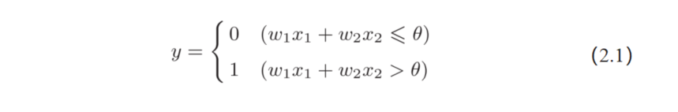

​	感知机的多个输入信号都有各自固有的权重，这些权重发挥着控制各个 信号的重要性的作用。也就是说，权重越大，对应该权重的信号的重要性就 越高。

​	权重相当于电流里所说的电阻。电阻是决定电流流动难度的参数， 电阻越低，通过的电流就越大。而感知机的权重则是值越大，通过 的信号就越大。不管是电阻还是权重，在控制信号流动难度（或者流 动容易度）这一点上的作用都是一样的。

## 简单逻辑电路

### 与门

​	现在让我们考虑用感知机来解决简单的问题。这里首先以逻辑电路为题 材来思考一下与门（AND gate）。与门是有两个输入和一个输出的门电路。图2-2 这种输入信号和输出信号的对应表称为“真值表”。如图 2-2 所示，与门仅在 两个输入均为 1 时输出 1，其他时候则输出0。

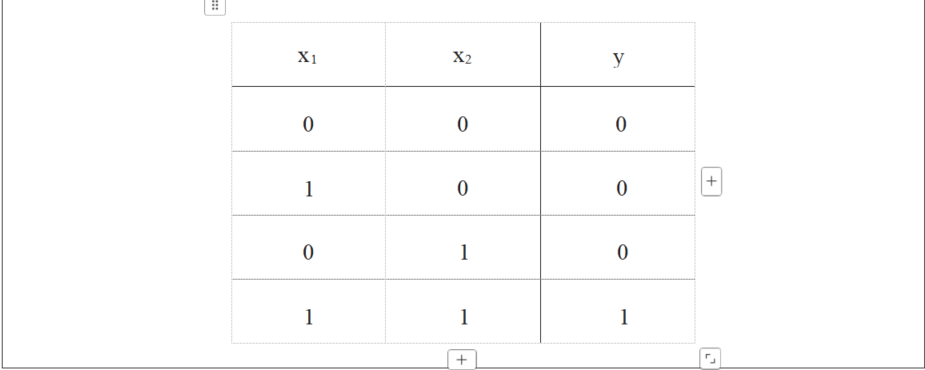

​											图 2 - 2   与门的真值表

​	下面考虑用感知机来表示这个与门。需要做的就是确定能满足图 2 - 2 的 真值表的 w1 、w2 、θ的值。那么，设定什么样的值才能制作出满足图 2 - 2 的 条件的感知机呢？

​	实际上，满足图 2-2 的条件的参数的选择方法有无数多个。比如，当 (w1 , w2, θ) = (0.5, 0.5, 0.7) 时，可以满足图 2-2 的条件。此外，当 (w1 , w2, θ) 为(0.5, 0.5, 0.8) 或者(1.0, 1.0, 1.0) 时， 同样也满足与门的条件。设定这样的 参数后，仅当 x1 和 x2 同时为 1 时，信号的加权总和才会超过给定的阈值θ。

### 与非门

​	接着，我们再来考虑一下与非门（NAND gate）。NAND 是Not AND 的意思，与非门就是颠倒了与门的输出。用真值表表示的话，如图 2-3 所示， 仅当 x1 和 x2 同时为 1 时输出 0，其他时候则输出 1。那么与非门的参数又可 以是什么样的组合呢？

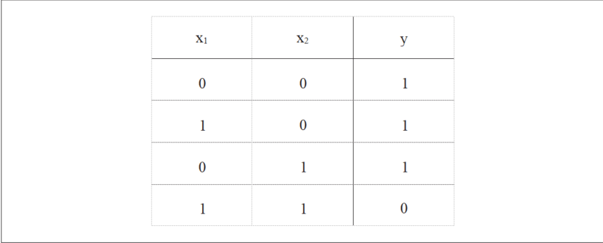

​											图 2-3   与非门的真值表

​	要表示与非门，可以用 (w1 , w2, θ) = (-0.5, -0.5, -0.7) 这样的组合（其 他的组合也是无限存在的）。实际上，只要把实现与门的参数值的符号取反， 就可以实现与非门。

​	这里决定感知机参数的并不是计算机，而是我们人。我们看着真值 表这种“训练数据”，人工考虑（想到）了参数的值。而机器学习的课 题就是将这个决定参数值的工作交由计算机自动进行。学习是确定 合适的参数的过程，而人要做的是思考感知机的构造（模型)，并把 训练数据交给计算机。

​	如上所示，我们已经知道使用感知机可以表示与门、与非门、或门的逻 辑电路。这里重要的一点是：与门、与非门、或门的感知机构造是一样的。 实际上，3 个门电路只有参数的值（权重和阈值）不同。也就是说，相同构造 的感知机，只需通过适当地调整参数的值，就可以像“变色龙演员”表演不  同的角色一样，变身为与门、与非门、或门。

## 感知机的实现

### 简单的实现

现在，我们用Python 来实现刚才的逻辑电路。这里，先定义一个接收 参数x1 和x2 的AND 函数

```py
def  AND(x1,  x2):
    w1,  w2,  theta  =  0.5,  0.5,  0.7
    tmp  =  x1*w1  +  x2*w2
    if  tmp  <=  theta:
        return  0
    elif  tmp  >  theta:
        return  1


#  输出 0
print(AND(0,  0))
#  输出 0
print(AND(1,  0))
#  输出 0
print(AND(0,  1))
#  输出 1
print(AND(1,  1))
```

### 导入权重和偏置

​	刚才的与门的实现比较直接、容易理解，但是考虑到以后的事情，我们 将其修改为另外一种实现形式。在此之前，首先把式（2.1）的θ换成-b，于 是就可以用式（2.2）来表示感知机的行为。

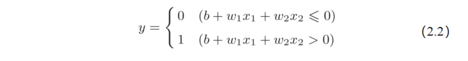

​	式（2.1）和式（2.2）虽然有一个符号不同，但表达的内容是完全相同的。 此处，b 称为偏置，`w1` 和 `w2` 称为权重。如式（2.2）所示，感知机会计算输入 信号和权重的乘积，然后加上偏置，如果这个值大于`0` 则输出1，否则输出0。 下面，我们使用NumPy，按式（2.2）的方式实现感知机。在这个过程中，我 们用Python 的解释器逐一确认结果。

```py
>>>  import  numpy  as  np
>>>  x  =  np.array([0,  1])  #  输入
>>>  w  =  np.array([0.5,  0.5])  #  权重
>>>  b  =  -0.7  #  偏置
>>>  w*x
array([  0.  ,    0.5])
>>>  np.sum(w*x)
0.5
>>>  np.sum(w*x)  +  b
-0.19999999999999996    #  大约为 -0.2（由浮点小数造成的运算误差）
```

​	如上例所示，在NumPy 数组的乘法运算中，当两个数组的元素个数相同时， 各个元素分别相乘，因此`w`*`x` 的结果就是它们的各个元素分别相乘（ [0, 1]  *  [0.5, 0.5] =>  [0, 0.5]）。之后，np.sum(w*x) 再计算相乘后的各个元素的总和。 最后再把偏置加到这个加权总和上，就完成了式（2.2）的计算。

### 使用权重和偏置的实现

使用权重和偏置，可以像下面这样实现与门。

```py
def  AND(x1,  x2):
    x  =  np .array([x1,  x2])
    w  =  np.array([0.5,  0.5])
    b  =  -0.7
    tmp  =  np.sum(w*x)  +  b
    if  tmp  <=  0:
    	return  0
    else:
   	 return  1
```

​	这里把-θ命名为偏置 b，但是请注意，偏置和权重 w1 、w2 的作用是不 一样的。具体地说，w1 和 w2 是控制输入信号的重要性的参数，而偏置是调 整神经元被激活的容易程度（输出信号为 1 的程度）的参数。比如，若 b 为-0.1，则只要输入信号的加权总和超过 0.1，神经元就会被激活。但是如果 b  为-20.0，则输入信号的加权总和必须超过 20.0，神经元才会被激活。像这样， 偏置的值决定了神经元被激活的容易程度。另外，这里我们将 w1 和 w2 称为权重， 将 b 称为偏置，但是根据上下文，有时也会将 b、w1、w2 这些参数统称为权重。

接着，我们继续实现与非门和或门。

```py
def  NAND(x1,  x2):
    x  =  np .array([x1,  x2])
    w  =  np.array([-0.5,   -0.5])  #  仅权重和偏置与 AND 不同！ b  =  0.7
    tmp  =  np.sum(w*x)  +  b
    if  tmp  <=  0:
    	return  0
    else:
    	return  1
```

```py
def  OR(x1,  x2):
    x  =  np .array([x1,  x2])
    w  =  np.array([0.5,  0.5])  #  仅权重和偏置与 AND 不同！
    b  =  -0.2
    tmp  =  np.sum(w*x)  +  b
    if  tmp  <=  0:
    	return  0
    else:
    	return  1
```

​	我们在 2.2 节介绍过，与门、与非门、或门是具有相同构造的感知机， 区别只在于权重参数的值。因此，在与非门和或门的实现中，仅设置权重和  偏置的值这一点和与门的实现不同。

## 感知机的局限性

到这里我们已经知道，使用感知机可以实现与门、与非门、或门三种逻 辑电路。现在我们来考虑一下异或门（XOR gate）。

### 异或门

​	异或门也被称为逻辑异或电路。如图 2-5 所示，仅当 x1 或 x2 中的一方为 1 时，才会输出 1（“异或”是拒绝其他的意思）。那么，要用感知机实现这个 异或门的话，应该设定什么样的权重参数呢？

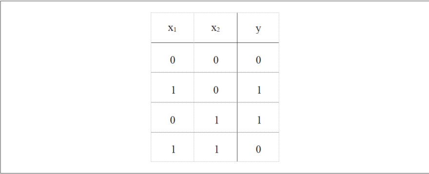

​											**图 2 - 5  异或门的真值表**

​	实际上，用前面介绍的感知机是无法实现这个异或门的。为什么用感知 机可以实现与门、或门，却无法实现异或门呢？下面我们尝试通过画图来思 考其中的原因。

​	首先，我们试着将或门的动作形象化。或门的情况下，当权重参数 (b, w1 , w2) = (-0.5, 1.0, 1.0) 时，可满足图 2-4 的真值表条件。此时，感知机 可用下面的式（2.3）表示。

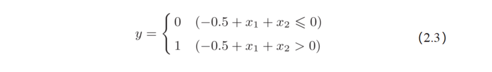

​	式（2.3）表示的感知机会生成由直线-0.5 + x1  + x2  = 0 分割开的两个空 间。其中一个空间输出 1，另一个空间输出 0，如图 2-6 所示。

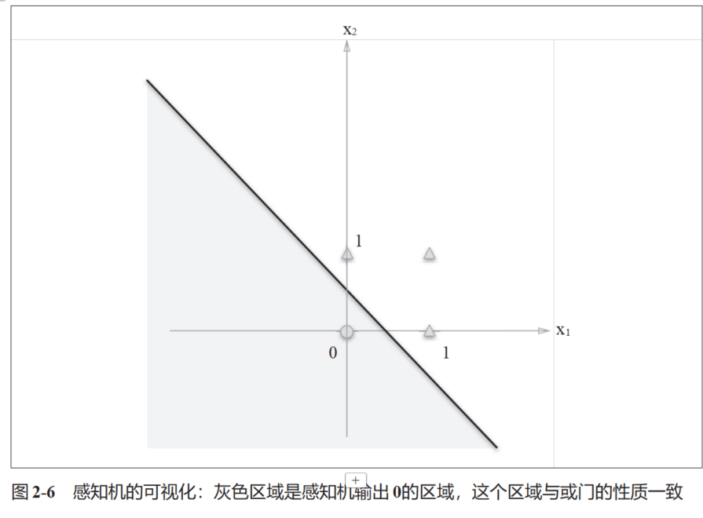

​	或门在 (x1 , x2) = (0, 0) 时输出 0，在 (x1 , x2) 为 (0, 1) 、(1, 0) 、(1, 1) 时输 出 1。图 2-6 中，○表示 0， △表示 1。如果想制作或门，需要用直线将图2 - 6中的○和△分开。实际上，刚才的那条直线就将这 4 个点正确地分开了。

那么，换成异或门的话会如何呢？能否像或门那样，用一条直线作出分 割图 2-7 中的○和△的空间呢？

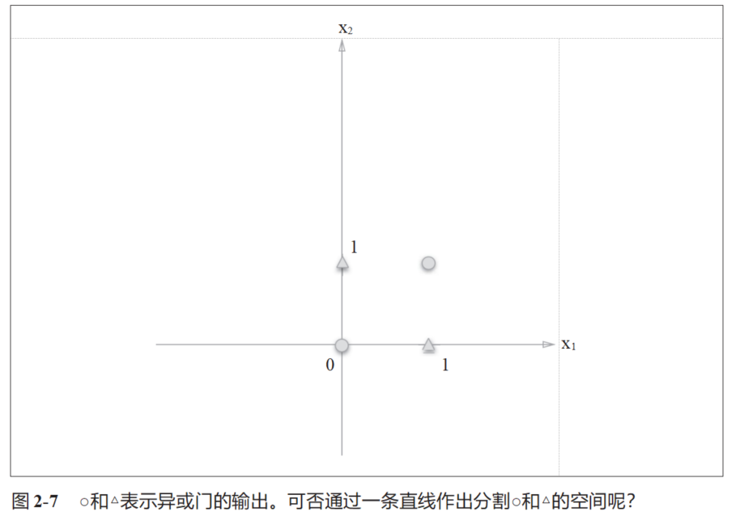

​	想要用一条直线将图2-7 中的○和△分开，无论如何都做不到。事实上， 用一条直线是无法将○和△分开的。

### 线性和非线性

​	图 2-7 中的○和△无法用一条直线分开，但是如果将“直线”这个限制条  件去掉，就可以实现了。比如，我们可以像图2-8 那样，作出分开○和△的空间。

​	感知机的局限性就在于它只能表示由一条直线分割的空间。图2-8这样弯 曲的曲线无法用感知机表示。另外，由图2-8这样的曲线分割而成的空间称为 非线性空间，由直线分割而成的空间称为线性空间。线性、非线性这两个术 语在机器学习领域很常见，可以将其想象成图2-6和图2-8所示的直线和曲线。

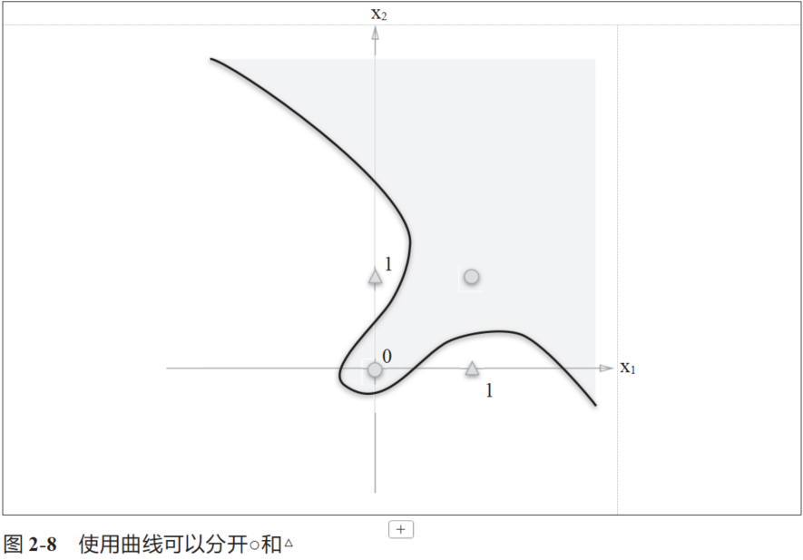

## 多层感知机

​	感知机不能表示异或门让人深感遗憾，但也无需悲观。实际上，感知机  的绝妙之处在于它可以“叠加层”（通过叠加层来表示异或门是本节的要点）。 这里，我们暂且不考虑叠加层具体是指什么，先从其他视角来思考一下异或门的问题。

### 已有门电路的组合

​	异或门的制作方法有很多，其中之一就是组合我们前面做好的与门、与 非门、或门进行配置。这里，与门、与非门、或门用图 2-9 中的符号表示。另外， 图 2-9 中与非门前端的○表示反转输出的意思。

​	那么，请思考一下，要实现异或门的话，需要如何配置与门、与非门和 或门呢？这里给大家一个提示，用与门、与非门、或门代替图2-10 中的各个 “? ”,就可以实现异或门。

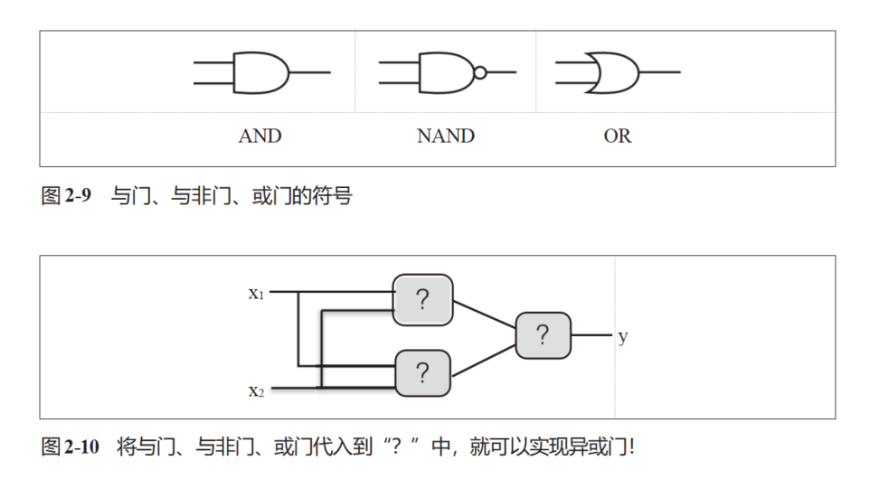

​	异或门可以通过图 2-11所示的配置来实现。这里，x1 和 x2 表示输入信号， y表示输出信号。x1 和 x2 是与非门和或门的输入，而与非门和或门的输出则 是与门的输入。

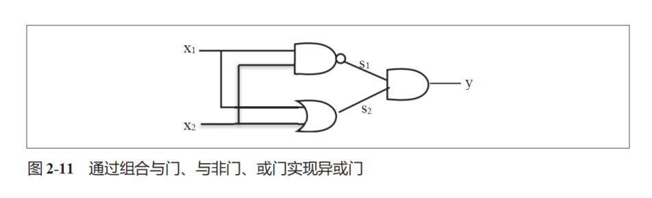

​	现在，我们来确认一下图2-11的配置是否真正实现了异或门。这里，把 s1 作为与非门的输出，把 s2 作为或门的输出，填入真值表中。结果如图 2-12 所示，观察 x1 、x2 、y，可以发现确实符合异或门的输出。

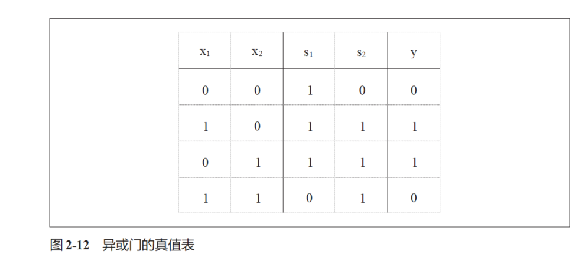

### 异或门的实现

​	下面我们试着用Python 来实现图 2-11 所示的异或门。使用之前定义的 AND 函数、NAND 函数、OR 函数，可以像下面这样（轻松地）实现。

```py
def  XOR(x1,  x2):
    s1  =  NAND(x1,  x2)
    s2  =  OR(x1,  x2)
    y  =  AND(s1,  s2)
    return  y
XOR(0,  0)  #  输出 0
XOR(1,  0)  #  输出 1
XOR(0,  1)  #  输出 1
XOR(1,  1)  #  输出 0
```

这样，异或门的实现就完成了。下面我们试着用感知机的表示方法（明 确地显示神经元）来表示这个异或门，结果如图 2-13 所示。

​	如图 2-13 所示，异或门是一种多层结构的神经网络。这里，将最左边的 一列称为第 0 层，中间的一列称为第 1 层，最右边的一列称为第 2 层。

​	图 2-13 所示的感知机与前面介绍的与门、或门的感知机（图 2-1）形状不 同。实际上，与门、或门是单层感知机，而异或门是 2 层感知机。叠加了多 层的感知机也称为多层感知机（multi-layered perceptron）。

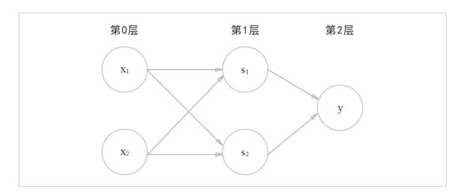

​									图 2-13   用感知机表示异或门

​	图 2-13 中的感知机总共由 3 层构成，但是因为拥有权重的层实质 上只有 2 层（第 0 层和第 1 层之间，第 1 层和第 2 层之间)，所以称 为“2 层感知机”。不过，有的文献认为图 2-13 的感知机是由 3 层 构成的，因而将其称为“3 层感知机”。

​	在图 2-13 所示的 2 层感知机中，先在第 0 层和第 1 层的神经元之间进行 信号的传送和接收，然后在第 1 层和第 2 层之间进行信号的传送和接收，具 体如下所示。

1. 第0 层的两个神经元接收输入信号，并将信号发送至第1 层的神经元。
2. 第 1 层的神经元将信号发送至第2 层的神经元，第2 层的神经元输出y。

​	这种 2 层感知机的运行过程可以比作流水线的组装作业。第 1 段（第 1 层） 的工人对传送过来的零件进行加工，完成后再传送给第 2 段（第 2 层）的工人。 第 2 层的工人对第 1 层的工人传过来的零件进行加工，完成这个零件后出货  （输出）。

​	像这样，在异或门的感知机中，工人之间不断进行零件的传送。通过这 样的结构（2 层结构），感知机得以实现异或门。这可以解释为“单层感知机 无法表示的东西，通过增加一层就可以解决”。也就是说，通过叠加层（加深 层），感知机能进行更加灵活的表示。

## 从与非门到计算机

​	多层感知机可以实现比之前见到的电路更复杂的电路。比如，进行加法 运算的加法器也可以用感知机实现。此外，将二进制转换为十进制的编码器、 满足某些条件就输出1的电路（用于等价检验的电路）等也可以用感知机表示。 实际上，使用感知机甚至可以表示计算机！

​	计算机是处理信息的机器。向计算机中输入一些信息后，它会按照某种   既定的方法进行处理，然后输出结果。所谓“按照某种既定的方法进行处理” 是指，计算机和感知机一样，也有输入和输出，会按照某个既定的规则进行   计算。

​	人们一般会认为计算机内部进行的处理非常复杂，而令人惊讶的是，实  际上只需要通过与非门的组合，就能再现计算机进行的处理。这一令人吃惊 的事实说明了什么呢？说明使用感知机也可以表示计算机。前面也介绍了， 与非门可以使用感知机实现。也就是说，如果通过组合与非门可以实现计算 机的话，那么通过组合感知机也可以表示计算机（感知机的组合可以通过叠  加了多层的单层感知机来表示)。

​	综上，多层感知机能够进行复杂的表示，甚至可以构建计算机。那么， 什么构造的感知机才能表示计算机呢？层级多深才可以构建计算机呢？

​	理论上可以说 2层感知机就能构建计算机。这是因为，已有研究证明， 2层感知机（严格地说是激活函数使用了非线性的sigmoid函数的感知机，具 体请参照下一章）可以表示任意函数。但是，使用 2层感知机的构造，通过设定合适的权重来构建计算机是一件非常累人的事情。实际上，在用与非门 等低层的元件构建计算机的情况下，分阶段地制作所需的零件（模块）会比 较自然，即先实现与门和或门，然后实现半加器和全加器，接着实现算数逻 辑单元（ALU），然后实现CPU。因此，通过感知机表示计算机时，使用叠 加了多层的构造来实现是比较自然的流程。

​	本书中不会实际来实现计算机，但是希望读者能够记住，感知机通过叠 加层能够进行非线性的表示，理论上还可以表示计算机进行的处理。

## 小结

​	本章我们学习了感知机。感知机是一种非常简单的算法，大家应该很快 就能理解它的构造。感知机是下一章要学习的神经网络的基础， 因此本章的 内容非常重要。

 感知机是具有输入和输出的算法。给定一个输入后，将输出一个既 定的值。

* 感知机将权重和偏置设定为参数。

* 使用感知机可以表示与门和或门等逻辑电路。

* 异或门无法通过单层感知机来表示。

* 使用2 层感知机可以表示异或门。

* 单层感知机只能表示线性空间，而多层感知机可以表示非线性空间。

* 多层感知机（在理论上）可以表示计算机。

# 神经网络

​	上一章我们学习了感知机。关于感知机，既有好消息，也有坏消息。好 消息是，即便对于复杂的函数，感知机也隐含着能够表示它的可能性。上一 章已经介绍过，即便是计算机进行的复杂处理，感知机（理论上）也可以将 其表示出来。坏消息是，设定权重的工作，即确定合适的、能符合预期的输 入与输出的权重，现在还是由人工进行的。上一章中，我们结合与门、或门 的真值表人工决定了合适的权重。

​	神经网络的出现就是为了解决刚才的坏消息。具体地讲，神经网络的一 个重要性质是它可以自动地从数据中学习到合适的权重参数。本章中，我们 会先介绍神经网络的概要，然后重点关注神经网络进行识别时的处理。在下一章中，我们将了解如何从数据中学习权重参数。

## 从感知机到神经网络

神经网络和上一章介绍的感知机有很多共同点。这里，我们主要以两者 的差异为中心，来介绍神经网络的结构。

### 神经网络的例子

​	用图来表示神经网络的话，如图 3-1 所示。我们把最左边的一列称为 输入层，最右边的一列称为输出层， 中间的一列称为中间层。中间层有时也称为隐藏层。“隐藏”一词的意思是， 隐藏层的神经元（和输入层、输出 层不同）肉眼看不见。另外，本书中把输入层到输出层依次称为第 0 层、第 1 层、第 2 层（层号之所以从 0 开始，是为了方便后面基于 Python 进行实现）。 图 3-1 中，第 0 层对应输入层，第 1 层对应中间层，第 2 层对应输出层。

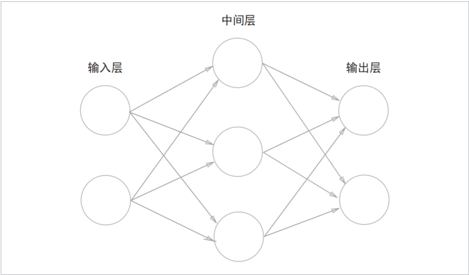

​	图 3-1 中的网络一共由 3 层神经元构成，但实质上只有 2 层神经 元有权重， 因此将其称为“2 层网络”。请注意，有的书也会根据 构成网络的层数，把图 3-1 的网络称为“3 层网络”。本书将根据 实质上拥有权重的层数（输入层、隐藏层、输出层的总数减去 1 后的数量)来表示网络的名称。

​	只看图 3-1 的话，神经网络的形状类似上一章的感知机。实际上，就神 经元的连接方式而言，与上一章的感知机并没有任何差异。那么，神经网络 中信号是如何传递的呢？

### 复习感知机

在观察神经网络中信号的传递方法之前，我们先复习一下感知机。现在来思考一下图 3-2 中的网络结构。


​											图 3 - 2   复习感知机

图 3-2 中的感知机接收 x1 和 x2 两个输入信号，输出 y。如果用数学式来表示图 3-2 中的感知机，则如式（3.1）所示。

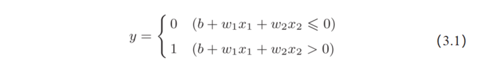

​	b 是被称为偏置的参数，用于控制神经元被激活的容易程度；而 w1 和 w2 是表示各个信号的权重的参数，用于控制各个信号的重要性。

​	顺便提一下，在图 3-2 的网络中，偏置 b 并没有被画出来。如果要明确 地表示出 b，可以像图 3-3 那样做。图 3-3 中添加了权重为 b 的输入信号 1。这 个感知机将 x1、x2、1 三个信号作为神经元的输入，将其和各自的权重相乘后， 传送至下一个神经元。在下一个神经元中，计算这些加权信号的总和。如果  这个总和超过 0，则输出 1，否则输出 0。另外，由于偏置的输入信号一直是 1， 所以为了区别于其他神经元，我们在图中把这个神经元整个涂成灰色。

​	现在将式（3.1）改写成更加简洁的形式。为了简化式（3.1），我们用一个 函数来表示这种分情况的动作（超过 0 则输出 1，否则输出 0）。引入新函数 h(x)，将式（3.1）改写成下面的式（3.2）和式（3.3）。

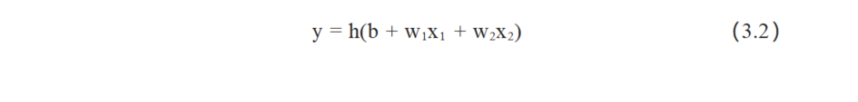

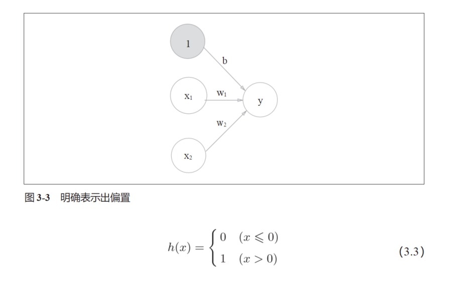

​	式（3.2）中，输入信号的总和会被函数 h(x) 转换，转换后的值就是输出y。 然后，式（3.3）所表示的函数 h(x)，在输入超过 0 时返回 1，否则返回 0。因此， 式（3.1）和式（3.2）、式（3.3）做的是相同的事情。

### 激活函数登场

​	刚才登场的 h（x）函数会将输入信号的总和转换为输出信号，这种函数 一般称为激活函数（activation function）。如“激活”一词所示，激活函数的 作用在于决定如何来激活输入信号的总和。

​	现在来进一步改写式（3.2）。式（3.2）分两个阶段进行处理，先计算输入 信号的加权总和，然后用激活函数转换这一总和。因此，如果将式（3.2）写 得详细一点，则可以分成下面两个式子。

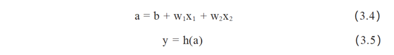

首先，式（3.4）计算加权输入信号和偏置的总和，记为a。然后，式（3.5） 用 h() 函数将 a 转换为输出y。

之前的神经元都是用一个○表示的，如果要在图中明确表示出式（3.4） 和式（3.5），则可以像图 3-4 这样做。

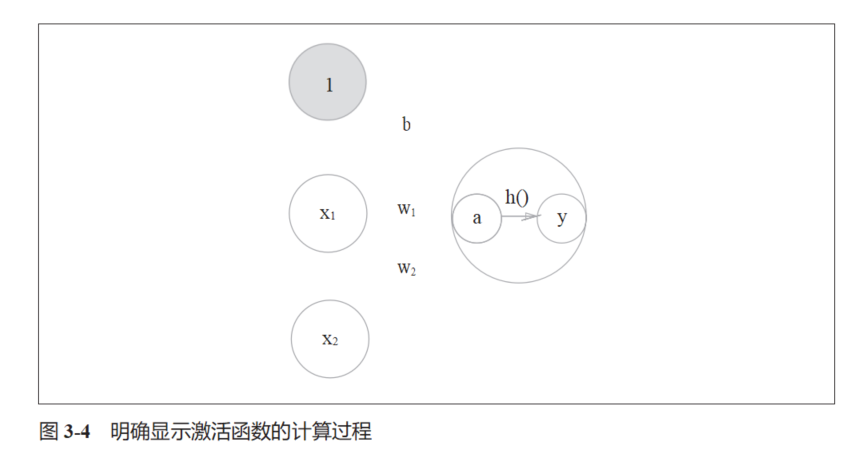

​	如图 3-4 所示，表示神经元的○中明确显示了激活函数的计算过程，即 信号的加权总和为节点 a，然后节点 a 被激活函数 h() 转换成节点 y。本书中，“神 经元”和“节点”两个术语的含义相同。这里，我们称 a 和 y 为“节点”，其实 它和之前所说的“神经元”含义相同。

​	通常如图 3-5 的左图所示，神经元用一个○表示。本书中，在可以明确 神经网络的动作的情况下，将在图中明确显示激活函数的计算过程，如图 3-5 的右图所示。

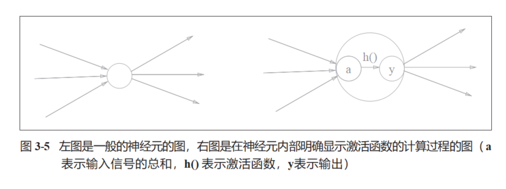

下面，我们将仔细介绍激活函数。激活函数是连接感知机和神经网络的 桥梁。

​	本书在使用“感知机”一词时，没有严格统一它所指的算法。一 般而言，“朴素感知机”是指单层网络，指的是激活函数使用了阶跃函数（阶跃函数是指一旦输入超过阈值，就切换输出的函数。）的模型。“多层感知机”是指神经网络， 即使用 sigmoid 函数（后述)等平滑的激活函数的多层网络。

## 激活函数

​	式（3.3）表示的激活函数以阈值为界，一旦输入超过阈值，就切换输出。 这样的函数称为“阶跃函数”。因此，可以说感知机中使用了阶跃函数作为  激活函数。也就是说，在激活函数的众多候选函数中，感知机使用了阶跃函数。 那么，如果感知机使用其他函数作为激活函数的话会怎么样呢？实际上，如 果将激活函数从阶跃函数换成其他函数，就可以进入神经网络的世界了。下 面我们就来介绍一下神经网络使用的激活函数。

###  sigmoid 函数

神经网络中经常使用的一个激活函数就是式（3.6）表示的 sigmoid 函数 （sigmoid function）。

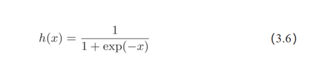

​	式（3.6）中的exp(-x) 表示 $e^{-x}$  的意思。e 是纳皮尔常数2.7182...。式（3.6） 表示的sigmoid 函数看上去有些复杂，但它也仅仅是个函数而已。而函数就是  给定某个输入后，会返回某个输出的转换器。比如，向sigmoid 函数输入1.0或2.0  后，就会有某个值被输出，类似h(1.0) = 0.731 ...、h(2.0) = 0.880... 这样。

​	神经网络中用sigmoid 函数作为激活函数，进行信号的转换，转换后的信号被传送给下一个神经元。实际上，上一章介绍的感知机和接下来要介绍 的神经网络的主要区别就在于这个激活函数。其他方面， 比如神经元的多层 连接的构造、信号的传递方法等，基本上和感知机是一样的。下面，让我们 通过和阶跃函数的比较来详细学习作为激活函数的sigmoid 函数。

### 阶跃函数的实现

​	这里我们试着用Python 画出阶跃函数的图（从视觉上确认函数的形状对  理解函数而言很重要）。阶跃函数如式（3.3）所示，当输入超过 0 时，输出1， 否则输出 0。可以像下面这样简单地实现阶跃函数。

```py
def  step_function(x):
	if  x  >  0:
		return  1
	else:
		return  0
```

​	这个实现简单、易于理解，但是参数 x 只能接受实数（浮点数）。也就是 说，允许形如step_function(3.0) 的调用，但不允许参数取NumPy 数组，例 如 **step_function(np.array([1.0, 2.0]))**。为了便于后面的操作，我们把它修 改为支持NumPy 数组的实现。为此，可以考虑下述实现。

```py
def step_function(x):
	y = x > 0
return y.astype(int)
```

​	这个实现简单、易于理解，但是参数 x 只能接受实数（浮点数）。也就是 说，允许形如step_function(3.0) 的调用，但不允许参数取NumPy 数组，例 如 step_function(np.array([1.0, 2.0]))。为了便于后面的操作，我们把它修 改为支持NumPy 数组的实现。为此，可以考虑下述实现。

```py
def  step_function(x):
	y  =  x  >  0
	return  y.astype(np.int)
```

​	上述函数的内容只有两行。由于使用了NumPy 中的“技巧”，可能会有  点难理解。下面我们通过Python 解释器的例子来看一下这里用了什么技巧。 下面这个例子中准备了NumPy 数组 x，并对这个NumPy 数组进行了不等号  运算。

```py
>>>  import  numpy  as  np
>>>  x  =  np.array([-1.0,  1.0,  2.0])
>>>  x
array([ -1 . ,     1 . ,    2 . ])
>>>  y  =  x  >  0
>>>  y
array([False,    True,    True],  dtype=bool)
```

​	对NumPy 数组进行不等号运算后，数组的各个元素都会进行不等号运算， 生成一个布尔型数组。这里，数组 x 中大于 0 的元素被转换为True，小于等 于 0 的元素被转换为False，从而生成一个新的数组y。

数组y 是一个布尔型数组，但是我们想要的阶跃函数是会输出int 型的 0 或 1 的函数。因此，需要把数组y 的元素类型从布尔型转换为int 型。

```py
>>>  y  =  y.astype(np.int)
>>>  y
array([0,  1,  1])
```

​	如上所示，可以用astype() 方法转换 NumPy 数组的类型。astype() 方 法通过参数指定期望的类型，这个例子中是 np.int 型。Python 中将布尔型 转换为int 型后，True 会转换为 1 ，False 会转换为 0。以上就是阶跃函数的 实现中所用到的NumPy 的“技巧”。

### 阶跃函数的图形

下面我们就用图来表示上面定义的阶跃函数，为此需要使用matplotlib 库。

```py
import numpy as np
import matplotlib.pylab as plt

def step_function(x):
 return np.array(x > 0, dtype=int)

x = np.arange(-5.0, 5.0, 0.1)
y = step_function(x)
plt.plot(x, y)
plt.ylim(-0.1, 1.1) # 指定y轴的范围
plt.show()
```

​	np.a range(-5.0,  5.0,  0.1) 在 -5.0 到 5.0 的范围内，以 0.1 为单位，生成 NumPy 数组（ [-5.0, -4.9,  . . . ,  4.9]）。step_function() 以该NumPy 数组为 参数，对数组的各个元素执行阶跃函数运算，并以数组形式返回运算结果。 对数组 x 、y 进行绘图，结果如图 3-6 所示。

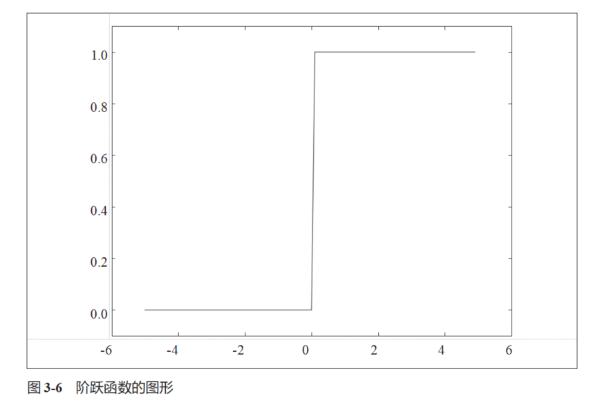

如图 3-6 所示，阶跃函数以 0 为界，输出从 0 切换为 1（或者从 1 切换为 0）。 它的值呈阶梯式变化，所以称为阶跃函数。

### sigmoid 函数的实现

下面，我们来实现sigmoid 函数。用Python 可以像下面这样写出式（3.6） 表示的sigmoid 函数。

```py
def  sigmoid(x):
	return  1  /   (1  +  np.exp(-x))
```

​	这里， np.exp(-x) 对应exp(-x)。这个实现没有什么特别难的地方，但 是要注意参数 x 为NumPy 数组时，结果也能被正确计算。实际上，如果在 这个sigmoid 函数中输入一个NumPy 数组，则结果如下所示。

```py
>>>  x  =  np.array([-1.0,  1.0,  2.0])
>>>  sigmoid(x)
array([  0.26894142,    0.73105858,    0.88079708])
```

​	之所以sigmoid 函数的实现能支持NumPy 数组，秘密就在于NumPy 的 广播功能。根据NumPy 的广播功能，如果在标量和NumPy 数组 之间进行运算，则标量会和NumPy 数组的各个元素进行运算。这里来看一 个具体的例子。

```py
>>>  t  =  np.array([1.0,  2.0,  3.0])
>>>  1.0  +  t
array([  2 . ,    3 . ,    4 . ])
>>>  1.0  /  t
array([  1. , 0.5, 0.33333333])
```

​	在这个例子中，标量（例子中是1.0）和NumPy 数组之间进行了数值运 算（+ 、/ 等）。结果，标量和 NumPy 数组的各个元素进行了运算，运算结 果以 NumPy 数组的形式被输出。刚才的 sigmoid 函数的实现也是如此， 因 为np.exp(-x) 会生成NumPy 数组，所以1  /  (1  +  np.exp(-x)) 的运算将会在 NumPy 数组的各个元素间进行。

下面我们把sigmoid 函数画在图上。画图的代码和刚才的阶跃函数的代 码几乎是一样的，唯一不同的地方是把输出y 的函数换成了sigmoid 函数。

```py
import numpy as np
import matplotlib.pylab as plt
def  sigmoid(x):
    return  1  /   (1  +  np.exp(-x))
x  =  np.arange(-5.0,  5.0,  0.1)
y  =  sigmoid(x)
plt.plot(x,  y)
plt.ylim( -0.1, 1.1)  #  指定 y 轴的范围
plt.show()
```

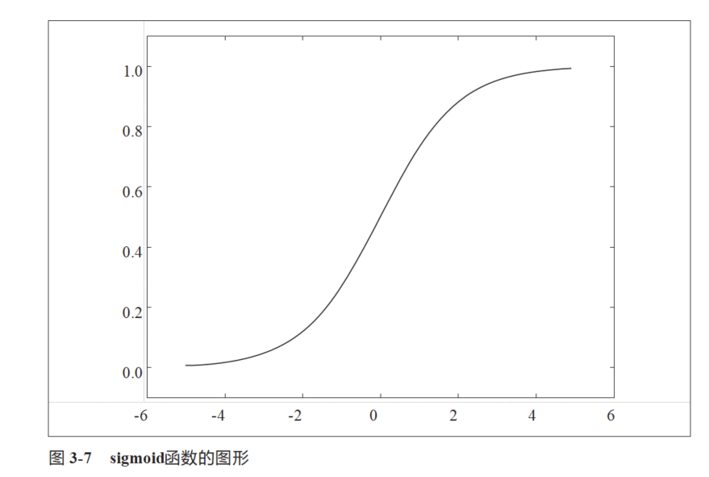

### sigmoid 函数和阶跃函数的比较

​	现在我们来比较一下sigmoid 函数和阶跃函数，如图 3-8 所示。两者的 不同点在哪里呢？又有哪些共同点呢？我们通过观察图 3-8 来思考一下。

​	观察图 3-8，首先注意到的是“平滑性”的不同。sigmoid 函数是一条平 滑的曲线，输出随着输入发生连续性的变化。而阶跃函数以 0 为界，输出发 生急剧性的变化。sigmoid 函数的平滑性对神经网络的学习具有重要意义。

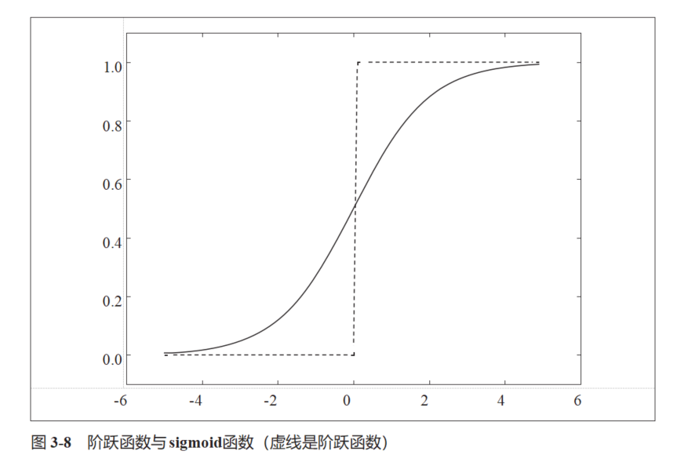

​	另一个不同点是，相对于阶跃函数只能返回 0 或1 ，sigmoid 函数可以返 回 0.731 ... 、0.880 ... 等实数（这一点和刚才的平滑性有关）。也就是说，感 知机中神经元之间流动的是 0 或 1 的二元信号，而神经网络中流动的是连续 的实数值信号。

​	接着说一下阶跃函数和 sigmoid 函数的共同性质。阶跃函数和 sigmoid  函数虽然在平滑性上有差异，但是如果从宏观视角看图 3-8，可以发现它们 具有相似的形状。实际上，两者的结构均是“输入小时，输出接近 0（为 0）； 随着输入增大，输出向 1 靠近（变成 1）”。也就是说，当输入信号为重要信息时， 阶跃函数和sigmoid 函数都会输出较大的值；当输入信号为不重要的信息时， 两者都输出较小的值。还有一个共同点是，不管输入信号有多小，或者有多  大，输出信号的值都在 0 到 1 之间。

### 非线性函数

​	阶跃函数和sigmoid 函数还有其他共同点，就是两者均为非线性函数。 sigmoid 函数是一条曲线，阶跃函数是一条像阶梯一样的折线，两者都属于 非线性的函数。

​	在介绍激活函数时，经常会看到“非线性函数”和“线性函数”等术语。 函数本来是输入某个值后会返回一个值的转换器。向这个转换器输  入某个值后，输出值是输入值的常数倍的函数称为线性函数（用数学  式表示为 h(x) = cx。c 为常数）。因此，线性函数是一条笔直的直线。 而非线性函数，顾名思义，指的是不像线性函数那样呈现出一条直  线的函数。

​	神经网络的激活函数必须使用非线性函数。换句话说，激活函数不能使 用线性函数。为什么不能使用线性函数呢？ 因为使用线性函数的话，加深神 经网络的层数就没有意义了。

​	线性函数的问题在于，不管如何加深层数，总是存在与之等效的“无 隐藏层的神经网络”。为了具体地（稍微直观地）理解这一点，我们来思 考下面这个简单的例子。这里我们考虑把线性函数 h(x) = cx 作为激活 函数，把 y(x) = h(h(h(x))) 的运算对应 3 层神经网络（该对应只是一个近似，实际的神经网络运算比这个例子要复杂，但不影响后面的结论成立。）。这个运算会进行 y(x) = c × c × c × x 的乘法运算，但是同样的处理可以由 y(x) = ax（注意， a = c 3）这一次乘法运算（即没有隐藏层的神经网络）来表示。如本例所示， 使用线性函数时，无法发挥多层网络带来的优势。因此，为了发挥叠加层所  带来的优势，激活函数必须使用非线性函数。

### ReLU函数

​	到目前为止，我们介绍了作为激活函数的阶跃函数和sigmoid 函数。在 神经网络发展的历史上，sigmoid 函数很早就开始被使用了，而最近则主要 使用 **ReLU**（Rectified Linear Unit）函数。

ReLU 函数在输入大于 0 时，直接输出该值；在输入小于等于 0 时，输 出 0（图 3-9）。

ReLU 函数可以表示为下面的式(3.7)。

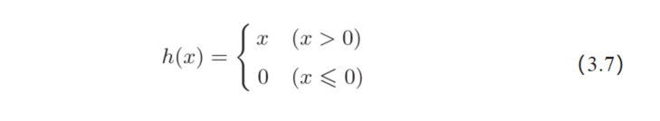

如图 3-9 和式（3.7）所示，ReLU 函数是一个非常简单的函数。因此， ReLU 函数的实现也很简单，可以写成如下形式。

```py
def  relu(x):
return  np .maximum(0,  x)
```

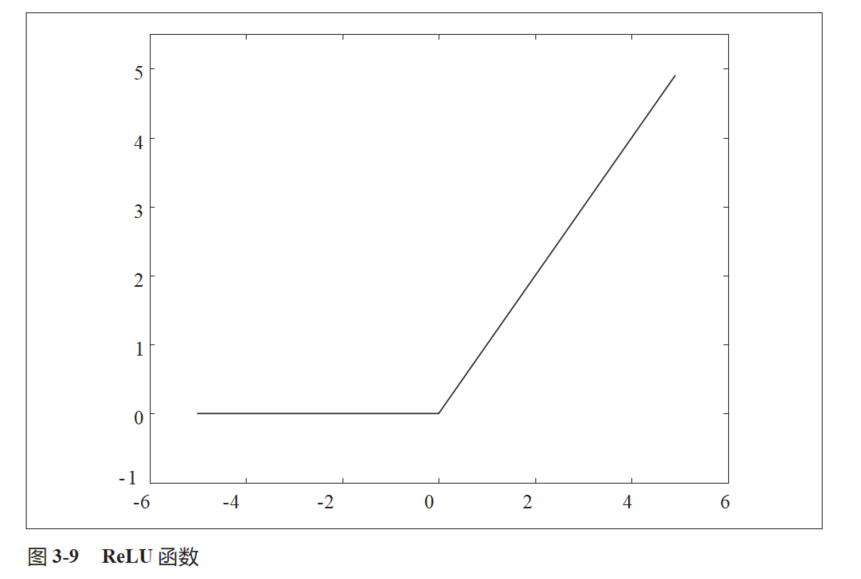

这里使用了NumPy 的maximum 函数。maximum 函数会从输入的数值中选 择较大的那个值进行输出。

本章剩余部分的内容仍将使用sigmoid 函数作为激活函数，但在本书的 后半部分，则将主要使用ReLU 函数。

## 多维数组的运算

如果掌握了NumPy 多维数组的运算，就可以高效地实现神经网络。因此， 本节将介绍NumPy 多维数组的运算，然后再进行神经网络的实现。

### 多维数组

​	简单地讲，多维数组就是“数字的集合”，数字排成一列的集合、排成 长方形的集合、排成三维状或者（更加一般化的）N维状的集合都称为多维数 组。下面我们就用NumPy 来生成多维数组，先从前面介绍过的一维数组开始。

```py
>>>  import  numpy  as  np
>>>  A  =  np.array([1,  2,  3,  4])
>>>  print(A)
[1  2  3  4]
>>>  np.ndim(A)
1
>>>  A .shape
(4,)
>>>  A.shape[0]
4
```

​	如上所示，数组的维数可以通过np.dim()函数获得。此外，数组的形状 可以通过实例变量shape 获得。在上面的例子中，A 是一维数组， 由 4 个元素 构成。注意，这里的 A.shape 的结果是个元组（tuple）。这是因为一维数组的 情况下也要返回和多维数组的情况下一致的结果。例如，二维数组时返回的 是元组(4,3)，三维数组时返回的是元组(4,3,2)，因此一维数组时也同样以 元组的形式返回结果。下面我们来生成一个二维数组。

```py
>>>  B  =  np.array([[1,2],  [3,4],   [5,6]])
>>>  print(B)
[[1  2]
[3  4]
[5  6]]
>>>  np.ndim(B)
2
>>>  B .shape
(3,  2)
```

​	这里生成了一个 3 × 2 的数组 B 。3 × 2 的数组表示第一个维度有 3 个元素， 第二个维度有 2 个元素。另外，第一个维度对应第 0 维，第二个维度对应第 1 维（Python 的索引从 0 开始）。二维数组也称为矩阵（matrix）。如图 3-10 所示， 数组的横向排列称为行（row），纵向排列称为列（column）。

### 矩阵乘法

下面，我们来介绍矩阵（二维数组）的乘积。比如 2 × 2 的矩阵，其乘积 可以像图 3-11 这样进行计算（按图中顺序进行计算是规定好了的）。

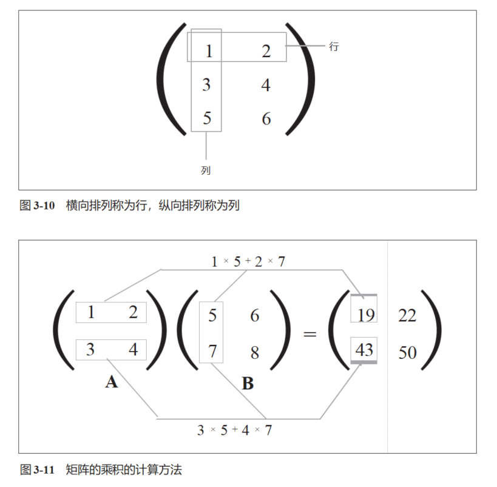

​	如本例所示，矩阵的乘积是通过左边矩阵的行（横向）和右边矩阵的列（纵 向）以对应元素的方式相乘后再求和而得到的。并且，运算的结果保存为新 的多维数组的元素。比如，***\*A\****的第 1 行和***\*B\****的第 1 列的乘积结果是新数组的 第 1 行第 1 列的元素，***\*A\****的第 2 行和***\*B\****的第 1 列的结果是新数组的第 2 行第1 列的元素。另外，在本书的数学标记中，矩阵将用黑斜体表示（比如，矩阵 ***\*A\****），以区别于单个元素的标量（比如，a 或 b）。这个运算在Python 中可以用 如下代码实现。

```py
>>>  A  =  np.array([[1,2],   [3,4]])
>>>  A .shape
(2,  2)
>>>  B  =  np.array([[5,6],   [7,8]])
>>>  B .shape
(2,  2)
>>>  np.dot(A,  B)
array([[19,  22],
[43,  50]])
```

​	这 里，**A** 和 **B** 都是2 × 2 的矩阵，它们的乘积可以通过 NumPy 的 np.dot() 函数计算（乘积也称为点积）。np.dot() 接收两个NumPy 数组作为参 数，并返回数组的乘积。这里要注意的是，np.dot(A,  B) 和np.dot(B,  A) 的 值可能不一样。和一般的运算（+ 或* 等）不同，矩阵的乘积运算中，操作数（A、 B）的顺序不同，结果也会不同。

​	这里介绍的是计算 2 × 2 形状的矩阵的乘积的例子，其他形状的矩阵的 乘积也可以用相同的方法来计算。比如，2 × 3 的矩阵和 3 × 2 的矩阵的乘积 可按如下形式用Python 来实现。

```py
>>>  A  =  np.array([[1,2,3],  [4,5,6]])
>>>  A .shape
(2,  3)
>>>  B  =  np.array([[1,2],  [3,4],   [5,6]])
>>>  B .shape
(3,  2)
>>>  np.dot(A,  B)
array([[22,  28],
[49,  64]])
```

​	2 × 3 的矩阵A和 3 × 2 的矩阵B的乘积可按以上方式实现。这里需要   注意的是矩阵的形状（shape）。具体地讲，矩阵A的第 1 维的元素个数（列数） 必须和矩阵B的第 0 维的元素个数（行数）相等。在上面的例子中，矩阵A   的形状是 2 × 3，矩阵B的形状是 3 × 2，矩阵A的第 1 维的元素个数（3）和   矩阵B的第 0 维的元素个数（3）相等。如果这两个值不相等，则无法计算矩   阵的乘积。比如，如果用Python 计算 2 × 3 的矩阵A和 2 × 2 的矩阵C的乘   积，则会输出如下错误。

```py
>>>  C  =  np.array([[1,2],   [3,4]])
>>>  C .shape
(2,  2)
>>>  A .shape
(2,  3)
>>>  np.dot(A,  C)
Traceback  (most  recent  call  last):
File  "<stdin>",  line  1,  in  <module>
ValueError:  shapes  (2,3)  and   (2,2)  not  aligned:  3   (dim  1)   !=  2  (dim  0)
```

​	这个错误的意思是，矩阵 **A** 的第 1 维和矩阵 **C** 的第 0 维的元素个数不一 致（维度的索引从 0 开始）。也就是说，在多维数组的乘积运算中，必须使两 个矩阵中的对应维度的元素个数一致，这一点很重要。我们通过图 3-12 再来 确认一下。

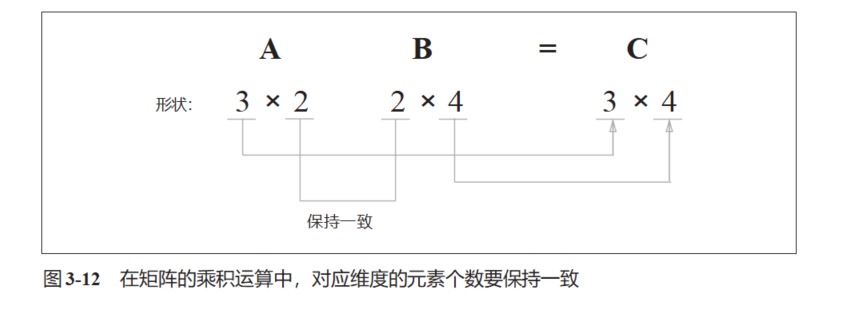

​	图 3-12 中，3 × 2 的矩阵 **A **和 2 × 4 的矩阵 **B** 的乘积运算生成了3 × 4 的  矩阵C。如图所示，矩阵 **A** 和矩阵 **B** 的对应维度的元素个数必须保持一致。 此外，还有一点很重要，就是运算结果的矩阵C的形状是由矩阵 **A** 的行数  和矩阵 **B** 的列数构成的。
另外，当 **A** 是二维矩阵、**B** 是一维数组时，如图 3-13 所示，对应维度 的元素个数要保持一致的原则依然成立。
可按如下方式用Python 实现图 3-13 的例子。

```py
>>>  A  =  np.array([[1,2],  [3,  4],   [5,6]])
>>>  A .shape
(3,  2)
>>>  B  =  np.array([7,8])
>>>  B .shape
(2,)
>>>  np.dot(A,  B)
array([23,  53,  83])
```

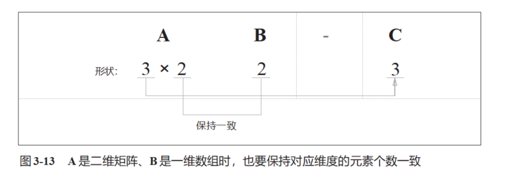

### 神经网络的内积

下面我们使用NumPy 矩阵来实现神经网络。这里我们以图 3-14 中的简 单神经网络为对象。这个神经网络省略了偏置和激活函数，只有权重。

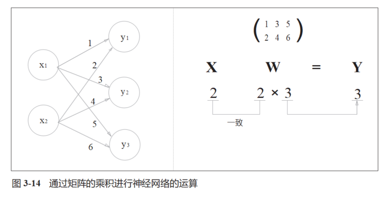

实现该神经网络时，要注意X 、W、Y的形状，特别是X和W的对应 维度的元素个数是否一致，这一点很重要。

```py
>>>  X  =  np.array([1,  2])
>>>  X .shape
(2,)
>>>  W  =  np.array([[1,  3,  5],   [2,  4,  6]])
>>>  print(W)
[[1  3  5]
[2  4  6]]
>>>  W .shape
(2,  3)
>>>  Y  =  np.dot(X,  W)
>>>  print(Y)
[  5     11     17]
```

​	如上所示，使用 np.dot（多维数组的点积），可以一次性计算出***\*Y\**** 的结果。 这意味着，即便***\*Y\****的元素个数为100 或1000，也可以通过一次运算就计算出 结果！如果不使用 np.dot，就必须单独计算***\*Y\****的每一个元素（或者说必须使 用for 语句），非常麻烦。因此，通过矩阵的乘积一次性完成计算的技巧，在 实现的层面上可以说是非常重要的。

## 3层神经网络的实现

​	现在我们来进行神经网络的实现。这里我们以图 3-15 的 3 层神经网络为 对象，实现从输入到输出的（前向）处理。在代码实现方面，使用上一节介 绍的 NumPy 多维数组。巧妙地使用NumPy 数组，可以用很少的代码完成 神经网络的前向处理。

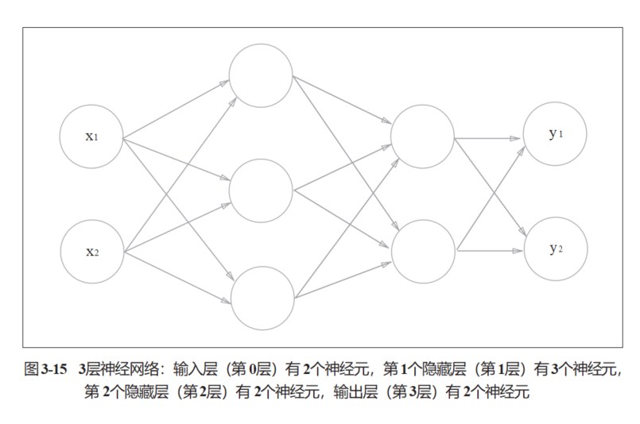

### 符号确认

​	在介绍神经网络中的处理之前，我们先导入 $w_{12}^{(1)}$ 、$a_1^{(1)}$" 等符号。这些符 号可能看上去有些复杂，不过因为只在本节使用，稍微读一下就跳过去也问 题不大。

​	本节的重点是神经网络的运算可以作为矩阵运算打包进行。因为 神经网络各层的运算是通过矩阵的乘法运算打包进行的（从宏观 视角来考虑），所以即便忘了（未记忆）具体的符号规则，也不影 响理解后面的内容。

我们先从定义符号开始。请看图3-16。图 3-16 中只突出显示了从输入层 神经元 x2 到后一层的神经元 af) 的权重。

​	如图 3-16 所示，权重和隐藏层的神经元的右上角有一个 “(1)”，它表示 权重和神经元的层号（即第 1 层的权重、第 1 层的神经元）。此外，权重的右 下角有两个数字，它们是后一层的神经元和前一层的神经元的索引号。比如， $w_{12}^{(1)}$ 表示前一层的第 2 个神经元 x2 到后一层的第 1 个神经元$a_1^{(1)}$ 的权重。权 重右下角按照“后一层的索引号、前一层的索引号”的顺序排列。

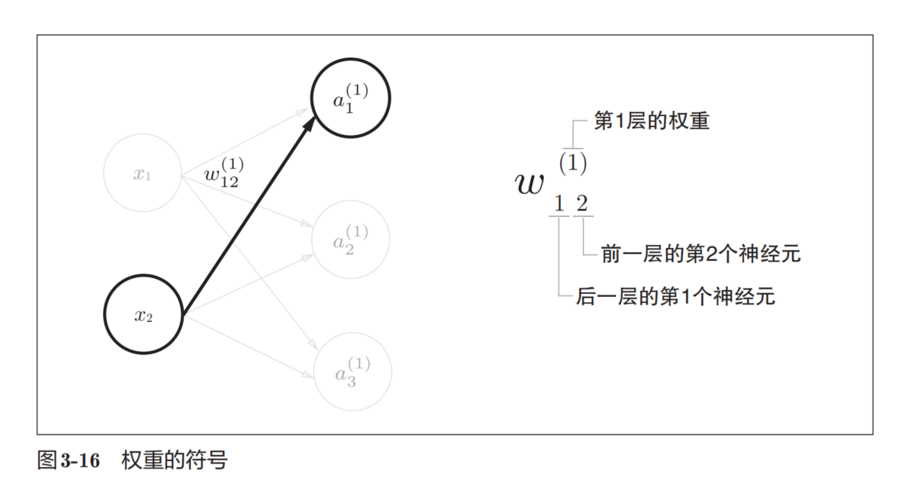

### 各层间信号传递的实现

现在看一下从输入层到第 1 层的第 1 个神经元的信号传递过程，如图 3-17 所示。

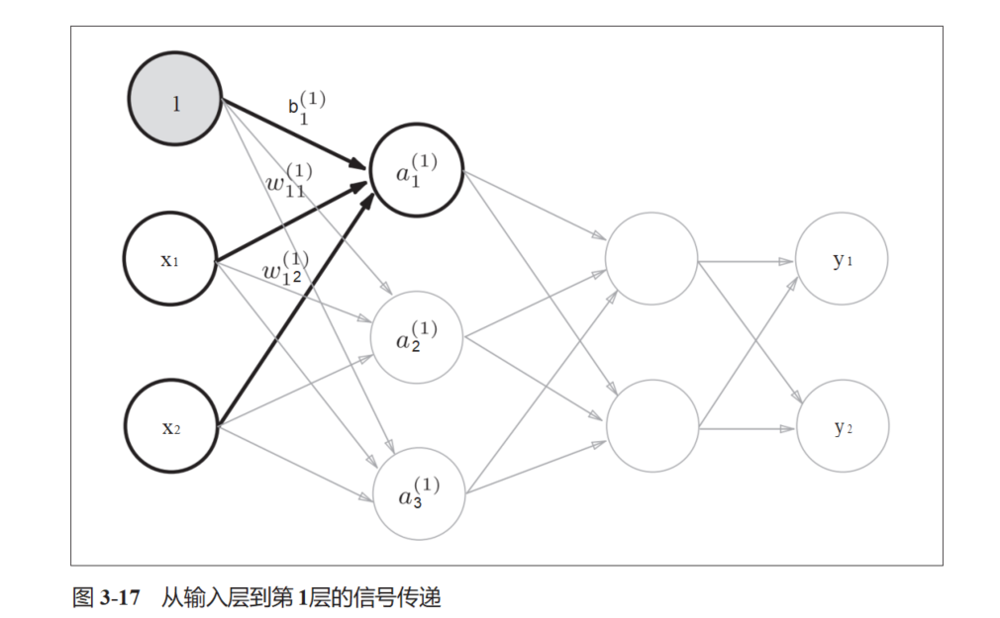

​	图 3-17 中增加了表示偏置的神经元“1”。请注意，偏置的右下角的索引号只有一个。这是因为前一层的偏置神经元（神经元“1”）只有一个 。（任何前一层的偏置神经元“1”都只有一个。偏置权重的数量取决于后一层的神经元的数量（不包括 后一层的偏置神经元“1”）。）

为了确认前面的内容，现在用数学式表示  $a^{(1)}$ 。  $a^{(1)}$ 通过加权信号和偏 置的和按如下方式进行计算。

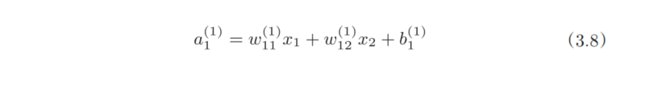

此外，如果使用矩阵的乘法运算，则可以将第 1 层的加权和表示成下面 的式（3.9）。

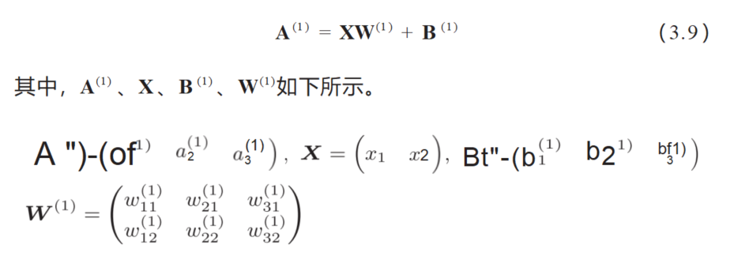

下面我们用NumPy 多维数组来实现式（3.9），这里将输入信号、权重、 偏置设置成任意值。

```py
X  =  np.array([1.0,  0.5])
W1  =  np.array([[0 . 1,  0.3,  0.5],  [0.2,  0.4,  0.6]])
B1  =  np.array([0 . 1,  0.2,  0.3])
print(W1.shape)  #   (2,  3)
print(X.shape)    #   (2,)
print(B1.shape)  #   (3,)
A1  =  np.dot(X,  W1)  +  B1
```

​	这个运算和上一节进行的运算是一样的。W1 是 2 × 3 的数组，X 是元素个 数为 2 的一维数组。这里，W1 和X的对应维度的元素个数也保持了一致。

接下来，我们观察第 1 层中激活函数的计算过程。如果把这个计算过程 用图来表示的话，则如图 3-18 所示。

​	如图 3-18 所示，隐藏层的加权和（加权信号和偏置的总和）用a 表示，被 激活函数转换后的信号用 z 表示。此外，图中 h() 表示激活函数，这里我们 使用的是sigmoid 函数。用Python 来实现，代码如下所示。

```py
Z1  =  sigmoid(A1)
print(A1)  #   [0.3,  0.7,  1.1]
print(Z1)  #  [0.57444252,  0.66818777,  0.75026011]
```

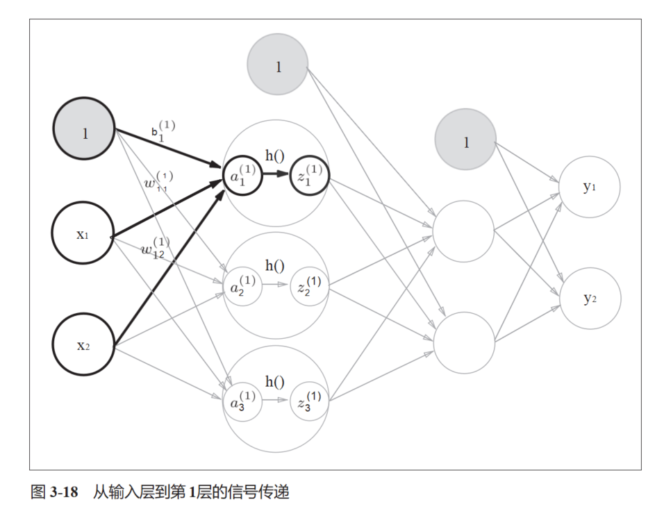

这个sigmoid() 函数就是之前定义的那个函数。它会接收NumPy 数组， 并返回元素个数相同的NumPy 数组。

下面，我们来实现第 1 层到第 2 层的信号传递（图 3-19）。

```py
W2  =  np.array([[0 . 1,  0.4],  [0.2,  0.5],  [0.3,  0.6]])
B2  =  np.array([0 . 1,  0.2])
print(Z1.shape)  #   (3,)
print(W2.shape)  #   (3,  2)
print(B2.shape)  #   (2,)
A2  =  np.dot(Z1,  W2)  +  B2
Z2  =  sigmoid(A2)
```

​	除了第 1 层的输出（Z1）变成了第 2 层的输入这一点以外，这个实现和刚 才的代码完全相同。由此可知，通过使用NumPy 数组，可以将层到层的信 号传递过程简单地写出来。

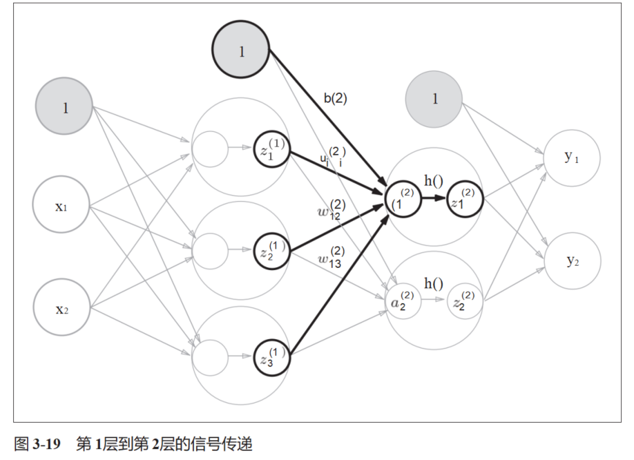

最后是第 2 层到输出层的信号传递（图 3-20）。输出层的实现也和之前的 实现基本相同。不过，最后的激活函数和之前的隐藏层有所不同。

```py
def  identity_function(x):
return  x
W3  =  np.array([[0 . 1,  0.3],  [0.2,  0.4]])
B3  =  np.array([0 . 1,  0.2])
A3  =  np.dot(Z2,  W3)  +  B3
Y  =  identity_function(A3)  #  或者 Y  =  A3
```

​	这里我们定义了 identity_function() 函数（也称为“恒等函数”），并将 其作为输出层的激活函数。恒等函数会将输入按原样输出， 因此，这个例子 中没有必要特意定义identity_function()。这里这样实现只是为了和之前的 流程保持统一。另外，图 3-20 中，输出层的激活函数用σ() 表示，不同于隐 藏层的激活函数 h()(σ读作sigma）。

 

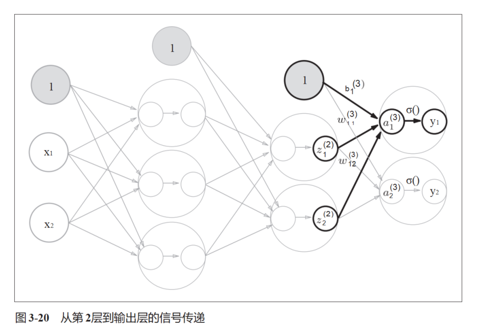

​	输出层所用的激活函数，要根据求解问题的性质决定。一般地， 回 归问题可以使用恒等函数，二元分类问题可以使用 sigmoid 函数， 多元分类问题可以使用 softmax 函数。关于输出层的激活函数，我们将在下一节详细介绍。

### 代码实现小结

​	至此，我们已经介绍完了 3 层神经网络的实现。现在我们把之前的代码 实现全部整理一下。这里，我们按照神经网络的实现惯例，只把权重记为大 写字母 W1，其他的（偏置或中间结果等）都用小写字母表示。

```py
def  init_network():
    network  =  {}
    network['W1']  =  np.array([[0 . 1,  0.3,  0.5],  [0.2,  0.4,  0.6]])
    network['b1']  =  np.array([0 . 1,  0.2,  0.3])
    network['W2']  =  np.array([[0 . 1,  0.4],  [0.2,  0.5],  [0.3,  0.6]])
    network['b2']  =  np.array([0 . 1,  0.2])
    network['W3']  =  np.array([[0 . 1,  0.3],  [0.2,  0.4]])
    network['b3']  =  np.array([0 . 1,  0.2])
    return  network

def  forward(network,  x):
    W1,  W2,  W3  =  network['W1'],  network['W2'],  network['W3']
    b1,  b2,  b3  =  network['b1'],  network['b2'],  network['b3']
    a1  =  np.dot(x,  W1)  +  b1
    z1  =  sigmoid(a1)
    a2  =  np.dot(z1,  W2)  +  b2
    z2  =  sigmoid(a2)
    a3  =  np.dot(z2,  W3)  +  b3
    y  =  identity_function(a3)
    return  y
network  =  init_network()
x  =  np.array([1.0,  0.5])
y  =  forward(network,  x)
print(y)  #   [  0.31682708    0.69627909]
```

​	这里定义了 init_network() 和 forward() 函数。 init_network() 函数会进 行权重和偏置的初始化，并将它们保存在字典变量network 中。这个字典变 量network 中保存了每一层所需的参数（权重和偏置）。forward() 函数中则封 装了将输入信号转换为输出信号的处理过程。

​	另外，这里出现了forward（前向）一词，它表示的是从输入到输出方向 的传递处理。后面在进行神经网络的训练时，我们将介绍后向（backward， 从输出到输入方向）的处理。

至此，神经网络的前向处理的实现就完成了。通过巧妙地使用NumPy 多维数组，我们高效地实现了神经网络。

## 输出层的设计

​	神经网络可以用在分类问题和回归问题上，不过需要根据情况改变输出 层的激活函数。一般而言， 回归问题用恒等函数，分类问题用softmax 函数。

​	机器学习的问题大致可以分为分类问题和回归问题。分类问题是数  据属于哪一个类别的问题。比如， 区分图像中的人是男性还是女性  的问题就是分类问题。而回归问题是根据某个输入预测一个（连续的） 数值的问题。比如，根据一个人的图像预测这个人的体重的问题就  是回归问题（类似“57.4kg”这样的预测）。

### 恒等函数和 softmax 函数

​	恒等函数会将输入按原样输出，对于输入的信息，不加以任何改动地直 接输出。因此，在输出层使用恒等函数时，输入信号会原封不动地被输出。 另外，将恒等函数的处理过程用之前的神经网络图来表示的话，则如图 3-21  所示。和前面介绍的隐藏层的激活函数一样，恒等函数进行的转换处理可以 用一根箭头来表示。


​													图 3-21    恒等函数

分类问题中使用的softmax 函数可以用下面的式（3.10）表示。

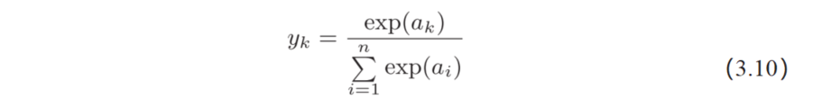

​	exp(x) 是表示 $e^x$ 的指数函数（e 是纳皮尔常数 2.7182...）。式（3.10）表示 假设输出层共有 n 个神经元，计算第 k 个神经元的输出 $y_k$。如式（3.10）所示， softmax 函数的分子是输入信号 $a_k$ 的指数函数，分母是所有输入信号的指数 函数的和。

​	用图表示 softmax 函数的话，如图 3-22 所示。图 3-22 中，softmax 函数 的输出通过箭头与所有的输入信号相连。这是因为，从式（3.10）可以看出， 输出层的各个神经元都受到所有输入信号的影响。

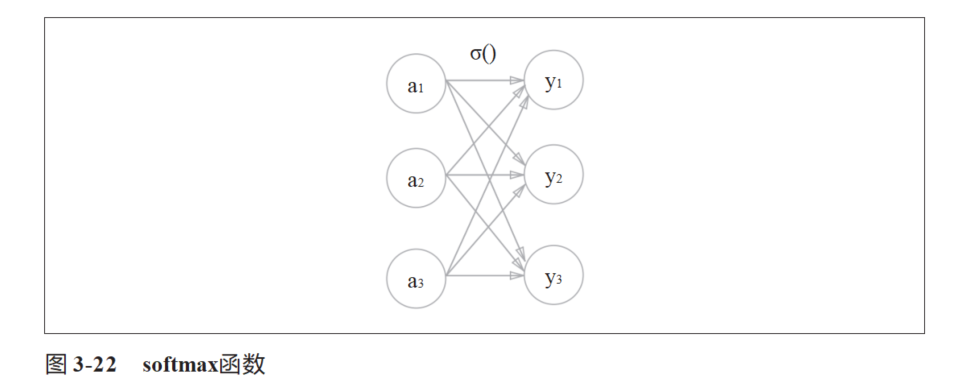

现在我们来实现softmax 函数。在这个过程中，我们将使用Python 解释 器逐一确认结果。

```py
>>>  a  =  np.array([0.3,  2.9,  4.0])
>>>
>>>  exp_a  =  np.exp(a)  #  指数函数
>>>  print(exp_a)
[    1.34985881    18.17414537    54.59815003]
>>>
>>>  sum_exp_a  =  np.sum(exp_a)  #  指数函数的和
>>>  print(sum_exp_a)
74.1221542102
>>>
>>>  y  =  exp_a  /  sum_exp_a
>>>  print(y)
[  0.01821127    0.24519181    0.73659691]
```

​	这个Python 实现是完全依照式（3.10）进行的，所以不需要特别的解释。 考虑到后面还要使用softmax 函数，这里我们把它定义成如下的Python 函数。

```py
def  softmax(a):
    exp_a  =  np.exp(a)
    sum_exp_a  =  np .sum(exp_a)
    y  =  exp_a  /  sum_exp_a
    return  y
```

### 实现 softmax 函数时的注意事项

​	上面的softmax 函数的实现虽然正确描述了式（3.10），但在计算机的运算 上有一定的缺陷。这个缺陷就是溢出问题。softmax 函数的实现中要进行指 数函数的运算，但是此时指数函数的值很容易变得非常大。比如，$e^{100}$ 的值 会超过 20000 ，$e^{100}$ 会变成一个后面有 40 多个 0 的超大值，$e^{1000}$ 的结果会返回 一个表示无穷大的inf。如果在这些超大值之间进行除法运算，结果会出现“不 确定”的情况。

​	计算机处理“数”时，数值必须在 4 字节或 8 字节的有限数据宽度内。 这意味着数存在有效位数，也就是说，可以表示的数值范围是有 限的。因此，会出现超大值无法表示的问题。这个问题称为溢出， 在进行计算机的运算时必须（常常)注意。

softmax 函数的实现可以像式（3.11）这样进行改进。

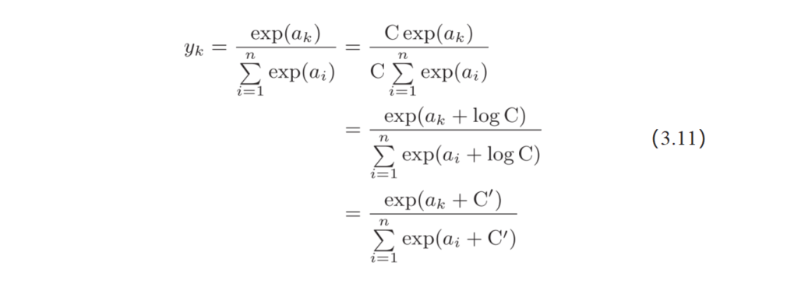

​	首先，式（3.11）在分子和分母上都乘上C 这个任意的常数（因为同时对 分母和分子乘以相同的常数，所以计算结果不变）。然后，把这个C 移动到 指数函数（exp）中，记为log C。最后，把log C 替换为另一个符号C ,。

​	式（3.11）说明，在进行softmax 的指数函数的运算时，加上（或者减去） 某个常数并不会改变运算的结果。这里的 C , 可以使用任何值，但是为了防  止溢出，一般会使用输入信号中的最大值。我们来看一个具体的例子。

```py
>>>  a  =  np.array([1010,  1000,  990])
>>>  np.exp(a)  /  np.sum(np.exp(a))  #  softmax 函数的运算
array([  nan,    nan,    nan])                  #  没有被正确计算
>>>
>>>  c  =  np.max(a)  #  1010
>>>  a  -  c
array([    0,  -10,  -20])
>>>
>>>  np .exp(a  -  c)  /  np.sum(np.exp(a  -  c))
array([    9.99954600e-01,     4.53978686e-05,      2.06106005e-09])
```

​	如该例所示，通过减去输入信号中的最大值（上例中的 c），我们发现原 本为 nan（not a number，不确定）的地方，现在被正确计算了。综上，我们 可以像下面这样实现softmax 函数。

```py
def  softmax(a):
    c  =  np.max(a)
    exp_a  =  np .exp(a  -  c)  #  溢出对策
    sum_exp_a  =  np .sum(exp_a)
    y  =  exp_a  /  sum_exp_a
    return  y
```

### softmax函数的特征

使用 softmax() 函数，可以按如下方式计算神经网络的输出。

```py
>>>  a  =  np.array([0.3,  2.9,  4.0])
>>>  y  =  softmax(a)
>>>  print(y)
[  0.01821127    0.24519181    0.73659691]
>>>  np.sum(y)
1.0
```

​	如上所示，softmax 函数的输出是0.0 到 1.0 之间的实数。并且，softmax 函数的输出值的总和是 1。输出总和为 1 是softmax 函数的一个重要性质。正 因为有了这个性质，我们才可以把softmax 函数的输出解释为“概率”。

​	比如，上面的例子可以解释成y[0]的概率是 0.018（1.8 %），y[1] 的概率 是 0.245（24.5 %），y[2] 的概率是 0.737（73.7 %）。从概率的结果来看，可以 说“因为第 2 个元素的概率最高，所以答案是第 2 个类别”。而且，还可以回答“有 74 % 的概率是第 2 个类别，有 25 % 的概率是第 1 个类别，有 1 % 的概 率是第 0 个类别”。也就是说，通过使用softmax 函数，我们可以用概率的（统 计的）方法处理问题。

​	这里需要注意的是，即便使用了softmax 函数，各个元素之间的大小关 系也不会改变。这是因为指数函数（y = exp(x)）是单调递增函数。实际上， 上例中 a 的各元素的大小关系和 y 的各元素的大小关系并没有改变。比如，a  的最大值是第 2 个元素，y 的最大值也仍是第 2 个元素。

​	一般而言，神经网络只把输出值最大的神经元所对应的类别作为识别结果。 并且，即便使用softmax 函数，输出值最大的神经元的位置也不会变。因此， 神经网络在进行分类时，输出层的softmax 函数可以省略。在实际的问题中， 由于指数函数的运算需要一定的计算机运算量， 因此输出层的softmax 函数 一般会被省略。

​	求解机器学习问题的步骤可以分为学习（学习”也称为“训练”，为了强调算法从数据中学习模型，本书使用“学习”一词。）   和“推理”两个阶段。首 先，在学习阶段进行模型的学习（这里的“学习”是指使用训练数据、自动调整参数的过程） ,  然后，在推理阶段，用学到的 模型对未知的数据进行推理（分类）。如前所述，推理阶段一般会省 略输出层的 softmax 函数。在输出层使用 softmax 函数是因为它和 神经网络的学习有关系（详细内容请参考下一章)。

### 输出层的神经元数量

​	输出层的神经元数量需要根据待解决的问题来决定。对于分类问题，输  出层的神经元数量一般设定为类别的数量。比如，对于某个输入图像，预测  是图中的数字0 到 9 中的哪一个的问题（10 类别分类问题），可以像图3-23 这样， 将输出层的神经元设定为 10 个。

​	如图 3-23 所示，在这个例子中，输出层的神经元从上往下依次对应数字 0, 1, ..., 9。此外，图中输出层的神经元的值用不同的灰度表示。这个例子中神经元 $y_2$ 颜色最深，输出的值最大。这表明这个神经网络预测的是$y_2$ 对应 的类别，也就是“2”。

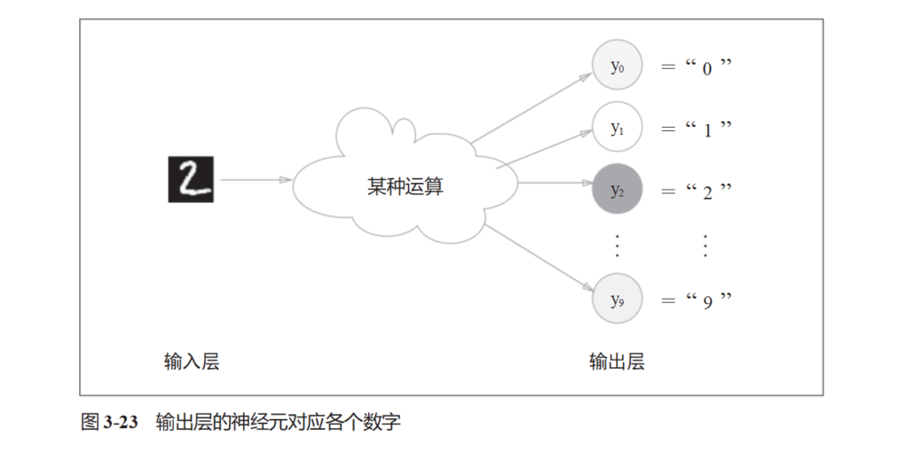

## 手写数字识别

​	介绍完神经网络的结构之后，现在我们来试着解决实际问题。这里我们 来进行手写数字图像的分类。假设学习已经全部结束，我们使用学习到的参 数，先实现神经网络的“推理处理”。这个推理处理也称为神经网络的前向 传播（forward propagation）。

​	和求解机器学习问题的步骤（分成学习和推理两个阶段进行）一样， 使用神经网络解决问题时，也需要首先使用训练数据（学习数据）进 行权重参数的学习；进行推理时，使用刚才学习到的参数，对输入 数据进行分类。

### MNIST 数据集

​	这里使用的数据集是MNIST 手写数字图像集。MNIST 是机器学习领域 最有名的数据集之一，被应用于从简单的实验到发表的论文研究等各种场合。 实际上，在阅读图像识别或机器学习的论文时，MNIST 数据集经常作为实 验用的数据出现。

​	MNIST 数据集是由 0 到 9 的数字图像构成的（图 3-24）。训练图像有 6 万张， 测试图像有 1 万张，这些图像可以用于学习和推理。MNIST 数据集的一般 使用方法是，先用训练图像进行学习，再用学习到的模型度量能在多大程度 上对测试图像进行正确的分类。

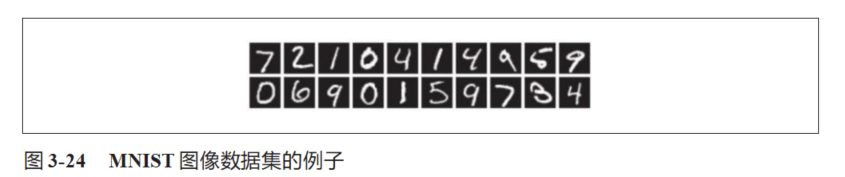

​	MNIST 的图像数据是 28 像素 × 28 像素的灰度图像（1 通道），各个像素 的取值在 0 到 255 之间。每个图像数据都相应地标有“7”“2”“1”等标签。

​	本书提供了便利的Python脚本mnist.py，该脚本支持从下载MNIST数据 集到将这些数据转换成NumPy数组等处理（mnist.py 在dataset 目录下）。使用 mnist.py 时，当前目录必须是ch01 、ch02 、ch03 、… 、ch08 目录中的一个。使 用mnist.py 中的load_mnist() 函数，就可以按下述方式轻松读入MNIST数据。

```py
import  sys,  os
sys.path.append(os.pardir)  #  为了导入父目录中的文件而进行的设定
from  dataset.mnist  import  load_mnist
#  第一次调用会花费几分钟 … …
(x_train,  t_train),  (x_test,  t_test)  =  load_mnist(flatten=True,
normalize=False)
#  输出各个数据的形状
print(x_train.shape)  #  (60000,  784)

print(t_train.shape)  #  (60000,)
print(x_test.shape)    #  (10000,  784)
print(t_test.shape)   #   (10000,)
```

​	首先，为了导入父目录中的文件，进行相应的设定 【 观察本书源代码可知，上述代码在mnist_show.py 文件中。mnist_show.py 文件的当前目录是ch03， 但包含load_mnist() 函数的mnist.py 文件在dataset 目录下。因此，mnist_show.py 文件不能跨目  录直接导入mnist.py 文件。sys.path.append(os.pardir) 语句实际上是把父目录deep-learning -   from-scratch 加入到sys.path（Python 的搜索模块的路径集）中，从而可以导入deep-learning -   from-scratch 下的任何目录（包括dataset 目录）中的任何文件】。然后，导入 dataset/mnist.py 中的load_mnist 函 数。最 后，使 用load_mnist 函 数，读 入 MNIST 数据集。第一次调用load_mnist 函数时，因为要下载MNIST 数据集， 所以需要接入网络。第 2 次及以后的调用只需读入保存在本地的文件（pickle 文件)即可，因此处理所需的时间非常短。

​	用来读入 MNIST 图像的文件在本书提供的源代码的 dataset 目 录下。并且，我们假定了这个 MNIST 数据集只能从 ch01、ch02、 ch03、… 、ch08 目录中使用，因此，使用时需要从父目录（dataset  目录）中导入文件，为此需要添加 sys.path.append(os.pardir) 语句。

​	load_mnist 函数以“(训练图像 ,训练标签)，(测试图像，测试标签)”的 形式返回读入的MNIST 数据。此外，还可以像load_mnist(normalize=True,  flatten=True,  one_hot_label=False) 这 样，设 置 3 个 参 数。第 1 个 参 数 normalize 设置是否将输入图像正规化为 0.0～1.0 的值。如果将该参数设置 为False，则输入图像的像素会保持原来的 0～255。第 2 个参数flatten 设置 是否展开输入图像（变成一维数组）。如果将该参数设置为False，则输入图 像为 1 × 28 × 28 的三维数组；若设置为True，则输入图像会保存为由 784 个 元素构成的一维数组。第 3 个参数 one_hot_label 设置是否将标签保存为one- hot 表示（one-hot representation)。one-hot 表示是仅正确解标签为 1，其余 皆为 0 的数组，就像[0,0,1,0,0,0,0,0,0,0] 这样。当 one_hot_label 为False 时， 只是像7 、2 这样简单保存正确解标签；当 one_hot_label 为True时，标签则 保存为one-hot 表示。

​	Python 有 pickle 这个便利的功能。这个功能可以将程序运行中的对  象保存为文件。如果加载保存过的 pickle 文件，可以立刻复原之前  程序运行中的对象。用于读入 MNIST 数据集的 load_mnist() 函数内  部也使用了 pickle 功能（在第 2 次及以后读入时）。利用 pickle 功能， 可以高效地完成 MNIST 数据的准备工作。

​	现在，我们试着显示MNIST 图像， 同时也确认一下数据。图像的显示 使用PIL（Python Image Library）模块。执行下述代码后，训练图像的第一 张就会显示出来，如图 3-25 所示（源代码在ch03/mnist_show.py 中）。

```py
import  sys,  os
sys.path.append(os.pardir)
import  numpy  as  np
from  dataset.mnist  import  load_mnist
from  PIL  import  Image
def  img_show(img):
    pil_img  =  Image.fromarray(np.uint8(img))
    pil_img.show()
(x_train,  t_train),  (x_test,  t_test)  =  load_mnist(flatten=True,
normalize=False)
img  =  x_train[0]
label  =  t_train[0]
print(label)  #  5
print(img.shape)                      #   (784,)
img  =  img. reshape(28,  28)  #  把图像的形状变成原来的尺寸
print(img.shape)                      #   (28,  28)
img_show(img)
```

​	这里需要注意的是，flatten=True 时读入的图像是以一列（一维）NumPy 数组的形式保存的。因此，显示图像时，需要把它变为原来的 28 像素 × 28 像素的形状。可以通过reshape() 方法的参数指定期望的形状，更改NumPy 数组的形状。此外，还需要把保存为NumPy 数组的图像数据转换为PIL 用 的数据对象，这个转换处理由Image.fromarray() 来完成。


###  神经网络的推理处理

​	下面，我们对这个MNIST数据集实现神经网络的推理处理。神经网络 的输入层有 784个神经元，输出层有 10个神经元。输入层的 784这个数字来 源于图像大小的28 × 28 = 784，输出层的10这个数字来源于10类别分类（数 字 0到 9，共 10类别）。此外，这个神经网络有 2个隐藏层，第 1个隐藏层有  50个神经元，第2个隐藏层有100个神经元。这个50和 100可以设置为任何值。 下面我们先定义get_data() 、init_network() 、predict() 这 3个函数（代码在 ch03/neuralnet_mnist.py 中）。

```py
def  get_data():
    (x_train,  t_train),  (x_test,  t_test)  =  \
    load_mnist(normalize=True,  flatten=True,  one_hot_label=False)
    return  x_test,  t_test
def  init_network():
    with  open("sample_weight.pkl",  'rb')  as  f:
    network  =  pickle.load(f)
    return  network
def  predict(network,  x):
    W1,  W2,  W3  =  network['W1'],  network['W2'],  network['W3']
    b1,  b2,  b3  =  network['b1'],  network['b2'],  network['b3']
    a1  =  np.dot(x,  W1)  +  b1
    z1  =  sigmoid(a1)
    a2  =  np.dot(z1,  W2)  +  b2
    z2  =  sigmoid(a2)
    a3  =  np.dot(z2,  W3)  +  b3
    y  =  softmax(a3)
    return  y
```

​	init_network() 会读入保存在pickle 文件sample_weight.pkl 中的学习到的 权重参数 【因为之前我们假设学习已经完成，所以学习到的参数被保存下来。假设保存在 sample_weight.pkl 文件中，在推理阶段，我们直接加载这些已经学习到的参数】。这个文件中以字典变量的形式保存了权重和偏置参数。剩余的2 个函数，和前面介绍的代码实现基本相同，无需再解释。现在，我们用这 3 个函数来实现神经网络的推理处理。然后，评价它的识别精度（accuracy）， 即能在多大程度上正确分类。

​	执行上面的代码后，会显示“Accuracy:0.9352”。这表示有 93.52 % 的数 据被正确分类了。目前我们的目标是运行学习到的神经网络，所以不讨论识 别精度本身，不过以后我们会花精力在神经网络的结构和学习方法上，思考 如何进一步提高这个精度。实际上，我们打算把精度提高到 99 % 以上。

​	另外，在这个例子中，我们把load_mnist 函数的参数normalize 设置成了 True。将normalize 设置成True 后，函数内部会进行转换，将图像的各个像 素值除以 255，使得数据的值在 0.0～1.0 的范围内。像这样把数据限定到某 个范围内的处理称为正规化（normalization）。此外，对神经网络的输入数据 进行某种既定的转换称为预处理（pre-processing）。这里，作为对输入图像的 一种预处理，我们进行了正规化。

​	预处理在神经网络（深度学习）中非常实用，其有效性已在提高识别 性能和学习的效率等众多实验中得到证明。在刚才的例子中，作为  一种预处理，我们将各个像素值除以 255，进行了简单的正规化。 实际上，很多预处理都会考虑到数据的整体分布。比如，利用数据  整体的均值或标准差，移动数据，使数据整体以 0 为中心分布，或 者进行正规化，把数据的延展控制在一定范围内。除此之外，还有  将数据整体的分布形状均匀化的方法，即数据白化（whitening）等。

### 批处理

以上就是处理MNIST 数据集的神经网络的实现，现在我们来关注输入 数据和权重参数的“形状”。再看一下刚才的代码实现。

下面我们使用Python 解释器，输出刚才的神经网络的各层的权重的形状。

```py
>>>  x,  _  =  get_data()
>>>  network  =  init_network()
>>>  W1,  W2,  W3  =  network['W1'],  network['W2'],  network['W3']
>>>
>>>  x .shape
(10000,  784)
>>>  x[0] .shape
(784,)
>>>  W1 .shape
(784,  50)
>>>  W2 .shape
(50,  100)
>>>  W3 .shape
(100,  10)
```

​	我们通过上述结果来确认一下多维数组的对应维度的元素个数是否一致 （省略了偏置）。用图表示的话，如图 3-26 所示。可以发现，多维数组的对应 维度的元素个数确实是一致的。此外，我们还可以确认最终的结果是输出了 元素个数为 10 的一维数组。

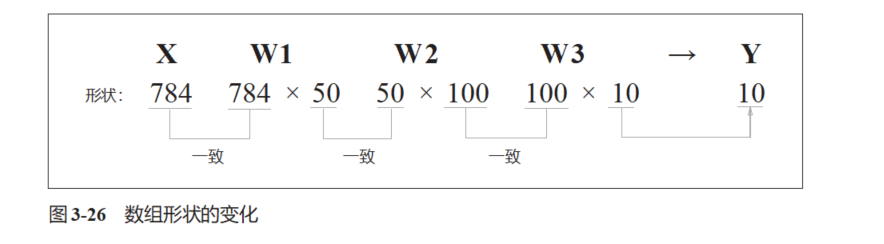

​	从整体的处理流程来看，图 3-26 中，输入一个由 784 个元素（原本是一 个 28 × 28 的二维数组）构成的一维数组后，输出一个有10 个元素的一维数组。 这是只输入一张图像数据时的处理流程。

​	现在我们来考虑打包输入多张图像的情形。比如，我们想用predict() 函数一次性打包处理100 张图像。为此，可以把***\*x\****的形状改为100 × 784，将 100 张图像打包作为输入数据。用图表示的话，如图 3-27 所示。

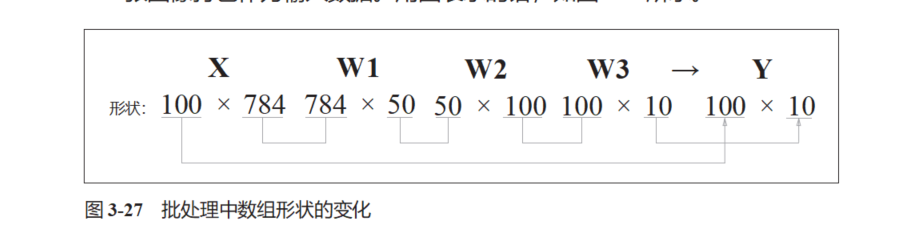

​	如图 3-27 所示，输入数据的形状为100 × 784，输出数据的形状为 100 × 10。这表示输入的 100 张图像的结果被一次性输出了。比如，x[0] 和 y[0] 中保存了第 0 张图像及其推理结果，x[1] 和y[1]中保存了第 1 张图像及 其推理结果，等等。

这种打包式的输入数据称为批（batch)。批有“捆”的意思，图像就如同 纸币一样扎成一捆。

​	批处理对计算机的运算大有利处，可以大幅缩短每张图像的处理时 间。那么为什么批处理可以缩短处理时间呢？这是因为大多数处理 数值计算的库都进行了能够高效处理大型数组运算的最优化。并且， 在神经网络的运算中， 当数据传送成为瓶颈时，批处理可以减轻数 据总线的负荷（严格地讲，相对于数据读入，可以将更多的时间用在 计算上）。也就是说，批处理一次性计算大型数组要比分开逐步计算 各个小型数组速度更快。

下面我们进行基于批处理的代码实现。这里用粗体显示与之前的实现的 不同之处

```py
x,  t  =  get_data()
network  =  init_network()
batch_size  =  100  #  批数量
accuracy_cnt  =  0
for  i  in  range(0,  len(x),  batch_size) :
    x_batch  =  x[i:i+batch_size]
    y_batch  =  predict(network,  x_batch)
    p  =  np.argmax(y_batch,  axis=1)
    accuracy_cnt  +=  np.sum(p  ==  t[i:i+batch_size])
print("Accuracy:"  +  str(float(accuracy_cnt)  /  len(x)))
```

​	我们来逐个解释粗体的代码部分。首先是 range() 函数。 range() 函数若 指定为 range(start,  end)，则会生成一个由start 到end-1 之间的整数构成的 列表。若像 range(start,  end,  step) 这样指定 3 个整数，则生成的列表中的 下一个元素会增加step 指定的值。我们来看一个例子。

```py
>>>  list(  range(0,  10)  )
[0,  1,  2,  3,  4,  5,  6,  7,  8,  9]
>>>  list(  range(0,  10,  3)  )
[0,  3,  6,  9]
```

​	在 range() 函数生成的列表的基础上，通过x[i:i+batch_size] 从输入数 据中抽出批数据。x[i:i+batch_n] 会取出从第i 个到第i+batch_n 个之间的数据。 本例中是像x[0:100] 、x[100:200]……这样，从头开始以100 为单位将数据提 取为批数据。

​	然后，通过argmax() 获取值最大的元素的索引。不过这里需要注意的是， 我们给定了参数axis=1。这指定了在 100 × 10 的数组中，沿着第 1 维方向（以 第 1 维为轴）找到值最大的元素的索引（第 0 维对应第 1 个维度） 【矩阵的第 0 维是列方向，第 1 维是行方向】。这里也来 看一个例子。

```py
>>>  x  =  np.array([[0.1,  0.8,  0.1],  [0.3,  0.1,  0.6],
...            [0.2,  0.5,  0.3],  [0.8,  0.1,  0.1]])
>>>  y  =  np.argmax(x,  axis=1)
>>>  print(y)
[1  2  1  0]
```

​	最后，我们比较一下以批为单位进行分类的结果和实际的答案。为此， 需要在NumPy 数组之间使用比较运算符（==）生成由True/False 构成的布尔 型数组，并计算 True 的个数。我们通过下面的例子进行确认。

```py
>>>  y  =  np.array([1,  2,  1,  0])
>>>  t  =  np.array([1,  2,  0,  0])
>>>  print(y==t)
[True  True  False  True]
>>>  np.sum(y==t)
3
```

​	至此，基于批处理的代码实现就介绍完了。使用批处理，可以实现高速 且高效的运算。下一章介绍神经网络的学习时，我们将把图像数据作为打包 的批数据进行学习，届时也将进行和这里的批处理一样的代码实现。

### 小结

​	本章介绍了神经网络的前向传播。本章介绍的神经网络和上一章的感知 机在信号的按层传递这一点上是相同的，但是，向下一个神经元发送信号时， 改变信号的激活函数有很大差异。神经网络中使用的是平滑变化的sigmoid 函数，而感知机中使用的是信号急剧变化的阶跃函数。这个差异对于神经网 络的学习非常重要，我们将在下一章介绍。

本章所学的内容

* 神经网络中的激活函数使用平滑变化的sigmoid 函数或ReLU 函数。

* 通过巧妙地使用NumPy 多维数组，可以高效地实现神经网络。

* 机器学习的问题大体上可以分为回归问题和分类问题。

* 关于输出层的激活函数，回归问题中一般用恒等函数，分类问题中 一般用softmax 函数。

* 分类问题中，输出层的神经元的数量设置为要分类的类别数。

* 输入数据的集合称为批。通过以批为单位进行推理处理，能够实现 高速的运算。
