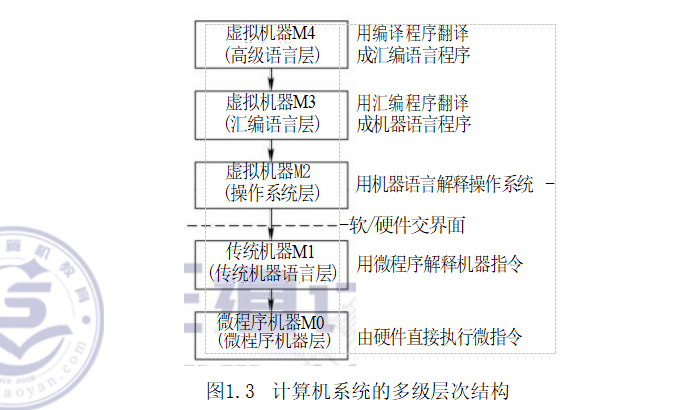
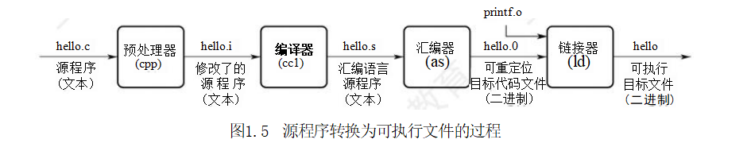
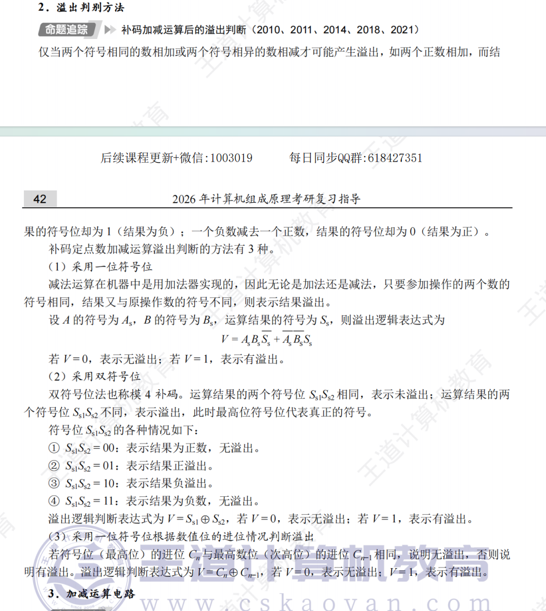

# 计组

## 第一章 计算机系统概述

### 计算机系统的层次结构

​	计算机是一个硬软件组成的综合体。因为面对的应用范围越来越广，所以必须有复杂的系 统软件和硬件的支持。软/硬件的设计者和使用者从不同的角度、用不同的语言来对待同一个计 算机系统，因此他们看到的计算机系统的属性对计算机系统提出的要求也就各不相同。

​	计算机系统的多级层次结构的作用，就是针对上述情况，根据从各种角度所看到的机器之间的 有机联系，来分清彼此之间的界面，明确各自的功能，以便构成合理、高效的计算机系统。

关于计算机系统层次结构的分层方式，目前尚无统一的标准，这里采用如图1.3所示的多级层次结构。

第 1 级 是微程序机器层，这是一个实在的硬件层，它由机器硬件直接执行微指令。

第 2 级 是传统机器语言层，它也是一个实际的机器层，由微程序解释机器指令系统。

​	第 3 级 是操作系统层，它由操作系统程序实现。操作系统程序是由机器指令和广义指令组成 的，这些广义指令是为了扩展机器功能而设置的，是由操作系统定义和解释的软件指令，所以这 一 层也称混合层。

第 4 级 是汇编语言层，这一层由汇编程序支持和执行，借此可编写汇编语言源程序。

​	第 5 级 是高级语言层，它是面向用户的，是为方便用户编写应用程序而设置的。该层由各种 高级语言编译程序支持和执行。在高级语言层之上，还可以有应用程序层，它由解决实际问题的 处理程序组成，如文字处理软件、多媒体处理软件和办公自动化软件等。

​	没有配备软件的纯硬件系统称裸机。第3层～第5层称为虚拟机器，简单来说就是软件实现 的机器。虚拟机器只对该层的观察者存在，这里的分层和计算机网络的分层类似，对于某层的观 察者来说，其只能通过该层的语言来了解和使用计算机，而不必关心下层是如何工作的。

层次之间的关系紧密，下层是上层的基础，上层是下层的扩展。

​	软件和硬件之间的界面就是指令集体系结构(ISA),ISA  定义了一 台计算机可以执行的所有 指令的集合，每条指令规定了计算机执行什么操作，以及所处理的操作数存放的地址空间和操作 数类型。可以看出， ISA 是指软件能感知到的部分，也称软件可见部分。

本门课程主要讨论传统机器M1 和微程序机器M0  的组成原理及设计思想。

### 从源程序到可执行文件

​	在计算机中编写的C 语言程序，都必须被转换为一系列的低级机器指令，这些指令按照一种 称为可执行目标文件的格式打好包，并以二进制磁盘文件的形式存放起来。

​	以 UNIX  系统中的GCC 编译器程序为例，读取源程序文件 hello.c,  并把它翻译成一个可执 行目标文件hello,整个翻译过程可分为四个阶段完成，如图1.5所示。

​	1)预处理阶段：预处理器 (cpp)   对源程序中以字符#开头的命令进行处理，例如将#include 命令后面的.h 文件内容插入程序文件。输出结果是一个以.i 为扩展名的源程序hello.i。

​	2)编译阶段：编译器 (ccl)   对预处理后的源程序进行编译，生成一个汇编语言源程序hello.s。汇编语言源程序中的每条语句都以一种文本格式描述了一条低级机器语言指令。

​	3)汇编阶段：汇编器 (as) 将 hello.s 翻译成机器语言指令，把这些指令打包成一个称为可 重定位目标代码文件hello.o,它是一种二进制文件，因此用文本编辑器打开会显示乱码。

​	4)链接阶段：链接器 (ld)  将多个可重定位目标代码文件和标准库函数合并为一个可执行目 标文件，简称可执行文件。本例中，链接器将hello.o 和标准库函数 printf 所在的可重定位 目标模块printfo  合并，生成可执行文件hello。最终生成的可执行文件被保存在磁盘上。

### 计算单位

K -> M -> G -> T -> P -> E -> Z(10^21)

### 几个专业术语

​	1)系列机。具有基本相同的体系结构，使用相同基本指令系统的多个不同型号的计算机组 成的一个产品系列。

​	2)兼容。指软件或硬件的通用性，即运行在某个型号的计算机系统中的硬/软件也能应用 于另一个型号的计算机系统时，称这两台计算机在硬件或软件上存在兼容性。

​	3)固件。将程序固化在ROM 中组成的部件称为固件。固件是一种具有软件特性的硬件，吸 收了软件/硬件各自的优点，其执行速度快于软件，灵活性优于硬件，是软/硬件结合的产 物。例如，目前操作系统已实现了部分固化(把软件永恒地存储于ROM 中)。

### 翻译程序、解释程序、汇编程序、编译程序的区别和联系

​	翻译程序有两种：一种是编译程序，它将高级语言源程序一次全部翻译成目标程序，只要源 程序不变，就无须重新翻译。另一种是解释程序，它将源程序的一条语句翻译成对应的机器目标 代码，并立即执行，然后翻译下一条源程序语句并执行，直至所有源程序语句全部被翻译并执行完。所以解释程序的执行过程是翻译一句执行一句，并且不会生成目标程序。

汇编程序也是一种语言翻译程序，它把汇编语言源程序翻译为机器语言程序。

​	编译程序与汇编程序的区别：若源语言是诸如C 、C++ 、Java 等“高级语言”,而目标语言是 诸如汇编语言或机器语言之类的“低级语言”,则这样的一个翻译程序称为编译程序。若源语言 是汇编语言，而目标语言是机器语言，则这样的一个翻译程序称为汇编程序。

## 第二章 数据的表示和运算

### 溢出判别方法

**CF = Sub异或Cout**

**OF = C（n） 异或 C（n - 1）**

### 原码的加减法运算

在原码加减运算中，将符号位和数值位分开处理，具体的规则如下。

**加法规则**：遵循“同号求和，异号求差”的原则，先判断两个操作数的符号位。具体来说， 符号位相同，则数值位相加，结果符号位不变，若最高数值位相加产生进位，则发生溢出；符号位不同，则做减法，绝对值大的数减去绝对值小的数，结果符号位与绝对值大的数相同。

**减法规则**：先将减数的符号取反，然后将被减数与符号取反后的减数按原码加法进行运算。

# 操统

## 第一章 计算机系统概述

### 命令接口和程序接口

​	为让用户方便、快捷、可靠地操纵计算机硬件并运行自己的程序，操作系统还提供用户接口。 操作系统提供的接口主要分为两类：一类是命令接口，用户利用这些操作命令来组织和控制作业 的执行；另一类是程序接口，编程人员可用来请求操作系统服务。

**(1)命令接口**

​	使用命令接口进行作业控制的主要方式有两种，即联机控制方式和脱机控制方式。按作业控 制方式的不同，可将命令接口分为联机命令接口和脱机命令接口。

​	联机命令接口也称交互式命令接口，适用于分时或实时系统的接口。联机命令由一组键盘操 作命令组成。用户通过控制台或终端输入操作命令，向系统提出各种服务要求。用户每输入一条 命令，控制权就转给操作系统的命令解释程序，然后由命令解释程序解释并执行输入的命令，进 而完成指定的功能。之后，控制权转回控制台或终端，此时用户又可输入下一条命令。联机命令 接口可以这样理解：“雇主”说一句话，“工人”做一件事，并做出反馈，这就强调了交互性。

脱机命令接口也称批处理命令接口，适用于批处理系统。脱机命令由一组作业控制命令组成。

​	脱机用户不能直接干预作业的运行，而应事先用相应的作业控制命令编写一份作业操作说明书， 连同作业一起提交给系统。当系统调度到该作业时，由系统中的命令解释程序逐条解释执行作业 说明书上的命令，进而间接地控制作业的运行。脱机命令接口可以这样理解：“雇主”将要“工 人”做的事情写在清单上，“工人”按照清单逐条完成这些事情，这就是批处理。

**(2)程序接口**

​	程序接口由一组系统调用(也称广义指令)组成。用户通过在程序中使用这些系统调用来请 求操作系统为其提供服务，如使用各种外部设备、申请分配和回收内存及其他各种要求。

​	当前最流行的是图形用户界面 (GUI),  即图形接口。GUI 最终是通过调用程序接口实现的， 用户通过鼠标和键盘在图形界面上单击或使用快捷键，就能方便地使用操作系统。严格来说，图 形接口不是操作系统的一部分，但图形接口所调用的系统调用命令是操作系统的一部分。

### 中断和异常的定义

​	中断 (Interruption)   也称外中断，是指来自CPU 执行指令外部的事件，通常用于信息输入/ 输出(见第5章),如设备发出的I/O 结束中断，表示设备输入/输出处理已经完成。时钟中断， 表示一个固定的时间片已到，让处理机处理计时、启动定时运行的任务等。

​	异常 (Exception)   也称内中断，是指来自CPU 执行指令内部的事件，如程序的非法操作码、 地址越界、运算溢出、虚存系统的缺页及专门的陷入指令等引起的事件。异常不能被屏蔽， 一旦 出现，就应立即处理。关于内中断和外中断的联系与区别如图1.2所示。

​	外中断可分为可屏蔽中断和不可屏蔽中断。 可屏蔽中断是指通过INTR 线发出的中断请求， 通过改变屏蔽字可以实现多重中断，从而使得中断处理更加灵活。 不可屏蔽中断是指通过 NMI 线发出的中断请求，通常是紧急的硬件故障，如电源掉电等。此外，异常也是不能被屏蔽的。

​	异常可分为故障、自陷和终止。故障(Fault) 通常是由指令执行引起的异常，如非法操作码、 缺页故障、除数为0、运算溢出等。自陷 (Trap,   也称陷入)是一种事先安排的“异常”事件， 用于在用户态下调用操作系统内核程序，如条件陷阱指令、系统调用指令等。终止(Abort) 是指 出现了使得CPU 无法继续执行的硬件故障，如控制器出错、存储器校验错等。故障异常和自陷异 常属于软件中断 (程序性异常),终止异常和外部中断属于硬件中断。

# 计网

## 第一章 计算机网络体系结构

### internet、Internet

​	**internet** (互连网)是一个通用名词，泛指由多个计算机网络互连而成的计算机网络。在这 些网络之间可以使用任意的通信协议作为通信规则，不一定非要使用 TCP/IP。

​	**Internet**: (互联网或因特网)则是一个专用名词，指当前全球最大的、开放的、由众多网络 和路由器互连而成的特定计算机网络，它采用TCP/IP 族作为通信规则。

### 协议数据单元

协议数据单元(PDU): 对等层之间传送的数据单位。第n 层的PDU 记为n-PDU。 各层的 PDU 都分为服务数据单元和协议控制信息两部分。

服务数据单元(SDU):   层与层之间交换的数据单位。第n 层的 SDU 记为n-SDU。

协议控制信息(PCI): 控制协议操作的信息。第n 层的PCI 记为n-PCI。

### 协议

​	要在网络中做到有条不紊地交换数据，就必须遵循一些事先约定好的规则，其规定了所交换 数据的格式及有关的同步问题。为了在网络中进行数据交换而建立的这些规则、标准或约定称为 网络协议 (Network   Protocol),是控制在对等实体之间进行通信的规则的集合，是水平的。不对 等实体之间是没有协议的，如用TCP/IP 栈通信的两个节点A 和节点B,  节 点A 的传输层和节点 B的传输层之间存在协议，但节点A 的传输层和节点B 的网络层之间不存在协议。

协议由语法、语义和同步三部分组成。

​	1)语法。数据与控制信息的格式。例如，TCP 报文段格式就是由TCP 的语法定义的。

​	2)语义。即需要发出何种控制信息、完成何种动作及做出何种应答。例如，在建立TCP 连 接时每次握手所执行的操作就是由TCP 的语义定义的。

​	3)同步(或时序)。执行各种操作的条件、时序关系等，即事件实现顺序的详细说明。例如， 建立 TCP 连接的三次握手操作的时序关系就是由TCP 的同步定义的。

### 会话层

​	会话层允许不同主机上的各个进程之间进行会话。这种服务主要为表示层实体或用户进程建 立连接，并在连接上有序地传输数据，这就是会话，也称建立同步 (SYN) 。 会话层负责管理主机间的会话进程，包括建立、管理和终止进程间的会话。会话层包含一种称为检查点的机制来维 持可靠会话，使通信会话在通信失效时从检查点继续恢复通信，即断点下载的原理。

### 表示层

​	表示层主要处理在不同主机中交换信息的表示方式。不同机器采用的编码和表示方法不同， 为了使不同表示方法的数据和信息之间能够互相交换，表示层采用抽象的标准方法定义数据结 构，并采用标准的编码形式。此外，数据压缩、加密和解密也是表示层的功能。

