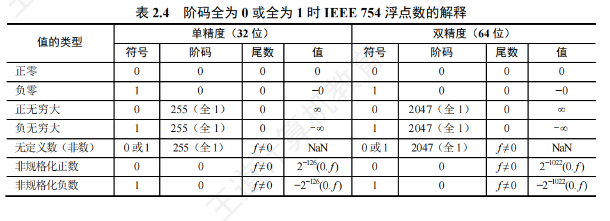

# 计组

## 第一章 计算机系统概述

### 计算机系统的层次结构

​	计算机是一个硬软件组成的综合体。因为面对的应用范围越来越广，所以必须有复杂的系 统软件和硬件的支持。软/硬件的设计者和使用者从不同的角度、用不同的语言来对待同一个计 算机系统，因此他们看到的计算机系统的属性对计算机系统提出的要求也就各不相同。

​	计算机系统的多级层次结构的作用，就是针对上述情况，根据从各种角度所看到的机器之间的 有机联系，来分清彼此之间的界面，明确各自的功能，以便构成合理、高效的计算机系统。

关于计算机系统层次结构的分层方式，目前尚无统一的标准，这里采用如图1.3所示的多级层次结构。


第 1 级 是微程序机器层，这是一个实在的硬件层，它由机器硬件直接执行微指令。

第 2 级 是传统机器语言层，它也是一个实际的机器层，由微程序解释机器指令系统。

​	第 3 级 是操作系统层，它由操作系统程序实现。操作系统程序是由机器指令和广义指令组成 的，这些广义指令是为了扩展机器功能而设置的，是由操作系统定义和解释的软件指令，所以这 一 层也称混合层。

第 4 级 是汇编语言层，这一层由汇编程序支持和执行，借此可编写汇编语言源程序。

​	第 5 级 是高级语言层，它是面向用户的，是为方便用户编写应用程序而设置的。该层由各种 高级语言编译程序支持和执行。在高级语言层之上，还可以有应用程序层，它由解决实际问题的 处理程序组成，如文字处理软件、多媒体处理软件和办公自动化软件等。

​	没有配备软件的纯硬件系统称裸机。第3层～第5层称为虚拟机器，简单来说就是软件实现 的机器。虚拟机器只对该层的观察者存在，这里的分层和计算机网络的分层类似，对于某层的观 察者来说，其只能通过该层的语言来了解和使用计算机，而不必关心下层是如何工作的。

层次之间的关系紧密，下层是上层的基础，上层是下层的扩展。

​	软件和硬件之间的界面就是指令集体系结构(ISA),ISA  定义了一 台计算机可以执行的所有 指令的集合，每条指令规定了计算机执行什么操作，以及所处理的操作数存放的地址空间和操作 数类型。可以看出， ISA 是指软件能感知到的部分，也称软件可见部分。

本门课程主要讨论传统机器M1 和微程序机器M0  的组成原理及设计思想。

### 从源程序到可执行文件

​	在计算机中编写的C 语言程序，都必须被转换为一系列的低级机器指令，这些指令按照一种 称为可执行目标文件的格式打好包，并以二进制磁盘文件的形式存放起来。

​	以 UNIX  系统中的GCC 编译器程序为例，读取源程序文件 hello.c,  并把它翻译成一个可执 行目标文件hello,整个翻译过程可分为四个阶段完成，如图1.5所示。


​	1)预处理阶段：预处理器 (cpp)   对源程序中以字符#开头的命令进行处理，例如将#include 命令后面的.h 文件内容插入程序文件。输出结果是一个以.i 为扩展名的源程序hello.i。

​	2)编译阶段：编译器 (ccl)   对预处理后的源程序进行编译，生成一个汇编语言源程序hello.s。汇编语言源程序中的每条语句都以一种文本格式描述了一条低级机器语言指令。

​	3)汇编阶段：汇编器 (as) 将 hello.s 翻译成机器语言指令，把这些指令打包成一个称为可 重定位目标代码文件hello.o,它是一种二进制文件，因此用文本编辑器打开会显示乱码。

​	4)链接阶段：链接器 (ld)  将多个可重定位目标代码文件和标准库函数合并为一个可执行目 标文件，简称可执行文件。本例中，链接器将hello.o 和标准库函数 printf 所在的可重定位 目标模块printfo  合并，生成可执行文件hello。最终生成的可执行文件被保存在磁盘上。

### 计算单位

K -> M -> G -> T -> P -> E -> Z(10^21)

### 几个专业术语

​	1)系列机。具有基本相同的体系结构，使用相同基本指令系统的多个不同型号的计算机组 成的一个产品系列。

​	2)兼容。指软件或硬件的通用性，即运行在某个型号的计算机系统中的硬/软件也能应用 于另一个型号的计算机系统时，称这两台计算机在硬件或软件上存在兼容性。

​	3)固件。将程序固化在ROM 中组成的部件称为固件。固件是一种具有软件特性的硬件，吸 收了软件/硬件各自的优点，其执行速度快于软件，灵活性优于硬件，是软/硬件结合的产 物。例如，目前操作系统已实现了部分固化(把软件永恒地存储于ROM 中)。

### 翻译程序、解释程序、汇编程序、编译程序的区别和联系

​	翻译程序有两种：一种是编译程序，它将高级语言源程序一次全部翻译成目标程序，只要源 程序不变，就无须重新翻译。另一种是解释程序，它将源程序的一条语句翻译成对应的机器目标 代码，并立即执行，然后翻译下一条源程序语句并执行，直至所有源程序语句全部被翻译并执行完。所以解释程序的执行过程是翻译一句执行一句，并且不会生成目标程序。

汇编程序也是一种语言翻译程序，它把汇编语言源程序翻译为机器语言程序。

​	编译程序与汇编程序的区别：若源语言是诸如C 、C++ 、Java 等“高级语言”,而目标语言是 诸如汇编语言或机器语言之类的“低级语言”,则这样的一个翻译程序称为编译程序。若源语言 是汇编语言，而目标语言是机器语言，则这样的一个翻译程序称为汇编程序。

## 第二章 数据的表示和运算

### 溢出判别方法

**CF = Sub异或Cout**

**OF = C（n） 异或 C（n - 1）**


### 原码的加减法运算

在原码加减运算中，将符号位和数值位分开处理，具体的规则如下。

**加法规则**：遵循“同号求和，异号求差”的原则，先判断两个操作数的符号位。具体来说， 符号位相同，则数值位相加，结果符号位不变，若最高数值位相加产生进位，则发生溢出；符号位不同，则做减法，绝对值大的数减去绝对值小的数，结果符号位与绝对值大的数相同。

**减法规则**：先将减数的符号取反，然后将被减数与符号取反后的减数按原码加法进行运算。

### 定点数的乘除运算

1.定点乘法运算

**乘法运算的基本原理**

原码乘法的特点是符号位与数值位是分开求的，原码乘法运算分为两步：

① 乘积的符号位由 两个乘数的符号位“异或”得到；

② 乘积的数值位是两个乘数的绝对值之积。两个定点数的数值 部分之积可视为两个无符号数的乘积。下面是两个无符号数相乘的手算过程。


​	由上述分析可知，乘法运算可用加法和移位运算来实现(乘以 $2^{-1}$ 相当于做 一 次右移),两 个 n 位无符号数相乘共需进行n 次加法和n 次移位运算。原码乘法运算的过程可归纳如下：

①被乘数和乘数均取绝对值参加运算，视为无符号数，符号位为$x_s$ $a \oplus b$

② 部 分 积 $P_{i}$  是乘法运算的中间结果，初值 $P_{0}$ = 0 。 从乘数的最低位  $Y_{n}$ 开始，将前面所得的 部分积  $P_{i}$  加 上 X × $y_{n - i}$,  然后右移一位，此步骤重复n 次 。

参与运算的是两个数的数值位，因此运算过程中的右移操作均为逻辑右移。

**乘法运算电路**

​	图2.10是32位无符号数乘法运算的逻辑结构图。部分积和被乘数X 做无符号数加法时， 可能产生进位，因此设置一个专门的进位位C 。乘积寄存器P 初始置0。计数器Cn初值为32, 每循环一次减1。ALU 是乘法器的核心部件，对乘积寄存器P 和被乘数寄存器X 的内容做“无 符号加法”运算，结果送回乘积寄存器P, 进位存放在C 中。每次循环都对进位位C、寄存器 P 和寄存器 Y实现同步“逻辑右移”,此时，进位位C 移入寄存器P 的最高位，寄存器Y的最 低位移出。每次从寄存器 Y 移出的最低位都被送到控制逻辑，以决定被乘数是否“加”到部分积上。


​	在字长为32位的计算机中，对于两个int型变量x 和y 的乘积，若乘积高32位的每一位都 相同，且都等于乘积低32位的符号，则表示不溢出，否则表示溢出。当x 和 y 都 为unsigned  int 型变量时，若乘积的高32位全为0,则表示不溢出，否则表示溢出。

​	统考真题还涉及过阵列乘法器的基本概念。阵列乘法器是一种快速乘法器，它采用硬件叠加的方式， 所有部分积同时产生并组成一个阵列，再运用多操作数相加，就能得到最终的积，因此最快可在一个时 钟周期内完成一条乘运算指令。

**除法运算**

**除法运算的基本原理**

​	原码的除法运算与乘法运算很相似，都是一种移位和加减运算迭代的过程，但比乘法运算更 复杂。n 位定点数的除法运算，需统一为： 一个2n 位的数除以一个n 位的数，得到一个n 位的商，

​	因此需要对被除数进行扩展。对于定点正小数(原码小数),只需在被除数低位添n 个0即可。 对于定点正整数(无符号数),只需在被除数高位添 n 个0即可。做整数除法时，若除数为0, 则发生“除数为0”异常，此时需调出操作系统相应的异常处理程序进行处理。

下面以两个无符号数为例说明手算除法步骤。


上述除法运算的过程可归纳如下：

​	①被除数与除数相减，够减则上商为1,不够减则上商为0。

​	②每次得到的差为中间余数，将除数右移后与上次的中间余数比较。用中间余数减除数， 够减则上商为1,不够减则上商为0。如此重复，直到商的位数满足要求为止。

​	若是2n 位除以n 位的无符号数，商的位数为n+1 位，当第一次试商为1时，则表示结果溢 出(无法用n 位表示商),如11111111/1111=10001。若是两个n 位的无符号数相除，则第一位 商为0,且结果肯定不会溢出，如两个4位数相除的最大商为00001111/0001=1111。对于浮点数 尾数的原码小数相除，第一次试商为1,则说明尾数部分有溢出，可通过右规消除。

​	计算机内部的除法运算与手算除法一样，通过被除数(中间余数)减除数来得到每一位商， 够减上商1,不够减上商0。原码除法运算也要将符号位和数值位分开处理，商的符号位是两个 数的符号位的“异或”结果，商的数值位是两个数的绝对值之商。

**除法运算电路**

​	图2.11是一个32位除法逻辑结构图。寄存器 Y存放除数；寄存器R 初始时存放扩展被除数 的高32位，运算过程中存放中间余数的高位部分，结束时存放的是余数；寄存器 Q 初始时存放 扩展被除数的低32位，运算过程中部分存放中间余数的低位部分、部分存放商，结束时存放的 是32位商。ALU 是除法器的核心部件，对寄存器R 和 Y的内容做加/减运算，运算结果被送回寄 存器 R 。计数器 Cn初值为32,每循环一次减1。每次循环，寄存器R 和 Q 实现同步左移，左移 时 ，Q 的最高位移入R 的最低位，Q 中空出的最低位被上商。从低位开始，逐次把商的各个数位 左移到Q 中。每次由控制逻辑根据ALU 运算结果的符号来决定上商是0还是1。


若是两个32位 int 型整数相除，则除了${(-2)^{31}}$/-1会溢出，其余情况都不会溢出。

### IEEE754


**32位**：阶码范围：1 ~ 254

64位：阶码范围：1 ~ 2046




# 操统

## 第一章 计算机系统概述

### 命令接口和程序接口

​	为让用户方便、快捷、可靠地操纵计算机硬件并运行自己的程序，操作系统还提供用户接口。 操作系统提供的接口主要分为两类：一类是命令接口，用户利用这些操作命令来组织和控制作业 的执行；另一类是程序接口，编程人员可用来请求操作系统服务。

**(1)命令接口**

​	使用命令接口进行作业控制的主要方式有两种，即联机控制方式和脱机控制方式。按作业控 制方式的不同，可将命令接口分为联机命令接口和脱机命令接口。

​	联机命令接口也称交互式命令接口，适用于分时或实时系统的接口。联机命令由一组键盘操 作命令组成。用户通过控制台或终端输入操作命令，向系统提出各种服务要求。用户每输入一条 命令，控制权就转给操作系统的命令解释程序，然后由命令解释程序解释并执行输入的命令，进 而完成指定的功能。之后，控制权转回控制台或终端，此时用户又可输入下一条命令。联机命令 接口可以这样理解：“雇主”说一句话，“工人”做一件事，并做出反馈，这就强调了交互性。

脱机命令接口也称批处理命令接口，适用于批处理系统。脱机命令由一组作业控制命令组成。

​	脱机用户不能直接干预作业的运行，而应事先用相应的作业控制命令编写一份作业操作说明书， 连同作业一起提交给系统。当系统调度到该作业时，由系统中的命令解释程序逐条解释执行作业 说明书上的命令，进而间接地控制作业的运行。脱机命令接口可以这样理解：“雇主”将要“工 人”做的事情写在清单上，“工人”按照清单逐条完成这些事情，这就是批处理。

**(2)程序接口**

​	程序接口由一组系统调用(也称广义指令)组成。用户通过在程序中使用这些系统调用来请 求操作系统为其提供服务，如使用各种外部设备、申请分配和回收内存及其他各种要求。

​	当前最流行的是图形用户界面 (GUI),  即图形接口。GUI 最终是通过调用程序接口实现的， 用户通过鼠标和键盘在图形界面上单击或使用快捷键，就能方便地使用操作系统。严格来说，图 形接口不是操作系统的一部分，但图形接口所调用的系统调用命令是操作系统的一部分。

### 中断和异常的定义

​	中断 (Interruption)   也称外中断，是指来自CPU 执行指令外部的事件，通常用于信息输入/ 输出(见第5章),如设备发出的I/O 结束中断，表示设备输入/输出处理已经完成。时钟中断， 表示一个固定的时间片已到，让处理机处理计时、启动定时运行的任务等。

​	异常 (Exception)   也称内中断，是指来自CPU 执行指令内部的事件，如程序的非法操作码、 地址越界、运算溢出、虚存系统的缺页及专门的陷入指令等引起的事件。异常不能被屏蔽， 一旦 出现，就应立即处理。关于内中断和外中断的联系与区别如图1.2所示。


​	外中断可分为可屏蔽中断和不可屏蔽中断。 可屏蔽中断是指通过INTR 线发出的中断请求， 通过改变屏蔽字可以实现多重中断，从而使得中断处理更加灵活。 不可屏蔽中断是指通过 NMI 线发出的中断请求，通常是紧急的硬件故障，如电源掉电等。此外，异常也是不能被屏蔽的。

​	异常可分为故障、自陷和终止。故障(Fault) 通常是由指令执行引起的异常，如非法操作码、 缺页故障、除数为0、运算溢出等。自陷 (Trap,   也称陷入)是一种事先安排的“异常”事件， 用于在用户态下调用操作系统内核程序，如条件陷阱指令、系统调用指令等。终止(Abort) 是指 出现了使得CPU 无法继续执行的硬件故障，如控制器出错、存储器校验错等。故障异常和自陷异 常属于软件中断 (程序性异常),终止异常和外部中断属于硬件中断。

## 第二章 进程与线程

### 进程的创建

​	允许一个进程创建另一个进程，此时创建者称为父进程，被创建的进程称为子进程。子进程 可以继承父进程所拥有的资源。当子进程终止时，应将其从父进程那里获得的资源还给父进程。

​	在操作系统中，终端用户登录系统、作业调度、系统提供服务、用户程序的应用请求等都会 引起进程的创建。操作系统创建一个新进程的过程如下(创建原语):

​	1)为新进程分配一个唯一的进程标识号，并申请一个空白PCB(PCB  是有限的)。若PCB 申 请失败，则创建失败。

​	2)为进程分配其运行所需的资源，如内存、文件、 I/O 设备和 CPU 时间等(在PCB 中体 现)。这些资源或从操作系统获得，或仅从其父进程获得。若资源不足(如内存),则并 不是创建失败，而是处于创建态，等待内存资源。

​	3)初始化PCB, 主要包括初始化标志信息、初始化CPU 状态信息和初始化CPU 控制信息， 以及设置进程的优先级等。

​	4)若进程就绪队列能够接纳新进程，则将新进程插入就绪队列，等待被调度运行。

### 进程的终止

​	引起进程终止的事件主要有：①正常结束，表示进程的任务已完成并准备退出运行。②异常 结束，表示进程在运行时，发生了某种异常事件，使程序无法继续运行，如存储区越界、保护错、 非法指令、特权指令错、运行超时、算术运算错、I/O  故障等。③外界干预，指进程应外界的请  求而终止运行，如操作员或操作系统干预、父进程请求和父进程终止。

操作系统终止进程的过程如下(终止原语):

1)根据被终止进程的标识符，检索出该进程的PCB, 从中读出该进程的状态。

2)若被终止进程处于运行状态，立即终止该进程的执行，将CPU 资源分配给其他进程。

3)若该进程还有子孙进程，则通常需将其所有子孙进程终止(有些系统无此要求)。

4)将该进程所拥有的全部资源，或归还给其父进程，或归还给操作系统。

5)将该PCB 从所在队列(链表)中删除。

​	有些系统不允许子进程在父进程终止的情况下存在，对于这类系统，若一个进程终止，则它 的所有子进程也终止，这种现象称为级联终止。然而，不是所有操作系统都是这么设计的。

### 进程的通信

​	进程通信是指进程之间的信息交换。PV 操作(见2.3节)是低级通信方式，高级通信方式是 指以较高的效率传输大量数据的通信方式。高级通信方法主要有（共享存储、消息传递、管道通信）

#### 管道通信

​	管 道是一个特殊的共享文件，也称pipe 文件，数据在管道中是先进先出的。管道通信允许 两个进程按生产者-消费者方式进行通信(见图2.4),只要管道不满，写进程就能向管道的一端 写入数据；只要管道非空，读进程就能从管道的一端读出数据。为了协调双方的通信，管道机 制必须提供三方面的协调能力：①互斥，指当一个进程对管道进行读/写操作时，其他进程必须 等待。②同步，指写进程向管道写入一定数量的数据后，写进程阻塞，直到读进程取走数据后 再将它唤醒；读进程将管道中的数据取空后，读进程阻塞，直到写进程将数据写入管道后才将 其唤醒。③确定对方的存在。


​	在Linux 中，管道是一种使用非常频繁的通信机制。从本质上说，管道也是一种文件，但它 又和一般的文件有所不同，管道可以克服使用文件进行通信的两个问题，具体表现如下：

​	1)限制管道的大小。管道文件是一个固定大小的缓冲区，在Linux 中该缓冲区的大小为 4KB, 这使得它的大小不像普通文件那样不加检验地增长。使用单个固定缓冲区也会 带来问题，比如在写管道时可能变满，这种情况发生时，随后对管道的write() 调用将 默认地被阻塞，等待某些数据被读取，以便腾出足够的空间供write() 调用。

​	2)读进程也可能工作得比写进程快。当管道内的数据已被读取时，管道变空。当这种情况 发生时， 一个随后的read() 调用将被阻塞，等待某些数据的写入。

​	管道只能由创建进程所访问，当父进程创建一个管道后，管道是一种特殊文件，子进程会继 承父进程的打开文件，因此子进程也继承父进程的管道，并可用它来与父进程进行通信。

​	从管道读数据是一次性操作，数据一旦被读取，就释放空间以便写更多数据。普通管道只允许单向 通信，若要实现两个进程双向通信，则需要定义两个管道。

#### 信号

​	信号 ( Signal)  是一种用于通知进程发生了某个事件的机制。不同的系统事件对应不同的信 号类型，每类信号对应一个序号。例如，Linux定义了30种信号，分别用序号1～30表示。

​	在进程的PCB 中，用至少n 位向量记录该进程的待处理信号，如Linux 使用一个32位的int  型变量表示。若给某个进程发送一个信号，则把该类信号对应的位修改为1。一旦该信号被处理， 就把对应的位修改为0。此外，还用另一个 n 位向量记录被阻塞(被屏蔽)的信号。当某个位为 1时，表示该位对应的信号类型将被进程忽略，无须响应。

接下来探讨信号是如何发送的，主要有两种方式：

​	1)内核给某个进程发送信号。当内核检测到某个特定的系统事件时，就给进程发送信号。 例如，若进程使用非法指令，则内核给该进程发送SIGILL 信号(序号为4)。

​	2)一个进程给另一个进程发送信号。进程可以调用kill 函数，要求内核发送一个信号给目的 进程(需要指明接收进程的PID 和信号的序号)。当然，进程也可给自己发送信号。

​	当操作系统把一个进程从内核态切换到用户态时(如系统调用返回时),会检查该进程是否 有未被阻塞的待处理信号，若有，则强制进程接收信号，并立即处理信号(若有多个待处理信号， 则通常先处理序号更小的信号)。信号的处理方式有两种：

​	1)执行默认的信号处理程序。操作系统为每类信号预设了默认的信号处理程序。例如，收 到 SIGILL 信号的默认操作就是终止进程。

​	2)执行进程定义的信号处理程序。进程可为某类信号自定义信号处理程序。例如，进程可 以定义收到SIGILL 信号时输出“hello   world”,而不是终止进程***\*。\****

信号处理程序运行结束后，通常会返回进程的下一条指令继续执行。

### 调度的概念

**1. 调度的基本概念**

​	在多道程序系统中，进程的数量往往多于CPU 的个数，因此进程争用CPU 的情况在所难免。 CPU 调度是对 CPU 进行分配，即从就绪队列中按照一定的算法(公平、高效的原则)选择一个进程并将CPU 分配给它运行，以实现进程并发地执行。

CPU 调度是多道程序操作系统的基础，是操作系统设计的核心问题。

**调度的层次**

一个作业从提交开始直到完成，往往要经历以下三级调度，如图2.7所示。


(1)高级调度(作业调度)

​	按照某种规则从外存上处于后备队列的作业中挑选一个(或多个),给它(们)分配内存、I/O 设备等必要的资源，并建立相应的进程，以使它(们)获得竞争CPU 的权利。简言之，作业 调度就是内存与辅存之间的调度。每个作业只调入一次、调出一次。

多道批处理系统中大多配有作业调度，而其他系统中通常不需要配置作业调度。

(2)中级调度(内存调度)

​	引入中级调度的目的是提高内存利用率和系统吞吐量。为此，将那些暂时不能运行的进程调 至外存等待，此时进程的状态称为挂起态。当它们已具备运行条件且内存又稍有空闲时，由中级 调度来决定将外存上的那些已具备运行条件的挂起进程再重新调入内存，并修改其状态为就绪 态，挂在就绪队列上等待。中级调度实际上是存储器管理中的对换功能。

(3)低级调度(进程调度)

​	按照某种算法从就绪队列中选取一个进程，将 CPU 分配给它。进程调度是最基本的一种调 度，在各种操作系统中都必须配置这级调度。进程调度的频率很高，一般几十毫秒一次。

### 调度的实现

**1. 调度程序(调度器)**

用于调度和分派CPU 的组件称为调度程序，它通常由三部分组成，如图2.8所示。


​	1)排队器。将系统中的所有就绪进程按照一定的策略排成一个或多个队列，以便于调度程 序选择。每当有一个进程转变为就绪态时，排队器便将它插入相应的就绪队列。

2)分派器。依据调度程序所选的进程，将其从就绪队列中取出，将CPU 分配给新进程。

​	3)上下文切换器。在对 CPU 进行切换时，会发生两对上下文的切换操作：第一对，将当前 进程的上下文保存到其 PCB  中，再装入分派程序的上下文，以便分派程序运行；第二对，移出 分派程序的上下文，将新选进程的CPU 现场信息装入CPU 的各个相应寄存器。

​	在上下文切换时，需要执行大量load 和store 指令，以保存寄存器的内容，因此会花费较多时间。现在已有硬件实现的方法来减少上下文切换时间。通常采用两组寄存器，其中一组 供内核使用， 一组供用户使用。这样，上下文切换时，只需改变指针，让其指向当前寄存器 组即可。

### **闲逛进程**

​	当进程切换时，若系统中没有就绪进程，则会调度闲逛进程 ( Idle  Process) 运行，它的PID  为0。若没有其他进程就绪，则该进程就一直运行，并在指令周期后测试中断。闲逛进程的优先 级最低，没有就绪进程时才会运行闲逛进程，只要有进程就绪，就会立即让出CPU。闲逛进程不需要CPU 之外的资源，它不会被阻塞。

### 基于公平原则的调度算法

(1)保证调度算法

​	保证调度算法向用户做出明确的性能保证，而非优先运行保证。一种很实际且很容易实现的 保证是：若系统中有n 个用户登录，则每个用户都保证获得1/n 的 CPU 时间；又如，若在单用户 系统中有n 个进程正在运行，则每个进程都保证获得1/n 的 CPU 时间。

为了实现保证调度算法，系统必须具有下列功能：

​	1)跟踪各个进程自创建以来已获得了多少CPU 时间。

​	2)计算各个进程应获得的CPU 时间，即自创建以来的时间除以n。

​	3)计算各个进程真正获得的CPU 时间和应获得的CPU 时间之比。若比率为0.5,则说明一 个进程只获得了应得时间的一半，而若比率为2.0,则说明它获得了应得时间的2倍。

​	4)调度比率最小的进程持续运行，直到该进程的比率超过最接近它的进程的比率为止。

(2)公平分享调度算法

​	保证对进程公平，但并不意味着对用户也公平。假设各个用户所拥有的进程数不同，如用户 1启动4个进程而用户2只启动1个进程，采用RR 调度，那么对每个进程而言很公平，用户1 得到80%的CPU 时间，而用户2只得到20%的CPU 时间，显然对用户2有失公平。

​	公平分享调度算法保证所有用户能获得相同的 CPU  时间，或所要求的时间比例。在这种方 式下，不论用户启动多少进程，都能保证每个用户分配到应得的CPU 份额。例如，系统中有两个 用户，用户1有4个进程A 、B 、C 和 D, 而用户2只有1个进程E, 若 采 用RR 调度，为保证两 个用户能获得相同的CPU 时间，一个满足条件的调度序列是

AEBECEDEAEBECEDE …

若用户1获得的CPU 时间是用户2的两倍，则可能的调度序列是

ABECDEABECDE …

### 多处理机调度

多处理机系统的调度较单处理机系统复杂，它与系统结构有关。

​	非对称多处理机 (Asymmetric    MultiProcessing,AMP) 大多采用主从式操作系统，内核驻留 在主机上，而从机上只运行用户程序，进程调度由主机负责。当从机空闲时，便向主机发送一个 索求进程的信号，在主机中有一个就绪队列，只要队列不为空，主机便从队首摘下一个进程分配 给索求进程的从机。这种分配方式实现简单，缺点是主机太忙，容易成为系统瓶颈。

​	对称多处理机 (Symmetric   MultiProcessing,SMP)的所有处理机都是相同的，因此由调度程 序将任何一个进程分配给任何一个CPU。 本节主要讨论 SMP 系统的调度问题。

**1.亲和性和负载平衡**

​	当一个进程从一个CPU 移到其他CPU 上时，应将第一个CPU 的缓存设置为无效，然后重新 填充第二个CPU 的缓存，这种操作的代价较高，因此系统应尽量避免将进程从一个CPU 移到另 一个CPU,  而应试图让一个进程运行在同一个CPU 上，这称为处理器亲和性。

​	对于SMP 系统，应尽量保证所有CPU 的负载平衡(也称负载均衡),以便充分利用多处理 机的优点，否则，一个或多个CPU 会空闲，而其他CPU 会处于高负载状态，且有一些进程处于 等待状态。负载平衡应设法将负载平均分配到SMP 系统的所有CPU 上。

​	然而，负载平衡通常会抵消处理器亲和性带来的好处，保持一个进程运行在同一个 CPU 上 的好处是可以利用它在该CPU 的缓存。而将进程从一个CPU 迁移到另一个CPU 会失去这个好处。 因此，在某些系统中，只有当不平衡达到一定程度后才移动进程。

**2.多处理机调度方案**

方案一：公共就绪队列

​	系统中仅设置一个公共就绪队列，所有 CPU  共享同一个就绪队列。这种方案很好地实现了 负载平衡，因为CPU 一旦空闲，它就立刻从公共就绪队列中选择一个进程运行。缺点是各进程可 能频繁地在不同的CPU 上运行，处理器亲和性不好。

​	提升处理器亲和性的方法有两种：软亲和和硬亲和。软亲和是指由调度程序尽量保持一个进 程到某个CPU 上，但这个进程也可以迁移到其他CPU 上。硬亲和是指由用户进程通过系统调用， 主动请求系统分配到固定的CPU 上。例如，Linux 系统实现了软亲和，也支持硬亲和的系统调用。

方案二：私有就绪队列

​	系统为每个CPU 设置一个私有就绪队列，当CPU 空闲时，就从各自的私有就绪队列中选择 一个进程运行。这种方案很好地实现了处理器亲和性，缺点是必须进行负载平衡。

​	平衡负载的方法通常有两种：推迁移和拉迁移。对于推迁移，一个特定的系统程序周期性检 查每个CPU 的负载，若发现不平衡，则从超载CPU 的就绪队列中“推”一些进程到空闲CPU 的就绪队列，从而平均分配负载。若一个CPU 负载很低，则从超载 CPU 的就绪队列中“拉”一些 进程到自己的就绪队列，发生拉迁移。在系统中，推迁移和拉迁移常被并行实现。

### 读者写者问题

①允许多个读者可以同时对文件执行读操作；

②只允许一个写者 往文件中写信息；

③任意一个写者在完成写操作之前不允许其他读者或写者工作；

④写者执行写 操作前，应让已有的读者和写者全部退出。

**读进程优先**


**读写公平法**


### 管程

​	在信号量机制中，每个要访问临界资源的进程都必须自备同步的PV 操作，大量分散的同步 操作给系统管理带来了麻烦，且容易因同步操作不当而导致系统死锁。于是，便产生了一种新的 进程同步工具——管程。管程的特性保证了进程互斥，无须程序员自己实现互斥，从而降低了死 锁发生的可能性。同时管程提供了条件变量，可以让程序员灵活地实现进程同步。

**管程的定义**

​	系统中的各种硬件资源和软件资源，均可用数据结构抽象地描述其资源特性，即用少量信息 和对资源所执行的操作来表征该资源，而忽略它们的内部结构和实现细节。

​	利用共享数据结构抽象地表示系统中的共享资源，而将对该数据结构实施的操作定义为一组 过程。进程对共享资源的申请、释放等操作，都通过这组过程来实现，这组过程还可以根据资源 情况，或接受或阻塞进程的访问，确保每次仅有一个进程使用共享资源，这样就可以统一管理对 共享资源的所有访问，实现进程互斥。这个代表共享资源的数据结构，以及由对该共享数据结构 实施操作的一组过程所组成的资源管理程序，称为管程(monitor) 。 管程定义了一个数据结构和 能为并发进程所执行(在该数据结构上)的一组操作，这组操作能同步进程和改变管程中的数据。

由上述定义可知，管程由4部分组成：

* 管程的名称；

* 局部于管程内部的共享数据结构说明；

* 对该数据结构进行操作的 一 组过程(或函数);

* 对局部于管程内部的共享数据设置初始值的语句。

管程的定义描述举例如下：


熟悉面向对象程序设计的读者看到管程的组成后，会立即联想到管程很像一个类 (class)。

​	1)管程将对共享资源的操作封装起来，管程内的共享数据结构只能被管程内的过程所访问。一个进程只有通过调用管程内的过程才能进入管程访问共享资源。对于上例，外部 进程只能通过调用take_away()过程来申请一个资源；归还资源也类似。

​	2)每次仅允许一个进程进入管程，从而实现进程互斥。若多个进程同时调用 take_away(), give_back(),则只有某个进程运行完它调用的过程后，下一进程才能开始运行它调用的过 程。即各进程只能串行执行管程内的过程，这一特性保证了进程互斥访问S。

**条件变量**

当一个进程进入管程后被阻塞，直到阻塞的原因解除时，在此期间，若该进程不释放管程， 则其他进程无法进入管程。为此，将阻塞原因定义为条件变量condition。通常，一个进程被阻 塞的原因可以有多个，因此在管程中设置了多个条件变量。每个条件变量保存了一个等待队列， 用于记录因该条件变量而阻塞的所有进程，对条件变量只能进行两种操作，即wait 和 signal。

**x.wait**：当 x 对应的条件不满足时，正在调用管程的进程调用x.wait 将自己插入x 条件的等 待队列，并释放管程。此时其他进程可以使用该管程。

**s.signal**：对应的条件发生了变化，则调用x.signal,  唤醒一个因x 条件而阻塞的进程。

下面给出条件变量的定义和使用：


条件变量和信号量的比较：

​	相似点：条件变量的wait/signal操作类似于信号量的P/V 操作，可以实现进程的阻塞/唤醒。

​	不同点：条件变量是“没有值”的，仅实现了“排队等待”功能；而信号量是“有值”的， 信号量的值反映了剩余资源数，而在管程中，剩余资源数用共享数据结构记录。

### 死锁预防

**预防死锁的发生只需破坏死锁产生的4个必要条件之一即可。**

**破坏互斥条件**

​	若将只能互斥使用的资源改造为允许共享使用，则系统不会进入死锁状态。但有些资源根本 不能同时访问，如打印机等临界资源只能互斥使用。所以，破坏互斥条件而预防死锁的方法不太 可行，而且为了系统安全，很多时候还必须保护这种互斥性。

**破坏不可剥夺条件**

​	当一个已经保持了某些不可剥夺资源的进程，请求新的资源而得不到满足时，它必须释放已 经保持的所有资源，待以后需要时再重新申请。这意味着，进程已占有的资源会被暂时释放，或 者说是被剥夺了，从而破坏了不可剥夺条件。

​	该策略实现起来比较复杂。释放已获得的资源可能造成前一阶段工作的失效，因此这种方法 常用于状态易于保存和恢复的资源，如CPU 的寄存器及内存资源，一般不能用于打印机之类的资 源。反复地申请和释放资源既影响进程推进速度，又增加系统开销，进而降低了系统吞吐量。

**破坏请求并保持条件**

要求进程在请求资源时不能持有不可剥夺资源，可以通过两种方法实现：

​	1)采用预先静态分配方法，即进程在运行前一次申请完它所需要的全部资源。在它的资源 未满足前，不让它投入运行。在进程的运行期间，不会再提出资源请求，从而破坏了“请 求”条件。在等待期间，进程不占有任何资源，从而破坏了“保持”条件。

​	2)允许进程只获得运行初期所需的资源后，便可开始运行。进程在运行过程中再逐步释放 已分配给自己且已使用完毕的全部资源后，才能请求新的资源。

​	方法一的实现简单，但缺点也显而易见，系统资源被严重浪费，其中有些资源可能仅在运行 初期或快结束时才使用，而且会导致“饥饿”现象，由于个别资源长期被其他进程占用，将导致 等待该资源的进程迟迟不能开始运行。方法二则改进了这些缺点。

**破坏循环等待条件**

​	为了破坏循环等待条件，可以采用顺序资源分配法。首先给系统中的各类资源编号，规定每 个进程必须按编号递增的顺序请求资源，同类资源(编号相同的资源)一次申请完。也就是说， 一个进程只在已经占有小编号的资源时，才有资格申请更大编号的资源。按此规则，已持有大编 号资源的进程不可能再逆向申请小编号的资源，因此不会产生循环等待的现象。
​	这种方法的缺点：编号必须相对稳定，因此不便于增加新类型设备；尽管在编号时已考虑到 大多数进程使用这些资源的顺序，但是进程实际使用资源的顺序还是可能和编号的次序不一致， 这就会造成资源的浪费；此外，必须按规定次序申请资源，也会给用户编程带来麻烦。

### 死锁定理

死锁的条件是当且仅当S 状态的资源分配图是不可完全简化的，该条件为**死锁定理**。

在资源分配图中，用死锁定理化简后，还有边相连的那些进程就是死锁进程。

###　死锁解除

一旦检测出死锁，就应立即采取相应的措施来解除死锁。死锁解除的主要方法有：

​	1)资源剥夺法。挂起某些死锁进程，并抢占它的资源，将这些资源分配给其他的死锁进程。 但应防止被挂起的进程长时间得不到资源而处于资源匮乏的状态。

​	2)撤销进程法。强制撤销部分、甚至全部死锁进程，并剥夺这些进程的资源。撤销的原则 可以按进程优先级和撤销进程代价的高低进行。这种方式实现简单，但付出的代价可能 很大，因为有些进程可能已经接近结束，一旦被终止，以后还得从头再来。

​	3)进程回退法。让一个或多个死锁进程回退到足以回避死锁的地步，进程回退时自愿释放 资源而非被剥夺。要求系统保持进程的历史信息，设置还原点。

# 计网

## 第一章 计算机网络体系结构

### internet、Internet

​	**internet** (互连网)是一个通用名词，泛指由多个计算机网络互连而成的计算机网络。在这 些网络之间可以使用任意的通信协议作为通信规则，不一定非要使用 TCP/IP。

​	**Internet**: (互联网或因特网)则是一个专用名词，指当前全球最大的、开放的、由众多网络 和路由器互连而成的特定计算机网络，它采用TCP/IP 族作为通信规则。

### 协议数据单元

协议数据单元(PDU): 对等层之间传送的数据单位。第n 层的PDU 记为n-PDU。 各层的 PDU 都分为服务数据单元和协议控制信息两部分。

服务数据单元(SDU):   层与层之间交换的数据单位。第n 层的 SDU 记为n-SDU。

协议控制信息(PCI): 控制协议操作的信息。第n 层的PCI 记为n-PCI。

### 协议

​	要在网络中做到有条不紊地交换数据，就必须遵循一些事先约定好的规则，其规定了所交换 数据的格式及有关的同步问题。为了在网络中进行数据交换而建立的这些规则、标准或约定称为 网络协议 (Network   Protocol),是控制在对等实体之间进行通信的规则的集合，是水平的。不对 等实体之间是没有协议的，如用TCP/IP 栈通信的两个节点A 和节点B,  节 点A 的传输层和节点 B的传输层之间存在协议，但节点A 的传输层和节点B 的网络层之间不存在协议。

协议由语法、语义和同步三部分组成。

​	1)语法。数据与控制信息的格式。例如，TCP 报文段格式就是由TCP 的语法定义的。

​	2)语义。即需要发出何种控制信息、完成何种动作及做出何种应答。例如，在建立TCP 连 接时每次握手所执行的操作就是由TCP 的语义定义的。

​	3)同步(或时序)。执行各种操作的条件、时序关系等，即事件实现顺序的详细说明。例如， 建立 TCP 连接的三次握手操作的时序关系就是由TCP 的同步定义的。

### 会话层

​	会话层允许不同主机上的各个进程之间进行会话。这种服务主要为表示层实体或用户进程建 立连接，并在连接上有序地传输数据，这就是会话，也称建立同步 (SYN) 。 会话层负责管理主机间的会话进程，包括建立、管理和终止进程间的会话。会话层包含一种称为检查点的机制来维 持可靠会话，使通信会话在通信失效时从检查点继续恢复通信，即断点下载的原理。

### 表示层

​	表示层主要处理在不同主机中交换信息的表示方式。不同机器采用的编码和表示方法不同， 为了使不同表示方法的数据和信息之间能够互相交换，表示层采用抽象的标准方法定义数据结 构，并采用标准的编码形式。此外，数据压缩、加密和解密也是表示层的功能。

## 第二章 物理层

### 信道的极限容量

​	任何实际的信道都不是理想的，信号在信道上传输时会不可避免地产生失真。但是，只要 接收端能够从失真的信号波形中识别出原来的信号，这种失真对通信质量就没有影响。但是，若信号失真很严重，接收端就无法识别出每个码元。码元的传输速率越高，或者信号的传输距 离越远，或者噪声干扰越大，或者传输介质的质量越差，接收端波形的失真就越严重。

**奈奎斯特定理(奈氏准则)**

​	具体的信道所能通过的频率范围总是有限的。信号中的许多高频分量往往不能通过信道， 否则在传输中就会衰减，导致接收端收到的信号波形失去码元之间的清晰界限，这种现象称为 码间串扰。奈奎斯特定理规定：在理想低通(没有噪声、带宽有限)信道中，为了避免码间串 扰，极限码元传输速率为2W波 特，其中 W 是信道的频率带宽(单位为Hz) 。 若 用V 表示每个 码元的离散电平数量(码元的离散电平数量是指有多少种不同的码元，若有16种不同的码元， 则需要4个二进制位，因此数据传输速率是码元传输速率的4倍),则极限数据传输速率为

```
理想低通信道的极限数据传输速率=2Wlog₂V   ( 单 位 为b/s) 
```

**对于奈氏准则，有以下结论：**

1)在任何信道中，码元传输速率是有上限的。若传输速率超过上限，则会出现严重的码间 串扰问题，使得接收端无法完全正确地识别码元。

2)信道的带宽越大，则传输码元的能力越强。

3)奈氏准则给出了码元传输速率的限制，但并未限制信息传输速率，即未对一个码元最多 可以携带多少比特给出限制。

因为码元传输速率受奈氏准则制约，所以要提高数据传输速率，就要设法使每个码元携带更 多比特的信息量，此时需要采用多元制的调制方法。

**香农定理**

​	实际的信道会有噪声，噪声是随机产生的。香农定理给出了带宽受限且有高斯噪声干扰的信 道的极限数据传输速率，当用该速率传输数据时，不会产生误差。香农定理定义为:

```
信道的极限数据传输速率=Wlog₂ (1+SIN)     (单位为b/s)
```

​	上式中，W为信道的频率带宽(单位为Hz),  S为信道内所传输信号的平均功率， N为信道内的高斯噪声功率。S/N 为信噪比，即信号的平均功率与噪声的平均功率之比，信噪比有两种表示形式：无单位记法和分贝(dB)   记法。当采用无单位记法时，信噪比=S/N;  当采用分贝记法时，信噪比 =             10log₁₀(S/N)  (单位为dB),   例如，当S/N=1000  时，信噪比为30dB。注意，在使用香农定 理计算信道的极限数据传输速率时，信噪比应采用无单位记法。

对于香农定理，有以下结论：

1)信道的带宽或信道中的信噪比越大，信息的极限传输速率越高。

2)对一定的传输带宽和一定的信噪比，信息传输速率的上限是确定的。

3)只要信息传输速率低于信道的极限传输速率，就能找到某种方法实现无差错的传输。

香农定理得出的是极限信息传输速率，实际信道能达到的传输速率要比它低不少。 

​	奈氏准则只考虑了带宽与极限码元传输速率之间的关系，而香农定理不仅考虑了带宽，还考虑了信噪比。这从另一个侧面表明， 一个码元可以携带的比特数是有限的。
