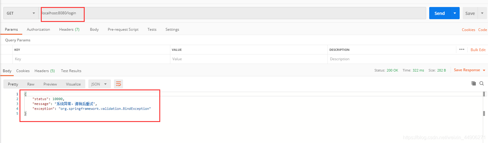
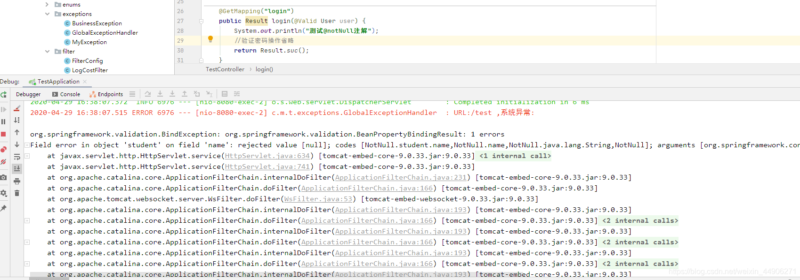
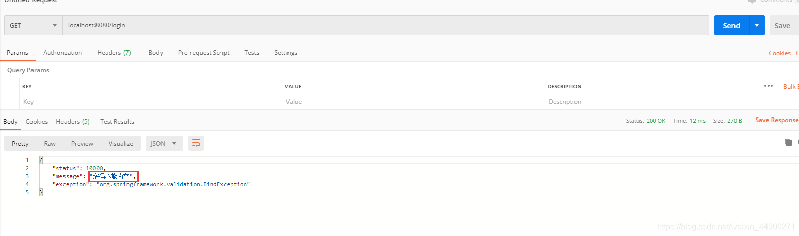

## NotNull 注解

1. 实体类需要判断的字段上面加上@NotNull注解，并且message配置提示语句

```java
@Data
public class User {

    private Integer id;
    @NotNull(message = "用户名不能为空")
    private String username;
    @NotNull(message = "密码不能为空")
    private String password;

    private String email;

    private String phone;

    private String idCard;

    private Byte sex;

    private Byte deleted;

    private Date updateTime;

    private Date createTime;
}

```

2. controller接口的方法参数加入@Valid注解，表示当前的实体类接收的参数需要根据配置的@NotNull注解判断

```java
    @GetMapping("login")
    public Result login(@Valid User user) {
		System.out.println("测试@notNull注解");
        //验证密码操作省略
        return Result.suc();
    }

```

3. 接口代码中省略判断登录名和密码是否为空，现在调一次接口测试一下

接口返回的数据是全局异常捕获到之后返回的数据，再看一下控制台



可以看到这里抛异常了，并且控制台没有打印在方法里面的设置的信息，所以可以看出方法没有走我们的业务代码，而是直接被全局异常捕获了，然后返回给了前端数据，所以需要在全局异常里面捕获一下当前异常，并且要让我们提示语句返回给前端，这样才是合理的

4. 配置全局异常捕获

```java
@RestControllerAdvice
@Slf4j
public class GlobalExceptionHandler  {
 	
    @ExceptionHandler(Throwable.class)
    public ErrorResult handleThrowable(Throwable e, HttpServletRequest request) {
        ErrorResult error =ErrorResult.fail(ResultCode.SYSTEM_ERROR, e);
        log.error("URL:{} ,系统异常: ",request.getRequestURI(), e);
        return error;
    }

    @ExceptionHandler(BindException.class)
    public ErrorResult exceptionHandler(BindException e, HttpServletRequest request) {
        String failMsg = e.getBindingResult().getFieldError().getDefaultMessage();
        ErrorResult error = ErrorResult.fail(ResultCode.SYSTEM_ERROR, e, failMsg);
        log.error("URL:{} ,绑定异常:{} ", request.getRequestURI(),failMsg);
        return error;
    }
}

```

需要捕获的是BindException，所以加上，重要的是String failMsg = e.getBindingResult().getFieldError().getDefaultMessage()这句代码，这是从这个异常里面拿到我们在实体类里面配置的提示语句，至于返回的VO对象，可以根据自己项目中的VO对象灵活修改，现在再重启看一下结果


可以看到已经返回了我们想要的样子，再试一下填写了用户名和密码可以正常执行业务代码吗

**现在是登录接口我们只需要判断username和password，如果是别的接口也是用User类接收的，但是username和password可以为空怎么办？**
在NotNull注解里面配置group，需要验证的时候，就在controller参数注解中加上这个groups名称

**怎么用？**

如下实体类User ，所有字段在create的时候都需要校验，createTime只是在update的时候才需要校验，注解如代码所示

```java
@Data
@Builder
public class User {
    @NotBlank(groups = Create.class,message = "name 不能为空")
    private String name;
    @NotNull(groups = {Update.class,Create.class},message = "createTime 不能为空")
    private String createTime;
    @NotNull(groups = Create.class,message = "status 不能为空")
    private Integer status;

    /* 分组校验 */
    public @interface Create {}

    /* 分组校验 */
    public @interface Update {}
}
```

校验在controller层，只需要在参数前面加上@Validated注解，分别配置需要校验的组

```java
@RestController
@RequestMapping("/group-valid-test")
public class GroupValidTest {
    @PostMapping
    public String create(@Validated(User.Create.class) @RequestBody User user){
        return "success";
    }

    @PutMapping
    public String update(@Validated(User.Update.class) @RequestBody User user){
        return "success";
    }

}
```


## Mybatis 多租户概念

`TenantLineInnerInterceptor` 是 MyBatis-Plus 提供的一个插件，用于实现多租户的数据隔离。通过这个插件，可以确保每个租户只能访问自己的数据，从而实现数据的安全隔离。

简单来说就是：若一个系统有两个客户，江铃，奇瑞。在数据库中添加一个tencent_id字段，该字段为1时数据库中的数据为江铃使用、否则奇瑞使用。使用多租户的配置可以在 **CRUD** 的时候自动添加上tencent_id = ? 的条件。

